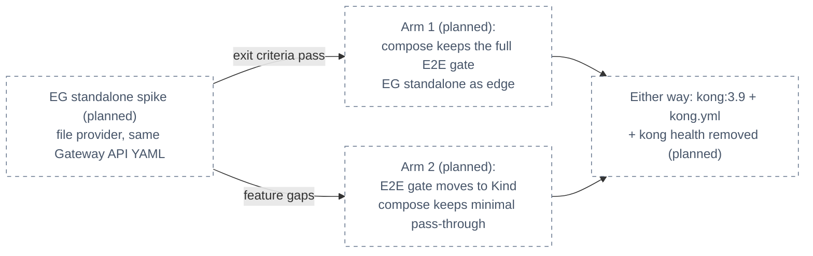

# ADR-046: Move the E2E release-audit gate to Kind if compose cannot carry the edge

> **Decision summary:** We will replace local-stack's compose gateway with an Envoy
> Gateway **standalone mode** spike — one container reading the **same Gateway API
> YAML as the cluster**, killing the second config dialect (`kong.yml`) — and, **if
> the spike fails** its exit criteria, move the E2E release-audit gate to Kind, where
> EG runs first-class, leaving compose with services plus a minimal pass-through. We
> accept a conditional record (its Adoption notes which arm was taken) and a possibly
> split local story in exchange for never maintaining a bespoke gateway dialect
> again. Either way, `kong:3.9`, the 283-line `kong.yml`, and the `kong health`
> healthcheck are removed.

| Attribute | Value |
|-----------|-------|
| **Status** | Accepted |
| **Decision date** | 2026-08-11 |
| **Owners** | `duynhne` |
| **Deciders** | `duynhne` |
| **Scope** | The local-stack gateway and where the E2E release-audit gate runs. Cluster delivery is untouched. |
| **Affected components** | `local-stack/compose.yaml` (`gateway` service + 11 `service_healthy` deps + frontend gate), `local-stack/gateway/kong.yml`, `local-stack/docs/e2e-audit.md` |
| **Related RFC** | [RFC-0024](../../rfc/RFC-0024/) |
| **Related research** | [research.md](../../rfc/RFC-0024/research.md) |
| **Related ADR** | [ADR-044](../ADR-044-envoy-gateway-platform-edge/) (the edge whose local story this decides) |
| **Supersedes** | — |
| **Superseded by** | — |
| **Implementation tracking** | RFC-0024 program — P6 train |
| **Adoption** | Complete — the standalone-spike arm was taken and passed: one EG container reads the same Gateway API YAML as the cluster and carried the full release audit twice (2026-08-12); kong.yml and the second dialect are gone; the Kind-fallback arm was never needed |

## Context

local-stack's gateway is a `kong:3.9` container driven by
`local-stack/gateway/kong.yml` — a 283-line file in Kong's bespoke declarative
dialect, a **second config language** that must be kept semantically in sync with the
cluster's manifests by hand. Eleven services gate on its `service_healthy` state (a
`kong health` healthcheck), and the frontend gates on the gateway. This compose stack
carries the platform's **E2E release-audit gate**
([`local-stack/docs/e2e-audit.md`](../../../../local-stack/docs/e2e-audit.md)): all
A/B/C rows are mandatory before any tag that touches a service repo, `pkg`, gateway
config, `compose.yaml`, or the SPA.

[ADR-044](../ADR-044-envoy-gateway-platform-edge/) removes Kong everywhere, so the
compose gateway must be replaced. Envoy Gateway offers a **standalone mode** (file
provider + host infrastructure, Docker-runnable) that reads Gateway API resources
from files — the same YAML dialect the cluster uses. The research's honest verdict:
standalone mode is **young and its maturity is unproven**
([research FAQ](../../rfc/RFC-0024/research.md#faq)) — the single criterion where
Kong beat EG in the 24-criteria review. The owner pre-approved a fallback rather
than letting this unknown block the migration: if standalone mode cannot carry the
gate, the gate moves to Kind, where EG runs in its first-class environment.

## Scope

### In scope

- What replaces the `gateway` compose service, and the spike that decides it.
- The spike's exit criteria and the pre-approved fallback arm.
- Where the E2E release-audit gate runs in each arm.
- The unconditional removals: `kong:3.9`, `kong.yml`, the `kong health` healthcheck.

### Out of scope

- The cluster edge and cutover — [ADR-044](../ADR-044-envoy-gateway-platform-edge/).
- Rate-limit semantics — [ADR-045](../ADR-045-local-first-edge-rate-limiting/) (the
  spike only proves local rate limiting *functions* under compose).
- The audit's row content (A/B/C assertions) — only its host environment may move.
- Compose's non-gateway topology (Postgres, Valkey, services, Temporal — ADR-039's
  territory).

## Decision drivers

| Priority | Driver | Why it matters |
|---------:|--------|----------------|
| 1 | One config dialect | The 283-line `kong.yml` is a hand-synced translation of the cluster's edge; every dialect is a drift surface. Standalone mode reading the cluster's own YAML removes the class of bug |
| 2 | Gate integrity | The E2E audit is the release gate; whatever replaces the compose gateway must exercise the real edge behavior (routes, JWT, rate limit, logs) or the gate must move to an environment that does |
| 3 | Evidence over hope | Standalone mode's maturity is the research's one honest unknown; a spike with explicit exit criteria decides, not optimism |
| 4 | Developer loop | `docker compose up -d --build` as a one-command bring-up is worth preserving where possible — but not at the price of a fake gate |

## Decision

We will **spike Envoy Gateway standalone mode** as the compose gateway: one
`envoyproxy/gateway:<pin>` container (file provider + host infrastructure) reading
the **same Gateway API YAML as the cluster** — eliminating the second config dialect.

**Spike exit criteria** (all must hold under compose):

1. All local routes function (every host/path/audience surface `kong.yml` serves today).
2. JWT verification against the local Keycloak realm works (`remoteJWKS`).
3. Local rate limiting functions (ADR-045's mechanism).
4. JSON access logs are emitted.
5. The container exposes a healthcheck the compose `depends_on` graph can consume
   (replacing the `kong health` gate for the 11 dependent services and the frontend).

**If the spike passes**, compose keeps the full E2E release-audit gate with EG
standalone as its edge. **If the spike fails** (standalone-mode feature gaps), the
**E2E release-audit gate moves to Kind** — where EG runs first-class — and
`local-stack/docs/e2e-audit.md` is re-scoped accordingly; compose keeps the services
plus a **minimal pass-through** for developer convenience only, explicitly not a
gate-bearing edge.

**Either way**, `kong:3.9`, the 283-line `kong.yml`, and the `kong health`
healthcheck are removed. This ADR is **conditional**: its **Adoption** row records
which arm was taken, with the spike evidence.

### Decision rules

| Rule | Required behavior |
|------|-------------------|
| **Config dialect** | The local gateway (whichever arm) is configured only by Gateway API YAML shared with or derived from the cluster's. No bespoke gateway dialect (`kong.yml` or successor) may be reintroduced. |
| **Gate placement** | The E2E release-audit gate runs wherever the real edge behavior runs: compose if the spike passes, Kind if it fails. A tag may never be gated on a pass-through that skips edge policy. |
| **Spike discipline** | The arm is chosen by the five exit criteria above, evidenced in the P6 PR — not by preference. Partial passes count as failure. |
| **Unconditional removal** | `kong:3.9`, `kong.yml`, and the `kong health` healthcheck are deleted in P6 regardless of arm. |
| **Dependency graph** | Services that gate on the gateway keep an explicit `depends_on` condition backed by a real healthcheck — never a sleep or retry loop. |
| **Record keeping** | The chosen arm, spike evidence, and audit re-scope (if any) are appended to this ADR's History when Adoption flips. |

### Decision view

## Alternatives considered

| Option | Benefits | Costs / risks | Result |
|--------|----------|---------------|--------|
| **A — EG standalone spike, Kind fallback for the gate** | Kills the second dialect if it works; a pre-approved, first-class landing zone if it does not; the unknown is bounded by explicit criteria | Conditional record; possibly split local story (compose for services, Kind for the gate) — accepted in advance | Selected |
| **B — Plain Envoy static config for compose** | Envoy static bootstrap is mature and battle-tested | A hand-written Envoy config is **a second dialect** — exactly the drift surface this migration escapes; every cluster policy change needs a manual translation | Rejected |
| **C — Keep Kong local only** | compose keeps working unchanged | Local edge diverges from the cluster's in product, dialect, and policy behavior; the E2E gate stops testing the real edge; keeps a frozen image on the release path | Rejected |
| **D — Kind-only development (drop compose)** | One environment, zero duplication | Kills the one-command `docker compose up` loop for everyday service development — a cost far beyond what the gateway question justifies | Rejected |

### Why the selected option won

Option A is the only option that never re-creates a second config dialect (driver 1)
while guaranteeing the gate always exercises real edge behavior (driver 2): if
standalone mode is ready, compose gets the cluster's own YAML; if it is not, the gate
moves to the environment where EG is first-class rather than being propped up by a
translation layer. The unknown that motivated the condition — standalone-mode
maturity — is resolved by a spike with pass/fail criteria (driver 3), and the
fallback was owner-approved in the RFC review, so a failed spike blocks nothing.

### Why the closest alternative lost

Option B is closest because it demonstrably works today — plain Envoy static config
is mature. But it wins the wrong contest: the platform is not escaping Kong the
product so much as escaping the **hand-synced second dialect**, and a bespoke Envoy
bootstrap file is that same liability with better internals. Every SecurityPolicy or
BTP change on the cluster would need a manual re-translation into static Envoy
config, reviving the exact drift class `kong.yml` represents — against a fallback
(Kind) that runs the identical manifests with zero translation.

## Consequences

### Positive consequences

- The second config dialect dies: no more hand-syncing a 283-line translation of the
  cluster's edge, in either arm.
- The E2E gate is guaranteed to exercise real Envoy Gateway behavior — routes,
  `remoteJWKS`, local rate limiting, JSON logs — wherever it lands.
- A frozen `kong:3.9` image leaves the release-critical path.
- The standalone-mode unknown is converted from a migration risk into a bounded,
  evidenced spike.

### Negative consequences and accepted trade-offs

- This record is conditional until the spike runs; consumers of the ADR index must
  read Adoption to know the as-built arm.
- If the fallback arm is taken, the local story splits: compose for day-to-day
  service development, Kind for the release gate — two environments where there was
  one, accepted in advance by the owner.
- In the fallback arm the release-audit loop gets heavier (Kind bring-up vs
  `docker compose up`), and `local-stack/docs/e2e-audit.md` must be re-scoped without
  weakening any A/B/C row.
- The compose `depends_on` graph must be rebuilt around a new healthcheck either way.

### Neutral consequences

- Services, Postgres, Valkey, and the Temporal topology (ADR-039) in compose are
  untouched.
- The audit's assertions themselves do not change — only their host environment may.
- Cluster delivery is unaffected in both arms.

## Implementation obligations

| Obligation | Owner | Tracking | Completion signal |
|------------|-------|----------|-------------------|
| Run the standalone spike against the five exit criteria; record evidence | platform | RFC-0024 P6 | Pass/fail per criterion in the P6 PR |
| Arm 1: EG standalone as the compose gateway; `depends_on` graph re-pointed at its healthcheck | platform | RFC-0024 P6 | Full A/B/C audit green on compose |
| Arm 2: E2E gate re-scoped to Kind in `local-stack/docs/e2e-audit.md`; compose reduced to services + minimal pass-through | platform | RFC-0024 P6 | Full A/B/C audit green on Kind; compose bring-up still one command |
| Remove `kong:3.9`, `local-stack/gateway/kong.yml`, and the `kong health` healthcheck (both arms) | platform | RFC-0024 P6 | No Kong reference remains in `local-stack/` |
| Flip Adoption and append the chosen arm + evidence to History | platform | this ADR | Adoption row names the arm |

## Validation and compliance

| Requirement | Verification |
|-------------|--------------|
| Spike criteria | Each of the five exit criteria has recorded pass/fail evidence in the P6 PR |
| Gate integrity | The full A/B/C audit passes in the chosen environment before any tag; a failed row blocks the tag (unchanged rule) |
| No second dialect | Repo check: no `kong.yml`, no hand-written Envoy bootstrap; the local gateway consumes Gateway API YAML only |
| No Kong residue | `local-stack/` contains no `kong:3.9` image, no `kong health` healthcheck |
| Dependency graph | Every gateway-dependent service gates on a real healthcheck condition in `compose.yaml` |

## Revisit triggers

Re-open this decision when one or more of the following become true:

- The fallback arm was taken and a later EG release closes the standalone-mode gaps —
  re-run the spike and consider moving the gate back to compose.
- The compose arm was taken but standalone mode proves flaky in practice (gate
  failures not reproducible on Kind, or vice versa).
- The Kind-based gate (if taken) measurably slows the release loop enough to distort
  tagging discipline.
- local-stack's role itself changes (e.g. the platform drops compose entirely).

A review does not automatically reverse the decision. A changed decision requires a
new ADR that supersedes this one.

## References

- [RFC-0024](../../rfc/RFC-0024/) — Design Details → local-stack and the E2E gate (decided fallback)
- [RFC-0024 research](../../rfc/RFC-0024/research.md) — standalone-mode verification (Context7 audit row), blast-radius local-stack row, FAQ on the one honest unknown
- [ADR-044](../ADR-044-envoy-gateway-platform-edge/) — the edge whose local story this decides
- [ADR-045](../ADR-045-local-first-edge-rate-limiting/) — the rate-limit mechanism the spike must prove locally
- [`local-stack/docs/e2e-audit.md`](../../../../local-stack/docs/e2e-audit.md) — the gate whose placement this ADR conditions

## History

| Date | Status / adoption | Change |
|------|-------------------|--------|
| 2026-08-10 | Proposed / Not started | Proposed inside the RFC-0024 review |
| 2026-08-11 | Accepted / Not started | Accepted with RFC-0024; numbering assigned 044–046 because ADR-039/040 were consumed by unrelated decisions (RFC text had said 045–047) |

---
_Last updated: 2026-08-11_
