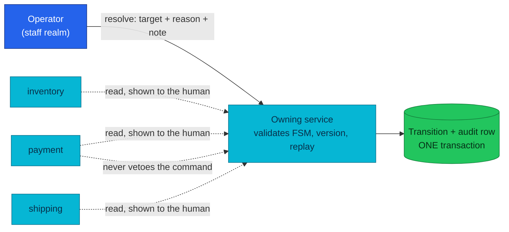

# ADR-051: Trust the Operator and Make the Audit Trail the Control

> **Decision summary:** We will let a `backoffice_admin` operator move an order
> out of `manual_review` on their own judgement, because the evidence for that
> judgement lives outside the platform and no service can check it. We accept
> that a wrong or dishonest decision is possible in exchange for an operator path
> that is validated, attributed, audited, and — unlike a cross-service veto —
> still available during the incidents that create the queue.

| Attribute | Value |
|-----------|-------|
| **Status** | Accepted |
| **Decision date** | 2026-08-14 |
| **Owners** | `platform` |
| **Deciders** | `platform owner` |
| **Scope** | Privileged operator commands whose effect the platform cannot verify, starting with the order `manual_review` resolution |
| **Affected components** | order-service, admin-service (Admin Portal), observability runbooks |
| **Related RFC** | [RFC-0023](../../rfc/RFC-0023/) |
| **Related research** | [research.md](../../rfc/RFC-0023/research.md) |
| **Supersedes** | — |
| **Superseded by** | — |
| **Implementation tracking** | order-service#199, admin-service#10 |
| **Adoption** | Complete |

## Context

An order reaches `manual_review` when the fulfilment or cancellation saga
finished but could not assert a truthful terminal state: a compensation exhausted
its retries, or the terminal bookkeeping write itself failed. The state exists
precisely because **something is unaccounted for** — a charge that was not
refunded, stock that was neither committed nor released, a shipment that may or
may not be moving.

Nothing automatic touches these orders. The FSM permits only an `OPERATOR` to
leave `manual_review`, and until now no operator surface existed: the documented
path was a `BEGIN … COMMIT` block in
[the runbook](../../../observability/runbooks/microservices/OrderManualReviewBacklog.md)
that the operator ran against Postgres by hand — reading the version, writing the
history row, applying a guarded update. That path has no validation, no role
gate, no metric, and no protection against a typo in a money-bearing table.
[ADR-047](../ADR-047-protected-apis-on-owning-services/) named it as the raw-SQL
path protected APIs exist to retire, and RFC-0023 deferred it on 2026-08-10
specifically because *how much to trust the operator* deserved its own decision.

The pressure is that the decision cannot be avoided by building more
verification. Settling the unaccounted effect happens through a payment
provider's console, a carrier's portal, a warehouse — outside the platform's
knowledge. Whatever the endpoint checks, the sentence "the world now matches
`cancelled`" is a human claim.

## Scope

### In scope

- Whether the resolution command requires machine-checkable evidence, and what
  the platform substitutes for evidence it cannot obtain.
- What every such command must record, and where that record must be visible.
- Which validation the owning service is still obliged to perform.
- The precedent this sets for future operator commands over unverifiable effects.

### Out of scope

- A second operator role, or maker-checker approval — that needs a role split in
  the staff realm ([ADR-050](../ADR-050-separate-staff-identity-realm/)) and is
  its own decision.
- Performing the side effects from the portal (issuing the refund, releasing the
  stock, cancelling the shipment). Those remain deferred by RFC-0023.
- The `cancelling` backlog, whose escalation is a workflow-failure path, not an
  operator judgement.

## Decision drivers

| Priority | Driver | Why it matters |
|---------:|--------|----------------|
| 1 | Availability of the operator path | This queue fills *during* incidents. A command that depends on the health of payment, inventory or shipping is unavailable exactly when the backlog needs draining |
| 2 | Accountability | If the platform cannot check the decision, it must at minimum be able to say who made it, what they claim to have settled, and what they checked |
| 3 | Honesty of the guarantee | Better to state plainly that a step is trusted than to imply verification that is partial and can be routed around |
| 4 | Retiring the raw-SQL path | Every day the runbook remains the documented path is a day an unvalidated write to `orders` is normal practice |

## Decision

We will treat the operator as **trusted** for the resolution decision, and make
the audit record the control on it.

The owning service validates everything it genuinely owns — the target is one of
the four states the FSM and actor matrix permit from `manual_review`, the version
the operator read is still current, the command has not already been applied —
and refuses anything else. It does **not** consult payment, inventory or shipping
to veto a target. In exchange, every resolution carries an actor taken from the
verified token, a bounded reason naming which unaccounted effect was settled, and
a mandatory free-text note recording what the human checked; all three commit in
the same transaction as the transition.

The substitute for verification is **informed judgement**: the surface that
issues the command must show the operator the external truths first — the
payment, the reservation, the shipment, and where the saga stopped — and must
show the resulting audit trail. A soft-failed read renders as *unavailable*, never
as absence, so the operator can tell "there is nothing to settle" from "I do not
know yet".

### Decision rules

| Rule | Required behavior |
|------|-------------------|
| **Ownership** | The owning service is authoritative; it validates the FSM edge, the actor matrix, the expected version, and command replay |
| **Write path** | `POST /{service}/v1/protected/…` under the staff-realm chain and `backoffice_admin`; the raw-SQL block survives only as documented break-glass |
| **Evidence** | The command carries a **bounded reason** naming the settled effect plus a **mandatory note**. Neither is optional; a command whose evidence lives outside the platform has no other record |
| **Actor** | The token `sub`, never the request body |
| **Read path** | The issuing surface shows the external truths and the audit trail on the page where the command is offered; failed reads render as unavailable, distinctly from absence |
| **Boundary** | No cross-service call may **refuse** the command. Cross-service reads are for the human to weigh, not for the service to veto |
| **Failure behavior** | The audit row and the transition commit together; a failed audit fails the command. A committed transition is never rolled back by a later read failure |
| **Compatibility** | Reason vocabularies are additive; the unspecific catch-all code stays valid so historical rows and break-glass SQL remain readable |

### Decision view

## Alternatives considered

| Option | Benefits | Costs / risks | Result |
|--------|----------|---------------|--------|
| **A — Trust the operator; audit is the control** | Available during incidents; honest about what is guaranteed; cheapest to build on existing plumbing | A wrong or dishonest decision applies; detection is after the fact, by reading the trail | **Selected** |
| **B — Read payment/inventory/shipping and refuse a contradictory target** | Blocks the most obvious mistake (closing an order whose refund never landed) | Unavailable exactly when needed — a payment outage blocks draining the queue; only ever partial, since the platform cannot see a provider-console refund; and it is a *revisit trigger* of ADR-047, not an application of it | Rejected |
| **C — Maker-checker: one proposes, another approves** | Strongest accountability; standard for money-adjacent operations | Needs a second staff-realm role and a pending-command store; unverifiable with one operator, so the second signature would be the same person | Rejected (revisit trigger) |
| **D — Keep the raw-SQL runbook** | No work | No validation, no role gate, no metric, no protection against a mistyped id in a money-bearing table | Rejected (status quo) |

### Why the selected option won

Driver 1 eliminates option B outright: an operator surface whose availability
depends on payment-service is not an incident tool. Beyond availability, B buys
less than it appears to — it can only compare against what the platform already
knows, so the common real case (a refund issued in the provider's console) reads
as a contradiction and would be refused, teaching operators to route around the
endpoint. Option A gives up a check the platform could never complete, and spends
the effort instead on the two things that do work: bounded, attributed evidence
in the same transaction, and a page that puts the external truths in front of the
human before they choose.

### Why the closest alternative lost

C is not wrong — it is the right answer at a different scale. Maker-checker
converts a trusted decision into a reviewed one, which is exactly what a real
operations team wants for money movement. It fails here for a concrete reason
rather than complexity: the platform has one operator identity, so the second
signature would be produced by the same human, and the control would be
ceremonial. It becomes correct the moment a second operator role exists — which
is why that is a revisit trigger rather than a rejection on principle.

## Consequences

### Positive consequences

- The platform's last raw-SQL runbook step is retired; the documented path is
  validated, role-gated, attributed, idempotent, and observable.
- Every resolution answers *who*, *which effect was settled*, and *what was
  checked* — the previous path answered none of these unless the operator
  remembered to write a note by hand.
- The operator path stays available during payment, inventory and shipping
  outages, which is when the queue grows.
- The reason vocabulary makes "we recovered the money" distinguishable from "we
  wrote it off", so the backlog becomes analysable rather than just drainable.

### Negative consequences and accepted trade-offs

- A wrong decision applies. There is no pre-commit control; detection is
  retrospective, by reading the trail.
- The note's usefulness depends on operator discipline. It is mandatory but its
  content cannot be validated; a note of "ok" satisfies the schema.
- Every operator remains superuser-shaped, inheriting the coarse-role trade-off
  ADR-047 already accepted.
- The break-glass SQL still exists, and using it skips the metric and the
  validation. The runbook must say so plainly rather than presenting the two
  paths as equivalent.

### Neutral consequences

- The case view grows a cross-service read fan-out. It reuses the soft-fail
  aggregation the customer detail path already performs, so no new dependency
  edge appears in the call graph.
- Future operator commands over unverifiable effects (refunds, forced shipment
  transitions) now have a precedent to follow or to argue against.

## Implementation obligations

| Obligation | Owner | Tracking | Completion signal |
|------------|-------|----------|-------------------|
| Resolution endpoint with bounded reason, mandatory note, actor from token, audit-in-transaction | order-service | order-service#199 | Handler + integration tests green; the domain command has a caller |
| Expected-version precondition enforced under the row lock | order-service | order-service#199 | A version the order is not at is refused, proven by a mutation check |
| Case view shows the external truths and the transition history | order-service, admin-service | order-service#199, admin-service#10 | Four blocks render, `degraded` distinct from absence |
| Resolve command in the portal with a mandatory justification | admin-service | admin-service#10 | Playwright asserts the refusal, the transition, and the audit entry |
| Runbook demotes the SQL block to break-glass | homelab | this PR | Recovery step names the endpoint first and marks SQL as skipping validation and metrics |
| Update service contracts | homelab | `docs/api/order.md` | Route table lists the command; no "Future command" wording remains |

## Validation and compliance

| Requirement | Verification |
|-------------|--------------|
| Only the four FSM targets are reachable | Domain tests over every legal and illegal target |
| The actor is the token subject | Handler test: a body-supplied actor is ignored; audit row carries the token `sub` |
| Evidence is mandatory and bounded | Handler tests: no note ⇒ 400; a reason from another command's vocabulary ⇒ 400 |
| Audit atomicity | Repository integration test against real Postgres: a refused command writes zero history rows |
| The version means something | Integration test: a version the order is not at ⇒ conflict, no state change; mutation check confirms the test fails without the precondition |
| No cross-service veto | Case view answers `200` with `degraded` when a dependency is down, and the command still applies |
| End to end through the edge | Compose E2E audit row **A20**: a real declined refund parks an order, resolve through the gateway, replay is a no-op, customer token is wrong-issuer at the edge |
| Documentation | `docs/api/order.md` and the runbook link this ADR |

## Revisit triggers

Re-open this decision when one or more of the following become true:

- A second operator role exists, making maker-checker a real control rather than
  a ceremony (see option C).
- Resolutions become frequent enough to be routine rather than exceptional — the
  premise here is a rare, investigated decision, not a daily workflow.
- An audit or compliance requirement demands pre-commit approval for
  money-adjacent state changes.
- The platform gains authoritative visibility into the external effects (for
  example a provider webhook that reconciles console-issued refunds), which would
  make option B's veto both possible and non-partial.
- A resolution is found to have been wrong in a way the trail could not explain,
  which would mean the recorded evidence is insufficient.

A review does not automatically reverse the decision. A changed decision requires
a new ADR that supersedes this one.

## References

- [RFC-0023](../../rfc/RFC-0023/) · [research](../../rfc/RFC-0023/research.md)
- [ADR-047](../ADR-047-protected-apis-on-owning-services/) — the protected-API
  conventions this decision applies
- [ADR-050](../ADR-050-separate-staff-identity-realm/) — the workforce realm the
  operator authenticates against
- [ADR-033](../ADR-033-order-status-cancellation/) — the cancellation FSM whose
  exhaustion paths create this queue
- [`docs/api/order.md`](../../../api/order.md) — the as-built contract
- [OrderManualReviewBacklog runbook](../../../observability/runbooks/microservices/OrderManualReviewBacklog.md)
- [local-stack E2E audit](../../../../local-stack/docs/e2e-audit.md) — row A20

## History

| Date | Status / adoption | Change |
|------|-------------------|--------|
| 2026-08-14 | Proposed / Not started | Safety review RFC-0023 deferred on 2026-08-10; three options put to the owner |
| 2026-08-14 | Accepted / Complete | Accepted with the RFC-0023 amendment; order-service#199 and admin-service#10 implement it, gated by audit row A20 |

---
_Last updated: 2026-08-14_
