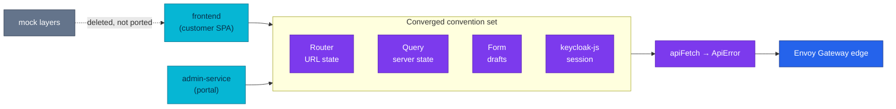

# ADR-052: Converge the Customer SPA on the Admin Portal's Stack

> **Decision summary:** We will rewrite the customer SPA onto the Admin Portal's
> stack — TypeScript, TanStack Router/Query/Table/Form with zod, Tailwind v4 +
> shadcn on Base UI, tested mock-free against the live edge — in one cutover,
> because the platform is paying to invent and verify every frontend convention
> twice. We accept rewriting every screen at once, with no unit tests underneath,
> in exchange for one set of answers to where state lives.

| Attribute | Value |
|-----------|-------|
| **Status** | Accepted |
| **Decision date** | 2026-08-15 |
| **Owners** | `platform` |
| **Deciders** | `platform owner` |
| **Scope** | The customer SPA's application architecture: language, routing, server state, forms, styling system, and test truth |
| **Affected components** | `frontend` (customer SPA), `local-stack` E2E audit Phase B, platform docs that assert the SPA's stack |
| **Related RFC** | [RFC-0025](../../rfc/RFC-0025/) |
| **Related research** | [research.md](../../rfc/RFC-0025/research.md) |
| **Supersedes** | — |
| **Superseded by** | — |
| **Implementation tracking** | RFC-0025 trains R1–R7 |
| **Adoption** | Complete |

## Context

The platform ships two React SPAs. The Backoffice (`admin-service`) was built during
RFC-0023 on a deliberately chosen, narrow toolchain: TypeScript strict, TanStack
Router/Query/Table/Form with zod, Tailwind v4 + shadcn on Base UI, keycloak-js, and
Playwright against the real compose stack with no mocks anywhere. The customer SPA
(`frontend`) predates all of it: JavaScript/JSX, react-router 7 declarative, SWR over
an axios interceptor stack, hand-rolled forms with no schema, a 1 205-line stylesheet
that describes itself as an "API Test Harness", and **two** mock layers — an in-app
store behind `VITE_USE_MOCK` and Playwright `page.route()` handlers.

[ADR-049](../ADR-049-admin-portal-tanstack-spa/) chose the portal's stack knowing
this, and wrote the cost down rather than hiding it:

> "Two frontend convention sets in the platform **until/unless the customer SPA
> converges** — a real maintenance and review tax, accepted knowingly."

It also named the condition for closing the debt, as a revisit trigger:

> "The customer SPA completes a migration onto an overlapping stack — then converge
> conventions deliberately."

The pressure to act now is that the tax has started compounding in observable ways.
Each platform convention introduced by the backend trains — the shared `{error, code}`
envelope, idempotent commands, protected-route conventions, URL-as-state — gets
implemented and verified twice, in two idioms. And the storefront's mock layers have
already drifted from the contract in a way that shipped: its E2E `/details` handler
still returns the retired `stock` block while the application moved to `availability`,
so that suite has been passing against a fiction it maintains itself.

## Scope

### In scope

- The customer SPA's language, router, server-state layer, form layer, styling
  system, icon set, linter, and what its test suite runs against.
- Whether the cutover is atomic or incremental.
- Whether any mock layer survives.

### Out of scope

- The browser auth model. [ADR-043](../ADR-043-oidc-browser-workload-trust/) stands:
  keycloak-js, PKCE S256, in-memory tokens, the `customer-spa` realm client.
- Backend contracts, the edge, the realm, CORS, and the serving model (Vite → `dist/`
  → nginx :80 with `/health`, four build ARGs baked at image build).
- The Admin Portal. Conventions flow one way; `admin-service` is not touched.
- Visual design direction itself — decided in RFC-0025's R1 with the owner, not here.

## Decision drivers

| Priority | Driver | Why it matters |
|---------:|--------|----------------|
| 1 | One answer per question | "Where does URL state live? server data? drafts? the session?" should have one answer platform-wide, not one per repository |
| 2 | Test truth | A suite that can pass while the real contract is broken is not a gate — and this one already did |
| 3 | Review and onboarding cost | Every reviewer and every future agent context-switching between the two repos re-learns the same four things in a second idiom |
| 4 | Product quality | The storefront is the customer-facing surface and is styled like a test harness; the portal already carries a design system it can share |
| 5 | Reversibility | Whatever we choose must keep one clean rollback point, because this is the shop |

## Decision

We will rewrite the customer SPA onto the Admin Portal's stack, in a single cutover,
and delete the mock layers rather than porting them.

The application libraries converge exactly: TypeScript strict (including
`noUncheckedIndexedAccess`), TanStack Router file-based with zod `validateSearch`,
TanStack Query over one `apiFetch` wrapper that raises the shared `ApiError`
envelope, TanStack Form + zod for drafts, TanStack Table only where a screen is
genuinely a table, Tailwind v4 with the shadcn `base-nova` preset on Base UI
primitives (`render`, never `asChild`), `lucide-react`, and `oxlint` at zero
warnings. Playwright runs against the live compose stack with `@axe-core/playwright`
and no request interception.

Everything outside the application code is deliberately held still: the auth adapter,
the serving container, the build-arg contract, the realm client, the edge and every
backend contract. The storefront is redesigned on the shared token system — a
decision about *product*, taken with the owner in RFC-0025 R1 — but the decision
recorded here is about *architecture*.

### Decision rules

| Rule | Required behavior |
|------|-------------------|
| **One authority per state type** | URL ↔ Router (`validateSearch` + zod); server data ↔ Query, never copied into component state or a store; drafts ↔ Form; session ↔ keycloak-js |
| **One transport** | Exactly one `apiFetch`; no second HTTP client, no per-module interceptor stack; every `queryFn` threads its `signal` |
| **One error envelope** | `ApiError { status, code, message }`; operator/customer copy derives from `code`, never from a raw message |
| **No mocks** | No in-app mock store, no `page.route()` interception, no mock auth adapter. Screens without a shipped backend slice render an explicit awaiting state |
| **One UI foundation** | shadcn `base-nova` on Base UI; `src/components/ui/*` stays pristine and is customised at call sites |
| **Atomicity** | No half-migrated state reaches `main`: the old stack is removed in the same branch that introduces the new one |
| **Compatibility** | The auth model, serving model, build-arg contract and all backend contracts are unchanged; a convergence that needs a backend change is out of scope by definition |

### Decision view

## Alternatives considered

| Option | Benefits | Costs / risks | Result |
|--------|----------|---------------|--------|
| **A — Full convergence, single cutover** | One convention set; storefront gains typing, cancellation, URL-as-state, a design system; mock drift becomes impossible | Every screen rewritten at once with no unit tests; audit Phase B must be rewritten; redesign removes the before/after comparison | **Selected** |
| **B — UI layer only** (the owner's 30/07 draft: TS + Tailwind + shadcn, keep react-router/SWR/axios) | Much smaller; keeps an interceptor stack that works; lower risk per screen | Buys only the visible half — the divergence that costs review time lives inside the layers it keeps | Rejected |
| **C — Leave the storefront as it is** | Zero cost today | ADR-049's accepted debt compounds; every convention implemented and verified twice; the mock layers keep drifting | Rejected |
| **D — New repository, new SPA** | Greenfield; no migration mechanics | Loses history and a working build/deploy contract; two deploy targets during the overlap; the storefront's real behaviour is documented only *in* the code being discarded | Rejected |
| **E — Strangler: both routers behind edge path rules** | Incremental, per-screen rollback | Two routers cannot share one browser history in a bundle, so the seam becomes two nginx containers with a duplicated shell — more moving parts than the thing being replaced | Rejected |

### Why the selected option won

Drivers 1 and 2 are only satisfied by moving the layers where the divergence lives.
Option B is the honest competitor and it fails driver 1 specifically: after it, both
apps still answer "where does server data live?" differently, so the review tax
ADR-049 recorded stays. On driver 2, only the selected option removes the condition
that let a passing suite hide a contract drift — keeping any mock layer keeps a
second source of truth, which is precisely how the `stock`/`availability` drift
survived.

### Why the closest alternative lost

B is cheaper, lower risk, and it is the owner's own earlier plan — it deserves the
argument. It loses because the expensive part of two convention sets is not the CSS.
It is that a change to a shared platform convention has to be designed twice, and a
reviewer has to hold two mental models to check it. B leaves both of those in place
while spending most of the migration effort anyway: a UI-layer rewrite already
touches every screen. Having paid that, stopping short of the layers underneath buys
a second migration later at full price.

## Consequences

### Positive consequences

- One convention set: the next platform convention is implemented once, reviewed
  once, and verified once.
- The storefront gains request cancellation, strict typing, validated search params
  and a shared design system — three of which it has never had.
- "Green" means the same thing in both frontend repositories.
- The mock layers, and the class of bug where tests pass against a fiction, are gone.
- A small security improvement falls out: today the auth module imports mock seed
  identity data unconditionally, so it ships in the production bundle.

### Negative consequences and accepted trade-offs

- Every screen is rewritten at once, and the repository has **no unit tests** — the
  only safety net is Playwright against compose.
- Audit Phase B must be rewritten because it asserts on SPA internals; a stale
  Phase B blocks the release gate.
- The redesign removes the visual before/after comparison, so review judges screens
  against an approved direction rather than against the old UI.
- Deleting the mock layer is a **one-way door**: restoring in-app mocks later means
  writing new ones. Chosen deliberately, not discovered.
- Local development now requires the compose stack to be up. That is already true
  for the Admin Portal.

### Neutral consequences

- The repository keeps its name, history, image name, serving model and build-arg
  contract; only the pinned tag moves.
- `admin-service` gains nothing and loses nothing; it was already the reference.
- The owner's 30/07 cutover draft stays valid where it is not superseded (big-bang
  single merge, TypeScript strict everywhere, one shadcn foundation, no MSW).

## Implementation obligations

| Obligation | Owner | Tracking | Completion signal |
|------------|-------|----------|-------------------|
| Design direction approved before UI code | owner + platform | RFC-0025 R1 | Sitemap/IA, token set and three wireframes signed off |
| Foundation: TS strict, router plugin, `src/lib`, shadcn `base-nova`, oxlint | frontend | RFC-0025 R2 | `tsc --noEmit` and `oxlint` clean on an empty-but-wired app |
| Screens migrated train by train against the live stack | frontend | RFC-0025 R3–R6 | Each train's Playwright specs pass with no mocks |
| Old stack deleted in the same branch | frontend | RFC-0025 R6 | No react-router / SWR / axios / react-hot-toast / mock files remain |
| Audit Phase B rewritten | homelab | RFC-0025 R7 | B1–B4 pass against the new shell; the three identity assertions unchanged |
| Platform docs corrected | homelab | RFC-0025 R7 | `docs/api/microservices.md` § frontend no longer claims a JWT in `localStorage` |
| Tag pinned after the gate | homelab | RFC-0025 R7 | `frontend-rs.yaml` moves; full audit evidence recorded on the PR |

## Validation and compliance

| Requirement | Verification |
|-------------|--------------|
| One authority per state type | Review: no server data in `useState`; no second HTTP client; search params parsed by a zod schema on the route |
| No mocks anywhere | Repository grep: no `VITE_USE_MOCK`, no `page.route(`, no mock auth adapter; Playwright runs against compose |
| Auth model unchanged | Audit Phase B: PKCE origin change, no JWT-shaped value in either web storage, logout is one GET to end-session with no POST to any service |
| Contracts unchanged | Phase A A1–A20 pass without modification |
| Accessibility | axe: no serious or critical violations on every route — catalog (which is now the home page), product detail, cart, checkout, orders, order detail, notifications, profile, login |
| Atomicity | `main` never contains a half-migrated state — one merge, one tag |
| Documentation | `docs/api/microservices.md` and the platform docs match the as-built SPA |

## Revisit triggers

Re-open this decision when one or more of the following become true:

- The TanStack stack stops fitting the storefront's workload — for example if the
  shop needs SSR for SEO or first-paint reasons, which a static SPA cannot provide.
- A third frontend appears with different needs, making "one convention set" a
  constraint rather than a saving.
- The absence of unit tests proves insufficient — if Playwright-against-compose lets
  a regression reach a tag, the testing decision needs revisiting on its own.
- Requiring a live compose stack for local development measurably slows work down.

A review does not automatically reverse the decision. A changed architectural
decision requires a new ADR that supersedes this one.

## References

- [RFC-0025](../../rfc/RFC-0025/) · [research](../../rfc/RFC-0025/research.md)
- [ADR-049](../ADR-049-admin-portal-tanstack-spa/) — the portal stack this converges on, and the revisit trigger being exercised
- [ADR-043](../ADR-043-oidc-browser-workload-trust/) — the browser auth model held unchanged
- [ADR-048](../ADR-048-admin-portal-no-bff/) — direct-to-edge calling, which both SPAs follow
- [`docs/api/api.md`](../../../api/api.md) — the contracts the SPA consumes
- [`local-stack/docs/e2e-audit.md`](../../../../local-stack/docs/e2e-audit.md) — Phase B, rewritten by this work

## History

| Date | Status / adoption | Change |
|------|-------------------|--------|
| 2026-08-15 | Proposed / Not started | Opened with RFC-0025; owner decisions recorded up front (full stack not UI-only, no mocks, redesign, design direction approved before UI code) |

---
_Last updated: 2026-08-15_
