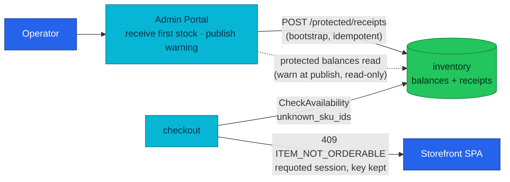

# ADR-053: Treat the Untracked SKU as Operator Data, Not an Outage

> **Decision summary:** We will make the operator the owner of a new SKU's first
> inventory balance — the Backoffice must let a `RECEIVE` reach a SKU that has no
> balance row yet, and must warn at publish when one is missing — and we will
> change checkout to answer a basket holding an untracked SKU with
> `409 ITEM_NOT_ORDERABLE` on a requoted session instead of a retryable `503`,
> because a condition that outlasts every retry is a conflict with the catalog's
> current state, not an availability blip. We accept that checkout and the
> storefront cut over together (the platform is pre-deployment — no
> compatibility window exists or is needed), and that an unbuyable ACTIVE
> product remains *possible* (warned, not gated), in exchange for a bootstrap
> path an operator can actually reach and a wire contract the storefront can
> finally word.

| Attribute | Value |
|-----------|-------|
| **Status** | Accepted |
| **Decision date** | 2026-08-19 |
| **Owners** | `platform` |
| **Deciders** | `platform owner` |
| **Scope** | Who creates the first `inventory_balances` row for a new catalog SKU, and what checkout answers while none exists. Not the reservation model, not the availability classification, not variants/SKU modelling. |
| **Affected components** | admin-service (Admin Portal), checkout-service, frontend (storefront SPA), `docs/api/` contracts, observability runbook |
| **Related RFC** | — (standalone; grew out of [RFC-0023](../../rfc/RFC-0023/) slice B and [RFC-0021](../../rfc/RFC-0021/)) |
| **Related research** | [RFC-0023 research](../../rfc/RFC-0023/research.md) ("fixing commands … with zero callers"); the 2026-08-18 products/35 live investigation (evidence on [homelab#800](https://github.com/duynhlab/homelab/pull/800)) |
| **Supersedes** | — |
| **Superseded by** | — |
| **Implementation tracking** | the [microservices.md known-gaps row](../../../api/microservices.md#6-known-gaps--ongoing-work) (no repo issues by owner convention); work lands directly in admin-service / checkout-service / frontend |
| **Adoption** | Partial — shipped and compose-verified (checkout 0.9.0, frontend 3.2.0, admin 0.4.0; audit row A21); the cluster deployment is pinned but unverified until the Kind gate |

## Context

A product created through the Backoffice Catalog gets no inventory balance row,
and nothing ever creates one. [RFC-0021](../../rfc/RFC-0021/) retired the
product-side stock column and the phase-2 backfill; balances since arrive only
from the dev seed (SKUs 1–13) or an explicit `RECEIVE` movement.
[`docs/api/inventory.md`](../../../api/inventory.md#known-gaps) records the result
honestly: *"there is no automated path that notices a new catalog SKU and gives
it a balance … nothing prevents the state."*

RFC-0023 slice B turned that recorded gap into a daily hazard: the portal can now
**create and publish** products at will, and every one of them is unbuyable until
someone issues a receipt. The portal cannot issue that receipt itself — its
Receive/Adjust dialogs are row-scoped on the balances table
(`admin-service/src/features/inventory/stock-command-dialogs.tsx`: the dialog
takes a `Balance | null` and reads `sku_id`/`warehouse_id` from the row), so a
SKU with no row never appears and the only bootstrap is a raw API call.

The shopper-facing half was verified live on 2026-08-18 (products/35): the
storefront correctly shows "Availability unknown" and keeps the item purchasable
(per [product.md](../../../api/product.md) — a degraded read must not lose a
sale), the cart correctly accepts it (availability-blind by contract), and
checkout correctly fails closed — but it fails as
`503 Service Unavailable` + `Retry-After: 2` with body code `INTERNAL_ERROR`,
**the same status and the same code as a transient upstream blip or any
unexpected server failure**. [`checkout.md`](../../../api/checkout.md) documents
both 503 flavours in one table cell and itself calls this one *persistent*. The
SPA's error-copy helper therefore falls through to the generic
"Service temporarily unavailable" for a condition no amount of retrying will
ever clear, and its retry affordance is a lie.

Two facts make this one decision rather than two: the condition is *data* the
operator owns (the fix is a receipt, says the
[runbook](../../../observability/runbooks/microservices/CheckoutAvailabilityUnknownSKU.md)),
and the wire must say so (the shopper's client cannot distinguish "wait" from
"this item may never be orderable" today). Deciding the ownership without fixing
the contract leaves the SPA lying; fixing the contract without an ownership
decision leaves nobody able to act on what it now says.

## Scope

### In scope

- Ownership of the first `inventory_balances` row for a new catalog SKU.
- The Backoffice affordances that make that ownership real (bootstrap receipt,
  publish-time warning).
- Checkout's wire answer for a basket containing an untracked SKU, at session
  create and at confirm.
- The storefront copy for that answer.

### Out of scope

- The availability classification itself (`UNKNOWN` vs `OUT_OF_STOCK` —
  [ADR-027](../ADR-027-inventory-sole-stock-authority/) /
  [inventory.md](../../../api/inventory.md) stand unchanged).
- The reservation model and saga gate
  ([ADR-028](../ADR-028-inventory-reservation-model/); `Reserve` still answers
  `FailedPrecondition`/`SKU_NOT_FOUND` if anything slips past checkout).
- Transient-failure semantics: upstream blips keep `503` + `Retry-After`,
  retry-with-the-same-key ([ADR-010](../ADR-010-shared-idempotency-library/)).
- Variants/SKU modelling (out of scope since RFC-0023; a future RFC).
- Cart behavior (availability-blind by contract; unchanged).

## Decision drivers

| Priority | Driver | Why it matters |
|---------:|--------|----------------|
| 1 | The shopper must be able to tell "wait" from "won't help" | A retry affordance on a persistent condition burns trust and support time; revenue loss with no error rate to show for it (runbook) |
| 2 | The fix path must be reachable by the person who owns it | The receipt command exists, is idempotent and audited (ADR-047), and has **zero** operator-reachable callers for an untracked SKU |
| 3 | Service boundaries stay as decided | ADR-027 (sole stock authority) and RFC-0023's "Product changes Product; Inventory changes Inventory" are load-bearing; no new coupling |
| 4 | Wire semantics should match RFC 9110 | 409 "indicates that the request conflicts with the current state of the target resource"; 503 is defined by "a temporary overload or scheduled maintenance" — a permanent data gap sits outside 503's defining characteristic |
| 5 | Smallest change surface | Only one error case changes status; the requote shape it adopts is one clients already handle for `409 STOCK_UNAVAILABLE` |

## Decision

The **operator owns the untracked SKU**, and the **wire calls it a conflict**:

1. The first balance for a new SKU is created by an operator `RECEIVE` through
   `POST /inventory/v1/protected/receipts` — already implemented, idempotent,
   actor-attributed (ADR-047). This ADR makes that path *normative* for
   bootstrap and obliges the portal to expose it for SKUs that have no balance
   row yet (an explicit "receive first stock" affordance, not a row action).
2. The portal **warns at publish** when the product being published has no
   balance row (a read-only protected balances check). Publishing stays
   allowed — the warning makes the state visible at the moment it is created,
   without coupling product's lifecycle to inventory.
3. Checkout answers a basket holding an untracked SKU with
   **`409 ITEM_NOT_ORDERABLE`** and the requoted session attached (dropped back
   to `shipping_set`, idempotency key not consumed) — the same shape as
   `409 STOCK_UNAVAILABLE`, under a distinct code because the operator action
   it calls for is different (receive stock, not wait for restock).

### Decision rules

| Rule | Required behavior |
|------|-------------------|
| Ownership | The operator owns balance bootstrap, through inventory's receipts command. No automated path creates balances. |
| Write path | `POST /inventory/v1/protected/receipts` accepts any `sku_id`, tracked or not (as built); the Admin Portal must offer it for untracked SKUs. |
| Read path | The portal warns at publish via the protected balances read (`GET /inventory/v1/protected/balances?sku_id=…`, read-only; `total_items == 0` ⇔ untracked). `BatchGetAvailability` — named here originally — is gRPC-only and unreachable from a browser SPA (ADR-048: no BFF). |
| Boundary | product-service never calls inventory on a lifecycle transition; publish is never gated on stock. |
| Failure behavior | Untracked SKU at confirm → `409 ITEM_NOT_ORDERABLE` with the session requoted to `shipping_set`, key not consumed; at session create → a flat `409 ITEM_NOT_ORDERABLE` (no session exists yet to requote). Neither carries `Retry-After`. Transient upstream failure → `503` + `Retry-After`, retry with the same key. SKU ids stay in the log and span, never the body. |
| Compatibility | The platform is pre-deployment: `docs/api/` specifies the 409 contract directly and the services cut over to match it — no compatibility window, no dual behavior. checkout-service and frontend land together so the SPA never sees a code it cannot word. Until the cutover, the shipped 503 is an implementation-conformance gap, tracked in the microservices.md known-gaps row. |

The three layers name this condition differently on purpose: inventory's gRPC
surface says `SKU_NOT_FOUND` (Reserve) and the saga records
`failure_code=UNKNOWN_SKU` — operator-facing vocabulary — while the HTTP code
says `ITEM_NOT_ORDERABLE`, because the shopper's client must not learn that
"SKU tracking" exists (the same rule that keeps SKU ids out of the response
body). Do not unify these names.

### Decision view

## Alternatives considered

| Option | Benefits | Costs / risks | Result |
|--------|----------|---------------|--------|
| **A — Keep 503, add a stable code** | Non-breaking; one-line service change | `Retry-After` stays on a condition checkout.md calls persistent — semantically wrong per RFC 9110's "temporary"; every default 5xx client keeps a retry loop; the SPA needs bespoke handling to override its own 5xx fallback | Rejected |
| **B — Gate publish on a balance row** | No unbuyable ACTIVE product can exist | Couples product→inventory at the lifecycle transition, inverting RFC-0023's "Product changes Product; Inventory changes Inventory"; publish then fails when inventory is down — a new availability dependency on the catalog's own state machine | Rejected |
| **C — Auto-create a zero balance on create** | `UNKNOWN` disappears | Destroys the untracked-vs-out-of-stock distinction inventory.md calls "the point"; every draft or mistaken create writes ledger state; the operator still has to receive real stock anyway | Rejected |
| **D — Do nothing (status quo)** | Zero work | The recorded gap became a daily hazard when slice B shipped create; the portal manufactures unbuyable products and the SPA advertises retries that cannot succeed | Rejected |
| **E — Operator bootstrap + publish warning + 409 conflict** | Fix path reachable by its owner; wire tells the truth; boundaries intact; change surface = one error case that adopts an already-handled shape | checkout + storefront cut over together (trivially cheap pre-deployment); unbuyable ACTIVE products remain possible, warned rather than prevented | **Selected** |

### Why the selected option won

It is the only option that fixes both halves without moving a boundary. The
receipt command already exists with the right properties (idempotent, audited,
role-gated — ADR-047); the portal affordance and the publish warning make it
reachable and timely without product ever mutating — or gating on — inventory.
On the wire, RFC 9110 defines 409 as a conflict with *"the current state of the
target resource"* and tells the client to resolve the conflict before retrying:
that is literally the requote flow. The persistent case stops masquerading as
the transient one, and the SPA can word `ITEM_NOT_ORDERABLE` precisely ("this
item may not be orderable — remove it and try again") while `STOCK_UNAVAILABLE`
keeps meaning "wait for restock".

### Why the closest alternative lost

Option A (keep 503, add a code) was the least work and was the original
recommendation. It lost on semantics and on client behavior: 503 is defined by
temporariness and carries `Retry-After`, so every layer that handles 5xx
generically — the SPA's error-copy fallback, HTTP client middlewares, future
callers — will keep retrying by default, and each would need bespoke handling
to stop. Making the *status* carry the distinction puts the persistent case on
the code path clients already treat as "re-review, then act" for
`STOCK_UNAVAILABLE`, instead of asking every client to special-case one body
code inside their retry-on-5xx logic.

## Consequences

### Positive consequences

- An operator can bootstrap a new SKU end-to-end in the portal: create →
  publish (warned) → receive first stock — no raw API call, no SQL.
- The storefront can say what is actually wrong and stop advertising retries
  that cannot succeed; `ITEM_NOT_ORDERABLE` and `STOCK_UNAVAILABLE` name the
  two different operator actions.
- `503` becomes reliably transient again on the checkout surface, which makes
  its `Retry-After` honest and its alerting interpretation
  (`CheckoutAvailabilityErrors` vs `CheckoutAvailabilityUnknownSKU`) cleaner.
- ADR-027/028/047 and RFC-0023's write-boundary survive untouched.

### Negative consequences and accepted trade-offs

- **Contract leads code until the cutover:** `docs/api/` states the 409 while
  checkout still ships the 503 — a deliberate, recorded conformance gap
  (pre-deployment; the mismatch table's "implementation violates the contract"
  class). checkout-service and frontend must ship together.
- **Unbuyable ACTIVE products remain possible.** The warning surfaces the state
  at publish; it does not prevent it. Accepted deliberately — prevention costs
  a cross-service coupling (option B).
- The portal gains one more inventory read on the publish path; if inventory is
  down, the warning silently degrades (publish proceeds) — acceptable because
  the warning is advisory by design.

### Neutral consequences

- The `checkout_availability_check_total{result="unknown_sku"}` metric and its
  critical alert are unchanged — the condition is detected identically; only
  the wire answer differs.
- `AVAILABILITY_STATUS_UNKNOWN` semantics (never fabricated into
  `OUT_OF_STOCK`) are untouched.

## Implementation obligations

| Obligation | Owner | Tracking | Completion signal |
|------------|-------|----------|-------------------|
| Portal: "receive first stock" affordance reaching untracked SKUs | admin-service | to file | An operator can issue the first receipt for a SKU with no balance row without leaving the portal |
| Portal: publish-time warning when no balance row exists | admin-service | to file | Publishing an untracked product shows the warning; the E2E portal flow proves it |
| Checkout: map `ErrAvailabilityUnknown` → `409 ITEM_NOT_ORDERABLE` + requote, key not consumed; drop `Retry-After` for this case | checkout-service | to file | Contract tests + the audit row below |
| Storefront: word `ITEM_NOT_ORDERABLE` distinctly (no retry affordance) | frontend | to file | Error-copy entry exists; lands in the same train as checkout |
| docs refresh at cutover: runbook symptoms move to the 409, microservices.md row flips to resolved, Adoption → Complete | homelab | the known-gaps row | Adoption flips to Complete |
| e2e-audit: unknown-SKU row asserting 409 + requoted session | homelab | at adoption | Audit row green on the train's compose gate |

## Validation and compliance

| Requirement | Verification |
|-------------|--------------|
| Untracked SKU answers 409 (flat at create; with the requoted session at confirm), key not consumed | e2e-audit A21: drive a basket with a receipt-less SKU, assert the flat 409 at create and the recovery after a receipt; the confirm envelope is pinned by checkout-service's contract tests |
| Portal bootstrap works for a SKU with no balance row | Portal E2E (B-phase) step at adoption |
| Publish warning fires | Portal E2E step at adoption |
| Transient 503 unchanged | Existing confirm rows keep asserting `503` + `Retry-After` on upstream outage |
| Boundary intact | No product-service → inventory call appears (code review + call-graph doc) |

## Revisit triggers

- A variants/SKU model lands (future RFC) — bootstrap may move into that flow.
- A second operator surface needs balance bootstrap (CLI, import pipeline) —
  reconsider whether the portal affordance is the right single home.
- Unbuyable ACTIVE products keep appearing despite the warning — reopen
  option B (publish gate) with the coupling cost priced in.
- The platform ever grows a client that cannot treat 409-with-requote as
  "re-review": reconsider the envelope for machine callers.

A review does not automatically reverse the decision. A changed decision
requires a new ADR that supersedes this one.

## References

- [RFC-0021](../../rfc/RFC-0021/) — inventory extraction; the backfill's
  retirement ([gameday.md](../../rfc/RFC-0021/gameday.md): balances "given …
  by hand; without a balance row checkout fails")
- [RFC-0023](../../rfc/RFC-0023/) + [research.md](../../rfc/RFC-0023/research.md)
  — slice A receipts ("zero callers"), slice B catalog create
- [ADR-027](../ADR-027-inventory-sole-stock-authority/) ·
  [ADR-028](../ADR-028-inventory-reservation-model/) ·
  [ADR-020](../ADR-020-checkout-revalidation-policy/) ·
  [ADR-018](../ADR-018-checkout-order-boundary/) ·
  [ADR-019](../ADR-019-session-expiry-model/) ·
  [ADR-047](../ADR-047-protected-apis-on-owning-services/) ·
  [ADR-048](../ADR-048-admin-portal-no-bff/) ·
  [ADR-010](../ADR-010-shared-idempotency-library/)
- [`docs/api/inventory.md`](../../../api/inventory.md) ·
  [`docs/api/checkout.md`](../../../api/checkout.md) ·
  [`docs/api/api.md` § Error envelope](../../../api/api.md#error-envelope)
- [`CheckoutAvailabilityUnknownSKU` runbook](../../../observability/runbooks/microservices/CheckoutAvailabilityUnknownSKU.md)
- RFC 9110 §15.5.10 (409 Conflict: "conflicts with the current state of the
  target resource") · §15.6.4 (503: "temporary overload or scheduled
  maintenance", `Retry-After`)

## History

| Date | Status / adoption | Change |
|------|-------------------|--------|
| 2026-08-19 | Accepted / Not started | Decided from the 2026-08-18 products/35 investigation; owner selected operator bootstrap + publish warning + the 409 contract over keep-503, publish-gate, and auto-zero-balance |
| 2026-08-19 | Accepted / Not started | Errata during adoption: the publish-warning read is the protected balances HTTP route (`BatchGetAvailability` is gRPC-only, unreachable from the SPA), and session create answers a flat 409 — no session exists yet to requote. Decision unchanged |
| 2026-08-19 | Accepted / **Partial** | The train shipped: httpx v0.37.0, checkout 0.9.0 (409 both arms), frontend 3.2.0 (copy, no retry), admin 0.4.0 (bootstrap + publish warning); full compose gate green incl. the new A21/B9/B10 rows; pins bumped. Complete waits on the Kind gate |

---
_Last updated: 2026-08-19 — Adoption → Partial: the train shipped and passed the compose gate_
