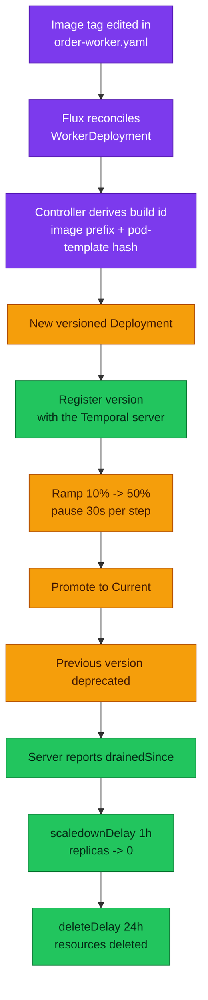

# ADR-054: Give the Versioned-Worker Lifecycle to the Temporal Worker Controller

> **Decision summary:** We will let Temporal's own Kubernetes controller own the
> versioned-worker lifecycle — deriving the build id, creating one Deployment per
> version, moving Current/Ramping through the Temporal API, and deleting a version
> once the server reports it drained — and we will retire the three artefacts that
> did that work by hand: the per-build `HelmRelease`, `scripts/new-worker-build.sh`,
> and the suspended activation CronJob. `pkg/temporalx` moves onto Temporal's own
> environment-variable names, which is what makes a worker image legible to the
> controller at all. We accept that the `mop` chart no longer renders this workload
> (the pod template becomes a hand-written PodSpec) and that env can no longer
> differ between live versions, in exchange for deleting the hand-run activation
> step that makes every freshly built cluster silently broken.

| Attribute | Value |
|-----------|-------|
| **Status** | Accepted |
| **Decision date** | 2026-08-21 |
| **Owners** | `platform` |
| **Deciders** | `platform owner` |
| **Scope** | Who owns the lifecycle of a versioned Temporal worker on Kubernetes: build-id derivation, per-version Deployments, Current/Ramping routing, and retirement. Not whether to use Worker Versioning (ADR-030 decided that), not worker autoscaling (ADR-055), not `checkout-worker`'s opt-in. |
| **Affected components** | homelab (`kubernetes/apps/`, `kubernetes/infra/controllers/temporal/`, `scripts/flux-validate.sh`), `duynhlab/pkg` (`temporalx`), order-service (dependency bump only) |
| **Related RFC** | [RFC-0026](../../rfc/RFC-0026/) |
| **Related research** | [RFC-0026 research](../../rfc/RFC-0026/research.md) — CRD schema, controller source and env contract read at `temporalio/temporal-worker-controller@7316aee` |
| **Supersedes** | — (amends [ADR-030](../ADR-030-temporal-workflow-versioning/): its rollout **mechanism**, not its versioning decision) |
| **Superseded by** | — |
| **Implementation tracking** | RFC-0026 § Implementation History; work lands in `duynhlab/pkg` → `order-service` → `homelab` in that order |
| **Adoption** | **Complete** — merged (#866–#869) and verified on Kind 2026-08-22: `CURRENT` set with no human step (K1.7), a saga completing with `Behavior Pinned` on `order/order-fulfillment` (K4.10), a `Progressive` rollout walking 10 → 50 → promoted, a rollback re-promoting the previous build id, and `service_version` tracking the derived build id (K5.4). **Not observed:** the `sunset.scaledownDelay` scale-to-zero — it needs 1h and the session was shorter; `drainedSince` was observed |

## Context

[ADR-030](../ADR-030-temporal-workflow-versioning/) chose Worker Deployment
Versioning and built the operational half by hand, deliberately: one `HelmRelease`
per build id, and activation as *"a DECISION, not a desired state"* run by a human
outside Flux. That was correct for the tooling available, and the ADR recorded three
follow-ups against itself:

1. *"The retirement gate is machine-checkable, and should be read that way."*
   `DrainageStatus` answers it, and *"nothing in `scripts/` checks it today."*
2. *"Activation is a per-bring-up step, not only a per-release one."* A cluster built
   from zero has no Current version, so new workflows route to unversioned workers —
   of which there are none. Orders sit `pending`, pods `Ready`, gauges green.
3. *"Ramping exists and is unused."*

It also named the destination and the condition for taking it: the controller is
*"the recommended tool"*, but *"it needs its own RFC and an owner-approved number,
and its CRD must be read from the chart rather than from documentation."* Both are
now satisfied — RFC-0026 read the `0.28.0` CRDs chart and the controller's Go source
directly.

Two facts made the timing concrete. `checkout-worker`'s manifest has accumulated
**four hand-written replay-safety arguments** in comments, each of the form
*"`internal/workflow/` changed by ZERO lines"* — the work Worker Versioning exists to
remove. And a build bump costs a **252-line** file copy plus six hand-edited values,
with a recorded failure: `ORDER_RECONCILER_ENABLED` left `true` on three builds at
once.

## Scope

### In scope

- Installing the controller (two charts, `0.28.0` / appVersion `1.9.0`) and its CRDs
- Replacing the per-build `HelmRelease` with one `WorkerDeployment` + one `Connection`
- Deleting `worker-set-current-version-cronjob.yaml`, `scripts/new-worker-build.sh`,
  and `validate_worker_build_id()` in `scripts/flux-validate.sh`
- `pkg/temporalx` reading `TEMPORAL_DEPLOYMENT_NAME` instead of the invented
  `TEMPORAL_WORKER_DEPLOYMENT_NAME`
- Rollout policy: `Progressive`, and retirement policy: `sunset`

### Out of scope

- **Whether to version workers at all** — ADR-030 decided that and stands
- **Autoscaling** — [ADR-055](../ADR-055-keda-worker-autoscaling/)
- **`checkout-worker` versioning** — deferred; enabling it before the controller owns
  activation would add a *second* hand-run step per bring-up
- **Moving the inventory reconciler and outbox dispatchers out of the worker** — a
  consequence of this decision (below), fixed in order-service

## Decision drivers

| Priority | Driver | Why it matters |
|---------:|--------|----------------|
| 1 | Operability | A fresh cluster is currently born broken, and the breakage is silent: no error, no failed activity, no alert. Only a human running a Job fixes it |
| 2 | Correctness of the retirement gate | "Is this build empty" has an exact answer in the server's status. A human reading it by eye is a worse oracle than the field |
| 3 | Blast radius per release | Six meaningful values inside 252 lines, retyped every cutover, is where the one recorded incident came from |
| 4 | Standard-conformance | The controller is Temporal's *"recommended tool"*, and its env names are Temporal's own — our synonym was drift, not design |
| 5 | Learning value | The owner's stated goal is production practice; rainbow rollouts with drain-aware retirement is the production shape |

## Decision

The controller owns the lifecycle. Concretely:

1. **Two HelmReleases** in the existing `temporal` namespace, inside the existing
   `temporal-local` Flux Kustomization — CRDs chart first via `dependsOn`, mirroring
   the `gateway-api-crds` → `envoy-gateway` shape. Because `apps-local` already
   `dependsOn: temporal-local` with `wait: true`, no new Kustomization and no new
   ordering rule are needed. `certmanager.install: false`; cert-manager is deployed.
2. **One `WorkerDeployment` and one `Connection`** in `kubernetes/apps/order-worker.yaml`.
   The pod template is transplanted from what `helm template` proves the `mop` chart
   rendered for this release — a Deployment and nothing else.
3. **Build id is derived**, not pinned with `unsafeCustomBuildID`. The controller
   composes it from the image prefix plus a hash of the pod template.
4. **`Progressive` rollout**, two steps at 10% then 50%, `pauseDuration: 30s` each
   (30 s is the CEL-enforced floor). No gate workflow — that is service-repo work.
5. **`sunset` defaults** — `scaledownDelay: 1h`, `deleteDelay: 24h` — driven by
   `status.deprecatedVersions[].drainedSince` / `.eligibleForDeletion`. *Amended by
   [ADR-055](../ADR-055-keda-worker-autoscaling/) (2026-09-05): `deleteDelay` is `0s`
   once a KEDA `ScaledObject` is attached, because the controller's drained-version
   zeroing and KEDA's `minReplicaCount` flap for the whole delete window.*
6. **`pkg/temporalx` reads Temporal's names.** Breaking change, owner-authorised while
   the platform is pre-release.

### Decision rules

| Rule | Required behavior |
|------|-------------------|
| **Ownership** | The Temporal **server** is the source of truth for which version is Current; the controller is the only writer of that setting. No human, script or Job sets it |
| **Identity** | Build id comes from the controller. Nothing in git restates it, so nothing in git can disagree with it |
| **Release shape** | A worker release edits **one line** — the image tag — in a file that is never copied |
| **Retirement** | A version is retired on the server's own `drainedSince`, then on timers. Never on a human's reading of `describe-version`, and never on the age of the orders |
| **Determinism** | `VersioningBehaviorPinned` stays registered in order-service. The controller changes *who moves traffic*, not *whether a workflow may be moved* |
| **Refusal to start** | A worker given half a version identity must exit non-zero. `temporalx` keeps that behavior — it is what turns a silent hang into a crash loop |

### Decision view

> **In plain terms:** every box after the first one used to have a human in it, or a
> file a human copied. None of them encode a judgement the server cannot make.

## Alternatives considered

| Option | Shape | Verdict |
|--------|-------|---------|
| **Status quo** | CronJob + `new-worker-build.sh` + one file per build | Rejected. Costs are measured: 252-line copy per build, a hand-run Job per release *and per bring-up*, `DrainageStatus` read by eye, ramping unusable in practice |
| **Controller with `strategy: Manual`** | Controller creates Deployments; a human promotes | Rejected. Docs are explicit that `Manual` *"requires manual intervention to promote versions"*, so the per-bring-up breakage survives — the highest-value item on the list |
| **`unsafeCustomBuildID` = image tag** | Preserve build id ≡ image tag | Rejected. A release would then edit the tag **and** the build id, killing the one-line goal, to preserve an invariant whose only consumer was a human correlating a filename with a server version. `kubectl get wd` prints Current/Target directly |
| **Worker ResourceSet** | Flux ResourceSet templating the per-build HelmRelease | Rejected, and already rejected in `new-worker-build.sh:15-18`: needs a render step in `flux-validate` because kustomize does not expand ResourceSets, *"and the Temporal Worker Controller would replace all of it"* |
| **Drop versioning, adopt SDK patching** | `GetVersion` branches in workflow code | Rejected. Upstream sanctions patching *only* *"if your infrastructure does not yet support blue-green or rainbow deployment models"*. Ours does |

### Why the selected option won

It is the only option that closes all three ADR-030 follow-ups at once, and it is the
tool Temporal itself points Kubernetes users at. The condition ADR-030 attached — read
the CRD from the chart, not the docs — was met and changed two beliefs in the process:
the project is GA with *"stable APIs"* despite the `v1alpha1` API group, and the real
chart is `0.28.0` / appVersion `1.9.0`, not the `1.0.0` ADR-030 recorded from docs.

### Why the closest alternative lost

`strategy: Manual` keeps ADR-030's philosophy intact and still buys per-version
Deployments and automatic sunset. It loses because the philosophy was never the goal —
the goal was not moving a workflow onto an incompatible build, and a declarative ramp
achieves that better than a human, while a human is the *cause* of the silent
per-bring-up failure.

## Consequences

### Positive consequences

- The per-bring-up activation step disappears, and with it audit row K1.7
- A release is one line; the 252-line copy, the six hand-edited values, and the
  staging script all go away — **638 lines deleted** in homelab
- Retirement reads the server's own field instead of a human's eye
- Ramping becomes usable, closing ADR-030 follow-up 4
- `service.version` tracks the build id automatically, so a drain stays legible in
  every signal instead of only by pod name
- `temporalx` stops inventing an environment-variable name, satisfying `pkg`'s own
  rule to *"read standard environment variables rather than inventing names"*

### Negative consequences and accepted trade-offs

- **The `mop` chart no longer renders this workload.** `spec.template` is a raw
  PodSpec: 37 env vars, probes and resources are hand-written, and the file lands at
  **276 lines**. Accepted because it is *one* file forever and a bump is one line — but
  nothing now keeps it in step with the chart's future defaults, and that is a real
  drift surface.
- **Env can no longer differ per live version.** One template serves every version, so
  `ORDER_RECONCILER_ENABLED` and `ORDER_START_DISPATCHERS_ENABLED` cannot be set
  `false` on a draining build. Correctness survives — the dispatchers claim with
  `FOR UPDATE SKIP LOCKED` (*"extra instances stay correct — just unnecessary"*) and
  the reconciler is *"SAFE but noisy"*, costing a duplicated repair counter rather
  than a wrong action. The clean fix is to move both out of the worker, since neither
  is workflow code; that is order-service work and not part of this ADR.
- **A third-party controller joins the critical path.** `apps-local` cannot go Ready
  without it. Mitigated by `wait: true` and by the controller holding no state — the
  server is the source of truth.
- **A flag day between phases.** The deployed `order-service:2.4.0` binary reads the
  old env name, so manifest and image must move together. Accepted because the failure
  is loud (`os.Exit(1)`), not silent.
- **`flux-validate.sh` loses 143 lines of assertions.** They existed to keep three
  hand-maintained copies of one build id in agreement; with one copy there is nothing
  to compare. The safety they provided is now structural rather than checked.

### Neutral consequences

- The Temporal server, its namespace `mop`, `TEMPORAL_HOSTPORT` and the frontend
  Service name are all unchanged
- NetworkPolicy is unaffected: `order`'s policies use `podSelector: {}` with
  `policyTypes: [Ingress]` only, so they are label-independent
- Kyverno needs no exception: `disallow-latest-tag` requires a tag but no `ghcr.io`
  prefix, and the pod template carries the resources and probes `require-resources` /
  `require-probes` demand in the `order` namespace

## Implementation obligations

| # | Obligation | Where |
|---|------------|-------|
| 1 | `temporalx` reads `TEMPORAL_DEPLOYMENT_NAME`; retire the three uncalled helpers | `duynhlab/pkg` → tag `temporalx/v0.37.0` |
| 2 | Bump the dependency; no code change | `order-service` → tag `v2.5.0` |
| 3 | **Gate at local-stack including row A15**, the worker-versioning drill, which is CONDITIONAL *"when a change touches worker versioning"* and therefore mandatory | `local-stack/docs/e2e-audit.md` |
| 4 | Install both charts; add the OCIRepository sources | `kubernetes/infra/controllers/temporal/`, `clusters/local/sources/oci/` |
| 5 | Author `Connection` + `WorkerDeployment`; delete the per-build file, the CronJob and the script | `kubernetes/apps/`, `kubernetes/infra/controllers/temporal/`, `scripts/` |
| 6 | Delete `validate_worker_build_id()`; keep the "stray versioning env on an unversioned worker" tripwire and point it at the new name | `scripts/flux-validate.sh` |
| 7 | **Repurpose** audit row K1.7 — it now proves no activation step is needed, which is stronger than removing it; update A15's env names | `docs/platform/kind-e2e-audit.md`, `local-stack/docs/e2e-audit.md` |
| 8 | Sync the as-built env contract and the single-file layout | [`docs/api/temporal.md`](../../../api/temporal.md) |
| 9 | Amend ADR-030: rollout mechanism superseded, versioning decision left standing | [`ADR-030`](../ADR-030-temporal-workflow-versioning/) |

## Validation and compliance

| Claim | How it is proven | Evidence |
|-------|------------------|----------|
| A worker reads the controller's identity | Ran `VersioningFromEnv` across four env combinations against `pkg/temporalx` | Controller case flips from `exit 1` to OK |
| K1.7 is gone | `make down && make up`, run **no** Job, drive one checkout | Saga reaches `completed` |
| Rollout needs no human | Bump the tag, `kubectl get wd order-fulfillment -w` | Ramp % advances, Current flips |
| Retirement needs no human | `kubectl get wd -o yaml \| yq .status.deprecatedVersions` | `drainedSince` set; old Deployment scaled to 0 then deleted |
| Admission is satisfied | `kubectl get events -n order \| grep -i kyverno` | No deny |
| No log double-ingest | VictoriaLogs, worker container | One `worker versioning on` line per pod |
| Determinism is unaffected | A15's two-version drill | v1 `draining` while it holds a pinned execution |

## Revisit triggers

- The controller stops being maintained, or its API group moves in a way that breaks
  the CRDs we author → reconsider `Manual` or a ResourceSet
- Per-version configuration becomes necessary again (a role that genuinely cannot be
  claim-based) → revisit, because this decision makes it impossible by construction
- The hand-written PodSpec drifts materially from the `mop` chart's defaults (probe
  shape, security context, standard labels) → consider a chart that renders a
  `WorkerDeployment` instead of a `Deployment`
- A second worker is versioned and the single-file claim stops holding → revisit the
  layout, not the ownership decision

## References

- [RFC-0026](../../rfc/RFC-0026/) · [research.md](../../rfc/RFC-0026/research.md)
- [ADR-030](../ADR-030-temporal-workflow-versioning/) — the decision this amends
- [`temporalio/temporal-worker-controller`](https://github.com/temporalio/temporal-worker-controller)
- [Temporal — Kubernetes controller](https://docs.temporal.io/production-deployment/worker-deployments/kubernetes-controller)
- [Temporal — Worker Versioning](https://docs.temporal.io/production-deployment/worker-deployments/worker-versioning)
- [`docs/api/temporal.md`](../../../api/temporal.md) · [`docs/platform/kind-e2e-audit.md`](../../../platform/kind-e2e-audit.md)

## History

| Date | Status / adoption | Change |
|------|-------------------|--------|
| 2026-08-21 | Proposed / Not started | Proposed with RFC-0026 at architecture review. |
| 2026-08-21 | Accepted / Not started | Accepted; implementation merged in #866–#869. |
| 2026-08-22 | Accepted / **Complete** | Verified on a Kind cluster built from zero. The Kind gate also surfaced two defects this decision did not cause: the `identity` NetworkPolicy admitted no service namespace to the JWKS (every `private` route 401'd), and the six staff verifiers default to a public issuer URL no pod can use (every `protected` route 503s). Both are recorded as findings, not as consequences of this ADR. |

---
_Last updated: 2026-08-25_
