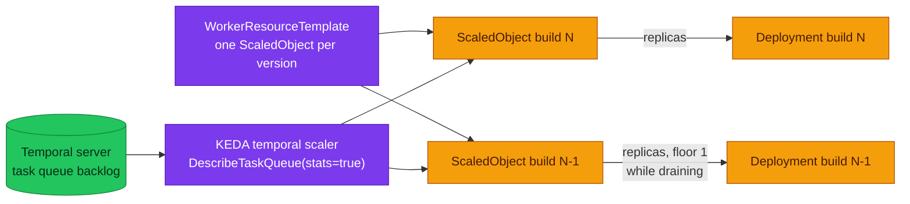

# ADR-055: Scale Versioned Workers from Task-Queue Backlog with KEDA

> **Decision summary:** We will scale Temporal workers from the task-queue backlog
> using KEDA's native `temporal` scaler, attached **per worker version** through the
> controller's `WorkerResourceTemplate`, rather than through the HPA +
> `prometheus-adapter` path upstream documents — because that path reads a metric only
> **Temporal Cloud** publishes, and this platform runs a self-hosted server behind
> VictoriaMetrics with no external-metrics adapter. We accept a new controller in the
> cluster and a per-namespace Temporal API read budget, in exchange for the platform's
> first actuator on a signal it has been graphing and unable to act on. This ADR is
> `Proposed` only: the decision is recorded now so it is not re-litigated, and
> installation is a separate, later change.

| Attribute | Value |
|-----------|-------|
| **Status** | Proposed |
| **Decision date** | — |
| **Owners** | `platform` |
| **Deciders** | `platform owner` |
| **Scope** | How a versioned Temporal worker's replica count is decided, and which signal decides it. Not whether to version workers ([ADR-030](../ADR-030-temporal-workflow-versioning/)), not who owns the version lifecycle ([ADR-054](../ADR-054-temporal-worker-controller/)), not autoscaling for HTTP services |
| **Affected components** | homelab (`kubernetes/infra/controllers/`, `kubernetes/apps/`, observability alerts), the order worker; later any versioned worker |
| **Related RFC** | [RFC-0026](../../rfc/RFC-0026/) |
| **Related research** | [RFC-0026 research](../../rfc/RFC-0026/research.md) — § Scaling and the signals we already have; KEDA scaler fields via Context7 `/websites/keda_sh` |
| **Supersedes** | — |
| **Superseded by** | — |
| **Implementation tracking** | RFC-0026 § Implementation History; blocked on ADR-054 Adoption |
| **Adoption** | Not started |

## Context

The platform can already see worker starvation and cannot act on it.
[`alert-catalog.md:622`](../../../observability/alerting/alert-catalog.md) names
schedule-to-start latency and task-queue backlog as *"the best leading indicators that
workers are under-provisioned; tasks pile up before any error fires"*, records that
*"both signals are now **visualized**"*, and states that *"the alerts on them are still
missing"*. Three alerts are named but unbuilt:
`TemporalScheduleToStartLatencyHigh`, `TemporalTaskQueueBacklogGrowing`,
`TemporalSyncMatchRateLow`.

The reason they stayed unbuilt is that nothing could act on them. Measured across
`kubernetes/`: **15 of 15** application workloads pin `replicaCount: 1`, there are
**0** HorizontalPodAutoscalers and **0** ScaledObjects, and no KEDA anywhere. The
consequence is an alert that can never fire — `KubeHPAMaxedOut` has no HPA to observe.
The only response available today is a human editing `replicaCount` in a HelmRelease
and opening a PR.

The signal itself is already in the cluster: `approximate_backlog_count` and
`approximate_backlog_age_seconds` are scraped from the Temporal server and graphed
(metric names verified against a live 1.31.2 server, 2026-08-18). It is a **server**
metric — the SDK emits no backlog series.

[ADR-054](../ADR-054-temporal-worker-controller/) is what makes per-version scaling
possible at all: without it there is no per-version template, so every version
rollover leaves the old scaler pointing at a dead Deployment and the new Deployment
unscaled.

## Scope

### In scope

- The signal a worker scales on, and the mechanism that reads it
- Attaching one scaler per running worker version
- The two alerts that make autoscaling observable rather than mysterious

### Out of scope

- **Installing it.** This ADR is `Proposed`; install is a later change
- Autoscaling for HTTP services (different signal, different ADR)
- `TemporalSyncMatchRateLow` — stays in the alert-catalog backlog
- Scale-to-zero for a **draining** version (see Decision rules — floored at 1)

## Decision drivers

| Priority | Driver | Why it matters |
|---------:|--------|----------------|
| 1 | Fits deployed reality | Upstream's HPA recipe needs a metric only Temporal Cloud publishes and an adapter this platform does not run |
| 2 | Correctness across a rollover | A scaler must follow versions, or it silently stops scaling the version that matters |
| 3 | Reactivity | Backlog exists *before* errors; slot exhaustion (`TemporalWorkerTaskSlotsExhausted`) fires only once slots are already at zero |
| 4 | Operability | An alert with no actuator is a page with a 20-minute manual remediation |

## Decision

Use KEDA's native `temporal` scaler, one `ScaledObject` per running worker version,
rendered by the controller's `WorkerResourceTemplate`.

### Decision rules

| Rule | Required behavior |
|------|-------------------|
| **Signal** | Task-queue backlog, read from the Temporal API. Not slot utilisation alone — slots saturate first but say nothing about queued work |
| **Per-version** | The `ScaledObject` is a template rendered per build id. `workerDeploymentName`, `workerDeploymentBuildId` and `namespace` are **controller-owned** — the webhook rejects a template that hardcodes them; `taskQueue` stays the author's |
| **Floor** | `minReplicaCount: 1` for any version that may still hold pinned workflows. Scaling a draining version to zero removes its pollers, which is the silent-stall shape this platform has already been bitten by |
| **Allow-list** | `ScaledObject` must be added to `workerResourceTemplate.allowedResources` — the chart defaults to `HorizontalPodAutoscaler` only, and that value drives both the webhook allow-list **and** the controller's RBAC |
| **Observability first** | `TemporalScheduleToStartLatencyHigh` and `TemporalTaskQueueBacklogGrowing` ship **with** the scaler. Autoscaling without them is a system that hides its own saturation |

### Decision view

## Alternatives considered

| Option | Shape | Verdict |
|--------|-------|---------|
| **HPA + `prometheus-adapter`** | Upstream's documented path for continuous traffic | Rejected here. It reads `temporal_cloud_v1_approximate_backlog_count` from **Temporal Cloud's** OpenMetrics endpoint, which a self-hosted server does not publish, through an external-metrics adapter this platform does not run. It also cannot scale from zero. Upstream's own table routes *"needs scale-from-zero"* and *"reactivity under ~60 s"* to KEDA |
| **KEDA without the controller** | One `ScaledObject` on a single Deployment | Rejected. No per-version template, so each rollover leaves a scaler on a dead Deployment and the new one unscaled — the exact failure `WorkerResourceTemplate` exists to prevent, and it would be redone once the controller lands |
| **Do nothing; ship only the alerts** | Page a human who edits `replicaCount` | Rejected as the end state, though the alerts are worth shipping regardless. An alert whose only runbook is "open a PR" is a 20-minute manual remediation for a condition that resolves itself in seconds when a pod is added |
| **Slot utilisation as the primary signal** | Scale on `temporal_worker_task_slots_available` | Rejected as *primary*. It rises before backlog, which is useful, but it is a property of the workers present, not of the work waiting — a single saturated worker and a thousand queued tasks look the same |

### Why the selected option won

It is the only mechanism that reads the signal this platform actually has. KEDA's
scaler *"calls `DescribeTaskQueue(stats=true)` … which loads the queue synchronously
and returns the backlog directly"* — no metrics pipeline, no Cloud endpoint, and it is
version-aware from the controller's own injection.

### Why the closest alternative lost

HPA + adapter is upstream's headline recommendation and scales independently of
namespace count, which genuinely beats KEDA at hundreds of task queues. It loses on
this platform for a plain reason: the metric it consumes does not exist here, and
manufacturing it means adding an external-metrics adapter in front of VictoriaMetrics
and re-deriving per-version selectors — more moving parts than the thing it replaces.

## Consequences

### Positive consequences

- The platform gets its **first** autoscaling actuator, on a signal it already graphs
- `KubeHPAMaxedOut` stops being an alert with nothing to observe
- Two of the three named-but-unbuilt Temporal alerts ship with something to act on them
- Scale-from-zero becomes possible for versions with no pinned workflows

### Negative consequences and accepted trade-offs

- **Another controller in the cluster** — KEDA's operator plus its metrics adapter, on
  a Kind node this platform has repeatedly had to reclaim CPU on
- **A Temporal API read budget.** KEDA polls rather than scraping:
  `FrontendGlobalWorkerDeploymentReadRPS = 50` per namespace. Irrelevant at two task
  queues, decisive at hundreds — recorded so the ceiling is known before it is hit
- **Backlog only.** As of KEDA 2.20 the scaler uses backlog count alone, so slot
  utilisation cannot act as a fast-path or an anti-flap backstop
- **Version-aware metadata needs controller ≥ v1.8.0** — satisfied by the `0.28.0`
  chart (appVersion `1.9.0`), but it couples the two decisions
- **RBAC widening.** `ScaledObject` in `allowedResources` grants the controller
  create/update on `keda.sh` resources, and the webhook's SubjectAccessReview means
  Flux's service account needs the same

### Neutral consequences

- No application code changes; the signal is server-side
- No change to `VersioningBehaviorPinned` or to how traffic is routed

## Implementation obligations

| # | Obligation | Where |
|---|------------|-------|
| 1 | ADR-054 Adoption must be **Complete** first — no per-version template exists otherwise | [`ADR-054`](../ADR-054-temporal-worker-controller/) |
| 2 | Install KEDA; add `ScaledObject` to `workerResourceTemplate.allowedResources` | `kubernetes/infra/controllers/` |
| 3 | Author the `WorkerResourceTemplate` with `scaleTargetRef: {}` (the opt-in sentinel) and an explicit `taskQueue` | `kubernetes/apps/` |
| 4 | Ship `TemporalScheduleToStartLatencyHigh` + `TemporalTaskQueueBacklogGrowing`, with runbooks | `configs/observability/metrics/prometheusrules/`, `docs/observability/runbooks/` |
| 5 | Close the corresponding rows in the alert-catalog gap list | [`alert-catalog.md`](../../../observability/alerting/alert-catalog.md) |
| 6 | Verify a draining version is never scaled below 1 while it holds pinned workflows | Kind drill |

## Validation and compliance

| Claim | How it is proven |
|-------|------------------|
| The scaler reads a real backlog | Drive load onto `order-fulfillment`, watch `approximate_backlog_count` rise and replicas follow |
| It follows versions | Bump the image tag; confirm a `ScaledObject` exists per running build id and none points at a deleted Deployment |
| A draining version keeps a poller | During a drain, confirm the old version's replicas never reach 0 while `drainedSince` is unset |
| The alerts fire before saturation | Compare first-fire time against `TemporalWorkerTaskSlotsExhausted` |
| The API budget is understood | Record poll interval × scaler count against the 50 RPS per-namespace limit |

## Revisit triggers

- KEDA's `temporal` scaler gains slot-utilisation support → revisit the single-signal
  limitation
- Task queues or versions grow toward the point where poll RPS approaches the
  per-namespace limit → revisit HPA + adapter, whose cost model is per-namespace rather
  than per-scaler
- The platform gains an external-metrics adapter for another reason → the HPA path
  becomes cheap and this decision should be re-scored
- ADR-054 is reverted → this ADR is moot and should be withdrawn, not re-planned

## References

- [RFC-0026](../../rfc/RFC-0026/) · [research.md](../../rfc/RFC-0026/research.md)
- [ADR-054](../ADR-054-temporal-worker-controller/) — the prerequisite decision
- [KEDA — Temporal scaler](https://keda.sh/docs/latest/scalers/temporal/)
- [KEDA — ScaledObject specification](https://keda.sh/docs/latest/reference/scaledobject-spec/)
- [`alert-catalog.md`](../../../observability/alerting/alert-catalog.md) — the recorded gap
- [`docs/api/temporal.md`](../../../api/temporal.md)

## History

| Date | Change |
|------|--------|
| 2026-08-21 | Proposed with RFC-0026 at architecture review. Recorded, not installed. |
