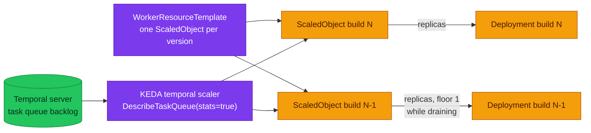

# ADR-055: Scale Versioned Workers from Task-Queue Backlog with KEDA

> **Decision summary:** We will scale Temporal workers from the task-queue backlog
> using KEDA's native `temporal` scaler, attached **per worker version** through the
> controller's `WorkerResourceTemplate`, rather than through the HPA +
> `prometheus-adapter` path upstream documents — because that path reads a metric only
> **Temporal Cloud** publishes, and this platform runs a self-hosted server behind
> VictoriaMetrics with no external-metrics adapter. We accept a new controller in the
> cluster and a per-namespace Temporal API read budget, in exchange for the platform's
> first actuator on a signal it has been graphing and unable to act on. This ADR is
> `Proposed` only: the decision is recorded now so it is not re-litigated, and
> installation is a separate, later change.

| Attribute | Value |
|-----------|-------|
| **Status** | Accepted |
| **Decision date** | 2026-09-05 |
| **Owners** | `platform` |
| **Deciders** | `platform owner` |
| **Scope** | How a versioned Temporal worker's replica count is decided, and which signal decides it. Not whether to version workers ([ADR-030](../ADR-030-temporal-workflow-versioning/)), not who owns the version lifecycle ([ADR-054](../ADR-054-temporal-worker-controller/)), not autoscaling for HTTP services |
| **Affected components** | homelab (`kubernetes/infra/controllers/keda/`, `kubernetes/infra/controllers/temporal/`, `kubernetes/apps/*-scaler.yaml`, `configs/temporal/prometheusrule.yaml`, `docs/observability/runbooks/temporal/`), both versioned workers — `order/order-fulfillment` and `checkout/checkout-abandon` |
| **Related RFC** | [RFC-0026](../../rfc/RFC-0026/) |
| **Related research** | [RFC-0026 research](../../rfc/RFC-0026/research.md) — § Scaling and the signals we already have; KEDA scaler fields via Context7 `/websites/keda_sh` |
| **Supersedes** | — |
| **Superseded by** | — |
| **Implementation tracking** | RFC-0026 § Implementation History; ADR-054 Adoption `Complete` (2026-08-22) unblocked it |
| **Adoption** | **Partial** — merged 2026-09-05 in #996 (KEDA 2.20.2 as wave `keda-local`, `ScaledObject` in the controller allow-list, one `WorkerResourceTemplate` per worker, the two capacity alerts + runbooks); **Kind verification pending** — the Ubuntu audit checklist in § As-built flips this to Complete |

## Context

The platform can already see worker starvation and cannot act on it.
[`alert-catalog.md` § Top 5 highest-value additions, item 2](../../../observability/alerting/alert-catalog.md#top-5-highest-value-additions) named
schedule-to-start latency and task-queue backlog as *"the best leading indicators that
workers are under-provisioned; tasks pile up before any error fires"*, records that
*"both signals are now **visualized**"*, and states that *"the alerts on them are still
missing"*. Three alerts are named but unbuilt:
`TemporalScheduleToStartLatencyHigh`, `TemporalTaskQueueBacklogGrowing`,
`TemporalSyncMatchRateLow`.

The reason they stayed unbuilt is that nothing could act on them. Measured across
`kubernetes/`: **15 of 15** application workloads pin `replicaCount: 1`, there are
**0** HorizontalPodAutoscalers and **0** ScaledObjects, and no KEDA anywhere. The
consequence is an alert that can never fire — `KubeHPAMaxedOut` has no HPA to observe.
The only response available today is a human editing `replicaCount` in a HelmRelease
and opening a PR.

The signal itself is already in the cluster: `approximate_backlog_count` and
`approximate_backlog_age_seconds` are scraped from the Temporal server and graphed
(metric names verified against a live 1.31.2 server, 2026-08-18). It is a **server**
metric — the SDK emits no backlog series.

[ADR-054](../ADR-054-temporal-worker-controller/) is what makes per-version scaling
possible at all: without it there is no per-version template, so every version
rollover leaves the old scaler pointing at a dead Deployment and the new Deployment
unscaled.

## Scope

### In scope

- The signal a worker scales on, and the mechanism that reads it
- Attaching one scaler per running worker version
- The two alerts that make autoscaling observable rather than mysterious

### Out of scope

- **Installing it.** This ADR is `Proposed`; install is a later change
- Autoscaling for HTTP services (different signal, different ADR)
- `TemporalSyncMatchRateLow` — stays in the alert-catalog backlog
- Scale-to-zero for a **draining** version (see Decision rules — floored at 1)

## Decision drivers

| Priority | Driver | Why it matters |
|---------:|--------|----------------|
| 1 | Fits deployed reality | Upstream's HPA recipe needs a metric only Temporal Cloud publishes and an adapter this platform does not run |
| 2 | Correctness across a rollover | A scaler must follow versions, or it silently stops scaling the version that matters |
| 3 | Reactivity | Backlog exists *before* errors; slot exhaustion (`TemporalWorkerTaskSlotsExhausted`) fires only once slots are already at zero |
| 4 | Operability | An alert with no actuator is a page with a 20-minute manual remediation |

## Decision

Use KEDA's native `temporal` scaler, one `ScaledObject` per running worker version,
rendered by the controller's `WorkerResourceTemplate`.

### Decision rules

| Rule | Required behavior |
|------|-------------------|
| **Signal** | Task-queue backlog, read from the Temporal API. Not slot utilisation alone — slots saturate first but say nothing about queued work |
| **Per-version** | The `ScaledObject` is a template rendered per build id. `workerDeploymentName`, `workerDeploymentBuildId` and `namespace` are **controller-owned** — the webhook rejects a template that hardcodes them; `taskQueue` stays the author's. Opt-in is the **empty-string sentinel** (`workerDeploymentName: ""` etc.): present-and-empty is injected, an absent key is left alone and the scaler would then read the whole queue (controller ≥ v1.8.0, `internal/k8s/workerresourcetemplates.go` `appendKEDATriggerMetadata`) |
| **Floor** | `minReplicaCount: 1` for any version that may still hold pinned workflows. Scaling a draining version to zero removes its pollers, which is the silent-stall shape this platform has already been bitten by |
| **Replica ownership** | `spec.replicas` must be **absent** from the `WorkerDeployment`. It is the controller's mode switch, not a default: *"When set, the controller manages replicas for all active worker versions. When omitted (nil), the controller … never calls UpdateScale on active versions"* (`api/v1alpha1/workerdeployment_types.go`). Left set, every reconcile scales the current version back down while KEDA scales it up |
| **Sunset** | `sunset.deleteDelay: 0s` (keep `scaledownDelay: 1h`). Drained versions are zeroed by the controller regardless of who owns replicas, KEDA raises an inactive target back to `minReplicaCount` on every poll (`RequestScale`, 2.20.2), and the `ScaledObject` outlives the zeroing until the Deployment is deleted — so the window between zero and delete is a 0↔1 flap. The delete fires at `drainedSince > scaledownDelay + deleteDelay` **and** observed replicas 0 (`planner.go:733`, v1.9.0): the delays *add*, so `24h/24h` moves the window to [24h, 48h] rather than closing it. `0s` deletes on the reconcile after the zero. Every KEDA-side lever fails: `minReplicaCount: 0` and `idleReplicaCount: 0` let an idle Current reach 0, which the controller's target floor (`planner.go:786`) undoes — a flap on the live version; `paused-scale-in` also sets the HPA `ScaleDown.SelectPolicy: Disabled`, so replicas never return from 3 to 1 |
| **Allow-list** | `ScaledObject` must be added to `workerResourceTemplate.allowedResources` — the chart defaults to `HorizontalPodAutoscaler` only, and that value drives both the webhook allow-list **and** the controller's RBAC |
| **Observability first** | `TemporalScheduleToStartLatencyHigh` and `TemporalTaskQueueBacklogGrowing` ship **with** the scaler. Autoscaling without them is a system that hides its own saturation |

### Decision view

## Alternatives considered

| Option | Shape | Verdict |
|--------|-------|---------|
| **HPA + `prometheus-adapter`** | Upstream's documented path for continuous traffic | Rejected here. It reads `temporal_cloud_v1_approximate_backlog_count` from **Temporal Cloud's** OpenMetrics endpoint, which a self-hosted server does not publish, through an external-metrics adapter this platform does not run. It also cannot scale from zero. Upstream's own table routes *"needs scale-from-zero"* and *"reactivity under ~60 s"* to KEDA |
| **KEDA without the controller** | One `ScaledObject` on a single Deployment | Rejected. No per-version template, so each rollover leaves a scaler on a dead Deployment and the new one unscaled — the exact failure `WorkerResourceTemplate` exists to prevent, and it would be redone once the controller lands |
| **Do nothing; ship only the alerts** | Page a human who edits `replicaCount` | Rejected as the end state, though the alerts are worth shipping regardless. An alert whose only runbook is "open a PR" is a 20-minute manual remediation for a condition that resolves itself in seconds when a pod is added |
| **Slot utilisation as the primary signal** | Scale on `temporal_worker_task_slots_available` | Rejected as *primary*. It rises before backlog, which is useful, but it is a property of the workers present, not of the work waiting — a single saturated worker and a thousand queued tasks look the same |

### Why the selected option won

It is the only mechanism that reads the signal this platform actually has. KEDA's
scaler *"calls `DescribeTaskQueue(stats=true)` … which loads the queue synchronously
and returns the backlog directly"* — no metrics pipeline, no Cloud endpoint, and it is
version-aware from the controller's own injection.

### Why the closest alternative lost

HPA + adapter is upstream's headline recommendation and scales independently of
namespace count, which genuinely beats KEDA at hundreds of task queues. It loses on
this platform for a plain reason: the metric it consumes does not exist here, and
manufacturing it means adding an external-metrics adapter in front of VictoriaMetrics
and re-deriving per-version selectors — more moving parts than the thing it replaces.

## Consequences

### Positive consequences

- The platform gets its **first** autoscaling actuator, on a signal it already graphs
- `KubeHPAMaxedOut` stops being an alert with nothing to observe
- Two of the three named-but-unbuilt Temporal alerts ship with something to act on them
- Scale-from-zero becomes *available*, though the Floor rule declines it — see below

### Negative consequences and accepted trade-offs

- **Another controller in the cluster** — KEDA's operator plus its metrics adapter, on
  a Kind node this platform has repeatedly had to reclaim CPU on
- **A Temporal API read budget.** KEDA polls rather than scraping:
  `FrontendGlobalWorkerDeploymentReadRPS = 50` per namespace. Irrelevant at two task
  queues, decisive at hundreds — recorded so the ceiling is known before it is hit
- **Backlog only.** As of KEDA 2.20 the scaler uses backlog count alone, so slot
  utilisation cannot act as a fast-path or an anti-flap backstop. Upstream's
  `docs/scaling-recommendations.md` credits exactly that signal to the HPA path,
  for damping scale-down when the backlog is zero but the workers are well used
- **The Floor rule declines KEDA's differentiator.** `minReplicaCount: 1` means this
  platform does not scale from zero — which is the first row of upstream's own
  recommendation table for choosing KEDA over HPA. Taken with the point above, the
  two properties that would have made KEDA the obvious choice are both unused here.
  The choice still holds on operational grounds (see § Why the selected option won),
  but it is a narrower win than "KEDA is the recommended path", and this ADR should
  not be read as claiming Temporal recommends it for a continuously-loaded queue —
  the same upstream table recommends **HPA + prometheus-adapter** for that case
- **`sunset.deleteDelay` is 0s.** The controller keeps one replica write even when an
  autoscaler owns replicas: it zeroes drained versions "regardless", and its drained
  branch re-fires on any non-zero value it observes, while KEDA writes
  `minReplicaCount` back on every poll and the `ScaledObject` stays attached until the
  Deployment is deleted. A 1h/24h split was 23 hours of that flap; because the delete
  fires at `scaledownDelay + deleteDelay`, a 24h/24h split would have been the same 24
  hours of flap one day later. Deleting on the reconcile after the zero removes the
  window; the cost is ADR-054's day of drained-version retention, which protected a
  rollback that is only meaningful before the version drains
- **Version-aware metadata needs controller ≥ v1.8.0** — satisfied by the `0.28.0`
  chart (appVersion `1.9.0`), but it couples the two decisions
- **RBAC widening.** `ScaledObject` in `allowedResources` grants the controller
  create/update on `keda.sh` resources, and the webhook's SubjectAccessReview means
  Flux's service account needs the same

### Neutral consequences

- No application code changes; the signal is server-side
- No change to `VersioningBehaviorPinned` or to how traffic is routed

## Implementation obligations

| # | Obligation | Where |
|---|------------|-------|
| 1 | ADR-054 Adoption must be **Complete** first — no per-version template exists otherwise | [`ADR-054`](../ADR-054-temporal-worker-controller/) |
| 2 | Install KEDA; add `ScaledObject` to `workerResourceTemplate.allowedResources` | `kubernetes/infra/controllers/` |
| 3 | Author the `WorkerResourceTemplate` with `scaleTargetRef: {}` (the opt-in sentinel) and an explicit `taskQueue` | `kubernetes/apps/` |
| 4 | Ship `TemporalScheduleToStartLatencyHigh` + `TemporalTaskQueueBacklogGrowing`, with runbooks | `configs/observability/metrics/prometheusrules/`, `docs/observability/runbooks/` |
| 5 | Close the corresponding rows in the alert-catalog gap list | [`alert-catalog.md`](../../../observability/alerting/alert-catalog.md) |
| 6 | Verify a draining version is never scaled below 1 while it holds pinned workflows | Kind drill |

## Validation and compliance

| Claim | How it is proven |
|-------|------------------|
| The scaler reads a real backlog | Drive load onto `order-fulfillment`, watch `approximate_backlog_count` rise and replicas follow |
| It follows versions | Bump the image tag; confirm a `ScaledObject` exists per running build id and none points at a deleted Deployment |
| A draining version keeps a poller | During a drain, confirm the old version's replicas never reach 0 while `drainedSince` is unset |
| The alerts fire before saturation | Compare first-fire time against `TemporalWorkerTaskSlotsExhausted` |
| The API budget is understood | Record poll interval × scaler count against the 50 RPS per-namespace limit |

## Revisit triggers

- KEDA's `temporal` scaler gains slot-utilisation support → revisit the single-signal
  limitation
- Task queues or versions grow toward the point where poll RPS approaches the
  per-namespace limit → revisit HPA + adapter, whose cost model is per-namespace rather
  than per-scaler
- The platform gains an external-metrics adapter for another reason → the HPA path
  becomes cheap and this decision should be re-scored
- ADR-054 is reverted → this ADR is moot and should be withdrawn, not re-planned

## References

- [RFC-0026](../../rfc/RFC-0026/) · [research.md](../../rfc/RFC-0026/research.md)
- [ADR-054](../ADR-054-temporal-worker-controller/) — the prerequisite decision
- [KEDA — Temporal scaler](https://keda.sh/docs/latest/scalers/temporal/)
- [KEDA — ScaledObject specification](https://keda.sh/docs/latest/reference/scaledobject-spec/)
- [`alert-catalog.md`](../../../observability/alerting/alert-catalog.md) — the recorded gap
- [`docs/api/temporal.md`](../../../api/temporal.md)

## As-built (2026-09-05)

What the adoption PR landed, so the Ubuntu Kind audit has a checklist rather than a
description. Chart and API facts were re-verified against upstream on 2026-09-05:
KEDA **v2.20.2** (chart 2.20.2, latest — confirmed against the repo `index.yaml`),
Temporal Worker Controller **v1.10.1** latest while the platform pins chart 0.28.0 /
app **1.9.0** (≥ v1.8.0, which is where KEDA trigger injection arrived; the running
image confirms `v1.9.0`).

Rows **3b** and **4b** came out of a review pass that read the controller's v1.9.0
source and queried the live cluster rather than trusting this document. Both are the
same class of defect — a thing that renders, validates and passes CI while doing
nothing — and neither was visible to `make validate`.

| # | Landed | Where |
|---|--------|-------|
| 1 | Wave `keda-local` — `HelmRepository keda` + `HelmRelease keda` 2.20.2 in namespace `keda`, Kind-sized resources, ServiceMonitors on; `dependsOn: controllers-local, monitoring-local`; `temporal-local` and `apps-local` now depend on it | `clusters/local/keda.yaml`, `clusters/local/sources/helm/keda.yaml`, `controllers/keda/`, `controllers/namespaces.yaml`, `scripts/flux-validate.sh` |
| 2 | `ScaledObject` added to `workerResourceTemplate.allowedResources` (webhook allow-list + controller RBAC) | `controllers/temporal/worker-controller-helmrelease.yaml` |
| 3 | One `WorkerResourceTemplate` per worker: `minReplicaCount: 1`, `maxReplicaCount: 3`, `targetQueueSize: "5"`, `pollingInterval: 15`, `cooldownPeriod: 120`, trigger `temporal` with the three `""` sentinels; ≈ 0.13 RPS against the 50 RPS budget | `apps/order-fulfillment-scaler.yaml`, `apps/checkout-abandon-scaler.yaml` |
| 3b | **`spec.replicas` removed** from both `WorkerDeployment` CRs and `sunset.deleteDelay` cut 24h → 0s (first draft of this row raised `scaledownDelay` to 24h instead; the delete fires at the *sum* of the two delays, so that only moved the flap) — the two Decision-rule rows added above. Without 3b the scaler renders correctly and moves nothing | `apps/order-worker.yaml`, `apps/checkout-worker.yaml` |
| 4 | `TemporalScheduleToStartLatencyHigh` — **four** rules under one name: p99 > 0.2 s / 10m warning and > 1 s / 5m critical, each for `task_kind: workflow` **and** `task_kind: activity`, by SDK `task_queue`. Activity is the dominant series on a loaded cluster (224 vs 32) and is what `targetQueueSize` scales against, so a workflow-only rule would have missed the usual case | `configs/temporal/prometheusrule.yaml`, `docs/observability/runbooks/temporal/` |
| 4b | `TemporalTaskQueueBacklogGrowing` — `sum by (taskqueue, task_type, worker_version)` > 10 / 10m on the server metric. One app queue holds **17 series** (`partition` 0–3 + `__sticky__` × `task_type` × versioned/`__unversioned__`); only `partition` may be collapsed, because that is what `DescribeWorkerDeploymentVersion` → `sumDeploymentBacklog` — the call KEDA makes for a versioned template — aggregates. `max by (taskqueue)` would need ~4× the backlog to trip; a bare `sum by (taskqueue)` would add Workflow to Activity and versioned to unversioned | same, plus both dashboard twins, which now carry the identical expression |
| 4c | KEDA's own health, **four** rules with runbooks in `runbooks/keda/`; catalog §8c. `KedaOperatorDown` and `KedaMetricsApiServerDown` (critical) are separate because KEDA is two processes and only the operator holds the `keda_*` series — the adapter serves `external.metrics.k8s.io`, so it can die with every series still flowing and every HPA frozen. Plus `KedaScalerErrors` and `KedaScaledObjectErrors` (warning) | `prometheusrules/keda/alerts.yaml`, `docs/observability/runbooks/keda/` |
| 4d | Dashboard **KEDA — Worker Autoscaling** (uid `keda`, folder Workflows / Async): structure of KEDA's official board + a Temporal row and a KEDA-health row; no local-stack twin (compose has no KEDA) | `grafana/dashboards/keda.json`, `grafana-dashboard-keda.yaml` |
| 5 | Gap rows and Top-5 item 2 closed; `KubeHPAMaxedOut` un-marked 💤; the Temporal dashboard's backlog panel grouped by the wrong label (`task_queue` for a server metric) — fixed in both twins, and then re-grouped to match 4b so the panel and the alert cannot disagree | `alert-catalog.md`, `grafana/dashboards/temporal.json`, `local-stack/.../temporal-local.json` |
| 6 | **Run 2026-09-05 on a from-scratch Kind cluster** (`make down` + `make up` off this branch). 10 of 12 checklist rows pass; the two that need a `drainedSince + 1h` wait are still open. The run found one defect **in row 4c** — see the History row — which is fixed in the same commit | Ubuntu audit |

**Kind audit checklist (flips Adoption to Complete):**

- `flux get kustomizations` — `keda-local` Ready; **30** Kustomizations reported
  (30 declared, `mcp-local` commented out so 29 apply, plus `flux-system`). A cluster
  on the commit before this one reports 29; every count in this repo was two low
  until 2026-09-05 because each was incremented rather than re-derived.
- `kubectl get scaledobject,hpa -n order -n checkout` — one per running build id,
  `scaleTargetRef` naming the versioned Deployment, trigger metadata carrying
  `order/order-fulfillment` (or `checkout/checkout-abandon`), the build id, and `mop`.
- `make e2e-load` — backlog peak > 5 → replicas 1 → n ≤ 3 → back to 1 after the
  cooldown; `KubeHPAMaxedOut` now has an object to observe. **This is the row that
  proves 3b:** with `spec.replicas` still set it would have failed, because the
  controller would have scaled the current version back to 1 on every reconcile.
  **Do not read the peak off the k6 summary.** Measured 2026-09-05: the harness
  reported `Backlog peak 0` while KEDA's own value peaked at 24 and the versioned
  Deployment went 1 → 3. `load.js` samples `approximate_backlog_count` from
  VictoriaMetrics during a 30 s run, but the matching ServiceMonitor scrapes every
  30 s — the series first read non-zero at 12:12:00, one second before the run
  ended. Read the peak from
  `max_over_time(sum by (taskqueue, task_type, worker_version) (approximate_backlog_count{taskqueue="order_fulfillment"})[15m:15s])`
  or from `keda_scaler_metrics_value`. The harness's own hint ("`order_fulfillment`
  is the wrong label to trigger on") is misleading and belongs to `scripts/k6/load.js`,
  which this ADR does not own — filed as a follow-up, not fixed here.
  The gap is also, incidentally, the clearest evidence for the decision itself:
  KEDA scaled at 12:11:44, **before** the metric an HPA + adapter would have read
  was ever scraped.
- `kubectl -n order get wd order-fulfillment -o yaml | yq .spec.replicas` → `null`,
  and the versioned Deployment's `.spec.replicas` moves without the controller
  writing it back. Watch for alternating `scaling deployment` lines in the controller
  log against KEDA's HPA events — that pattern is the two-writer fight, and its
  absence is the check.
- Bump an image tag — a second `ScaledObject` appears for the new build id; the
  draining version keeps 1 replica until `drainedSince`.
- vmalert `/api/v1/rules` lists **12** rules for 9 names in the Temporal groups (7
  pre-existing + 4 schedule-to-start + 1 backlog); `TemporalTaskQueueBacklogGrowing`
  fires during the load run with `taskqueue="order_fulfillment"` and a `task_type` /
  `worker_version` pair on the label set. Expect the **activity** schedule-to-start
  rule to fire before the workflow one — on the pre-fix cluster the loaded-window p99
  sat at the top bucket (4.95 s) for both kinds, so the critical threshold is the one
  to re-read after a clean load run rather than trust from this note.
- KEDA operator logs show no `temporal` errors; poll rate ≈ 0.13 RPS.
- The KEDA board loads (`/api/dashboards/uid/keda`) and shows data during `make e2e-load`.
  The `exported_namespace` question is **settled** — the same label collision is already
  observable here, where Temporal's ServiceMonitor-scraped `approximate_backlog_count` lands as
  `namespace="temporal", exported_namespace="mop"` — so what is left to confirm is the two job
  names, read off a render of chart 2.20.2: `count by (job) (up{job=~".*keda.*"})` should give
  `keda-operator` and `keda-operator-metrics-apiserver` and nothing else.
- `KedaOperatorDown` is silent on a healthy cluster and fires shortly after
  `kubectl -n keda scale deploy keda-operator --replicas=0` (then scale back to 1).
  Measured 2026-09-05: scaled to 0 at 12:18:39, fired at **12:25:16 — 6 m 37 s**.
  The latency is `for: 5m` plus the time `absent(keda_build_info)` needs to turn
  true; that turned out to be under a minute on VictoriaMetrics, so the old
  "within 6 min" was slightly optimistic rather than wrong.
  `KedaMetricsApiServerDown` the same with `keda-operator-metrics-apiserver`; while it is down,
  `kubectl -n order describe hpa` should show `ScalingActive=False` /
  `FailedGetExternalMetric` — that pairing is the whole reason the rule is separate.
- **Expect one `KedaOperatorDown` on a cold bring-up.** The rule ships in the
  `monitoring-local` wave, which precedes `keda-local`, so `absent(keda_build_info)` is true in
  the gap between the two. `for: 5m` absorbs a normal install; a slow cold up may still page
  once. Record whether it did, and do not "fix" it by scoping the absent() to KEDA existing —
  a scrape that silently selects nothing is exactly what that half of the rule is for.
- **Sunset interaction — resolved from source before the drill, not deferred to it.**
  The open question here used to be "which of the two wins" in the window between
  `scaledownDelay` (1h) and `deleteDelay` (24h). Neither does. `getScaleDeployments`
  zeroes a drained version *regardless* of who owns replicas, and its drained branch
  is `if !(replicas == 0) { → 0 }`, so it re-fires on every non-zero value it sees;
  meanwhile `getWorkerResourceApplies` renders the `ScaledObject` for every Deployment
  in state, not only those with replicas, so `minReplicaCount: 1` keeps writing 1
  back. That is 23 hours of flap — the outcome this ADR called intolerable — and it
  was predictable from the v1.9.0 source without a run. The fix in 3b is
  `sunset.deleteDelay: 0s`: the delete fires at `drainedSince > scaledownDelay + deleteDelay`
  with replicas already 0 (`planner.go:733`), so the reconcile after the zero removes the
  Deployment and, with it, the `ScaledObject` — the flap lasts at most one KEDA poll. The
  first draft raised `scaledownDelay` to 24h instead; because the delays add, that moved
  the flap to [24h, 48h] rather than closing it. `idleReplicaCount: 0` and
  `minReplicaCount: 0` were rejected because they let an idle Current reach 0, which the
  controller's target floor (`planner.go:786`) immediately undoes — the same flap on the
  live version; `paused-scale-in` was rejected because it also disables the HPA's
  scale-down. **Kind rows:** after a tag bump and `drainedSince` + 1h, the old
  Deployment and its `ScaledObject` are gone within one poll, and
  `kubectl -n order get events --field-selector reason=ScalingReplicaSet` shows no 0↔1
  alternation.

**Drill results — 2026-09-05, from-scratch Kind off this branch.**

| Row | Result |
|---|---|
| `flux get kustomizations` = 30, `keda-local` Ready | **pass** — cluster reports 30; KEDA 2.20.2, all three Deployments 1/1 |
| One `ScaledObject` + HPA per running build id | **pass** — `order-fulfillment-…-79d7b671` → `Deployment/order-fulfillment-2-7-0-9bf5`, min 1 / max 3, `0/5 (avg)` |
| Injected trigger metadata (the `""` sentinel) | **pass** — `workerDeploymentName: order/order-fulfillment`, `workerDeploymentBuildId: 2.7.0-9bf5`, `namespace: mop`; checkout likewise |
| `wd .spec.replicas` is `null` | **pass** — both `WorkerDeployment`s |
| Replicas move, no two-writer fight | **pass** — one `ScalingReplicaSet 1 → 3` event under load, no alternation, and **zero** `scaling deployment` lines in the controller log. This is 3b proven from both ends |
| Cooldown returns to 1 | **pass** — the full cycle is exactly three `ScalingReplicaSet` events: `0 → 1` (create), `1 → 3` at 12:11:44, `3 → 1` at 12:25:48. Nothing in between |
| 12 Temporal rules for 9 names | **pass** — `task_kind` workflow/activity × warning/critical all loaded, `health=ok` |
| `TemporalTaskQueueBacklogGrowing` labels | **pass** — pending with `taskqueue="order_fulfillment"`, `task_type="Workflow"`, `worker_version="order_order_fulfillment_2_7_0_9bf5"` |
| Activity schedule-to-start fires too | **pass** — both `task_kind` values went pending; the workflow-only draft would have missed the activity one |
| Two `keda` jobs, `exported_namespace` | **pass** — exactly `keda-operator` + `keda-operator-metrics-apiserver`; `keda_scaler_active` carries `namespace="keda"`, `exported_namespace="order"\|"checkout"`, so the alerts' `by (exported_namespace, …)` returns the two expected series |
| Total rules | **pass** — vmalert loads **298** = 236 hand-written + 62 Sloth, matching the catalog exactly |
| `KedaOperatorDown` fault injection | **pass** — silent while healthy; with the operator at 0, `absent(keda_build_info)` went to 1 inside a minute and the alert fired at **6 m 37 s** (`for: 5m` plus staleness) |
| `KedaMetricsApiServerDown` fault injection | **FAILED, then fixed** — see below |
| Cold bring-up false page | **did not happen** — no `Keda*` alert fired during the gap between `monitoring-local` and `keda-local`; all four rules were loaded and `health=ok`, so this is a real negative |
| Sunset delete within one poll | **not run** — needs `drainedSince + 1h` |
| Tag bump renders a second `ScaledObject` | **not run** |

**What the drill caught.** `KedaMetricsApiServerDown` was written as
`up{job=~".*keda.*metrics-apiserver.*"} == 0`, with a comment arguing no `absent()`
twin was needed. Scaling the Deployment to 0 removes the Service endpoint, so the
target disappears and `up` for that job is **absent**, not 0 — `== 0` matched
nothing and the rule could not fire, while `kubectl -n order describe hpa` showed
`ScalingActive=False` / `FailedGetExternalMetric` and the operator sat healthy at
`up=1`. The exact blind spot the rule was added to close, reproduced by the rule
itself. `absent(up{…})` returned 1 in the same instant and is now the second half.
`KedaOperatorDown` never had the hole because `absent(keda_build_info)` covers it.

**Two cold-bring-up behaviours worth knowing, neither a defect.** The worker
registers its version with the server *after* the `ScaledObject` is rendered, so
the temporal trigger logs `Worker Deployment Version not found` for a short window
— measured 12:08:28 → 12:08:43, 15 occurrences. `KedaScalerErrors` correctly stayed
silent (`for: 5m`). The burst landed on `keda_scaled_object_errors_total`
(order 3, checkout 1) rather than `keda_scaler_detail_errors_total`, which read 0:
`DeleteScalerMetrics` wipes the scaler counters when KEDA rebuilds a
`ScaledObject`'s scalers, which is what happens once the version appears. A
*sustained* trigger failure — the case the alert targets — keeps incrementing and
is unaffected.

**Drift to watch:** KEDA 2.21 removes `buildId` / `selectAllActive` /
`selectUnversioned` — the templates use none of them; `includeRunningWorkflowCount`
(2.20) is deliberately unused because the Floor rule already keeps one replica.

## History

| Date | Status / adoption | Change |
|------|-------------------|--------|
| 2026-08-21 | Proposed / Not started | Proposed with RFC-0026 at architecture review. Recorded, not installed. |
| 2026-09-05 | Accepted / **Partial** | Installed in #996: KEDA 2.20.2 wave, allow-list, one `WorkerResourceTemplate` per worker (both workers, owner decision), the capacity alerts with runbooks. Kind verification handed to the Ubuntu audit; Adoption → Complete on its evidence. |
| 2026-09-05 | Accepted / **Partial** | Review pass on the same PR, against the v1.9.0 source and the live cluster. Four corrections before merge: `spec.replicas` removed so the controller yields replica ownership (it would otherwise have fought KEDA every reconcile); `sunset.deleteDelay` cut to 0s to close the drained-version flap window (the first draft set `scaledownDelay` = `deleteDelay` = 24h, which — since the delete fires at their sum — only moved the window); the backlog alert re-aggregated from `max by (taskqueue)` to `sum by (taskqueue, task_type, worker_version)`; schedule-to-start extended to activity tasks, which are the dominant series. Also: the KEDA source header had claimed a self-hosted server publishes no per-version backlog metric — it does, and this ADR's own alert reads it — and every Kustomization count was two low. |
| 2026-09-05 | Accepted / **Partial** | **Kind drill run** on a from-scratch cluster off this branch (`make down` + `make up`). 10 of 12 rows pass, including the two that only a running cluster can settle: the `""` sentinel injects `order/order-fulfillment` + `2.7.0-9bf5` + `mop`, and the versioned Deployment goes 1 → 3 under load with **zero** `scaling deployment` writes from the controller. `keda_scaler_active` carries `exported_namespace`, vmalert loads exactly 298 rules, and no cold-bring-up page appeared. The drill also broke one rule it was meant to prove: `KedaMetricsApiServerDown` used `up == 0`, but scaling the adapter to 0 removes the target so `up` goes **absent** — the alert could not fire while the HPAs were already failing. Fixed with an `absent(up{…})` twin. Two rows remain, both needing a `drainedSince + 1h` wait. |
| 2026-09-05 | Accepted / **Partial** | Second review pass, this time over the KEDA observability commit. `keda_scaler_metrics_latency_seconds` is a gauge, not a histogram, so the board's `..._bucket` p95 panel could never draw; the board also reintroduced `max by (taskqueue)` on the backlog and showed workflow-task schedule-to-start only — both defects this ADR had already corrected once on the Temporal side. And KEDA's external-metrics adapter, the process the HPAs actually query, had no alert: `KedaMetricsApiServerDown` closes that. All metric names re-verified against `pkg/metricscollector/prommetrics.go` at v2.20.2; the `exported_namespace` VERIFY-AT-KIND retired against an existing analogue on this cluster. |

---

_Last updated: 2026-09-05 — Accepted and installed (Adoption Partial pending the Kind audit); As-built section added; the `""` sentinel recorded. Same-day review pass added rows 3b/4b, two Decision rules (replica ownership, sunset), and resolved the sunset-interaction question from source instead of deferring it to a >1h drill; corrected the same day to `deleteDelay: 0s` once `planner.go:733` showed the delays add. A second pass then went over the KEDA observability commit: it fixed a dead board panel (`keda_scaler_metrics_latency_seconds` is a gauge, so the `_bucket` p95 could never draw), re-applied the backlog and schedule-to-start shapes the new board had reverted, and added `KedaMetricsApiServerDown` for the half of KEDA the other rules structurally cannot see. A Kind
drill then ran the checklist end to end: 10 of 12 rows pass and the results are recorded in
§ As-built, including the one rule the drill falsified (`up == 0` cannot see a target that
disappears) and the k6 harness caveat that makes its `Backlog peak` line unusable as evidence._
