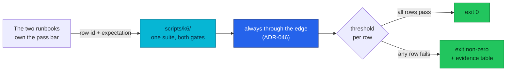

# ADR-056: Assert the E2E gates with k6 instead of reading curl by eye

> **Decision summary:** We will express the HTTP-shaped rows of both release
> gates as k6 checks with per-row thresholds, so a failed row is a non-zero exit
> code rather than a line of scrollback. We accept a new tool on the contributor's
> path in exchange for gates that can fail, rows that can be proven runnable, and
> the load and rate-limit dimensions neither gate had.

| Attribute | Value |
|-----------|-------|
| **Status** | Accepted |
| **Decision date** | 2026-08-22 |
| **Owners** | platform |
| **Deciders** | repository owner |
| **Scope** | How the two E2E release gates assert; not where they run |
| **Affected components** | `scripts/k6/`, both audit runbooks, `Makefile`, edge rate-limit sizing |
| **Related RFC** | — |
| **Related research** | — |
| **Supersedes** | — |
| **Superseded by** | — |
| **Implementation tracking** | PRs on `feat/k6-e2e-assertions` |
| **Adoption** | Partial — Kind rows converted and proven; compose rows staged |

## Context

The platform has two release gates, and both are prose:
[`local-stack/docs/e2e-audit.md`](../../../../local-stack/docs/e2e-audit.md) (52
rows) and [`kind-e2e-audit.md`](../../../platform/kind-e2e-audit.md) (52 rows).
A row is a `curl` to paste and a status code to read. There is no `make` target
for e2e, so nothing — no CI job, no tag script, no human in a hurry — can depend
on a gate's verdict.

Three costs of that shape were being paid, and they are measurable rather than
stylistic.

**A gate that cannot fail does not gate.** The pass criteria live in prose next
to each command. Nothing compares the observed output to them, so a regression
passes whenever the reader is tired.

**Rows can be written so they cannot pass, and the failure reads as a broken
platform.** K4.3 drove `https://127.0.0.1/…` and wanted `404`. SNI may not carry
an IP literal, so no TLS filter chain matches and Envoy drops the connection
before HTTP exists — `curl` reports exit 35 and `http_code 000`. The row had
never passed. This is the same defect class already found in K1.7, K5.4 and the
`OrderSagaNotCompleting` runbook: an assertion nobody could satisfy, indefinitely
mistaken for an outage.

**Whole dimensions were unmeasured.** Across 104 rows there is exactly one
numeric threshold (compose C11, a DB p95 sanity check for bucket collapse). No
row asserts throughput. No row issues two requests concurrently. Neither gate
tests the edge rate limiter at all — while compose is configured at 50/s and the
cluster was at 2/s per instance, a 25× disagreement the stricter side never
mentions. And `approximate_backlog_count` had never left zero, so
[ADR-055](../ADR-055-keda-worker-autoscaling/) proposed scaling on a signal
nobody had observed move.

## Scope

### In scope

- Rows whose assertion is an HTTP status, header, or JSON field.
- The Temporal-facing assertions of K1.7 and K4.10, which the Temporal UI's JSON
  API makes reachable over HTTP.
- The edge rate limiter as a tested contract, and the sizing correction that
  measurement forced.
- Generating order load through the edge, and the Temporal backlog it builds.

### Out of scope

- **Where the gate runs.** [ADR-046](../ADR-046-e2e-gate-kind-fallback/) decides
  that, and this ADR does not disturb it: every assertion still goes through the
  real edge.
- **Browser rows.** k6 ships a browser module, but the Playwright suites live in
  the `frontend` and `admin-service` repositories, next to the code they test.
- **`kubectl`, `psql` and CLI rows.** They stay as they are.
- **Running k6 in CI.** A gate needs a live stack; nothing here creates one.
- **Installing k6-operator.** See alternatives.

## Decision drivers

- A gate must be able to fail, and its verdict must be machine-readable.
- A row must be provably runnable, not merely written down.
- Evidence should be generated, not typed — both runbooks currently ask a human
  to fill an evidence table by hand.
- One implementation should serve both gates, or they will drift apart again.
- No traffic that skips edge policy may count as gate evidence.

## Decision

We will keep both runbooks as the authority on *what* is asserted, and move the
*asserting* of HTTP-shaped rows into a k6 suite at
[`scripts/k6/`](../../../../scripts/k6/), driven by `make e2e GATE=compose|kind`.

Each unit in the suite is one audit row. A unit declares a row id **per gate**,
because the two runbooks number the same assertion differently and some rows
exist on only one side. Every assertion is tagged with its row, and every row
carries a `checks{row:<id>}: rate==1.0` threshold — so a failed assertion
breaches a threshold and k6 exits non-zero, and `handleSummary()` prints the
PASS/FAIL table the runbooks ask a human to type.

### Decision rules

| Rule | Required behavior |
|------|-------------------|
| **Ownership** | The runbooks own *what* is asserted and the pass bar; the k6 suite owns *how*. A row's meaning may not change silently in code. |
| **Write path** | A row's expectation changes in the runbook first. Code that disagrees with a runbook is a bug in one of them, to be resolved explicitly. |
| **Read path** | Verdicts come from the exit code and `scripts/k6/out/`. Scrollback is not evidence. |
| **Boundary** | Every gate-bearing request goes through the edge. Load that bypasses edge policy is a diagnostic, never gate evidence (ADR-046). |
| **Failure behavior** | Units are isolated: one throwing unit may not deny every later row its verdict. A row that did not execute reports **DID NOT RUN**, never PASS and never FAIL. |
| **Coverage honesty** | A unit with no row id on the current gate is reported as skipped and counted, so the asymmetry between the gates stays visible. |
| **Compatibility** | Additive. The bash token helper and every `kubectl`/`psql`/browser row keep working unchanged. |

### Decision view

## Alternatives considered

| Option | Benefits | Costs | Outcome |
|---|---|---|---|
| **A — k6 suite run from the contributor's machine** | Rows become thresholds; one suite serves both gates; load and concurrency become expressible; evidence is generated | A new tool on the path; JS alongside the repo's YAML and bash | Selected |
| **B — Keep curl, add a bash assertion harness** | No new tool; matches the runbooks' current idiom | Would reimplement checks, thresholds, arrival-rate pacing and summary reporting in bash; no load dimension worth having; the zsh `USERNAME` trap stays | Rejected |
| **C — k6-operator, running load inside the cluster** | Real load, unbounded by the edge limiter | A new controller (Flux Kustomization, RBAC, Kyverno compliance) for a decision ADR-055 has not taken; and in-cluster traffic skips edge policy, so it cannot be gate evidence | Rejected |
| **D — Convert the browser rows too** | One tool for everything | The UI suites belong beside the UI code in `frontend` and `admin-service`; homelab would own tests for code it does not hold | Rejected |

### Why the selected option won

k6 supplies exactly the four things missing: a check/threshold model that
produces an exit code, arrival-rate executors for load, a summary hook for
generated evidence, and enough of an HTTP and crypto surface to mint tokens
in-script. Nothing needs to be deployed for it to work.

It also turned out to reach further than expected. The Temporal UI serves a JSON
API carrying both a workflow's versioning block and a deployment's routing
config, so K1.7 and K4.10 — the two rows that most needed a cluster and the only
proof the order saga runs — became HTTP assertions. Comparing a workflow's build
id against the server's routing config is *stronger* than reading the CRD's
status: the routing config is what the server dispatches on, while the CRD
reports what the controller believes it asked for.

### Why the closest alternative lost

A bash harness (B) would have to grow checks, per-row thresholds, arrival-rate
pacing, and a summary writer before matching what k6 does out of the box, and it
would still leave the load dimension out of reach. The runbooks already prove
how far careful bash gets: far enough to be valuable, not far enough to fail.

## Consequences

### Positive consequences

- A gate can fail. `make e2e` returns non-zero on a bad row, so a tag script or
  CI job can depend on it.
- Evidence is generated. The PASS/FAIL table lands in `scripts/k6/out/` ready to
  paste, instead of being transcribed by hand.
- Two rows that could not pass were found by running them: K4.3's IP-literal
  probe, and a trace-coverage row failing because `review` is only reachable
  through product's fan-out and no row ever called it.
- The edge limiter is tested for the first time, in both directions — nothing
  limited below the ceiling, `429` with draft-03 headers above it.
- `approximate_backlog_count` left zero for the first time (peak 20, drained to
  0 when the worker returned), giving ADR-055 a signal that has been observed
  rather than assumed.
- The order saga is asserted end to end without `kubectl`.

### Negative consequences and accepted trade-offs

- A new language and tool in the repository. Contributors need `k6` on PATH.
- Two places can now describe one row — the runbook's prose and the unit's
  checks. The ownership rule above exists to keep them from disagreeing
  silently, but it is a discipline, not a mechanism.
- Order load is capped at four VUs, because four customer identities exist and
  the services admit one active checkout session per user.
- Sustained order load exhausts a SKU's seeded stock and the saga then fails
  correctly; past that point a run measures the inventory rather than the
  platform.
- Compose rows are staged, not converted: the compose stack was down while the
  cluster was up, and running both at once is not something this host tolerates.

### Neutral consequences

- The bash token helper stays for hand-driven rows.
- The rate-limit sizing correction rides along, recorded as an amendment on
  [ADR-045](../ADR-045-local-first-edge-rate-limiting/).

## Implementation obligations

| Obligation | Owner | Tracking | Completion signal |
|------------|-------|----------|-------------------|
| Kind HTTP rows expressed as units | platform | `feat/k6-e2e-assertions` | `make e2e GATE=kind` passes or names the row that failed |
| Saga + versioning rows over HTTP | platform | same | K1.7/K4.10 need no `kubectl exec` |
| Edge limiter asserted both directions | platform | same | `make e2e-ratelimit` proves the ceiling and the headers |
| Rate-limit sizing corrected + recorded | platform | ADR-045 History | 25/Second in `btp-api.yaml`, amendment written |
| Compose rows converted | platform | follow-up | `make e2e GATE=compose` covers the 19 `http` rows |
| Runbook rows point at the suite | platform | same | No converted row still asks for a hand-read `curl` |

## Validation and compliance

| Requirement | Verification |
|-------------|--------------|
| A failed row fails the run | Break one assertion deliberately; `make e2e` must exit non-zero |
| A skipped row cannot read as a pass | A row with no executed check reports **DID NOT RUN** |
| No gate traffic bypasses the edge | Every base URL in `lib/config.js` is an edge hostname |
| The ceiling in code matches the manifest | `ratelimit.js` fails if `btp-api.yaml` and `config.js` disagree |
| Documentation | [`docs/testing/k6.md`](../../../testing/k6.md) links this ADR; both runbooks link the suite |

## Revisit triggers

Re-open this decision when one or more of the following become true:

- A gate needs to run unattended in CI, which requires standing up a stack and
  is a different decision from this one.
- Load must exceed what the edge limiter permits, making in-cluster generation
  (alternative C) unavoidable — at which point ADR-046's boundary must be
  addressed head-on rather than worked around.
- The runbooks and the suite are found to disagree about a row's pass bar, which
  would mean the ownership rule is not holding and needs a mechanism.
- More than a handful of customer identities exist, lifting the four-VU ceiling
  on order load.

## References

- [`docs/testing/k6.md`](../../../testing/k6.md) — how the suite is used
- [ADR-045](../ADR-045-local-first-edge-rate-limiting/) — edge rate limiting and its sizing
- [ADR-046](../ADR-046-e2e-gate-kind-fallback/) — where the gate runs; the edge-policy boundary
- [ADR-054](../ADR-054-temporal-worker-controller/) — the worker versioning this suite asserts
- [ADR-055](../ADR-055-keda-worker-autoscaling/) — the autoscaling proposal this suite gives a signal to
