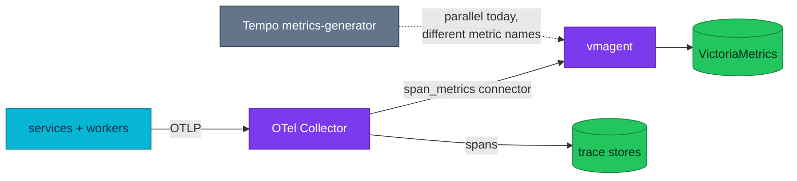

# ADR-057: Derive RED span metrics in the collector, not inside a trace backend

> **Decision summary:** We will derive RED span metrics with the OpenTelemetry
> Collector's `span_metrics` connector instead of Tempo's metrics-generator,
> because tying a signal the SLO and Apdex maths depend on to the lifetime of one
> trace backend makes that backend unremovable. We accept one more component in
> the collector — and a producer that is redundant if Tempo is ultimately kept —
> in exchange for decoupling the metric from the store.

| Attribute | Value |
|-----------|-------|
| **Status** | Accepted |
| **Decision date** | 2026-08-24 |
| **Owners** | `duynhne` |
| **Deciders** | `duynhne` |
| **Scope** | Where RED span metrics are produced, and how they reach VictoriaMetrics |
| **Affected components** | OTel Collector, Tempo (chart install), vmagent, VictoriaMetrics, SLO/Apdex rules |
| **Related RFC** | [RFC-0027](../../rfc/RFC-0027/) |
| **Related research** | [research.md](../../rfc/RFC-0027/research.md) |
| **Supersedes** | — |
| **Superseded by** | — |
| **Implementation tracking** | #878 (landed ahead of the RFC gate — see History) |
| **Adoption** | **Complete** — series verified on Kind 2026-08-24 (counts track traffic; 421 `spanmetrics_calls_total` / 5473 duration buckets on a seeded run), collector 0 restarts, and the consumer obligation is met: the **Microservices — RED Span Metrics** board reads them cluster-side, and gate row **K5.5** asserts the leg. No *alert* reads them yet — recorded below, not blocking |

## Context

RED span metrics — request rate, error rate and duration derived *from* traces —
are produced today by Tempo's `metrics_generator`, and only by one of the two
Tempo installs. The hand-written install declares a generator but pins
`remote_write: []`, so it emits nothing; the Helm-chart install has it enabled
with `processors: [service-graphs, span-metrics]` and remote-writes to vmagent
with `send_exemplars: true`.

That places a signal the platform's SLO and Apdex arithmetic consumes **inside a
trace backend**, and after storage. The consequence is not theoretical: it makes
Tempo unremovable, because removing it removes the only producer. Every option in
RFC-0027 was blocked behind this one fact.

A second, smaller pressure: local-stack does not run Tempo at all, and instead
derives the same class of series with the collector's `span_metrics` connector.
The two E2E gates therefore measure differently-shaped platforms, and the Kind
gate's K5.5 row records the spanmetrics leg as *N/A on the cluster*.

## Scope

### In scope

- Which component derives RED span metrics from spans
- The transport those derived series take to VictoriaMetrics
- The series' names, dimensions, buckets and cadence

### Out of scope

- Whether Tempo or Jaeger are retired — [ADR-059](../ADR-059-retire-tempo/) and
  [ADR-058](../ADR-058-retire-jaeger/)
- Service graphs. The connector chosen here produces span metrics only; the
  service-graph disposition is decided in [ADR-059](../ADR-059-retire-tempo/)
- Which dashboards or alerts consume the series — an obligation below, not a decision here
- Application-level metrics pushed by the SDKs; that path is untouched

## Decision drivers

| Priority | Driver | Why it matters |
|---------:|--------|----------------|
| 1 | Decoupling signal from store | A metric the SLO depends on must not die with a storage choice |
| 2 | Gate parity | compose and Kind should measure the same platform, or the gates prove different things |
| 3 | Reversibility | The change must be removable in one file if the backend decision goes the other way |
| 4 | No new dependency | Prefer a component already present in the running image over a new deployment |

## Decision

We will produce RED span metrics with the collector's **`span_metrics`
connector**, exporting them to the same vmagent remote-write endpoint Tempo's
generator writes to today.

The connector runs inside the collector the platform already deploys — the image
is `otel/opentelemetry-collector-contrib:0.159.0` on both the cluster and
local-stack, so the component ships in the binary already in use. Its
configuration is a deliberate port of local-stack's, so the two environments emit
the same series names rather than two dialects of the same idea.

This lands as a **parallel producer**. Tempo's generator keeps running and keeps
emitting its own `traces_spanmetrics_*`; the names differ, so nothing collides and
nothing is removed by this decision.

### Decision rules

| Rule | Required behavior |
|------|-------------------|
| **Ownership** | The collector owns derivation of RED span metrics. No trace backend may be the sole producer of a series the SLO or Apdex maths reads |
| **Write path** | The connector is an exporter on the `traces` pipeline and the sole receiver of a dedicated `metrics/spanmetrics` pipeline |
| **Read path** | Consumers read `spanmetrics_calls_total` and `spanmetrics_duration_*` from VictoriaMetrics; nobody reads them from a trace store |
| **Naming** | `namespace: spanmetrics`, matching local-stack. Series names must be identical across both gates |
| **Boundary** | The connector produces span metrics only. Service-graph metrics are a separate connector and a separate decision |
| **Temporality** | The connector emits cumulative; its pipeline must **not** include `delta_to_cumulative`, which exists for the SDK push path |
| **Failure behavior** | The connector requires all spans of a trace in one instance. While the collector runs a single replica this holds; scaling out requires a `loadbalancing` layer first |
| **Compatibility** | Not a breaking change while Tempo's generator also runs — different metric names, no collision |

### Decision view

## Alternatives considered

| Option | Benefits | Costs / risks | Result |
|--------|----------|---------------|--------|
| **A — `span_metrics` connector, remote-write to vmagent** | Signal independent of any store; parity with local-stack; component already in the image; one-file rollback | One more component in the collector; redundant if Tempo is kept; locks the collector at one replica until a `loadbalancing` layer exists | **Selected** |
| **B — keep Tempo's metrics-generator** | Zero work; already emitting; exemplars already wired | Keeps the signal hostage to a storage decision; blocks RFC-0027 entirely; the two gates stay differently shaped | Rejected |
| **C — connector, but export over the existing OTLP metrics path** | Reuses `otlp_http/victoriametrics`; no new exporter | The OTLP→Prometheus name translation becomes a second untested variable, and the cluster is down; the remote-write endpoint is already proven for exactly this class of series | Rejected |

### Why the selected option won

Driver 1 decides it. Every other option leaves a series the SLO consumes owned by
a component whose future is the subject of an open RFC. The connector also happens
to satisfy drivers 2 and 4 at no extra cost: it delivers gate parity, and it needs
no new image or deployment because the contrib distribution already in use
contains it.

### Why the closest alternative lost

Option C is not more complex — it is arguably simpler, one exporter fewer. It lost
on *verifiability*. Choosing it would have meant asserting that OTLP-to-Prometheus
name translation yields the same series names local-stack produces via
remote-write, with no way to check while the cluster is down. Option A reuses the
exact endpoint and mechanism Tempo's generator already proved on this platform, so
the naming question does not arise at all.

## Consequences

### Positive consequences

- The RED series stop depending on any trace backend's lifetime, which unblocks
  every option in RFC-0027
- Both E2E gates now derive span metrics the same way; K5.5's *N/A on the cluster*
  becomes derivable
- Exemplars survive the change (`exemplars.enabled`), so the metric → one-sample-trace
  jump is preserved
- local-stack's `red-spanmetrics.json` dashboard becomes portable to the cluster
  (**done** 2026-08-24, and it ported with only a title change),
  because the series names now match

### Negative consequences and accepted trade-offs

- **It is not decision-neutral.** If RFC-0027 ends up keeping the Tempo chart
  install, that install's generator stays live and this connector is redundant
- One more component on the collector's hot path — the component whose failure
  takes traces, logs and metrics with it
- **Locks the collector at one replica** until a `loadbalancing` exporter layer
  exists, because the connector must see all spans of a trace
- The bucket grid and dimensions are a write-time choice: `http.method` and
  `http.route` on top of the built-ins, and a bucket set that differs from
  `pkg/obsx`'s `DurationBuckets` for `http.server.request.duration`. Span-metric
  quantiles therefore interpolate on a different grid than app-metric quantiles
- A producer with no consumer for the first weeks of its life — closed 2026-08-24

### Neutral consequences

- Tempo's `traces_spanmetrics_*` keep being produced and keep being read by nobody
- No application change; no service redeploys and no `pkg` bump
- Metric cadence is unchanged at 15s, matching Tempo's `registry.collection_interval`

## Implementation obligations

| Obligation | Owner | Tracking | Completion signal |
|------------|-------|----------|-------------------|
| Connector + `metrics/spanmetrics` pipeline + remote-write exporter | `duynhne` | #878 | **Done** — merged 2026-08-24 |
| Verify the series exist and carry the service label | `duynhne` | RFC-0027 P1 window | **Done 2026-08-24** — 421 series, grouped by `service_name`; the four metric names match local-stack exactly, confirming the remote-write choice over the OTLP path |
| Give the series a consumer | `duynhne` | RFC-0027 | **Done 2026-08-24** — `red-spanmetrics` and `otel-collector-health` ported to the cluster, and K5.5 gained a fifth leg asserting `spanmetrics_calls_total`. The datasource question resolved differently than expected: the board declares a `type: datasource, query: prometheus` **variable**, not a uid, so nothing needed rewriting — but the cluster has **two** prometheus-type datasources, so the variable's `current` is pinned to `Prometheus`. Its sibling board needed the real fix: 26 selectors said `job="otel-collector"` while the cluster job is `otel-collector-opentelemetry-collector` |
| Give the series an alert | — | not scheduled | Nothing alerts on `spanmetrics_*`. The RED signals are already alerted from the SDK metrics, so a second source would double-page; revisit only if the SDK leg is ever dropped |
| Re-derive the K5.5 audit row | `duynhne` | RFC-0027 P5 | K5.5 no longer reads *N/A on the cluster* |
| Update service contracts | — | N/A — infra-only | No route, RPC or payload changes |

## Validation and compliance

| Requirement | Verification |
|-------------|--------------|
| Connector wired in both roles | `yq` on the HelmRelease: `span_metrics` appears in `pipelines.traces.exporters` **and** as the only receiver of `pipelines."metrics/spanmetrics"` |
| No `delta_to_cumulative` on the connector pipeline | Same query — the processor list must be `[memory_limiter, batch]` |
| Series names match local-stack | Compare `namespace` in both collector configs; both must be `spanmetrics` |
| Series reach VictoriaMetrics | `count(spanmetrics_calls_total) > 0` |
| Single-replica assumption holds | `replicaCount` in the collector HelmRelease is `1`, or a `loadbalancing` layer exists |
| Documentation | RFC-0027 § Observability & SLO impact links this ADR |

## Revisit triggers

Re-open this decision when one or more of the following become true:

- RFC-0027 selects a shape that keeps the Tempo chart install — this connector
  then duplicates a live generator and should be removed
- The collector needs more than one replica — pairing breaks without a
  `loadbalancing` exporter in front
- A consumer needs a dimension the current config does not carry (for example
  per-namespace RED), which is a config change, not a new decision
- The connector's memory footprint becomes material; `metrics_expiration` and
  `series_expiration` are currently left at their defaults

A review does not automatically reverse the decision. A changed decision requires
a new ADR that supersedes this one.

## References

- [RFC-0027](../../rfc/RFC-0027/)
- [RFC-0027 research](../../rfc/RFC-0027/research.md)
- [ADR-059 — retire Tempo](../ADR-059-retire-tempo/)
- [`docs/observability/opentelemetry/collector.md`](../../../observability/opentelemetry/collector.md)

## History

- **2026-08-24** — implemented in #878 **before this record existed**. The change
  landed while RFC-0027 was still at `researching`: no README, no architecture
  review, no ADR. It went in because the prerequisite it discharges blocked every
  other option in the RFC, and because it is additive — Tempo kept producing
  alongside it and nothing was removed. The reason and the rollback condition were
  recorded in the RFC research at the time; this ADR is the record catching up to
  the implementation, not the other way around.
- **2026-08-24** — created at `Proposed` during RFC-0027 architecture review.
- **2026-08-24** — **Accepted** with [RFC-0027](../../rfc/RFC-0027/), on the evidence of the P1 TraceQL experiment and the span-metrics measurement recorded in the research.
