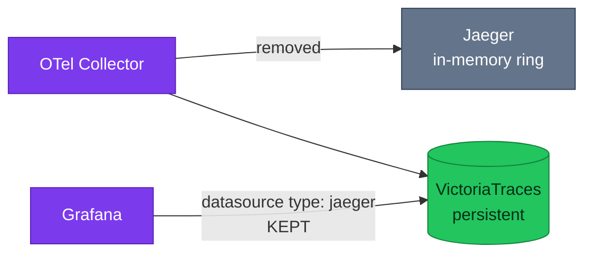

# ADR-058: Retire Jaeger, keeping the Jaeger query API as VictoriaTraces' interface

> **Decision summary:** We will remove the Jaeger deployment and its Grafana
> datasource, because its store is an in-memory ring that loses every trace on
> restart and its query interface is already served by VictoriaTraces. We accept
> losing the Jaeger UI's own pages in exchange for one fewer exporter on the hot
> path — and we explicitly keep the `jaeger` **datasource type**, which is how
> VictoriaTraces is queried.

| Attribute | Value |
|-----------|-------|
| **Status** | Accepted |
| **Decision date** | 2026-08-24 |
| **Owners** | `duynhne` |
| **Deciders** | `duynhne` |
| **Scope** | Whether the Jaeger deployment stays; not how VictoriaTraces is queried |
| **Affected components** | Jaeger, OTel Collector, Grafana datasources, Envoy Gateway routes and admin policies |
| **Related RFC** | [RFC-0027](../../rfc/RFC-0027/) |
| **Related research** | [research.md](../../rfc/RFC-0027/research.md) |
| **Supersedes** | — |
| **Superseded by** | — |
| **Implementation tracking** | RFC-0027 rollout P2 |
| **Adoption** | **Complete** — HelmRelease and `jaegertracing` HelmRepository retired to `*.yaml.bak` (#881); verified 2026-08-24 on a cluster rebuilt from scratch: **0** Jaeger workloads. The Grafana datasource of **type `jaeger`** deliberately remains — that is VictoriaTraces' query interface, and 14 services answer on it |

## Context

Jaeger is one of five sinks on the collector's `traces` pipeline. Its store is
configured as `memory: max_traces: 100000` — a ring buffer that empties whenever
the pod restarts. It declares no resource requests or limits, has no alert, no
dashboard, no ServiceMonitor, no PVC, no object-storage bucket, no NetworkPolicy
of its own and no `dependsOn` edge.

Meanwhile VictoriaTraces — which the platform already runs — implements the
**Jaeger query API** at `/select/jaeger`, and the Grafana datasource pointed at it
is `type: jaeger` for exactly that reason. So the query interface Jaeger provides
is already available from a store that persists.

The pressure is not cost; it is that a fifth exporter on the hot path buys a UI
over data that does not survive a restart.

## Scope

### In scope

- Removing the Jaeger `HelmRelease`, its collector exporter, its Grafana
  datasource, its edge route and the two admin policies that reference it
- Removing the `jaegertracing` Helm repository source

### Out of scope

- The `jaeger` **datasource type**, which stays — VictoriaTraces is queried through it
- Whether Tempo is retired — [ADR-059](../ADR-059-retire-tempo/)
- Whether the Jaeger *dependency graph* API is enabled on VictoriaTraces; that is
  part of [ADR-059](../ADR-059-retire-tempo/)'s service-graph disposition

## Decision drivers

| Priority | Driver | Why it matters |
|---------:|--------|----------------|
| 1 | Value for hot-path cost | An exporter slot should buy something that outlives a pod restart |
| 2 | Reversibility | Cheapest possible rollback keeps the risk near zero |
| 3 | Interface preservation | The Jaeger *query contract* must survive even though the Jaeger *deployment* does not |

## Decision

We will delete the Jaeger deployment, its collector exporter, its datasource and
its edge exposure. The `traces` pipeline drops from five exporters to four as a
result of this ADR alone.

Manifests are retired using the repository's `.bak` convention rather than being
deleted from history: the file is renamed to `*.yaml.bak` and removed from its
`kustomization.yaml`, which keeps it out of `make validate` while leaving it
readable. The reasoning is recorded in
`kubernetes/infra/controllers/temporal/kustomization.yaml`, where the same pattern
retired the Temporal operator.

The canonical documentation, `docs/observability/tracing/jaeger.md`, is **kept and
marked archived** — frozen history, retained as learning material, following the
pattern `docs/platform/kong-gateway.md` established in RFC-0024.

### Decision rules

| Rule | Required behavior |
|------|-------------------|
| **Ownership** | No component may depend on the Jaeger deployment for trace storage or query |
| **Interface** | The Grafana `jaeger` datasource **type** remains in use; it is VictoriaTraces' query interface, not a Jaeger artifact |
| **Retirement mechanics** | Manifests are renamed `*.yaml.bak` and dropped from `kustomization.yaml`, with a comment naming this ADR. They are not deleted |
| **Documentation** | `tracing/jaeger.md` is archived, not deleted, and states plainly that its commands no longer work |
| **Boundary** | This ADR does not touch Tempo, VictoriaTraces retention, or the trace pipeline beyond removing one exporter |
| **Failure behavior** | Rollback is re-adding one `HelmRelease` and one datasource; no data migration exists to undo |

### Decision view

## Alternatives considered

| Option | Benefits | Costs / risks | Result |
|--------|----------|---------------|--------|
| **A — remove the deployment, keep the datasource type** | One fewer exporter; keeps the query contract; cheapest rollback in the tree | Loses Jaeger UI's own pages (System Architecture, comparison view) | **Selected** |
| **B — keep Jaeger as a secondary UI** | Familiar UI; zero work | An exporter slot for a store that empties on restart; and the same API is served by a store that persists | Rejected |
| **C — keep Jaeger but give it persistent storage** | Traces survive restarts | Duplicates VictoriaTraces' role with a second persistent store; adds a PVC and a backend to operate, in an RFC whose purpose is fewer stores | Rejected |

### Why the selected option won

Driver 1 is decisive and unusually clear-cut: nothing on the platform reads Jaeger
that VictoriaTraces cannot serve, and the data Jaeger holds is gone at the next
restart anyway. Driver 2 reinforces it — of all the removals in RFC-0027 this is
the only one with no alert, bucket, secret or dependency to unpick.

### Why the closest alternative lost

Option C is coherent and would produce a working second trace store. It lost
because it answers a question nobody asked: RFC-0027 exists to reduce the number
of trace stores, and giving Jaeger a PVC increases it while duplicating a
capability VictoriaTraces already provides.

## Consequences

### Positive consequences

- `traces` pipeline drops one exporter with no loss of persisted data — there was
  none to lose
- The cheapest removal in the RFC: no alert, dashboard, scrape, secret, PVC,
  bucket, NetworkPolicy or `dependsOn` to unpick
- One fewer edge route and two fewer admin policy references

### Negative consequences and accepted trade-offs

- Jaeger UI's own pages are gone. The System Architecture view in particular is a
  real loss; [ADR-059](../ADR-059-retire-tempo/) addresses service-graph
  capability separately, and it does so through the same Jaeger API on VictoriaTraces
- One of the three `tracesToLogsV2` links disappears with its datasource

### Neutral consequences

- The word "jaeger" remains throughout the repository, correctly: it names an API
  and a datasource type, not a deployment
- No application change

## Implementation obligations

| Obligation | Owner | Tracking | Completion signal |
|------------|-------|----------|-------------------|
| Rename `controllers/tracing/jaeger/jaeger.yaml` → `.bak`, drop from kustomization with a comment | `duynhne` | RFC-0027 P2 | `make validate` green; file present as `.bak` |
| Remove `otlp/jaeger` exporter and its pipeline entry | `duynhne` | RFC-0027 P2 | `traces` pipeline lists four exporters |
| Remove `datasource-jaeger.yaml`; **keep** `datasource-victoriatraces.yaml` | `duynhne` | RFC-0027 P2 | Grafana datasource count drops by one; VictoriaTraces still queryable |
| Remove the `jaeger.duynh.me` route and the two admin policy references | `duynhne` | RFC-0027 P2 | `scripts/edge-isolation-sweep.sh` clean |
| Archive `docs/observability/tracing/jaeger.md` | `duynhne` | this PR | Archived banner present; body frozen |
| Update the hardcoded audit datasource count | `duynhne` | RFC-0027 P5 | C17 asserts the new number |
| Update service contracts | — | N/A — infra-only | No route, RPC or payload changes |

## Validation and compliance

| Requirement | Verification |
|-------------|--------------|
| Deployment gone | No `jaeger` HelmRelease in the cluster; `.bak` file present in the tree |
| Exporter gone | `pipelines.traces.exporters` no longer contains `otlp/jaeger` |
| Datasource type preserved | `datasource-victoriatraces.yaml` still declares `type: jaeger` and resolves |
| Traces still queryable | A trace opened through the VictoriaTraces datasource in Grafana |
| Edge closed | `scripts/edge-isolation-sweep.sh` reports no `jaeger` route |
| Documentation | `tracing/jaeger.md` carries the archived banner and links the live replacement |

## Revisit triggers

Re-open this decision when one or more of the following become true:

- VictoriaTraces stops serving the Jaeger query API, or its implementation
  diverges enough that the Grafana datasource breaks
- A Jaeger-UI-only capability becomes operationally necessary and cannot be met
  through Grafana against VictoriaTraces
- VictoriaTraces is itself retired, which would leave the platform without a
  Jaeger-API-compatible store

A review does not automatically reverse the decision. A changed decision requires
a new ADR that supersedes this one.

## References

- [RFC-0027](../../rfc/RFC-0027/)
- [RFC-0027 research](../../rfc/RFC-0027/research.md)
- [ADR-059 — retire Tempo](../ADR-059-retire-tempo/)
- [`docs/observability/tracing/jaeger.md`](../../../observability/tracing/jaeger.md) — archived
- [`docs/platform/kong-gateway.md`](../../../platform/kong-gateway.md) — the archived-doc pattern

## History

- **2026-08-24** — created at `Proposed` during RFC-0027 architecture review.
- **2026-08-24** — **Accepted** with [RFC-0027](../../rfc/RFC-0027/), on the evidence of the P1 TraceQL experiment and the span-metrics measurement recorded in the research.
- **2026-08-25** — restated for the record because this History is a bullet list and carries no `Status / adoption` column: the decision stands at **Accepted / Adoption Complete**, on the evidence above — the Jaeger install is retired and no datasource, dashboard or alert refers to it. No new change; the header and this list now say the same thing.

---
_Last updated: 2026-08-25_
