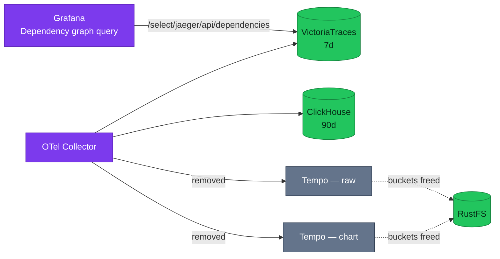

# ADR-059: Retire both Tempo installs and take service graphs from VictoriaTraces

> **Decision summary:** We will retire both Tempo installs — the hand-written
> manifests and the Helm chart — because the platform runs two copies of one store
> whose distinguishing capability has been moved out of it, and because the
> question of *how* to deliver Tempo has now failed to land twice. We accept losing
> Tempo's native TraceQL surface and per-edge service-graph **metrics**, in
> exchange for two trace stores instead of four and a closed decision lineage.

| Attribute | Value |
|-----------|-------|
| **Status** | Accepted |
| **Decision date** | 2026-08-24 |
| **Owners** | `duynhne` |
| **Deciders** | `duynhne` |
| **Scope** | Whether Tempo stays; and where service-graph capability comes from afterwards |
| **Affected components** | Tempo (both installs), OTel Collector, Grafana datasources, RustFS, ExternalSecrets, Envoy Gateway routes, `TempoDown` alert, ServiceMonitor, VictoriaTraces |
| **Related RFC** | [RFC-0027](../../rfc/RFC-0027/) |
| **Related research** | [research.md](../../rfc/RFC-0027/research.md) |
| **Supersedes** | [ADR-040](../ADR-040-tempo-community-helm-chart/) (withdrawn 2026-08-24 — phase 1 shipped, phase 2 never started, both installs now removed) |
| **Superseded by** | — |
| **Implementation tracking** | RFC-0027 rollout P3–P5 |
| **Adoption** | **Complete** — both installs retired to `*.yaml.bak` and dropped from their kustomizations (#881); verified on a cluster rebuilt from scratch 2026-08-24: 22/22 Kustomizations Ready, **0** Tempo workloads, datasources 8 → 7 with no `tempo` type, RustFS writers 4 → 2. The replacement service graph measured **31 edges**, including database dependencies (`cart -> cart:postgresql`) and edge-originated ones (`platform.envoy-gateway -> checkout`, 300 calls) |

## Context

Tempo runs **twice**. The hand-written install and the Helm chart install receive
the same spans, write to two different RustFS buckets, and differ in exactly one
way that matters: the chart install's `metrics_generator` is enabled while the raw
install pins `remote_write: []`. [ADR-057](../ADR-057-span-metrics-in-collector/)
has since moved RED span-metric production into the collector, which removes the
one capability that made the chart install load-bearing.

The delivery question has also failed to land twice.
[ADR-032](../ADR-032-tempo-operator-monolithic/) is `Withdrawn` in favour of
[ADR-040](../ADR-040-tempo-community-helm-chart/), and ADR-040 is still `Proposed`
with `Decision date: —`. Tempo has absorbed two decision records and neither
reached a decision, so the next record about Tempo either closes that lineage or
becomes the third.

Two operational facts add pressure. RustFS takes writes from four producers, two
of which are this Tempo pair, while restarting under its own liveness probe — 11
restarts in 3h12m with CPU throttling measured at 0.0. And the `TempoDown` alert
watches only the raw install, because the sole scrape producing `job=~".*tempo.*"`
selects `app: tempo`, which the chart does not set.

## Scope

### In scope

- Retiring both Tempo installs, their buckets, their ExternalSecret, their
  ServiceMonitor, their alert, their dashboard, their datasource and their edge route
- Where service-graph capability comes from once Tempo's generator is gone
- The mechanics of retirement: `.bak` manifests and archived documentation

### Out of scope

- Jaeger — [ADR-058](../ADR-058-retire-jaeger/)
- Where RED span metrics are produced — [ADR-057](../ADR-057-span-metrics-in-collector/), already decided
- Envoy access-log transport — [ADR-060](../ADR-060-envoy-access-log-transport/)
- VictoriaTraces retention, resource sizing, or its promotion to a Tempo-type datasource;
  the datasource change is rollout work under RFC-0027, not a separate decision
- ClickHouse's self-managed schema question, which is independent of which backends survive

## Decision drivers

| Priority | Driver | Why it matters |
|---------:|--------|----------------|
| 1 | Close the lineage | A third undecided Tempo record is worse than either outcome |
| 2 | Stores must answer distinct questions | Two copies of one store over the same window answer nothing extra |
| 3 | Operability | Halving RustFS's trace writers touches a component that is currently flapping |
| 4 | Capability preservation | Nothing that is actually used may disappear silently |
| 5 | Reversibility | Retirement must be reversible while the 7-day window lasts |

## Decision

We will retire **both** Tempo installs. VictoriaTraces and ClickHouse become the
platform's only trace stores.

Service-graph capability is **not** replaced with a metrics producer. It is taken
from **VictoriaTraces' Jaeger dependency-graph API**: enabling
`-servicegraph.enableTask` makes `/select/jaeger/api/dependencies` serve
parent/child/callCount, and Grafana's `jaeger` datasource — which already points at
VictoriaTraces — has a native **Dependency graph** query type that renders it as a
Node Graph. This is a capability *gain*: today Tempo emits
`traces_service_graph_*` that nothing reads, and the cluster has no service map at all.

Retirement mechanics follow the repository's existing conventions rather than
deletion. Manifests are renamed `*.yaml.bak` and dropped from their
`kustomization.yaml` with a comment naming this ADR — the pattern documented in
`kubernetes/infra/controllers/temporal/kustomization.yaml`, where the `.bak` suffix
*"keeps it out of here and out of `make validate` without commenting the file into
unreadability."* Documentation is **archived, not deleted**, following
`docs/platform/kong-gateway.md`.

### Decision rules

| Rule | Required behavior |
|------|-------------------|
| **Ownership** | VictoriaTraces owns the 7-day trace read path; ClickHouse owns the 90-day one. No third trace store |
| **Prerequisite** | Tempo may not be removed until RED span metrics are proven flowing from the collector ([ADR-057](../ADR-057-span-metrics-in-collector/)) **and** the TraceQL parity experiment has run |
| **Both or neither** | Both installs are retired together. Retiring one and keeping the other leaves `TempoDown` with zero series — it loads cleanly, never fires, and reads as healthy forever |
| **Service graph** | Topology comes from VictoriaTraces' dependency API, not from a metrics producer. Per-edge failure and latency, when needed, come from a documented ClickHouse query |
| **Retirement mechanics** | `*.yaml.bak` + removed from `kustomization.yaml` + a comment naming this ADR. Never a silent delete |
| **Documentation** | Tempo's knowledge is consolidated into an archived `docs/observability/tracing/tempo.md` before removal, not after |
| **Boundary** | This ADR does not decide VictoriaTraces' own configuration beyond the one flag that serves the dependency API |
| **Failure behavior** | Traces inside the 7-day window that existed only in Tempo are lost with it; every span was already fanned out to both surviving stores, so the ingestion side needs no migration |

### Decision view

## Alternatives considered

Trace-store shape (full analysis in [research.md](../../rfc/RFC-0027/research.md#alternatives)):

| Option | Benefits | Costs / risks | Result |
|--------|----------|---------------|--------|
| **A — retire both, keep VictoriaTraces + ClickHouse** | Two stores answering two windows; RustFS writers 4→2; gate parity with local-stack; lineage closed | VictoriaTraces is pre-GA `v0.11.0`; its Tempo-compatible TraceQL API is experimental; Grafana's richest trace correlation is lost | **Selected** |
| **B — keep the chart install only** | GA product; native TraceQL; keeps serviceMap/tracesToMetrics/tracesToProfiles | Keeps the RustFS dependency on the flapping component; compose still has no Tempo so the gates stay differently shaped; commits to ADR-040 rather than resolving it | Rejected |
| **C — ClickHouse as the only trace store** | One engine, one language, 90 days, JOINs against logs | Removes the fast 7-day path entirely; heaviest single workload | Rejected |

Service-graph replacement, once Tempo's generator is gone:

| Option | Benefits | Costs / risks | Result |
|--------|----------|---------------|--------|
| **VictoriaTraces dependency API** | Native Grafana rendering; one flag; no new component; no replica constraint; a service map where there is none today | `callCount` only — no per-edge failure or latency; not Prometheus series, so not alertable; bounded by the 7-day window | **Selected** |
| **`service_graph` connector** | Full per-edge RED metrics; PromQL-alertable | A new component on the collector's hot path; a 2s default pairing window; and it needs all spans of a trace in one instance, locking the collector at one replica unless a `loadbalancing` layer is added | Rejected — kept as a revisit trigger |
| **ClickHouse self-join** | Richest: per-edge failure, latency, 90 days, any dimension | Must be shaped into Node Graph's frame contract by hand; a self-join over spans with no materialized columns or skip indexes, so it scans | Rejected as the default; adopted as a documented deep-dive |

### Why the selected option won

Driver 1 forces a decision, and driver 2 says which way: three of five sinks
answered the same question over the same window, and the pair among them was
literally the same software twice. Driver 4 was the one that needed work rather
than assertion — and the service-graph research turned it from a loss into a gain,
because a flag on a store we keep produces a service map the platform has never
had.

### Why the closest alternative lost

Option B is genuinely defensible: Tempo is GA, its TraceQL is native rather than
experimental, and it keeps Grafana correlation features that VictoriaTraces does
not reproduce. It lost on drivers 1 and 3 together. Choosing B means accepting
ADR-040 — the record that has sat undecided for weeks — as the answer, while
keeping the object-storage dependency on the one component in the observability
stack that is currently restarting under its own probe. The trade is real: B keeps
better query ergonomics, A closes a decision and removes load from a flapping
component.

## Consequences

### Positive consequences

- Trace stores 5 → 2 once [ADR-058](../ADR-058-retire-jaeger/) also lands; the
  cluster and local-stack finally measure the same shape
- RustFS trace writers 4 → 2, on the component with 11 restarts in 3h12m
- The ADR-032 → ADR-040 lineage closes with a decision instead of a third proposal
- **A working service map for the first time**, from one flag on a store we keep —
  measured at 12 edges, and richer than Tempo's: it includes database dependencies
  (`checkout → checkout:postgresql`) alongside the service-to-service graph
- `TempoDown`'s zero-series trap is removed by deletion rather than left latent

### Negative consequences and accepted trade-offs

- **TraceQL becomes experimental, and the gaps are silent.** The P1 experiment
  (2026-08-24, `v0.11.0`) confirmed single-selector TraceQL and TraceQL metrics work,
  but `span.`/`span:` scoped attributes and multi-selector or structural queries
  (`>>`, `>`, `&&` between selectors) return **zero results with HTTP 200**. A
  deliberately malformed query does the same, so the API has **no error channel**:
  an unsupported query is indistinguishable from "no trace matched". This is a
  larger cost than upstream's *"certain TraceQL functions and drilldown panels may
  not be fully supported"* conveys, and it is the same failure shape this record
  removes elsewhere — `TempoDown`'s zero series. It is accepted because the queries
  the platform actually runs are single-selector, and because keeping the
  Jaeger-type datasource as the primary read path limits exposure to it
- **`api/search/tags` v1 answers 400**; only the `v2` path works, so a Grafana
  version that calls v1 will show empty autocomplete
- **The dependency graph is not retroactive.** The background task runs on a 1
  minute interval with a 1 minute lookbehind, so it aggregates only what is
  ingested while it runs. Immediately after enabling the flag the endpoint
  returned **0 edges** for eleven minutes because no traffic had flowed — the map
  reads as broken when it is merely empty, the same silent shape as the TraceQL
  gaps above. Anyone enabling this should generate traffic before concluding
  anything
- **Per-edge failure and latency metrics are lost.** The dependency API returns
  `callCount` only. Alerting on "edge A→B is failing" is not expressible until and
  unless the `service_graph` connector is adopted
- Grafana's serviceMap, tracesToMetrics and tracesToProfiles on the Tempo
  datasource are not reproduced
- The only fast trace path becomes a pre-GA store
- Traces held only in Tempo within its 7-day window are lost at removal

### Neutral consequences

- No application change; no service redeploys and no `pkg` bump. The removal
  surface contains no file under `kubernetes/apps/`
- Manifests remain in the tree as `.bak`, so the configuration stays readable
  without being applied
- The word "tempo" remains in comments until RFC-0027 P5 corrects them

## Implementation obligations

| Obligation | Owner | Tracking | Completion signal |
|------------|-------|----------|-------------------|
| Run the TraceQL parity experiment | `duynhne` | RFC-0027 P1 | A Tempo-type datasource against `/select/tempo` exercised with real queries; failures recorded |
| Consolidate Tempo knowledge into an archived doc | `duynhne` | this PR | `docs/observability/tracing/tempo.md` exists, banner present, body frozen |
| Enable `-servicegraph.enableTask` on `vtsingle` | `duynhne` | RFC-0027 P3 | **Done 2026-08-24** — the pod runs with `-servicegraph.enableTask=true` and the endpoint returns **12 edges**, including database dependencies (`checkout → checkout:postgresql` 2251, `platform.envoy-gateway → checkout` 425, `checkout → checkout-worker` 421) |
| Add a Dependency graph panel on the existing VictoriaTraces datasource | `duynhne` | RFC-0027 P3 | **Done 2026-08-25** — the **Service Graph** board (`uid: service-graph`) carries a Node Graph panel with `queryType: dependencyGraph` on the `victoriatraces` datasource. Verified against the live Kind cluster through Grafana's own datasource proxy: **34 edges**, `platform.envoy-gateway -> product` at 513 calls |
| Document the ClickHouse per-edge query | `duynhne` | RFC-0027 P3 | **Done 2026-08-25** — [`docs/observability/tracing/service-graph.md`](../../../observability/tracing/service-graph.md) carries the self-join, and the same query runs as the board's second panel. Verified via Grafana `/api/ds/query`: **24** service→service edges with `callCount`, `failed` and `p95_ms` |
| Retire manifests as `.bak`, drop from kustomizations with comments | `duynhne` | RFC-0027 P4 | **Done** (#881) — `make validate` green; `.bak` files present; comments name this ADR |
| Delete `TempoDown`, the ServiceMonitor, the dashboard, the datasource, the ExternalSecret, both buckets and the edge route | `duynhne` | RFC-0027 P4 | **Done, with one over-reach corrected in P5** — `TempoDown` shared its file with `OtelCollectorDown`, so `.bak`-ing the file deleted a **critical** alert that was not part of this decision. Restored as `otel-collector-alerts.yaml` (#882). RustFS bucket list has two entries fewer |
| **On acceptance: flip [ADR-040](../ADR-040-tempo-community-helm-chart/) to `Withdrawn` in favour of this record** | `duynhne` | RFC-0027 P4 | **Done 2026-08-24, late** — missed in P4 and caught by the P5 docs audit, which found ADR-040 still at `Status: Proposed` with `Adoption: Partial` while nothing from it was running. ADR-040 now carries the banner and `Superseded by: ADR-059`, matching how ADR-032 was withdrawn |
| Correct the hardcoded audit counts and comment-only mentions | `duynhne` | RFC-0027 P5 | **Done** (#882) — 40 documents and 10 runbooks corrected; no comment claims Tempo is running. C17/C18/C21 are compose rows and are re-derived on the next compose gate |
| Update service contracts | — | N/A — infra-only | No route, RPC or payload changes |

## Validation and compliance

| Requirement | Verification |
|-------------|--------------|
| Prerequisite met | `count(spanmetrics_calls_total) > 0` on the cluster before any Tempo removal |
| TraceQL parity assessed | Recorded outcome of the P1 experiment, pass or fail, in RFC-0027 |
| Both installs gone together | No `tempo` HelmRelease or Deployment; `TempoDown` deleted in the same change |
| Retirement mechanics | `.bak` files present; `kustomization.yaml` comments name ADR-059; `make validate` green |
| Service map works | Grafana Dependency graph query against the VictoriaTraces datasource returns edges |
| Per-edge deep dive available | The documented ClickHouse self-join returns `callCount`, `failed` and `p95` per edge |
| Traces still reachable | K5.1 (SQL on ClickHouse) still passes; a trace opens through VictoriaTraces in Grafana |
| Documentation | `tracing/tempo.md` archived; RFC-0027 § Design Details describes `.bak`, not deletion |

## Revisit triggers

Re-open this decision when one or more of the following become true:

- The TraceQL parity experiment fails on queries the platform actually uses — then
  option B returns to the table and this ADR should not be accepted as written
- Per-edge alerting becomes a real requirement, not a hypothetical: adopt the
  `service_graph` connector, accepting the single-replica constraint or adding a
  `loadbalancing` layer
- VictoriaTraces' Tempo-compatible API stops being maintained, or stays
  experimental long enough that depending on it is untenable
- The collector needs more than one replica, which interacts with any future
  `service_graph` connector adoption
- RustFS stops flapping for reasons unrelated to trace writes, weakening driver 3

A review does not automatically reverse the decision. A changed decision requires
a new ADR that supersedes this one.

## References

- [RFC-0027](../../rfc/RFC-0027/)
- [RFC-0027 research](../../rfc/RFC-0027/research.md)
- [ADR-032](../ADR-032-tempo-operator-monolithic/) · [ADR-040](../ADR-040-tempo-community-helm-chart/) — the lineage this record closes
- [ADR-057 — span metrics in the collector](../ADR-057-span-metrics-in-collector/) — the prerequisite
- [ADR-058 — retire Jaeger](../ADR-058-retire-jaeger/)
- [`docs/observability/tracing/tempo.md`](../../../observability/tracing/tempo.md) — archived
- [`docs/platform/kong-gateway.md`](../../../platform/kong-gateway.md) — the archived-doc pattern

## History

- **2026-08-24** — created at `Proposed` during RFC-0027 architecture review. The
  service-graph disposition is folded into this record rather than split out, so
  that accepting the Tempo retirement is impossible without answering what happens
  to `traces_service_graph_*`.
- **2026-08-24** — **Accepted** with [RFC-0027](../../rfc/RFC-0027/), on the evidence of the P1 TraceQL experiment and the span-metrics measurement recorded in the research.
- **2026-08-25** — both open P3 obligations closed while the Kind cluster from the
  K0–K6 gate was still up. The **Service Graph** board now renders the dependency
  graph (34 edges) beside the ClickHouse self-join (24 service→service edges), and
  the query is documented in
  [`docs/observability/tracing/service-graph.md`](../../../observability/tracing/service-graph.md).
  Two facts surfaced while proving it and are recorded there rather than here:
  `failed` reads **0** on every edge because no `Server`-kind span on this platform
  has ever carried `StatusCode = 'Error'`, and the dependency API reports more
  edges than the SQL (34 vs 24) because it includes database dependencies.
  Status stays **Accepted**, Adoption stays **Complete**.

---
_Last updated: 2026-08-25_
