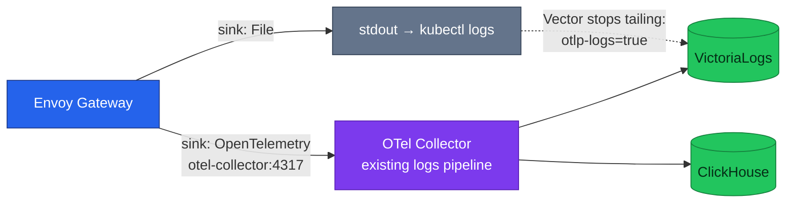

# ADR-060: Send Envoy access logs over OTLP in addition to stdout

> **Decision summary:** We will add an `OpenTelemetry` access-log sink to Envoy
> Gateway alongside the existing `File` sink, because it puts edge logs on the same
> path as application logs — reaching both VictoriaLogs and ClickHouse — without
> adding any component. We accept that `kubectl logs` and the OTLP path then
> describe the same requests twice, and close the resulting double-count with the
> label guard the platform already uses.

| Attribute | Value |
|-----------|-------|
| **Status** | Accepted |
| **Decision date** | 2026-08-24 |
| **Owners** | `duynhne` |
| **Deciders** | `duynhne` |
| **Scope** | The transport for Envoy Gateway access logs; not their format or content |
| **Affected components** | Envoy Gateway (`EnvoyProxy` telemetry), OTel Collector, Vector, VictoriaLogs, ClickHouse |
| **Related RFC** | [RFC-0027](../../rfc/RFC-0027/) |
| **Related research** | [research.md](../../rfc/RFC-0027/research.md) |
| **Supersedes** | — |
| **Superseded by** | — |
| **Implementation tracking** | RFC-0027 rollout |
| **Adoption** | **Complete** — RFC-0027 P6 (#886). Measured on Kind 2026-08-24: `otel.otel_logs` went from **0** `platform.envoy-gateway` rows to 30 for 30 requests, VictoriaLogs carried 70 lines under stream `service.name`, and the Vector path went to **0** — no double count |

## Context

Envoy Gateway writes JSON access logs to stdout, where the Vector DaemonSet tails
them and ships them to VictoriaLogs. Application logs take a different road: they
go over OTLP to the collector, which fans them out to VictoriaLogs **and**
ClickHouse. The consequence is that edge logs — the one record that sees every
request entering the platform — are absent from the 90-day SQL store, so a query
joining edge behaviour to application spans cannot be written.

The dividing line that produced this is protocol, not intent. RFC-0027's research
established that the real seam is whether the OpenTelemetry log record can
represent the data without destroying it, and Envoy access logs represent
perfectly well — they are already structured JSON with a fixed key set.

Envoy Gateway supports three access-log sink types: `ALS`, `File` and
`OpenTelemetry`, and both `telemetry.accessLog.settings[]` and each entry's
`sinks[]` are lists, so more than one destination is a supported configuration
rather than a workaround.

## Scope

### In scope

- Adding an `OpenTelemetry` sink pointing at the collector's existing OTLP receiver
- Keeping the `File` sink so `kubectl logs` on the Envoy pod stays useful
- Closing the resulting duplication in VictoriaLogs

### Out of scope

- The access-log **format** and its key set, which are unchanged
- Whether Tempo or Jaeger are retired — [ADR-059](../ADR-059-retire-tempo/), [ADR-058](../ADR-058-retire-jaeger/)
- Whether application logs keep going to both stores; that is settled in RFC-0027 as unchanged
- Non-OTel sources that stay on the Vector road (CloudNativePG, system pods)

## Decision drivers

| Priority | Driver | Why it matters |
|---------:|--------|----------------|
| 1 | Edge logs in the 90-day store | Without them, no SQL query can relate edge behaviour to application traces |
| 2 | No new component | The collector already listens on OTLP; adding a receiver would add a failure surface |
| 3 | Keep `kubectl logs` working | Losing pod-local logs to gain a pipeline is a bad trade during an incident |
| 4 | No silent duplication | Two roads to one store must not double-count |

## Decision

We will add a second sink of type `OpenTelemetry` to Envoy Gateway's access-log
settings, pointing at `otel-collector.monitoring.svc.cluster.local:4317`. Envoy
access logs then enter the collector's existing `logs` pipeline and are fanned out
by it, reaching both VictoriaLogs and ClickHouse with no pipeline change.

The `File` sink stays. To prevent VictoriaLogs holding each line twice, the Envoy
pods are labelled `platform.duynhlab.dev/otlp-logs=true`, which is the selector
Vector's `kubernetes_logs` source already excludes
(`extra_label_selector: "platform.duynhlab.dev/otlp-logs!=true"`). Vector stops
*tailing* while stdout keeps being *written*, so `kubectl logs` is unaffected.

We deliberately do **not** use the `envoyalsreceiver`. The `OpenTelemetry` sink
speaks OTLP directly to a receiver already running, whereas the ALS receiver is an
alpha component that would have to be added to the collector.

### Decision rules

| Rule | Required behavior |
|------|-------------------|
| **Ownership** | Envoy Gateway owns emission; the collector owns fan-out. Neither Vector nor Envoy decides which stores receive edge logs |
| **Transport** | OTLP to the collector's existing `otlp` receiver. No new receiver, and specifically not `envoyalsreceiver` |
| **Duplication** | Any pod whose logs reach the collector over OTLP carries `platform.duynhlab.dev/otlp-logs=true`. That label is the single mechanism preventing double ingestion |
| **Local debuggability** | The `File` sink is not removed. Losing `kubectl logs` on the edge is not an acceptable cost |
| **Boundary** | This decision does not change the access-log format, nor which stores the `logs` pipeline exports to |
| **Failure behavior** | If the collector is unreachable, stdout still carries the logs; the pod-local record is the fallback, and the label means Vector will not pick up the gap |

### Decision view

## Alternatives considered

| Option | Benefits | Costs / risks | Result |
|--------|----------|---------------|--------|
| **A — `OpenTelemetry` sink beside `File`, label closes the duplicate** | Edge logs reach both stores; no new component; `kubectl logs` preserved; EG adds pod and namespace metadata automatically on Kubernetes | Two emission paths to reason about; the label becomes load-bearing | **Selected** |
| **B — `ALS` sink with the `envoyalsreceiver`** | Purpose-built protocol; EG documents first-class ALS support | Adds an **alpha** component to the collector for no capability the OTLP sink lacks | Rejected |
| **C — replace `File` with `OpenTelemetry`** | No duplication at all; nothing to guard | Loses `kubectl logs` on the edge pod, which is the first thing anyone reaches for during an edge incident | Rejected |
| **D — leave it on the Vector road** | Zero change | Edge logs stay out of the 90-day store, so driver 1 is unmet and the seam stays drawn by protocol rather than by fit | Rejected |

### Why the selected option won

Driver 1 rules out D, and driver 2 rules out B: the OTLP sink reaches the same
destination as ALS while touching nothing new. Between A and C it comes down to
driver 3 — the extra reasoning cost of two paths is smaller than the cost of not
being able to run `kubectl logs` on the edge during an incident. Driver 4 is then
satisfied by a mechanism that already exists rather than a new one.

### Why the closest alternative lost

Option C is the cleaner architecture on paper — one emission path, no guard
needed, nothing to get wrong. It lost on operational reality rather than design:
the pod-local log is the fallback that works when the collector is the thing that
is broken, which is precisely when edge logs matter most.

## Implementation notes (P6, 2026-08-24)

Three things the decision text could not know, all settled against the installed
API rather than by reasoning:

- **`backendRefs`, not `host`/`port`.** This record names
  `otel-collector.monitoring.svc.cluster.local:4317`; both `host` and `port` are
  marked *"Deprecated: Use BackendRefs instead"* in the `EnvoyProxy` CRD shipped
  with gateway-helm **v1.9.0**. Same destination, expressed the way the installed
  API wants it — and the same shape the tracing provider beside it already uses.
  `resources` is likewise deprecated in favour of `resourceAttributes`.
- **`resourceAttributes.service.name` is required.** The collector exports logs
  with `VL-Stream-Fields: "service.name"`, so without it the edge's log-stream
  identity in VictoriaLogs is empty. Set to `platform.envoy-gateway`, which is
  what Envoy Gateway already derives for the edge's **traces**
  (`<gateway>.<namespace>`), so an edge log and an edge span share one identity.
- **The JSON format survived the trip.** Every upstream example pairs the
  OpenTelemetry sink with `format: Text`, and there was no documented case of
  JSON + OTLP, so a `Text` fallback was prepared. It was not needed: the keys
  arrive as log-record **attributes**, and Envoy Gateway adds `k8s.pod.name` /
  `k8s.namespace.name` on its own, exactly as the positive consequences below
  predicted. The cost is that `Body` is empty, so VictoriaLogs renders `_msg` as
  `missing _msg field` and free-text search finds nothing — query by stream
  (`_stream:{"service.name"="platform.envoy-gateway"}`). Documented, because the
  first symptom looks like data loss. `VL-Msg-Field` on the exporter is a
  possible follow-up; the format itself stays out of scope per this record.

**The guard nearly failed silently.** The label is the single mechanism
preventing double ingestion, and the local overlay's node-pinning patch used
`op: add` on `/spec/provider/kubernetes/envoyDeployment/pod` — a JSON Patch `add`
on an existing object path *replaces* it, so `pod.labels` was dropped. The CR
applied cleanly, the pods came up healthy, and Vector kept tailing the edge. The
patch now targets the child paths. This is exactly the negative consequence this
record names, arriving by a route it did not anticipate.

## Consequences

### Positive consequences

- Edge logs land in the 90-day store, so SQL can relate edge behaviour to
  application spans on `trace_id`
- No new component; the collector's existing OTLP receiver serves it
- Envoy Gateway attaches pod and namespace metadata automatically for the OTel
  sink — metadata the Vector road currently reproduces with a `remap` transform

### Negative consequences and accepted trade-offs

- Two emission paths for one log stream, and the `otlp-logs` label becomes
  load-bearing: forget it and VictoriaLogs silently holds every edge line twice
- Edge logs are stored twice across the two stores by design, as application logs
  already are
- The Envoy pods' log volume now transits the collector, adding to the component
  whose failure takes all three signals

### Neutral consequences

- The access-log format and its nine keys are unchanged
- Vector keeps handling every genuinely non-OTel source
- No application change

## Implementation obligations

| Obligation | Owner | Tracking | Completion signal |
|------------|-------|----------|-------------------|
| Add the `OpenTelemetry` sink to the `EnvoyProxy` telemetry config | `duynhne` | RFC-0027 | Edge log lines appear in ClickHouse `otel_logs` |
| Label the Envoy pods `platform.duynhlab.dev/otlp-logs=true` | `duynhne` | RFC-0027 | Vector no longer tails them |
| Prove no double count | `duynhne` | RFC-0027 | A single request yields exactly one VictoriaLogs entry from the edge |
| Confirm `kubectl logs` still works on the Envoy pod | `duynhne` | RFC-0027 | Output present after the change |
| Update the platform gateway and logging docs | `duynhne` | RFC-0027 P5 | Both roads described accurately |
| Update service contracts | — | N/A — infra-only | No route, RPC or payload changes |

## Validation and compliance

| Requirement | Verification |
|-------------|--------------|
| Sink present, `File` retained | `EnvoyProxy` telemetry lists two sinks |
| No new receiver | Collector `receivers` still contains only `otlp` |
| No duplication | Count VictoriaLogs entries for one known request id — exactly one from the edge |
| Edge logs in the 90-day store | `SELECT count() FROM otel.otel_logs WHERE ServiceName LIKE '%envoy%'` returns rows |
| Local fallback intact | `kubectl logs` on the Envoy pod returns access lines |
| Documentation | Gateway and logging docs describe the two roads and the label guard |

## Revisit triggers

Re-open this decision when one or more of the following become true:

- The collector's OTLP receiver becomes a bottleneck for edge log volume
- The `otlp-logs` label mechanism is replaced by something else platform-wide —
  the guard here depends on it
- `envoyalsreceiver` reaches a stable maturity **and** offers something the OTLP
  sink does not
- Storing edge logs twice becomes material against the disk budget, in which case
  the `File` sink or one of the two stores is the thing to reconsider

A review does not automatically reverse the decision. A changed decision requires
a new ADR that supersedes this one.

## References

- [RFC-0027](../../rfc/RFC-0027/)
- [RFC-0027 research](../../rfc/RFC-0027/research.md)
- [`docs/platform/envoy-gateway.md`](../../../platform/envoy-gateway.md)
- [`docs/observability/logging/README.md`](../../../observability/logging/README.md)

## History

- **2026-08-24** — created at `Proposed` during RFC-0027 architecture review.
- **2026-08-24** — **Accepted** with [RFC-0027](../../rfc/RFC-0027/), on the evidence of the P1 TraceQL experiment and the span-metrics measurement recorded in the research.
