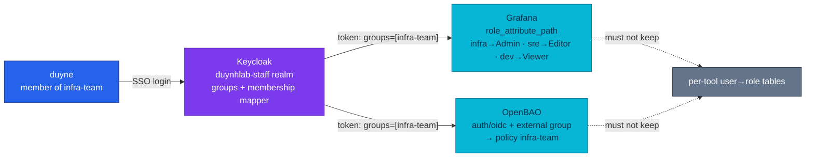

# ADR-062: Authorize infra tools through staff-realm groups

> **Decision summary:** We will make the `groups` claim of the `duynhlab-staff`
> realm the single authority for who may do what in the platform's infra tools —
> Grafana and OpenBAO each translate that claim into their own permission model
> (org role via JMESPath; policy via external group) — because today Grafana
> grants anonymous Admin to anyone on the LAN and OpenBAO has no working human
> login at all. We accept that Keycloak (one replica) becomes the login path's
> availability dependency, and that Grafana OSS caps the mapping at org roles.

| Attribute | Value |
|-----------|-------|
| **Status** | Proposed |
| **Decision date** | — |
| **Owners** | `duynhne` |
| **Deciders** | `duynhne` |
| **Scope** | Which identity source authorizes humans in platform infra tools (Grafana, OpenBAO), and the group taxonomy that source exposes; not customer-facing auth, not service-to-service auth |
| **Affected components** | Keycloak (`duynhlab-staff` realm), Grafana (CR config), OpenBAO (auth mounts + policies, bootstrap Job), ESO (client-secret delivery) |
| **Related ADR** | [ADR-050](../ADR-050-separate-staff-identity-realm/) — this ADR gives the staff realm its second and third consumers; [ADR-024-adjacent OpenBAO bootstrap](../../../secrets/openbao.md) gains an OIDC phase |
| **Related RFC** | [RFC-0008](../../rfc/RFC-0008/) — the broken `generate-root` ceremony this decision routes around |
| **Supersedes** | — |
| **Superseded by** | — |
| **Implementation tracking** | this ADR's PR train (realm → OpenBAO ∥ Grafana → docs) |
| **Adoption** | Not started |

## Context

The platform runs its own IdP — Keycloak with a dedicated workforce realm,
`duynhlab-staff` (ADR-050) — yet neither infra tool uses it:

- **Grafana** (`kubernetes/infra/configs/observability/grafana/grafana.yaml`)
  runs `auth.anonymous.enabled=true` with `org_role: Admin` and
  `disable_login_form=true`. Anyone who can reach the LAN edge is an anonymous
  Grafana Admin; there is no way to tell operators apart, let alone give an
  SRE-shaped role. `server.root_url` still points at `http://localhost:3000`,
  which blocks any OAuth redirect before it starts.
- **OpenBAO** has exactly one auth method, `kubernetes` (two service
  accounts). The root token is revoked by design, and the documented
  break-glass — a `generate-root` ceremony — fails with 403 (known gap,
  RFC-0008; re-verified 2026-08-25). **No human can log in to OpenBAO
  today**, which also means the raft-snapshot runbook's step 0 cannot run and
  the secrets store has no working backup path.
- The `duynhlab-staff` realm has one user (`duyne`), one realm role
  (`backoffice_admin`), one public PKCE client (`admin-portal`), and **no
  groups** — no team structure exists to hang authorization on.

The repo's own docs already point at the target: 
`docs/observability/grafana/rbac-multi-team.md` names "OAuth/OIDC + group →
role mapping" as the production-grade shape, and `docs/secrets/openbao.md` §4
sketches OIDC groups→policies (with an external IdP as the example). What is
missing is the decision that binds both tools to the *same* source.

## Scope

### In scope

- The authority: which identity source and which claim authorize humans in
  infra tools.
- The group taxonomy of the staff realm (`infra-team`, `sre-team`,
  `dev-team`) and its mapping to each tool's permission model.
- Renaming the pre-created OpenBAO policy `devops-admin` → `infra-team`, so
  policies are named after the team they serve.
- The secret-handling rule for the two new confidential clients (never in
  git; OpenBAO + ESO deliver them).

### Out of scope

- Keycloak HA (>1 replica means sticky sessions on `AUTH_SESSION_ID` +
  Infinispan `DIST_SYNC` — deliberately deferred; one note, not a work item).
- Identity brokering / federation (Google, LDAP, GitHub) — the platform's
  Keycloak *is* the IdP; there is no upstream directory to federate.
- Grafana Team Sync and per-dashboard permissions — Team Sync is
  Enterprise-only; OSS stops at org-role mapping. Provisioned teams + folder
  permissions stay a documented follow-up in `rbac-multi-team.md`.
- Customer-facing auth (`duynhlab` realm) — untouched.
- The raft-snapshot CronJob this decision unblocks — a follow-up change, not
  part of this decision.

## Decision drivers

| Priority | Driver | Why it matters |
|---------:|--------|----------------|
| 1 | Security posture | Anonymous LAN Admin on Grafana and a secrets store no human can enter are both standing findings (§ Context); the second also blocks backups |
| 2 | One place to grant/revoke | Joining or leaving a team must be a group edit in Keycloak, not a per-tool account task |
| 3 | Zero new components | Both tools speak OIDC natively; the fit must not add a proxy or an operator |
| 4 | Learning value | Group-claim → per-tool translation is the pattern used at work (SRE team enters Grafana as Editor); the homelab should exercise the real shape |

## Decision

We will authorize humans in platform infra tools through the `groups` claim of
`duynhlab-staff` realm tokens. Keycloak owns the team structure; each tool owns
only the *translation* of that claim into its native permission model:

| Group | Grafana (org role) | OpenBAO (policy via external group) | Initial members |
|---|---|---|---|
| `infra-team` | Admin | `infra-team` (renamed from `devops-admin`) | `duyne` |
| `sre-team` | Editor | new read-only policy on `secret/local/infra/*` | — (demo user later) |
| `dev-team` | Viewer | — (no OpenBAO access) | — (demo user later) |

Mechanics — one identity, two translations, no new components:

- **Keycloak** (`configmap-realm.yaml`): the staff realm gains the three
  groups, two **confidential** clients (`grafana`, `openbao`) each carrying an
  `oidc-group-membership-mapper` (claim `groups`, `full.path=false`), and
  `eventsEnabled`/`adminEventsEnabled` — the audit trail rides the same realm
  change so the one-shot import is reseeded once, not twice.
- **Grafana** (`grafana.yaml` CR): `[auth.generic_oauth]` against the staff
  realm; `role_attribute_path` (JMESPath) maps groups → org role;
  `server.root_url` becomes `https://grafana.duynh.me`; anonymous drops to
  Viewer and the login form returns.
- **OpenBAO** (bootstrap ConfigMap,
  `kubernetes/infra/configs/secrets/openbao-bootstrap/configmap.yaml`): a new
  idempotent phase enables `auth/oidc` against the staff realm
  (`groups_claim="groups"`), creates one **external** identity group per team
  with a group-alias on the OIDC mount, and attaches policies to the groups.
  The `devops-admin` policy is renamed `infra-team` in the same phase.

### Decision rules

| Rule | Required behavior |
|------|-------------------|
| **Ownership** | Team membership lives only in Keycloak groups; no tool keeps its own user→role table for staff |
| **Write path** | Granting/revoking access = editing group membership in the staff realm (realm manifest or admin console) |
| **Read path** | Tools read the `groups` claim from the token; Grafana via `role_attribute_path`, OpenBAO via external group + group-alias |
| **Boundary** | Tools must not encode usernames in their config; a mapping rule may name groups, never people |
| **Secrets** | Confidential-client secrets are stored in OpenBAO and delivered by ESO; the realm import consumes them via Keycloak's placeholder substitution (`${ENV_VAR}` in the import JSON, env sourced from the ESO Secret) — no secret literal in git |
| **Failure behavior** | Keycloak down ⇒ no new logins; Grafana anonymous-Viewer keeps dashboards readable; OpenBAO machine path (`auth/kubernetes` for ESO) is unaffected |
| **Compatibility** | The `admin-portal` public client and the customer realm are untouched; `backoffice_admin` keeps guarding the portal |

### Decision view

## Alternatives considered

| Option | Benefits | Costs / risks | Result |
|--------|----------|---------------|--------|
| **A — Staff-realm groups, per-tool translation** | one authority, native OIDC in both tools, zero new components, closes the OpenBAO human-access gap | realm import is one-shot (reseed procedure needed); login availability tied to single-replica Keycloak | **Selected** |
| **B — Per-tool local accounts** (Grafana local admin + OpenBAO `userpass`) | no realm change, works offline | credential sprawl, no revocation story, leaves "who is who" unsolved, OpenBAO userpass contradicts the revoked-root/no-static-creds posture | Rejected |
| **C — Realm *roles* instead of groups** | roles are Keycloak's native authorization primitive | roles are per-application; teams are organizational — one person in N tools would need N role grants, and the OpenBAO external-group pattern is built around groups | Rejected |
| **D — Auth proxy in front of both tools** (oauth2-proxy) | uniform enforcement at the edge | a new component to run and patch, duplicate sessions, and both tools already speak OIDC natively | Rejected |

### Why the selected option won

Option A is the only one that satisfies drivers 1–3 simultaneously: it removes
both standing findings, makes access a single group edit, and configures
software the platform already runs. It is also the shape the repo's own docs
were already reserving space for.

### Why the closest alternative lost

Option C (roles) fails the "one place to grant/revoke" driver in practice: a
new SRE would need a role grant per tool, recreating per-tool user management
with extra steps. Groups compose the other way — one membership, N tools each
reading the same claim — and match how access is actually reasoned about
("the SRE team gets Grafana").

## Consequences

### Positive consequences

- Every infra-tool session belongs to a person; anonymous LAN Admin ends.
- OpenBAO regains a human path (the UI's OIDC button) without resurrecting the
  broken `generate-root` ceremony — the RFC-0008 gap is routed around, and the
  raft-snapshot runbook's precondition can finally be met.
- Access changes become auditable realm events (`eventsEnabled` /
  `adminEventsEnabled` ship in the same realm change and land in VictoriaLogs
  via the existing Vector road).
- The `devops-admin` → `infra-team` rename makes policy names read as teams,
  matching the group taxonomy end to end.

### Negative consequences and accepted trade-offs

- Keycloak (one replica) becomes the login path's availability dependency.
  Mitigated, not solved: Grafana keeps anonymous **Viewer**, and OpenBAO's
  machine path (`auth/kubernetes`) does not involve Keycloak.
- Grafana OSS stops at org roles — `sre-team` is an Editor everywhere, not an
  Editor of SRE folders. Real team/folder scoping means provisioned teams
  (documented follow-up) or Enterprise.
- The realm import is one-shot: shipping the new realm content to a running
  cluster requires the reseed procedure in `docs/platform/keycloak.md`.
- Two more secrets exist (client secrets), with manual rotation for now.

### Neutral consequences

- `local-stack`'s realm file must carry the same groups/clients so both gates
  exercise the same login shape.
- The bootstrap Job grows one phase; its idempotency contract now covers OIDC
  mounts and identity groups.

## Implementation obligations

| Obligation | Owner | Tracking | Completion signal |
|------------|-------|----------|-------------------|
| Realm: groups, 2 confidential clients + mappers, events on (+ local-stack copy) | `duynhne` | PR 2 | reseeded realm issues tokens with `groups=[infra-team]` for `duyne` |
| OpenBAO bootstrap: OIDC phase, external groups, policy rename, `bao audit enable file=stdout` | `duynhne` | PR 3 | OIDC button on the UI; `bao token lookup` after OIDC login lists `infra-team` |
| Grafana CR: `generic_oauth`, `root_url`, anonymous→Viewer, login form on | `duynhne` | PR 4 | `duyne` logs in as Admin; group change alone changes the role |
| Docs sync: `rbac-multi-team.md` (fill the Keycloak section), `openbao.md` §4 (Keycloak, not GitHub), `keycloak.md` known-gaps | `duynhne` | PR 5 | docs describe the deployed shape; links green |

## Validation and compliance

| Requirement | Verification |
|-------------|--------------|
| Group → Grafana role mapping | login as `duyne` → Admin; a user in no group → Viewer; move a user between groups → role follows with zero config change |
| Group → OpenBAO policy mapping | OIDC login, `bao token lookup` shows `infra-team` via external group; a no-group login holds only `default` |
| No secret literal in git | `git grep` for the client-secret values returns nothing; realm JSON carries `${...}` placeholders only |
| Audit trail | staff-realm login + admin events visible in VictoriaLogs; `bao audit list` shows the file device |
| Bootstrap idempotency | re-running the bootstrap Job on a configured cluster exits 0 with no drift |

## Revisit triggers

Re-open this decision when one or more of the following become true:

- Keycloak needs >1 replica (login SPOF hurts in practice) — the sticky-session
  + Infinispan work stops being deferrable.
- A team needs folder-scoped Grafana permissions that org roles cannot express.
- A third tool class (e.g. ClickHouse UI, Temporal UI) needs human auth and the
  group taxonomy no longer fits.
- OpenBAO grows non-human consumers of OIDC (machine OIDC), which this ADR did
  not design for.

A review does not automatically reverse the decision. A changed decision
requires a new ADR that supersedes this one.

## References

- [ADR-050 — Separate staff identity realm](../ADR-050-separate-staff-identity-realm/)
- [RFC-0008 — OpenBAO](../../rfc/RFC-0008/) (generate-root known gap)
- [`docs/platform/keycloak.md`](../../../platform/keycloak.md) (realm reseed procedure)
- [`docs/secrets/openbao.md`](../../../secrets/openbao.md) §4 (OIDC sketch this ADR fills in)
- [`docs/observability/grafana/rbac-multi-team.md`](../../../observability/grafana/rbac-multi-team.md)
- Keycloak docs: *Configuring Grafana generic OAuth*, realm import placeholder
  substitution (`docs/guides/server/importExport.adoc`); OpenBAO docs: OIDC
  auth + external identity groups

## History

| Date | Status / adoption | Change |
|------|-------------------|--------|
| 2026-08-26 | Proposed / Not started | Initial draft |

---
_Last updated: 2026-08-26_
