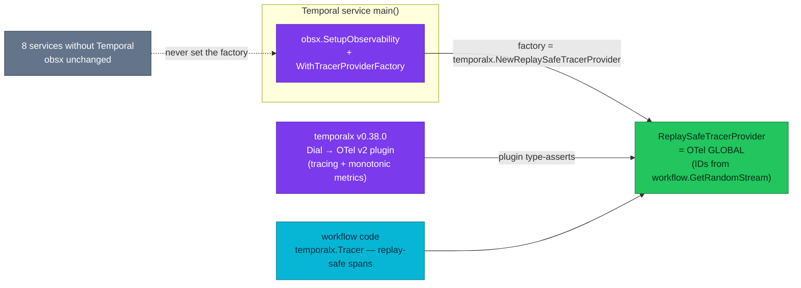

# ADR-063: Adopt the OpenTelemetry v2 integration for Temporal telemetry

> **Decision summary:** We will move Temporal telemetry onto the SDK's new
> `contrib/opentelemetry-v2` plugin — a replay-safe global tracer provider,
> corrected span parenting, monotonic SDK counters, and (for the first time)
> spans created *inside* workflow code — and, because the plugin requires SDK
> ≥ 1.48.0 everywhere, the fleet converges on **one** `temporalx` version. We
> accept an experimental v0.1.0 API that may break between releases, and the
> loss of the span→profile link on Temporal services.

| Attribute | Value |
|-----------|-------|
| **Status** | Accepted |
| **Decision date** | 2026-08-27 |
| **Owners** | `duynhne` |
| **Deciders** | `duynhne` |
| **Scope** | How Temporal SDK telemetry (traces + SDK metrics) is wired, and the fleet rule for `temporalx` pins; not the collector, the stores, or application (non-SDK) metrics |
| **Affected components** | `pkg/obsx` + `pkg/temporalx` (both → v0.38.0), order-service, checkout-service, homelab (worker pins, k6 gate, Temporal dashboards + alerts, docs) |
| **Related ADR** | [ADR-030](../ADR-030-temporal-workflow-versioning/) (Temporal adoption), [ADR-054](../ADR-054-temporal-worker-controller/) (worker lifecycle), [ADR-057](../ADR-057-span-metrics-in-collector/) (span metrics stay in the collector — untouched) |
| **Related research** | [Temporal trên homelab](https://claude.ai/code/artifact/42dc7b51-8655-4f0d-808b-bfb1f59cf3ae) §1 §3 §6 (owner review page, 2026-08-27) |
| **Supersedes** | — |
| **Superseded by** | — |
| **Implementation tracking** | this ADR's PR train (pkg → services + compose gate → homelab pins/k6/dashboards → Kind gate) |
| **Adoption** | **Complete** — Kind gate 2026-08-27: 25/25 rows, 144 assertions (K5.5 single-spelling Temporal leg 5/5, K5.4 both workers split by service_version); fleet emits one measured 49-name `temporal_*` set; consumers (4 alerts, 2 dashboards, k6) on measured names |

## Context

Two workers run the Temporal Go SDK behind the in-house wrapper
`pkg/temporalx`, and today they straddle it: order-worker pins `temporalx
v0.37.0` (SDK **1.48.0**), checkout-worker pins `v0.36.1` (SDK **1.44.1**).
The split was deliberate when made — only order needed v0.37.0's Worker
Deployment Versioning env names — and `docs/api/pkg.md` records it. Living
with it has a measured cost: the two SDKs emit the same metric family under
**two different names** on the shared OTel export path, and gate row K5.5
flapped until it accepted both spellings
(`scripts/k6/smoke.js:335-342`, fixed in #921). A dashboard or alert that
queries one spelling is blind to half the fleet.

Independently, `temporalx` wires tracing through the **v1** contrib
interceptor (`contrib/opentelemetry v0.7.0`), which cannot create spans
inside workflow code (replay would double-emit them) and predates the
`UseMonotonicCounters` option (v0.8.0+) — so SDK counters export as
non-monotonic sums, which exporters and backends may classify incorrectly
for `rate()`/`increase()`.

Temporal's official Go observability guidance now leads with a **new,
separate module**: `go.temporal.io/sdk/contrib/opentelemetry-v2` (v0.1.0,
experimental). It is plugin-based (`client.Options.Plugins`), builds on SDK
1.48.0's new `interceptor/tracing` package with **corrected span parenting**,
carries one plugin for tracing *and* metrics (with monotonic counters), and —
its marquee capability — offers **replay-safe spans inside workflow code**
via `Tracer()` + a `ReplaySafeTracerProvider` whose span IDs derive from
`workflow.GetRandomStream`, so replays regenerate identical IDs instead of
duplicate spans.

One mechanical constraint shapes the design: the plugin's interceptors and
`Tracer()` **type-assert the OTel global tracer provider** and panic unless
it is the contrib module's `ReplaySafeTracerProvider`. The global is built by
`pkg/obsx` — the platform's single OTel wiring point, used by all ten
services, eight of which have no Temporal — and `pkg` modules deliberately do
not import each other.

## Scope

### In scope

- The tracing and SDK-metrics wiring for Temporal clients and workers.
- The seam that lets Temporal services install a replay-safe global tracer
  provider without `obsx` importing Temporal code.
- The fleet rule for `temporalx` pins.
- The measurement-first rule for every metric-name consumer (k6 rows,
  dashboards, alerts, recording rules).

### Out of scope

- The collector pipelines, VictoriaTraces/ClickHouse sinks, and span-derived
  RED metrics (ADR-057) — unchanged.
- Application metrics (`pkg/obsx` semconv path) — unchanged.
- Worker lifecycle and versioning — ADR-054 / [ADR-064](../ADR-064-all-workers-under-controller/).
- Business-context propagation (`ContextPropagator`) and the zapslog SDK
  logger — separate conformance work, no architecture decision needed.

## Decision drivers

| Priority | Driver | Why it matters |
|---------:|--------|----------------|
| 1 | One name per signal | The split-SDK fleet already broke the gate once (#921); observability that depends on which worker emitted it is not observability |
| 2 | Correct counter semantics | Non-monotonic sums make `rate()` on SDK counters backend-dependent; `UseMonotonicCounters` is the documented fix |
| 3 | Workflow-interior visibility | The v1 interceptor forbids spans in workflow code; replay-safe spans close the largest tracing blind spot the platform has |
| 4 | Follow the paved road | The official observability page now leads with the v2 integration; the platform learns most by running the recommended shape |

## Decision

We will wire Temporal telemetry through `contrib/opentelemetry-v2`:

- **`pkg/temporalx` v0.38.0**: `Dial` registers the v2 plugin
  (`client.Options.Plugins`) instead of the v1 interceptor + metrics handler
  pair. The plugin carries both halves: `tracing.TracerOptions` (with
  `AllowInvalidParentSpans: true` for the mixed-fleet rollout window) and
  `MetricsHandlerOptions{UseMonotonicCounters: true, OnError: log-not-panic}`.
  `Dial(Config{HostPort, Namespace})` and `NewWorker` signatures are
  unchanged. temporalx re-exports `NewReplaySafeTracerProvider` and
  `Tracer(name)` so consumers never import the contrib module directly.
- **`pkg/obsx` v0.38.0** gains one additive seam:
  `WithTracerProviderFactory(func(...sdktrace.TracerProviderOption) ShutdownTracerProvider)`.
  obsx keeps owning the option set (Resource, sampler, OTLP batcher),
  shutdown ordering, and global installation; the factory only replaces the
  constructor. Temporal service mains pass
  `temporalx.NewReplaySafeTracerProvider` through it; the other eight
  services set nothing and are untouched.
- **Fleet rule**: both Temporal services pin the **same** `temporalx`
  version (v0.38.0 now). A future split must record its reason in
  `docs/api/pkg.md` the way the 2026-08-21 split did — and carries the burden
  of the dual-name problem it re-creates.

### Decision rules

| Rule | Required behavior |
|------|-------------------|
| **Ownership** | `pkg/temporalx` owns Temporal telemetry wiring; services never touch `client.Options` telemetry fields directly |
| **Global provider** | On Temporal services the OTel global tracer provider IS the `ReplaySafeTracerProvider`, installed by obsx via the factory seam — nothing may wrap it (the plugin type-asserts the concrete type) |
| **Profiling trade-off** | The otelpyroscope span→profile wrapper is skipped on Temporal services (wrapping breaks the type assert). Profile *collection* is unaffected; only the span→profile link attribute is lost there |
| **Counters** | `UseMonotonicCounters: true` — SDK counters are monotonic sums |
| **Workflow spans** | Spans inside workflow code use `temporalx.Tracer` only; `otel.Tracer` in workflow code is a review-blocker (not replay-safe) |
| **Metric names** | Every consumer of `temporal_*` names (k6 rows, dashboards, alerts, recording rules) is updated from names **measured on the compose gate**, never predicted — the #921 lesson |
| **Compatibility** | `Dial`/`NewWorker` signatures unchanged; the failure mode of a misconfigured global is a panic at startup (fail-fast), not silent span loss |

### Decision view

## Alternatives considered

| Option | Benefits | Costs / risks | Result |
|--------|----------|---------------|--------|
| **A — v2 plugin + fleet convergence** | replay-safe workflow spans, corrected parenting, monotonic counters, one plugin, follows the official lead | experimental v0.1.0 API; obsx needs the factory seam; profiling link lost on Temporal services | **Selected** |
| **B — stay v1, bump contrib to 0.8.x for `UseMonotonicCounters`** | smallest change, stable API | keeps the workflow-span blind spot and the v1 parenting bugs; still requires the fleet SDK bump to end the dual names | Rejected |
| **C — tally/Prometheus metrics handler** | the classic documented path | adds a scrape port per worker against the platform's OTLP-only direction (RFC-0014 P3 removed the scrape bridge) | Rejected |
| **D — wait for v2 to leave experimental** | API stability | keeps every current cost (dual names, non-monotonic counters, no workflow spans) for an unknown duration; the homelab's purpose is to learn the shape early | Rejected |

### Why the selected option won

Only A satisfies drivers 1–3 at once, and it is the only option the official
observability page actually recommends first. The obsx seam it requires is
additive, test-covered, and invisible to non-Temporal services.

### Why the closest alternative lost

B fixes the counters but leaves tracing exactly where it is — and since B
also requires the checkout SDK bump (contrib 0.8 needs a recent SDK), it
pays most of A's migration cost for a fraction of its value.

## Consequences

### Positive consequences

- One metric name per signal again: K5.5's both-spellings `or`-clause and the
  straddle comment can be retired (after measurement), and Temporal
  dashboards/alerts query one truth.
- Spans inside `OrderFulfillmentWorkflow` / `AbandonedCheckoutWorkflow`
  become possible and safe — the first workflow-interior tracing on the
  platform.
- SDK counters classify correctly as monotonic sums.
- The fleet pin rule turns the next "why do these workers disagree" into a
  recorded decision instead of an archaeology project.

### Negative consequences and accepted trade-offs

- `contrib/opentelemetry-v2` is **experimental v0.1.0**: its API may change
  between releases; `pkg/temporalx` absorbs that churn on behalf of services.
- Temporal services lose the otelpyroscope span→profile link (global cannot
  be wrapped). Profile collection continues.
- Metric names/temporality may shift under the v2 handler + monotonic
  counters (e.g. an OTLP→Prometheus `_total` suffix). Accepted because the
  measurement-first rule turns this into one synchronized homelab PR.

### Neutral consequences

- checkout-service jumps SDK 1.44.1 → 1.48.0 as a prerequisite; its replay
  safety is covered by the new replay-corpus test shipping in the same PR.
- `AllowInvalidParentSpans` stays on until both workers run v2, then can be
  tightened. *(Superseded 2026-08-27, after convergence: kept `true`
  permanently — with `false`, a tracing header that fails to parse errors out
  of the interceptor and fails the workflow task, so a telemetry defect would
  take down the workload it observes; pkg#86 records it in the code.)*

## Implementation obligations

| Obligation | Owner | Tracking | Completion signal |
|------------|-------|----------|-------------------|
| `pkg` obsx v0.38.0 (factory seam + test) + temporalx v0.38.0 (v2 plugin, re-exports) | `duynhne` | pkg PR | `make test-obsx test-temporalx` green; tags cut |
| Service wiring: factory in both mains, temporalx pin v0.38.0, checkout replay-corpus test | `duynhne` | 2 service PRs | builds + tests green; **full compose E2E audit** before tags |
| Measure `temporal_*` names on compose; sync k6 K5.5, `temporal.json` (+ local twin), 3 alerts in `configs/temporal/prometheusrule.yaml`, `rfc0021-write-migration.yaml` | `duynhne` | homelab PR | Kind gate green with the measured names |
| Docs: `pkg.md` (ledger, split-pin claim), `temporal.md` (temporalx bullet, /metrics contradiction) | `duynhne` | homelab PR | docs match as-built |

## Validation and compliance

| Requirement | Verification |
|-------------|--------------|
| Replay safety of workflow spans | replay-corpus tests pass in both services (order gen1-3; checkout new corpus) |
| Global provider rule | service startup panics loudly if the factory is missing (plugin type assert) — covered by compose bring-up |
| Monotonic counters | measured on compose: counter families export as monotonic sums |
| One-name rule | K5.5 asserts a single spelling after the fleet converges; grep shows no `or`-clause left |
| Documentation | `docs/api/pkg.md` + `temporal.md` describe the v2 wiring |

## Revisit triggers

Re-open this decision when one or more of the following become true:

- `contrib/opentelemetry-v2` publishes a breaking change `temporalx` cannot
  absorb behind its stable API.
- The module graduates from experimental — re-check this record's caveats
  (`AllowInvalidParentSpans` stays `true` regardless; see Neutral
  consequences).
- A Temporal service demonstrably needs the span→profile link more than
  workflow-interior spans.
- OTel or Temporal ships first-class support for wrapping the replay-safe
  provider (removing the profiling trade-off).

A review does not automatically reverse the decision. A changed decision
requires a new ADR that supersedes this one.

## References

- [Temporal Go observability guide](https://docs.temporal.io/develop/go/platform/observability)
- [OpenTelemetry v2 integration guide](https://docs.temporal.io/develop/go/integrations/opentelemetry-v2)
- [sdk-go v1.48.0 release notes](https://github.com/temporalio/sdk-go/releases/tag/v1.48.0) (new `interceptor/tracing`, corrected parenting)
- [`docs/api/pkg.md`](../../../api/pkg.md) — the split-pin record this closes
- [`docs/api/temporal.md`](../../../api/temporal.md) — as-built workflows
- Owner review page: *Temporal trên homelab* §1 §3 §6 (artifact, 2026-08-27)

## History

| Date | Status / adoption | Change |
|------|-------------------|--------|
| 2026-08-27 | Proposed / Not started | Initial draft, from the owner-reviewed deep-dive |
| 2026-08-27 | Accepted / Partial | Owner merged #936 and the train shipped same-day: pkg v0.38.0 (pkg#84), services (checkout#79, order#219, tags v0.9.2/v2.6.0), compose gate green, fleet metric convergence measured (identical 49-name set per worker) |
| 2026-08-27 | Accepted / Complete | Kind final gate green on the train PR: 25 rows / 144 assertions incl. the redefined K5.4/K5.5; alerts+dashboards+k6 moved to compose-measured names |
| 2026-08-27 | Accepted / Complete | Fleet converged, and the tighten-`AllowInvalidParentSpans` caveat was deliberately retired instead of executed (pkg#86, comment-only): `false` turns a bad tracing header into a failed workflow task — the failure class the plugin's `OnError` override already guards against |

---
_Last updated: 2026-08-27_
