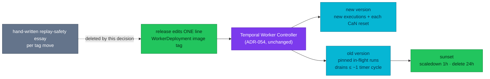

# ADR-064: Run every Temporal worker under the Worker Controller

> **Decision summary:** We will run all Temporal workers — checkout-worker
> included — as `WorkerDeployment`s under the Temporal Worker Controller with
> Pinned versioning, because the alternative is what checkout does today:
> a hand-written replay-safety essay in the manifest for every tag move. We
> accept a more complex manifest than the current HelmRelease and the rule
> that any env/resource edit mints a new version.

| Attribute | Value |
|-----------|-------|
| **Status** | Proposed |
| **Decision date** | — |
| **Owners** | `duynhne` |
| **Deciders** | `duynhne` |
| **Scope** | Which lifecycle mechanism owns Temporal worker deployments platform-wide; not the controller's internals (ADR-054), not autoscaling (ADR-055) |
| **Affected components** | checkout-service (worker registration), homelab `kubernetes/apps/checkout-worker.yaml` (HelmRelease → Connection + WorkerDeployment), k6 gate row K5.4, docs (`workflows.md`, `temporal.md`) |
| **Related ADR** | [ADR-054](../ADR-054-temporal-worker-controller/) — the mechanism, unchanged; [ADR-030](../ADR-030-temporal-workflow-versioning/) — refined, not superseded: it decided order's versioning, this ADR decides the fleet-wide scope; [ADR-055](../ADR-055-keda-worker-autoscaling/) — still Proposed, orthogonal; [ADR-063](../ADR-063-temporal-otel-v2/) — sibling in the same train |
| **Related research** | *Temporal trên homelab* §7 (owner review page, 2026-08-27) |
| **Supersedes** | — |
| **Superseded by** | — |
| **Implementation tracking** | this ADR's train: registration code rides the ADR-063 checkout PR; manifest flip is its own homelab PR |
| **Adoption** | Not started |

## Context

The platform runs two Temporal workers with two lifecycles. order-worker is a
`WorkerDeployment` under the Temporal Worker Controller (ADR-054): the
controller derives a build id per image+pod-template, routes new executions
to the current version, keeps Pinned runs on their old build, and sunsets
drained versions. checkout-worker is a plain HelmRelease, deliberately
unversioned — `docs/api/workflows.md` records the asymmetry as the takeaway.

The cost of that asymmetry is written into the manifest itself:
`kubernetes/apps/checkout-worker.yaml:36-68` carries **four hand-written
replay-safety proofs**, one per tag move (0.6.0, 0.6.3, 0.8.0, 0.9.0), each
arguing "`internal/workflow/` changed by N lines ⇒ an in-flight
`AbandonedCheckoutWorkflow` replays without a non-determinism error". Every
future tag move owes the same essay, and a wrong essay bricks a live
workflow. Pinned versioning deletes this entire class of analysis: in-flight
runs stay on their build; new runs take the new one.

The workflow itself is unusually well-shaped for Pinned versioning.
`AbandonedCheckoutWorkflow` Continue-as-News every ≤ 30 minutes (bounded at
500 resets). Temporal's worker-versioning guide states it directly: *"If your
Workflow uses Continue-as-New to manage history size, you can upgrade to new
Worker Deployment Versions at the CaN boundary without patching."* Each reset
naturally moves the chain to the current version; an old build drains within
about one timer cycle — comfortably inside the controller's sunset window
(scaledownDelay 1h) already used for order.

Every mechanical piece exists: `pkg/temporalx` v0.37.0+ reads the
controller-injected `TEMPORAL_DEPLOYMENT_NAME`/`TEMPORAL_WORKER_BUILD_ID`
(`MustVersioningFromEnv`, a no-op while the env is absent), the controller
serves any number of `WorkerDeployment`s, and the `Connection` CR is
namespace-scoped — four lines to copy into `checkout`.

## Scope

### In scope

- The platform rule: Temporal workers run as `WorkerDeployment`s under the
  Worker Controller, Pinned by default.
- checkout-worker's migration (code registration + manifest flip).
- The replay-test prerequisite for versioned workers.

### Out of scope

- KEDA autoscaling of versioned workers — [ADR-055](../ADR-055-keda-worker-autoscaling/), still Proposed.
- The controller mechanism itself (rollout strategy, sunset windows,
  build-id derivation) — ADR-054 owns it, unchanged.
- Migrating a **live production** task queue from unversioned to versioned
  mid-flight: the official behavior for already-running executions at the
  moment versioning turns on is deliberately left an open question here (the
  local Kind cluster is rebuilt at will, so the first versioned execution is
  simply the first execution). Resolve before any real environment does this.

## Decision drivers

| Priority | Driver | Why it matters |
|---------:|--------|----------------|
| 1 | Delete the manual replay-safety proof | Four essays in a manifest is four opportunities for a wrong one to brick a live workflow |
| 2 | One lifecycle model | Two mechanisms for two workers doubles what an operator must know; the fleet should have one story |
| 3 | Telemetry identity | A controller build id becomes `service.version`, so checkout-worker versions become visible in K5.4 and dashboards the way order's already are |
| 4 | Low migration risk | The CaN-every-30-min shape drains old builds in ~one cycle; `MustVersioningFromEnv` is a no-op until the manifest flips, so code and manifest ship independently |

## Decision

We will run every Temporal worker under the Temporal Worker Controller as a
`WorkerDeployment` with **Pinned** versioning behavior. Concretely for the
one worker not yet there:

- **checkout-service** registers versioning exactly like order does:
  `temporalx.MustVersioningFromEnv()` on `NewWorker`, and
  `RegisterWorkflowWithOptions(…, VersioningBehavior: Pinned)` for
  `AbandonedCheckoutWorkflow`. This ships **before** the manifest flip and is
  inert until the controller injects the env pair.
- **homelab** replaces the checkout-worker HelmRelease with a `Connection`
  (ns `checkout`) + `WorkerDeployment`, following the order-worker shape:
  controller-derived build id, Progressive rollout, sunset windows, build id
  exported as `service.version` via `OTEL_RESOURCE_ATTRIBUTES`.

### Decision rules

| Rule | Required behavior |
|------|-------------------|
| **Ownership** | The Worker Controller owns Temporal worker lifecycle; a plain Deployment/HelmRelease worker is a decision violation, not a shortcut |
| **Versioning default** | Pinned. Auto-Upgrade requires a recorded reason |
| **Identity** | `TEMPORAL_DEPLOYMENT_NAME`/`TEMPORAL_WORKER_BUILD_ID` are controller-injected only — hand-setting them in a manifest is forbidden (guard: `scripts/flux-validate.sh`) |
| **Replay tests** | A versioned worker ships with a replay-corpus test (order: `internal/saga/replay_test.go` gen1-3; checkout: new corpus in the ADR-063 bump PR) — versioning removes the *routine* replay risk, not the need for the safety net |
| **Release step** | A worker release edits exactly one line (the image tag in its `WorkerDeployment`); no prose proof required |
| **Compatibility** | The `checkout` task queue name, env block, and probes carry over unchanged; the API half of checkout stays on the ResourceSet path |

### Decision view

## Alternatives considered

| Option | Benefits | Costs / risks | Result |
|--------|----------|---------------|--------|
| **A — all workers under the controller, Pinned** | deletes the manual proof, one lifecycle, version-tagged telemetry, CaN shape drains fast | manifest more complex than a HelmRelease; env/resource edits mint versions | **Selected** |
| **B — keep the asymmetry** (status quo) | zero work; checkout tags stay "free" to move | every move owes an essay; a wrong essay bricks a live run; two lifecycle models forever | Rejected |
| **C — versioning without the controller** (hand-set env, manual build ids) | no CRs | re-creates exactly the by-hand identity management ADR-054 exists to remove; forbidden by its own guard | Rejected |

### Why the selected option won

Driver 1 alone decides it: the manifest's own comment history is the
evidence that the manual proof is real recurring work with real failure
modes. Drivers 2–4 make the migration cheap enough that keeping the
asymmetry has no remaining upside.

### Why the closest alternative lost

B's "tags move freely" was only ever true with an essay attached. The
freedom was the essay.

## Consequences

### Positive consequences

- checkout tag moves become one-line edits; the four-essay tradition ends.
- Fleet-wide single lifecycle story; `workflows.md`'s asymmetry paragraph
  retires.
- checkout-worker versions appear in telemetry (`service.version`) and the
  K5.4 gate row like order's.

### Negative consequences and accepted trade-offs

- The manifest grows from a HelmRelease to Connection + WorkerDeployment.
- Any pod-template change (env, resources) mints a new version — a feature,
  but one an operator must know when "nothing changed except memory limits"
  still triggers a rollout + drain cycle.
- The unversioned→versioned cutover semantics for in-flight runs stay
  unresolved for real environments (out of scope; Kind rebuilds).

### Neutral consequences

- K5.4's expected identity set changes (checkout-worker gains
  `service_version` splits) — updated from gate measurement.
- ADR-030's "only order is versioned" reading is refined by this record.

## Implementation obligations

| Obligation | Owner | Tracking | Completion signal |
|------------|-------|----------|-------------------|
| Registration code (versioning opts, inert until env) + replay corpus | `duynhne` | checkout PR (shared with ADR-063 bump) | build+tests green; compose gate |
| Manifest flip: HelmRelease → Connection + WorkerDeployment | `duynhne` | homelab PR | `make validate`; controller derives a build id; worker Ready |
| Gate: K5.4 identity rows updated from measurement | `duynhne` | homelab PR | `make e2e GATE=kind` green |
| Docs: `workflows.md` asymmetry paragraph, `temporal.md` worker table, `pkg.md` | `duynhne` | homelab PR | docs match as-built |

## Validation and compliance

| Requirement | Verification |
|-------------|--------------|
| Pinned routing works | on Kind: start a workflow, move the tag, confirm the in-flight run completes on the old build while a new run takes the new build (controller status + `service.version`) |
| CaN drainage | after a tag move, the abandon chain's next reset lands on the new version (Temporal UI / `temporal workflow show`) |
| No hand-set identity | `scripts/flux-validate.sh` guard stays green |
| Replay safety | checkout replay-corpus test passes on every future bump |
| Documentation | `workflows.md` + `temporal.md` describe one lifecycle |

## Revisit triggers

Re-open this decision when one or more of the following become true:

- A worker appears whose workflow shape cannot tolerate Pinned (needs
  Auto-Upgrade + `GetVersion` patching as the norm).
- The controller project stalls or breaks compatibility with the platform's
  Temporal server line.
- A real (non-Kind) environment needs the unversioned→versioned cutover —
  resolve the open question before flipping there.

A review does not automatically reverse the decision. A changed decision
requires a new ADR that supersedes this one.

## References

- [ADR-054 — Temporal Worker Controller](../ADR-054-temporal-worker-controller/)
- [Temporal worker versioning guide](https://docs.temporal.io/production-deployment/worker-deployments/worker-versioning) (CaN-boundary upgrade)
- [`kubernetes/apps/order-worker.yaml`](../../../../kubernetes/apps/order-worker.yaml) — the shape to copy
- [`kubernetes/apps/checkout-worker.yaml`](../../../../kubernetes/apps/checkout-worker.yaml) — the essays this deletes
- [`docs/api/workflows.md`](../../../api/workflows.md) — the asymmetry record
- Owner review page: *Temporal trên homelab* §7 (artifact, 2026-08-27)

## History

| Date | Status / adoption | Change |
|------|-------------------|--------|
| 2026-08-27 | Proposed / Not started | Initial draft, from the owner-reviewed deep-dive |

---
_Last updated: 2026-08-27_
