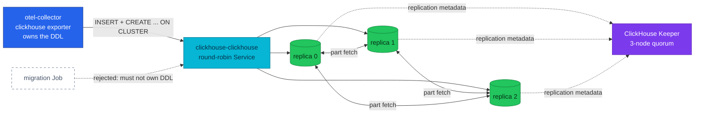

# ADR-065: Replicate ClickHouse across Three Replicas on a Keeper Quorum

> **Decision summary:** We will run the ClickHouse observability store as one
> shard with three `ReplicatedMergeTree` replicas coordinated by a three-node
> ClickHouse Keeper quorum, and let the OTel Collector's clickhouse exporter own
> that replicated schema. We accept that DDL keeps running inside the collector's
> startup path, that the exporter can never `ALTER` a table, and that memory and
> storage triple, in exchange for turning the loss of a disk from unrecoverable
> data loss into a failover.

| Attribute | Value |
|-----------|-------|
| **Status** | Accepted |
| **Decision date** | 2026-08-28 |
| **Owners** | `duynhne` |
| **Deciders** | `duynhne` |
| **Scope** | The topology and schema ownership of the ClickHouse OLAP store; not sharding, not the ClickHouse user model, not backups |
| **Affected components** | `monitoring` namespace: ClickHouseInstallation `clickhouse`, the new ClickHouseKeeperInstallation `keeper`, the Altinity operator, the OTel Collector's clickhouse exporter, the ClickHouse alert group |
| **Related RFC** | [RFC-0028](../../rfc/RFC-0028/) |
| **Related research** | [research.md](../../rfc/RFC-0028/research.md) |
| **Supersedes** | — |
| **Superseded by** | — |
| **Implementation tracking** | One homelab PR: CHK + CHI topology + exporter options + per-pod scrape + alerts + platform docs, gated by a full Kind run with the replica-kill and keeper-kill drills |
| **Adoption** | Not started |

## Context

ClickHouse is the platform's long-retention OLAP store for OTel logs and traces
([ADR-023](../ADR-023-clickhouse-observability-olap/)), and since
[ADR-061](../ADR-061-edge-log-routing/) it is the **only** home of the edge access
log — an attributes-only record that LogsQL free-text search cannot see, and the
noisiest OTLP stream the platform produces.

It runs as a single `ClickHouseInstallation` with `shardsCount: 1` and
`replicasCount: 1` on one 10Gi PVC, with plain `MergeTree` tables and no
coordination layer. There is no second copy of any part. The consequence is
written down as an accepted gap in
`docs/observability/tracing/architecture.md`: *"a lost volume is lost traces."*
For the edge access log, where ClickHouse is not a supplementary sink but the
only one, the same sentence means 90 days of edge evidence disappears with one
disk.

Everything needed to change that is already deployed. The Altinity operator at
`0.27.3` ships the `ClickHouseKeeperInstallation` CRD, supplies the
`{installation}/{cluster}/{shard}/{replica}` macros that replicated tables need,
generates `remote_servers` with `internal_replication: true` from the CHI layout,
and creates the PodDisruptionBudget itself. The OTel Collector runs contrib
`0.159.0`, whose clickhouse exporter carries `ON CLUSTER` and `ENGINE` slots in
every table template — and whose cluster-mode database creation was fixed in
`v0.131.0`. Nothing in the store is a real deployment yet: the current dataset is
demo data from gate runs, so the usual migration ceremony does not apply.

The decision is needed now because the observability store is the one place where
the platform still records a known data-loss path as acceptable, while the
mechanism to close it sits installed and unused.

## Scope

### In scope

- The replica count and the coordination layer for the ClickHouse OLAP store.
- Which component creates the replicated schema, and therefore what happens to
  the collector when ClickHouse is unavailable.
- The engine argument style for `ReplicatedMergeTree` (default replica path
  versus explicit znode path).
- Whether the existing tables are converted or recreated.

### Out of scope

- **Sharding and `Distributed` tables.** Researched to know the trigger signals;
  deliberately not built. At one shard a `Distributed` table stores nothing and
  routes nothing, and the operator's Service already spreads connections.
- **The ClickHouse user model.** The single `default` user stays. A
  least-privilege split (`otel_writer` / `grafana` readonly / `admin` with pod-CIDR
  `networks/ip`) is an optional rung that can land any time, or never.
- **Backups.** `clickhouse-backup` to RustFS is complementary to replication, not
  an alternative, and belongs to its own decision.
- **The Grafana access mode.** Unchanged; the question dissolves into the user
  model rung.

## Decision drivers

| Priority | Driver | Why it matters |
|---------:|--------|----------------|
| 1 | Durability of data that exists nowhere else | The edge access log is ClickHouse-only; one PVC is currently a single point of total loss |
| 2 | Smallest possible delta | Every new moving part is a thing that breaks at 03:00; the operator already supplies the mechanism |
| 3 | Operability of the result | A replicated store nobody can observe per replica is a claim, not a capability |
| 4 | Learning value | The platform mirrors production practice; replication and quorum coordination are the point, not incidental |
| 5 | Reversibility | A topology that cannot be rolled back is a topology nobody dares to change |

## Decision

We will run the ClickHouse observability store as **one shard with three
replicas**, coordinated by a **three-node ClickHouse Keeper quorum** declared as
a `ClickHouseKeeperInstallation` named `keeper`, referenced from the CHI by name.
The `otel` tables will be **`ReplicatedMergeTree`**, created **`ON CLUSTER` by the
OTel Collector's clickhouse exporter** through `cluster_name` plus
`table_engine`, with **no engine arguments**, so the server's default replica path
(`/clickhouse/tables/{uuid}/{shard}`) applies. The existing plain-`MergeTree`
tables will be **dropped and recreated**, not converted.

Three replicas each hold a full copy of every part; Keeper holds the metadata
that says which parts exist and which replica has them. A replica that loses its
Keeper session keeps serving reads and stops accepting writes, so the failure mode
is degradation rather than corruption. Writes arrive through the operator's
round-robin Service, which is also what lets a reader route around a dead pod
without any client change.

The argument-free engine is a deliberate pairing with recreate-from-scratch: the
default `{uuid}` path mints a fresh Keeper znode on every `CREATE`, so a
drop-and-recreate cycle can never collide with a stale replica path — the classic
failure of explicit paths. It is also the only style the exporter can express,
which is what makes exporter-owned schema viable at all.

### Decision rules

| Rule | Required behavior |
|------|-------------------|
| **Ownership** | The otel-collector's clickhouse exporter is the sole author of `otel.*` DDL. No migration Job, no hand-run `CREATE`, no schema in git |
| **Write path** | Only the collector writes `otel.*` data, through the round-robin Service. Replication between replicas is Keeper-coordinated and must never be simulated by writing to each replica |
| **Read path** | Grafana and operators read through the same Service and must not assume which replica answers; per-replica questions go to `system.replicas` per pod, never to a Grafana query |
| **Boundary** | ClickHouse holds logs and traces only. Metrics stay on VictoriaMetrics. No `Distributed` table exists while `shardsCount` is 1 |
| **Failure behavior** | Losing one replica or one keeper is a failover, not an outage: reads and writes continue. A replica without a quorum goes read-only and must be alerted on, because it still answers reads while falling behind |
| **Compatibility** | Engine arguments stay absent, so replica paths remain `{uuid}`-derived. Any future explicit path is a breaking change requiring table recreation |

### Decision view

## Alternatives considered

| Option | Benefits | Costs / risks | Result |
|--------|----------|---------------|--------|
| **A — Exporter owns the replicated schema** (`create_schema: true` + `cluster_name` + `table_engine`) | Zero new parts; verified template-by-template against the exporter's own SQL templates | DDL stays in collector `start()`; the exporter only ever `CREATE ... IF NOT EXISTS`, never `ALTER` | Selected |
| **B — Migration Job owns the DDL** (`create_schema: false`) | Removes startup coupling entirely; `ALTER`s live in git beside the `CREATE` | A new Job, SQL files, and Flux ordering to maintain, for a schema that has not changed once | Rejected |
| **C — Convert the existing tables** (`ATTACH ... AS REPLICATED`) | Preserves the current dataset | Ceremony and risk to protect demo data from gate runs | Rejected |
| **D — Frugal 2 replicas + 1 keeper first** | Two fewer pods, lower memory | A one-node quorum survives nothing; the drill it would pass proves less than the drill it would fail | Rejected |
| **E — Stay 1×1 and add backups** | Cheapest; honest for a lab | Restores lose the tail and take hours; leaves the recorded data-loss gap permanent and teaches nothing about replication | Rejected |

### Why the selected option won

The other gate decisions remove exactly the risks that made a migration Job
attractive. Recreate-from-scratch means there is no data to migrate carefully, and
the default `{uuid}` replica path means repeated drop-and-recreate cycles cannot
collide with stale znodes. What remains of Option B's advantage is schema
evolution — and this schema has never evolved. Against that, Option A adds no new
component, no new wave, no new ordering constraint, and no second schema owner to
disagree with the first. It satisfies driver 2 outright while giving up nothing
that is needed today.

### Why the closest alternative lost

Option B loses on timing, not on merit. Its two real benefits are the `ALTER`
lifecycle and startup decoupling, and neither is needed yet: the tables have never
been altered, and the startup coupling is already mitigated for cold start by
`tracing-local` depending on `clickhouse-local`. Its cost is paid immediately and
permanently — a Job, SQL files in git, and a second place where the schema is
defined, which is a real source of drift between what the exporter would create
and what the Job did create. So the Job is not wrong; it is early. Both of its
benefits are recorded below as revisit triggers, and the design is ready the day
either one fires.

## Consequences

### Positive consequences

- Losing one ClickHouse pod or PVC becomes a failover. Reads keep answering and
  the collector keeps inserting, because the Service routes around the gap.
- The recorded "lost volume is lost traces" gap is retired for ClickHouse, which
  matters most for the edge access log that lives nowhere else.
- A quorum failure has a name and a signal: a replica that loses Keeper goes
  read-only, which is now alerted on rather than invisible.
- Per-replica engine metrics exist for the first time, because a replicated
  topology is the reason the per-pod scrape was worth enabling.
- The platform gains a rehearsed answer to "what happens when a replica dies",
  proven by drill rather than asserted by design.

### Negative consequences and accepted trade-offs

- **DDL still runs in the collector's `start()`.** A collector restart while
  ClickHouse is unavailable fails the whole collector — taking VictoriaTraces and
  VictoriaLogs down with it, because they are sinks in the same process. Flux
  ordering guards cold start only; kubelet does not read `dependsOn`.
- **The exporter never `ALTER`s.** The first schema change — a new column, a TTL
  change, an index — has no owner under this decision.
- **Memory and storage triple.** Three replicas at 2Gi limits plus three keepers
  put roughly a 7.5Gi ceiling on the `monitoring` namespace, and every part is
  stored three times. Each replica ingests everything, so capacity is planned per
  replica, not per cluster.
- **Sharding is not solved, only deferred.** When a merge or disk trigger fires
  chronically, that is a separate decision with its own migration.
- **The single `default` user remains** the whole access control story for the
  store, shared by the collector and Grafana.

### Neutral consequences

- local-stack stays a single node with no keeper. The twin divergence is
  deliberate and recorded; the exporter's cluster options are cluster-only values.
- Grafana's datasource is unchanged — it already points at the round-robin
  Service, which is why it survives a replica loss without edits.
- The Altinity operator keeps creating the PodDisruptionBudget; no PDB is authored
  here.

## Implementation obligations

| Obligation | Owner | Tracking | Completion signal |
|------------|-------|----------|-------------------|
| `ClickHouseKeeperInstallation` `keeper` (3 replicas) in the `clickhouse-local` wave | platform | RFC-0028 PR | `kubectl get chk -n monitoring` Ready; three keeper pods on three nodes |
| CHI to `replicasCount: 3` + `zookeeper.keeper.name` + host anti-affinity | platform | RFC-0028 PR | Three CH pods on three distinct nodes |
| Exporter `cluster_name` + `table_engine` | platform | RFC-0028 PR | Every `otel` table reports engine `ReplicatedMergeTree` |
| Gate all three CH StatefulSets in the Flux wave | platform | RFC-0028 PR | `clickhouse-local` cannot report Ready on one replica of three |
| Per-pod `:9363` scrape so replicas are individually observable | platform | RFC-0028 PR | `ClickHouseMetrics_*` series exist, labelled per replica |
| Keeper and read-only-replica alerts | platform | RFC-0028 PR | Rules loaded in vmalert; series confirmed to exist, not merely referenced |
| Update platform docs to the replicated reality | platform | RFC-0028 PR | No doc claims "single shard × single replica" |
| Prove replication by drill, not by pod count | platform | RFC-0028 PR | Replica-kill and keeper-kill drills pass with the collector never restarting |

## Validation and compliance

| Requirement | Verification |
|-------------|--------------|
| Tables are genuinely replicated | `system.replicas` on every pod reports `total_replicas = 3`, `active_replicas = 3`, `is_readonly = 0` for each `otel` table |
| Replication actually moves data | Insert a marker row on one replica; read it back from the other two. Three Ready pods with three independent empty tables would satisfy every other check |
| The quorum is the coordinator | `system.zookeeper_connection` names the keeper on every replica |
| The default replica path is in effect | `SELECT * FROM system.server_settings WHERE name LIKE 'default_replica%'` matches the `{uuid}` form |
| Engine is replicated everywhere | `SELECT engine, count() FROM system.tables WHERE database = 'otel' GROUP BY engine` returns only `ReplicatedMergeTree` |
| A dead replica is survivable | Replica-kill drill: Grafana keeps returning frames, inserts keep landing, `system.replication_queue` drains to 0 on all replicas after the pod returns |
| A dead keeper is survivable | Keeper-kill drill: quorum holds at 2/3, writes continue, no replica goes read-only |
| The collector is not collateral damage | The otel-collector Deployment records zero restarts across both drills |
| Alerts reference series that exist | The `VERIFY-AT-KIND` markers on the Keeper and read-only rules are closed by querying the series, not by assuming it |
| Documentation | `docs/observability/clickhouse/README.md` and the tracing architecture doc describe the replicated topology; this ADR is linked from RFC-0028 |

## Revisit triggers

Re-open this decision when one or more of the following become true:

- **The schema needs an `ALTER`** — a new column, a TTL change, a skipping index.
  Under this decision that DDL has no owner, which is Option B's cue.
- **A real startup-coupling incident occurs** — a collector restart during a
  ClickHouse outage takes the telemetry plane down. Also Option B's cue.
- **Any sharding trigger signal fires chronically** rather than transiently:
  `ClickHouseTooManyParts` sustained, the disk pair firing after TTL, ingest rate
  flat while the collector's queue grows, or heavy scans hitting
  `max_execution_time`. The trigger table lives in the RFC research.
- **Memory pressure proves the 3+3 sizing wrong** on the target host.
- **A credential or tenancy requirement arrives** that the single `default` user
  cannot express, which promotes the optional user-model rung.
- **ClickHouse becomes a system of record** rather than diagnostic data, which
  would make backups mandatory alongside replication rather than complementary.

A review does not automatically reverse the decision. A changed decision requires
a new ADR that supersedes this one.

## References

- [RFC-0028](../../rfc/RFC-0028/) — the accepted design
- [RFC-0028 research](../../rfc/RFC-0028/research.md) — mechanism deep dive, the Option A/B table, the sharding trigger signals, and the Context7 audit log
- [ADR-023](../ADR-023-clickhouse-observability-olap/) — why ClickHouse exists on this platform
- [ADR-061](../ADR-061-edge-log-routing/) — why the edge access log is ClickHouse-only, and therefore why this durability gap mattered most there
- [RFC-0019](../../rfc/RFC-0019/) — the observability OLAP program this extends
- [ClickHouse operations](../../../observability/clickhouse/README.md) — the as-built store, its schema, and its runbook
- [Tracing architecture](../../../observability/tracing/architecture.md) — the accepted-gap list this decision edits

## History

| Date | Status / adoption | Change |
|------|-------------------|--------|
| 2026-08-28 | Accepted / Not started | Created at Accepted with the RFC-0028 architecture review |

---
_Last updated: 2026-08-28_
