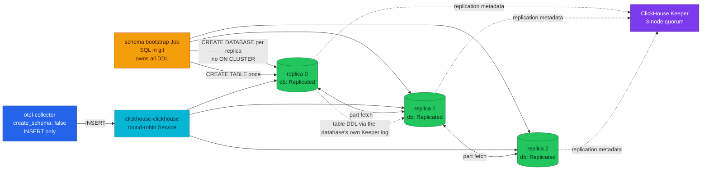

# ADR-065: Replicate ClickHouse across Three Replicas on a Keeper Quorum

> **Decision summary:** We will run the ClickHouse observability store as one
> shard with three `ReplicatedMergeTree` replicas coordinated by a three-node
> ClickHouse Keeper quorum, in a `Replicated` database whose schema is owned by a
> bootstrap Job in git rather than by the OTel Collector. We accept a new Job, SQL
> committed beside the manifests, and a schema that must stay compatible with the
> exporter's INSERT contract across collector upgrades, in exchange for turning
> the loss of a disk from unrecoverable data loss into a failover — without the
> startup race that exporter-owned DDL cannot avoid at more than one replica.

| Attribute | Value |
|-----------|-------|
| **Status** | Accepted |
| **Decision date** | 2026-08-28 |
| **Owners** | `duynhne` |
| **Deciders** | `duynhne` |
| **Scope** | The topology and schema ownership of the ClickHouse OLAP store; not sharding, not the ClickHouse user model, not backups |
| **Affected components** | `monitoring` namespace: ClickHouseInstallation `clickhouse`, the new ClickHouseKeeperInstallation `keeper`, the Altinity operator, the OTel Collector's clickhouse exporter, the ClickHouse alert group |
| **Related RFC** | [RFC-0028](../../rfc/RFC-0028/) |
| **Related research** | [research.md](../../rfc/RFC-0028/research.md) |
| **Supersedes** | — |
| **Superseded by** | — |
| **Implementation tracking** | One homelab PR: CHK + CHI topology + a schema bootstrap Job + per-pod scrape + alerts + platform docs, gated by a full Kind run with the replica-kill and keeper-kill drills |
| **Adoption** | Not started |

## Context

ClickHouse is the platform's long-retention OLAP store for OTel logs and traces
([ADR-023](../ADR-023-clickhouse-observability-olap/)), and since
[ADR-061](../ADR-061-edge-log-routing/) it is the **only** home of the edge access
log — an attributes-only record that LogsQL free-text search cannot see, and the
noisiest OTLP stream the platform produces.

It runs as a single `ClickHouseInstallation` with `shardsCount: 1` and
`replicasCount: 1` on one 10Gi PVC, with plain `MergeTree` tables and no
coordination layer. There is no second copy of any part. The consequence is
written down as an accepted gap in
`docs/observability/tracing/architecture.md`: *"a lost volume is lost traces."*
For the edge access log, where ClickHouse is not a supplementary sink but the
only one, the same sentence means 90 days of edge evidence disappears with one
disk.

Everything needed to change that is already deployed. The Altinity operator at
`0.27.3` ships the `ClickHouseKeeperInstallation` CRD, supplies the
`{installation}/{cluster}/{shard}/{replica}` macros that replicated tables need,
generates `remote_servers` with `internal_replication: true` from the CHI layout,
and creates the PodDisruptionBudget itself. The OTel Collector runs contrib
`0.159.0`, whose clickhouse exporter carries `ON CLUSTER` and `ENGINE` slots in
every table template — and whose cluster-mode database creation was fixed in
`v0.131.0`. Nothing in the store is a real deployment yet: the current dataset is
demo data from gate runs, so the usual migration ceremony does not apply.

The decision is needed now because the observability store is the one place where
the platform still records a known data-loss path as acceptable, while the
mechanism to close it sits installed and unused.

## Scope

### In scope

- The replica count and the coordination layer for the ClickHouse OLAP store.
- Which component creates the replicated schema, and therefore what happens to
  the collector when ClickHouse is unavailable.
- The engine argument style for `ReplicatedMergeTree` (default replica path
  versus explicit znode path).
- Whether the existing tables are converted or recreated.

### Out of scope

- **Sharding and `Distributed` tables.** Researched to know the trigger signals;
  deliberately not built. At one shard a `Distributed` table stores nothing and
  routes nothing, and the operator's Service already spreads connections.
- **The ClickHouse user model.** The single `default` user stays. A
  least-privilege split (`otel_writer` / `grafana` readonly / `admin` with pod-CIDR
  `networks/ip`) is an optional rung that can land any time, or never.
- **Backups.** `clickhouse-backup` to RustFS is complementary to replication, not
  an alternative, and belongs to its own decision.
- **The Grafana access mode.** Unchanged; the question dissolves into the user
  model rung.

## Decision drivers

| Priority | Driver | Why it matters |
|---------:|--------|----------------|
| 1 | Durability of data that exists nowhere else | The edge access log is ClickHouse-only; one PVC is currently a single point of total loss |
| 2 | Smallest possible delta | Every new moving part is a thing that breaks at 03:00; the operator already supplies the mechanism |
| 3 | Operability of the result | A replicated store nobody can observe per replica is a claim, not a capability |
| 4 | Learning value | The platform mirrors production practice; replication and quorum coordination are the point, not incidental |
| 5 | Reversibility | A topology that cannot be rolled back is a topology nobody dares to change |

## Decision

We will run the ClickHouse observability store as **one shard with three
replicas**, coordinated by a **three-node ClickHouse Keeper quorum** declared as
a `ClickHouseKeeperInstallation` named `keeper`, referenced from the CHI by name.

The `otel` database will use **`ENGINE = Replicated`**, and its schema will be
owned by a **bootstrap Job whose SQL is committed to git**. The collector runs
**`create_schema: false`** and only INSERTs. The Job creates the database on
**each replica individually** (no `ON CLUSTER`) and the tables **once** (also no
`ON CLUSTER`), letting the database's own Keeper log propagate them. Tables stay
`ReplicatedMergeTree` with **no engine arguments**, so the server's default
replica path (`/clickhouse/tables/{uuid}/{shard}`) applies. The existing
plain-`MergeTree` tables will be **dropped and recreated**, not converted.

Three replicas each hold a full copy of every part; Keeper holds the metadata
that says which parts exist and which replica has them. A replica that loses its
Keeper session keeps serving reads and stops accepting writes, so the failure mode
is degradation rather than corruption. Writes arrive through the operator's
round-robin Service, which is also what lets a reader route around a dead pod
without any client change.

The argument-free engine is a deliberate pairing with recreate-from-scratch: the
default `{uuid}` path mints a fresh Keeper znode on every `CREATE`, so a
drop-and-recreate cycle can never collide with a stale replica path — the classic
failure of explicit paths. It is also the only style the exporter can express,
which is what makes exporter-owned schema viable at all.

### Decision rules

| Rule | Required behavior |
|------|-------------------|
| **Ownership** | The bootstrap Job is the sole author of `otel.*` DDL, and its SQL lives in git. The collector must never create schema (`create_schema: false`); no hand-run `CREATE` outside the Job's SQL |
| **Write path** | Only the collector writes `otel.*` data, through the round-robin Service. DDL goes through the Job. Replication between replicas is Keeper-coordinated and must never be simulated by writing to each replica |
| **Read path** | Grafana and operators read through the same Service and must not assume which replica answers; per-replica questions go to `system.replicas` per pod, never to a Grafana query |
| **Boundary** | ClickHouse holds logs and traces only. Metrics stay on VictoriaMetrics. No `Distributed` table exists while `shardsCount` is 1 |
| **Failure behavior** | Losing one replica or one keeper is a failover, not an outage: reads and writes continue. A replica without a quorum goes read-only and must be alerted on, because it still answers reads while falling behind |
| **Compatibility** | Engine arguments stay absent, so replica paths remain `{uuid}`-derived. The committed DDL must satisfy the exporter's INSERT column lists — a collector image bump requires re-checking upstream `logs_insert.sql` / `traces_insert.sql`, because a mismatch fails at insert time under traffic, not at apply time |

### Decision view

## Alternatives considered

| Option | Benefits | Costs / risks | Result |
|--------|----------|---------------|--------|
| **A — A bootstrap Job owns the DDL in a `Replicated` database** (`create_schema: false`) | Removes the startup race *and* the startup coupling; `ALTER`s live in git beside the `CREATE`; a replica added later initialises its own tables | A new Job, SQL files, and Flux ordering to maintain; the committed schema must track the exporter's INSERT contract | Selected |
| **B — Exporter owns the replicated schema** (`create_schema: true` + `cluster_name` + `table_engine`) | Zero new parts | **Cannot produce a complete schema at three replicas.** The exporter issues `CREATE ... ON CLUSTER` at startup; a host that joins the distributed-DDL queue later skips earlier entries and `IF NOT EXISTS` makes every retry a no-op. Measured on two fresh Kind bring-ups: **1 of 3** replicas, then **2 of 3** after the Flux ordering was fixed. Upstream recommends against it for production, naming this exact failure | Rejected |
| **C — Convert the existing tables** (`ATTACH ... AS REPLICATED`) | Preserves the current dataset | Ceremony and risk to protect demo data from gate runs | Rejected |
| **D — Frugal 2 replicas + 1 keeper first** | Two fewer pods, lower memory | A one-node quorum survives nothing; the drill it would pass proves less than the drill it would fail | Rejected |
| **E — Stay 1×1 and add backups** | Cheapest; honest for a lab | Restores lose the tail and take hours; leaves the recorded data-loss gap permanent and teaches nothing about replication | Rejected |

### Why the selected option won

It is the only option that produces a complete schema. That is not a preference;
it is the measurement. Owning the DDL also removes the race at its root rather
than narrowing the window: the database is created per replica so the
cluster-wide DDL queue is never involved, and the `Replicated` database engine
means table DDL run once propagates through the database's own Keeper log —
including to a replica that appears later, which is what makes a future
`replicasCount` increase safe. Measured on this platform: `0` entries in
`system.distributed_ddl_queue` for the bootstrap, and `total_replicas = 3` on all
three replicas with a table created only once.

Two things the platform wanted anyway come along with it. The collector no longer
runs DDL in `start()`, so a restart during a ClickHouse outage costs the
ClickHouse sink instead of the whole collector — and with it VictoriaTraces and
VictoriaLogs. And `ALTER` finally has an owner, in git, next to the `CREATE`.

### Why the closest alternative lost

Option B did not lose on cost — it was genuinely cheaper, and that is why it was
chosen at the research gate. It lost on a fact the gate did not have: the
exporter's `ON CLUSTER` DDL cannot reach a replica that has not yet joined the
distributed-DDL queue, and `IF NOT EXISTS` guarantees no later attempt repairs
it. The result is a silent partial schema — every pod `Running`, every table
present on the replica the collector happened to talk to, `system.replicas`
reporting fewer copies than the topology claims. Fixing Flux ordering moved it
from one replica to two and could not reach three, because "pod Ready" is not
"joined the DDL queue".

The exporter's own README states the position plainly, and quoting it matters
because it shows this was knowable in advance:

> **Schema management** — "While the exporter can automatically create databases
> and tables, it is recommended for production environments to manage schemas
> manually by setting `create_schema` to false. This approach prevents race
> conditions during startup and simplifies future upgrades. When manual schema
> management is enabled, the exporter only executes INSERT statements, allowing
> users to customize indexes, TTL, and partitioning as needed."

"Prevents race conditions during startup" is the sentence. The research compared
the two options on parts-count and schema-evolution and never surfaced it.

## Consequences

### Positive consequences

- Losing one ClickHouse pod or PVC becomes a failover. Reads keep answering and
  the collector keeps inserting, because the Service routes around the gap.
- The recorded "lost volume is lost traces" gap is retired for ClickHouse, which
  matters most for the edge access log that lives nowhere else.
- A quorum failure has a name and a signal: a replica that loses Keeper goes
  read-only, which is now alerted on rather than invisible.
- Per-replica engine metrics exist for the first time, because a replicated
  topology is the reason the per-pod scrape was worth enabling.
- The platform gains a rehearsed answer to "what happens when a replica dies",
  proven by drill rather than asserted by design.
- **Adding a replica later works.** Under exporter-owned DDL a new replica would
  have silently had no tables at all, because the `CREATE` statements it needed
  were queue entries it joined too late to see. In a `Replicated` database it
  initialises its own tables once the Job has created the database on it.
- The collector's startup coupling is gone: no DDL in `start()` means a restart
  during a ClickHouse outage no longer risks the whole telemetry plane.

### Negative consequences and accepted trade-offs

- **A new moving part.** A Job, its SQL, and a Flux wave
  (`clickhouse-schema-local`) between the store and the collector. Jobs are
  immutable, so changing the DDL needs `kubectl delete job` plus a reconcile —
  written into the Job's own header rather than left to be rediscovered.
- **The committed schema must track the exporter's INSERT contract.** Upstream
  `logs_insert.sql` / `traces_insert.sql` define the columns the exporter writes.
  A collector image bump can change them, and a mismatch fails at insert time
  under traffic — not at apply time, so nothing in CI would catch it. The image
  is pinned; the chart is a range, so the pin is what must be respected.
- **The schema now exists in two places conceptually** — our SQL and the
  exporter's templates — and they can drift. Mitigated by deriving the committed
  DDL from `SHOW CREATE TABLE` on a cluster the exporter itself built, but the
  drift risk is real and permanent.
- **Memory and storage triple.** Three replicas at 2Gi limits plus three keepers
  put roughly a 7.5Gi ceiling on the `monitoring` namespace, and every part is
  stored three times. Each replica ingests everything, so capacity is planned per
  replica, not per cluster.
- **Sharding is not solved, only deferred.** When a merge or disk trigger fires
  chronically, that is a separate decision with its own migration.
- **The single `default` user remains** the whole access control story for the
  store, shared by the collector and Grafana.
- **The `Replicated` database engine is new ground on this platform.** Nothing
  else here uses it; every other replicated object is a `ReplicatedMergeTree`
  table. Its constraints (one replica executes each DDL, restrictions on
  non-deterministic DDL) are now ours to know.

### Neutral consequences

- local-stack stays a single node with no keeper. The twin divergence is
  deliberate and recorded; the exporter's cluster options are cluster-only values.
- Grafana's datasource is unchanged — it already points at the round-robin
  Service, which is why it survives a replica loss without edits.
- The Altinity operator keeps creating the PodDisruptionBudget; no PDB is authored
  here.

## Implementation obligations

| Obligation | Owner | Tracking | Completion signal |
|------------|-------|----------|-------------------|
| `ClickHouseKeeperInstallation` `keeper` (3 replicas) in the `clickhouse-local` wave | platform | RFC-0028 PR | `kubectl get chk -n monitoring` Ready; three keeper pods on three nodes |
| CHI to `replicasCount: 3` + `zookeeper.keeper.name` + host anti-affinity | platform | RFC-0028 PR | Three CH pods on three distinct nodes |
| Bootstrap Job owns the DDL; exporter `create_schema: false` | platform | RFC-0028 PR | The Job reaches Complete having asserted `total_replicas` on every replica; the collector creates nothing |
| Gate all three CH StatefulSets in the Flux wave | platform | RFC-0028 PR | `clickhouse-local` cannot report Ready on one replica of three |
| Per-pod `:9363` scrape so replicas are individually observable | platform | RFC-0028 PR | `ClickHouseMetrics_*` series exist, labelled per replica |
| Keeper and read-only-replica alerts | platform | RFC-0028 PR | Rules loaded in vmalert; series confirmed to exist, not merely referenced |
| Update platform docs to the replicated reality | platform | RFC-0028 PR | No doc claims "single shard × single replica" |
| Prove replication by drill, not by pod count | platform | RFC-0028 PR | Replica-kill and keeper-kill drills pass with the collector never restarting |

## Validation and compliance

| Requirement | Verification |
|-------------|--------------|
| Tables are genuinely replicated | `system.replicas` on every pod reports `total_replicas = 3`, `active_replicas = 3`, `is_readonly = 0` for each `otel` table |
| Replication actually moves data | Insert a marker row on one replica; read it back from the other two. Three Ready pods with three independent empty tables would satisfy every other check |
| The quorum is the coordinator | `system.zookeeper_connection` names the keeper on every replica |
| The default replica path is in effect | `SELECT * FROM system.server_settings WHERE name LIKE 'default_replica%'` matches the `{uuid}` form |
| Engine is replicated everywhere | `SELECT engine, count() FROM system.tables WHERE database = 'otel' GROUP BY engine` returns only `ReplicatedMergeTree` |
| A dead replica is survivable | Replica-kill drill: Grafana keeps returning frames, inserts keep landing, `system.replication_queue` drains to 0 on all replicas after the pod returns |
| A dead keeper is survivable | Keeper-kill drill: quorum holds at 2/3, writes continue, no replica goes read-only |
| The collector is not collateral damage | The otel-collector Deployment records zero restarts across both drills |
| Alerts reference series that exist | The `VERIFY-AT-KIND` markers on the Keeper and read-only rules are closed by querying the series, not by assuming it |
| The bootstrap avoids the DDL queue entirely | `system.distributed_ddl_queue` has **no** entries for the schema objects: the database is created per replica and the tables inside a `Replicated` database. An entry appearing there means someone reintroduced `ON CLUSTER` |
| The database engine is right | `SELECT engine FROM system.databases WHERE name='otel'` returns `Replicated` on every replica. `Atomic` means the Job ran against a pre-existing database and table DDL will not propagate |
| The collector owns no schema | `create_schema: false` in the collector values, and no `cluster_name` / `table_engine` / `ttl` — those only ever fed the DDL path. TTL lives in the committed DDL |
| The insert contract holds | The committed DDL satisfies upstream `logs_insert.sql` (15 columns + the `EventName` feature column) and `traces_insert.sql` (22 columns). Re-check on any collector image bump |
| The wave really gates | `clickhouse-local` must not carry `wait: true`: it is mutually exclusive with `healthChecks` and wins, and that overlay applies only custom resources whose status kstatus cannot assess. Measured with `wait` set: reconcile finished in 371 ms with zero StatefulSets in existence. `clickhouse-schema-local` is the opposite case — it applies a Job, which kstatus does assess, so it uses `wait: true` |
| Documentation | `docs/observability/clickhouse/README.md` and the tracing architecture doc describe the replicated topology; this ADR is linked from RFC-0028 |

## Revisit triggers

Re-open this decision when one or more of the following become true:

- **The exporter's INSERT contract changes** under a collector upgrade, making
  the committed DDL wrong. This is the standing maintenance cost of owning the
  schema, and the reason the collector image stays pinned.
- **The `Replicated` database engine proves unsuitable** — a DDL shape it
  rejects, or an upgrade that changes its semantics. The fallback is per-replica
  table DDL from the same Job, which is strictly more work but needs no new
  design.
- **Sharding arrives.** A `Distributed` table over more than one shard changes
  what the Job must create, and the `Replicated` database's auto-maintained
  cluster entry becomes relevant.
- **Any sharding trigger signal fires chronically** rather than transiently:
  `ClickHouseTooManyParts` sustained, the disk pair firing after TTL, ingest rate
  flat while the collector's queue grows, or heavy scans hitting
  `max_execution_time`. The trigger table lives in the RFC research.
- **Memory pressure proves the 3+3 sizing wrong** on the target host.
- **A credential or tenancy requirement arrives** that the single `default` user
  cannot express, which promotes the optional user-model rung.
- **ClickHouse becomes a system of record** rather than diagnostic data, which
  would make backups mandatory alongside replication rather than complementary.

A review does not automatically reverse the decision. A changed decision requires
a new ADR that supersedes this one.

## References

- [RFC-0028](../../rfc/RFC-0028/) — the accepted design
- [RFC-0028 research](../../rfc/RFC-0028/research.md) — mechanism deep dive, the Option A/B table, the sharding trigger signals, and the Context7 audit log
- [ADR-023](../ADR-023-clickhouse-observability-olap/) — why ClickHouse exists on this platform
- [ADR-061](../ADR-061-edge-log-routing/) — why the edge access log is ClickHouse-only, and therefore why this durability gap mattered most there
- [RFC-0019](../../rfc/RFC-0019/) — the observability OLAP program this extends
- [ClickHouse operations](../../../observability/clickhouse/README.md) — the as-built store, its schema, and its runbook
- [Tracing architecture](../../../observability/tracing/architecture.md) — the accepted-gap list this decision edits

## History

| Date | Status / adoption | Change |
|------|-------------------|--------|
| 2026-08-28 | Accepted / Not started | Created at Accepted with the RFC-0028 architecture review |
| 2026-08-28 | Accepted / Not started | **Decision reversed before it ever shipped.** Two Kind bring-ups showed exporter-owned `ON CLUSTER` DDL reaching only 1 of 3 and then 2 of 3 replicas, and the exporter's README recommends `create_schema: false` for production to prevent exactly that startup race. Schema ownership moves to a bootstrap Job in git and the `otel` database becomes `ENGINE = Replicated`. Option B is demoted to a rejected alternative with the measurements. Amended rather than superseded: this record had not landed on `main` and had never reached `Adoption: Complete`, so a superseding ADR would leave two records describing one never-deployed design |

---
_Last updated: 2026-08-28_
