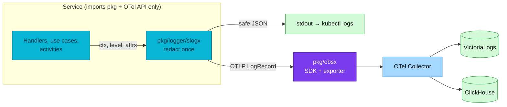

# ADR-070: Log through One Shared slog Facade with a Reviewed Event Catalog

> **Decision summary:** We will make `pkg/logger/slogx` the only application
> logging facade — a context-first API over the standard library's `slog` that
> renders one redacted record to stdout and, when export is on, the same record
> over OTLP — and we will name only a small, reviewed catalog of business events.
> We accept a one-time cutover of every logging call site in the fleet in exchange
> for one redaction boundary, no third-party logging dependency in any service, and
> a name space that stays queryable.

| Attribute | Value |
|-----------|-------|
| **Status** | Accepted |
| **Decision date** | 2026-09-17 |
| **Owners** | `duynhne` |
| **Deciders** | `duynhne` |
| **Scope** | The application logging API every Go service and worker uses, and which log records carry a stable name |
| **Affected components** | `duynhlab/pkg` (`logger/slogx` new; `logger/zapx`, `logger/zerolog`, `logger/clog` retired; `obsx` log bridge); every service `cmd/main.go` and logging call site; `docs/api/logs.md`, `docs/api/pkg.md` |
| **Related RFC** | [RFC-0031](../../rfc/RFC-0031/) |
| **Related research** | [research.md](../../rfc/RFC-0031/research.md) |
| **Supersedes** | — |
| **Superseded by** | — |
| **Implementation tracking** | RFC-0031 delivery plan Tasks 1.1, 1.1b, 1.1c, 2.1, 2.2, Phase 3 |
| **Adoption** | Not started |

## Context

Ten services log through `logger/zapx`, a thin adapter over Zap, and reach OTLP
through an `otelzap` core that `pkg/obsx` constructs. The shape is workable at ten
services and already shows the cracks the RFC-0031 audit documented: redaction lives
in more than one adapter, the stdout record and the OTLP record are produced by two
code paths that can disagree, every service links a third-party logging library and
its bridge, and the shared package's own public API leaks `zap.Field` and
`zapcore.Core`, forcing each `main()` to import Zap to call it. Two more logger
adapters in the shared package have no consumer at all.

Naming is the second problem. Nothing states which log records deserve a stable
name. Left alone, teams name everything, and a catalog that grows with every log
line stops being a catalog. The wide-record pattern the wider industry converged on
— one access record per served call, a handful of named business outcomes, free
diagnostics — needs a rule, not a habit.

The audit recommended keeping Zap and adding the missing redaction boundary to it.
The RFC proposed the standard-library facade. Both are conformant with the OTel Logs
data model; the difference is dependency surface and where redaction lives. The
owner decided for the facade at architecture review, and accepted the cost without
the comparative benchmark the audit asked for, because the platform is greenfield and
the work the two paths share — closing the shared package's type leaks — is the
larger part of either.

## Scope

### In scope

- The facade module, its placement in `duynhlab/pkg`, and the behaviours it must
  provide (context, event, diagnostic, attributes, error, resource, output,
  lifecycle).
- Which records are named, and how the catalog is governed.
- Retirement of the unused adapters and of the shared package's Zap-typed API.

### Out of scope

- The attribute schema of the access record and of named events — ADR-071.
- The OTel log-record representation of an event name — RFC-0031 excludes it.
- The order and mechanics of the fleet cutover — ADR-072.
- Log storage, routing or retention — unchanged, see ADR-061 and ADR-065.

## Decision drivers

| Priority | Driver | Why it matters |
|---------:|--------|----------------|
| 1 | One redaction boundary | A secret that leaks through the second sink is still a leak; there must be exactly one implementation to test |
| 2 | No telemetry library chosen per service | At a thousand services, "did every team do it right" must become "did the one package do it right" |
| 3 | Standard library first | `slog` is in every Go toolchain; the only remaining dependency is the OTel API the platform already requires |
| 4 | Greenfield moment | Call sites are paid once now or twice later; no dual-write window is wanted |
| 5 | Queryable names | A small owned catalog is worth more than a name on every line |

## Decision

We will ship `pkg/logger/slogx` as the sole application logging facade and retire
`logger/zapx`, `logger/zerolog` and `logger/clog` in the same release train. The
facade is context-first: every emission takes a context, reads trace and span
identifiers from it, redacts attributes recursively once, and writes one safe JSON
record to stdout and the equivalent OTLP record when export is enabled. It exposes
diagnostic methods, one `Event` method that sets the deployed `event` attribute, and
test helpers. The shared package alone links the OTel Logs SDK and bridge; the facade
imports the OTel API only.

Named records form a reviewed catalog of five classes — business state transition,
retry exhausted, compensation, workflow lifecycle, startup/shutdown. The served HTTP
or gRPC call is **not** a named event: it is one wide access record that joins to its
span by trace ID. Adding a class is a pull request against the catalog, never a
choice at a call site.

### Decision rules

| Rule | Required behavior |
|------|-------------------|
| **Single facade** | Application code imports `pkg/logger/slogx` and nothing else for logging; `zap`, `zapcore`, direct `log/slog`, `zerolog`, `contrib/bridges/*` and `otel/log` are denied by the fleet lint policy |
| **Placement** | `logger/slogx` is a sibling module with its own `go.mod` and tag; no `pkg/logger` parent module is created; the module never imports `otel/sdk` or `pkg/obsx` |
| **One record, two renderings** | stdout JSON and the OTLP record are produced from the same redacted record; a field present in one is present in the other |
| **Redaction** | Runs before both sinks, recursing through groups, maps, arrays, errors and exception payloads, case-insensitive after key normalisation, with the deny list in ADR-071 |
| **Naming** | Only catalog classes carry `event`; the access record and diagnostics carry none; names are lowercase dot-separated operation classes with no identifier or free text |
| **Severity** | The facade's six levels map to OTel severity numbers 1/5/9/13/17/21; FATAL is reserved for bootstrap failure after flush |
| **Lifecycle** | The facade flushes once, with the process shutdown context, after servers and workers drain |
| **Shared package hygiene** | `obsx` exposes no Zap or SDK type in any exported signature; the log bridge is constructed inside the facade's setup, not by `main()` |

### Decision view

## Alternatives considered

| Option | Benefits | Costs / risks | Result |
|--------|----------|---------------|--------|
| **A — `pkg/logger/slogx` facade over `slog` + OTel Logs API** | Standard library; one redaction boundary; no logging dependency in services | Every logging call site in the fleet changes once; pre-1.0 Logs API contained in the shared package | Selected |
| **B — Keep `logger/zapx`, add central redaction and a stable event helper** | Fewest call-site edits; Zap's performance profile is known | Keeps a third-party logging library and bridge in every service; redaction stays split across adapters; the type leaks in `obsx` must be closed anyway | Rejected — owner decision 2026-09-17; the audit's recommendation stays on record in the RFC |
| **C — Direct OTel Logs API in application code** | No facade layer | Unstable API in every repository; no place for redaction or naming rules | Rejected |
| **D — Name every log line as an event** | Uniform | Catalog becomes a copy of message text; unqueryable | Rejected |

### Why the selected option won

It is the only option that yields one redaction implementation, one dependency
surface (the OTel API) and one rendering path for two sinks. The greenfield state
of the platform makes the cutover a one-time cost rather than a recurring migration.

### Why the closest alternative lost

Keeping Zap saves call-site edits but leaves the two properties the decision is
about — a single redaction boundary and no per-service logging dependency —
unaddressed, and the shared work of closing `obsx`'s Zap-typed API still has to be
done. The saving is smaller than it looks and the debt is permanent.

## Consequences

### Positive consequences

- One tested redaction path guards both sinks.
- Services depend on the shared package and the OTel API only; the fleet lint policy
  can say so and mean it.
- The catalog stays readable in one sitting and is queryable by name across services.
- Two dead adapters leave the shared package.

### Negative consequences and accepted trade-offs

- Every production logging call site in ten services and two workers changes in one
  release train, without a dual-write window.
- The OTel Logs API is pre-1.0; the shared package absorbs its breaking changes.
- The comparative facade benchmark the audit asked for was not run before deciding;
  the redaction test suite it asked for is required at Task 1.1 instead.

### Neutral consequences

- Record content and routing are unchanged; VictoriaLogs and ClickHouse consumers see
  the same fields under the same keys.
- Temporal workflow code keeps the SDK's replay-safe logger; the facade is for
  activities and entry points.

## Implementation obligations

| Obligation | Owner | Tracking | Completion signal |
|------------|-------|----------|-------------------|
| Build `logger/slogx` with the eight required behaviours and test helpers | `duynhlab/pkg` | RFC-0031 Task 1.1 | Unit tests, `depguard` proof of API-only imports, Collector-to-ClickHouse integration test |
| Remove `obsx`'s Zap- and SDK-typed public API and its `otelzap` dependency | `duynhlab/pkg` | RFC-0031 Task 1.1c | `go doc` of `obsx` shows no `zap`/`zapcore`/`sdk` type; breaking release noted |
| Retire `logger/zapx`, `logger/zerolog`, `logger/clog` | `duynhlab/pkg` | RFC-0031 Task 1.1b | No service `go.mod` references a removed module |
| Cut every service and worker over to the facade | Service repositories | RFC-0031 Phase 3 | No `zap`/`otelzap` import outside tests; access and named records verified in both stores |
| Publish the initial event catalog and the as-built facade contract | Platform docs | RFC-0031 Tasks 0.2, 4.3 | `docs/api/logs.md` and `docs/api/pkg.md` match deployment |

## Validation and compliance

| Requirement | Verification |
|-------------|--------------|
| API-only imports | `depguard` over `logger/slogx` denies `otel/sdk` and `pkg/obsx`; fleet policy denies the logging libraries in services |
| Redaction | Nested groups, maps, arrays, errors and exception payloads cannot leak any deny-listed key to stdout or OTLP |
| One record | A golden test asserts the stdout JSON and the OTLP record carry the same attribute set for the same call |
| Naming | Catalog classes carry `event`; the access record and diagnostics carry none; a non-catalog name fails review |
| Severity | Each facade level maps to its OTel number in a table test |
| Lifecycle | Shutdown test proves one flush within budget after drain, with exporters disabled and enabled |

## Revisit triggers

Re-open this decision when one or more of the following become true:

- The OTel Logs API reaches 1.0 with a shape that makes the facade layer redundant.
- Measured logging overhead under fleet volume breaches an SLO the facade cannot meet.
- A second language joins the fleet and needs a different facade contract.
- The catalog exceeds what an operator can read in one sitting.

A changed decision requires a new ADR that supersedes this one.

## References

- [RFC-0031](../../rfc/RFC-0031/) — § Proposal, § Record model, § Service-facing facade, § Open disagreement: keep Zap
- [RFC-0031 research](../../rfc/RFC-0031/research.md)
- [RFC-0031 delivery plan](../../rfc/RFC-0031/delivery-plan.md)
- [Telemetry standards audit, 2026-09-16](../../../observability/audits/2026-09-16-telemetry-standards.md)
- [ADR-071 — Canonical event, access and privacy data contract](../ADR-071-telemetry-event-data-contract/)
- [ADR-072 — Fleet cutover with no migration mechanism](../ADR-072-telemetry-clean-cutover/)
- [Logging contract (as-built)](../../../api/logs.md)
- [Shared package contract (as-built)](../../../api/pkg.md)

## History

| Date | Status / adoption | Change |
|------|-------------------|--------|
| 2026-09-17 | Proposed / Not started | Drafted during RFC-0031 architecture review from the RFC's logging proposal |
| 2026-09-17 | Accepted / Not started | Owner chose the slog facade over the audit's keep-Zap recommendation; created at `Accepted` with the RFC per the RFC-0028/RFC-0030 precedent |

---
_Last updated: 2026-09-17._
