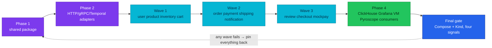

# ADR-072: Cut the Fleet Over in One Release with No Migration Mechanism

> **Decision summary:** We will adopt the RFC-0031 telemetry contract as one
> release train — shared package, then services in domain waves, then dashboards,
> queries and runbooks — with no dual-write window, no compatibility shim and no
> contract-version attribute, and we will make a fleet lint policy the thing that
> keeps every service within one minor version of the shared package thereafter.
> We accept that a partial rollout is a failed rollout in exchange for never
> operating two telemetry contracts at once.

| Attribute | Value |
|-----------|-------|
| **Status** | Accepted |
| **Decision date** | 2026-09-17 |
| **Owners** | `duynhne` |
| **Deciders** | `duynhne` |
| **Scope** | How the fleet moves from the deployed telemetry shape to the RFC-0031 contract, and how it stays on one contract afterwards |
| **Affected components** | `duynhlab/pkg` release process; `duynhlab/gha-workflows` shared lint job; every service repository; ClickHouse and Grafana consumers; `local-stack` and Kind end-to-end gates |
| **Related RFC** | [RFC-0031](../../rfc/RFC-0031/) |
| **Related research** | [research.md](../../rfc/RFC-0031/research.md) |
| **Supersedes** | — |
| **Superseded by** | — |
| **Implementation tracking** | RFC-0031 delivery plan Phases 1–4, checkpoints and final release gate |
| **Adoption** | Partial — pin and linter convergence complete 2026-09-18; lint policy, cutover and CI-enforced floor not started |

## Context

The platform runs ten Go services and two worker modes, all on one shared package,
and has no external consumer of its telemetry. That is the one moment at which a
contract can be defined fresh and adopted whole. The owner stated the rule plainly
during the RFC: define once, no migration mechanism.

Fleet reality today argues for a mechanism that pins the fleet together afterwards.
The module that links the SDK is at three versions across ten services, the transport
module at two, and the only thing that moves a version is a per-repository dependency
bot. No service lints with `depguard`; the shared CI job accepts only a config path,
so a fleet policy has had nowhere to live. A contract adopted once and left to drift
is a contract for one release.

## Scope

### In scope

- Release ordering, wave composition, rollback rule and the definition of a failed
  rollout.
- The prohibition on dual emission, compatibility shims and contract-version
  attributes.
- The shared-package version floor and the fleet lint policy that enforces both the
  floor and the import boundary.

### Out of scope

- What the contract says — ADR-070, ADR-071, ADR-073, ADR-074, ADR-075.
- The registry that later generates names — ADR-076.
- Storage schema changes — unchanged by this decision.

## Decision drivers

| Priority | Driver | Why it matters |
|---------:|--------|----------------|
| 1 | Never two contracts at once | Every query, alert and runbook has one shape to be right about |
| 2 | Greenfield is now | No external consumer exists; the cost of a clean cut is at its minimum |
| 3 | Fleet stays converged | A version floor with a lint gate replaces goodwill |
| 4 | Rollback is symmetric | Pins and dashboards move back together or not at all |
| 5 | Enforcement has a home | A shared policy file plus a second lint pass is the only channel the current CI offers |

## Decision

We will implement RFC-0031 as one release train in the order the delivery plan
fixes: shared foundations (facade, type-leak closure, resource identity, metrics,
profiling and tracing contracts) → transport and worker adapters → services in three
domain waves → ClickHouse, Grafana, VictoriaMetrics and Pyroscope consumers in the
same release → Compose and Kind audits across all four signals. There is no dual
emission, no legacy-field window and no contract-version attribute on any record.
Rollback pins the shared package and every application release back together with
the matching dashboard configuration; a partial rollout is not promoted.

After the cutover, a service may run at most one minor version behind the shared
package's current release. A `golangci-policy.yml` in the shared-workflows repository
carries `depguard` rules for the import boundary in the shared-package rule and a
`forbidigo` rule for unbounded seconds histograms; the shared lint job runs it as a
second, additive pass, non-blocking for one release and blocking thereafter. The
policy exempts `cmd/**` only until the shared package's own type leaks are closed.

### Decision rules

| Rule | Required behavior |
|------|-------------------|
| **Order** | pkg → adapters → services by domain wave → consumers, per the delivery plan; no phase starts before its checkpoint passes |
| **No migration mechanism** | No dual-write, no compatibility mode, no legacy-field window, no version attribute on records |
| **All or nothing** | A release in which any wave fails is rolled back whole; pins and dashboards move together |
| **Version floor** | A service more than one minor behind the shared package fails the fleet lint policy; release notes state the floor |
| **Policy channel** | Fleet lint rules live in one file in the shared-workflows repository and run as a second `golangci-lint run --config=<policy>` pass; a service's own config is untouched |
| **Policy wording** | If the rule rejects an import, the import is wrong — not the rule; escalate to a human before touching the policy |
| **Linter convergence** | The shared package and the services lint at the same golangci-lint version before the policy blocks |
| **Definition of instrumented** | A service passes the conformance check in local-stack; nothing else counts |

### Decision view

## Alternatives considered

| Option | Benefits | Costs / risks | Result |
|--------|----------|---------------|--------|
| **A — One release train, no migration mechanism, version floor enforced by fleet lint** | One contract at any moment; cheapest now; enforcement has a channel | A failed wave rolls the whole train back; teams cannot lag | Selected |
| **B — Dual emission with a contract-version attribute and a deprecation window** | Consumers migrate at leisure | Two shapes in every store; every query grows a version branch; the window never closes in practice | Rejected — owner rule: no migration mechanism |
| **C — Service-by-service adoption with no floor** | No coordination | Three `obsx` versions today become ten; the contract is true for whichever service updated last | Rejected |
| **D — Enforce the boundary by review only** | No CI change | Already the status quo, and the audit found the boundary violated in the shared package itself | Rejected |

### Why the selected option won

It is the only option consistent with the owner's greenfield rule that also leaves a
mechanism behind: the version floor and policy file keep the fleet on one contract
after the train has passed.

### Why the closest alternative lost

Dual emission is the industry default for brownfield fleets with external consumers.
This platform has neither; paying for a window nobody needs would install exactly the
two-shape state the standard exists to prevent.

## Consequences

### Positive consequences

- At every moment the fleet emits one contract; queries, alerts and runbooks have one
  shape.
- The shared package's version spread collapses to one and stays within one minor.
- The import boundary becomes a CI result instead of a review opinion.

### Negative consequences and accepted trade-offs

- A single failed wave rolls back the whole release; the train is long and the gate is
  strict.
- Service teams lose the option to lag; the floor is enforced by a failing lint.
- The policy channel is a second lint pass by path because golangci-lint has no
  config inheritance; this is a workaround the shared CI must own.

### Neutral consequences

- Dependabot's existing `duynhlab-pkg` group remains the bump mechanism.
- Storage schemas are unchanged; only the values written to them change.

## Implementation obligations

| Obligation | Owner | Tracking | Completion signal |
|------------|-------|----------|-------------------|
| Converge the shared package's three `obsx` pins and the two linter versions — **done 2026-09-18** | Service repositories, `duynhlab/pkg` | RFC-0031 Phase 1 prerequisite | One `obsx` version fleet-wide (`v0.38.0`, ten patch releases after a full local-stack audit); one golangci-lint version in pkg and services (v2.12.2, pkg #88) |
| Add `golangci-policy.yml` and the second lint pass to the shared lint job | `duynhlab/gha-workflows` | RFC-0031 Task 1.1c, Phase 3 | Policy runs non-blocking on every service; blocks after one release; `cmd/**` exemption removed when 1.1c lands |
| Execute the three domain waves and the consumer release | Service repositories, Observability | RFC-0031 Phase 3, Task 4.1 | Checkpoints pass; no legacy key in any store for new records |
| Run the final gate on Compose and Kind | Platform | RFC-0031 final release gate | Browser checkout, HTTP, gRPC, Temporal, business rejection, dependency failure and both correlation directions pass |
| State the version floor in shared-package release notes | `duynhlab/pkg` | Each release after cutover | Release notes name the floor; policy encodes it |

## Validation and compliance

| Requirement | Verification |
|-------------|--------------|
| No migration mechanism | Grep of the shared package and services finds no dual-emission flag, legacy-key writer or contract-version attribute |
| Order | Each phase's checkpoint is recorded before the next begins |
| Rollback | A rehearsed rollback on local-stack restores pins and dashboards together and passes the audit |
| Version floor | A branch pinning the shared package two minors behind fails the fleet policy |
| Import boundary | A branch importing `otel/sdk` or `go.uber.org/zap` outside tests fails the fleet policy |
| Linter parity | pkg and a service lint at the same version in CI |

## Revisit triggers

Re-open this decision when one or more of the following become true:

- An external consumer of platform telemetry appears whose contract cannot change
  in lockstep.
- The fleet grows beyond what one release train can carry through three waves.
- golangci-lint gains config inheritance or remote includes, making the second-pass
  channel unnecessary.

A changed decision requires a new ADR that supersedes this one.

## References

- [RFC-0031](../../rfc/RFC-0031/) — § Shared-package rule, § Fleet scale, § Rollout & rollback
- [RFC-0031 delivery plan](../../rfc/RFC-0031/delivery-plan.md)
- [RFC-0031 research](../../rfc/RFC-0031/research.md)
- [ADR-070 — Log through one shared slog facade](../ADR-070-logging-facade-and-event-catalog/)
- [Shared package contract (as-built)](../../../api/pkg.md)
- [Observability contract (as-built)](../../../api/observability.md)

## History

| Date | Status / adoption | Change |
|------|-------------------|--------|
| 2026-09-17 | Proposed / Not started | Drafted during RFC-0031 architecture review from § Rollout & rollback and § Fleet scale; owner's greenfield rule recorded |
| 2026-09-17 | Accepted / Not started | Owner accepted with the RFC; created at `Accepted` per the RFC-0028/RFC-0030 precedent |
| 2026-09-18 | Accepted / Partial | First obligation closed: every `duynhlab/pkg` module at its current tag in all ten services (`obsx v0.38.0` fleet-wide, was three versions) and pkg lints at the fleet's golangci-lint v2.12.2 |

---
_Last updated: 2026-09-18 — Adoption `Partial`: the pin and linter convergence obligation is complete (ten service releases, pkg #88). Previously 2026-09-17._
