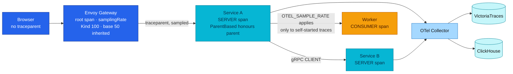

# ADR-075: Sample at the Edge and Govern Spans and Baggage from the Shared Package

> **Decision summary:** We will keep `ParentBased(TraceIDRatioBased)` with the edge
> as the root of every proxied trace, state the applied sampling rate per
> environment rather than the base manifest's value, and fix span naming, kind,
> scope, status, span-event and baggage rules that only the shared package's helpers
> and automatic instrumentation may implement. We accept that raising any rate first
> requires the storage arithmetic nobody has done, in exchange for traces whose
> shape and volume are decided in one place.

| Attribute | Value |
|-----------|-------|
| **Status** | Accepted |
| **Decision date** | 2026-09-17 |
| **Owners** | `duynhne` |
| **Deciders** | `duynhne` |
| **Scope** | Application tracing on every Go service and worker: sampling, span naming, kind, scope, status, span events, baggage and probe filtering |
| **Affected components** | Envoy Gateway tracing `samplingRate` (base and overlays); `pkg/obsx` tracer provider and span helpers; `pkg/httpmw`, `pkg/grpcx`; manual spans in every service; `docs/api/tracing.md` |
| **Related RFC** | [RFC-0031](../../rfc/RFC-0031/) |
| **Related research** | [research.md](../../rfc/RFC-0031/research.md) |
| **Supersedes** | — |
| **Superseded by** | — |
| **Implementation tracking** | RFC-0031 delivery plan Tasks 1.2, 1.5, 4.4 |
| **Adoption** | Not started |

## Context

Tracing is the signal every other signal correlates through, and its deployed shape
is sound: the OTel Tracer API through the shared provider, automatic transport and
database instrumentation, export to VictoriaTraces for operations and ClickHouse for
SQL. What was missing was the contract. The base edge manifest declares
`samplingRate: 50`, and the platform's own documentation repeated that as if it were
running — but the Kind overlay patches it to 100, the production cluster is a stub,
and local-stack runs at 100, so the 50 applies nowhere. Because the edge starts the
root span and propagates `traceparent`, a service's own `OTEL_SAMPLE_RATE` governs
only traces the service starts itself; the audit's earlier finding that the edge
decides fleet sampling still holds.

Span rules were inherited by pointer rather than stated: no document fixed span
naming versus event naming, span kind per layer, the instrumentation scope, when
Error status is set, how many span events are too many, or what baggage may carry
across every downstream hop including third-party calls. The probe skip list exists
in code and is shared between the trace and metric paths, but nothing pins it.

## Scope

### In scope

- The sampler, the edge-as-root model, and the applied rate per environment.
- Span naming, kind by layer, instrumentation scope, granularity ladder.
- Status and error rules, exception span events, span-event limits.
- Baggage default-deny, immutability, storage rule and third-party stripping.
- Probe filtering shared with the metric path.

### Out of scope

- Trace backends and retention — unchanged (ADR-058, ADR-059, ADR-065).
- Span-derived RED dimensions — ADR-057 amendment via RFC-0031 Task 4.4.
- Changing any sampling rate — this decision states rates, it does not raise them.

## Decision drivers

| Priority | Driver | Why it matters |
|---------:|--------|----------------|
| 1 | The edge decides | ParentBased plus an edge root means one number governs fleet volume; it must be the applied number |
| 2 | Shape decided once | Kind, scope and naming from the shared helpers make traces comparable across services |
| 3 | Error means failure | Business rejections with Error status make error-rate SLOs lie |
| 4 | Baggage leaves the process | Every key crosses every hop, including third parties; default must be deny |
| 5 | Volume changes are reviewed changes | No auto-mapping of environment to rate; the storage sum precedes any raise |

## Decision

We will keep `ParentBased(TraceIDRatioBased(rate))` with the edge as root, honour
any sampled remote parent, and state the applied rates: base manifest 50 (inherited
by a future production cluster, applied nowhere today), Kind 100, local-stack 100;
services `0.1` on the clusters and `1.0` on local-stack, applying only to traces a
service starts itself. Raising an applied rate anywhere requires the storage
arithmetic for both trace stores first.

Span names are two-part stable operation classes with no identifier; span names and
event names are different namespaces. Kind follows the layer — `SERVER` from
transport instrumentation, `INTERNAL` as the default for manual `logic/v1` spans via
the shared helper, `CLIENT` from adapter instrumentation, `PRODUCER`/`CONSUMER` from
the supported Temporal integration — and the scope is the package path, never the
service name. No wrapper spans around instrumented work; attributes first, then a
span event, then a child span. Error status marks a failed operation with
`error.type`, never an expected business rejection. Span events are bounded and never
emitted in a loop. Application baggage is default-deny; an approved key is immutable,
never stored by a backend, copied to a span or log attribute where consumed, and
stripped before any external provider call. Probe and health routes are filtered
before the span starts from a skip list shared with the metric path and pinned by
unit test.

### Decision rules

| Rule | Required behavior |
|------|-------------------|
| **Sampler** | `ParentBased(TraceIDRatioBased(rate))` from the shared provider; a sampled parent is always honoured; no environment-to-rate auto-mapping |
| **Applied rates** | Documentation states the rate each environment actually applies; the base manifest's 50 is described as inherited, not running |
| **Raise gate** | No applied rate is raised before the 90-day and 7-day trace-store storage sum is written down |
| **Naming** | Two-part operation class (`checkout.confirm`); no identifiers; never minted from an event name or vice versa |
| **Kind and scope** | Exactly one kind per span by layer; scope is the package path; `INTERNAL` is the manual default via `obsx.StartSpan` |
| **Granularity** | Attribute → span event → child span, in that order; no span around already-instrumented work; no span per function |
| **Status** | Error only for unexpected failure, with `error.type`; business rejections carry a bounded outcome attribute and leave status unset |
| **Exceptions** | Standard exception span event with bounded `exception.stacktrace`; no secrets or raw payloads |
| **Span events** | Stable names; bounded count; per-item detail goes to correlated logs, fan-out to span links |
| **Baggage** | Default no application baggage; approved keys are reviewed, immutable, not stored, copied to attributes where consumed, stripped before third-party calls |
| **Probes** | Filtered before span start; skip list shared with metrics; pinned by test |

### Decision view

## Alternatives considered

| Option | Benefits | Costs / risks | Result |
|--------|----------|---------------|--------|
| **A — ParentBased with edge root, applied rates stated, span/baggage rules from the shared package** | One number governs volume; comparable traces; baggage safe by default | Rates cannot be raised without the storage sum; manual spans lose freedom | Selected |
| **B — Service-side sampling decides (AlwaysOn at the edge, ratio in services)** | Per-service tuning | Breaks trace completeness across hops; the edge already roots every trace | Rejected |
| **C — Tail sampling in the Collector** | Keeps every error trace | Requires a stateful Collector tier with a load-balancing exporter; a topology change RFC-0031 defers to the Collector contract | Rejected for now |
| **D — Leave span rules to each service** | No contract to maintain | Kind, scope and naming already diverge at ten services; error-rate SLOs already lie on business rejections | Rejected |

### Why the selected option won

It documents the model the platform already runs — correctly this time — and turns
the inherited pointers into rules the shared helpers can implement and a test can
check, without touching a backend or a rate.

### Why the closest alternative lost

Service-side sampling contradicts the edge-root model in production: with ParentBased
and a sampled edge parent, a service's rate is never consulted, so the tuning it
promises does not exist.

## Consequences

### Positive consequences

- Trace volume has one governing number per environment, and the documentation says
  which one applies.
- Manual spans across services share kind, scope and naming; dashboards group them
  reliably.
- Error-rate SLOs derived from span status stop counting business rejections.
- No baggage key can leak to a third party by default.

### Negative consequences and accepted trade-offs

- A future production cluster inheriting 50 cannot go live at that rate without the
  storage arithmetic first.
- Manual span authors follow a ladder and a naming grammar; the freedom to wrap
  anything in a span is gone.
- Tail-based sampling stays out of scope until the Collector topology decision.

### Neutral consequences

- VictoriaTraces and ClickHouse sinks are unchanged.
- `pyroscope.profile.id` continues to ride on spans (ADR-074).

## Implementation obligations

| Obligation | Owner | Tracking | Completion signal |
|------------|-------|----------|-------------------|
| Assert the applied edge rate per environment against the manifest actually applied | Platform GitOps, `scripts/k6` | RFC-0031 Task 1.5 | Kind gate measures root-span/request ratio ≈ 1.0; docs state per-environment rates |
| Enforce kind, scope and naming in `obsx.StartSpan` and review | `duynhlab/pkg` | RFC-0031 Task 1.5 | Span tests assert one kind per layer and package-path scope |
| Implement the status rule and bounded exception events in shared helpers | `duynhlab/pkg` | RFC-0031 Task 1.5 | Business rejection leaves status unset; failure sets Error with `error.type` |
| Register the (empty) baggage allowlist and the third-party strip | `duynhlab/pkg`, `docs/api` | RFC-0031 Task 1.5 | No application baggage key without a review record |
| Pin the shared probe skip list by test | `duynhlab/pkg` | RFC-0031 Task 1.5 | Trace and metric paths share one list; a drift fails the test |
| Publish the as-built tracing contract | Platform docs | RFC-0031 Task 4.3 | `docs/api/tracing.md` matches deployment |

## Validation and compliance

| Requirement | Verification |
|-------------|--------------|
| Effective sampling | Kind and compose gates count root spans against requests; ratio matches the applied rate, not the base manifest |
| Parent honoured | A sampled `traceparent` yields a recorded child span at service rate 0.1 |
| Kind and scope | In-memory exporter test: every manual span is `INTERNAL` with a package-path scope; transport spans are `SERVER`/`CLIENT` |
| Status | Contract test: not-found and price-changed leave status unset; dependency failure sets Error and `error.type` |
| Span events | Test asserts a bounded count per span and no per-item loop |
| Baggage | Test asserts no application baggage on outbound calls by default; approved key stripped before the mockpay provider call |
| Probes | Unit test pins the skip list; a probe request produces neither span nor metric |

## Revisit triggers

Re-open this decision when one or more of the following become true:

- The storage arithmetic for the base 50 rate is written and a production cluster
  goes live.
- The Collector contract adopts a stateful tier that makes tail sampling feasible.
- The semantic conventions change span-kind or exception-event guidance the rules
  depend on.
- An approved use case needs application baggage for retrospective analysis rather
  than runtime steering.

A changed decision requires a new ADR that supersedes this one.

## References

- [RFC-0031](../../rfc/RFC-0031/) — § Tracing contract, § Collector contract, § Security considerations
- [RFC-0031 research](../../rfc/RFC-0031/research.md) — § Live verification
- [ADR-044 — Envoy Gateway as the platform edge](../ADR-044-envoy-gateway-platform-edge/)
- [ADR-057 — Span metrics in the Collector](../ADR-057-span-metrics-in-collector/)
- [ADR-058 — Retire Jaeger](../ADR-058-retire-jaeger/) · [ADR-059 — Retire Tempo](../ADR-059-retire-tempo/)
- [Tracing contract (as-built)](../../../api/tracing.md)
- [Platform edge guide](../../../platform/envoy-gateway.md)

## History

| Date | Status / adoption | Change |
|------|-------------------|--------|
| 2026-09-17 | Proposed / Not started | Drafted during RFC-0031 architecture review from § Tracing contract and the live sampling measurements |
| 2026-09-17 | Accepted / Not started | Owner accepted with the RFC; created at `Accepted` per the RFC-0028/RFC-0030 precedent |

---
_Last updated: 2026-09-17._
