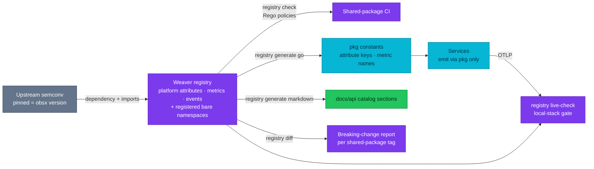

# ADR-076: Declare Platform Telemetry Names in a Registry and Keep Bare Namespaces as Registered Exceptions

> **Decision summary:** We will declare every platform-owned attribute, metric and
> event in an OpenTelemetry Weaver registry that depends on the upstream semantic
> conventions at the version the shared package pins, generate the shared package's
> constants and the `docs/api/` catalog sections from it, and check conformance in CI
> and against live OTLP. We will keep the platform's bare namespaces — `order.*`,
> `payment.*`, `checkout.*`, `inventory.*` and their peers — and register each as an
> explicit exception a Rego policy admits, rather than prefix them with `duynhlab.`.
> We accept that an upstream convention claiming one of those namespaces will force
> a rename later, in exchange for changing nothing that exists today and making any
> new bare namespace fail review.

| Attribute | Value |
|-----------|-------|
| **Status** | Accepted |
| **Decision date** | 2026-09-17 |
| **Owners** | `duynhne` |
| **Deciders** | `duynhne` |
| **Scope** | The source of truth for platform-owned telemetry names, how it is enforced, and the namespace rule for platform attributes |
| **Affected components** | `duynhlab/pkg` (registry YAML, generated constants, CI check); `duynhlab/gha-workflows`; `docs/api/` catalog sections (generated); local-stack end-to-end gate (`live-check`) |
| **Related RFC** | [RFC-0031](../../rfc/RFC-0031/) |
| **Related research** | [research.md](../../rfc/RFC-0031/research.md) |
| **Supersedes** | — |
| **Superseded by** | — |
| **Implementation tracking** | RFC-0031 delivery plan Task 4.5 |
| **Adoption** | Not started |

## Context

The shared-package rule fixes where telemetry is produced; it does not fix what the
names are. Today the platform's own attributes and metrics are defined in prose
across `docs/api/` and enforced by review. Two failures are already visible at ten
services. The names live in bare namespaces, and OpenTelemetry's naming guidance asks
application authors to prefix their attributes with a unique application or
reverse-domain name precisely because a future semantic-convention release can claim
a bare one — and no file in `docs/api/` states a namespace rule at all. And prose
drifts from code: the RFC-0031 audit found the shared-package contract describing a
library as unadopted while every service used it, and three files disagreeing on
how many trace sinks exist, because nothing generated those pages from a source of
truth.

The mechanism the wider industry converged on, and that OpenTelemetry ships as its
own tool, is a registry as code. Weaver takes a registry manifest that depends on
upstream semconv at a pinned version and imports the standard attributes it reuses,
checks the registry against Rego policies, generates markdown and Go from it, diffs
two versions for breaking changes, and compares live OTLP against the registry with
a non-zero exit on violation. The one question the tool does not answer is the
prefix. Two honest options were put to the owner: prefix everything with `duynhlab.`
and pay a one-time rename of every dashboard, alert and runbook, or keep the bare
namespaces and register each as an exception. The owner chose the second on
2026-09-17. This is also where the catalog rows the previous telemetry standard
(RFC-0017) left as backlog finally get a home; it is program-sized work, not a
quick win.

## Scope

### In scope

- The registry as the single source of platform-owned attribute, metric and event
  definitions, its upstream dependency and imports.
- Generation of shared-package constants and `docs/api/` catalog sections.
- CI enforcement (`registry check` with Rego), breaking-change detection
  (`registry diff`), and live conformance (`registry live-check`) as the definition
  of "instrumented".
- The namespace rule: registered bare namespaces admitted, any other bare namespace
  denied.

### Out of scope

- Which attributes and events exist — ADR-071 and the owning service contracts define
  them; this ADR defines where they are declared and how they are checked.
- Upstream semantic-convention keys — imported, never redefined.
- Renaming any existing platform attribute.

## Decision drivers

| Priority | Driver | Why it matters |
|---------:|--------|----------------|
| 1 | Names are the contract at scale | A query against `order.id` must mean the same thing on service one and service one thousand |
| 2 | Generated, not transcribed | Drift between prose and code is the audit's most repeated finding; only generation cures it |
| 3 | Executable naming rules | A prefix rule, a stability field, a unit on every metric — as policy, failing the pull request |
| 4 | Change nothing that works today | Every dashboard, alert and runbook that names a platform attribute keeps working |
| 5 | Growth is controlled | The exception list is closed; a new bare namespace is a reviewed change |

## Decision

We will create a Weaver registry in the shared-package repository declaring every
platform-owned attribute, metric and event, with a manifest that depends on the
upstream semantic conventions at the version `pkg/obsx` pins and imports the
standard attributes the platform reuses. `weaver registry check` with Rego policies
runs in the shared package's CI; the shared package's attribute keys and metric
names, and the catalog sections of `docs/api/`, are generated from the registry;
`registry diff` between tags reports breaking renames; `registry live-check` runs
against local-stack OTLP in the end-to-end gate and is the conformance check a new
service passes on day one.

The namespace rule is: the platform keeps its bare namespaces and the registry lists
each one explicitly as an exception; the Rego policy admits attributes whose first
segment is either an imported upstream namespace or a registered platform namespace,
and denies everything else. The exception list is `order`, `payment`, `checkout`,
`inventory`, `cart`, `user`, `product`, `review`, `shipping`, `notification`,
`temporal` and `platform` at creation; adding one is a registry pull request with an
owner. No `duynhlab.` prefix is introduced.

### Decision rules

| Rule | Required behavior |
|------|-------------------|
| **Single source** | A platform-owned name exists in the registry before it exists in code or docs; a name only in prose is a defect |
| **Upstream by import** | `http.*`, `rpc.*`, `db.*`, `messaging.*`, `error.*`, `exception.*`, `service.*`, `deployment.*`, `k8s.*` come from the pinned upstream dependency; the registry never redefines them |
| **Version lockstep** | The registry's upstream dependency version equals the semconv version `pkg/obsx` pins; a bump is one change to both |
| **Generation** | Shared-package constants and `docs/api/` catalog sections are generated; a hand edit to a generated section fails CI |
| **Namespace policy** | Rego admits the imported upstream namespaces and the registered platform namespaces; any other first segment is denied |
| **Closed exception list** | Adding a bare namespace is a registry pull request naming an owner; none is added at a call site |
| **Every metric has a unit and stability** | Rego denies a metric without UCUM unit or a definition without a stability field |
| **Breaking changes are diffs** | A rename or removal is reported by `registry diff` and treated as a breaking shared-package release under ADR-072 |
| **Conformance** | `live-check --fail-on violation` against local-stack OTLP is the definition of an instrumented service |

### Decision view

## Alternatives considered

| Option | Benefits | Costs / risks | Result |
|--------|----------|---------------|--------|
| **A — Weaver registry; keep bare namespaces as registered exceptions** | Nothing existing changes; policy still denies new bare namespaces; generation cures drift | A future upstream `order.*`/`payment.*` convention forces a rename at a worse time; the exception list must be maintained | Selected — owner decision 2026-09-17 |
| **B — Weaver registry; prefix every platform name with `duynhlab.`** | Zero future collision risk; the rule is mechanical | Every dashboard, alert, runbook and saved query naming a platform attribute changes once; names get longer | Rejected — owner decision 2026-09-17 |
| **C — Keep prose catalogs in `docs/api/`, enforce by review** | No tooling | The as-built state; drift already demonstrated by the audit | Rejected |
| **D — Hand-written Go constants as the source, docs by hand** | No new tool | Constants and docs still diverge; no live conformance; no breaking-change detection | Rejected |

### Why the selected option won

It delivers everything the registry is for — generation, policy, diff, live
conformance — while changing no name the platform has already built dashboards,
alerts and runbooks around, and it closes the door on new bare namespaces so the
exception list cannot grow silently.

### Why the closest alternative lost

The `duynhlab.` prefix buys immunity from a collision that has not happened, at the
price of a fleet-wide rename that would happen for certain. The owner judged the
certain cost higher than the contingent one; if the contingency arrives, the rename
is done then, with the registry's diff and generation making it a mechanical release
rather than a hunt through prose.

## Consequences

### Positive consequences

- One source of truth for platform names; constants and docs cannot drift from it.
- Naming rules, units and stability are enforced by CI, not by reviewer memory.
- A new service has a day-one conformance check with a non-zero exit code.
- RFC-0017's catalog backlog has a home.

### Negative consequences and accepted trade-offs

- An upstream semantic-convention release claiming a registered bare namespace forces
  a platform rename at that time; the registry makes it mechanical but not free.
- Weaver becomes a build-time dependency of the shared package's CI and the
  end-to-end gate.
- Generated `docs/api/` sections cannot be hand-edited; prose around them can.

### Neutral consequences

- Upstream keys are imported at the version the shared package already pins; no new
  version to track.
- The registry is program-sized work scheduled at the end of the RFC-0031 delivery
  plan, after the fleet is on one shared-package version.

## Implementation obligations

| Obligation | Owner | Tracking | Completion signal |
|------------|-------|----------|-------------------|
| Create the registry with the upstream dependency, imports and the registered namespace list | `duynhlab/pkg` | RFC-0031 Task 4.5 | `weaver registry check` green; manifest version equals the `obsx` semconv pin |
| Write the Rego policies: namespace admission, unit and stability required | `duynhlab/pkg` | RFC-0031 Task 4.5 | A planted `foo.bar` attribute and a unitless metric fail `registry check` in a branch |
| Generate shared-package constants and `docs/api/` catalog sections; add a CI drift check | `duynhlab/pkg`, Platform docs | RFC-0031 Task 4.5 | Generated output committed; a hand edit fails CI |
| Run `registry diff` per shared-package tag; wire the result into release notes | `duynhlab/pkg` | RFC-0031 Task 4.5 | A planted rename between two tags is reported |
| Add `registry live-check` to the local-stack end-to-end gate | Platform, `local-stack` | RFC-0031 Task 4.5 | Green against the compose gate; a planted violation exits non-zero |

## Validation and compliance

| Requirement | Verification |
|-------------|--------------|
| Single source | Grep of the shared package finds no platform attribute key outside generated files |
| Namespace policy | Registry check denies an unregistered bare namespace and admits a registered one |
| Version lockstep | CI asserts the manifest's upstream version equals `obsx`'s semconv pin |
| Generation | Regenerating in CI produces no diff against the committed constants and docs |
| Breaking changes | `registry diff` between two tags reports a planted rename |
| Live conformance | `live-check` green against compose; a service emitting an unregistered attribute fails |

## Revisit triggers

Re-open this decision when one or more of the following become true:

- An upstream semantic-convention release claims a namespace on the registered list.
- The registered exception list grows past the domain set named here for reasons
  other than a new domain service.
- Weaver's registry format, policy engine or live-check changes in a way the
  generation cannot follow.
- A second language joins the fleet and needs generated constants of its own.

A changed decision requires a new ADR that supersedes this one.

## References

- [RFC-0031](../../rfc/RFC-0031/) — § Semantic-convention registry, § Fleet scale, § Decision outcome
- [RFC-0031 research](../../rfc/RFC-0031/research.md)
- [RFC-0031 delivery plan — Task 4.5](../../rfc/RFC-0031/delivery-plan.md)
- [RFC-0017](../../rfc/RFC-0017/) — the earlier telemetry standard whose catalog rows this registry absorbs
- [ADR-071 — Canonical event, access and privacy data contract](../ADR-071-telemetry-event-data-contract/)
- [ADR-072 — Fleet cutover with no migration mechanism](../ADR-072-telemetry-clean-cutover/)
- [Shared package contract (as-built)](../../../api/pkg.md)
- [Observability contract (as-built)](../../../api/observability.md)

## History

| Date | Status / adoption | Change |
|------|-------------------|--------|
| 2026-09-17 | Proposed / Not started | Drafted during RFC-0031 architecture review from § Semantic-convention registry, with both prefix options costed |
| 2026-09-17 | Accepted / Not started | Owner chose bare namespaces as registered exceptions over a `duynhlab.` prefix; created at `Accepted` per the RFC-0028/RFC-0030 precedent |
| 2026-09-23 | Accepted / Not started | `outcome` is the first platform attribute the registry must carry: `obsx` v0.43.0 emits it on spans for business rejections (ADR-075), so it is named here before the registry exists rather than discovered by the conformance check afterwards |

---
_Last updated: 2026-09-23 — `outcome` named as a registry entry ahead of Task 4.5. Previously 2026-09-17._
