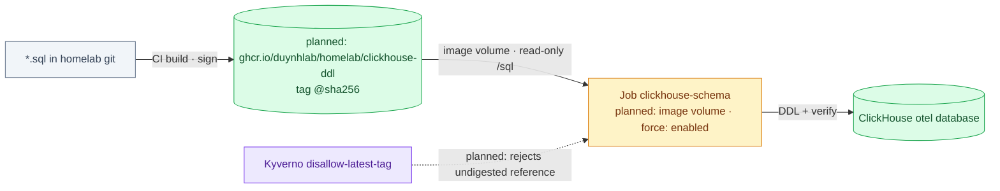

# ADR-077: Deliver Bootstrap DDL as Digest-Pinned OCI Image Volumes

> **Decision summary:** We will ship the ClickHouse schema Job's DDL as a
> digest-pinned OCI image mounted through a Kubernetes image volume, instead of
> a ConfigMap. The schema then has a version identity, and a DDL change becomes
> a pod-template change that re-runs the Job with no manual delete. We accept a
> build-and-publish step and a registry dependency at pod start, in exchange
> for a versioned payload, a re-run the GitOps loop performs itself, and the
> payload kept out of the Flux artifact.

| Attribute | Value |
|-----------|-------|
| **Status** | Accepted |
| **Decision date** | 2026-09-29 |
| **Owners** | `duynhne` |
| **Deciders** | `duynhne` |
| **Scope** | How bootstrap SQL/DDL payloads reach a run-once Job, starting with the ClickHouse schema Job; not the schema itself, not the Job's verification logic |
| **Affected components** | `monitoring` Job `clickhouse-schema` (its former ConfigMap is removed), the `clickhouse-schema-local` wave, the Kyverno policy `disallow-latest-tag`, homelab CI (a new image publish) |
| **Related RFC** | [RFC-0032](../../rfc/RFC-0032/) (Phase 2) |
| **Related research** | [research.md](../../rfc/RFC-0032/research.md) |
| **Supersedes** | — |
| **Superseded by** | — |
| **Implementation tracking** | RFC-0032 Phase 2, one homelab PR, after the Phase 1 cluster is on 1.35.8 |
| **Adoption** | **Complete**: Kind gate 2026-09-29 on 1.35.8. The Job mounts the image and lists the 5 files; schema complete on 3 replicas; a DDL bump re-created the Job with no manual step; an undigested image volume reported `fail`. Publishing to GHCR happens on merge |

## Context

[ADR-065](../ADR-065-clickhouse-replicated-topology/) moved ownership of the
ClickHouse schema from the collector to the bootstrap Job `clickhouse-schema` in
`monitoring`. The DDL is stored as five `.sql` keys in the ConfigMap
`clickhouse-schema` and mounted read-only at `/sql`.

That shape has three costs, all visible today:

- **A DDL edit does not re-run the Job.** The ConfigMap is referenced by name,
  so the pod template stays the same when the SQL changes. Flux sees nothing to
  replace. The manifest's own header therefore documents the manual procedure:
  `kubectl delete job clickhouse-schema -n monitoring`, then reconcile.
- **The schema has no version identity.** Nothing on the cluster records which
  DDL revision ran.
- **The payload rides inside the GitOps artifact.** It is bundled with the
  manifests rather than published as a separate, addressable object.

Image volumes are beta and enabled by default from Kubernetes 1.35 and stable in
1.36. RFC-0032 Phase 1 moves the Kind baseline to 1.35.8; its
[amendment](../../rfc/RFC-0032/#amendment-2026-09-29--bridge-to-1358) records
why not 1.36 yet. `ImageVolume` was measured enabled there on both the API
server and the kubelet. A pod can now mount the contents of an OCI image
read-only, pinned by digest.

## Scope

### In scope

- The delivery mechanism for the ClickHouse schema Job's DDL.
- The image's shape, name, pinning and signing.
- How a DDL change re-runs the immutable Job.
- The admission rule that keeps image-volume references pinned.

### Out of scope

- Other payload candidates. RFC-0032 records a verdict for each: the Keycloak
  realm, the OpenBAO bootstrap script, CNPG extensions, monitoring queries,
  dashboards and service migrations. Adopting any of them needs its own record.
- User namespaces (`hostUsers: false`) and the disabled `pss-restricted-apps`
  policy.
- The ClickHouse schema content and the Job's wait/verify logic. Both stay
  owned by ADR-065.

## Decision drivers

| Priority | Driver | Why it matters |
|---------:|--------|----------------|
| 1 | GitOps completeness | A schema change must reach the cluster through the reconcile loop, not a documented `kubectl delete` |
| 2 | Version identity | An operator must be able to tell which DDL revision a Job ran, from the cluster alone |
| 3 | Fail loudly | The known image-volume failure modes are silent (an artifact mounts empty); the design must make them visible |
| 4 | Reversibility | A failed gate must fall back to a ConfigMap without touching the schema or the Job logic |

## Decision

We will build the five `.sql` files into a **standard OCI image**
(`FROM scratch`, the files copied under `/sql`) and publish it to
`ghcr.io/duynhlab/homelab/clickhouse-ddl`. Source and build live in homelab
under `images/clickhouse-ddl/` (`Dockerfile` + `sql/`), outside `kubernetes/`,
so the payload leaves the artifact `make flux-push` publishes. A homelab CI
workflow publishes it, signed and attested the same way `duynhlab/wolfi-images`
signs its images; a manual build into `homelab-registry` is for development
only and never the published image. The
Job mounts the image as a volume, referenced by tag **and** digest with
`pullPolicy: IfNotPresent`.

Bumping the DDL means publishing a new image and bumping the digest in the
Job, which changes the Job's pod template. Because `spec.template` of a Job is
immutable, the Job carries `kustomize.toolkit.fluxcd.io/force: enabled`, so
Flux deletes and re-creates it on that change. The container, its verification
logic and the `wait: true` wave are unchanged.

`disallow-latest-tag` is extended to cover `spec.volumes[].image.reference` and
to require a `@sha256:` digest there.

### Decision rules

| Rule | Required behavior |
|------|-------------------|
| **Ownership** | The `.sql` files in git stay the source of truth. The image is a build output of those files and never edited by hand |
| **Image shape** | A standard OCI image with ordinary layer media types. An `oras`-style artifact with a custom media type is forbidden: containerd mounts it **empty**, with no error |
| **Pinning** | Every image-volume reference carries a digest, enforced at admission. A tag alone is rejected |
| **Re-run** | A DDL change reaches the cluster only as a new digest in the Job's pod template. `force` is scoped to this Job, and to no other object in the wave. It acts only when an apply fails on an immutable field: an unchanged digest is a no-op (measured 2026-09-28, three `--with-source` reconciles kept `rustfs-setup-buckets-init`'s UID) |
| **Not `flux push`** | `flux push artifact` writes Flux's own media type, which only source-controller reads; containerd mounts it empty. Build with `docker buildx` (or `crane`) |
| **Isolation** | Never combine an image volume with `hostUsers: false`: containerd cannot idmap the overlay mount, and the pod fails to start |
| **Failure behavior** | The Job asserts that `/sql` holds the expected files before running any statement. An empty mount fails the Job; it never runs "no DDL" as success |
| **Mount** | The volume mounts the image **root**, so the Job mounts it with `subPath: sql`. Without it the files appear at `/sql/sql/`, and the Job's file check fails (measured on the first run) |
| **Reproducibility** | `make ddl-digest` and the workflow share one build: BuildKit pinned by digest, `SOURCE_DATE_EPOCH=0`, `rewrite-timestamp=true`, no in-image provenance or SBOM, and `COPY --chmod=u=rwX,go=rX`. Without the chmod, the local umask (0664 vs 0644) changed the digest; an octal 0644 made `/sql` untraversable |
| **Local testing** | `make ddl-load` imports the archive into every Kind node **and** adds the `repo@digest` name. The kubelet resolves `tag@digest` by that name, so without it `IfNotPresent` still pulls |
| **Build tool** | `FROM scratch`, not apko. apko assembles images from APK packages, so shipping five local files through it would need a melange package for every schema revision. The signing and attestation path is still the one `wolfi-images` uses |

### Decision view

**Planned — ADR-077, not installed.** The target shape; today the Job still
mounts the ConfigMap.

## Alternatives considered

| Option | Benefits | Costs / risks | Result |
|--------|----------|---------------|--------|
| **A — Image volume, `FROM scratch`, digest-pinned** | Versioned payload; a DDL change re-runs the Job through the reconcile loop; payload outside the Flux artifact | A build step; a registry dependency at pod start; `force` on one Job | Selected |
| **B — `configMapGenerator` with a hash suffix** | No build, no registry; the name change alters the pod template, so the Job re-runs | A new ConfigMap name on every edit; the hash is not a portable version; the payload stays inside the Flux artifact | Rejected — kept as the **fallback** if the Phase 2 gate fails |
| **C — OCI artifact (`oras`) with a custom media type** | Smallest payload, no image semantics | containerd mounts it empty, silently | Rejected |
| **D — Keep the ConfigMap and the manual delete** | Nothing to build | Keeps all three costs in Context | Rejected |

### Why the selected option won

It is the only option that satisfies both driver 1 and driver 2. The digest in
the pod template is the version identity, and that same digest change is what
makes Flux re-create the Job. Driver 3 is satisfied by the file-count
assertion. Driver 4 is satisfied because the fallback (B) touches only the
volume source.

### Why the closest alternative lost

The `configMapGenerator` suffix also re-runs the Job, and it costs nothing to
build. It loses on identity: the suffix is a hash of the data, it exists only
inside this cluster's objects, and it cannot be pulled, signed or compared
anywhere else. It also keeps the payload inside the GitOps artifact. It stays
as the fallback because it keeps the one property that matters most.

## Consequences

### Positive consequences

- A DDL change is a normal GitOps change: bump the digest, and the Job
  re-creates itself and runs.
- The running Job's pod names the exact schema revision, by digest.
- The procedure `kubectl delete job` disappears from the manifest header.

### Negative consequences and accepted trade-offs

- **Registry dependency at pod start.** The payload's availability moves from
  etcd to GHCR. A pull failure blocks the container and is retried with volume
  backoff.
- **A new build-and-publish step** for what used to be five keys in a YAML
  file.
- **Credentials.** The kubelet pulls with node credentials and the pod's pull
  secrets; there is no volume-level `imagePullSecrets`. The package must be
  public, or reachable from `homelab-registry`.
- **One scoped `force: enabled`**, which the repo otherwise avoids on bootstrap
  Jobs.

### Neutral consequences

- The repo gains its first image published from homelab itself, under
  `ghcr.io/duynhlab/homelab/`.

## Implementation obligations

| Obligation | Owner | Tracking | Completion signal |
|------------|-------|----------|-------------------|
| `images/clickhouse-ddl/` (Dockerfile + `sql/`, moved out of the ConfigMap) | `duynhne` | RFC-0032 Phase 2 PR | The five files exist only there |
| Image build + sign + attest in homelab CI, required before merge | `duynhne` | RFC-0032 Phase 2 PR | A digest on GHCR with a verifiable signature |
| Job volume swapped to `image:`, the ConfigMap removed, the header rewritten, `force: enabled` on the Job | `duynhne` | RFC-0032 Phase 2 PR | `make validate` green; Flux applies it |
| File-count assertion in the Job script | `duynhne` | RFC-0032 Phase 2 PR | An empty mount fails the Job |
| `disallow-latest-tag` covers `spec.volumes[].image.reference` and requires a digest | `duynhne` | RFC-0032 Phase 2 PR | A CLI test fixture passes one pinned volume and rejects one undigested volume |
| Docs: policy catalog, ClickHouse schema docs, CHANGELOG | `duynhne` | RFC-0032 Phase 2 PR | No doc still describes the ConfigMap as current |

## Validation and compliance

| Requirement | Verification |
|-------------|--------------|
| The volume mounts a real image, non-empty | The Job's log lists the five files under `/sql`; the Job fails otherwise |
| The Job completes on a fresh store | Kind gate on a new cluster on the Phase 1 baseline: Job `Complete`, replicas verified per ADR-065 |
| A DDL bump re-runs the Job with no manual step | Change the digest, reconcile, and observe a new Job UID and a completed run |
| References are pinned | `kyverno test` fixture, plus admission rejecting an undigested image volume on the cluster |
| No `hostUsers: false` beside an image volume | Review rule; no manifest in the repo sets it |

## Revisit triggers

Re-open this decision when one or more of the following become true:

- A second payload (for example CNPG declarative extensions on PostgreSQL 18)
  wants the same mechanism, and the build step should become shared.
- containerd fixes image volumes under user namespaces, and `hostUsers: false`
  is wanted for this Job.
- Pulling from GHCR at pod start causes a failed bring-up that a ConfigMap
  would have avoided.
- Kubernetes changes image-volume semantics (read-only, `subPath`, pull
  behaviour).

A review does not automatically reverse the decision. A changed decision
requires a new ADR that supersedes this one.

## References

- [RFC-0032](../../rfc/RFC-0032/)
- [RFC-0032 research](../../rfc/RFC-0032/research.md)
- [ADR-065](../ADR-065-clickhouse-replicated-topology/): schema ownership by the bootstrap Job
- [Kubernetes — use an image volume with a Pod](https://kubernetes.io/docs/tasks/configure-pod-container/image-volumes)

## History

| Date | Status / adoption | Change |
|------|-------------------|--------|
| 2026-09-28 | Proposed / Not started | Created when RFC-0032 moved to `Accepted`. The build tool narrowed to `FROM scratch` (apko needs a package per file set), and the Job-immutability mechanism named explicitly (`force: enabled` on this Job) |
| 2026-09-29 | Accepted / Complete | Implemented and gated on Kind 1.35.8 (see Adoption). Owner chose one PR per schema change with a reproducible build, checked by CI. Mount, reproducibility and local-testing rules added from what the gate measured |
| 2026-09-28 | Proposed / Not started | Owner choices: build in homelab under `images/clickhouse-ddl/`; re-run by `force` plus a digest bump; CI publish required before merge; `flux push` ruled out |

---
_Last updated: 2026-09-29 — Accepted, Adoption Complete_
