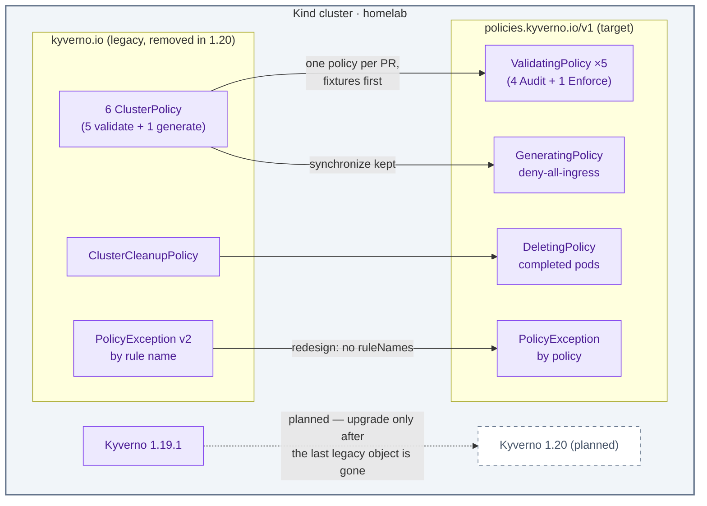

# ADR-078: Migrate Kyverno Policies to the CEL Policy Types

> **Decision summary:** We will move every Kyverno policy and exception in this
> repo from the legacy `kyverno.io` types to the CEL-based `policies.kyverno.io/v1`
> types (`ValidatingPolicy`, `GeneratingPolicy`, `DeletingPolicy`,
> `PolicyException`) before the platform takes Kyverno 1.20, because 1.20
> removes the legacy APIs and every admission rule here would stop loading. We
> accept rewriting JMESPath patterns as CEL and redesigning exceptions that
> currently name rules, in exchange for staying on a supported engine and on
> the policy model Kyverno now develops.

| Attribute | Value |
|-----------|-------|
| **Status** | Accepted |
| **Decision date** | 2026-09-30 |
| **Owners** | `duynhne` |
| **Deciders** | `duynhne` |
| **Scope** | The policy objects under `kubernetes/infra/configs/kyverno/` (cluster policies, the cleanup policy, the exceptions) and their CLI fixtures; not the Kyverno controllers' deployment, not which rules the platform enforces |
| **Affected components** | `kyverno-policies-local` wave, 6 deployed `ClusterPolicy` objects, 1 `ClusterCleanupPolicy`, 2 `PolicyException` objects, `kubernetes/infra/configs/kyverno/tests/`, `scripts/flux-validate.sh`, Policy Reporter, `docs/platform/kyverno.md`, `docs/security/policy-*.md` |
| **Related RFC** | — (standalone; set aside as "its own record" by [RFC-0032](../../rfc/RFC-0032/)) |
| **Related research** | [RFC-0032 research.md](../../rfc/RFC-0032/research.md) (Kyverno 1.19 / legacy API section) |
| **Supersedes** | — |
| **Superseded by** | — |
| **Implementation tracking** | One homelab PR per policy family, after this record is Accepted |
| **Adoption** | Partial — steps 1–2 of 4 (`require-probes`, `require-resources`, `disallow-latest-tag`, `disallow-default-namespace`) |

## Context

Kyverno 1.19 (running here since 2026-09-28, chart 3.9.1, engine v1.19.1)
deprecates `ClusterPolicy`, `Policy`, `CleanupPolicy` and the legacy
`kyverno.io` `PolicyException`. The Kyverno migration guide states they "will be
**removed in v1.20**". The upstream milestone *Kyverno Release 1.20.0* is due on
**2026-10-23** (read 2026-09-30). The CLI already prints a deprecation warning
on every `make validate`.

Everything this repo enforces is a legacy type:

| Object | Type | What it does |
|---|---|---|
| `pss-baseline` | `ClusterPolicy` (validate, `podSecurity`) | PSS baseline, Audit |
| `disallow-latest-tag` | `ClusterPolicy` (3 validate patterns) | tags present, no `:latest`, image volumes digest-pinned (ADR-077), Audit |
| `require-resources` | `ClusterPolicy` (`foreach` pattern) | requests/limits on app containers, Audit |
| `require-probes` | `ClusterPolicy` (`foreach` pattern, JMESPath precondition) | liveness and readiness probes, Audit |
| `disallow-default-namespace` | `ClusterPolicy` (pattern) | the only **Enforce** rule |
| `default-deny-networkpolicy` | `ClusterPolicy` (generate, `synchronize: true`) | `deny-all-ingress` in every app-tier namespace |
| `cleanup-completed-pods` | `ClusterCleanupPolicy` | deletes finished pods older than 24h |
| `openbao`, `postgres-operators` | `PolicyException` (`kyverno.io/v2`) | waive PSS baseline and resources, by rule name including `autogen-*` |

The chart is pinned exactly (`version: "3.9.1"`), so nothing upgrades by itself.
But a Renovate PR for chart 3.10 / engine 1.20 will arrive, and merging it
before the policies move would unload every admission rule at once. The
generated `deny-all-ingress` NetworkPolicies are `synchronize: true`, so losing
their generator is not a silent no-op.

The cluster already serves `policies.kyverno.io/v1` (checked on Kind 2026-09-29:
`ValidatingPolicy`, `GeneratingPolicy`, `DeletingPolicy`, `PolicyException`, and
their namespaced variants).

## Scope

### In scope

- Rewriting the 6 deployed cluster policies, the cleanup policy and the 2
  exceptions as `policies.kyverno.io/v1` objects.
- Porting the 4 CLI fixture suites, and adding fixtures where a policy has none
  (`pss-baseline`, `default-deny-networkpolicy`, the cleanup policy).
- Keeping the `Excluded`-result guard in `scripts/flux-validate.sh`, or its
  equivalent for the new result shape.
- Docs: `docs/platform/kyverno.md`, `docs/security/policy-catalog.md`,
  `docs/security/policy-exceptions.md`, and `AGENTS.md`'s admission-rules
  section.

### Out of scope

- Changing what is enforced: which namespaces, which rules, Audit versus
  Enforce. Each policy moves with its current behaviour.
- Kubernetes-native `ValidatingAdmissionPolicy` or `MutatingAdmissionPolicy`
  written directly. Kyverno's CEL types compile to these where they can.
- Re-enabling `pss-restricted-apps` (its own conditions stand).
- Upgrading Kyverno to 1.20 itself. That follows this migration as a normal
  dependency PR.

## Decision drivers

- **A hard removal date.** 1.20 is weeks away, and staying on 1.19 forever means
  losing security fixes.
- **Equivalence.** Every rule must keep its verdicts, proven by fixtures before
  and after, not by reading the YAML.
- **One step at a time.** Admission is a shared chokepoint, so migrating
  everything in one apply makes any regression impossible to attribute.
- **Honest reports.** Policy Reporter and the K3 audit rows must still see pass
  and fail. The `require-probes` global-anchor bug (2026-09-29) showed how a
  policy can report nothing and look healthy.

## Decision

Migrate policy by policy to `policies.kyverno.io/v1`, in Audit, with fixtures
ported first. Remove each legacy object in the same PR that adds its
replacement, so no rule is evaluated twice.

### Decision rules

1. **Order:**
   1. `require-probes` and `require-resources` (the simplest `foreach`
      patterns);
   2. `disallow-latest-tag`;
   3. `pss-baseline`;
   4. `disallow-default-namespace` (Enforce last, once the pattern is proven);
   5. `default-deny-networkpolicy` → `GeneratingPolicy`;
   6. `cleanup-completed-pods` → `DeletingPolicy`.

   Exceptions move with the policy they waive.
2. **Validation rules** become `ValidatingPolicy` with CEL `validations`. The
   `foreach`-over-containers patterns become `.all()` comprehensions over all
   container lists. The `require-probes` Job-owner precondition becomes a
   `matchConditions` entry.
3. **Exceptions** become `policies.kyverno.io` `PolicyException` objects that
   reference **policies**, not rule names. The new type has no `ruleNames`
   ("CEL policies do not contain named rules"), so one exception that waived
   two rules of one policy may become two exceptions, or a narrower policy
   split. They stay in namespace `kyverno` with the `owner` / `expires-at`
   annotations.
4. **Autogen is explicit.** A `ValidatingPolicy` autogens controller variants
   by default (measured in step 1: Deployment and ReplicaSet results appeared
   next to the Pod ones). Each policy states its choice: `autogen.podControllers.controllers: []`
   where the legacy policy had autogen off (`require-probes`, whose owner-reference
   condition autogen rewrites into a meaningless pod-template path), and the
   default where the legacy policy had it on (`require-resources`).
5. **Generate:** the `GeneratingPolicy` must reproduce `synchronize: true` and
   generate-existing, verified by deleting a generated `deny-all-ingress` and
   watching it return.
6. **Enforce stays single.** Only `disallow-default-namespace` denies, as today.
7. **Kyverno 1.20 is held** until the last legacy object is gone. Renovate's
   Kyverno PRs stay open with a hold comment pointing here.

### Decision view

## Alternatives considered

| Option | Summary | Verdict |
|---|---|---|
| **A — Kyverno CEL types, policy by policy** | This record | **Selected** |
| B — Stay on legacy, pin Kyverno at 1.19 | No work now | Rejected: the engine stops receiving fixes and the legacy APIs are gone in 1.20; it only defers the same work under more pressure |
| C — Native `ValidatingAdmissionPolicy` directly | Drop Kyverno for validation | Rejected: no generate or cleanup equivalent, no PolicyReports, no CLI fixtures; we would run two policy systems |
| D — Migrate everything in one PR | Faster | Rejected: a regression in admission could not be attributed, and Enforce would move together with Audit rules |

### Why the selected option won

It is the migration path Kyverno itself documents, it keeps the reports and CLI
fixtures that already caught two bugs here, and doing it one policy at a time
keeps every step reversible.

### Why the closest alternative lost

B looks free but is not. The removal is announced, and holding the engine back
turns a planned migration into an emergency the first time a Kyverno security
fix ships only on 1.20 or later.

## Consequences

### Positive consequences

- The platform stays upgradeable and on the policy model Kyverno develops.
- CEL makes preconditions and container walks explicit. The global-anchor trap
  that silently skipped every compliant pod in `require-probes` has no CEL
  equivalent.
- Fixtures for the three untested policies get written as part of the move.

### Negative consequences and accepted trade-offs

- Every pattern and JMESPath expression is rewritten, which is real review
  effort.
- Exceptions lose rule-level granularity; some may split.
- Autogen conveniences disappear, so matched kinds must be listed explicitly.
- For a period the repo mixes legacy and CEL objects. That is acceptable
  because 1.19 serves both.

### Neutral consequences

- Policy Reporter reads PolicyReports from both kinds; its UI groups by policy
  name, which does not change.

## Implementation obligations

- Each PR:
  - ports the fixtures first and shows them passing against the **legacy**
    policy (baseline), then the same fixtures against the new one;
  - deletes the legacy object;
  - updates `policy-catalog.md`.
- A Kind check per PR: `kubectl get policyreport -A` counts per result match the
  pre-migration counts for that policy.
- The generate PR shows a deleted `deny-all-ingress` being regenerated.
- The exceptions PR updates `docs/security/policy-exceptions.md` and keeps
  expiry dates.
- A hold comment on any Kyverno 1.20 Renovate PR, linking this ADR.

## Validation and compliance

- `make validate` runs the CLI fixtures and fails on any `Excluded` result.
- Kind audit rows K3.x (admission and policies) pass after each step, with no new
  `fail` or `error` results.
- Done when `grep -r "kind: ClusterPolicy\|kind: ClusterCleanupPolicy\|kyverno.io/v2" kubernetes/`
  returns nothing, and a Kyverno 1.20 upgrade loads every policy.

## Revisit triggers

- Kyverno postpones the removal beyond 1.20. The migration stays desirable but
  loses its deadline.
- A CEL type cannot express a rule we enforce. Document it, and consider a
  scoped exception or a native VAP for that rule only.
- Kyverno changes the `policies.kyverno.io` API version again before we finish.

## References

- Kyverno documentation: migration to CEL policies (`docs/guides/migration-to-cel`).
- Kyverno project milestone "Kyverno Release 1.20.0".
- [docs/platform/kyverno.md](../../../platform/kyverno.md), [policy catalog](../../../security/policy-catalog.md), [policy exceptions](../../../security/policy-exceptions.md).

## History

| Date | Status / adoption | Change |
|---|---|---|
| 2026-09-30 | Proposed / Not started | Created. Removal version (1.20) read from the Kyverno migration guide, due date 2026-10-23 from the upstream milestone. |
| 2026-09-30 | Accepted / Partial | Owner accepted it and chose 4 PRs. Step 1 landed: `require-probes` and `require-resources` are ValidatingPolicy. Pod-level verdicts equal the legacy ones on Kind (19/19 pass each, 0 fail). Autogen proved to default on, so rule 4 now says so. The `require-resources` half of `postgres-operators` was inert and was dropped rather than migrated. |
| 2026-09-30 | Accepted / Partial | Step 2 landed: `disallow-latest-tag` (three validations, autogen on as before) and `disallow-default-namespace` (the only `Deny`, `failurePolicy: Fail`, autogen off). Server dry-run: denied in `default`, even for a manifest without `metadata.namespace`; allowed in `product`. Pod-level verdicts equal the legacy ones (90/90, 119/119 pass). Reports are now one result per resource instead of per rule. |

---

_Last updated: 2026-09-30 — step 2 landed (disallow-latest-tag, disallow-default-namespace). Earlier: 2026-09-30 — Accepted; step 1 landed (require-probes, require-resources); autogen defaults on, rule 4 corrected. Earlier: 2026-09-30 — created (Proposed)._
