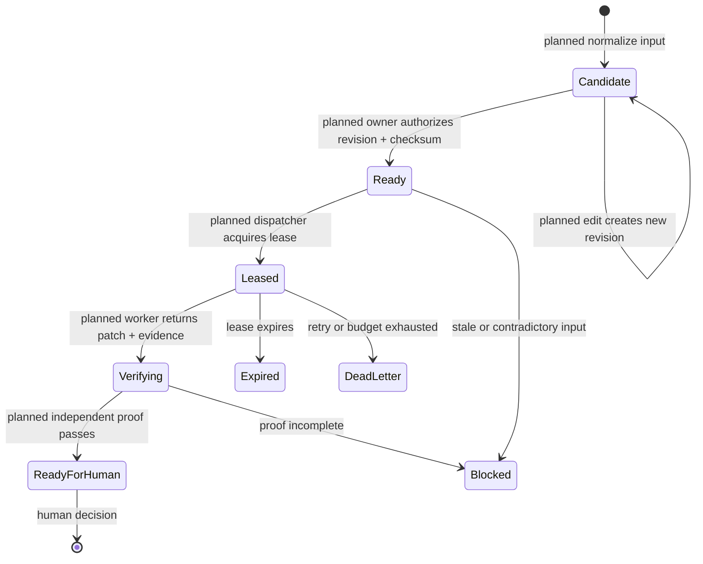

# ADR-079: Version Agent Task Contracts in the GitHub Ledger

> **Decision summary:** We will make immutable, schema-versioned task revisions
> and their proof records the authority for delegated agent work, with GitHub as
> the durable ledger. We accept a normalization and authorization step in
> exchange for work that can be reconstructed without chat history.

| Attribute | Value |
|-----------|-------|
| **Status** | Accepted |
| **Decision date** | 2026-10-01 |
| **Owners** | `duynhne` |
| **Deciders** | `duynhne` |
| **Scope** | Durable task, authorization, lease, evidence, and outcome records for RFC-0033 |
| **Affected components** | Planned agent task schema, GitHub issues/PRs/checks, coordinator, dispatcher, workers, verifier |
| **Related RFC** | [RFC-0033](../../rfc/RFC-0033/) |
| **Related research** | [research.md](../../rfc/RFC-0033/research.md) |
| **Supersedes** | — |
| **Superseded by** | — |
| **Implementation tracking** | RFC-0033 Phase 0 |
| **Adoption** | Not started |

## Context

Homelab work already uses issues, branches, pull requests, CI, RFCs, ADRs, and
repository instructions. Agent sessions add temporary task lists and chat
context, but those disappear, can be resumed with stale assumptions, and do not
bind a change to an approved base revision or proof contract.

The control loop needs durable state that a fresh session, verifier, and human
reviewer can reconstruct. It must also distinguish a syntactically valid task
from work the owner has authorized.

## Scope

### In scope

- The authoritative records and lifecycle for one delegated task revision.
- How issue-form input becomes normalized and authorized work.
- Universal evidence and repository-rule discovery requirements.

### Out of scope

- GitHub credentials and publishing authority, owned by [ADR-080](../ADR-080-tokenless-agent-workers/).
- Lease scheduling and recovery, owned by [ADR-081](../ADR-081-agent-leases-and-reconciliation/).
- The Phase 0 JSON Schema files, parser, storage representation, and workflow implementation.

## Decision drivers

| Priority | Driver | Why it matters |
|---------:|--------|----------------|
| 1 | Reconstructability | A fresh process must understand the approved work without hidden chat state |
| 2 | Authorization integrity | Editing an issue must not silently expand active work |
| 3 | Reproducible proof | Reviewers need evidence tied to an immutable task and source revision |
| 4 | Tool neutrality | The ledger must survive a change of model or execution runtime |

## Decision

GitHub will be the durable work ledger. Homelab will own a versioned JSON
Schema for a normalized task payload. Issue forms are untrusted human input,
not the machine contract: a trusted normalizer must parse a qualified template
version and publish a candidate task revision with a SHA-256 checksum.

An allowlisted human owner must create a separate authorization record binding
their identity to the exact task ID, revision, payload checksum, immutable base
SHA, and approval timestamp. Re-normalizing edited input creates a new revision;
it never changes an authorized revision in place.

The contract family contains five records:

| Record | Minimum semantic content |
|--------|--------------------------|
| **Task revision** | Schema version, task ID and revision, goal, repository, allowed and forbidden paths, base SHA, inputs, acceptance proof, risk, forbidden actions, retry/turn/time/cost budgets, escalation conditions, expected outputs, and input-template version/checksum |
| **Authorization** | Task ID and revision, payload checksum, base SHA, authorizing owner, and approval timestamp |
| **Lease** | Authorized revision/checksum, holder and run ID, base SHA, acquisition, expiry, and renewal timestamps |
| **Evidence** | Check ID, declared command or repository gate reference, result, artifact or commit SHA, producer, verifier, and observation time |
| **Outcome** | Final state, reason/failure class, evidence references, residual risk, retry count, cost, and human-intervention record |

Every task carries four universal gates: schema validity, immutable-base
freshness with clean worker state, complete reproducible evidence, and the
repository-specific gates discovered from the target repository's `AGENTS.md`.
The task stores a reference to those rules rather than copying them. A missing,
ambiguous, or contradictory rule blocks the task.

### Decision rules

| Rule | Required behavior |
|------|-------------------|
| **Authority** | Only a separately authorized, immutable task revision may be leased |
| **Mutation** | A changed input produces a new revision and requires new authorization |
| **Issue forms** | Rendered issue Markdown is untrusted and must match a pinned template fixture before normalization |
| **Evidence binding** | Evidence names the task revision, base SHA, check, producer, and observed artifact |
| **Repository truth** | `AGENTS.md`, contracts, RFC/ADR state, current code/manifests, and deterministic gates outrank chat or memory |
| **Failure behavior** | Unknown fields, structural drift, stale bases, and contradictory sources fail closed |
| **Compatibility** | Breaking contract changes require a new schema version; old records remain readable and immutable |

### Decision view

This diagram answers one question: how does a **planned** human request become
authorized, leased work without mutable issue text becoming authority?

## Alternatives considered

| Option | Benefits | Costs / risks | Result |
|--------|----------|---------------|--------|
| **A — Versioned records in GitHub** | Durable, reviewable, tied to commits and CI, tool-neutral | Needs normalization and concurrency controls | Selected |
| **B — Claude task list or memory** | Native and convenient inside one session | Session-bound, mutable, weak audit and recovery | Rejected |
| **C — Issue body as the contract** | No additional representation | Editable Markdown and headings are not a stable machine interface | Rejected |
| **D — A separate task database now** | Strong transactions and query model | Adds a service before the bounded-job path proves a need | Rejected |

### Why the selected option won

GitHub already owns the repositories, review trail, CI checks, and human merge
boundary. Immutable revisions add the missing authorization and replay semantics
without introducing another system of record.

### Why the closest alternative lost

An issue body is durable but not immutable or structurally stable. Treating it as
authority would allow an edit or template change to alter active work without a
new approval.

## Consequences

### Positive consequences

- A coordinator or verifier can resume from repository and GitHub state alone.
- Scope expansion is visible as a new revision and owner decision.
- Evidence is attributable to the exact task and source revision it supports.

### Negative consequences and accepted trade-offs

- Phase 0 must build fixtures, schemas, normalization, hashing, and negative tests.
- GitHub comments alone cannot provide compare-and-swap semantics.
- Fresh-session reconstruction adds latency to every bounded job.

### Neutral consequences

- Human-authored issues remain the intake experience, but not the authority.
- The concrete JSON representation may evolve through versioned schemas.

## Implementation obligations

| Obligation | Owner | Tracking | Completion signal |
|------------|-------|----------|-------------------|
| Publish versioned schemas and positive/negative fixtures | `duynhne` | RFC-0033 Phase 0 | All contract fixtures validate or fail as declared |
| Qualify rendered issue-form structure and checksum behavior | `duynhne` | RFC-0033 Phase 0 | Unknown or edited structure fails closed |
| Implement task revision and authorization normalization | `duynhne` | RFC-0033 Phase 0 | No task reaches `ready` without a matching authorization |
| Record repository gate references and evidence bindings | `duynhne` | RFC-0033 Phase 0 | A fresh verifier reproduces every declared gate |

## Validation and compliance

| Requirement | Verification |
|-------------|--------------|
| Revision immutability | Editing input creates a different revision/checksum and invalidates eligibility |
| Authorization binding | Wrong owner, revision, checksum, or base SHA is rejected before lease |
| Template qualification | Fixture tests reject unknown headings, ordering, and template checksum |
| Evidence completeness | Missing declared proof prevents `ready-for-human` |
| Repository authority | Missing or contradictory `AGENTS.md` rules produce `blocked` |

## Revisit triggers

Re-open this decision when GitHub cannot represent the required revision or
authorization audit, ledger volume makes reconciliation impractical, or a
measured need for transactional state justifies the Agent SDK controller path.

## References

- [RFC-0033](../../rfc/RFC-0033/)
- [RFC-0033 research](../../rfc/RFC-0033/research.md)
- [Repository proposal process](../../README.md)

## History

| Date | Status / adoption | Change |
|------|-------------------|--------|
| 2026-10-01 | Accepted / Not started | Architecture review accepted the versioned GitHub-ledger contract; implementation begins in RFC-0033 Phase 0 |
