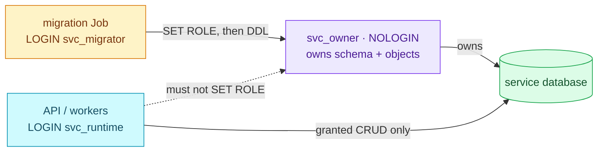

# ADR-084: Split Each Service Database Identity into Owner, Migrator and Runtime Roles

> **Decision summary:** We will give every application database three roles — a
> NOLOGIN owner, a migrator that reaches ownership only through `SET ROLE`, and a
> runtime login that owns nothing — because a runtime compromise must not be a
> schema compromise. We accept two Secrets, two HBA pairs and a coordinated
> cutover per service in exchange for separating data access from DDL and
> ownership.

| Attribute | Value |
|-----------|-------|
| **Status** | Accepted |
| **Decision date** | 2026-10-06 |
| **Owners** | `platform` |
| **Deciders** | `owner (duynhlab)` |
| **Scope** | Identity model of every application database on `platform-db` and `product-db` |
| **Affected components** | CNPG `DatabaseRole`/`Database`/`pg_hba`, service ResourceSets (`duynh` chart values), local-stack Postgres, service migration Jobs |
| **Related RFC** | [RFC-0029](../../rfc/RFC-0029/) |
| **Related research** | [research.md](../../rfc/RFC-0029/research.md) |
| **Supersedes** | — (amends [ADR-013](../ADR-013-per-service-db-triplet/): the triplet keeps its shape, its single login/owner role becomes three roles) |
| **Superseded by** | — |
| **Implementation tracking** | RFC-0029 Phase 2 (canary `review`) and Phase 3 |
| **Adoption** | Not started |

## Context

Each service database today follows the ADR-013 triplet: one ExternalSecret,
one `DatabaseRole` that is both the login and the owner, and one `Database`.
The service ResourceSet hands that same Secret and role to the API pods and to
the migration Job; they differ only by pooled versus direct endpoint. The
2026-09-04 audit found the service login owning 147 of 147 application tables.

Ownership is stronger than any grant: an owner can alter, drop and truncate its
objects and grant them onward. A leaked runtime credential or a SQL injection in
the API therefore carries full schema authority. Least privilege cannot be
reached by adding grants to this shape; the identity itself has to split.

Phase 0 of RFC-0029 (2026-10-05) showed the cost of identities whose details
CNPG cannot model: `vault_rotator` needed a hand-run `GRANT` to get its
membership options right.

## Scope

### In scope

- The roles each application database has, what each owns and how each
  connects.
- How objects become owned by the owner role on new and on existing clusters.
- The cutover from today's `<svc>` login.
- Local-stack parity.

### Out of scope

- Which privileges the runtime receives and how they are applied
  ([ADR-085](../ADR-085-service-migrations-own-authorization/)).
- Guarding membership options against drift
  ([ADR-086](../ADR-086-guard-membership-options/)).
- Keycloak and Temporal, which run their own schema tooling and need separate
  integration experiments.
- Human access and capability roles for people.

## Decision drivers

| Priority | Driver | Why it matters |
|---------:|--------|----------------|
| 1 | Runtime compromise stays a data-access incident | The single largest exposure the audit measured |
| 2 | Expressible in CNPG and GitOps | Identity, passwords and membership names stay declarative (ADR-013) |
| 3 | No standing privileged executor | Phase 0 showed how long a privileged credential outlives its purpose |
| 4 | Same failure modes in every gate | The release gate should catch an authorization bug before Kind does |

## Decision

We will give every application database three roles:

| Role | LOGIN | Owns | Reaches | Credential | Endpoint |
|---|---:|---|---|---|---|
| `<svc>_owner` | no | the database, its application schema and objects | — | none in Kubernetes | — |
| `<svc>_migrator` | yes | nothing | `<svc>_owner`, membership `INHERIT FALSE, SET TRUE, ADMIN FALSE` | migration Job Secret | primary `-rw` |
| `<svc>_runtime` | yes | nothing | object grants only | workload Secret | pooler |

Each role is its own fully specified CNPG `DatabaseRole`; `Database.spec.owner`
is `<svc>_owner`. Objects are owned by the owner on new and existing clusters
alike: a **new cluster** is born correct, because migrations run under the
migrator after `SET ROLE <svc>_owner`. This platform converts each service on a
**fresh cluster** (amended 2026-10-06), so no ownership transfer runs here. A
cluster that already holds data would transfer ownership once per service
through an operator runbook on CNPG's local peer `postgres` path
(`REASSIGN OWNED BY <svc> TO <svc>_owner` plus a grant backfill); that path is
reference only and not exercised.

### Decision rules

| Rule | Required behavior |
|------|-------------------|
| **Ownership** | Only `<svc>_owner` owns application objects. A runtime or migrator that owns an object is a defect |
| **Write path** | DDL runs only in the migration Job, as the migrator after `SET ROLE <svc>_owner` |
| **Read path** | The API and workers connect as `<svc>_runtime` through the pooler |
| **Boundary** | `<svc>_owner` has no password and no Secret; no workload ever logs in as it |
| **Admission** | `pg_hba` carries an exact pair for runtime and for migrator before either login is used (ADR-015) |
| **Cutover** | `<svc>_runtime` is a new login, not a rename (`DatabaseRole.spec.name` is immutable). Greenfield: the legacy `<svc>` login is never created, and there is no compatibility window. Rollback is `git revert` + a fresh `make up` |
| **Existing data** | Not exercised on this platform. Reference: one operator-run ownership transfer per service, with the transferred objects recorded in the cutover PR |
| **Parity** | local-stack gives a converted service the same three roles in `postgres/init.sql` and `compose.yaml` |

### Decision view

## Alternatives considered

| Option | Benefits | Costs / risks | Result |
|--------|----------|---------------|--------|
| **A — Three service roles** | Separates runtime from DDL and ownership; maps to the two deployment phases | More Secrets, HBA pairs and a cutover per service | Selected |
| **B — Capability roles plus separate logins** | Composable when many identities share one permission set | More membership edges whose options CNPG cannot express; nothing gained for one service with two consumers | Rejected for services; kept for people later |
| **C — Keep one owner/login (ADR-013 as is)** | No rollout cost | Runtime compromise stays schema compromise | Rejected |
| **D — Rebuild every database instead of transferring ownership** | No privileged step at all | Loses data on any long-lived cluster; rehearses nothing production will need | Rejected as the rule; allowed for a disposable Kind cluster |

### Why the selected option won

It is the smallest change that makes Driver 1 true: the runtime holds no
ownership and cannot become the owner, while CNPG still declares every identity.
The only privileged step is one recorded transfer per existing database.

### Why the closest alternative lost

Capability roles shine when many people share one permission set. A service has
exactly two consumers, and every extra membership edge is another set of PG18
options that CNPG cannot express and ADR-086 would have to guard.

## Consequences

### Positive consequences

- A leaked runtime credential cannot alter, drop or re-grant schema objects.
- Migrations and runtime can rotate independently.
- New clusters need no ownership fix-up at all.

### Negative consequences and accepted trade-offs

- Three `DatabaseRole`s, two ExternalSecrets and two HBA pairs per service.
- The domain ResourceSets need separate runtime and migration Secret inputs
  (today the workload and the `migrate` init container both read
  `inputs.db_secret`); the `duynh` chart needs no change.
- Services on `product-db` need their PgDog user list remapped (ADR-014) when
  their turn comes.
- One privileged, operator-run step per existing database.

### Neutral consequences

- The ADR-013 triplet file remains the unit of review; it grows.
- local-stack moves in step with each converted service.

## Implementation obligations

| Obligation | Owner | Tracking | Completion signal |
|------------|-------|----------|-------------------|
| Separate runtime/migration Secret inputs in the domain ResourceSets | platform | `kubernetes/apps/domains/` | the workload and `migrate` name different Secrets |
| Ownership-transfer procedure for existing databases | platform | [`authorization.md`](../../../databases/authorization.md#rollback-and-existing-data) | described as reference; not exercised (greenfield, amended 2026-10-06) |
| Canary `review` converted on Kind | platform + review-service | RFC-0029 Phase 2 | negative tests pass in the Kind gate |
| local-stack parity for converted services | platform | `local-stack/postgres/init.sql`, `compose.yaml` | local-stack gate passes with three roles |
| Verify how the migration tool reaches `SET ROLE` | platform | `migratex.WithSetRole` (duynhlab/pkg) + canary PR | migration Job creates objects owned by `<svc>_owner` |

## Validation and compliance

| Requirement | Verification |
|-------------|--------------|
| Runtime owns nothing | catalog query: owner of every application object is `<svc>_owner` |
| Runtime cannot escalate | negative tests: `CREATE`, `ALTER`, `DROP`, `GRANT`, `SET ROLE` as runtime fail |
| Migrator reaches owner only by `SET ROLE` | `pg_auth_members` shows `ADMIN FALSE, INHERIT FALSE, SET TRUE` (guarded by ADR-086) |
| Owner has no credential | no Secret and no HBA pair names `<svc>_owner` |
| Documentation | the service's database docs and the triplet manifest link this ADR |

## Revisit triggers

Re-open this decision when one or more of the following become true:

- The canary shows a migration tool that cannot work through `SET ROLE`.
- A CNPG release models membership options, which would change how much
  ADR-086 has to guard.
- The platform moves to managed PostgreSQL where the owner model differs.

A review does not automatically reverse the decision. A changed decision
requires a new ADR that supersedes this one.

## References

- [RFC-0029](../../rfc/RFC-0029/)
- [RFC-0029 research](../../rfc/RFC-0029/research.md) — ownership deep dive, PG-01…08, CNPG-01…06
- [ADR-013](../ADR-013-per-service-db-triplet/), [ADR-014](../ADR-014-pooler-credentials-valuesfrom/), [ADR-015](../ADR-015-pg-hba-connection-isolation/)

## History

| Date | Status / adoption | Change |
|------|-------------------|--------|
| 2026-10-06 | Proposed / Not started | Drafted from RFC-0029 |
| 2026-10-06 | Accepted / Not started | Accepted with RFC-0029 (owner decisions: canary `review`, local-stack parity, runbook transfer for existing data) |
| 2026-10-06 | Accepted / Not started | The service workloads moved from the `mop` chart to `duynh`. The obligation "separate runtime/migration Secret inputs in the `mop` chart" now needs no chart change: the `migrate` init container is declared in the domain ResourceSets (`initContainers`), so the migrator Secret is a values change there |
| 2026-10-06 | Accepted / Not started | Correction to the row above: the migrator Secret is not only a values change. The workload and the `migrate` init container both read `inputs.db_secret` / `db_user`, so the domain ResourceSets need new inputs; the chart still needs none. The summary's count is fixed to two Secrets (the owner has no credential) |
| 2026-10-06 | Accepted / Not started | **Amended** (owner, RFC-0029 Phase 1): greenfield cutover. The legacy `<svc>` login is never created, there is no compatibility window, rollback is `git revert` + a fresh `make up`, and the ownership transfer for existing data is reference only. Conventions in [`authorization.md`](../../../databases/authorization.md) |

---
_Last updated: 2026-10-06 (amended: greenfield cutover)_
