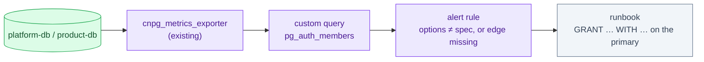

# ADR-086: Guard PostgreSQL Membership Options with a CNPG Monitoring Query

> **Decision summary:** We will export the `ADMIN`, `INHERIT` and `SET` options of
> every security-relevant role membership through the CNPG exporter and alert
> when they differ from the specified shape, because CNPG declares only the
> membership's name and silently recreates it with PostgreSQL defaults. We accept
> detection rather than prevention in exchange for no new component and no new
> credential.

| Attribute | Value |
|-----------|-------|
| **Status** | Accepted |
| **Decision date** | 2026-10-06 |
| **Owners** | `platform` |
| **Deciders** | `owner (duynhlab)` |
| **Scope** | Membership edges whose PG18 options carry a security boundary, on `platform-db` and `product-db` |
| **Affected components** | `platform-db/configmaps/monitoring-queries.yaml` (and the `product-db` twin), VictoriaMetrics alert rules, database runbooks |
| **Related RFC** | [RFC-0029](../../rfc/RFC-0029/) |
| **Related research** | [research.md](../../rfc/RFC-0029/research.md) |
| **Supersedes** | — |
| **Superseded by** | — |
| **Implementation tracking** | RFC-0029 Phase 0 step 6, then each ADR-084 cutover |
| **Adoption** | Partial |

## Context

PostgreSQL 16 split each membership into three options: `ADMIN` (may manage the
membership and the role's password), `INHERIT` (gets the role's privileges
automatically) and `SET` (may `SET ROLE` to it). CNPG `DatabaseRole.inRoles`
models only the parent's name. CNPG-04 measured the consequence: a membership it
recreates comes back as `ADMIN FALSE, INHERIT TRUE, SET TRUE`. CNPG also never
polls the catalog (CNPG-06).

Two edges already depend on non-default options:

- `vault_rotator → notification` must be `ADMIN TRUE, INHERIT FALSE, SET FALSE`.
  Losing `ADMIN` breaks OpenBAO's notification rotation; gaining `INHERIT` or
  `SET` gives the rotator notification's data. Phase 0 (2026-10-05) found it at
  `t/t/t` and fixed it by hand; nothing would notice a repeat.
- Every `<svc>_migrator → <svc>_owner` edge from
  [ADR-084](../ADR-084-split-service-database-roles/) must be
  `ADMIN FALSE, INHERIT FALSE, SET TRUE`.

## Scope

### In scope

- How the actual options of guarded edges are observed and alerted on.
- Which edges are guarded and who adds new ones.
- How a drifted edge is repaired.

### Out of scope

- Drift in object ACLs or default privileges
  ([ADR-085](../ADR-085-service-migrations-own-authorization/)).
- Automatic repair: a human runs the repair.
- Memberships without a security-relevant option (CNPG's own roles,
  `pg_monitor` for the exporter).

## Decision drivers

| Priority | Driver | Why it matters |
|---------:|--------|----------------|
| 1 | Catch a drifted edge before it is exploited or breaks rotation | The failure is silent today |
| 2 | No new component and no new credential | Every new privileged reader is another Phase 0 |
| 3 | Fits the existing alert path | One place for on-call to look |

## Decision

We will add one custom query to the CNPG monitoring ConfigMap of each cluster
that reads `pg_auth_members` (a shared catalog readable by PUBLIC, so
`cnpg_metrics_exporter` needs no new grant) and exports, per guarded edge, its
`admin_option`, `inherit_option` and `set_option`. An alert rule compares them
with the specified shape and fires on any difference, linking a runbook whose
repair is `GRANT <parent> TO <member> WITH INHERIT …, SET …, ADMIN …` run on the
primary as `postgres`.

### Decision rules

| Rule | Required behavior |
|------|-------------------|
| **Ownership** | The guarded-edge list lives in the monitoring query and the alert rule, beside the manifests that create the edges |
| **Write path** | A PR that creates a guarded edge (a new rotator target, an ADR-084 cutover) adds it to the query and the rule in the same PR |
| **Read path** | The exporter reads the shared catalog once per instance from its default database; the alert aggregates across instances |
| **Boundary** | The guard detects; it does not repair. CNPG keeps owning only membership names |
| **Failure behavior** | A missing series for a guarded edge (the edge was revoked) is itself an alert, not silence |
| **First edge** | `vault_rotator → notification` = `ADMIN TRUE, INHERIT FALSE, SET FALSE` |

### Decision view

## Alternatives considered

| Option | Benefits | Costs / risks | Result |
|--------|----------|---------------|--------|
| **A — CNPG custom query + alert** | Reuses the exporter and alert path; no credential | Detects only; the list must be kept in step with the manifests | Selected |
| **B — Read-only CronJob running a catalog check** | Can produce a detailed report | New Job, new credential, alerting through Job status | Rejected |
| **C — pgroles `diff` in read-only mode** | Recorded, reviewable plans | Does not inspect membership `SET` — misses the exact drift to catch; adds a privileged executor | Rejected |
| **D — Re-run the `GRANT` on every reconcile** | Self-healing | Needs a standing executor with `ADMIN` on every guarded role; hides that drift happened | Rejected |

### Why the selected option won

It satisfies Driver 1 with nothing new to run or to secure, and the shared
catalog makes the query cheap.

### Why the closest alternative lost

Self-healing (D) is attractive, but it requires exactly the kind of standing
privileged credential RFC-0029 is removing, and an edge that keeps drifting is a
signal someone should see.

## Consequences

### Positive consequences

- A drifted or revoked guarded edge pages instead of failing silently.
- The specified shape of every security-relevant membership is written down in
  one place.

### Negative consequences and accepted trade-offs

- Detection, not prevention: exposure lasts from drift until a human repairs it.
- The edge list can fall behind the manifests if a PR forgets it; review must
  enforce the write-path rule.

### Neutral consequences

- Each ADR-084 cutover PR touches the monitoring ConfigMap and the alert rules.

## Implementation obligations

| Obligation | Owner | Tracking | Completion signal |
|------------|-------|----------|-------------------|
| Query + alert + runbook for `vault_rotator → notification` | platform | RFC-0029 Phase 0 step 6 | alert silent at `t/f/f`, fires when the edge is changed on Kind |
| Same query on `product-db` once it has guarded edges | platform | first `product-db` cutover | series present |
| Alert catalog row | platform | `docs/observability/alerting/alert-catalog.md` | row links the runbook |
| Add each `migrator → owner` edge at cutover | platform + service | ADR-084 cutovers | edge visible in the query |

## Validation and compliance

| Requirement | Verification |
|-------------|--------------|
| Alert fires on drift | on Kind, flip one option and see the alert; restore and see it resolve |
| Alert fires on a missing edge | revoke the membership on Kind and see the alert |
| No new credential | the query runs as the existing `cnpg_metrics_exporter` |
| Edge list complete | review checklist on PRs that create memberships |

## Revisit triggers

Re-open this decision when one or more of the following become true:

- CNPG models membership options in `DatabaseRole`.
- The number of guarded edges makes a hand-kept list error-prone.
- A drift recurs often enough that automatic repair is worth a standing
  executor.

A review does not automatically reverse the decision. A changed decision
requires a new ADR that supersedes this one.

## References

- [RFC-0029](../../rfc/RFC-0029/)
- [RFC-0029 research](../../rfc/RFC-0029/research.md) — CNPG-04, CNPG-06, Phase 0 execution record
- [Rotate the `vault_rotator` credential](../../../databases/runbooks/rotate-vault-rotator-credential.md)
- [ADR-025](../ADR-025-pgdog-passthrough-dynamic-db-creds/), [ADR-084](../ADR-084-split-service-database-roles/)

## History

| Date | Status / adoption | Change |
|------|-------------------|--------|
| 2026-10-06 | Proposed / Not started | Drafted from RFC-0029 |
| 2026-10-06 | Accepted / Not started | Accepted with RFC-0029 (owner chose query + alert over CronJob and pgroles) |
| 2026-10-06 | Accepted / Partial | First edge guarded: `pg_role_membership` query on `platform-db`, `CNPGRoleMembershipDrift` + `CNPGRoleMembershipGuardMissing`, runbooks and alert-catalog §4c. On Kind the alert fired for a flipped `INHERIT` and for a revoked edge and resolved after the repair `GRANT`. Still open: the `product-db` twin and each `migrator → owner` edge at its ADR-084 cutover |
| 2026-10-06 | Accepted / Partial | RFC-0029 Phase 1 (owner): the alert pages **and** the Kind gate asserts `drift == 0` for every guarded edge (row K3.7). Each `<svc>_migrator → <svc>_owner` edge gets its `f/f/t` shape from the migrator's `inherit: false` attribute, so CNPG's plain `GRANT` creates it correctly; the guard still covers it |
