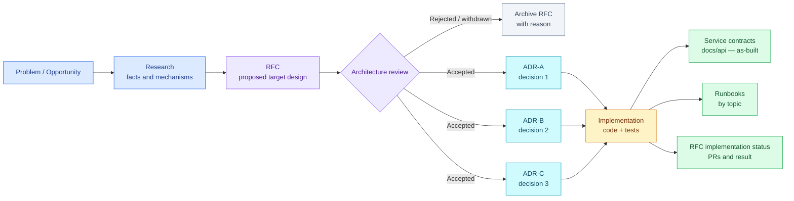
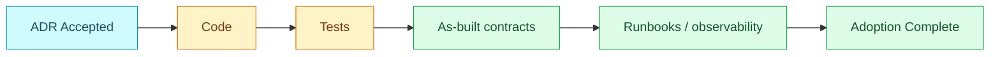

# Architecture Decision Records (ADRs)

Short, structured records of **one durable architectural decision** — the context
that forced it, the alternatives rejected, the trade-offs accepted, and the rules
code must follow. ADRs capture the **why** that manifests and service contracts
cannot.

| Quick facts | |
|---|---|
| Copy source | [`ADR-0000-template/`](ADR-0000-template/) (template v3) |
| Proposals hub | [`docs/proposals/README.md`](../README.md) |
| RFC process | [`rfc/README.md`](../rfc/README.md) |
| As-built contracts | [`docs/api/`](../../api/README.md) |
| Runbooks (by topic) | [`docs/observability/runbooks/`](../../observability/runbooks/), [`docs/databases/runbooks/`](../../databases/runbooks/) |

## Contents

- [Artifact roles](#artifact-roles)
- [Lifecycle](#lifecycle)
- [Process](#process)
- [When to create an ADR](#when-to-create-an-adr)
- [One decision per ADR](#one-decision-per-adr)
- [Status and Adoption](#status-and-adoption)
- [Append-only rules](#append-only-rules)
- [Naming and layout](#naming-and-layout)
- [Writing a concise ADR](#writing-a-concise-adr)
- [RFC Resulting decisions](#rfc-resulting-decisions)
- [Review checklist](#review-checklist)
- [Common mistakes](#common-mistakes)
- [Definition of Done](#definition-of-done)
- [Illustrative splits](#illustrative-splits)
- [References](#references)
- [Records index](#records-index)

---

## Artifact roles

Each document type answers one question. Do not merge responsibilities.

| Document | Primary question |
|----------|------------------|
| [`research.md`](../rfc/RFC-0000/research.md) | How does this mechanism, product, or pattern work? |
| [RFC](../rfc/) | What change do we **propose** for the system? |
| **ADR** (this directory) | What did we **decide**, and which trade-offs did we accept? |
| Planning (RFC rollout, epic, optional `RFC-NNNN/implementation.md`) | How do we **schedule** implementation phases and PRs? |
| [`docs/api/{service}.md`](../../api/README.md) | How does the system **run today** (as-built)? |
| Runbook | When something fails or drifts, how do we **operate** it? |

Mnemonic:

```text
Research = background knowledge
RFC      = proposal record
ADR      = decision record
Planning = construction schedule
API docs = as-built contract
Runbook  = operations playbook
```

**ADR is not:** a long research essay, a full target design (that is the RFC), a
task list, an API contract, a runbook, or a repository changelog.

### RFC and ADR cardinality

RFC and ADR are **not** 1:1. One RFC may spawn zero, one, or many ADRs. Each ADR
records **one** decision that could stand or be superseded on its own.

An RFC may spawn **no** ADR when the proposal is rejected or withdrawn, the change
is pure implementation detail, no durable architectural constraint remains, no
meaningful alternative needs recording, or an existing ADR already covers the
decision.

A **standalone ADR** (no RFC) is fine when scope is small, the problem is clear,
few alternatives exist, and no large rollout plan is needed.

---

## Lifecycle


```mermaid
flowchart LR
    Problem["Problem / Opportunity"] --> Research["Research<br/>facts and mechanisms"]
    Research --> RFC["RFC<br/>proposed target design"]
    RFC --> Review{"Architecture review"}

    Review -->|"Rejected / withdrawn"| Archive["Archive RFC<br/>with reason"]
    Review -->|"Accepted"| ADR1["ADR-A<br/>decision 1"]
    Review -->|"Accepted"| ADR2["ADR-B<br/>decision 2"]
    Review -->|"Accepted"| ADR3["ADR-C<br/>decision 3"]

    ADR1 --> Implementation["Implementation<br/>code + tests"]
    ADR2 --> Implementation
    ADR3 --> Implementation

    Implementation --> Contracts["Service contracts<br/>docs/api — as-built"]
    Implementation --> Runbooks["Runbooks<br/>by topic"]
    Implementation --> History["RFC implementation status<br/>PRs and result"]

    classDef edge fill:#dbeafe,color:#1e3a8a,stroke:#2563eb;
    classDef service fill:#cffafe,color:#164e63,stroke:#0891b2;
    classDef worker fill:#fef3c7,color:#78350f,stroke:#d97706;
    classDef platform fill:#ede9fe,color:#4c1d95,stroke:#7c3aed;
    classDef data fill:#dcfce7,color:#14532d,stroke:#16a34a;
    classDef external fill:#f1f5f9,color:#334155,stroke:#64748b;

    class Problem,Research edge;
    class RFC,Review platform;
    class ADR1,ADR2,ADR3 service;
    class Implementation worker;
    class Contracts,Runbooks,History data;
    class Archive external;
```

---

## Process

For RFC-backed work, follow the sequence below. A small standalone ADR skips
steps 2–3 and RFC-specific updates; the deciders review and accept the ADR
directly. Confirmation and owning-document updates still apply.

1. Frame the problem (optionally in `research.md`).
2. Write the RFC with target design and alternatives.
3. During RFC review, identify **independent** architectural decisions.
4. Create one ADR per decision at **`Proposed`** (copy [`ADR-0000-template/`](ADR-0000-template/)).
5. On architecture approval: RFC → **`Accepted`**; linked ADR(s) → **`Accepted`**
   (Adoption stays **`Not started`** until code lands).
6. Implement code and tests.
7. Update [`docs/api/`](../../api/README.md) to as-built (API-touching decisions).
8. Update ADR **Adoption** and **History**; append RFC **Implementation History**.
9. Add or update **runbooks** when the topic has meaningful operational failure
   modes (observability, databases, or other area — not a single root path).

**docs/api sync (API-touching):** when Adoption reaches **Complete**, owning service
files, hub rollup, and **Design records** links must match deployed reality. The ADR
keeps *why*; the contract keeps routes, RPCs, payloads, and status. Infra-only ADRs
update platform docs instead.

---

## When to create an ADR

Create an ADR when one or more of these apply:

| Question | Create ADR? |
|----------|-------------|
| Changes service boundary or data ownership? | Yes |
| Affects multiple repos or platform components? | Yes |
| Expensive to reverse after shipping? | Yes |
| Two or more credible alternatives existed? | Yes |
| Creates long-lived constraints for code review? | Yes |
| A newcomer may ask "why did we do this?" in six months? | Yes |
| Touches money, security, consistency, or distributed workflows? | Yes |
| Changes transport or workflow ownership? | Yes |
| Significant operational trade-off? | Yes |

Do **not** create an ADR for: rename-only refactors, formatting, PR splits, seed
data tweaks, local bug fixes without boundary change, routine indexes, package moves
without boundary change, or pure implementation tasks.

---

## One decision per ADR

One ADR = one sentence in active voice:

```text
We will separate Inventory from Product.
```

If decision A can change while B remains valid, they belong in **separate** ADRs.

**Split signal:** titles or decisions chained with *and*, *also*, *while*,
*as well as*, *plus* — usually multiple decisions in one file.

---

## Status and Adoption

**Decision status** and **Adoption** are independent. Do not use `Implemented` as
an ADR status.

### Decision status

| Status | Meaning |
|--------|---------|
| `Proposed` | Under review; not yet an architectural constraint |
| `Accepted` | Approved; authoritative for design and review |
| `Withdrawn` | Removed before acceptance |
| `Deprecated` | Retained for existing behavior; not for new designs |
| `Superseded by ADR-NNN` | Replaced by a newer decision |

Typical flow: `Proposed → Accepted → Superseded by ADR-NNN` (or `Deprecated`).

### Adoption

| Adoption | Meaning |
|----------|---------|
| `Not started` | No implementation work yet |
| `Partial` | Some obligations complete (phased rollout) |
| `Complete` | Code, tests, contracts, and required ops docs comply |

Example after RFC approval: `Status: Accepted`, `Adoption: Not started`.

**Existing v1/v2 ADRs remain valid.** Legacy v1 records may omit Adoption in the
file body; the index below assigns Adoption for tracking. New ADRs from
[`ADR-0000-template/`](ADR-0000-template/) use template v3. No backfill unless
the owner asks; do not reshape accepted decisions to match the new template.

---

## Append-only rules

After **`Accepted`**, do not silently rewrite the **Context** and decision basis
(including drivers, assumptions and evidence), **Decision**, **Alternatives
considered**, or accepted **Consequences**. This also protects a separate
**Decision drivers** section in older or extended records. Append newly learned
evidence with its scope/date rather than making it look known at acceptance.

Allowed updates: typos, broken links, append PRs, change **Adoption**, add **History**
rows, mark **Deprecated** or **Superseded**.

History records lifecycle/adoption milestones and important evidence, not an
editing diary. Wording, formatting and link-fix history belongs in Git/PRs.

When the decision itself changes, write a **new** ADR, set `Supersedes: ADR-NNN` on
the new record, and update the old record to `Superseded by ADR-XXX`.

---

## Naming and layout

### Title

Imperative, decision-shaped:

```text
Adopt Temporal for Order Fulfillment
Separate Inventory from Product
Keep Checkout as a Purchase-Funnel Orchestrator
```

Avoid topic labels: `Inventory Architecture`, `Checkout Improvements`.

### Folder

One folder per decision (matches RFC layout):

```text
docs/proposals/adr/ADR-NNN-imperative-kebab-slug/README.md
```

Keep per-ADR diagrams and assets inside the folder. Use the next platform-wide
`ADR-NNN` sequence (do not reset per service).

---

## Writing a concise ADR

Template v3 keeps one copy source, not separate simple/full templates. Aim for
1–2 readable pages without a hard limit: keep the argument here and link the
research, rollout schedule and operational procedures.

The core is **Context → Decision → Alternatives considered → Consequences →
Confirmation → References → History**, preceded by a decision summary and
Status, Decision date, Owner, Deciders and Adoption. Add other metadata only
when relevant; omit unused rows and placeholder links.

- **Context:** explain why a decision is needed now, its scope and the decisive
  constraints. Distinguish observed facts, assumptions and unknowns. Learning
  value is a valid homelab driver; do not invent a production need to justify it.
- **Decision and alternatives:** explain why this choice beats the closest
  credible alternative under those constraints, including the additional cost.
  Consider keeping the current approach or deferring when viable. There is no
  required number of options; avoid straw men and product-feature lists.
- **Consequences:** state both expected benefit and a meaningful accepted cost,
  limitation or risk. Identify an observable revisit condition when an
  important assumption could invalidate the choice.
- **Confirmation:** state how compliance will be checked and what permits
  Adoption: Complete. Link scoped evidence when checks actually run, and update
  the owning documentation: API contracts for API changes, platform docs for
  infrastructure, runbooks when operationally relevant.

Extend only when the decision needs it: a separate Scope section for complex
boundaries; prioritized drivers or a rules table for multiple constraints; an
obligations table with owner/tracking/completion signal for phased adoption;
Revisit triggers for several material assumptions. Use Mermaid only when a
small diagram clarifies the decision. None of these extensions is a mandatory
heading, table or bullet quota, and neutral consequences need no empty section.

---

## RFC Resulting decisions

Every multi-decision RFC should link its ADRs explicitly. Add to the RFC body (see
[`RFC-0000/README.md`](../rfc/RFC-0000/README.md#resulting-decisions)):

```markdown
## Resulting decisions

| Decision | ADR | Status |
|----------|-----|--------|
| {one-line decision} | `ADR-NNN-slug/` | Proposed |
```

On approval: RFC → **Accepted**; each linked ADR → **Accepted**; Adoption →
**Not started** unless implementation already landed. After ship: update
Adoption, owning docs (`docs/api` only when API-touching), runbooks if needed,
and RFC Implementation History.

---

## Review checklist

### Before review

- [ ] Title is one decision, not a topic name.
- [ ] Decision summary states benefit **and** cost.
- [ ] Context explains scope, constraints and why now without preselecting an answer.
- [ ] Facts, assumptions and unknowns are distinguishable; evidence is scoped.
- [ ] The decisive drivers explain why the choice beats the closest credible alternative.
- [ ] Alternatives are real; keeping the current approach or deferring was considered when viable.
- [ ] At least one meaningful negative consequence.
- [ ] Confirmation defines compliance checks and an observable adoption result.
- [ ] Material assumptions have revisit conditions when applicable.
- [ ] Relevant references are linked; unused metadata and boilerplate are removed.
- [ ] Optional diagram answers one boundary question only.

### On Accept

- [ ] Decision date and Deciders filled in.
- [ ] Status → **Accepted**; Adoption → **Not started** (unless code already landed).
- [ ] RFC **Resulting decisions** table updated when RFC-backed.
- [ ] History row added.

### On Adoption Complete

- [ ] Confirmation checks passed with evidence; any adoption obligations are met.
- [ ] Owning docs are as-built and link this ADR (`docs/api/` for API-touching work).
- [ ] Runbooks updated when ops-relevant.
- [ ] Adoption → **Complete**; History updated.

### When reversing

- [ ] Do not rewrite the old Decision section.
- [ ] New ADR with `Supersedes`; old ADR → `Superseded by`.

---

## Common mistakes

| Mistake | Fix |
|---------|-----|
| ADR duplicates the whole RFC | Move target design to RFC; keep one decision + rules here |
| Context argues for the answer | State forces only; decide in **Decision** |
| Straw-man alternatives | Record real options; link RFC/research when available |
| Benefits only, no costs | State the accepted cost or risk in **Consequences** |
| Phase plan inside ADR | Link rollout/tracking; **Confirmation** states the adoption signal, with an obligations table only if needed |
| Filling every template extension | Keep only sections and tables that add decision-relevant information |
| `Status: Implemented` | Use `Accepted` + `Adoption: Complete` |
| Calendar-only revisit trigger | Use observable thresholds (scale, requirement, cost) |

---

## Definition of Done

An ADR is not complete at compile time.

The checklist below concerns **Adoption: Complete**, not architecture approval.
Use checks and documentation updates relevant to the decision's scope; a small
infra-only ADR does not require service contract or workflow tests.

```text
Decision accepted (ADR)
├── Implementation obligations done
├── Unit / integration / contract / workflow tests
├── Security and failure behavior verified
├── docs/api updated (when API-touching)
├── Platform topology / call graph updated
├── Runbooks when ops-relevant
└── Adoption = Complete
```


```mermaid
flowchart LR
    ADR["ADR Accepted"] --> Code["Code"]
    Code --> Tests["Tests"]
    Tests --> Contracts["As-built contracts"]
    Contracts --> Ops["Runbooks / observability"]
    Ops --> Complete["Adoption Complete"]

    classDef service fill:#cffafe,color:#164e63,stroke:#0891b2;
    classDef worker fill:#fef3c7,color:#78350f,stroke:#d97706;
    classDef data fill:#dcfce7,color:#14532d,stroke:#16a34a;
    class ADR service;
    class Code,Tests worker;
    class Contracts,Ops,Complete data;
```

**Planned (not yet in repo):** structural ADR lint in CI (`make lint-adr`) —
filename, required headings, status/adoption vocabulary, Mermaid render, RFC↔ADR
backlinks.

---

## Illustrative splits

Examples only — use the next free `ADR-NNN` when authoring; do not renumber live
records.

**Large RFC (e.g. inventory domain overhaul)** might yield:

```text
ADR-NNN — Separate Inventory from Product
ADR-NNN — Use Reservation Balances and an Append-Only Stock Movement Ledger
ADR-NNN — Fulfil One Order from One Warehouse in the MVP
```

**Order / Temporal RFC** might yield separate decisions for lifecycle model,
orchestrator ownership, and confirmation pivot — because each can change without
invalidating the others.

Do **not** duplicate an existing ADR when the decision is already recorded; link
and extend Adoption instead.

---

## References

- [Michael Nygard — Documenting Architecture Decisions](https://cognitect.com/blog/2011/11/15/documenting-architecture-decisions): one decision, contextual forces, consequences and supersession.
- [MADR 4.0.0 minimal template](https://github.com/adr/madr/blob/4.0.0/template/adr-template-minimal.md) and [full template](https://github.com/adr/madr/blob/4.0.0/template/adr-template.md): explicit justification with optional detail. Homelab additionally requires consequences, confirmation and lifecycle tracking.

---

## Records index

| ADR | Title | Status | Adoption | Related RFC |
|-----|-------|--------|----------|-------------|
| [ADR-001](ADR-001-adopt-temporal-for-order-fulfillment/) | Adopt Temporal for order fulfillment | Accepted | Complete | [RFC-0001](../rfc/RFC-0001/) |
| [ADR-002](ADR-002-deploy-temporal-via-operator/) | Deploy Temporal via the alexandrevilain operator | Superseded by [ADR-030](ADR-030-temporal-workflow-versioning/) | Complete | [RFC-0001](../rfc/RFC-0001/) |
| [ADR-003](ADR-003-jwt-validation-in-services-not-kong/) | Keep JWT validation in services, not the Kong gateway | Superseded by [ADR-006](ADR-006-rs256-jwt-kong-edge-auth/) | Complete | — |
| [ADR-004](ADR-004-enable-openbao-audit-logging/) | Enable OpenBAO audit logging | Accepted | Complete | — |
| [ADR-005](ADR-005-openbao-ha-raft/) | Run OpenBAO HA (Raft) instead of Vault dev mode | Accepted | Complete | — |
| [ADR-006](ADR-006-rs256-jwt-kong-edge-auth/) | Adopt RS256 signed JWTs + Kong edge authentication | Accepted (implemented); Kong vehicle superseded by [ADR-044](ADR-044-envoy-gateway-platform-edge/) | Complete | [RFC-0009](../rfc/RFC-0009/) |
| [ADR-007](ADR-007-double-entry-payment-ledger/) | Record money movement in an append-only double-entry ledger | Accepted | Complete | [RFC-0010](../rfc/RFC-0010/) |
| [ADR-008](ADR-008-mockpay-standalone-provider/) | Run the mock payment provider as a standalone process | Accepted | Complete | [RFC-0010](../rfc/RFC-0010/) |
| [ADR-009](ADR-009-saga-authorize-early-capture-late/) | Authorize payment early, capture late in the order saga | Accepted | Complete | [RFC-0010](../rfc/RFC-0010/) |
| [ADR-010](ADR-010-shared-idempotency-library/) | Extract idempotency into a shared pkg/idempotency library | Accepted | Complete | [RFC-0010](../rfc/RFC-0010/) |
| [ADR-011](ADR-011-detect-only-reconciliation/) | Ship reconciliation detect-only; defer auto-heal | Accepted (heal for one class added by [ADR-012](ADR-012-reconciliation-auto-heal/)) | Complete | [RFC-0010](../rfc/RFC-0010/) |
| [ADR-012](ADR-012-reconciliation-auto-heal/) | Auto-heal one reconciliation class — the lost-capture-response window | Accepted | Complete | [RFC-0010](../rfc/RFC-0010/) |
| [ADR-013](ADR-013-per-service-db-triplet/) | Per-service database triplet (ExternalSecret + DatabaseRole + Database) on cnpg-db | Accepted | Complete | [RFC-0012](../rfc/RFC-0012/) |
| [ADR-014](ADR-014-pooler-credentials-valuesfrom/) | PgDog pooler credentials via Flux valuesFrom targetPath | Accepted | Complete | [RFC-0012](../rfc/RFC-0012/) |
| [ADR-015](ADR-015-pg-hba-connection-isolation/) | Database connection isolation via declarative pg_hba | Accepted | Complete | [RFC-0012](../rfc/RFC-0012/) |
| [ADR-016](ADR-016-otel-metrics-cutover/) | Metrics cutover to the OTLP push pipeline | Accepted | Complete | [RFC-0014](../rfc/RFC-0014/) |
| [ADR-017](ADR-017-api-path-collection-noun/) | Collection-noun segment after the audience in every API path | Accepted | Complete | — |
| [ADR-018](ADR-018-checkout-order-boundary/) | Order stays the only orders-writer; checkout hands off via CreateOrder gRPC | Accepted | Complete | [RFC-0015](../rfc/RFC-0015/) |
| [ADR-019](ADR-019-session-expiry-model/) | Session expiry = durable timer (wake-up) + lazy backstop (authority) | Accepted | Complete | [RFC-0015](../rfc/RFC-0015/) |
| [ADR-020](ADR-020-checkout-revalidation-policy/) | Product is the checkout price authority; stock checked, never reserved | Accepted | Complete | [RFC-0015](../rfc/RFC-0015/) |
| [ADR-021](ADR-021-cart-grpc-read-surface/) | Cart gains a read-only gRPC surface; writes stay on REST | Accepted | Complete | [RFC-0015](../rfc/RFC-0015/) |
| [ADR-022](ADR-022-atomic-promo-redemption/) | Promo redemptions count atomically at confirm, before the attempt marker | Accepted | Complete | [RFC-0015](../rfc/RFC-0015/) |
| [ADR-023](ADR-023-clickhouse-observability-olap/) | Adopt ClickHouse as supplementary OLAP for OTel logs+traces SQL | Accepted | Complete | [RFC-0019](../rfc/RFC-0019/) |
| [ADR-024](ADR-024-floci-kms-emulator-auto-unseal/) | floci KMS-emulator auto-unseal for OpenBAO on Kind | Accepted | Complete | [RFC-0008](../rfc/RFC-0008/) |
| [ADR-025](ADR-025-pgdog-passthrough-dynamic-db-creds/) | PostgreSQL credential delivery & role model (PgDog passthrough PoC) | Proposed | Not started | [RFC-0008](../rfc/RFC-0008/), [RFC-0012](../rfc/RFC-0012/) |
| [ADR-026](ADR-026-platform-db-pgbouncer-pilot/) | Pilot CNPG-native PgBouncer pooler on platform-db | Accepted | Complete | [RFC-0012](../rfc/RFC-0012/) |
| [ADR-027](ADR-027-inventory-sole-stock-authority/) | inventory-service is the platform's sole stock authority | Accepted | **Complete** | [RFC-0021](../rfc/RFC-0021/) |
| [ADR-028](ADR-028-inventory-reservation-model/) | Inventory reservation & balance model (FSM, ledger, one-order-one-warehouse) | Accepted | Complete | [RFC-0021](../rfc/RFC-0021/) |
| [ADR-029](ADR-029-enum-feature-flag-helper/) | Adopt `pkg/flagx` for startup-validated feature flags | Accepted | Complete | [RFC-0021](../rfc/RFC-0021/) |
| [ADR-030](ADR-030-temporal-workflow-versioning/) | Adopt Temporal Worker Versioning + official helm-charts | Accepted (supersedes [ADR-002](ADR-002-deploy-temporal-via-operator/) deployment half) | Complete — re-platform done; versioning live since 2026-07-30. **Rollout mechanism partly superseded by [ADR-054](ADR-054-temporal-worker-controller/)** (2026-08-21): the build id is now derived by the Worker Controller and appears nowhere in git, so there is no named Current build to quote here. Workflows still run Pinned; the unversioned worker retired at drain 0, builds 1.10.0/1.12.0 were retired 2026-08-06 on measured evidence, and 1.13.2 was replaced 2026-08-21 because a frozen build id cannot take an image rebuild (§ Amendments) (see [RFC-0021 cutover-rollback](../rfc/RFC-0021/cutover-rollback.md)) | [RFC-0021](../rfc/RFC-0021/) |
| [ADR-031](ADR-031-fulfillment-start-outbox/) | Start the fulfillment saga through a transactional outbox | Accepted | Complete | [RFC-0021](../rfc/RFC-0021/) |
| [ADR-032](ADR-032-tempo-operator-monolithic/) | Deliver Tempo through the tempo-operator TempoMonolithic CR | Withdrawn (superseded by [ADR-040](ADR-040-tempo-community-helm-chart/)) | Not started | — |
| [ADR-033](ADR-033-order-status-cancellation/) | Make order status a guarded state machine with customer cancellation | Accepted | Complete | [RFC-0021](../rfc/RFC-0021/) |
| [ADR-034](ADR-034-provider-outcome-ambiguity/) | Record an unknown provider outcome instead of guessing it | Accepted | Complete | [RFC-0021](../rfc/RFC-0021/) |
| [ADR-035](ADR-035-windowed-reconciliation/) | Bound a reconciliation pass to a time window | Accepted | Complete | [RFC-0021](../rfc/RFC-0021/) |
| [ADR-036](ADR-036-single-writer-lease/) | Guard single-writer background roles with a database lease | Accepted | Complete | [RFC-0021](../rfc/RFC-0021/) |
| [ADR-037](ADR-037-per-request-refund-identity/) | Let the caller name each refund | Accepted | Complete | [RFC-0021](../rfc/RFC-0021/) |
| [ADR-038](ADR-038-shared-http-middleware/) | Promote the HTTP tracing and logging middleware into `pkg/httpmw` | Accepted | Partial | [RFC-0014](../rfc/RFC-0014/) |
| [ADR-039](ADR-039-local-stack-temporal-server-postgres/) | Run local-stack Temporal as `temporalio/server` on Postgres with admin-tools | Accepted | Complete | [RFC-0021](../rfc/RFC-0021/) |
| [ADR-040](ADR-040-tempo-community-helm-chart/) | Deliver Tempo through the `grafana-community/tempo` Helm chart | Withdrawn (superseded by [ADR-059](ADR-059-retire-tempo/)) | Partial, then reverted | [RFC-0027](../rfc/RFC-0027/) |
| [ADR-041](ADR-041-keycloak-platform-idp/) | Adopt Keycloak as the platform identity provider and retire auth-service | Accepted | Partial | [RFC-0022](../rfc/RFC-0022/) |
| [ADR-042](ADR-042-oidc-sub-as-user-id/) | Use the OIDC subject as the application `user_id`, as a string, fleet-wide | Accepted | Partial | [RFC-0022](../rfc/RFC-0022/) |
| [ADR-043](ADR-043-oidc-browser-workload-trust/) | Authenticate browsers via OIDC; keep east-west trust workload-level | Accepted | Partial | [RFC-0022](../rfc/RFC-0022/) |
| [ADR-044](ADR-044-envoy-gateway-platform-edge/) | Make Envoy Gateway the platform edge on the Gateway API | Accepted | Partial | [RFC-0024](../rfc/RFC-0024/) |
| [ADR-045](ADR-045-local-first-edge-rate-limiting/) | Rate-limit at the edge with local token buckets, not a global RLS | Accepted | Partial | [RFC-0024](../rfc/RFC-0024/) |
| [ADR-046](ADR-046-e2e-gate-kind-fallback/) | Move the E2E release-audit gate to Kind if compose cannot carry the edge | Accepted | Complete | [RFC-0024](../rfc/RFC-0024/) |
| [ADR-047](ADR-047-protected-apis-on-owning-services/) | Expose administrative commands through role-gated protected APIs on owning services | Accepted | Complete | [RFC-0023](../rfc/RFC-0023/) |
| [ADR-048](ADR-048-admin-portal-no-bff/) | Call owning services directly from the Admin Portal; defer an admin BFF | Accepted | Partial | [RFC-0023](../rfc/RFC-0023/) |
| [ADR-049](ADR-049-admin-portal-tanstack-spa/) | Build the Admin Portal as a separate React SPA on the TanStack stack | Accepted | Partial | [RFC-0023](../rfc/RFC-0023/) |
| [ADR-050](ADR-050-separate-staff-identity-realm/) | Separate workforce identity from customer identity in a staff realm | Accepted | Partial | [RFC-0022](../rfc/RFC-0022/) / [RFC-0023](../rfc/RFC-0023/) |
| [ADR-051](ADR-051-trusted-operator-resolution/) | Trust the operator and make the audit trail the control | Accepted | Complete | [RFC-0023](../rfc/RFC-0023/) |
| [ADR-052](ADR-052-converge-the-customer-spa-on-the-portal-stack/) | Converge the customer SPA on the Admin Portal's stack | Accepted | Complete | [RFC-0025](../rfc/RFC-0025/) |
| [ADR-053](ADR-053-untracked-sku-operator-data-not-outage/) | Treat the untracked SKU as operator data, not an outage | Accepted | Partial | — |
| [ADR-054](ADR-054-temporal-worker-controller/) | Give the versioned-worker lifecycle to the Temporal Worker Controller | Accepted | Complete | [RFC-0026](../rfc/RFC-0026/) |
| [ADR-055](ADR-055-keda-worker-autoscaling/) | Scale versioned workers from task-queue backlog with KEDA | Accepted | Partial | [RFC-0026](../rfc/RFC-0026/) |
| [ADR-056](ADR-056-k6-e2e-assertion-layer/) | Assert the E2E gates with k6 instead of reading curl by eye | Accepted | Partial — Kind rows converted and proven; compose rows written and contract-verified, environment untested | — |
| [ADR-057](ADR-057-span-metrics-in-collector/) | Derive RED span metrics in the collector, not inside a trace backend | Accepted | **Complete** — series verified on Kind; `red-spanmetrics` + `otel-collector-health` now read them cluster-side and gate row K5.5 asserts the leg | [RFC-0027](../rfc/RFC-0027/) |
| [ADR-058](ADR-058-retire-jaeger/) | Retire Jaeger, keeping the Jaeger query API as VictoriaTraces' interface | Accepted | **Complete** | [RFC-0027](../rfc/RFC-0027/) |
| [ADR-059](ADR-059-retire-tempo/) | Retire both Tempo installs and take service graphs from VictoriaTraces | Accepted | **Complete** — 31 service-graph edges measured | [RFC-0027](../rfc/RFC-0027/) |
| [ADR-060](ADR-060-envoy-access-log-transport/) | Send Envoy access logs over OTLP in addition to stdout | Accepted | **Complete** — edge rows in `otel_logs` 0 → 30, Vector path to 0 | [RFC-0027](../rfc/RFC-0027/) |
| [ADR-061](ADR-061-edge-log-routing/) | Route edge access logs to ClickHouse only; collect edge runtime logs into VictoriaLogs | Accepted | **Complete** — gate-measured: 0 new edge rows in VL, runtime stream live, JOIN by TraceId | — |
| [ADR-062](ADR-062-staff-groups-sso/) | Authorize infra tools through staff-realm groups | Accepted | **Complete** — Grafana + OpenBAO SSO live (2026-08-26); third client `flux-web` joined 2026-08-27 (#940) | — |
| [ADR-063](ADR-063-temporal-otel-v2/) | Adopt the OpenTelemetry v2 integration for Temporal telemetry | Accepted | **Complete** — fleet on one SDK, consumers on measured names, Kind gate green | — |
| [ADR-064](ADR-064-all-workers-under-controller/) | Run every Temporal worker under the Worker Controller | Accepted | **Complete** — checkout-abandon WorkerDeployment live, runs pinned to derived builds | — |
| [ADR-065](ADR-065-clickhouse-replicated-topology/) | Replicate ClickHouse across three replicas on a Keeper quorum, with the schema owned by a bootstrap Job | Accepted | **Complete** — 3/3 replicas on Kind, 0 distributed-DDL entries, replica- and keeper-kill drills passed with the collector never restarting | [RFC-0028](../rfc/RFC-0028/) |
| [ADR-066](ADR-066-adopt-peerdb-for-commerce-cdc/) | Adopt PeerDB for Commerce CDC | Accepted | Not started | [RFC-0030](../rfc/RFC-0030/) |
| [ADR-067](ADR-067-constrain-commerce-cdc-source-allowlist/) | Constrain Commerce CDC to an Explicit Source Allowlist | Accepted | Not started | [RFC-0030](../rfc/RFC-0030/) |
| [ADR-068](ADR-068-schedule-cdc-heartbeats-with-pg-cron/) | Schedule CDC Freshness Heartbeats with pg_cron | Accepted | Not started | [RFC-0030](../rfc/RFC-0030/) |
| [ADR-069](ADR-069-serve-commerce-analytics-through-read-only-service/) | Serve Commerce Analytics through a Read-Only Service | Accepted | Not started | [RFC-0030](../rfc/RFC-0030/) |
| [ADR-070](ADR-070-logging-facade-and-event-catalog/) | Log through One Shared slog Facade with a Reviewed Event Catalog | Accepted | Not started | [RFC-0031](../rfc/RFC-0031/) |
| [ADR-071](ADR-071-telemetry-event-data-contract/) | Fix One Canonical Event, Access and Privacy Data Contract | Accepted | Not started | [RFC-0031](../rfc/RFC-0031/) |
| [ADR-072](ADR-072-telemetry-clean-cutover/) | Cut the Fleet Over in One Release with No Migration Mechanism | Accepted | Partial | [RFC-0031](../rfc/RFC-0031/) |
| [ADR-073](ADR-073-application-metrics-contract/) | Bound Application Metrics by Instrument, Cardinality and Replay Rules | Accepted | Not started | [RFC-0031](../rfc/RFC-0031/) |
| [ADR-074](ADR-074-continuous-profiling-contract/) | Govern Continuous Profiling Identity, Labels and Overhead | Accepted | Not started | [RFC-0031](../rfc/RFC-0031/) |
| [ADR-075](ADR-075-application-tracing-contract/) | Sample at the Edge and Govern Spans and Baggage from the Shared Package | Accepted | Not started | [RFC-0031](../rfc/RFC-0031/) |
| [ADR-076](ADR-076-semantic-convention-registry/) | Declare Platform Telemetry Names in a Registry and Keep Bare Namespaces as Registered Exceptions | Accepted | Not started | [RFC-0031](../rfc/RFC-0031/) |
| [ADR-077](ADR-077-image-volume-schema-delivery/) | Deliver Bootstrap DDL as Digest-Pinned OCI Image Volumes | Accepted | **Complete** — Kind gate 2026-09-29 (1.35.8) | [RFC-0032](../rfc/RFC-0032/) |
| [ADR-078](ADR-078-migrate-kyverno-policies-to-cel-types/) | Migrate Kyverno Policies to the CEL Policy Types | Accepted | **Complete** — 2026-09-30, every Kyverno policy is a CEL type | — |
| [ADR-079](ADR-079-version-agent-task-contracts/) | Version Agent Task Contracts in the GitHub Ledger | Accepted | Not started | [RFC-0033](../rfc/RFC-0033/) |
| [ADR-080](ADR-080-tokenless-agent-workers/) | Keep Agent Workers Tokenless and Publish through a Trusted Boundary | Accepted | Not started | [RFC-0033](../rfc/RFC-0033/) |
| [ADR-081](ADR-081-agent-leases-and-reconciliation/) | Serialize Agent Work with Leases and Reconciliation | Accepted | Not started | [RFC-0033](../rfc/RFC-0033/) |
| [ADR-082](ADR-082-agent-evaluation-gates/) | Promote Agent Autonomy through Measured Evaluation Gates | Accepted | Not started | [RFC-0033](../rfc/RFC-0033/) |
| [ADR-083](ADR-083-documentation-steward/) | Govern Platform Documentation through a Documentation Steward | Accepted | Not started | [RFC-0033](../rfc/RFC-0033/) |
| [ADR-084](ADR-084-split-service-database-roles/) | Split Each Service Database Identity into Owner, Migrator and Runtime Roles | Accepted | Not started | [RFC-0029](../rfc/RFC-0029/) |
| [ADR-085](ADR-085-service-migrations-own-authorization/) | Own Object ACLs and Default Privileges in Service Migrations | Accepted | Not started | [RFC-0029](../rfc/RFC-0029/) |
| [ADR-086](ADR-086-guard-membership-options/) | Guard PostgreSQL Membership Options with a CNPG Monitoring Query | Accepted | Partial | [RFC-0029](../rfc/RFC-0029/) |

Principles:

```text
Research explains.  RFC proposes.  ADR decides.
Planning schedules.  Code implements.  Tests prove.
API docs describe as-built.  Runbooks operate it.
```
