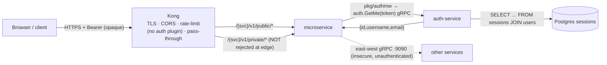

> ⚠️ **SUPERSEDED (2026-07-10).** This review predates the JWT migration — the
> opaque-token/GetMe ground truth it analyzes no longer exists. Superseded by
> **RFC-0009 (implemented) + ADR-006**. Kept for historical context only.

# Auth & API-Gateway Design Review (read-only assessment)

> **Status:** review / finding — **no decision, nothing to implement here.** A
> pre-RFC analysis to read carefully. Open questions are collected at the end.
> _Every choice below is a tradeoff; this doc tries to name both sides, not pick._
>
> _Reviewed: 2026-06-30 — homelab `main`, plus the service repos
> (`auth-service`, `pkg`, `order/product-service`). Evidence is cited file:line._

---

## 0. TL;DR

- **The design is architecturally sound and a legitimate, defensible pattern** —
  an **auth-agnostic, pass-through Kong** + **service-side token validation**. It
  is *not* the textbook "Kong verifies JWT at the edge" pattern you described, but
  it is a valid sibling of it with different tradeoffs.
- **The token is OPAQUE, not a JWT.** auth-service issues 32-byte CSPRNG random
  session tokens stored in Postgres (`sessions`), validated by a stateful lookup
  (`auth.GetMe`). There is no JWT/JOSE/PASETO anywhere.
- **Headline problem — documentation, not architecture:** the docs (incl.
  **ADR-003**, whose title is literally *"JWT validation in services"*) pervasively
  say **"JWT"**. That word is wrong, and it makes ADR-003's central *"don't hand
  Kong the signing key"* rationale moot (an opaque token has no signing key). The
  decision is *more* correct than the ADR argues — but for a different reason.
- **Biggest real gaps vs a production standard:** (1) **no authorization layer at
  all** (authN only, no roles/RBAC anywhere); (2) **east-west is unauthenticated +
  plaintext** and the NetworkPolicy fence isn't enforced by the local CNI;
  (3) auth-service is a **minimal session service**, not an IdP (no refresh/MFA/
  password-reset/OAuth).
- **None of this requires a decision now.** Recommendations at the end are options.

---

## 1. What's actually deployed (ground truth)

### Token type — **opaque session token** (definitive)

`auth-service/internal/logic/v1/service.go:33-41` — 32 random bytes from
`crypto/rand`, base64url-encoded, **no signature, no claims**. Persisted in
Postgres `sessions(token, user_id, expires_at)`
(`db/migrations/sql/000001_init_schema.up.sql:19-25`). Validated by SQL JOIN in
`GetUserByToken` (`service.go:196-230`) — the token *must* be looked up. TTL **24h
hardcoded** (`service.go:103,170`), no refresh, revocation via logout `DELETE`.
`grep jwt|jose|paseto` across all four `go.mod`s → nothing.

### Responsibilities — **as implemented**

| Concern | Kong (gateway) | auth-service | Each microservice | Mesh/Istio |
|---|---|---|---|---|
| TLS termination | ✅ `kong-proxy-tls` (LE wildcard) | — | — | — (none) |
| Routing (pass-through, no rewrite) | ✅ `strip-path:false` | — | mounts Variant-A paths | — |
| Edge hardening | ✅ CORS, rate-limit, req-size, security-headers, correlation-id, Prometheus | — | — | — |
| **Authentication (verify token)** | ❌ **no auth plugin** | ✅ `GetMe` (DB lookup) | ✅ calls `auth.GetMe` via `pkg/authmw` (fail-closed 401/503) | — |
| Token issue / revoke (login/register/logout) | — | ✅ opaque, DB-backed | — | — |
| Identity propagation | passes `Authorization` through | returns `{id,username,email}` | forwards bearer to next hop (re-validated) | — |
| **Authorization (RBAC/ABAC)** | ❌ | ❌ | ❌ | ❌ |
| Refresh / MFA / password-reset / OAuth/OIDC | ❌ | ❌ **not implemented** | ❌ | — |
| Service identity / east-west mTLS | — | — | ❌ `insecure` gRPC today | ❌ (RFC-0002 provisional) |

**Read this as:** Kong authenticates *nothing*; each service authenticates every
`/private/` request by introspecting the opaque token at auth-service. `internal`
routes are simply absent from the gateway (Kong → 404) and *meant* to be fenced by
NetworkPolicy.

---

## 2. Your mental model vs this project

Your description is the **standard, correct, textbook split** (and matches Kong's
own marketing of "authenticate at the edge"). Here's how each box maps:

| Your model (standard) | This project (as built) | Match? |
|---|---|---|
| **IdP / Auth Service**: login, JWT issue, refresh, MFA, password reset, user mgmt, OAuth/OIDC | auth-service: login/register/logout/`GetMe` only — **opaque** token, **no** refresh/MFA/reset/user-CRUD/OAuth | ⚠ partial — it's a *session service*, not an IdP |
| **Kong**: TLS, **verify JWT** (sig/exp/iss/aud), rate-limit, routing, CORS, logging | Kong: TLS, rate-limit, routing, CORS, logging — **but does NOT verify the token** (no jwt plugin; opaque tokens can't be verified at the edge anyway) | ⚠ Kong does everything *except* token verification |
| **Microservice**: authorization (RBAC/ABAC), business logic | services do business logic + **authentication** (introspection) — but **no authorization** exists yet | ⚠ authN yes, authZ missing |
| **Istio**: mTLS, service identity, traffic mgmt | **not deployed**; mTLS is RFC-0002 (provisional); mesh is RFC-0006 (deferred); east-west is plaintext + NetworkPolicy (unenforced on kindnet) | ❌ not present |

**So:** your model is the right target to *evaluate against*. The project
implements a **coherent variant** (opaque token + service-side introspection +
auth-agnostic gateway) and **defers/omits** authorization and mesh.

---

## 3. Is it "standard / correct"?

**Yes, the chosen pattern is standard and valid — there are two mainstream
patterns, and the project picked the other one from the one you assumed:**

- **Pattern A — JWT verified at the gateway** (your model; Kong's `jwt`/`oidc`
  plugin): the IdP signs a self-contained JWT; the gateway checks signature + `exp`
  /`iss`/`aud` and forwards. Per Kong's own docs, *"the provider who issued the JWT
  validates it"* and the gateway only verifies — it never issues tokens or stores
  users.
- **Pattern B — opaque token + introspection at the resource** (this project):
  the token carries no identity; whoever holds it asks the token authority "who is
  this?" (`auth.GetMe` = a hand-rolled introspection endpoint). Kong even ships an
  `oauth2-introspection` plugin for the gateway-side version of this — the project
  just does the introspection in the services instead.

Both are legitimate. The project's choice is **internally consistent**: an opaque
token *cannot* be validated at the edge without a lookup, so pushing validation
into the services (which need the user object anyway) is reasonable.

**Where it diverges from "production standard" (the honest gaps):**

1. **No authorization.** Authentication ≠ authorization. `GetMe` returns
   `{id,username,email}` with **no roles/scopes**, and nothing anywhere does an
   RBAC/ABAC check. Every authenticated user can call every `/private/` route they
   can reach. For a real product this is the most significant gap.
2. **auth-service is not an IdP.** No refresh tokens (24h hard expiry → re-login),
   no MFA, no password reset, no user management, no OAuth/OIDC. Fine for a demo;
   short of "Keycloak/Auth0/Okta-class" responsibilities you listed.
3. **Introspection on every request, uncached.** Pattern B's cost is a gRPC hop +
   a DB `SELECT` per `/private/` request, and auth-service becomes a hot,
   availability-critical dependency. No token/identity cache was found. (Pattern A
   avoids this — JWT is verified locally with no call-out.)
4. **East-west is unauthenticated + plaintext** (see §5).

---

## 4. The headline issue: docs say "JWT", the platform uses opaque tokens

This is a **documentation-accuracy** problem with **design-reasoning** fallout.

The authoritative in-repo fact (`docs/api/microservices.md:73`: *"opaque CSPRNG
session tokens (32-byte, base64url) persisted in `sessions`"*; `local-stack/
compose.yaml:20`: *"opaque-token login flow"*) contradicts the gateway/auth docs,
which say "JWT" and describe JWT-only mechanics:

| Where | Says | Why it's wrong |
|---|---|---|
| `api-naming-convention.md:41` | `Authorization: Bearer <JWT>` | it's a Bearer **opaque** token |
| `kong-gateway.md:177-184` | "services validate the **JWT**… under HS256 hand the signing key to Kong" | opaque token has **no signature/HS256 key** |
| **ADR-003** (title + :11-44) | "validate the **JWT**", "JWTs are minted by auth-service", "signing key (HS256)" | the **central rejection rationale** assumes a signing key that doesn't exist |
| `kong-gateway.md:656` | login returns `jwt-token-v1-...` | mislabels the opaque token |
| `grpc-internal-comms.md`, `microservices.md` | "forward JWT in metadata" | should be "session/bearer token" |

**Why it matters (not pedantry):**

- ADR-003's most persuasive con — *"wiring Kong means handing it the signing key,
  which could mint tokens"* — **evaporates** for an opaque token. The *real* reason
  Kong can't validate is stronger and simpler: **an opaque token is only
  validatable by a stateful `auth.GetMe` lookup; Kong's `jwt` plugin literally
  cannot check it.** Right conclusion, partly-wrong model.
- ADR-003's **revisit trigger** ("if auth-service moves to RS256/ES256") is a
  *category error* as written — you don't move an opaque token to RS256. The real
  trigger is "**if auth-service migrates to signed JWTs**," a much bigger change.
- ADR-003 even hedges ("HS256… not confirmable from this repo") — the author
  sensed the gap but documented the wrong default instead of the in-repo fact.

Minor drift also found: `kong-gateway.md` rate-limit snippet (10/200/5000) vs live
(5/100/2500), and "single Kong replica" vs `replicaCount: 2`.

---

## 5. East-west & mesh (the other real gap)

Today, between services: **plaintext gRPC** (`insecure.NewCredentials()`), **no
inbound auth** on internal gRPC servers, and the NetworkPolicy fence on `:9090` is
**authored but not enforced** (kindnet doesn't enforce NetworkPolicy).
`grpc-internal-comms.md:246-256` states it bluntly: *"any workload that can reach
`:9090` can invoke internal RPCs — including `notification.SendEmail` —
unauthenticated."*

- **RFC-0002** (provisional) — in-process mTLS via `pkg/grpcx` + the existing
  `homelab-ca`/trust-manager; the prioritized next step. mTLS = **service
  identity**, complementary to (not a replacement for) user auth.
- **RFC-0006** (provisional) — service-mesh evaluation; recommendation is **defer
  / stay mesh-less** (ship RFC-0002 instead), prefer Istio Ambient if ever adopted.

Tradeoff framing: mTLS/mesh secures *who the caller service is*; it does **not**
give you user authorization. You'd still need §3.1 (an authz layer) regardless.

---

## 6. Tradeoffs (the part that matters)

**Pattern A (JWT @ gateway) vs Pattern B (opaque + introspection @ service):**

| | Pattern A — JWT @ gateway | Pattern B — opaque + `auth.GetMe` (this project) |
|---|---|---|
| Per-request cost | local verify, **no call-out** | gRPC hop + DB lookup **every request** (uncached) |
| Revocation | hard (token valid until `exp`; needs denylist) | **instant** (delete the session row) — a real strength |
| Blast radius of a leaked key | signing key can **mint** tokens | no signing key; leaked token = one session, revocable |
| Edge can shed bad traffic early | ✅ before it hits pods | ❌ bad tokens still reach a pod |
| Coupling / availability | services independent of IdP at runtime | auth-service is a **hot dependency** (mitigate w/ cache) |
| Secret/key sync across validators | needed (drift risk) | none |
| Statelessness / horizontal scale | stateless | stateful session store |

There is **no free lunch** — Pattern B trades latency + an auth-service dependency
for instant revocation + no key sprawl + a smaller leak blast radius. That is a
reasonable trade for this platform; it is *not* the trade your mental model assumes.

**Centralized (gateway) vs distributed (service) authN** — defense-in-depth /
zero-trust favors *also* validating in the service (don't blindly trust internal
traffic). The project already validates in-service; the open question is whether to
*add* an edge check (Pattern A) for early rejection — at the cost of a second
validator to keep in sync.

---

## 7. Open questions (for you — no answer implied)

**Authorization (biggest):**
1. Do you want an **authorization model** (RBAC/ABAC), and *where* — in `auth.GetMe`
   (return roles), in each service, or a policy engine (OPA/Casbin)? Tradeoff:
   central simplicity vs per-service flexibility vs a new dependency.
2. Should roles live in the token/claims (needs signed JWT → Pattern A) or stay a
   lookup (`GetMe` returns roles)? This couples to Q6.

**Token model:**
3. Keep **opaque + introspection**, or move to **signed JWT** (enables edge
   verification, stateless scale) — accepting harder revocation + key management?
4. If staying opaque: add an **identity cache** (per-service, short TTL) to cut the
   per-request DB lookup? Tradeoff: latency vs staleness window on revocation.
5. **24h hardcoded TTL + no refresh + no session GC** — intended, or do you want
   configurable TTL, refresh tokens, and a cleanup job?

**Gateway:**
6. Do you want Kong to do **early rejection** of unauthenticated `/private/` (an
   `oauth2-introspection` or, post-JWT, a `jwt` plugin) — accepting a second
   validator to keep in sync? Or keep Kong strictly auth-agnostic (current ADR-003)?
7. Is auth-service meant to grow into an **IdP** (MFA, password reset, OAuth/OIDC,
   user mgmt), or stay minimal and front it with **Keycloak/Auth0/Okta** later?
   (This is the single biggest architectural fork.)

**East-west:**
8. Prioritize **RFC-0002 (mTLS)** now? And separately, do internal gRPC servers
   need **inbound auth** (caller identity) regardless of mTLS?
9. Accept that NetworkPolicy is **unenforced** on the local CNI, or move to an
   enforcing CNI / document it as a known local-only gap?

**Docs / process:**
10. Fix the **JWT→opaque** terminology across the docs (a straightforward docs PR)?
11. Since the fix changes ADR-003's *rationale*, supersede it with a **new ADR**
    (ADRs are append-only) that states the correct reason — or just append a
    correction note?
12. Does any of the above (signed tokens / edge auth / authz model) rise to a full
    **RFC**? The backlog already lists *"Kong-JWT reconsideration"* as a candidate.

---

## 8. Recommendations (options, not decisions)

- **Now, low-risk:** a docs PR fixing **JWT → "opaque session token"** in
  `api-naming-convention.md`, `kong-gateway.md`, `grpc-internal-comms.md`,
  `microservices.md`, the `plugins.yaml`/`ingress-api.yaml` comments, and the
  rate-limit/replica drift. Then a **new ADR superseding ADR-003** restating the
  real rationale (*opaque ⇒ stateful introspection ⇒ edge validation impossible by
  construction*). This is "cleanup + a decision record," not an RFC.
- **Per proposals conventions:** this review itself is a **finding** (→ issue
  tracker), not an RFC/ADR. A *substantial* change (introduce authz, or migrate to
  signed JWT, or add edge auth) **is** RFC-worthy and would spawn an ADR.
- **If you want production-grade auth:** the ordered forks are (1) **authorization
  model**, (2) **token/IdP strategy** (grow auth-service vs adopt Keycloak/OIDC),
  (3) **east-west mTLS** (RFC-0002). Each is independent; each has the tradeoffs in §6.

---

## Sources consulted (for the "is it standard?" judgement)

- Kong official: gateway **authentication** overview (key-auth/OAuth2/OIDC/SAML/
  LDAP/introspection) and the **JWT-at-gateway** engineering blog — both confirm
  the gateway **verifies**, never **issues**; the IdP/auth-service issues tokens.
- Industry pattern (gateway-only vs defense-in-depth / zero-trust): validate at the
  edge *and* re-validate in services; authorization belongs with the resource owner.
- In-repo: ADR-003, RFC-0002, RFC-0006, `api-naming-convention.md`,
  `microservices.md`, and the service code cited inline above.

_(External references were used only to evaluate "standard," not copied into the
platform docs.)_
