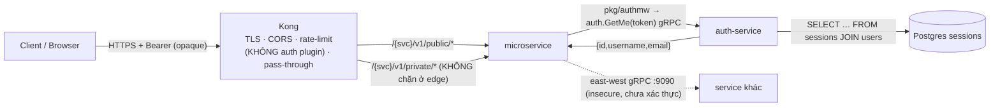
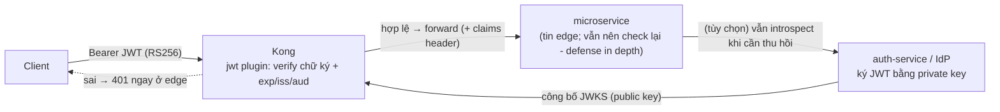
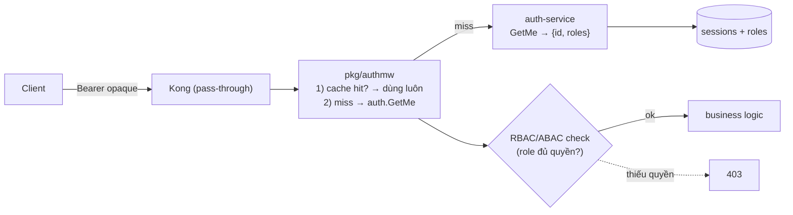
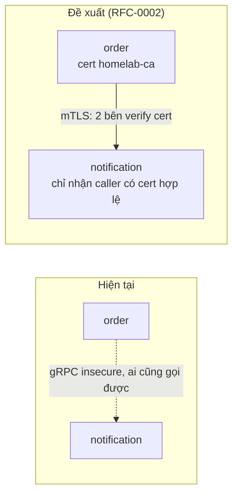

# Đánh giá thiết kế Auth & API Gateway (bản tiếng Việt)

> **Trạng thái:** review / finding — **chưa quyết định, chưa implement gì.** Đây là
> phân tích tiền-RFC để đọc kỹ. Bản tiếng Anh đầy đủ: [`auth-gateway-review.md`](auth-gateway-review.md).
>
> _Mọi lựa chọn dưới đây đều là một đánh đổi (tradeoff) — tài liệu này cố gắng nêu
> cả hai mặt, không tự chọn thay bạn._ Soát: 2026-06-30, nhánh `main` + các repo
> service (`auth-service`, `pkg`, `order/product-service`); dẫn chứng kèm file:line.

---

## 0. Tóm tắt nhanh

- **Thiết kế hợp lý và là một pattern chính thống** — Kong **pass-through, không làm
  auth** + **service tự xác thực token**. Đây *không* phải pattern "Kong verify JWT ở
  edge" như bạn mô tả, mà là **anh em** của nó, khác tradeoff.
- **Token là OPAQUE, không phải JWT.** auth-service phát hành chuỗi ngẫu nhiên 32 byte
  (CSPRNG), lưu trong Postgres bảng `sessions`, xác thực bằng **tra cứu DB** qua
  `auth.GetMe`. Không có JWT/JOSE/PASETO ở bất kỳ đâu.
- **Vấn đề lớn nhất là TÀI LIỆU, không phải kiến trúc:** docs (kể cả **ADR-003**, tên
  literally *"JWT validation in services"*) gọi token là **"JWT"** khắp nơi. Sai từ đó
  khiến lý do trung tâm của ADR-003 *"đừng giao signing key cho Kong"* trở nên **vô
  nghĩa** (opaque token làm gì có signing key). Kết luận của ADR *đúng hơn* nó tưởng —
  nhưng vì một lý do khác.
- **Các gap thật so với chuẩn production:** (1) **không có lớp authorization nào cả**
  (chỉ authN, không role/RBAC ở đâu); (2) **east-west đang plaintext + chưa xác thực**
  và NetworkPolicy **không được CNI local enforce**; (3) auth-service là **session
  service tối giản**, chưa phải IdP (thiếu refresh/MFA/reset/OAuth).
- **Không cần quyết định gì lúc này.** Phần khuyến nghị ở cuối chỉ là các lựa chọn.

---

## 1. Hiện trạng (ground truth)

### Loại token — **opaque session token** (chắc chắn)

`auth-service/internal/logic/v1/service.go:33-41` — 32 byte random từ `crypto/rand`,
base64url, **không chữ ký, không claim**. Lưu ở Postgres `sessions(token, user_id,
expires_at)` (`db/migrations/sql/000001_init_schema.up.sql:19-25`). Xác thực bằng SQL
JOIN trong `GetUserByToken` (`service.go:196-230`) — token **bắt buộc phải tra cứu**.
TTL **24h hardcode** (`service.go:103,170`), không refresh, thu hồi bằng logout
(`DELETE`). `grep jwt|jose|paseto` cả 4 `go.mod` → không có.

### Bảng trách nhiệm — **đúng như đang chạy**

| Hạng mục | Kong (gateway) | auth-service | Mỗi microservice | Mesh/Istio |
|---|---|---|---|---|
| Kết thúc TLS | ✅ `kong-proxy-tls` | — | — | — (chưa có) |
| Routing (pass-through, không rewrite) | ✅ `strip-path:false` | — | mount path Variant-A | — |
| Hardening ở edge | ✅ CORS, rate-limit, req-size, security-headers, correlation-id, Prometheus | — | — | — |
| **Xác thực (verify token)** | ❌ **không có auth plugin** | ✅ `GetMe` (tra DB) | ✅ gọi `auth.GetMe` qua `pkg/authmw` (fail-closed 401/503) | — |
| Phát hành / thu hồi token | — | ✅ opaque, lưu DB | — | — |
| Truyền danh tính | chuyển tiếp `Authorization` | trả `{id,username,email}` | forward bearer sang hop kế (validate lại) | — |
| **Phân quyền (RBAC/ABAC)** | ❌ | ❌ | ❌ | ❌ |
| Refresh / MFA / reset / OAuth | ❌ | ❌ **chưa làm** | ❌ | — |
| Service identity / mTLS east-west | — | — | ❌ gRPC `insecure` | ❌ (RFC-0002 provisional) |

### Diagram — HIỆN TRẠNG

Hiểu nhanh: **Kong không xác thực gì cả**; mỗi service tự introspect opaque token tại
auth-service cho từng request `/private/`. Route `/internal/` chỉ đơn giản *không có*
trên gateway (Kong → 404) và *đáng lẽ* được NetworkPolicy rào lại.

---

## 2. Mental model của bạn vs dự án

Mô tả của bạn là **cách chia chuẩn sách giáo khoa** (và khớp với cách Kong tiếp thị
"xác thực ở edge"). Ánh xạ từng khối:

| Model của bạn (chuẩn) | Dự án (đang build) | Khớp? |
|---|---|---|
| **IdP / Auth Service**: login, phát hành JWT, refresh, MFA, reset, user mgmt, OAuth/OIDC | auth-service: chỉ login/register/logout/`GetMe` — token **opaque**, **không** refresh/MFA/reset/user-CRUD/OAuth | ⚠ một phần — là *session service*, chưa phải IdP |
| **Kong**: TLS, **verify JWT** (sig/exp/iss/aud), rate-limit, routing, CORS, logging | Kong: TLS, rate-limit, routing, CORS, logging — **nhưng KHÔNG verify token** (không jwt plugin; opaque token cũng không verify ở edge được) | ⚠ Kong làm mọi thứ *trừ* verify token |
| **Microservice**: phân quyền (RBAC/ABAC), business logic | service làm business logic + **xác thực** (introspection) — nhưng **chưa có phân quyền** | ⚠ có authN, thiếu authZ |
| **Istio**: mTLS, service identity, traffic mgmt | **chưa deploy**; mTLS = RFC-0002 (provisional); mesh = RFC-0006 (defer); east-west plaintext + NetworkPolicy (kindnet không enforce) | ❌ chưa có |

→ Model của bạn là **mục tiêu đúng để đối chiếu**. Dự án hiện thực một **biến thể hợp
lệ** (opaque + introspection ở service + Kong không auth) và **hoãn/bỏ** phần
authorization & mesh.

---

## 3. Có "đúng chuẩn" không?

**Có — pattern đã chọn là chuẩn và hợp lệ. Có hai pattern chính, dự án chọn cái còn
lại so với cái bạn giả định:**

- **Pattern A — verify JWT ở gateway** (model của bạn; Kong plugin `jwt`/`oidc`): IdP
  ký JWT self-contained; gateway kiểm chữ ký + `exp`/`iss`/`aud` rồi forward. Theo
  chính docs Kong: *"bên phát hành JWT là bên validate nó"*, gateway chỉ verify — không
  bao giờ phát hành token hay lưu user.
- **Pattern B — opaque token + introspection ở resource** (dự án này): token không
  mang danh tính; ai cầm token thì hỏi "đây là ai?" (`auth.GetMe` = introspection tự
  viết). Kong còn có sẵn plugin `oauth2-introspection` cho bản gateway-side; dự án chỉ
  làm introspection ở service thay vì ở gateway.

Cả hai đều hợp lệ. Lựa chọn của dự án **nhất quán**: opaque token *không thể* verify ở
edge mà không tra cứu, nên đẩy việc validate vào service (vốn cần object user) là hợp lý.

**Chỗ lệch so với "chuẩn production" (các gap thành thật):**

1. **Không có phân quyền.** AuthN ≠ AuthZ. `GetMe` trả `{id,username,email}` **không
   có role/scope**, và không nơi nào kiểm RBAC/ABAC. Mọi user đã đăng nhập đều gọi được
   mọi route `/private/` chạm tới được. Với sản phẩm thật, đây là gap lớn nhất.
2. **auth-service chưa phải IdP.** Không refresh token (hết hạn 24h → login lại), không
   MFA, không reset mật khẩu, không user management, không OAuth/OIDC.
3. **Introspection mỗi request, không cache.** Cái giá của Pattern B: mỗi request
   `/private/` tốn 1 hop gRPC + 1 `SELECT` DB, và auth-service thành **dependency nóng,
   critical**. Không thấy cache token/identity. (Pattern A tránh được — verify JWT cục
   bộ, không call-out.)
4. **East-west chưa xác thực + plaintext** (xem §5).

---

## 4. Vấn đề nổi cộm: docs ghi "JWT" nhưng dự án dùng opaque token

Đây là vấn đề **độ chính xác tài liệu** kéo theo hệ quả **lý luận thiết kế**.

Sự thật trong repo (`docs/api/microservices.md:73`: *"opaque CSPRNG session tokens
(32-byte, base64url) … `sessions`"*; `local-stack/compose.yaml:20`: *"opaque-token
login flow"*) mâu thuẫn với docs gateway/auth — vốn ghi "JWT" và mô tả cơ chế chỉ-JWT:

| Ở đâu | Ghi | Vì sao sai |
|---|---|---|
| `api-naming-convention.md:41` | `Authorization: Bearer <JWT>` | thực ra là Bearer **opaque** token |
| `kong-gateway.md:177-184` | "service validate **JWT**… HS256 giao signing key cho Kong" | opaque token **không có chữ ký/khóa HS256** |
| **ADR-003** (tên + :11-44) | "validate **JWT**", "JWT do auth-service mint", "signing key (HS256)" | **toàn bộ lý do từ chối** dựa trên signing key vốn không tồn tại |
| `kong-gateway.md:656` | login trả `jwt-token-v1-...` | gắn nhãn sai cho opaque token |
| `grpc-internal-comms.md`, `microservices.md` | "forward JWT trong metadata" | nên là "session/bearer token" |

**Vì sao quan trọng (không phải bắt bẻ chữ):**

- Lý do thuyết phục nhất của ADR-003 — *"giao signing key cho Kong → Kong mint được
  token"* — **bay hơi** với opaque token. Lý do *thật* mạnh hơn và đơn giản hơn:
  **opaque token chỉ validate được bằng tra cứu stateful `auth.GetMe`; plugin `jwt`
  của Kong về bản chất không kiểm được nó.** Kết luận đúng, nhưng mô hình lý luận sai.
- **Revisit trigger** của ADR-003 ("nếu auth-service chuyển sang RS256/ES256") là một
  *category error* — không ai chuyển opaque token sang RS256. Trigger thật phải là
  "**nếu auth-service đổi sang JWT có chữ ký**", một thay đổi lớn hơn nhiều.
- ADR-003 còn tự hedge ("HS256… không xác nhận được từ repo") — tác giả đã linh cảm
  nhưng ghi default sai thay vì sự thật trong repo.

Lệch nhỏ khác: snippet rate-limit trong `kong-gateway.md` (10/200/5000) vs live
(5/100/2500), và "single Kong replica" vs `replicaCount: 2`.

---

## 5. East-west & mesh (gap thật còn lại)

Hiện tại giữa các service: **gRPC plaintext** (`insecure.NewCredentials()`), **không
xác thực inbound** trên gRPC server nội bộ, và rào NetworkPolicy ở `:9090` **đã viết
nhưng không được enforce** (kindnet không enforce NetworkPolicy).
`grpc-internal-comms.md:246-256` nói thẳng: *"bất kỳ workload nào chạm `:9090` đều gọi
được RPC nội bộ — kể cả `notification.SendEmail` — mà không cần xác thực."*

- **RFC-0002** (provisional) — mTLS in-process qua `pkg/grpcx` + `homelab-ca`/
  trust-manager có sẵn; là bước kế tiếp được ưu tiên. mTLS = **danh tính service**, bổ
  trợ (không thay) cho user auth.
- **RFC-0006** (provisional) — đánh giá service mesh; khuyến nghị **hoãn / không mesh**
  (ship RFC-0002 trước), nếu sau này dùng thì ưu tiên Istio Ambient.

Tradeoff: mTLS/mesh bảo vệ *service gọi là ai*; **không** cho bạn phân quyền user. Dù
có mTLS vẫn cần lớp authz ở §3.1.

---

## 6. Tradeoff (phần quan trọng nhất)

**Pattern A (JWT @ gateway) vs Pattern B (opaque + introspection @ service):**

| | Pattern A — JWT @ gateway | Pattern B — opaque + `auth.GetMe` (dự án) |
|---|---|---|
| Chi phí mỗi request | verify cục bộ, **không call-out** | hop gRPC + tra DB **mỗi request** (không cache) |
| Thu hồi token | khó (token sống tới `exp`; cần denylist) | **tức thì** (xóa row session) — điểm mạnh thật |
| Hậu quả lộ khóa | signing key có thể **mint** token | không có signing key; lộ token = 1 session, revoke được |
| Chặn sớm ở edge | ✅ trước khi vào pod | ❌ token sai vẫn tới pod |
| Coupling / availability | service độc lập IdP lúc runtime | auth-service là **dependency nóng** (giảm = cache) |
| Đồng bộ secret giữa các validator | cần (rủi ro drift) | không cần |
| Stateless / scale ngang | stateless | có state (session store) |

**Không có bữa trưa miễn phí** — Pattern B đổi latency + phụ thuộc auth-service lấy
thu-hồi-tức-thì + không phát tán khóa + blast radius nhỏ hơn khi lộ. Đây là đánh đổi
hợp lý cho platform này; nó *không* phải đánh đổi mà model của bạn giả định.

**AuthN tập trung (gateway) vs phân tán (service):** zero-trust/defense-in-depth ủng hộ
validate *cả* ở service (đừng tin mù lưu lượng nội bộ). Dự án đã validate ở service rồi;
câu hỏi mở là có *thêm* kiểm tra ở edge (Pattern A) để chặn sớm hay không — đổi lại có
2 validator phải đồng bộ.

---

## 7. CÁC DIAGRAM ĐỀ XUẤT (chỉ minh hoạ lựa chọn — chưa chốt)

> Đây là các *phương án*, không phải quyết định. Mỗi cái có tradeoff ở §6.

### Đề xuất A — Verify JWT ở Kong (giống model của bạn)

Đổi auth-service sang phát hành **JWT có chữ ký** (RS256/ES256), Kong giữ **public key**
để verify ở edge. Yêu cầu thay đổi lớn (token model + key mgmt + thu hồi).

### Đề xuất B — Giữ opaque, thêm cache + lớp Authorization

Giữ Pattern B (revoke tức thì), nhưng (1) thêm **cache identity** ngắn hạn ở mỗi service
để bớt tra DB, (2) `GetMe` trả thêm **roles**, (3) thêm **RBAC check** ở service (hoặc
OPA/Casbin).

### Đề xuất C — East-west mTLS (RFC-0002)

Thêm **danh tính service** (mỗi service 1 cert từ `homelab-ca`), thay `insecure` bằng
mTLS trên `:9090`. Bổ trợ cho user-auth, không thay thế.

---

## 8. Câu hỏi mở (cho bạn — không hàm ý đáp án)

**Authorization (lớn nhất):**
1. Có muốn **mô hình phân quyền** (RBAC/ABAC) không, và *ở đâu* — trong `auth.GetMe`
   (trả roles), trong mỗi service, hay policy engine (OPA/Casbin)? Tradeoff: tập trung
   đơn giản vs linh hoạt từng service vs thêm dependency.
2. Roles nằm trong token/claims (cần JWT có chữ ký → Pattern A) hay vẫn tra cứu
   (`GetMe` trả roles)? Liên quan câu 6.

**Mô hình token:**
3. Giữ **opaque + introspection**, hay đổi sang **JWT có chữ ký** (verify ở edge,
   stateless) — chấp nhận thu hồi khó hơn + quản lý khóa?
4. Nếu giữ opaque: thêm **cache identity** (mỗi service, TTL ngắn) để bớt tra DB mỗi
   request? Tradeoff: latency vs cửa sổ stale khi revoke.
5. **TTL 24h hardcode + không refresh + không GC session** — cố ý hay muốn TTL cấu hình
   được, refresh token, và job dọn dẹp?

**Gateway:**
6. Muốn Kong **chặn sớm** request `/private/` chưa xác thực (plugin
   `oauth2-introspection`, hoặc `jwt` sau khi có JWT) — chấp nhận 2 validator phải đồng
   bộ? Hay giữ Kong thuần pass-through (ADR-003 hiện tại)?
7. auth-service có ý định lớn thành **IdP** (MFA, reset, OAuth/OIDC, user mgmt) hay giữ
   tối giản rồi đặt **Keycloak/Auth0/Okta** phía trước sau này? (Đây là ngã rẽ kiến trúc
   lớn nhất.)

**East-west:**
8. Ưu tiên **RFC-0002 (mTLS)** ngay? Và riêng biệt: gRPC server nội bộ có cần **xác thực
   inbound** (danh tính caller) dù đã có mTLS?
9. Chấp nhận NetworkPolicy **không được enforce** trên CNI local, hay chuyển sang CNI có
   enforce / ghi rõ là known local-only gap?

**Docs / quy trình:**
10. Sửa thuật ngữ **JWT → opaque** khắp docs (một docs PR đơn giản)?
11. Vì sửa làm thay đổi *lý do* của ADR-003, nên viết **ADR mới supersede ADR-003**
    (ADR là append-only) nêu lý do đúng — hay chỉ thêm note đính chính?
12. Có hạng mục nào trên đây đủ tầm thành **RFC** không? Backlog đã có
    *"Kong-JWT reconsideration"*.

---

## 9. Khuyến nghị (chỉ là options, chưa quyết)

- **Ngay, rủi ro thấp:** docs PR sửa **JWT → "opaque session token"** ở
  `api-naming-convention.md`, `kong-gateway.md`, `grpc-internal-comms.md`,
  `microservices.md`, comment trong `plugins.yaml`/`ingress-api.yaml`, và lệch
  rate-limit/replica. Kèm **ADR mới supersede ADR-003** nêu lý do thật (*opaque ⇒
  introspection stateful ⇒ không thể validate ở edge by construction*).
- **Theo convention proposals:** review này là **finding** (→ issue tracker), không
  phải RFC/ADR. Thay đổi *lớn* (thêm authz / đổi sang JWT có chữ ký / thêm edge-auth)
  mới đáng làm **RFC** và sẽ sinh ra ADR.
- **Nếu muốn auth cấp production:** thứ tự ngã rẽ là (1) **mô hình authorization**,
  (2) **chiến lược token/IdP** (mở rộng auth-service vs dùng Keycloak/OIDC),
  (3) **east-west mTLS** (RFC-0002). Mỗi cái độc lập, mỗi cái có tradeoff ở §6.

---

## Nguồn tham khảo (để đánh giá "chuẩn")

- Kong chính thức: trang **authentication** (key-auth/OAuth2/OIDC/SAML/LDAP/
  introspection) + blog kỹ thuật **JWT-at-gateway** — đều xác nhận gateway **verify**,
  không **phát hành**; IdP/auth-service mới là bên phát hành token.
- Pattern ngành (gateway-only vs defense-in-depth / zero-trust): validate ở edge *và*
  validate lại ở service; phân quyền thuộc về bên sở hữu resource.
- Trong repo: ADR-003, RFC-0002, RFC-0006, `api-naming-convention.md`,
  `microservices.md`, và code service dẫn inline ở trên.

_(Nguồn ngoài chỉ dùng để đối chiếu "chuẩn", không copy vào docs sản phẩm.)_
