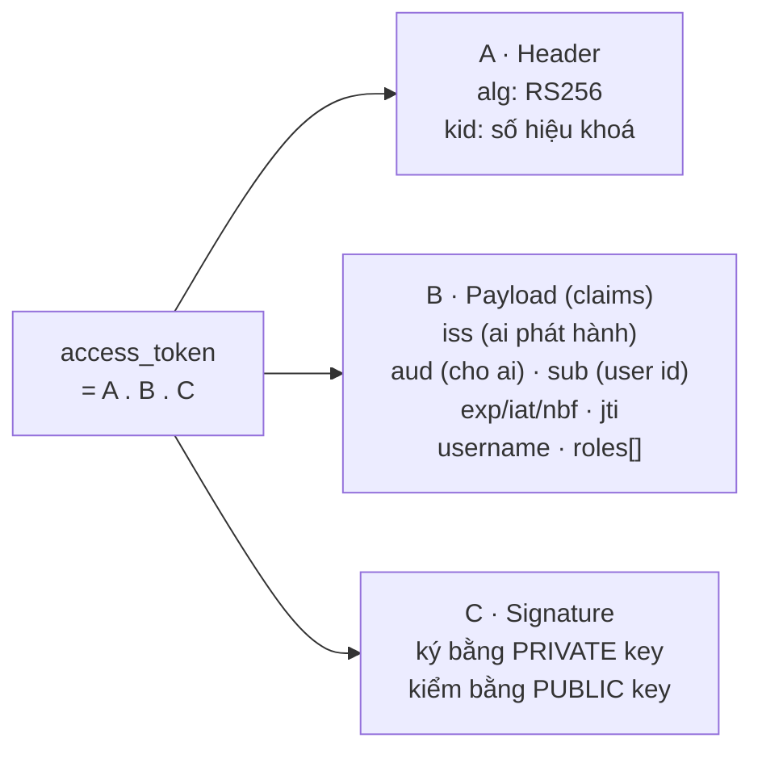
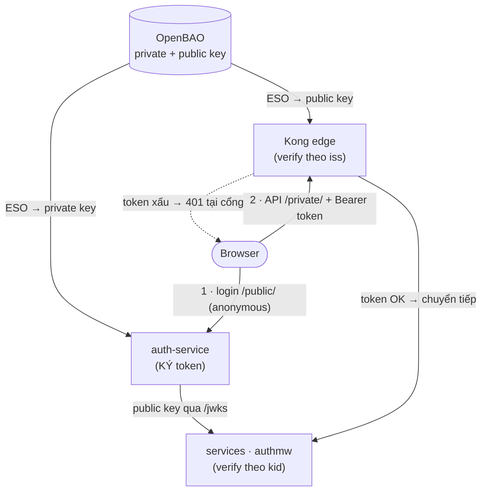
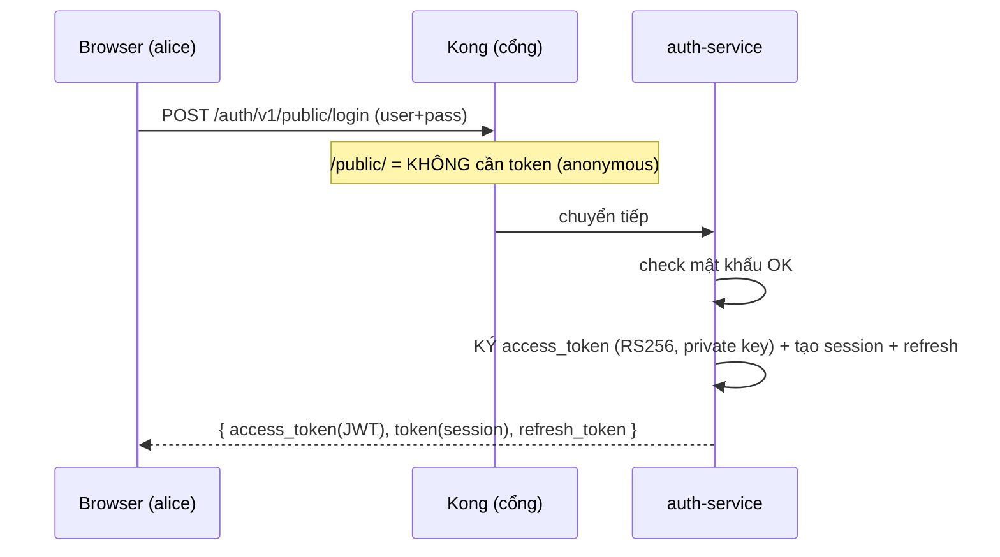
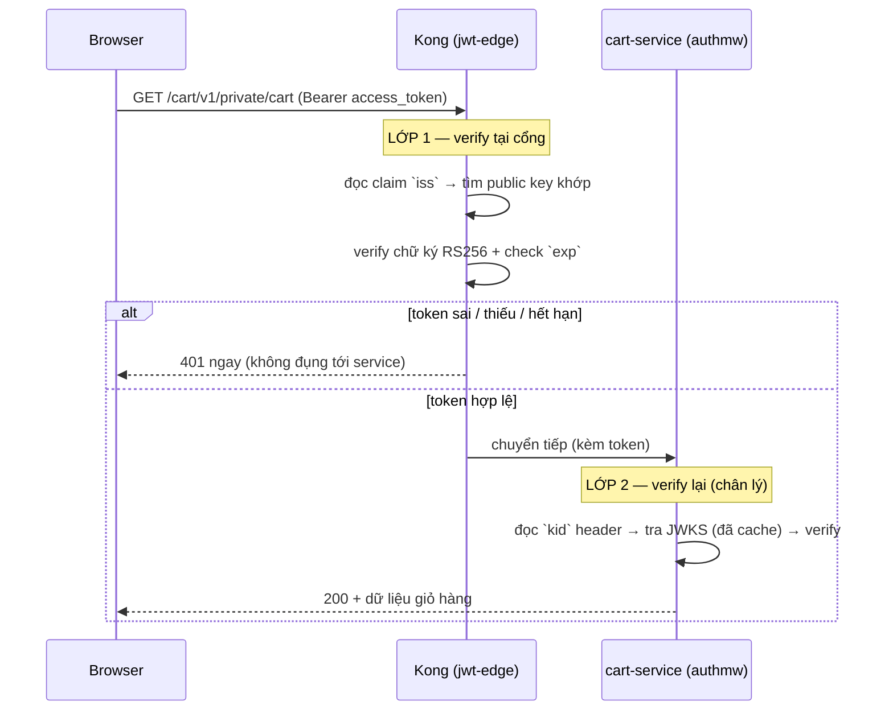
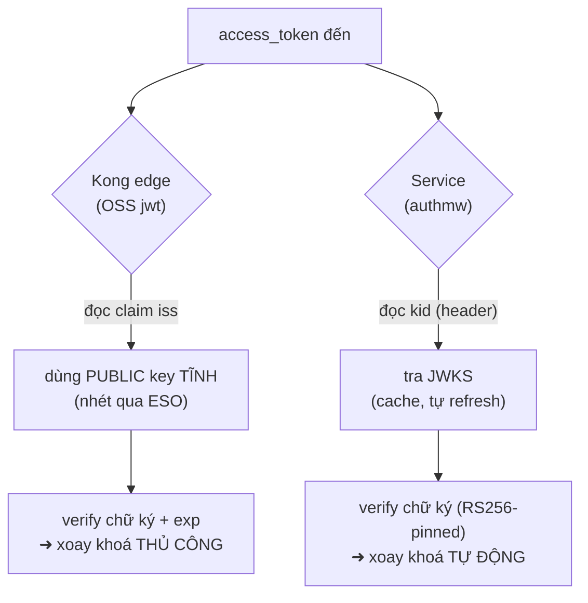
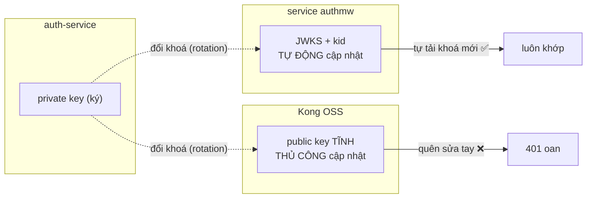

# Kong edge JWT — giải thích dễ hiểu (tài liệu học, không push)

> File này để **tự học/ôn**, viết cho người **không phải BE engineer**. Không
> commit, không push, xoá lúc nào cũng được. Nội dung đối chiếu với code thật
> (auth-service, `pkg/authmw`, `homelab/kubernetes/.../kong`).

---

## 0. TL;DR (đọc 30 giây)

- Đăng nhập xong, bạn nhận **3 loại token** khác nhau, mỗi cái một việc.
- Khi gọi API riêng tư (`/private/`), request bị **kiểm 2 lần**:
  1. **Kong (cổng)** chặn token sai/hết hạn **ngay tại cổng** → trả **401**, không
     tốn tài nguyên service.
  2. **Service** (qua `pkg/authmw`) kiểm lại lần nữa — đây mới là "chân lý".
- Cả hai cùng verify **một chữ ký RS256**. Đây gọi là **defense-in-depth** (phòng
  thủ nhiều lớp) — đúng cách công ty lớn làm.

---

## 1. Vài "nhân vật" (không thuật ngữ nặng)

| Nhân vật | Là gì | Ví von |
|---|---|---|
| **auth-service** | Dịch vụ đăng nhập, **ký** token bằng **private key** (khoá riêng RSA) | Người **đóng dấu** giấy tờ |
| **private key** | Khoá bí mật để **ký**. Chỉ auth-service giữ | Con dấu (không ai được cầm) |
| **public key** | Khoá công khai để **kiểm** chữ ký. Ai cũng có thể có | Mẫu dấu để đối chiếu |
| **JWKS** | Trang web auth công bố **public key** (`/auth/v1/public/jwks`) | Bảng niêm yết "mẫu dấu chuẩn" |
| **Kong** | Cổng (API gateway) đứng trước mọi service | Bảo vệ ở cổng toà nhà |
| **pkg/authmw** | Đoạn code kiểm token **bên trong mỗi service** | Lễ tân kiểm lại lần 2 |
| **OpenBAO + ESO** | Kho khoá bí mật + "người giao khoá" tới auth & Kong | Két sắt + nhân viên giao khoá |

### 3 loại token nhận được sau khi login

| Token | Kiểu | Hạn | Dùng để |
|---|---|---|---|
| `access_token` | **JWT RS256** (tự chứa thông tin, có chữ ký) | **1 giờ** | Gọi API — **cái Kong & service verify** |
| `token` (session) | **opaque** (chuỗi ngẫu nhiên 32 byte, lưu DB) | 24 giờ | Hỏi "tôi là ai" qua gRPC `GetMe` |
| `refresh_token` | **opaque**, chỉ lưu **hash**, xoay vòng | 30 ngày | Xin `access_token` mới khi hết hạn |

> **JWT là gì?** Một chuỗi `A.B.C`: `A`=header (thuật toán + `kid`), `B`=payload
> (các "claim": `iss` ai phát hành, `aud` cho ai, `sub` user id, `exp` hết hạn,
> `jti` id token, `username`, `roles`…), `C`=**chữ ký**. Ai có public key là
> **verify được chữ ký mà không cần hỏi lại auth** → nhanh, không tốn 1 cú gọi mạng.
>
> **opaque token** thì ngược lại: chỉ là chuỗi ngẫu nhiên, **phải hỏi DB** mới biết
> của ai (nên revoke tức thì được, nhưng tốn 1 hop).

### Giải phẫu một JWT (`access_token`)

Một JWT là 3 phần nối bằng dấu chấm: `A.B.C`.

- `Header` + `Payload` chỉ là base64 (ai cũng đọc được — **đừng để bí mật ở đây**).
- `Signature` mới là thứ chống giả mạo: chỉ ai có **private key** mới ký được, ai có
  **public key** đều **kiểm được** (nên verify offline, không cần hỏi lại auth).

### Bức tranh tổng quan (ai giữ khoá gì, verify ở đâu)

Nhớ: **private key chỉ ở auth**; **Kong & services chỉ giữ public key** (Kong lấy
qua ESO, services lấy qua JWKS). Lộ Kong cũng **không ký giả** được token.

---

## 2. Flow 1 — Đăng nhập (lấy token)

Điểm cần nhớ: route `/public/` (login, register, `/jwks`) **không cần token** — nếu
bắt token ở đây thì… không ai đăng nhập được. 🙂

---

## 3. Flow 2 — Gọi API riêng tư (phần quan trọng nhất)

Ví dụ xem giỏ hàng: `GET /cart/v1/private/cart` kèm header
`Authorization: Bearer <access_token>`.

- **Lớp 1 (Kong)** = "bảo vệ ở cổng": lọc rác trước, tiết kiệm tài nguyên pod.
- **Lớp 2 (service)** = "lễ tân": kiểm lại, là nơi **quyết định cuối cùng**. Kể cả
  nếu Kong bị cấu hình sai hoặc bị đi vòng, service vẫn chặn.
- Đây là **defense-in-depth**.

---

## 4. Hai "người gác cổng" verify KHÁC CÁCH nhau

Đây là gốc rễ của cái tradeoff bạn hỏi. Cùng verify 1 token, nhưng lấy khoá khác nhau:

| | **Service** (`pkg/authmw`) | **Kong edge** (OSS `jwt` plugin) |
|---|---|---|
| Lấy public key ở đâu | **JWKS** — tự tải từ `/jwks`, cache, **tự refresh nền** | **1 public key tĩnh** nhét sẵn (qua ESO từ OpenBAO) |
| Chọn đúng key bằng | **`kid`** trong header token | claim **`iss`** (không nhìn `kid`) |
| Khi auth **đổi khoá** | **tự cập nhật** (tải JWKS mới) | **KHÔNG tự** → phải sửa tay |
| Chống alg-confusion | Có (chỉ chấp nhận RS256) | Cấu hình theo credential (RS256) |
| Lỗi hạ tầng | token xấu → **401**; JWKS sập → **503** | token xấu → **401** |

> `kid` (key id) = "số hiệu khoá". auth gắn `kid` vào token; JWKS niêm yết key kèm
> `kid`. Bên nào nhìn `kid` thì **tự biết chọn khoá nào** khi có nhiều khoá →
> **xoay khoá tự động**. Kong OSS **không** nhìn `kid`, chỉ giữ 1 khoá + khớp `iss`.

Cùng một token, hai đường verify:

---

## 5. ⭐ Cái tradeoff bạn hỏi — giải thích bằng lời thường

Câu gốc:
> *OSS jwt: không auto-fetch JWKS (public key config tay), không dùng kid (1 key/iss;
> rotation = update credential, overlap 2 key thủ công). Kong verify bằng static key;
> authmw verify bằng JWKS/kid — cùng verify 1 token, khớp miễn public key = active
> signing key.*

Dịch ra:

1. **"Không auto-fetch JWKS"** → Kong bản miễn phí (OSS) **không biết tự lên trang
   `/jwks` để lấy khoá**. Mình phải **nhét sẵn public key** vào Kong (ở đây: OpenBAO
   → ESO → Secret → Kong). Đó là "config tay".

2. **"Không dùng kid (1 key/iss)"** → Kong không nhìn số hiệu khoá `kid`; nó chỉ giữ
   **một** public key và khớp token bằng `iss`. Tức Kong hiểu: "issuer
   `https://gateway.duynh.me` = đúng một khoá này".

3. **"Rotation = update credential, overlap 2 key thủ công"** → đây là **cái giá**.
   Khi bạn **thay khoá ký** (rotation — nên làm định kỳ cho an toàn):
   - Phía **service** (authmw) tự tải JWKS mới → xong, tự động.
   - Phía **Kong** thì **không tự** → bạn phải **cập nhật credential bằng tay**. Và
     vì token cũ (ký bằng khoá cũ) **còn hạn tới 1 giờ**, trong lúc chuyển giao phải
     để **cả 2 khoá song song** một thời gian, rồi mới bỏ khoá cũ. Đó là "overlap 2
     key thủ công".

4. **"Khớp miễn public key = active signing key"** → chỉ cần **public key trong Kong
   đúng là cặp với private key mà auth đang ký**, thì mọi thứ khớp. Nếu **lệch** (vd
   auth đổi khoá mà quên cập nhật Kong) → **Kong 401 oan tất cả token**. Nên khi
   rotation phải cẩn thận thứ tự.

**Tóm 1 câu:** OSS **rẻ (miễn phí)** nhưng **rotation ở cổng phải làm tay**; bản
**Enterprise/OIDC** sẽ tự động lấy JWKS (hết thủ công) — nhưng **tốn tiền**. Với
homelab/dự án học thì OSS + làm tay là lựa chọn hợp lý.

---

## 6. Các tradeoff khác (ghi kỹ để nhớ)

- **JWT không thu hồi tức thì được (revocation).** JWT tự chứa + có hạn → một khi
  đã phát, **không "rút" lại được** cho tới khi hết hạn. Bù lại:
  - `access_token` **hạn ngắn (1h)** → cửa sổ rủi ro tối đa 1h.
  - `refresh_token` **xoay vòng + phát hiện tái sử dụng** (dùng lại token cũ =
    revoke cả "họ" token) → chống trộm refresh token.
  - (Tuỳ chọn) denylist theo `jti` trong Valkey cho ca "chặn ngay lập tức".
  - Ngược lại `session token` (opaque) **revoke tức thì được** (xoá row DB) — nên
    hệ này giữ **cả hai** kiểu token.
- **401 vs 503 (fail-closed).** token xấu → **401** (từ chối). JWKS/hạ tầng sập →
  **503** (lỗi tạm). Không bao giờ "mở cửa" khi lỗi.
- **Prerequisite: khoá ký phải ổn định.** Nếu `JWT_PRIVATE_KEY_PEM` để trống, auth
  **sinh khoá mới mỗi lần restart** (và prod thì **fatal** — không cho chạy). Nên
  Phase 4 phải cấp **khoá cố định qua OpenBAO** — đó là lý do có bước OpenBAO/ESO.
- **An toàn khoá:** private key **chỉ nằm trong auth-service**; Kong chỉ giữ **public
  key**. Kể cả Kong bị lộ cũng **không ký giả** được token.

---

## 7. "Có giống công ty lớn triển khai không?"

**Có — đúng pattern chuẩn:**
- Signed JWT (RS256) + **JWKS** để verify offline ✅
- **Edge pre-check** ở gateway + **service authoritative** (defense-in-depth) ✅
- **access ngắn hạn + refresh xoay vòng + reuse-detection** ✅
- Private key trong vault (OpenBAO), gateway chỉ có public ✅

**Khác biệt duy nhất so với "full enterprise":** rotation khoá ở **edge** đang làm
tay (do Kong OSS). Công ty mua Kong Enterprise / dùng OIDC plugin thì gateway **tự
discover JWKS** → hết bước tay. Đây là quyết định **tiền bạc**, không phải kiến trúc
sai.

---

## 8. Ghi chú: vì sao RFC-0009 thấy "dư / outdate"?

RFC-0009 dài ~669 dòng. Cảm giác "dư" là **có lý**, nhưng cần hiểu đúng bản chất:

- **RFC = bản thiết kế TẠI MỘT THỜI ĐIỂM** (30/6). Nó ghi *vì sao* quyết định vậy,
  rồi **để nguyên làm hồ sơ lịch sử** — không phải tài liệu sống cập nhật liên tục.
  Nên dài + có giọng "sẽ làm" là bình thường cho một RFC.
- **Chỗ lặp:** "revocation tradeoff" được nhắc **6+ lần**; bảng "OSS vs Enterprise"
  và "decision map" (18 dòng, nói về toàn bộ gateway chứ không riêng JWT) thực chất
  là **living-doc** — nên đọc ở `docs/platform/kong-gateway.md`.
- **Outdate giọng văn:** Phase 1/2/3/6 đã ship rồi nhưng nhiều đoạn vẫn viết kiểu
  "sẽ chuyển…", "sẽ thêm…".

**Cách đọc cho đỡ rối:**
- Muốn biết **hiện tại chạy thế nào** → đọc **living docs**: `docs/platform/kong-gateway.md`,
  `docs/observability/tracing/*`, và **file này**.
- Muốn biết **vì sao thiết kế vậy + các phương án đã cân nhắc** → đọc **RFC-0009**.
- Muốn biết **quyết định chốt** → đọc **ADR-006** (RS256 JWT + Kong edge auth).

> (Optional sau này) Có thể làm 1 PR nhỏ: trim bớt phần lặp trong RFC-0009 + chuyển
> "decision map"/"OSS-vs-Enterprise" sang `kong-gateway.md`. Chưa làm bây giờ.

---

## 9. Bản đồ file (để tra khi cần)

| Muốn xem | File |
|---|---|
| auth ký JWT + JWKS | `auth-service/internal/core/jwt/signer.go` |
| Login trả 3 token | `auth-service/internal/logic/v1/service.go` |
| Service verify (JWKS+kid, 401/503) | `pkg/authmw/authmw.go` |
| Kong plugin jwt-edge + consumer | `homelab/kubernetes/infra/configs/kong/plugins.yaml`, `consumer.yaml` |
| Giao khoá OpenBAO→auth/Kong | `homelab/kubernetes/infra/configs/secrets/auth-jwt-external-secrets.yaml` |
| Split public/private ingress | `homelab/kubernetes/infra/configs/kong/ingress-api.yaml` |
| Bản e2e local (Kong 3.9) | `homelab/local-stack/gateway/kong.yml`, `compose.yaml` |

_Tài liệu học cá nhân — không thuộc tài liệu chính thức của repo._
