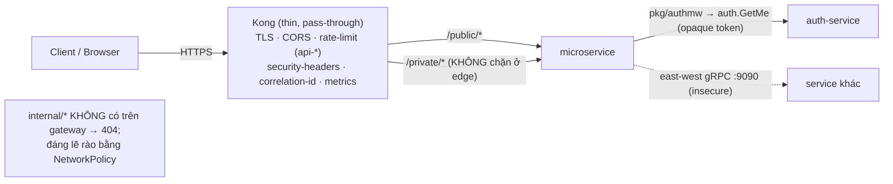
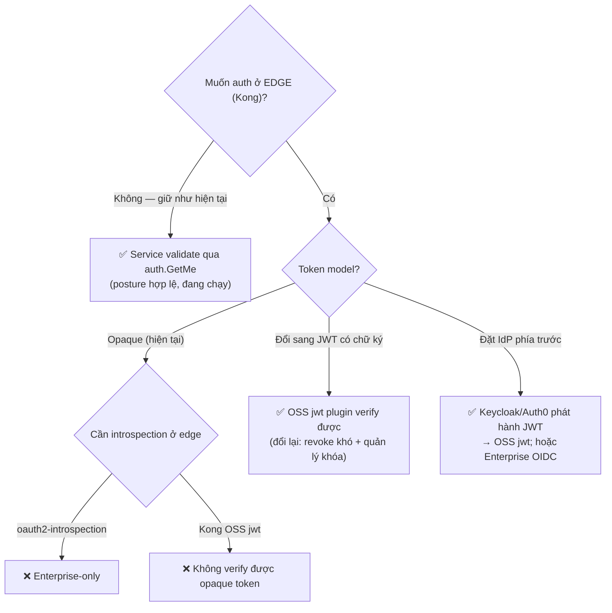
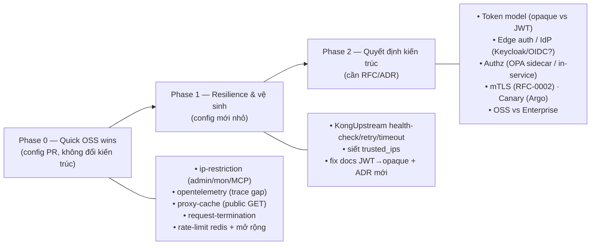
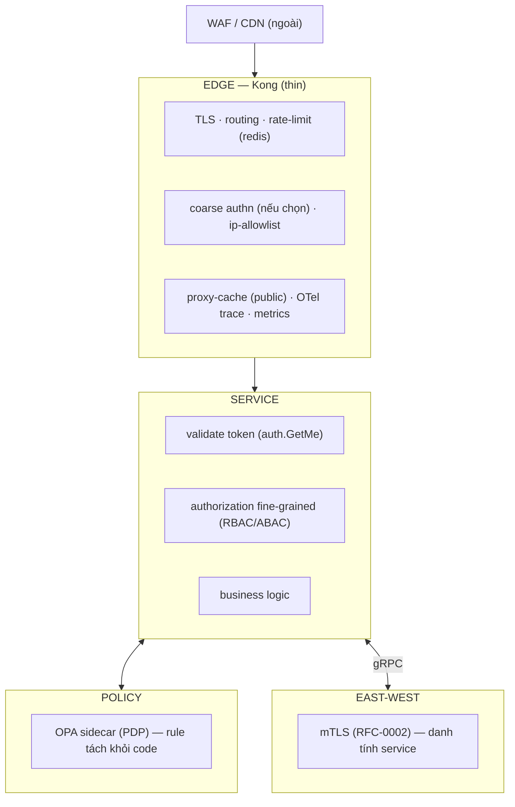

# Kong cấp Production — Đánh giá & Lộ trình (bản tiếng Việt)

> **Trạng thái:** review / finding — **tiền-RFC, chưa implement gì.** Đánh giá sâu,
> mang tính học tập, về cách đưa Kong của dự án tiến gần các công ty trưởng thành —
> **giới hạn thành thật trong những gì Kong OSS làm được.** Bản EN đầy đủ:
> [`kong-production-roadmap.md`](kong-production-roadmap.md). Bài auth liên quan:
> [`auth-gateway-review.vi.md`](auth-gateway-review.vi.md).
>
> _Mọi hạng mục đều là một đánh đổi — tài liệu nêu cả hai mặt, không tự chọn thay
> bạn._ Soát 2026-06-30 (homelab `main` + repo service), dựa trên 3 agent review +
> docs Kong chính thức. Nguồn ngoài chỉ nêu tên, không nhúng link.

---

## 0. Tóm tắt nhanh

- **Gateway hiện tại của bạn ĐÃ là một posture production hợp lý kiểu "thin" — không
  phải "dùng tạm cơ bản".** Bạn cố ý giữ Kong pass-through, validate auth ở service
  (zero-trust), giữ gRPC east-west only, rào `internal` bằng NetworkPolicy, chạy 2
  replica, và quản lý mọi thứ khai báo qua Flux. Đó *đúng* là các lựa chọn cấp
  production — và **tránh được các anti-pattern** kinh điển của gateway (nhét business
  logic ở edge, để gateway là nơi authz duy nhất, tin tưởng mạng nội bộ).
- **"Dùng Kong như công ty lớn" KHÔNG đơn giản là 'bật thêm plugin'.** Có **2 bức
  tường**:
  1. **Bạn chạy Kong OSS (`plugins: "bundled"`)** — các plugin "ngôi sao" của doanh
     nghiệp (**OpenID Connect, oauth2-introspection, mTLS-auth, OPA, request-validator,
     canary, mọi `-advanced`**) **không có trong binary OSS**.
  2. **Token của bạn là opaque + ADR-003 giữ auth ở service** — nên edge-auth OSS
     (`jwt`) không áp dụng được (không có JWT có chữ ký để verify).
- **Vậy roadmap tách rõ:** (A) **quick win OSS làm được ngay** không đổi kiến trúc, và
  (B) **các bước cần quyết định** qua RFC/ADR (token model, edge auth, authz, mTLS,
  OSS-vs-Enterprise).
- **Gap cụ thể nhất là BẢO MẬT, không phải feature:** các ingress monitoring/infra/MCP
  (**Grafana, OpenBAO UI, Postgres UI, Flux UI, RustFS, các MCP endpoint**) đang expose
  **không auth, không rate-limit, không IP allowlist** — chỉ có plugin global. Sửa cái
  này là Phase 0.

---

## 1. Những chỗ bạn ĐÃ đúng chuẩn production (giữ nguyên)

| Nguyên tắc production | Dự án | Đánh giá |
|---|---|---|
| Gateway **mỏng** (route/protect/observe, không business logic) | Kong pass-through, `strip-path:false`, aggregation ở server | ✅ đúng |
| **Zero-trust**: service tự validate, không tin perimeter | `pkg/authmw` validate mọi `/private/` qua `auth.GetMe`, fail-closed | ✅ đúng |
| `internal` rào bằng **network policy**, không phải "vắng route" | NetworkPolicy đã viết (caveat: kindnet không enforce) | ✅ posture đúng, thiếu enforce |
| **Khai báo / GitOps**, không sửa admin API tay | Admin API tắt; CRD qua Flux | ✅ đúng |
| **HA** gateway | 2 replica + PDB | ✅ đúng |
| **TLS termination** cert quản lý | cert-manager LE wildcard | ✅ đúng |
| gRPC **east-west only**, HTTP/JSON north-south | quy tắc cứng trong `grpc-internal-comms.md` | ✅ đúng (lựa chọn có chủ đích) |
| Không `:latest`, resource limit, ẩn fingerprint | đã làm | ✅ đúng |

Bạn **không hề "yếu kém"** ở đây — đây là baseline tốt hơn nhiều team thật. Chỗ cần
lớn lên là **observability propagation, bảo mật edge cho admin UI, resilience, và vài
quyết định kiến trúc**.

---

## 2. Hai bức tường (đọc trước khi ao ước plugin)

### Bức tường 1 — OSS `bundled` vs Enterprise

`plugins: "bundled"` chỉ ship bộ OSS. Plugin Enterprise **không load được** trong binary
này. Phần chia quan trọng:

| Nhóm | OSS (bạn có) | Enterprise-only (bạn không có) | Đường vòng OSS |
|---|---|---|---|
| AuthN | key-auth, **jwt**, basic-auth, hmac-auth, ldap-auth, session(cookie), acl | **openid-connect, oauth2-introspection, mtls-auth, jwt-signer** | OIDC app-side / đặt Keycloak trước; `jwt` nếu đổi sang JWT có chữ ký |
| AuthZ | acl (consumer groups) | **opa, request-validator** | authz trong app / OPA sidecar tự chạy |
| Rate limit | rate-limiting (`local`/`redis`), response-ratelimiting | **rate-limiting-advanced** | dùng `redis` (Valkey sẵn có) |
| Cache | proxy-cache (in-mem, per-node) | **proxy-cache-advanced** (Redis) | proxy-cache in-memory (đủ cho public GET) |
| Transform | request/response-transformer (static) | **`-advanced`** (regex/template) | transform tĩnh |
| Traffic split | weighted **targets** (core) | **canary, route-by-header** | weighted targets, hoặc Argo Rollouts/Flagger; Route `headers` (core) |
| Security | ip-restriction, bot-detection, cors, request-size-limiting, acme | (WAF đầy đủ) | WAF ngoài/CDN, hoặc sidecar Coraza/ModSecurity |
| Observability | **prometheus, opentelemetry, zipkin**, http/file-log, datadog, statsd | — | đã đủ trên OSS |
| Routing/LB | upstreams, targets, health-check active+passive (core) | — | core |

### Bức tường 2 — opaque token + ADR-003

Edge-auth trên OSS Kong = **plugin `jwt` verify JWT có chữ ký**. auth-service của bạn
phát hành **token opaque** (không chữ ký) validate bằng tra cứu `auth.GetMe`. Do đó:

- OSS `jwt` **không** verify được token của bạn (không có gì để verify).
- "Introspect opaque token ở edge" = plugin **`oauth2-introspection`** = **Enterprise**.
- Nên **edge-auth hiện không khả thi trên OSS** với token model này — và *điều đó ổn*,
  vì ADR-003 cố ý giữ auth ở service.

> **Ngã rẽ kiến trúc trung tâm** (Phase 2): muốn edge-auth "như tutorial", phải chọn
> token model trước — giữ opaque (edge-auth cần Kong Enterprise hoặc IdP ngoài), hoặc
> đổi sang **JWT có chữ ký** (OSS `jwt` chạy được, nhưng đánh đổi revoke-tức-thì lấy
> stateless + gánh quản lý khóa). Đây là quyết định token/IdP, không phải bật-tắt Kong.

### "DB-less landmines" (bạn chạy `database: "off"`)

- **Không dùng policy rate-limit `cluster`** (cần datastore) → dùng `local` (per-node,
  xấp xỉ) hoặc **`redis`** (chính xác cluster-wide, cần Valkey trên hot path).
- **`oauth2` (Kong làm authorization server) không chạy** DB-less — đừng biến Kong thành IdP.
- **Consumers + credentials phải khai trong decK/config**, không tạo runtime. Plugin
  dựa consumer (key-auth, acl, rate tier theo consumer) ⇒ phải quản lý consumer trong Git.
- **proxy-cache & state health-check là per-node** (không chia sẻ) trên OSS.

---

## 3. Bản đồ use-case → plugin, áp cho dự án này

| Use-case | Cơ chế Kong | OSS? | Hợp ở đây? | Tradeoff / ghi chú |
|---|---|---|---|---|
| TLS termination | core + cert-manager | ✅ | **đã có** | cleartext ở hop nội bộ → dẫn tới câu hỏi mTLS |
| Routing / discovery | Ingress→Service (KIC) | ✅ | **đã có** | DNS K8s; không cần Consul |
| Rate limit (cơ bản) | rate-limiting | ✅ | **đã có (chỉ api-*)** | mở rộng cho admin/mon; chuyển `redis` để đếm cluster-wide |
| Giới hạn body | request-size-limiting | ✅ | **đã có** | — |
| CORS / sec-headers / correlation-id | cors, response-transformer, correlation-id | ✅ | **đã có** | — |
| **Trace propagation** | **opentelemetry** | ✅ | **gap — giá trị cao** | Kong chưa emit span → trace gap edge→service; OSS plugin feed Tempo/OTel sẵn có; cost = sampling/cardinality |
| **IP allowlist admin UI** | ip-restriction | ✅ | **gap — bảo mật cao nhất** | OpenBAO/pgui/Flux/MCP hở; brittle với IP động nhưng là rào rẻ đầu tiên |
| Cache public GET | proxy-cache (in-mem) | ✅ | **hợp — chỉ public** | per-node, mất khi restart; **không cache `/private/`** (rò chéo user); invalidation khó |
| Maintenance / kill-switch | request-termination | ✅ | **hợp — dễ** | nên trả đúng envelope `{error,code}` |
| Health-check active + retry + timeout | core Upstream/Target | ✅ | **gap — resilience** | cần CRD `KongUpstream` mới; state per-node; retry chỉ method idempotent (rủi ro bão retry) |
| Routing theo header | core Route `headers` | ✅ | tùy chọn | bản OSS thay cho route-by-header Enterprise |
| Canary weighted | weight target upstream | ✅ (cơ bản) | tùy chọn | đè lên deploy Flux/GitOps; per-request canary cần mesh/Enterprise; cân nhắc Argo Rollouts/Flagger |
| Transform request (header) | request/response-transformer | ✅ | hợp (tối thiểu) | rewrite body/path sẽ **phá pass-through** — đừng |
| **Edge authentication** | jwt / openid-connect / oauth2-introspection | jwt OSS; OIDC+introspection **Ent** | **xung đột (Wall 2 + ADR-003)** | opaque ⇒ không có edge-auth OSS; cần quyết token-model hoặc Enterprise |
| **Edge authorization (RBAC)** | acl / opa | acl OSS; opa **Ent** | **xung đột (chưa có authz)** | cần mô hình authz toàn platform trước; authz-chỉ-ở-gateway vốn là anti-pattern |
| Validate schema request | request-validator | **Ent** | giá trị thấp | service đã validate + sở hữu error envelope; schema edge dễ drift |
| mTLS tới upstream | mtls-auth / mesh | **Ent** / mesh | **hoãn** | gắn RFC-0002; đừng nhân đôi PKI trong Kong |
| WAF | (không có trong bundled) | **cần ngoài** | tương lai | CDN/edge WAF hoặc sidecar Coraza |
| gRPC ở edge (transcode/grpc-web) | grpc-gateway / grpc-web | ✅ | **N/A theo thiết kế** | gRPC east-west only; không có gRPC north-south |
| API versioning | path `/v1/` (service sở hữu) | ✅ | **đã có** | pass-through hỗ trợ `/v2` song song |
| Metrics | prometheus | ✅ | **đã có** | coi chừng cardinality label |
| Access log có cấu trúc | http/file-log (hoặc stdout→Vector hiện tại) | ✅ | **đã có** | sampling/redact PII khi scale |

---

## 4. Gap cụ thể của dự án (xếp hạng)

1. **🔴 Admin/observability/MCP hở không auth/limit.** Grafana, **OpenBAO UI**,
   **Postgres operator UI**, Flux UI, RustFS console, các MCP endpoint đi qua Kong chỉ
   với plugin global — không auth, không rate-limit, không IP allowlist. Rủi ro thật lớn nhất.
2. **🟠 Trace gap edge→service.** Kong không emit span / không propagate W3C
   `traceparent` → trace bắt đầu ở service, hop đầu tiên mù dù có cả stack Tempo/OTel/Jaeger.
3. **🟠 Không có authorization.** Chỉ authN; `auth.GetMe` không trả roles. Mọi user đã
   đăng nhập gọi được mọi `/private/` chạm tới.
4. **🟡 Phủ + độ chính xác rate-limit.** Chỉ `api-*` được limit (mon/infra/MCP không), và
   `policy: local` đếm thiếu ×replica.
5. **🟡 Chưa có resilience ở edge.** Không health-check/retry/timeout/circuit-break
   (north-south); routing chỉ Ingress→Service.
6. **🟡 Độ chính xác docs.** Docs ghi "JWT"; token là opaque — sửa thuật ngữ + supersede ADR-003.

---

## 5. Lộ trình theo phase (options, chưa cam kết)

### Phase 0 — Quick win OSS, không đổi kiến trúc (config PR)
| Việc | Plugin | Giá trị | Tradeoff |
|---|---|---|---|
| Khóa ingress admin/mon/MCP | **ip-restriction** (+ rate-limit) | đóng rủi ro #1 | brittle với IP động; cần auth thật về sau |
| Vá trace gap | **opentelemetry** (W3C, OTLP→collector) | trace end-to-end | cost sampling + cardinality |
| Cache đọc public | **proxy-cache** chỉ `/…/public/` GET | giảm latency + tải upstream | per-node, mất khi restart; **không** cho `/private/` |
| Maintenance switch | **request-termination** (body `{error,code}`) | sunset/maintenance an toàn | — |
| Rate-limit chính xác + rộng | rate-limiting **`redis`** (Valkey) + áp mon/infra | limit cluster-wide khắp nơi | Valkey trên hot path (coupling availability) |

### Phase 1 — Resilience & vệ sinh (config mới nhỏ)
| Việc | Cơ chế | Tradeoff |
|---|---|---|
| Health-check active+passive, retry, timeout | core `KongUpstream`/targets | CRD mới; state per-node; bão retry nếu không giới hạn |
| Siết `trusted_ips` từ `0.0.0.0/0` | config Kong | đúng đắn vs tiện khi port-forward |
| Fix thuật ngữ JWT→opaque + supersede ADR-003 | docs + ADR mới | (từ bài auth review) |

### Phase 2 — Quyết định kiến trúc (cần RFC/ADR; chọn có ý thức)
| Ngã rẽ | Lựa chọn (mỗi cái 1 tradeoff) |
|---|---|
| **Token model** | giữ **opaque** (revoke được, stateful, không edge-auth OSS) **vs** **JWT** có chữ ký (verify ở edge OSS, revoke khó + quản lý khóa) |
| **Edge auth** | không (hiện tại, hợp lệ) **vs** OSS `jwt` (cần JWT) **vs** Kong **Enterprise** OIDC/introspection **vs** đặt **Keycloak/Auth0** làm IdP |
| **Authorization** | RBAC trong service **vs** OPA sidecar (PDP) **vs** Enterprise `opa` — gateway coarse, service là quyền cuối |
| **mTLS east-west** | RFC-0002 (in-process, không mesh) **vs** mesh (RFC-0006, đã hoãn) — mTLS ≠ user auth |
| **Canary** | weighted targets OSS **vs** Argo Rollouts/Flagger **vs** Enterprise `canary` |
| **Tier Kong** | giữ **OSS** (+ đường vòng OSS/ngoài) **vs** **Enterprise/Konnect** (OIDC, RL nâng cao, OPA, canary) — quyết định chi phí/ops |

---

## 6. "Như công ty lớn" — sự thật OSS vs Enterprise

Setup Kong "công ty lớn" mà bạn đọc thường giả định **Kong Enterprise/Konnect** (OIDC,
introspection, RL nâng cao, OPA, canary, dev portal) hoặc một **tầng edge/CDN riêng**
(WAF, bot, rate-limit toàn cầu). Trên OSS bạn đạt ~80% giá trị bằng đường vòng có chủ đích:

| Feature "công ty lớn" | Đường OSS cho dự án này |
|---|---|
| OIDC SSO ở edge | đặt **Keycloak** (IdP OIDC) trước auth-service + dùng **JWT có chữ ký** → OSS `jwt`; hoặc OIDC app-side |
| Introspect opaque token ở edge | Enterprise `oauth2-introspection` **hoặc** giữ service-side `auth.GetMe` (bạn đang làm) |
| Authz externalized (OPA) | chạy **OPA sidecar** service query (PEP ở service), không cần plugin Enterprise |
| Rate-limit sliding-window nâng cao | OSS `rate-limiting` + **`redis`** (đủ cho phần lớn) |
| Canary / progressive delivery | **Argo Rollouts / Flagger** ở tầng deploy (hợp GitOps hơn canary ở gateway) |
| WAF | **CDN/edge WAF** hoặc sidecar **Coraza/ModSecurity** trước Kong |
| mTLS east-west | **RFC-0002** mTLS in-process (không mesh) |

Bài học đáng nhớ cho phỏng vấn: **"production-grade" là về layering, zero-trust,
resilience, observability, và vận hành khai báo — không phải đếm số plugin.** Một Kong
OSS mỏng + validate ở service mạnh + kế hoạch mTLS là kiến trúc cấp senior hoàn toàn
hợp lệ; *đánh đổi* bạn chấp nhận là làm edge-auth / RL nâng cao / canary **ngoài** Kong
(app/IdP/Argo) thay vì bằng plugin Enterprise.

---

## 7. Tradeoff cốt lõi (phần "đáng giá phỏng vấn")

- **Edge auth vs service auth:** edge = bớt trùng lặp + chặn sớm; service = zero-trust +
  ngữ cảnh nghiệp vụ. Tốt nhất là *cả hai* (coarse ở edge, cuối cùng ở service) — bạn có
  nửa service; nửa edge cần quyết Wall-2.
- **Opaque vs JWT:** opaque = revoke tức thì, stateful, không verify ở edge; JWT =
  verify ở edge stateless, revoke khó (denylist / TTL ngắn + refresh).
- **`local` vs `redis` rate-limit:** local = không phụ thuộc, sai ×N; redis = chính xác
  nhưng dependency hot-path có thể suy giảm/nới lỏng khi lỗi.
- **Edge cache:** giảm tải/latency nhưng invalidation + rủi ro rò chéo user; chỉ public.
- **Retry:** cải thiện lỗi tạm thời nhưng gây bão retry nếu không có budget; chỉ idempotent.
- **Canary ở gateway vs Argo Rollouts:** split ở gateway thô + đè GitOps; Argo/Flagger
  hợp Flux và cho rollback tự động theo metric.
- **OSS + đường vòng vs Enterprise:** OSS = free, nhiều mảnh phải tự vận hành; Enterprise
  = tích hợp sẵn nhưng tốn license + lock-in.

---

## 8. Câu hỏi mở (cho bạn — không hàm ý đáp án)

1. **Token model:** giữ opaque, hay đổi **JWT có chữ ký**? (Mở khóa edge-auth, và phần
   lớn tutorial "Kong công ty lớn".)
2. **Edge auth:** có thật sự cần không khi service đã validate? Nếu cần → OSS `jwt` (cần
   JWT) / Enterprise OIDC / IdP ngoài (Keycloak)?
3. **Authorization:** đưa RBAC/ABAC vào? Ở đâu — `auth.GetMe` trả roles + check ở
   service, hay **OPA sidecar**? (Gap chức năng lớn nhất.)
4. **Tier Kong:** có cân nhắc **Kong Enterprise/Konnect** không, hay "OSS + công cụ ngoài
   (Keycloak/Argo/CDN-WAF/OPA-sidecar)" là hướng đã chọn? (Quyết định nửa roadmap.)
5. **Bảo mật admin:** ip-restriction ngay, và/hoặc auth thật (OIDC) cho
   Grafana/OpenBAO/pgui/Flux/MCP — cái nào, khi nào?
6. **Rate-limit:** chuyển `redis` (Valkey) để chính xác cluster-wide, và mở rộng cho
   mon/infra/MCP?
7. **Observability:** thêm plugin `opentelemetry` để vá trace gap edge? Tỉ lệ sampling?
8. **Resilience:** thêm `KongUpstream` health-check/retry/timeout north-south?
9. **Caching:** proxy-cache cho public GET — có đáng khi service đã Cache-Aside với
   Valkey nội bộ?
10. **Canary:** weighted-targets ở gateway vs **Argo Rollouts/Flagger** (hợp GitOps hơn)?
11. **mTLS / RFC-0002:** ưu tiên mTLS east-west độc lập với phần gateway?
12. **Docs/quy trình:** cái nào là config-PR vs cần RFC đầy đủ (rồi ADR)? Một "chương
    trình gateway cấp production" có thể là **1 RFC ô dù** với nhiều ADR theo phase.

---

## 9. Khuyến nghị (options, chưa quyết)

- **Làm ngay (config PR, không đổi convention):** Phase 0 — ip-restriction cho các
  ingress admin/mon/MCP đang hở (bảo mật), `opentelemetry` (trace gap), proxy-cache cho
  public GET, request-termination, và rate-limit `redis` mở rộng cho mọi ingress.
- **Tiếp theo (config mới nhỏ):** Phase 1 — health-check/retry/timeout upstream; fix
  docs JWT→opaque + ADR supersede.
- **Quyết định có ý thức (RFC → ADR):** Phase 2 — token model, edge auth, authz, mTLS,
  công cụ canary, và **OSS-vs-Enterprise**. Cách gọn nhất là **1 RFC ô dù "Production-grade
  API gateway"** liệt kê các ngã rẽ, kèm 1 ADR cho mỗi quyết định khi chốt. (`rfc/README.md`
  đã có *"Kong-JWT reconsideration"* trong backlog — đây là nhà của nó.)
- **Theo convention proposals:** review này là **finding** (→ issue tracker / tiền-RFC),
  bản thân nó chưa phải RFC/ADR.

---

## Nguồn tham khảo (nêu tên; không nhúng vào docs sản phẩm)

- Docs Kong chính thức (plugin hub + trang từng plugin) — cho phần OSS-vs-Enterprise và
  ràng buộc DB-less.
- Docs Kong về rate-limiting (local/cluster/redis, consumer groups), health-check &
  circuit breaker, proxy-cache, và plugin OpenTelemetry (W3C `traceparent`).
- AWS Prescriptive Guidance (mô hình OPA: PEP ở gateway *và* service), API7.ai / Curity
  (gateway coarse vs service fine-grained authz; tách policy khỏi code).
- Thực tiễn ngành về layering gateway, zero-trust, anti-pattern; cùng 2 bài blog
  production-architecture bạn đưa (mức cao; chỗ thiếu lấp bằng nguồn trên).
- Trong repo: config Kong hiện tại, `docs/api/*`, ADR-003, RFC-0002/0006, và
  `auth-gateway-review.md`.

_(Nguồn ngoài chỉ để đánh giá "chuẩn", không copy vào docs sản phẩm.)_
