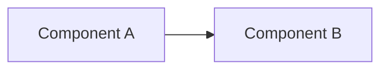

# RFC-NNNN Title

<!-- The title must be short and descriptive. -->

| Status | Scope | Created | Last updated |
|--------|-------|---------|--------------|
| provisional | platform-wide | YYYY-MM-DD | YYYY-MM-DD |

<!--
Status: one of provisional, implementable, implemented, deferred, rejected, withdrawn, replaced.
Scope:  one of infra | service:<name> | platform-wide.
        "infra" = homelab/GitOps; "service:<name>" = a microservice repo; "platform-wide" = both.
Created / Last updated: YYYY-MM-DD.
-->

## Summary

<!-- One paragraph explaining the proposed feature or enhancement. -->

## Motivation

<!-- Why this matters and the benefit to users. -->

### Goals

<!-- Specific goals. How will we know this succeeded? -->

### Non-Goals

<!-- What is explicitly out of scope. -->

## Proposal

<!--
The specifics of what you're proposing — enough detail for reviewers to understand it,
without yet diving into full API/implementation specifics (those go in Design Details).
If the RFC documents best practice, this section can be the documentation itself.
-->

### User Stories

<!-- Optional if discussions/issues are linked above. -->

### Alternatives

<!-- Plausible alternatives and why the proposal is superior. -->

## Architecture & Diagrams

<!--
REQUIRED. At least one Mermaid diagram (flowchart / sequenceDiagram / stateDiagram).
This repo is Mermaid-only — never ASCII art. Show the components, the data/flow, and
where this change sits. Put any image assets in this RFC's directory.
-->

## Design Details

<!--
Enough detail that the specifics are understandable (may include API specs / snippets).
Address at least:
- How is this enabled / disabled?
- Does enabling it change any default behavior?
- Can it be disabled again once enabled?
- How does an operator determine the feature is in use?
- Drawbacks of enabling it?
-->

## Security considerations

<!--
Optional for service-scoped RFCs. Kyverno/PSS impact, secrets handling, NetworkPolicy /
trust boundaries, tenancy/impersonation. State "none" if genuinely not applicable.
-->

## Observability & SLO impact

<!--
Optional for service-scoped RFCs. New metrics/alerts/dashboards, effect on existing SLOs
and error budgets, what to watch during rollout.
-->

## Rollout & rollback

<!--
Optional for service-scoped RFCs. Phased plan, feature gating, fallback path, blast radius,
and how to roll back safely.
-->

## Testing / verification

<!-- How the change is validated end-to-end (tests, drills, manual checks). -->

## Implementation History

<!--
Major milestones: first release with an initial version; GA; retirement/supersession.
-->

## Related

<!-- ADRs this RFC spawned, linked PRs, and related docs. -->
