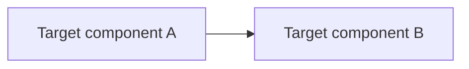

# RFC-NNNN Title

<!-- The title must be short and descriptive. Copy this file ONLY after research.md
     review gate passes and the owner approves "ready for RFC". -->

| Status | Scope | Research | Created | Last updated |
|--------|-------|----------|---------|--------------|
| provisional | platform-wide | [./research.md](./research.md) — gate passed YYYY-MM-DD | YYYY-MM-DD | YYYY-MM-DD |

<!--
Status: one of provisional, implementable, implemented, deferred, rejected, withdrawn, replaced.
        (Use researching in the index only while research.md exists without this README.)
Scope:  one of infra | service:<name> | platform-wide.
Research: link to ./research.md in this folder — required before provisional.
Created / Last updated: YYYY-MM-DD.
-->

> **Don't forget: every decision is a tradeoff.** Make the costs explicit, not just
> the upside — capture the alternatives you rejected and *why* (**Alternatives**),
> and the downsides of the choice (**Design Details → drawbacks**, **Rollout &
> rollback**). An RFC with no stated tradeoff is usually under-analyzed.

## Prerequisites

<!-- Do not publish this RFC until every item below is true. -->

-  merged; [research review gate](./research.md#research-review-gate) ticked
- Context7 audit complete (see research footer)
- Owner approved **ready for RFC**
- **Do not** repeat the mechanism deep-dive here — summarize and link `./research.md`

## Summary

<!-- One paragraph — decision and delta only. Background lives in ./research.md -->

## Motivation

<!-- Why this matters now. Pull facts from research; do not re-teach concepts. -->

### Goals

<!-- Specific goals. How will we know this succeeded? -->

### Non-Goals

<!-- What is explicitly out of scope. -->

## Proposal

<!--
The specifics of what you're proposing — enough detail for reviewers to understand it,
without yet diving into full API/implementation specifics (those go in Design Details).
-->

### User Stories

<!-- Optional if discussions/issues are linked above. -->

### Alternatives

<!--
Decision alternatives — may be a shorter subset of research.md § Alternatives.
Link research for the full plain-language analysis.
-->

## Architecture & Diagrams

<!--
REQUIRED. At least one Mermaid diagram (target state, rollout, or trust boundaries).
May reuse or link mechanism diagrams from ./research.md — duplication OK if labelled.
This repo is Mermaid-only — never ASCII art.
-->

## Design Details

<!--
Enough detail that the specifics are understandable (may include API specs / snippets).
Address at least:
- How is this enabled / disabled?
- Does enabling it change any default behavior?
- Can it be disabled again once enabled?
- How does an operator determine the feature is in use?
- Drawbacks of enabling it?
-->

## Security considerations

<!--
Optional for service-scoped RFCs. Kyverno/PSS impact, secrets handling, NetworkPolicy /
trust boundaries, tenancy/impersonation. State "none" if genuinely not applicable.
-->

## Observability & SLO impact

<!--
Optional for service-scoped RFCs. New metrics/alerts/dashboards, effect on existing SLOs
and error budgets, what to watch during rollout.
-->

## Rollout & rollback

<!--
Optional for service-scoped RFCs. Phased plan, feature gating, fallback path, blast radius,
and how to roll back safely.
-->

## Testing / verification

<!-- How the change is validated end-to-end (tests, drills, manual checks). -->

## Implementation History

<!--
Major milestones: first release with an initial version; GA; retirement/supersession.
-->

## Related

- [./research.md](./research.md) — plain-language research and Context7 audit trail
- <!-- Optional: docs/<area>/<topic>/README.md if spun off -->
- <!-- ADRs spawned when implemented -->
- <!-- Linked PRs -->

---
_Last updated: YYYY-MM-DD_
