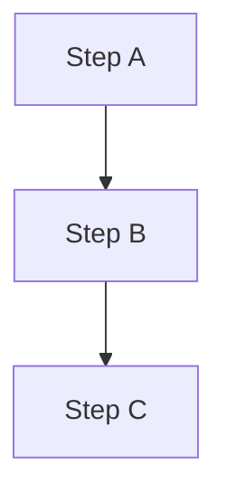
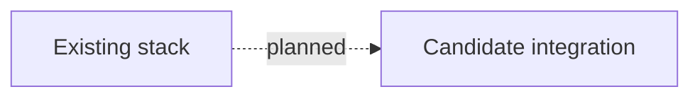

# RFC-NNNN — Research: `<topic>`

<!-- Copy this file when reserving RFC-NNNN. Do NOT copy README.md until the research review gate passes. -->

| | |
|---|---|
| **RFC** | RFC-NNNN *(template — not a live number)* |
| **Status** | researching |
| **Scope** | infra \| service:\<name\> \| platform-wide |
| **Created** | YYYY-MM-DD |
| **Last updated** | YYYY-MM-DD |

<!--
Status: researching only (until README.md exists, then this file stays as the audit trail).
Scope:  "infra" = homelab/GitOps; "service:<name>" = a microservice repo; "platform-wide" = both.
Tone: plain-language deep dive — explain to yourself before deciding. English only.
-->

> **Plain-language research.** Write like a careful blog post, not an RFC. After jargon,
> add **"In plain terms"** blockquotes. Facts must still be verified (Context7 + manifests).
>
> **Start from a real problem.** Frame the topic like a situation you'd hit on the job
> (on-call, design review, incident follow-up, cost/capacity, compliance) — then use
> homelab to learn and prove the approach before deciding in the RFC.

---

## Table of contents

1. [Problem statement](#problem-statement)
2. [Reading path](#reading-path)
3. [What `<topic>` is](#what-topic-is)
4. [Core components](#core-components)
5. [Core mechanism](#core-mechanism)
6. [Glossary](#glossary)
7. [Worked examples](#worked-examples)
8. [vs platform as-built](#vs-platform-as-built)
9. [Integration paths](#integration-paths)
10. [Alternatives](#alternatives)
11. [Open questions](#open-questions)
12. [FAQ](#faq)
13. [References](#references)
14. [Context7 audit log](#context7-audit-log)
15. [Research review gate](#research-review-gate)

---

## Problem statement

<!-- Frame a **real-world problem** — the kind you'd explain in a design doc, incident
     retro, or architecture review at work. Homelab is the safe place to learn it;
     this section is not a vendor evaluation for its own sake. -->

### Real-world trigger

| | |
|---|---|
| **Situation** | <!-- What happened or what was asked? e.g. "Trace queries timeout after 7d retention" --> |
| **Who feels it** | <!-- on-call / platform / security / product / finance --> |
| **Why now** | <!-- incident, new requirement, scale, audit, cost spike --> |
| **If we do nothing** | <!-- concrete outcome: blind spots, toil, risk, bill, SLA miss --> |

> **In plain terms:** <!-- One sentence — what pain are we trying to solve? -->

**Example triggers** *(delete what does not apply — placeholders only):*

- **On-call / incident:** <!-- e.g. "Could not correlate logs across services during outage X" -->
- **Design review:** <!-- e.g. "Team asked for SQL analytics on OTel data without replacing VictoriaLogs" -->
- **Scale / cost:** <!-- e.g. "Cardinality or retention growing faster than budget" -->
- **Compliance / audit:** <!-- e.g. "Need longer retention or queryable history for investigations" -->
- **Toil / ops:** <!-- e.g. "Manual steps every deploy; want GitOps-native operator" -->

### What homelab practice proves

<!-- What will you learn or validate here that answers the real-world trigger?
     Tie to manifests, E2E, or a concrete experiment — still no RFC decision yet. -->

- <!-- e.g. "Can we fan-out OTLP to X without breaking existing backends?" -->
- <!-- e.g. "Does operator Y fit Kind + cert-manager + Kyverno as deployed?" -->

---

## Reading path

Suggested order through this file:

1. [What `<topic>` is](#what-topic-is) → [Core mechanism](#core-mechanism)
2. [vs platform as-built](#vs-platform-as-built) → [Alternatives](#alternatives)
3. [FAQ](#faq) → [Research review gate](#research-review-gate)

---

## What `<topic>` is

<!-- Concept framing for the technology or change. -->

> **In plain terms:** <!-- One analogy or one-sentence restatement. -->

---

## Core components

| Component | Role |
|-----------|------|
| `<component-A>` | <!-- --> |
| `<component-B>` | <!-- --> |

---

## Core mechanism

<!-- Deep dive. At least one Mermaid diagram. Label the diagram's question in prose
     (e.g. "Mechanism — how data moves on disk"). -->

> **In plain terms:** <!-- Explain the diagram in everyday language. -->

---

## Glossary

| Term | In plain English |
|------|------------------|
| `<term>` | <!-- one line --> |

---

## Worked examples

> **Not deployed** — syntax and mechanism only; homelab may not run this yet.

<!-- Small concrete tables or snippets that are easy to picture. -->

---

## vs platform as-built

<!-- Compare `<topic>` with what homelab already runs. Cross-check kubernetes/ manifests
     and relevant docs. Mark planned vs deployed explicitly. -->

| Aspect | Platform today | `<topic>` (candidate) |
|--------|----------------|------------------------|
| <!-- --> | <!-- deployed --> | <!-- planned or N/A --> |

---

## Integration paths

<!-- How `<topic>` could plug in — all **planned** until manifests exist. -->

---

## Alternatives

<!-- At least two plausible options. Plain-language pros/cons — decision stays open. -->

| Option | Pros | Cons |
|--------|------|------|
| `<alternative-A>` | | |
| `<alternative-B>` | | |

---

## Open questions

<!-- What still needs owner input before writing RFC README.md? -->

- [ ] <!-- -->

---

## FAQ

**<!-- Question? -->**

<!-- Plain answer. -->

---

## References

<!-- Official product docs only. Synthesize in-house — no embedded third-party tutorials. -->

- <!-- -->

---

## Context7 audit log

<!-- Record Context7 (or official doc) queries and corrections applied in this file. -->

| Claim / section | Source checked | Result |
|-----------------|----------------|--------|
| <!-- --> | <!-- --> | confirmed / corrected |

---

## Research review gate

<!-- All boxes must be ticked before copying RFC-0000/README.md → RFC-NNNN/README.md.
     Paste this checklist into the PR when requesting "ready for RFC". -->

- [ ] Answers a **real-world problem** you'd recognize at work (on-call, design review,
      incident, scale, compliance) — not generic vendor marketing
- [ ] **Problem statement** names situation, who feels it, and cost of doing nothing
- [ ] At least **two alternatives** documented with tradeoffs
- [ ] **Platform as-built** section filled from manifests/docs (not boilerplate)
- [ ] Primary use-case direction stated (may remain "undecided")
- [ ] **Context7 audit** complete; footer date updated
- [ ] At least **one Mermaid** diagram; labels match deployed vs **planned** reality
- [ ] No Kubernetes manifest changes smuggled into this research file
- [ ] Owner sign-off: **ready for RFC**

---

_Last verified: YYYY-MM-DD (Context7 + manifest cross-check)._
