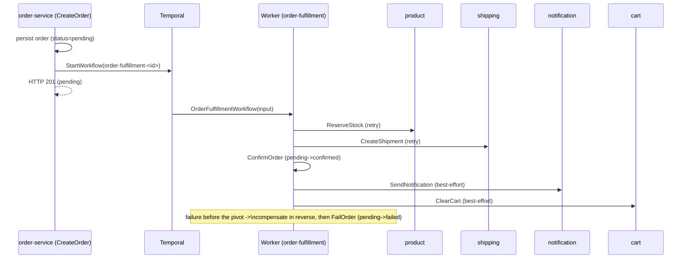
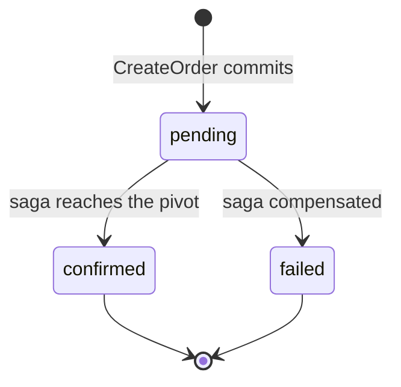
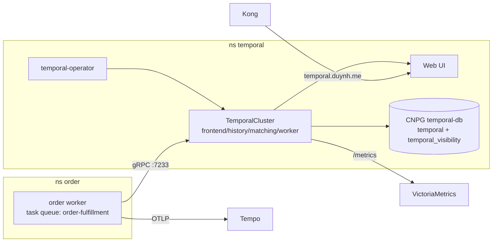

# RFC-0001 Temporal for durable cross-service orchestration

| Status | Scope | Created | Last updated |
|--------|-------|---------|--------------|
| implemented | platform-wide | 2026-06-26 | 2026-06-26 |

> This is a **retrospective** RFC: Temporal order-fulfillment is already shipped and
> verified. It exists as the worked example for the [RFC process](../README.md) and as
> the single home for Temporal's remaining roadmap (see [Future work](#future-work)).
> The operational reference — endpoints, deploy/run, ops — stays in
> [`docs/api/temporal-order-fulfillment.md`](../../../api/temporal-order-fulfillment.md);
> this RFC owns the *why*, the *design rationale*, and the *roadmap*.

## Summary

Replace checkout's synchronous, fire-and-forget post-commit side-effects with a
**durable Temporal saga**: reserve stock → create shipment → confirm the order
(**the pivot**) → notify → clear cart, with per-step retries and reverse
compensation. `CreateOrder` returns `201 pending` immediately; the workflow drives the
order to `confirmed` or `failed`.

## Motivation

Previously `order-service` committed the order row, then made best-effort calls on
**detached contexts** to notification (gRPC) and cart-clear (REST). The result:

- **No durability / retry** — a failed downstream call or a pod restart silently lost the side-effect.
- **Inventory was a TODO** — stock was never decremented at checkout.
- **No shipment** created proactively.
- **No compensation** — a partial failure (stock taken, shipment failed) left an inconsistent state with no rollback.

These are the textbook problems a workflow engine solves. Temporal gives **durable
execution** (state persisted per step; crash resumes where it left off), policy-based
**retries**, and the **saga pattern** (append a compensation per success, run them in
reverse on failure) as ordinary, testable Go.

### Goals

- Every checkout reaches a **terminal state** — fully `confirmed` or cleanly rolled back (`failed`, stock released, shipment cancelled).
- **Inventory actually reserved** (atomic, DB-enforced, idempotent).
- **Durable + self-healing** across worker/pod restarts; transient downstream failures retried.
- **Observable** — every execution + history visible; spans flow to Tempo.

### Non-Goals

- A generic workflow platform for all services (order fulfillment is the flagship/only workflow today).
- Synchronous, low-latency request/response work (use a plain handler — see the when-to-use table).
- east-west **mTLS** for the worker↔cluster link (NetworkPolicy is the interim fence — tracked in the [mTLS backlog RFC](../README.md#backlog--candidate-rfcs)).

## Proposal

Adopt **Temporal** (durable execution) and model order fulfillment as a saga started
from `CreateOrder` right after the order row commits. Workflow ID
`order-fulfillment-<orderID>` (dedups a retried start); task queue `order-fulfillment`.

| # | Step → service | Compensation | Notes |
|---|----------------|--------------|-------|
| 1 | `ReserveStock` → product (gRPC) | `ReleaseStock` | atomic decrement + `stock_reservations` ledger; insufficient stock is **non-retryable** |
| 2 | `CreateShipment` → shipping (gRPC) | `CancelShipment` | idempotent by `order_id` |
| 3 | **`ConfirmOrder`** → order core | `FailOrder` | `pending → confirmed` — **the pivot** |
| 4 | `SendNotification` → notification (gRPC) | — | best-effort (post-pivot) |
| 5 | `ClearCart` → cart (REST) | — | best-effort (post-pivot) |

**The pivot:** anything failing through `ConfirmOrder` runs the registered
compensations in reverse and marks the order `failed`. After `ConfirmOrder`, steps 4–5
are best-effort — a failed notification/cart-clear never rolls back a confirmed order.

### When to use Temporal (and when not)

| Reach for Temporal when… | Use a plain call/handler when… |
|---|---|
| Work spans **multiple services** and must be **all-or-nothing** with compensation | Single-service CRUD or read |
| Steps must **survive restarts** and be **retried** | Operation is idempotent and a client retry is fine |
| Flow is **long-running** (waits, timers, polling) | Synchronous low-latency hot path |
| You need **visibility** into in-flight/stuck executions | Fire-and-forget at-most-once is acceptable |

### Alternatives

Considered and rejected in **[ADR-001](../../adr/ADR-001-adopt-temporal-for-order-fulfillment/)**:
transactional outbox, message-queue choreography, hand-rolled orchestration. Temporal won
on durable execution + first-class compensation + execution visibility.

## Architecture & Diagrams

**Saga sequence** (compensation on pre-pivot failure):

**Order state machine:**

**Infrastructure topology:**

## Design Details

- **Deployment:** the **`alexandrevilain/temporal-operator`** (HelmRelease, chart `0.6.0`)
  installs the `TemporalCluster`/`TemporalNamespace` CRDs; webhook certs via cert-manager.
  Why the operator over the official Helm chart / vendored manifests is in
  **[ADR-002](../../adr/ADR-002-deploy-temporal-via-operator/)**.
- **Cluster:** server **`1.24.2`** (operator chart caps `<1.25.0`; bump tracked below),
  `numHistoryShards: 512`, persistence on the CNPG `temporal-db` (`temporal` +
  `temporal_visibility`) via the generated `temporal-db-app` secret, Web UI + admintools +
  `ServiceMonitor` enabled, resources set for Kyverno. `mop` `TemporalNamespace`, 168h retention.
- **Worker:** a `worker` subcommand (mirrors `migrate`), shipped as a **second `mop`
  release** (`order-worker`, `args: ["worker"]`, `service.enabled: false`); serves
  `/health`, `/ready`, `/metrics`.
- **Contracts** (in `duynhlab/pkg`, all idempotent): product `ReserveStock`/`ReleaseStock`,
  shipping `CreateShipment`/`CancelShipment`; `pkg/temporalx` bootstraps the client/worker
  with the OTel tracing interceptor.
- **Idempotency** is DB-enforced: product `stock_reservations` (PK `reservation_id,product_id`),
  shipping `UNIQUE(order_id)` — so activity retries are safe.
- **Enable/disable & default behavior:** checkout is async by default. If Temporal is
  unavailable the order is still created (`pending`) and the start is logged — **checkout
  never fails on Temporal**. The workflow start lives in the web handler so the logic layer stays Temporal-free.
- **Flux order:** `controllers → temporal-operator`; `databases → temporal-db`; a `temporal`
  Kustomization (`dependsOn` databases) before `apps`; `order-worker` `dependsOn` temporal.

## Security considerations

- Worker↔cluster gRPC `:7233` is **plaintext** today; NetworkPolicy is the fence. east-west
  mTLS is a platform-wide backlog RFC.
- `ClearCart` currently carries the caller's bearer token in the workflow **input/history**
  (homelab simplification). The internal NetworkPolicy-fenced cart-clear (future work) drops it.

## Observability & SLO impact

- Temporal **server** metrics scraped via `ServiceMonitor`; alerts `TemporalServerDown`,
  `TemporalServiceErrorRateHigh`, `TemporalPersistenceErrorRateHigh`.
- Worker exposes gRPC RED + Go-runtime metrics; workflow/activity spans join the request's
  trace in Tempo. **Workflow/activity RED metrics** are still missing (future work).

## Testing / verification

- `testsuite` unit tests cover the saga pivot + reverse compensation.
- Verified end-to-end on `local-stack`: a checkout drives the full saga to `confirmed`; an
  over-quantity checkout fails fast (non-retryable) and rolls back.
- Live durability (kill-the-worker, mid-saga compensation) **GameDay drills** are future work.

## Future work

Owned here (replaces the roadmap previously inline in `temporal-order-fulfillment.md` §9):

- ⏳ **Bump server 1.24.2 → 1.27.x** once the operator re-publishes its chart for v0.22.0 (ADR-002; Renovate-tracked).
- ⏳ **Cache-bust on reserve** — invalidate the product Valkey cache on `ReserveStock`/`ReleaseStock` (stale reads ~10 min until TTL today; DB is authoritative).
- ⏳ **Workflow/activity RED metrics + burn alerts** via a Temporal SDK `MetricsHandler` in `pkg/temporalx`.
- ⏳ **Grafana dashboard** adapted from `temporalio/dashboards` `server-general.json`.
- ⏳ **Internal cart-clear** (NetworkPolicy-fenced, by user id) so the bearer token leaves workflow input/history.
- ⏳ **temporal-db HA + Barman backups** (single instance today; undefined RPO/RTO).
- ⏳ **GameDay drills** for durability + live mid-saga compensation paths.

## Implementation History

- Phase 1b — operator + `TemporalCluster`/`temporal-db` deployed; `pkg` contracts + `temporalx` (tagged `pkg v0.7.0`).
- Phase 8 — server-metric alerts; saga marked implemented; end-to-end verified.
- See `CHANGELOG.md` for dated entries.

## Related

- ADRs: [ADR-001 Adopt Temporal](../../adr/ADR-001-adopt-temporal-for-order-fulfillment/), [ADR-002 Deploy via the operator](../../adr/ADR-002-deploy-temporal-via-operator/).
- Operational reference: [`docs/api/temporal-order-fulfillment.md`](../../../api/temporal-order-fulfillment.md).
- East-west transport: [`docs/api/grpc-internal-comms.md`](../../../api/grpc-internal-comms.md).
