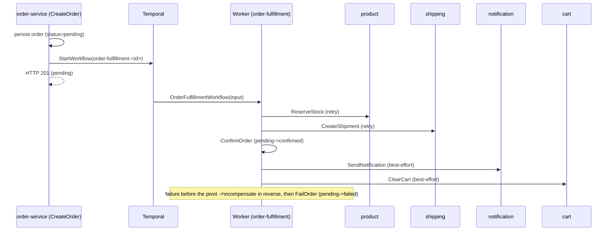
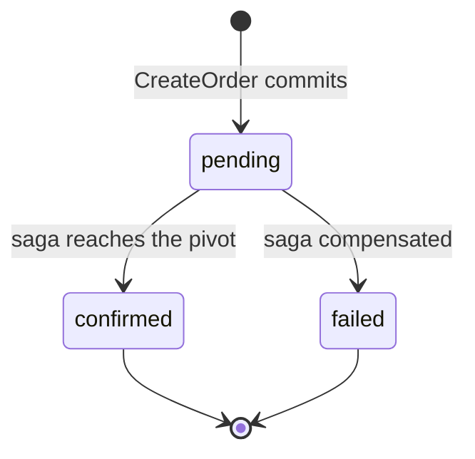
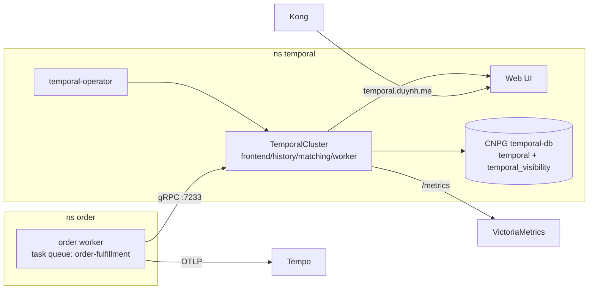

# RFC-0001 Temporal for durable cross-service orchestration

| Status | Scope | Created | Last updated |
|--------|-------|---------|--------------|
| implemented | platform-wide | 2026-06-26 | 2026-07-28 |

> This is a **retrospective** RFC: Temporal order-fulfillment is already shipped and
> verified. It exists as the worked example for the [RFC process](../README.md) and as
> the single home for Temporal's remaining roadmap (see [Future work](#future-work)).
> The operational reference — endpoints, deploy/run, ops — stays in
> [`docs/api/temporal.md`](../../../api/temporal.md);
> this RFC owns the *why*, the *design rationale*, and the *roadmap*.

> **Deployment superseded (2026-07-28).** The infrastructure topology and version
> notes below describe the **retired** alexandrevilain temporal-operator
> deployment (`TemporalCluster`/`TemporalNamespace`, server 1.24.2) as it stood
> when this RFC shipped. Temporal now runs from the official
> `temporalio/helm-charts` release (server 1.31.2) — see
> [ADR-030](../../adr/ADR-030-temporal-workflow-versioning/) for the re-platform
> and the Worker Versioning requirement that forced it, and
> [`docs/api/temporal.md`](../../../api/temporal.md)
> for the current topology. The Temporal *adoption* decision (ADR-001) and this
> RFC's design rationale stand; only the deployment mechanism changed. The
> "upgrade 1.24.2 → 1.27.x" roadmap item in Future work is obsolete.

## Summary

Replace checkout's synchronous, fire-and-forget post-commit side-effects with a
**durable Temporal saga**: reserve stock → create shipment → confirm the order
(**the pivot**) → notify → clear cart, with per-step retries and reverse
compensation. `CreateOrder` returns `201 pending` immediately; the workflow drives the
order to `confirmed` or `failed`.

## Motivation

Previously `order-service` committed the order row, then made best-effort calls on
**detached contexts** to notification (gRPC) and cart-clear (REST). The result:

- **No durability / retry** — a failed downstream call or a pod restart silently lost the side-effect.
- **Inventory was a TODO** — stock was never decremented at checkout.
- **No shipment** created proactively.
- **No compensation** — a partial failure (stock taken, shipment failed) left an inconsistent state with no rollback.

These are the textbook problems a workflow engine solves. Temporal gives **durable
execution** (state persisted per step; crash resumes where it left off), policy-based
**retries**, and the **saga pattern** (append a compensation per success, run them in
reverse on failure) as ordinary, testable Go.

### Goals

- Every checkout reaches a **terminal state** — fully `confirmed` or cleanly rolled back (`failed`, stock released, shipment cancelled).
- **Inventory actually reserved** (atomic, DB-enforced, idempotent).
- **Durable + self-healing** across worker/pod restarts; transient downstream failures retried.
- **Observable** — every execution + history visible; spans flow to Tempo.

### Non-Goals

- A generic workflow platform for all services (order fulfillment is the flagship/only workflow today).
- Synchronous, low-latency request/response work (use a plain handler — see the when-to-use table).
- east-west **mTLS** for the worker↔cluster link (NetworkPolicy is the interim fence — tracked in the [mTLS backlog RFC](../README.md#backlog--candidate-rfcs)).

## Proposal

Adopt **Temporal** (durable execution) and model order fulfillment as a saga started
from `CreateOrder` right after the order row commits. Workflow ID
`order-fulfillment-<orderID>` (dedups a retried start); task queue `order-fulfillment`.

| # | Step → service | Compensation | Notes |
|---|----------------|--------------|-------|
| 1 | `ReserveStock` → product (gRPC) | `ReleaseStock` | atomic decrement + `stock_reservations` ledger; insufficient stock is **non-retryable** |
| 2 | `CreateShipment` → shipping (gRPC) | `CancelShipment` | idempotent by `order_id` |
| 3 | **`ConfirmOrder`** → order core | `FailOrder` | `pending → confirmed` — **the pivot** |
| 4 | `SendNotification` → notification (gRPC) | — | best-effort (post-pivot) |
| 5 | `ClearCart` → cart (REST) | — | best-effort (post-pivot) |

**The pivot:** anything failing through `ConfirmOrder` runs the registered
compensations in reverse and marks the order `failed`. After `ConfirmOrder`, steps 4–5
are best-effort — a failed notification/cart-clear never rolls back a confirmed order.

### When to use Temporal (and when not)

| Reach for Temporal when… | Use a plain call/handler when… |
|---|---|
| Work spans **multiple services** and must be **all-or-nothing** with compensation | Single-service CRUD or read |
| Steps must **survive restarts** and be **retried** | Operation is idempotent and a client retry is fine |
| Flow is **long-running** (waits, timers, polling) | Synchronous low-latency hot path |
| You need **visibility** into in-flight/stuck executions | Fire-and-forget at-most-once is acceptable |

### Alternatives

Considered and rejected in **[ADR-001](../../adr/ADR-001-adopt-temporal-for-order-fulfillment/)**:
transactional outbox, message-queue choreography, hand-rolled orchestration. Temporal won
on durable execution + first-class compensation + execution visibility.

## Architecture & Diagrams

**Saga sequence** (compensation on pre-pivot failure):

```mermaid
sequenceDiagram
    participant API as order-service (CreateOrder)
    participant T as Temporal
    participant W as Worker (order-fulfillment)
    participant P as product
    participant S as shipping
    participant N as notification
    participant C as cart

    API->>API: persist order (status=pending)
    API->>T: StartWorkflow(order-fulfillment-<id>)
    API-->>API: HTTP 201 (pending)
    T->>W: OrderFulfillmentWorkflow(input)
    W->>P: ReserveStock (retry)
    W->>S: CreateShipment (retry)
    W->>W: ConfirmOrder (pending->confirmed)
    W->>N: SendNotification (best-effort)
    W->>C: ClearCart (best-effort)
    Note over W: failure before the pivot ->\ncompensate in reverse, then FailOrder (pending->failed)
```

**Order state machine:**

```mermaid
stateDiagram-v2
    [*] --> pending: CreateOrder commits
    pending --> confirmed: saga reaches the pivot
    pending --> failed: saga compensated
    confirmed --> [*]
    failed --> [*]
```

**Infrastructure topology:**

```mermaid
flowchart LR
    subgraph ns_temporal[ns temporal]
        OP[temporal-operator]
        TC[TemporalCluster<br/>frontend/history/matching/worker]
        UI[Web UI]
        TDB[(CNPG temporal-db<br/>temporal + temporal_visibility)]
        OP --> TC
        TC --> TDB
        TC --> UI
    end
    subgraph ns_order[ns order]
        OW[order worker<br/>task queue: order-fulfillment]
    end
    OW -- gRPC :7233 --> TC
    Kong[Kong] -- temporal.duynh.me --> UI
    TC -- /metrics --> VM[VictoriaMetrics]
    OW -- OTLP --> Tempo
```

## Design Details

- **Deployment:** the **`alexandrevilain/temporal-operator`** (HelmRelease, chart `0.6.0`)
  installs the `TemporalCluster`/`TemporalNamespace` CRDs; webhook certs via cert-manager.
  Why the operator over the official Helm chart / vendored manifests is in
  **[ADR-002](../../adr/ADR-002-deploy-temporal-via-operator/)**.
- **Cluster:** server **`1.24.2`** (operator chart caps `<1.25.0`; bump tracked below),
  `numHistoryShards: 512`, persistence on the CNPG `temporal-db` (`temporal` +
  `temporal_visibility`) via the generated `temporal-db-app` secret, Web UI + admintools +
  `ServiceMonitor` enabled, resources set for Kyverno. `mop` `TemporalNamespace`, 168h retention.
- **Worker:** a `worker` subcommand (mirrors `migrate`), shipped as a **second `mop`
  release** (`order-worker`, `args: ["worker"]`, `service.enabled: false`); serves
  `/health`, `/ready`, `/metrics`.
- **Contracts** (in `duynhlab/pkg`, all idempotent): product `ReserveStock`/`ReleaseStock`,
  shipping `CreateShipment`/`CancelShipment`; `pkg/temporalx` bootstraps the client/worker
  with the OTel tracing interceptor.
- **Idempotency** is DB-enforced: product `stock_reservations` (PK `reservation_id,product_id`),
  shipping `UNIQUE(order_id)` — so activity retries are safe.
- **Enable/disable & default behavior:** checkout is async by default. If Temporal is
  unavailable the order is still created (`pending`) and the start is logged — **checkout
  never fails on Temporal**. The workflow start lives in the web handler so the logic layer stays Temporal-free.
- **Flux order:** `controllers → temporal-operator` (the operator HelmRelease `dependsOn`
  cert-manager — its chart renders a cert-manager `Certificate`/`Issuer` for the admission
  webhook); `databases → temporal-db`; a `temporal` Kustomization (`dependsOn` controllers,
  cert-manager, databases, monitoring) before `apps`; `order-worker` `dependsOn` temporal.

## Security considerations

- Worker↔cluster gRPC `:7233` is **plaintext** today; NetworkPolicy is the fence. east-west
  mTLS is a platform-wide backlog RFC.
- `ClearCart` no longer carries a bearer token in the workflow **input/history**: it calls
  cart's internal, NetworkPolicy-fenced `DELETE /cart/v1/internal/cart/{userID}` by user id
  (shipped — see Future work). The pre-pivot activities remain plaintext gRPC, fenced by NetworkPolicy.

## Observability & SLO impact

- Temporal **server** metrics scraped via `ServiceMonitor`; alerts `TemporalServerDown`,
  `TemporalServiceErrorRateHigh`, `TemporalPersistenceErrorRateHigh`.
- Worker exposes gRPC RED + Go-runtime metrics; workflow/activity spans join the request's
  trace in Tempo. **Workflow/activity RED metrics** are now emitted by the Temporal SDK
  `MetricsHandler` in `pkg/temporalx` (pkg v0.10.0), scraped via the `order-worker` PodMonitor;
  the `temporal-worker` PrometheusRule group alerts on workflow/activity/request failure rates
  and task-slot exhaustion.

## Testing / verification

- `testsuite` unit tests cover the saga pivot + reverse compensation.
- Verified end-to-end on `local-stack`: a checkout drives the full saga to `confirmed`; an
  over-quantity checkout fails fast (non-retryable) and rolls back.
- Live durability was proven in the first GameDay run (2026-08-06): kill-the-worker mid-saga resumed with every side effect exactly once ([RFC-0021 gameday](../RFC-0021/gameday.md), G2).

## Future work

Owned here (replaces the roadmap previously inline in `temporal.md` §9):

- ✅ **Server bump** — shipped past the 1.27.x target: server 1.31.2 via the official chart (ADR-030 re-platform superseding ADR-002).
- ✅ **Cache-bust on reserve** — `ReserveStock`/`ReleaseStock` invalidate the affected `product:{id}` Valkey keys (product-service; detail-only, list cache left to TTL).
- ✅ **Workflow/activity RED metrics + burn alerts** — Temporal SDK `MetricsHandler` in `pkg/temporalx` (v0.10.0); scraped via the `order-worker` PodMonitor; `temporal-worker` alert group.
- ⏳ **Grafana dashboard** adapted from `temporalio/dashboards` `server-general.json`.
- ✅ **Internal cart-clear** (NetworkPolicy-fenced, by user id) — `DELETE /cart/v1/internal/cart/{userID}`; the bearer token no longer enters workflow input/history.
- ✅ **temporal-db HA + backups** — temporal + temporal_visibility moved onto the 3-node `platform-db` CNPG cluster with Barman backups (RFC-0018 consolidation); drill evidence tracked in [RFC-0007](../RFC-0007/).
- ✅ **GameDay drills** — first run recorded 2026-08-06 ([RFC-0021 gameday](../RFC-0021/gameday.md) G2, kill-the-worker); quarterly cadence owned by [RFC-0007](../RFC-0007/) Drill E. Mid-saga *compensation* drilling still wants an injectable pause (G2b follow-up).

## Implementation History

- Phase 1b — operator + `TemporalCluster`/`temporal-db` deployed; `pkg` contracts + `temporalx` (tagged `pkg v0.7.0`).
- Phase 8 — server-metric alerts; saga marked implemented; end-to-end verified.
- Phase 9 — future-work follow-ups: cache-bust on reserve/release, internal cart-clear (token out of workflow history), worker workflow/activity RED metrics (`pkg` v0.10.0 + `order-worker` PodMonitor + `temporal-worker` alerts).
- See `CHANGELOG.md` for dated entries.

## Related

- ADRs: [ADR-001 Adopt Temporal](../../adr/ADR-001-adopt-temporal-for-order-fulfillment/), [ADR-002 Deploy via the operator](../../adr/ADR-002-deploy-temporal-via-operator/).
- Operational reference: [`docs/api/temporal.md`](../../../api/temporal.md).
- East-west transport: [shared API guide](../../../api/api.md#grpc-runtime-model).

---
_Last updated: 2026-07-14_
