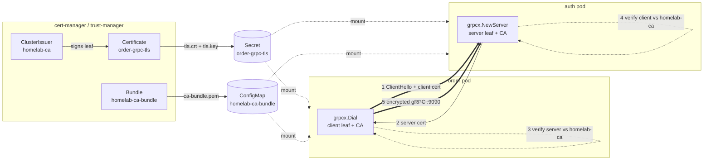
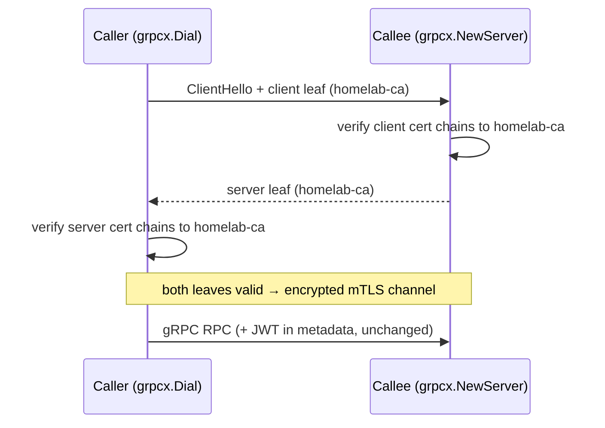

# RFC-0002 East-west mTLS for internal gRPC

**Status:** provisional

**Scope:** platform-wide

**Creation date:** 2026-06-26

**Last update:** 2026-06-26

> **Provisional.** Proposes a design; nothing is implemented. Owns the *why* and
> *design rationale* for the mTLS backlog item that
> [`grpc-internal-comms.md`](../../../api/grpc-internal-comms.md) §5 / Phase 3,
> [RFC-0001 Non-Goals](../RFC-0001/README.md#non-goals), and the `pkg/grpcx` +
> `pkg/temporalx` source all defer. The operational reference stays in
> `grpc-internal-comms.md`.

## Summary

Authenticate and encrypt every east-west gRPC hop with **mutual TLS**, with leaf
certificates issued by the **existing `homelab-ca` cert-manager ClusterIssuer** and
the CA distributed by the **existing trust-manager `homelab-ca-bundle`**. Each
service mounts a cert-manager `Certificate` secret; `pkg/grpcx` (and `pkg/temporalx`
for the worker↔Temporal link) loads the leaf + key and verifies the peer against the
homelab CA — replacing today's `insecure.NewCredentials()` plaintext transport.
mTLS becomes the *identity* layer that NetworkPolicy (a network fence) and the
forwarded JWT (the user layer) cannot provide.

## Motivation

East-west gRPC is **plaintext today.** `grpcx.Dial` uses
`insecure.NewCredentials()`, `temporalx.Dial` has no TLS, and the
review/shipping/notification servers do no inbound auth. As
[`grpc-internal-comms.md`](../../../api/grpc-internal-comms.md) §5 admits bluntly:
any workload that can reach `:9090` can invoke internal RPCs — including
`notification.SendEmail` — unauthenticated. The interim fence is NetworkPolicy, but
it is only enforced where the CNI enforces it (kindnet, the local cluster's CNI,
does **not**), and it answers only *who may connect?*, never *which service is this?*

mTLS closes that gap: it cryptographically proves **service identity** on every hop
and encrypts the wire, independent of whether a CNI enforces NetworkPolicy. The PKI
to do it is **already deployed** — the `homelab-ca` ClusterIssuer was created for
exactly this ("for future internal mTLS", per
[`clusterissuers.yaml`](../../../../kubernetes/infra/configs/cert-manager/clusterissuers.yaml))
and trust-manager already fans the CA bundle into labeled namespaces.

### Goals

- **Authenticated + encrypted** east-west gRPC for all 8 services' hops (`/me`,
  product→review, order→shipping, order→notification) **and** the Temporal
  worker↔frontend link (`:7233`).
- **Defense-in-depth** beyond NetworkPolicy: identity that holds even where the CNI
  does not enforce policy.
- **Reuse the deployed PKI** — `homelab-ca` issuer + `homelab-ca-bundle` — with no
  new PKI component and no service-mesh sidecar.
- **Zero-downtime rollout** — a per-service transition window that accepts both
  plaintext and mTLS, so callees can be hardened before callers cut over.

### Non-Goals

- **North-south / Kong edge TLS** — already solved (`kong-proxy-tls` wildcard via
  Let's Encrypt; see [`cert-manager.md`](../../../secrets/cert-manager.md) §6).
- **A full service mesh** (Istio Ambient / Linkerd) — mesh-native mTLS is its own,
  larger RFC (alternative (b) below); this RFC stays in-process.
- **Replacing the JWT user-identity layer** — mTLS proves the *service*, JWT proves
  the *user*; they are complementary, not substitutes.
- **SPIFFE/SPIRE workload identity** (alternative (c)) — disproportionate at this
  scale.

## Proposal

Wire mTLS **in-process** into the shared transport helpers, trusting the existing
`homelab-ca`:

1. **Issue a leaf per service** via a cert-manager `Certificate` (`issuerRef:
   homelab-ca`), `usages: [server auth, client auth]` so one cert serves both the
   inbound server and the outbound client. SANs = the headless Service DNS names the
   service is dialed by (e.g. `auth-grpc.auth.svc.cluster.local`).
2. **Mount** the resulting secret (`tls.crt`, `tls.key`) into the pod; **mount the
   CA** from the trust-manager `homelab-ca-bundle` ConfigMap already available in
   `needs-trust`-labeled namespaces.
3. **`grpcx.NewServer`** loads the leaf + CA and requires + verifies a client cert
   (`tls.RequireAndVerifyClientCert`); **`grpcx.Dial`** presents the leaf and
   verifies the server against the CA — both via `credentials.NewTLS`, replacing
   `insecure.NewCredentials()`.
4. **`temporalx.Dial`** sets `client.Options.ConnectionOptions.TLS` from the same
   mounted cert/CA for the worker↔frontend hop.
5. **Roll out per service, callee-first**, behind a transition mode that still
   accepts plaintext until every caller has cut over.

### Alternatives

| Option | Verdict | Why |
|--------|---------|-----|
| **(a)** In-service mTLS via cert-manager leaves wired into `pkg/grpcx` + `pkg/temporalx`, trusting `homelab-ca` | **RECOMMENDED** | The PKI (homelab-ca issuer + trust-manager bundle) is **already deployed for this exact purpose**. No new component, no sidecar, no data-plane hop. All workloads are Go and already read `/etc/ssl/certs/`. Change is confined to two `pkg` helpers + per-service `Certificate` manifests. |
| **(b)** Service mesh (Istio Ambient / Linkerd) for mesh-native, sidecar/ztunnel mTLS | **Defer — own RFC** | Transparent L7 mTLS + identity, but we run no mesh; standing one up for ~9 hops is disproportionate (mirrors the §3 LB decision in `grpc-internal-comms.md`). A mesh is a platform-wide decision deserving its own RFC. |
| **(c)** SPIFFE/SPIRE workload identity (SVIDs) | **Reject** | Strong identity model, but a whole new control plane + attestation pipeline. cert-manager already gives us short-lived, auto-rotated certs from a trusted CA — SPIRE's value-add is unneeded at this scale. |

(a) is the lightest precisely because **trust-manager + `homelab-ca` are live** — the
expensive parts (a CA, key custody, cluster-wide trust distribution) are done; only
the leaves and ~30 lines of transport-credential wiring remain.

## Architecture & Diagrams

Issuance (cert-manager → secret, CA via trust-manager) and the mTLS handshake — both
peers present a `homelab-ca` leaf and verify the other against the CA bundle:





## Design Details

**Certificate.** One `Certificate` per gRPC-speaking service under
`kubernetes/infra/configs/cert-manager/` (or rendered by the mop chart, gated on the
same `grpc.enabled` input as the headless Service):

```yaml
apiVersion: cert-manager.io/v1
kind: Certificate
metadata: { name: auth-grpc-tls, namespace: auth }
spec:
  secretName: auth-grpc-tls
  duration: 2160h            # 90d
  renewBefore: 720h          # 30d — cert-manager rotates the secret in place
  privateKey: { algorithm: ECDSA, size: 256, rotationPolicy: Always }
  usages: [server auth, client auth]
  dnsNames: ["auth-grpc.auth.svc.cluster.local", "auth-grpc.auth.svc"]
  issuerRef: { kind: ClusterIssuer, name: homelab-ca }
```

**`pkg/grpcx` wiring.** Both helpers read three paths (cert/key/CA) from env, e.g.
`GRPC_TLS_CERT=/etc/grpc-tls/tls.crt`, `GRPC_TLS_KEY=/etc/grpc-tls/tls.key`,
`GRPC_TLS_CA=/etc/ssl/certs/ca-bundle.pem` (the trust-manager mount):

- `NewServer`: when the cert paths are present, swap the insecure default for
  `grpc.Creds(credentials.NewTLS(&tls.Config{Certificates, ClientCAs,
  ClientAuth: tls.RequireAndVerifyClientCert}))`. During the transition window
  (`GRPC_TLS_MODE=permissive`) use `tls.VerifyClientCertIfGiven` so a not-yet-cut-over
  caller on plaintext still connects; flip to `RequireAndVerifyClientCert`
  (`strict`) once all callers present certs.
- `Dial`: replace `WithTransportCredentials(insecure.NewCredentials())` with
  `credentials.NewTLS(&tls.Config{Certificates, RootCAs})`. The `dns:///` target,
  `round_robin`, the `UNAVAILABLE` retry, the deadline interceptor, and keepalive are
  **unchanged** — TLS is per-subconnection, so round-robin still opens one verified
  subconnection per pod; the existing `keepalive.MaxConnectionAge` reconnect path
  also re-handshakes, so rotated leaves are picked up without a restart.
- **Health.** The gRPC health service rides the same mTLS listener — keep the
  Kubernetes probes on **HTTP `:8080`** (already the case), so kubelet never needs a
  client cert. `grpcurl` debugging requires `-cacert`/`-cert`/`-key` once strict.

**`pkg/temporalx` wiring.** `Dial` sets
`client.Options.ConnectionOptions.TLS = &tls.Config{Certificates, RootCAs}` from the
same mounted secret/CA; the Temporal frontend is configured for mTLS via the
operator's `TemporalCluster` TLS settings. The tracing interceptor is untouched.

**Enable/disable & default behavior.** Detect by **cert presence**: no cert env →
plaintext (today's behavior, unchanged) — so a service that hasn't been issued a cert
keeps working. Cert present → mTLS, with `GRPC_TLS_MODE` (`permissive`|`strict`)
choosing whether plaintext peers are still tolerated. Fully reversible: drop the
env/mount to fall back to plaintext.

**Drawbacks.** A new failure mode (expired/missing cert → handshake failure — see
Observability); `grpcurl` needs client certs once strict; a small per-handshake CPU
cost (amortized by long-lived HTTP/2 connections); two `pkg` releases + a per-service
`Certificate` to manage.

## Security considerations

- **Trust boundary:** mTLS authenticates the *service*; JWT-in-metadata still
  authenticates the *user* (unchanged) and NetworkPolicy still fences the network —
  the three layers from `grpc-internal-comms.md` §5, now all active.
- **Authorization is coarse:** any leaf signed by `homelab-ca` is trusted by every
  service (CA-level trust, not per-peer allow-lists). Per-callee SAN/SPIFFE-ID
  authorization is possible later but is a non-goal here; NetworkPolicy remains the
  per-pair fence.
- **Key custody:** leaf private keys live only in per-namespace TLS secrets, never in
  Git. The `homelab-ca` **private key** stays in `homelab-ca-secret` (cert-manager
  namespace) — already the case.
- **Kyverno/PSS:** mounting two read-only volumes (TLS secret + CA ConfigMap) needs
  no policy exception; no new capabilities or privilege.

## Observability & SLO impact

- **Cert-expiry alerts (required):** alert on the cert-manager
  `certmanager_certificate_expiration_timestamp_seconds` for every `*-grpc-tls`
  Certificate (warn < `renewBefore`, page if past expiry) — an unrenewed leaf breaks
  every hop into that service.
- **Handshake failures:** TLS errors surface as gRPC `UNAVAILABLE` and feed the
  existing RED metrics/SLOs; watch the `UNAVAILABLE` rate per hop during cutover (a
  spike = a cert/trust mismatch, not load).
- **Cert-readiness:** alert on cert-manager `CertificateNotReady` so a stuck issuance
  is caught before rollout.

## Rollout & rollback

**Phased, callee-first**, mirroring the gRPC migration's per-phase gating:

1. **PKI prep** — issue a `Certificate` per service; confirm secrets land and the
   `homelab-ca-bundle` ConfigMap is mounted. No code path uses them yet.
2. **`pkg` support** — ship `grpcx`/`temporalx` TLS wiring; default stays plaintext
   when no cert env is set (no behavior change on upgrade).
3. **Permissive per callee** — enable mTLS on a callee in `permissive` mode
   (`VerifyClientCertIfGiven`): mТLS callers verified, plaintext callers still work.
4. **Cut callers over** — point each caller at its leaf; verify trace continuity and
   no `UNAVAILABLE`/SLO regression per hop.
5. **Strict** — flip each callee to `RequireAndVerifyClientCert` once all its callers
   present certs; finally the Temporal link.

**Rollback** is per-control and one step: a callee reverts permissive→plaintext by
unsetting its cert env (or `GRPC_TLS_MODE=permissive`), independent of other hops —
the same one-step-revert discipline as the gRPC phases.

## Testing / verification

- `grpcx`/`temporalx` unit tests: handshake succeeds with valid leaves; a peer with
  no cert is rejected in strict and accepted in permissive; a wrong-CA leaf is
  rejected in both.
- `local-stack` / Kind end-to-end: login (`/me`), product reviews, and checkout →
  notification + Temporal saga all succeed over mTLS with trace continuity intact.
- Negative drill: delete a leaf secret → confirm the expiry/handshake alerts fire and
  the hop fails closed (not silently plaintext) once strict.

## Implementation History

TBD — provisional; no implementation yet.

## Related

- East-west transport & current posture: [`docs/api/grpc-internal-comms.md`](../../../api/grpc-internal-comms.md) (§5 Security, Phase 3).
- [RFC-0001 Temporal](../RFC-0001/README.md) — the worker↔cluster link this RFC also secures (its Non-Goal #3).
- [ADR-003 JWT validation in services, not Kong](../../adr/ADR-003-jwt-validation-in-services-not-kong/) — the user-identity layer mTLS complements.
- PKI: [`docs/secrets/cert-manager.md`](../../../secrets/cert-manager.md) (`homelab-ca`, trust-manager), [`docs/secrets/trust-distribution.md`](../../../secrets/trust-distribution.md).
- Code: `duynhlab/pkg` `grpcx` (`Dial`/`NewServer`/`metadata.go`), `temporalx`.
