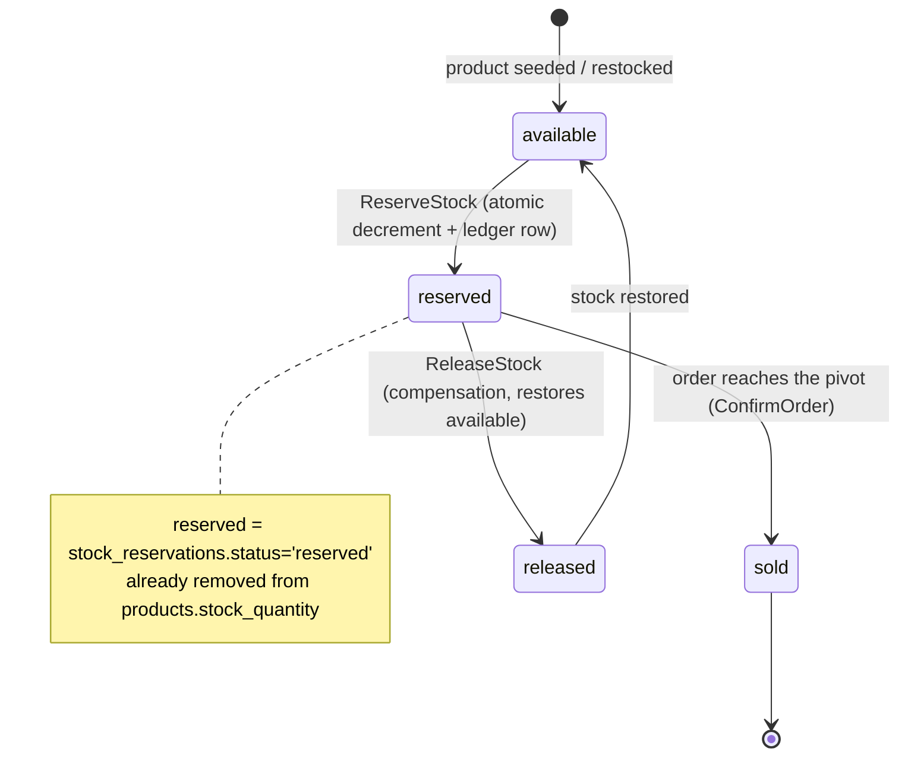

# RFC-0003 Inventory ownership and stock semantics

**Status:** provisional

**Scope:** platform-wide

**Creation date:** 2026-06-26

**Last update:** 2026-06-26

## Summary

Decide **who owns inventory** on the platform and pin down **what stock means** so the
order-fulfillment saga is unambiguous. Today `product-service` already doubles as the
inventory owner — it holds `stock_quantity`, exposes `ReserveStock`/`ReleaseStock` over
gRPC, and records every reservation in a `stock_reservations` ledger. Meanwhile
`order-service` still carries two stale `TODO`s ("when inventory service is available")
that imply a future dedicated inventory service. This RFC **ratifies product-service as
the inventory owner**, defines the `available → reserved → sold/released` lifecycle, and
**closes the order-service TODOs** as won't-do (the saga owns those effects now).

## Motivation

The saga (RFC-0001) reserves stock through product-service and compensates by releasing
it. That contract is live and verified. But two artifacts contradict it:

1. **`order-service/internal/logic/v1/service.go`** still has commented-out
   `inventoryRepo.DecrementStockWithTx` and `cartRepo.ClearWithTx` blocks guarded by
   *"when inventory service is available"*. They describe a synchronous, in-transaction
   inventory decrement that the saga has since superseded. Left in place they invite a
   future contributor to wire a **second, conflicting** inventory path.
2. The proto comment and ADR-001 frame inventory as a *"long-standing TODO"* that *might*
   become a dedicated service. We have never decided whether it should.

An undecided owner is a real hazard: double-decrement, split-brain stock, or a reviewer
blocking a PR on "shouldn't this go in inventory-service?". Naming the owner and the
semantics removes the ambiguity.

### Goals

- **Pick an owner** for inventory and write it down: product-service.
- **Define stock semantics** — `available` vs `reserved` vs `sold`/`released` — as a state
  machine the saga steps map onto.
- **Close the order-service TODOs** (remove the dead inventory/cart blocks; the saga owns
  those side-effects).

### Non-Goals

- **Warehouse / multi-location inventory** (per-warehouse quantities, transfers). Single
  logical stock pool only — future work.
- **Reservation TTL / expiry** — auto-releasing a reservation that never confirms or
  compensates. Today a reservation lives until the saga releases it; a stuck saga is
  visible in the Temporal UI. TTL is future work (see [Drawbacks](#drawbacks)).
- Re-litigating the saga itself — that is RFC-0001. This RFC only fixes *ownership* and
  *semantics*.

## Proposal

**Product-service is the inventory owner.** Inventory is not a separate bounded context on
this platform; it is an attribute of a product (`stock_quantity`) plus a reservation
ledger, both already living in the product database. The saga's east-west contract
(`ReserveStock`/`ReleaseStock` in `pkg/proto/product/v1`) stays exactly as shipped.

**Stock semantics.** Every unit of a product is in one of three logical states:

- **available** — `products.stock_quantity`; sellable now. This is the only column the read
  API exposes.
- **reserved** — a row in `stock_reservations` with `status='reserved'`, keyed by
  `(reservation_id, product_id)` where `reservation_id` is the order ID. The reserve is an
  **atomic guarded decrement** of `available` recorded in the *same transaction* as the
  ledger row, so reserved units have already left `available`.
- **sold** — the reservation outlives a `confirmed` order (no explicit `sold` row today;
  "sold" = a `reserved` reservation whose order reached the pivot and was never released).
- **released** — compensation flipped the ledger row to `status='released'` and restored
  `available`. Terminal; a retried release is a no-op.

### User Stories

- *As the order saga,* I reserve stock once per order and trust the decrement is atomic and
  idempotent, so an activity retry never double-decrements.
- *As a platform engineer,* I read this RFC and know inventory edits go to product-service —
  not a new repo — and that the order-service TODOs are intentionally dead.

### Alternatives

| Option | What | Trade-offs |
|--------|------|-----------|
| **(a) product-service owns inventory** *(recommended)* | Status quo, ratified. Stock + ledger stay in the product DB. | Simplest; zero new infra; matches the shipped saga. Inventory and catalog share a blast radius and a DB — acceptable at homelab scale. The product Valkey cache can serve stale `available` (see RFC-0001 *cache-bust on reserve*). |
| **(b) dedicated inventory-service** | Extract stock + ledger into its own service/DB/namespace. | Clean bounded context; independent scaling; catalog reads no longer share a DB with the hot reserve path. **But:** new repo + chart + DB + Kyverno surface, a **new east-west hop** (saga → inventory instead of saga → product), a cross-service migration to move `stock_quantity`, and a fresh cache-consistency boundary between catalog and stock. Pure cost with no demand today. |
| **(c) hybrid** | product-service stays the *write* owner; a thin inventory read-model/projection serves stock queries. | Decouples read scaling from the catalog without a full extract. Adds a projection to keep consistent (another staleness source) for a read volume we do not have. Premature. |

**Recommendation: (a).** Pick (b) only when a concrete pressure appears — inventory write
throughput hurting catalog reads, or a genuine second inventory consumer. The contract is
already a clean gRPC seam, so (b) remains a *future* extract, not a rewrite. The cache
interaction with RFC-0001 is the one wrinkle in (a) and is already tracked there.

## Architecture & Diagrams

**Stock lifecycle** (per reserved unit):



**Saga ↔ product-service interaction** (the two contract calls):

```mermaid
sequenceDiagram
    participant W as Worker (order-fulfillment)
    participant P as product-service (inventory owner)
    participant DB as product DB

    W->>P: ReserveStock(reservation_id=orderID, items)
    P->>DB: BEGIN; guarded UPDATE stock_quantity; INSERT ledger; COMMIT
    alt enough stock
        P-->>W: OK (reserved)
    else insufficient
        P-->>W: FAILED_PRECONDITION (non-retryable)
        Note over W: saga compensates in reverse, FailOrder
    end
    Note over W: on a later pre-pivot failure
    W->>P: ReleaseStock(reservation_id)
    P->>DB: flip ledger 'reserved'->'released'; restore stock_quantity
    P-->>W: OK (idempotent)
```

## Design Details

- **Data model (existing, unchanged).** `products.stock_quantity` (the `available` count)
  + `stock_reservations(reservation_id, product_id, quantity, status, …)` with
  `PRIMARY KEY (reservation_id, product_id)` and a `(reservation_id, status)` lookup index.
  Reserve and ledger insert happen in **one transaction**; the decrement is a guarded
  `UPDATE … WHERE stock_quantity >= $qty` so an understocked or missing product yields
  `RowsAffected = 0 → ErrInsufficientStock`.
- **Idempotency.** `ReserveStock` short-circuits if any row for `reservation_id` already
  exists (retry → no-op commit). `ReleaseStock` only restores `status='reserved'` rows and
  flips them to `released`, so a retried compensation cannot double-restore. This is the
  guarantee RFC-0001 relies on for safe activity retries.
- **What "reserved" means for the read API.** The read API (`GetProduct`/`ListProducts`)
  exposes only `available`. Because reads are served Cache-Aside from Valkey, a freshly
  reserved decrement can be **stale for up to the cache TTL (~10 min)** — the DB stays
  authoritative for the reservation itself, so this never lets stock oversell, only shows a
  slightly high `available` to browsers. Fixing the staleness is RFC-0001's *cache-bust on
  reserve* item (invalidate the product cache on reserve/release); when caching gets its own
  RFC (RFC-0004), the bust hook is documented there. No new mechanism is introduced here.
- **Backpressure when stock is exhausted.** Insufficient stock is a **business rejection,
  not a transient error**: product returns `FAILED_PRECONDITION`, the saga wraps it
  **non-retryable**, compensates immediately, and marks the order `failed`. This is already
  the behavior — this RFC just makes it the *defined* contract for an exhausted pool.
- **Closing the order-service TODOs.** Remove the two commented blocks in
  `order-service/internal/logic/v1/service.go` (the `inventoryRepo.DecrementStockWithTx`
  loop and the `cartRepo.ClearWithTx` call). Inventory is owned by product-service and
  driven by the saga's `ReserveStock`; cart-clear is the saga's best-effort `ClearCart`
  step. A short comment should point at this RFC so the intent survives. **No new
  `inventoryRepo` is ever added to order-service.**
- **Enable / disable.** Nothing to gate — inventory is intrinsic to product-service and the
  saga is the sole writer of reservations. "Disabling" inventory would mean disabling
  checkout. An operator confirms it is in use via the `stock_reservations` table, the
  `product.reserve_stock` / `product.release_stock` spans in Tempo, and the reserve gRPC RED
  metrics on product's `/metrics`.

### Drawbacks

- **Shared blast radius / shared DB.** Inventory writes and catalog reads share the product
  service and its database. A reserve-heavy checkout spike competes with catalog reads.
  Mitigation today: PgBouncer/PgDog pooling + Valkey read cache; escalation path is
  Alternative (b).
- **No reservation expiry.** A saga that wedges before pivot *and* before compensation holds
  stock indefinitely. Visible in the Temporal UI and terminable by hand; an automatic TTL
  sweep is explicit Non-Goal / future work.
- **Cache staleness on `available`** (above) until the RFC-0001 cache-bust lands.

## Security considerations

`ReserveStock`/`ReleaseStock` are **internal** gRPC, in-cluster only, fenced by
NetworkPolicy (per AGENTS.md: NetworkPolicy is the fence, not the absence of an Ingress
rule). They are never exposed on `ingress-api.yaml`. No new secrets, no new trust boundary.
PSS/Kyverno posture is unchanged — this RFC moves no workloads.

## Observability & SLO impact

No new infra, so no new dashboards required. Existing signals suffice: the
`product.reserve_stock` / `product.release_stock` spans, the reserve/release gRPC RED
metrics on product's `/metrics`, and the saga's workflow visibility in Temporal. Worth
watching during any future cache-bust rollout: product read latency and cache hit-rate (a
bust on every reserve raises miss rate). No SLO change; inventory rejections (insufficient
stock) are *expected* business outcomes and must **not** burn the order error budget.

## Rollout & rollback

Documentation-and-cleanup only. Ratifying ownership is a no-op on the running system. The
single code change — deleting the two order-service TODO blocks — ships as an ordinary PR in
the order-service repo (`make validate` + `go test ./...`). Rollback is a revert; there is
no data migration and no behavioral change to roll back.

## Testing / verification

- Existing product `inventory_test.go` covers reserve idempotency, insufficient-stock
  rejection, and release-restore.
- RFC-0001's `testsuite` saga tests already exercise reserve → (failure) → release
  compensation end-to-end.
- For the TODO cleanup: confirm `go build ./... && go test ./...` in order-service stays
  green after the blocks are removed (they are commented out, so this is a no-behavior-change
  check).

## Implementation History

- TBD — ownership ratification (this RFC) and the order-service TODO cleanup PR are pending.

## Related

- [RFC-0001 Temporal for durable cross-service orchestration](../RFC-0001/) — the saga that
  consumes `ReserveStock`/`ReleaseStock`; owns the *cache-bust on reserve* future-work item.
- [`docs/api/temporal-order-fulfillment.md`](../../../api/temporal-order-fulfillment.md) —
  operational reference for the saga and the reservation ledger.
- RFC-0004 (caching) — *forward reference*: when product Cache-Aside / cache-bust gets its
  own RFC, the `available`-staleness hook is documented there.
- Contracts: `pkg/proto/product/v1/product.proto` (`ReserveStock`/`ReleaseStock`).
