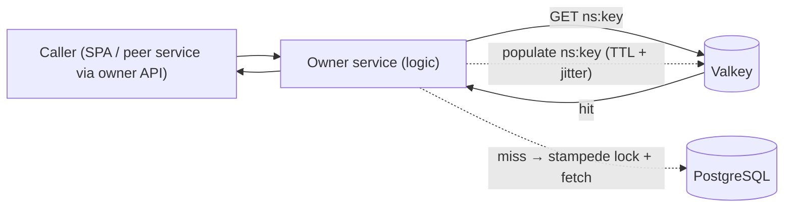
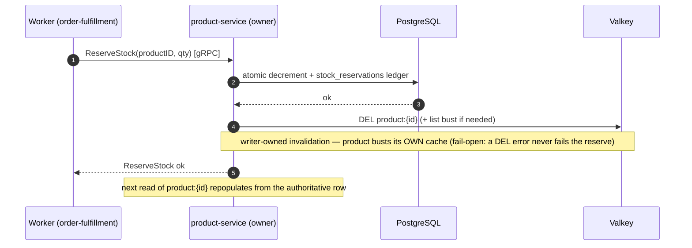

# RFC-0004 Cross-service caching and invalidation

| Status | Scope | Created | Last updated |
|--------|-------|---------|--------------|
| provisional | platform-wide | 2026-06-26 | 2026-06-26 |

> **Provisional.** This RFC frames a platform-wide caching contract; it is **not yet
> implementable**. It absorbs the [RFC-0001 *cache-bust on reserve*](../RFC-0001/README.md#future-work)
> future-work item and the "cross-service invalidation" gap documented in
> [`docs/api/caching.md`](../../../api/caching.md). Platform ops:
> [`docs/caching/README.md`](../../../caching/README.md). The operational reference for the
> existing product cache stays in that doc; this RFC owns the *cross-service rules* and the *why*.

## Summary

Caching today is **ad-hoc and product-only**: product-service runs a Valkey Cache-Aside
with stampede prevention on product detail/list reads, and no other service caches. The
Temporal order saga writes stock (`ReserveStock`/`ReleaseStock`) **directly against product
data** but has **no hook to invalidate the product detail cache**, so stock reads can serve
stale data for up to the 10m TTL. This RFC defines a platform-wide caching contract:
**cache ownership boundaries**, a **cross-service invalidation strategy** (starting with
cache-bust on stock reserve/release), **negative caching**, and **stampede hardening** —
so the next service to add a cache follows shared rules instead of re-deriving them.

## Motivation

- **No shared rules.** product-service had to invent key conventions, fail-open, jitter,
  and stampede locking from scratch ([`docs/api/caching.md`](../../../api/caching.md)).
  The next service has no contract to follow.
- **The saga writes data another service caches.** RFC-0001 reserves/releases stock as an
  atomic DB decrement on product rows; product-service caches `product:{id}` (which may carry
  stock) with no invalidation path. Documented as a deliberate, bounded-stale boundary today
  ([caching doc §Cache Ownership & Invalidation Boundary](../../../api/caching.md)), but
  it is a real staleness window (~10m) once stock surfaces in the detail payload.
- **Known gaps are deferred, not decided.** The caching doc lists *cross-service invalidation*
  (contingent), *negative caching* (not implemented — penetration), and *stampede under a slow
  DB* (single-flight is best-effort) as open items with no platform-level direction.

### Goals

- **Cache ownership boundaries** — exactly **one service owns each cache namespace** and is
  the only writer/invalidator of it. Cross-service reads accept **TTL-bounded staleness** by
  contract, not by accident.
- **An invalidation strategy** for writers in another service — concretely, **cache-bust on
  stock reserve/release** so order-fulfillment no longer leaves the product cache stale.
- **Negative caching** — short-TTL not-found entries to stop cache penetration / id-scanning.
- **Stampede hardening** — close the "single-flight is best-effort under a slow DB" gap.
- Success: a new service can adopt caching by following this RFC; no cross-service read serves
  data staler than its documented TTL bound; stock reads reflect a reserve within seconds.

### Non-Goals

- **A shared cache-cluster redesign.** Valkey topology / HA is out of scope (reads are
  fail-open; see the caching doc's HA note). This RFC is about *contracts*, not infrastructure.
- **Caching every service now.** Read-heavy endpoints opt in; most services stay cache-free.
- **A distributed cache-coherence protocol.** TTL-bounded staleness is acceptable; we are not
  building strong cross-service cache consistency.

## Proposal

**Ownership contract.** Every cache namespace (`<owner>:…`) has a **single owning service**
that is the only writer and invalidator. Other services may *read through* the owner's API
(never the owner's cache directly) and **must tolerate staleness up to the namespace's TTL**.
A cross-service writer never mutates another owner's cache; it triggers invalidation **through
the owner**.

**Invalidation contract.** When a write happens in service A to data cached by owner B, B's
cache is busted **by B**, triggered by A. Applied first to the saga: on `ReserveStock` /
`ReleaseStock`, product-service invalidates `product:{id}` (and the list cache if stock is
listed) so the next read repopulates from the authoritative DB row.

### Alternatives

Invalidation when the writer lives in **another service** than the cache owner:

| # | Option | How | Trade-offs |
|---|--------|-----|------------|
| **(a)** | **Writer-owned invalidation** — *recommended* | The owning service busts its **own** cache as part of the write it already owns. Stock is mutated **through product-service** (`ReserveStock`/`ReleaseStock` are product-service operations), so product busts `product:{id}` inline. | Simplest; single owner of the cache stays the single invalidator → no coherence protocol. Requires the write to route through the owner (it already does — stock is a product gRPC op). Synchronous bust adds one Valkey `DEL` to the write path (fail-open). |
| (b) | **Pub/sub invalidation events** | The writer publishes an `invalidate {namespace,key}` event; owners subscribe and evict. | Decouples writer from owner; scales to many caches. But adds a broker, at-least-once delivery (double-evict is safe), eviction lag, and a new failure mode (missed event → silent staleness). Overkill while stock is the only cross-service write and it already routes through the owner. |
| (c) | **TTL-only (status quo)** | No invalidation; accept staleness until expiry. | Zero code. But leaves the documented ~10m stock-staleness window and the penetration gap. The thing this RFC exists to fix. |

**Recommendation: (a).** Stock already flows through product-service's gRPC ops, so the owner
*is* the writer — inline self-invalidation needs no broker and keeps "one owner, one
invalidator" intact. Revisit (b) only if a future writer cannot route through the owner.

## Architecture & Diagrams

**Cache-aside read path** (owner-internal; unchanged from product today, generalized):

**Invalidation flow on a stock reserve** (saga → product owner → bust Valkey):

## Design Details

- **Namespace / key convention.** `<owner>:<resource>[:<discriminator>]`. Single entity
  `<owner>:<id>` (e.g. `product:14`); derived/list sets hash the normalized filter tuple
  (`product:list:<sha256>`) so free-text inputs can't alias keys — exactly as product does
  today. Locks: `lock:<owner>:<id>`.
- **Cache-bust on reserve/release (the saga fix).** `ReserveStock` / `ReleaseStock` call
  `InvalidateProduct(ctx, id)` after the DB write commits. `InvalidateProduct` already exists
  in product-service (`internal/core/cache/product_cache.go`); it is currently only wired for a
  hypothetical update/delete path. This RFC wires it into the stock ops. If stock is rendered in
  list payloads, also `InvalidateProductList`.
- **Fail-open everywhere.** The cache is a performance optimization, not a system of record.
  Valkey down → read serves the DB; an invalidation `DEL` error **never fails the write** (the
  TTL is the backstop). Matches the existing product fail-open contract.
- **Negative caching.** Cache a sentinel for not-found ids with a **short TTL** (seconds, e.g.
  `30s`, distinct from the positive 10m) so repeated reads of a missing id don't hammer the DB
  (penetration). Must be invalidated on create of that id (or kept short enough that the create
  self-heals it). Closes the documented penetration gap.
- **Stampede lock under a slow DB.** The current distributed lock bounds the herd only on the
  happy path: waiters give up after 500ms and fall through to the DB, so a DB fetch slower than
  500ms lets multiple waiters through (the exact slow-DB case). Harden with **in-process
  `singleflight`** (collapse concurrent same-key fetches within one pod) layered under the
  distributed lock, or a tunable waiter budget. Documented caveat:
  [caching doc §Cache Stampede Prevention](../../../api/caching.md).
- **TTL choices.** Inherit product's defaults as the platform baseline: detail `10m`, list
  `5m`, negative `~30s`, all with **≤10% jitter** to avoid synchronized expiry waves. Owners
  may tune per namespace; staleness bound = TTL, and that bound is the cross-service contract.
- **Enable / disable.** Per-service `CACHE_ENABLED` (already exists for product). Disabling
  reverts a service to direct DB reads — no behavior change beyond latency. Reversible at any
  time; the bust calls become no-ops when caching is off.
- **Operator visibility.** "In use" = non-empty `<owner>:*` keyspace in Valkey +
  `redis_keyspace_hits_total` climbing for that owner (the exporter is redis_exporter → `redis_*`); per-app hit/miss counters (below).
- **Supersedes / absorbs.** This RFC **absorbs the RFC-0001 *cache-bust on reserve* future-work
  item** ([RFC-0001 §Future work](../RFC-0001/README.md#future-work)) and the *cross-service
  invalidation* (contingent) + *negative caching* + *stronger stampede* items from the
  [caching hub § Roadmap gaps](../../../caching/README.md#roadmap-gaps). Those are now tracked here.
- **Drawbacks.** Routing all writes through the owner constrains where mutations may live (fine
  today — stock is a product op). Synchronous invalidation adds one Valkey op to the write path
  (fail-open, negligible). Negative caching adds a small risk of briefly hiding a just-created id
  (bounded by its short TTL).

## Security considerations

Minimal. No new trust boundary: the saga already calls product over gRPC (NetworkPolicy-fenced;
east-west mTLS is the standing platform backlog item). Caches hold the same data their owning
service already serves — no privilege escalation. Negative-cache sentinels must not leak whether
an id exists beyond what the public read already reveals (it returns 404 either way).

## Observability & SLO impact

- **Cache hit ratio** per owner from the already-scraped server metrics:
  `rate(redis_keyspace_hits_total[5m]) / (rate(redis_keyspace_hits_total[5m]) + rate(redis_keyspace_misses_total[5m]))`
  (target > 80% for read-heavy endpoints).
- **Eviction / memory pressure:** `redis_evicted_keys_total`, `redis_memory_used_bytes`
  against `maxmemory` (policy `allkeys-lru`) — rising evictions mean the working set exceeds
  memory and TTLs are being cut short.
- **App-level counters (new):** per-service `cache_hit/miss/error/invalidation_total` to attribute
  hit ratio to a specific owner and to confirm bust calls fire (the server-side `keyspace_*`
  metrics are cluster-wide). Closes the caching doc's "App-level cache metrics" item.
- **No SLO change** — caching is fail-open, so a cache outage degrades latency, never the
  availability SLO. Watch p99 read latency and DB QPS during rollout.

## Rollout & rollback

1. **Cache-bust on reserve/release** in product-service (wire `InvalidateProduct` into the stock
   gRPC ops). Lowest-risk, highest-value — closes the RFC-0001 staleness window. Verify on
   `local-stack`: reserve stock, then read `product:{id}` reflects the decrement within seconds.
2. **Negative caching** in product-service (short-TTL not-found sentinel).
3. **Stampede hardening** (`singleflight` under the distributed lock).
4. **App-level cache metrics** + a hit-ratio panel.
- **Rollback:** each step is independently revertible; `CACHE_ENABLED=false` disables a
  service's cache entirely (bust calls no-op). Blast radius is one service at a time; fail-open
  means a bad cache change degrades to DB reads, not errors.

## Testing / verification

- Unit: invalidation fires on reserve/release; negative-cache sentinel set on not-found and
  evicted on create; `singleflight` collapses concurrent same-key fetches under a slow fetch.
- e2e on `local-stack`: a checkout saga reserve → product detail read reflects the new stock
  within seconds (no 10m wait); over-quantity checkout releases stock and the read reflects it.
- Load: confirm the stampede path holds one DB query per hot key under a slow (>500ms) DB fetch.

## Implementation History

- TBD — provisional; no code yet. Step 1 (cache-bust on reserve/release) is the first candidate.

## Related

- [RFC-0001 Temporal](../RFC-0001/README.md) — origin of the *cache-bust on reserve* item this RFC absorbs.
- [RFC-0003 Inventory ownership](../RFC-0003/) — where stock writes ultimately live; co-determines the cache owner for stock.
- [Application caching](../../../api/caching.md) — product Cache-Aside, stampede prevention, ownership boundary
- [Caching (platform)](../../../caching/README.md) — Valkey deployment, eviction, roadmap gaps
- [`docs/databases/002-database-integration.md`](../../../databases/002-database-integration.md) — the shared `cnpg-db` cluster product/cart/order write to.

---
_Last updated: 2026-07-07_
