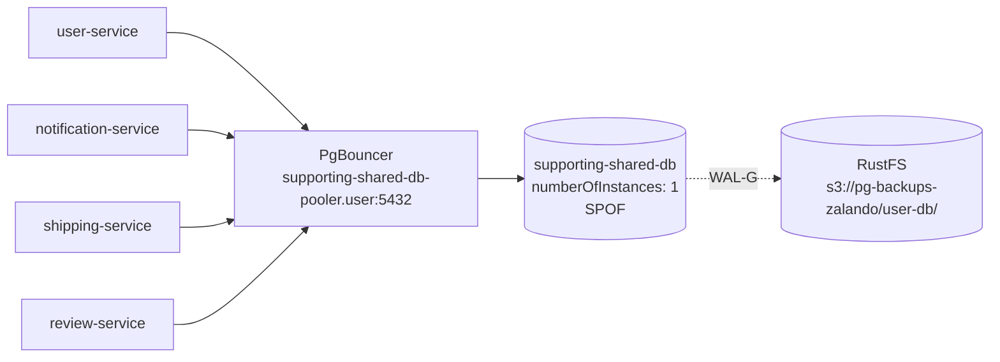
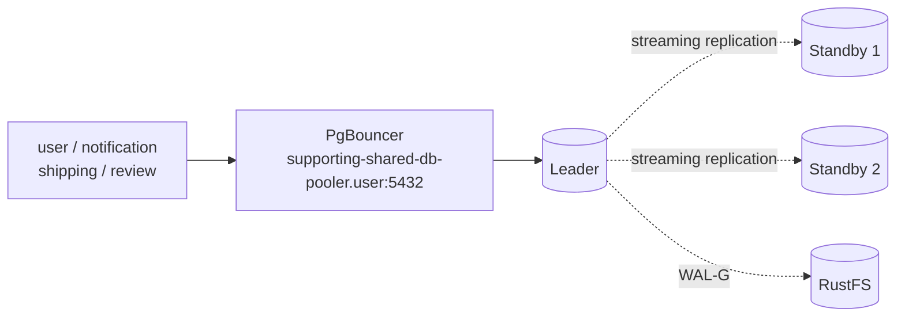

# RFC-0005 supporting-shared-db: HA or split

**Status:** provisional

**Scope:** infra

**Creation date:** 2026-06-26

**Last update:** 2026-06-26

## Summary

`supporting-shared-db` is a **single-node, non-HA** Zalando/Patroni PostgreSQL 16
cluster (`numberOfInstances: 1`, in namespace `user`) that hosts **four**
databases — `user`, `notification`, `shipping`, `review`. One pod failure, node
loss, PVC corruption, or even a routine restart takes **all four services down at
once**, and there is no DB-level failover: recovery is a manual WAL-G restore.
This RFC proposes to **remove that SPOF** and **define a real RPO/RTO target for
the supporting tier (T2)**, and recommends scaling the existing cluster to a
3-node Patroni HA setup as the first step.

## Motivation

The DRP explicitly lists `supporting-shared-db` as a **known gap** — a
single-node SPOF with "no automatic database failover"
([`010-drp.md`](../../../databases/010-drp.md#known-gaps-and-next-improvements)),
and the RPO/RTO planning page records its as-built posture as **"1 node (SPOF) …
No DB failover; manual restore only"**
([`010.1-rpo-rto-planning.md`](../../../databases/010.1-rpo-rto-planning.md#as-built-rporto-today)).
Concretely:

- **Shared blast radius.** Four otherwise-independent services share one
  instance, so a failure of any kind is a four-service incident.
- **No escape hatch.** There is no standby to promote — `numberOfInstances: 1`
  means Patroni has nothing to fail over to.
- **RPO bounded only by the last WAL archive**, and **RTO is "manual restore
  time"** — undefined and unrehearsed (no recorded drill).
- **Couples unrelated lifecycles.** A noisy-neighbour query, a `pg_cron` job, or
  a vacuum storm in one database degrades the other three.

By contrast `auth-db` (T1, also Zalando) already runs **3-node Patroni HA**, and
`cnpg-db` (T0) runs 3 instances with synchronous quorum. The supporting tier is
the only operational cluster with no HA at all.

### Goals

- **Remove the single-instance SPOF** for `user`, `notification`, `shipping`, `review`.
- **Define and document a T2 RPO/RTO** the data owners accept, matching the
  target table in [`010.1`](../../../databases/010.1-rpo-rto-planning.md#target-rporto-by-tier).
- **Prove failover with a recorded drill** (ties to the DR-drills backlog,
  [`010.2`](../../../databases/010.2-restore-and-failover-drills.md)).
- **No application changes** — services keep using `supporting-shared-db-pooler.user:5432`.

### Non-Goals

- **Cross-region / cross-cluster DR** — independent failure domains are a
  separate roadmap item ([`010.3`](../../../databases/010.3-cross-region-dr.md)).
- **Migrating `cnpg-db`** or changing the T0 topology.
- Re-litigating the operator choice for clusters other than this one.

## Proposal

**Scale `supporting-shared-db` to a 3-node Patroni HA cluster** by raising
`numberOfInstances` from `1` to `3` in
[`kubernetes/infra/configs/databases/clusters/supporting-shared-db/instance.yaml`](../../../../kubernetes/infra/configs/databases/clusters/supporting-shared-db/instance.yaml),
mirroring the proven `auth-db` posture. This is the **least-churn** path: same
operator, same pooler, same secrets, same endpoints — only the replica count and
durability semantics change. The existing
[`zalando-ha-scaling.md`](../../../databases/runbooks/zalando-ha-scaling.md)
runbook already documents exactly this transition (manual recovery → Patroni
auto-failover).

This decision is reversible and **does not preclude a later split** — if a
service later needs strict isolation (independent backups, blast radius, or its
own scaling), it can be carved out onto its own database as a follow-up.

### Alternatives

| # | Option | Pro | Con |
|---|--------|-----|-----|
| **(a)** | **Scale to ≥3-node Patroni HA** *(recommended)* | Least churn; reuses `auth-db` pattern, runbook, dashboards; no app/endpoint change | Still one shared instance → shared blast radius for logical/noisy-neighbour issues; only protects against infra failure |
| (b) | **Split each service to its own (CNPG) database** | Strongest isolation; per-service backup/RPO/PITR and independent scaling | 4× clusters/poolers to operate; new secrets/endpoints → app config churn; highest operational cost |
| (c) | **Migrate the shared instance to CNPG + HA** | Aligns with T0 stack (quorum failover, declarative DR, Barman plugin); one backup model | Full data migration + cutover; new pooler (PgDog) + secret format; endpoint change for 4 services |

**Recommendation: (a) now, keep (b)/(c) as follow-ups.** (a) closes the SPOF —
the documented gap — immediately and cheaply, and (b) can be applied
per-service later if a specific isolation need appears. (c) is only worth the
migration cost if we decide to consolidate on CNPG platform-wide, which is out
of scope here.

## Architecture & Diagrams

**Current — 4 services → 1 SPOF:**

**Proposed — option (a), 3-node Patroni HA:**

## Design Details

- **Replica count.** `numberOfInstances: 3` (1 leader + 2 standbys). Apply via
  the manifest + `make validate && make sync`; Zalando rolls out the StatefulSet
  and Patroni bootstraps standbys from the leader.
- **Failover.** Patroni handles leader election and promotion (target **< 1 min**,
  matching `auth-db`); the Kubernetes API serves as the DCS. No operator
  availability is required for failover (a Zalando/Patroni strength —
  [`003-operator-comparison.md`](../../../databases/003-operator-comparison.md)).
- **Replication / durability.** Today `synchronous_commit: local` (async). For
  T2 metadata, async is the accepted default; if the owner wants RPO-0 on
  acknowledged commits, switch to synchronous replication explicitly and accept
  the latency/availability trade-off. **State the choice in `010.1`.**
- **Pooler impact.** The PgBouncer sidecar (`numberOfInstances: 3`, transaction
  mode) already fronts the cluster and follows the Patroni leader; the service
  endpoint `supporting-shared-db-pooler.user:5432` is unchanged, so **no
  application reconfiguration**.
- **Backups.** WAL-G archiving to `s3://pg-backups-zalando/user-db/` is already
  configured at the instance level and is unaffected; standbys do not change the
  archive path. HA is **not** a backup substitute — PITR via WAL-G remains the
  path for logical corruption / `DROP TABLE`.
- **Capacity.** 3× the pods/PVCs (PVC is 2Gi; requests `cpu: 100m`,
  `memory: 128Mi` per instance). Verify Kind/node headroom before rollout.
- **Detect / verify HA.** `patronictl list` inside a pod shows Leader + 2
  Replicas with timeline/lag; `kubectl get postgresql -n user` and
  `pg_replication_lag` confirm steady state.
- **Migration steps.** (1) bump `numberOfInstances` to 3; (2) `make validate`;
  (3) `make sync`; (4) wait for standbys to catch up; (5) run a failover drill;
  (6) record RPO/RTO evidence and update `010.1`/`010.2`.
- **Drawbacks.** Option (a) does **not** isolate logical/noisy-neighbour faults —
  it protects against infrastructure failure only. Higher resource footprint.
  Shared-cluster coupling persists until a future split.
- **Enable / disable.** Fully reversible: scale back to `numberOfInstances: 1`
  to undo (Patroni removes standbys). The change is a single field in one
  manifest.

## Security considerations

Minimal. No new trust boundary, no new secret: standbys reuse the same
Zalando-generated credentials and cross-namespace secret delivery. NetworkPolicy
and PSS posture are unchanged (same pod spec, more replicas). No Kyverno impact
(resource requests/limits and probes already satisfied by the Zalando pod template).

## Observability & SLO impact

- The `postgres_exporter`/`pg_exporter` sidecar already emits `pg_replication_lag`
  and `pg_up`; with standbys present these become meaningful. **Add alerts:**
  replication lag high, standby down, and "cluster has < 2 healthy members"
  (HA degraded).
- Defining the T2 SLO/RPO/RTO closes the "undefined shared-tier SLO" gap and lets
  the supporting services be held to an explicit, owner-accepted objective.
- During rollout, watch lag and connection counts as standbys bootstrap.

## Rollout & rollback

- **Window.** Low-risk; the leader keeps serving while standbys build. Prefer a
  low-traffic window so the initial base-backup replication doesn't compete with
  app load.
- **Phased.** (1) scale to 3 and let standbys sync; (2) verify lag ~0; (3)
  schedule a controlled failover drill; (4) record evidence.
- **Blast radius.** Adding standbys does not interrupt the leader; the only
  app-visible event is the (intentional) failover during the drill.
- **Rollback.** Revert `numberOfInstances` to `1` and `make sync`; no data or
  endpoint change.

## Testing / verification

- `make validate` on the changed manifest.
- After sync: `patronictl list` shows 1 Leader + 2 Replicas; lag ~0.
- **Failover drill** (ties to the [DR-drills backlog](../../../databases/010.2-restore-and-failover-drills.md)):
  delete the leader pod, confirm Patroni promotes a standby in < 1 min, smoke-test
  all four services through the pooler, and **record measured RTO/RPO** in
  `010.2` and update the as-built row in `010.1`.

## Implementation History

- TBD — provisional; no implementation yet.

## Related

- DRP: [`010-drp.md`](../../../databases/010-drp.md) (Known Gaps, Zalando DRP section).
- RPO/RTO planning: [`010.1-rpo-rto-planning.md`](../../../databases/010.1-rpo-rto-planning.md).
- Drills: [`010.2-restore-and-failover-drills.md`](../../../databases/010.2-restore-and-failover-drills.md).
- Operator comparison: [`003-operator-comparison.md`](../../../databases/003-operator-comparison.md).
- DB integration: [`002-database-integration.md`](../../../databases/002-database-integration.md).
- Scaling runbook: [`runbooks/zalando-ha-scaling.md`](../../../databases/runbooks/zalando-ha-scaling.md).
- Manifest: [`kubernetes/infra/configs/databases/clusters/supporting-shared-db/instance.yaml`](../../../../kubernetes/infra/configs/databases/clusters/supporting-shared-db/instance.yaml).
