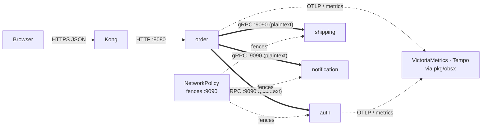
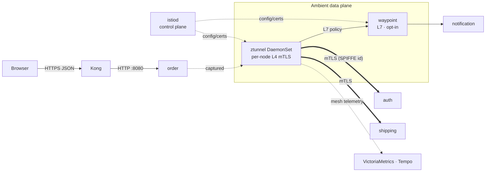

# RFC-0006 Service mesh evaluation (Istio Ambient vs Linkerd)

| Status | Scope | Created | Last updated |
|--------|-------|---------|--------------|
| provisional | infra | 2026-06-26 | 2026-06-26 |

> **Provisional.** This RFC *evaluates* a service mesh and makes a recommendation;
> it proposes **no implementation**. It is the superset sibling of
> [RFC-0002 East-west mTLS](../RFC-0002/README.md): RFC-0002 wires mTLS *in-process*
> for ~9 gRPC hops; a mesh would deliver that **plus** traffic management and L7
> telemetry transparently, at the cost of a control plane and a data-plane hop.
> Read both together — adopting a mesh could **supersede RFC-0002**.

## Summary

Evaluate whether the platform should adopt a service mesh, and if so which —
**Istio Ambient** (sidecar-less: ztunnel L4 + optional waypoint L7) or
**Linkerd** (Rust micro-proxy, mTLS-by-default) — versus **staying mesh-less** and
relying on RFC-0002 in-service mTLS + NetworkPolicy + the existing OpenTelemetry
stack. A mesh would give mesh-native mTLS, traffic shifting / canary, circuit
breaking, retries, and L7 telemetry **without touching application code**. The cost
is operational: a second control plane, per-node ztunnel / per-pod proxy overhead on
a single-node Kind cluster, and telemetry that **duplicates** what VictoriaMetrics /
Tempo already collect via `pkg/obsx`. **Recommendation: defer** — adopt RFC-0002
first; revisit a mesh only when a concrete traffic-management need or multi-node
cluster makes the overhead worth it.

## Motivation

The platform already has the three things a mesh is usually bought for, just
hand-assembled:

- **Service identity / encryption** — deferred to [RFC-0002](../RFC-0002/README.md)
  (cert-manager leaves wired into `pkg/grpcx`). East-west gRPC is plaintext today
  (`insecure.NewCredentials()`); see
  [`grpc-internal-comms.md`](../../../api/grpc-internal-comms.md) §5.
- **Network fencing** — NetworkPolicy fences `:9090`
  ([`network-policies.md`](../../../security/network-policies.md)), though kindnet
  (the local CNI) does not enforce it.
- **L7 telemetry** — RED metrics, traces, and logs already flow through `pkg/obsx`
  to VictoriaMetrics / Tempo / VictoriaLogs (AGENTS.md observability stack).

What we **don't** have, and what only a mesh (or bespoke code) provides: weight- and
header-based **traffic shifting** (canary / blue-green), mesh-level **circuit
breaking / outlier detection**, and **retries/timeouts as policy** rather than
`pkg/grpcx` defaults. The question this RFC answers is whether those features — plus
*free* mTLS that would obviate RFC-0002 — justify standing up a mesh on a homelab
that runs on a single-node Kind cluster.

### Goals

- **Decide**: adopt a mesh now, or defer — and if adopting, **Ambient or Linkerd**.
- **Quantify the trade**: what a mesh buys (mTLS, traffic shifting/canary, circuit
  breaking, retries, L7 telemetry) vs what it costs (a second control plane,
  ztunnel/sidecar overhead on Kind, telemetry duplication, a new failure domain).
- **State the relationship to [RFC-0002](../RFC-0002/README.md)** — explicitly
  whether a mesh supersedes the in-process mTLS work or coexists with it.
- **Define revisit criteria** so "defer" is a decision with a trigger, not a punt.

### Non-Goals

- **Implementing a mesh now.** This RFC recommends and gates; it ships nothing.
- **Replacing Kong (north-south).** The mesh, if adopted, governs **east-west**
  only; Kong stays the edge gateway (no Istio Gateway / Linkerd ingress here).
- **SPIFFE/SPIRE as a standalone control plane** — both meshes embed a SPIFFE
  identity model; we do not add SPIRE separately (same verdict as RFC-0002 (c)).

## Proposal

Treat this as a three-way decision and recommend explicitly.

### Alternatives

| Option | Verdict | Why |
|--------|---------|-----|
| **(a) Istio Ambient** — ztunnel (per-node L4 mTLS) + optional waypoint (L7) | **Strongest mesh option if/when we mesh** | No sidecar injection, no per-pod proxy → far lower overhead than sidecar Istio, viable on Kind. mTLS at the ztunnel with **zero pod changes**; pay for a waypoint only on namespaces that need L7 traffic shifting/retries. Full Istio L7 feature set (`VirtualService`, `DestinationRule`) when you opt in. Cost: ztunnel DaemonSet + istiod control plane + CRD surface; newest of the three, sharpest edges. |
| **(b) Linkerd** — per-pod Rust micro-proxy, mTLS by default | **Simplest mesh; pick if ops simplicity dominates** | Smallest, fastest proxy; mTLS on by default with auto-rotated identities; tiny control plane; gentle learning curve. Cost: still a **per-pod sidecar** (injection, restarts, 2× container count on Kind); traffic-splitting is less expressive than Istio; another control plane regardless. |
| **(c) Stay mesh-less** — RFC-0002 in-service mTLS + NetworkPolicy + existing OTel | **RECOMMENDED (defer the mesh)** | RFC-0002 delivers the *identity* gap (the only active need) for ~30 lines in two `pkg` helpers, **no new runtime component**. NetworkPolicy fences the network; `pkg/obsx` already gives L7 telemetry. We have **no live need** for traffic shifting or circuit breaking, and the homelab is a **single-node Kind** cluster where a control plane + data-plane hop is pure overhead. |

**Recommendation: (c) — defer.** Ship RFC-0002, keep NetworkPolicy + OTel, and
**revisit a mesh when at least one revisit criterion below is true**. A mesh is a
platform-wide commitment; adopting it for ~9 gRPC hops with no canary requirement
mirrors the "defer the mesh" calls already made in
[`grpc-internal-comms.md`](../../../api/grpc-internal-comms.md) §3/§8 and
[RFC-0002 alternative (b)](../RFC-0002/README.md).

**Revisit when any of these become true:**

- A real need for **progressive delivery** (weighted canary / header-based routing)
  that Flux + Kong cannot satisfy cleanly.
- The cluster moves **off single-node Kind** (real nodes, an enforcing CNI), so
  ztunnel/sidecar overhead is amortized and NetworkPolicy actually enforces.
- **Per-call authorization** (which service may call which RPC) is needed beyond
  CA-level trust — mesh `AuthorizationPolicy` is far better than hand-rolled checks.
- Mesh lands **for another reason** (e.g. multi-cluster), making east-west mTLS a
  free rider.

**If/when we do mesh, prefer (a) Istio Ambient** — it is the only option whose
overhead is plausible on this cluster (no per-pod proxy) while keeping the full L7
toolkit one waypoint away.

## Architecture & Diagrams

**Today** — NetworkPolicy fence + per-service gRPC over headless Services
(`round_robin`), telemetry via `pkg/obsx`; identity gap pending RFC-0002:

**With Istio Ambient** — ztunnel transparently intercepts east-west, terminates
mTLS at L4, emits its own telemetry; a waypoint is added only where L7 policy
(traffic shift / retries) is wanted:

## Design Details

How each capability would land if we adopt (a) Ambient — and where it overlaps what
exists.

- **mTLS / identity (SPIFFE).** Both meshes issue **SPIFFE SVIDs** keyed on the pod
  ServiceAccount (`spiffe://<trust-domain>/ns/<ns>/sa/<sa>`); istiod (Ambient) or the
  Linkerd identity controller is the CA, auto-rotating short-lived leaves. This is a
  **separate trust root** from RFC-0002's `homelab-ca` — adopting a mesh means the
  mesh CA *replaces* the in-process mTLS, not layers under it. `pkg/grpcx` reverts to
  `insecure` creds because the proxy/ztunnel owns the wire; that is the migration
  *back out* of RFC-0002 if a mesh wins.
- **Traffic policy CRDs.** Istio: `VirtualService` (weighted/header routing) +
  `DestinationRule` (outlier detection = circuit breaking, retries, connection
  pools), enforced at a **waypoint**. Linkerd: `HTTPRoute` + `ServiceProfile` /
  policy CRDs — simpler, less expressive splitting. None of this exists today;
  `pkg/grpcx` only has static `round_robin` + `UNAVAILABLE` retry.
- **Telemetry overlap.** The mesh emits its own RED metrics + access logs + (Istio)
  trace spans from the proxy. We **already** collect RED + traces from
  `pkg/obsx` in-app. Running both **double-counts** request metrics and can
  **split a trace** across app-span and proxy-span unless context propagation is
  reconciled. A mesh adoption requires deciding which layer owns RED (recommend:
  keep app-level, **disable mesh metrics scraping** to avoid cardinality blow-up).
- **Kind / resource constraints.** Single-node Kind: sidecar Istio (~1 Envoy per
  pod, ~17 pods) is impractical; **Ambient's single ztunnel DaemonSet** + istiod is
  the only realistically affordable mesh footprint here, and even that competes with
  the already-dense local stack (VM, Tempo, CNPG, Temporal, Kong, Kyverno). Linkerd's
  micro-proxy is lighter than Envoy but still per-pod.
- **Migration path from RFC-0002.** If RFC-0002 ships first (likely), adopting a mesh
  later means: add pods/namespaces to the mesh, let ztunnel take over mTLS, then
  **remove** the per-service `Certificate`s and the `pkg/grpcx` TLS wiring. The two
  are mutually exclusive on the wire — never run in-process mTLS *under* mesh mTLS
  (double encryption, broken identity). This is the cleanest reason to treat RFC-0006
  as a superset: RFC-0002 is the cheap interim; a mesh is the upgrade that retires it.
- **Enable / disable.** Ambient is opt-in per namespace (`istio.io/dataplane-mode:
  ambient` label) and reversible by removing the label; Kyverno admission must allow
  the istio-system control plane + ztunnel DaemonSet (a documented exception, since
  ztunnel needs elevated networking caps — a PSS/Kyverno cost worth flagging).
- **Drawbacks.** A second control plane to operate, patch, and debug; a new failure
  domain on the east-west hot path (a ztunnel/istiod outage degrades every hop);
  telemetry de-duplication work; Kyverno/PSS exceptions for the data plane; and
  newest-tech operational risk for Ambient.

## Security considerations

- **Trust boundary shifts to the mesh CA.** A mesh authenticates the *service* via
  SPIFFE SVIDs — same goal as RFC-0002, different root of trust. JWT-in-metadata
  (the *user* layer) and NetworkPolicy (the network fence) are unchanged and still
  complementary. Adopting a mesh means the **mesh CA**, not `homelab-ca`, becomes the
  identity authority for east-west.
- **Stronger authz than RFC-0002.** A mesh adds `AuthorizationPolicy` (per-source,
  per-path allow/deny) — closing the gap RFC-0002 explicitly leaves open (CA-level
  trust, no per-peer allow-lists). This is a genuine security *upgrade*, and a key
  revisit trigger.
- **New privileged components.** ztunnel (and Istio CNI) need elevated networking
  capabilities → **Kyverno/PSS exceptions** under
  `kubernetes/infra/configs/kyverno/exceptions/` with owner + `expires-at`. This
  enlarges the privileged surface — weigh against the in-process mTLS path, which
  needs **no** exception (two read-only volume mounts).
- **NetworkPolicy still required.** A mesh proves identity; it does not replace the
  network fence. Keep [`network-policies.md`](../../../security/network-policies.md).

## Observability & SLO impact

- **Duplication risk is the headline.** The mesh would emit RED metrics + traces
  that overlap `pkg/obsx`. Decide ownership up front: keep **app-level RED** (already
  feeding SLOs via Sloth) and treat mesh metrics as supplementary or off, to avoid
  doubled request counts and Tempo trace splits.
- **New signals if adopted:** ztunnel/proxy mTLS handshake success, per-hop L7
  success rate at the waypoint, control-plane (istiod/identity) health — net-new
  alerts and a mesh dashboard to own.
- **SLO continuity:** existing per-service SLOs key off app `/metrics`; a mesh must
  not silently become the SLO source of truth without a reconciliation pass.

## Rollout & rollback

Not applicable while **deferred** — nothing rolls out. The phased plan **if** a mesh
is later adopted (recorded here so the decision has a shape):

1. **Control plane only** — install istiod + ztunnel in `istio-system`; no namespace
   enrolled; verify no app traffic is captured.
2. **One namespace, mTLS only** — label a low-risk namespace `ambient`; confirm
   east-west mTLS at ztunnel and trace/RED continuity; **no waypoint yet**.
3. **Retire RFC-0002 on enrolled hops** — remove per-service `Certificate`s +
   `pkg/grpcx` TLS once ztunnel owns the wire (never run both).
4. **Waypoint + traffic policy** — add a waypoint only where canary/retry/circuit
   breaking is actually wanted.
5. **Rollback** — remove the namespace label → ztunnel stops capturing → traffic
   reverts to plaintext (or back to RFC-0002 mTLS if its certs are re-applied first).

## Testing / verification

- **Decision-stage (now):** none — this RFC ships no code.
- **If adopted:** Kind end-to-end — login (`/me`), product reviews, checkout →
  notification + Temporal saga all succeed over mesh mTLS with **trace continuity**
  intact (no app/proxy span split) and **no RED/SLO regression**. Negative drill:
  kill ztunnel → confirm the hop fails closed and mesh-health alerts fire.

## Implementation History

TBD — provisional; deferred, no implementation. Revisit per the criteria above.

## Related

- [RFC-0002 East-west mTLS](../RFC-0002/README.md) — the lightweight in-process
  alternative this RFC is the superset of; a mesh would supersede it.
- East-west transport & "defer the mesh" rationale:
  [`docs/api/grpc-internal-comms.md`](../../../api/grpc-internal-comms.md) (§3, §5, §8).
- Network fence: [`docs/security/network-policies.md`](../../../security/network-policies.md).
- Roadmap source: `TODO.md` → *Service Mesh & Traffic Management*.
