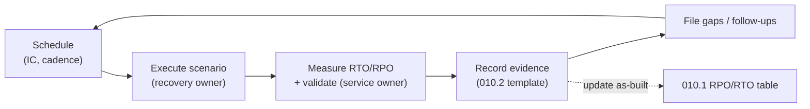
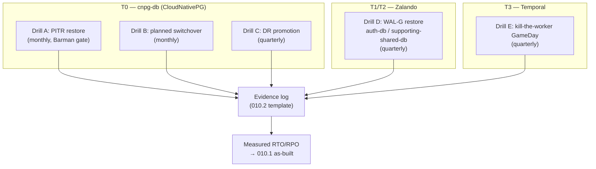

# RFC-0007 Disaster-recovery drills program

**Status:** provisional

**Scope:** infra

**Creation date:** 2026-06-26

**Last update:** 2026-06-26

## Summary

The platform has backups, replicas, and recovery runbooks — but it has **never
rehearsed using them on a schedule with recorded, measured evidence**. Every
RTO/RPO target in [`010.1`](../../../databases/010.1-rpo-rto-planning.md) is an
estimate, and the Barman Cloud Plugin migration cannot be declared
production-accepted until a plugin-backed backup + restore/PITR drill is
*completed and recorded* ([`010-drp.md`](../../../databases/010-drp.md#barman-cloud-plugin-current-state)).
This RFC establishes a **recurring DR-drills program**: a cadence, named roles, a
scenario catalog (PITR restore, replica promotion/failover, bootstrap-from-object-store),
and an evidence log — reusing the template already in
[`010.2`](../../../databases/010.2-restore-and-failover-drills.md) — so the
estimated RTOs become measured ones and the gaps close with proof.

## Motivation

> A backup you have never restored is a hypothesis, not a backup.
> — [`010.2`](../../../databases/010.2-restore-and-failover-drills.md)

The DR documentation is mature (a DRP, RPO/RTO planning, a drill playbook, an
emergency-recovery runbook), but the operational loop that *exercises* it is the
missing piece. Concretely:

- **RTO/RPO are unproven.** The as-built table in
  [`010.1`](../../../databases/010.1-rpo-rto-planning.md#as-built-rporto-today)
  marks DR promotion, PITR, and the Zalando restore as **"⏳ drills pending"**;
  the [`010-drp.md` matrix](../../../databases/010-drp.md#rporto-matrix) repeats
  "Requires drill" for every non-trivial scenario.
- **Drills are not drill-recorded.** [`010-drp.md → Known Gaps`](../../../databases/010-drp.md#known-gaps-and-next-improvements)
  lists "Restore drills and DR promotions are not yet recorded as recurring
  evidence" as an open item.
- **The Barman plugin is blocked on a recorded drill.** Until a plugin-backed
  on-demand backup *and* restore/PITR drill exist and are recorded, the migration
  is "not fully production-accepted" and existing RustFS prefixes must not be
  deleted.
- **TODO commitments are open.** The [Reliability & Operations](../../../../TODO.md)
  backlog calls out "PITR drill (end-to-end)", "DR runbooks codified and
  periodically tested", and "Game days (kill primary, network partition)".

### Goals

- A **recurring drill program** with a published cadence, named roles, and a
  scenario catalog covering PITR restore, replica promotion / HA failover, and
  bootstrap-from-object-store.
- An **evidence log** per run — reusing the
  [`010.2` template](../../../databases/010.2-restore-and-failover-drills.md#evidence-log-template) —
  with **measured RTO/RPO per tier**, pass/fail validation, and IC sign-off.
- **Convert the estimates** in [`010.1`](../../../databases/010.1-rpo-rto-planning.md)
  to measured values, updating the as-built rows as drills complete.
- **Accept the Barman Cloud Plugin** via a recorded plugin-backed backup +
  restore/PITR drill (Drill A on `cnpg-db`).

### Non-Goals

- **Building new DR infrastructure.** Closing the SPOF / HA gaps is
  [RFC-0005](../RFC-0005/); independent failure domains are the cross-region
  roadmap ([`010.3`](../../../databases/010.3-cross-region-dr.md)). This RFC
  *exercises* what exists; it does not add capacity.
- **Full chaos-engineering tooling.** Automated fault injection (Litmus / Chaos
  Mesh) is a *related future step* (see [Alternatives](#alternatives)), not part
  of this program's first iteration.
- **Re-deriving RPO/RTO math** — that stays in
  [`006-backup-strategy.md`](../../../databases/006-backup-strategy.md).

## Proposal

Stand up a **scheduled-and-recorded** drills program on top of the existing
[`010.2`](../../../databases/010.2-restore-and-failover-drills.md) playbook. The
playbook already defines drills A–D, their cadence, roles, and an evidence-log
template; this RFC's contribution is to make running them a **standing program**:
a fixed schedule, an owner, a place evidence lives, explicit pass/fail criteria
tied to [`010.1`](../../../databases/010.1-rpo-rto-planning.md), and the
acceptance gate for the Barman plugin.

**Cadence and scenario catalog** (mirrors the
[`010.2` drill calendar](../../../databases/010.2-restore-and-failover-drills.md#drill-calendar),
extended with Temporal):

| Drill | Cadence | Cluster / target | Scenario | Pass criterion (vs [`010.1`](../../../databases/010.1-rpo-rto-planning.md)) |
|-------|---------|------------------|----------|------------------------------|
| **A — PITR restore-test** | Monthly | `cnpg-db` (T0) | Restore base backup + WAL replay to a **throwaway** cluster, validate | ≤ 30 min to validated throwaway; **plugin-backed** (Barman acceptance gate) |
| **B — Planned switchover** | Monthly | `cnpg-db` (T0) | HA failover + app reconnect via PgDog | ≤ 1 min cut-over |
| **C — DR promotion rehearsal** | Quarterly | `cnpg-db-replica` (T0) | Whole-cluster-loss recovery (against a restored copy) | ≤ 30 min; RPO ≤ `archive_timeout` (5 min) |
| **D — Zalando WAL-G restore** | Quarterly | `auth-db` / `supporting-shared-db` (T1/T2) | Clone-from-backup, validate | Manual, recorded |
| **E — Kill-the-worker (GameDay)** | Quarterly | Temporal `order-fulfillment` worker | Durability + mid-saga compensation survive a worker/pod kill | Workflow resumes; order reaches a terminal state |

**Roles** (per [`010-drp.md` ownership](../../../databases/010-drp.md#ownership)):
incident commander (schedules, owns the timeline, go/no-go), database recovery
owner (executes, captures timings), service owner (app smoke test), security
owner (confirms the restore identity / object-store access).

### Alternatives

| # | Option | Pro | Con |
|---|--------|-----|-----|
| (a) | **Ad-hoc drills** *(status quo)* | Zero process cost | Nothing gets recorded; RTOs stay estimates; the Barman gate never closes |
| **(b)** | **Scheduled-and-recorded** *(recommended)* | Predictable cadence + signed evidence; converts estimates to measured RTOs; cheap (reuses `010.2`) | Manual effort each cycle; needs a named owner to not lapse |
| (c) | **Automated / chaos-tooling** (Litmus, Chaos Mesh) | Continuous, unattended fault injection; catches regressions | High setup cost; needs the manual drills to be *trusted* first to know what "pass" looks like |

**Recommendation: (b) now, (c) later.** Scheduled-and-recorded drills are the
cheapest path that produces the missing evidence and unblocks the Barman plugin.
Automated chaos tooling is the natural follow-on once the manual scenarios have a
known-good baseline — tracked against the
[Reliability & Operations](../../../../TODO.md) chaos-engineering item.

## Architecture & Diagrams

**Drill lifecycle** — the loop every run follows:

**Scenario map across clusters:**

## Design Details

- **Scenario catalog & who runs it.** Drills A–D are the existing
  [`010.2`](../../../databases/010.2-restore-and-failover-drills.md) procedures
  (commands, manifests, and go/no-go checks live there — not duplicated here).
  Drill E (kill-the-worker) is the
  [RFC-0001 GameDay](../RFC-0001/#future-work) future-work item: kill the
  `order-fulfillment` worker pod mid-saga and confirm Temporal's durable
  execution resumes and compensations run. The database recovery owner executes;
  the service owner validates; the IC signs off.
- **Where evidence lives.** Each run produces one
  [`010.2` evidence record](../../../databases/010.2-restore-and-failover-drills.md#evidence-log-template)
  (drill ID `DR-YYYY-MM-<type>`, timestamps, backup ID, recovery target,
  measured RTO/RPO, validations, sign-off). Until a dedicated drill log exists,
  records are appended to the DRP evidence trail and linked from the scheduling
  PR — closing the "recorded as recurring evidence" gap in
  [`010-drp.md`](../../../databases/010-drp.md#known-gaps-and-next-improvements).
- **Pass/fail criteria.** A drill **passes** when its measured RTO is within the
  SLO column above *and* schema, row-count, and app smoke tests pass. A pass
  updates the matching as-built row in
  [`010.1`](../../../databases/010.1-rpo-rto-planning.md#as-built-rporto-today)
  from "⏳ pending" to the measured value; a fail files a follow-up and keeps the
  estimate.
- **Barman plugin acceptance criteria.** The plugin is **production-accepted**
  once Drill A has been run *plugin-backed* (on-demand backup via the Barman
  `ObjectStore` path **and** a restore/PITR from it) and the evidence recorded.
  Only then may legacy in-tree RustFS prefixes be retired
  ([`010-drp.md`](../../../databases/010-drp.md#barman-cloud-plugin-current-state)).
- **Ties to other RFCs.** Drill D's `supporting-shared-db` failover is the
  recorded-drill deliverable [RFC-0005](../RFC-0005/) depends on; once that
  cluster is 3-node HA, Drill D gains a leader-kill failover step. Drill E
  retires the [RFC-0001 GameDay](../RFC-0001/#future-work) backlog item.
- **Enable / disable.** The program is process, not deployed config: "enable" =
  the schedule is on a calendar with an owner; "disable" = pause the calendar
  (drills are read-only rehearsals against throwaway clusters, so pausing carries
  no cluster risk). No manifest change enables or disables it.
- **How an operator knows it is in use.** A current, dated row exists in the
  evidence log for each drill within its cadence window; stale rows mean the
  program has lapsed.
- **Drawbacks.** Recurring manual effort; without a named owner the cadence
  lapses (this is the chief failure mode of status-quo (a), so ownership is the
  one hard requirement). Throwaway restore clusters consume transient Kind/node
  headroom during a run — tear down after evidence capture.

## Security considerations

Minimal, and mostly confirmatory. Each drill **verifies** the restore used the
read-only / restore identity (security-owner step in the
[`010.2` roles](../../../databases/010.2-restore-and-failover-drills.md#roles-per-010-drpmd-ownership)),
which surfaces the current shared-RustFS-credential gap
([`010-drp.md` control baseline](../../../databases/010-drp.md#control-baseline)).
No new secret, trust boundary, or NetworkPolicy. Throwaway restore clusters live
in the same namespace as their source and are torn down post-drill.

## Observability & SLO impact

- **Grafana drill annotations.** Mark each drill's start/end as a Grafana
  annotation so the RTO window is visible against the cluster's normal RED/latency
  panels and the [`010.1`](../../../databases/010.1-rpo-rto-planning.md) SLO
  context.
- **Closes a monitoring blind spot.** Drill D is currently the *only* routine
  check that the Zalando WAL-G backups still restore — Zalando clusters have **no
  backup-age/failure alerting** (the PrometheusRule covers CNPG only,
  per [`010.2`](../../../databases/010.2-restore-and-failover-drills.md#drill-d--zalando-wal-g-restore-quarterly)).
- **No new SLOs** are created here; the program *measures attainment* of the
  existing per-tier RTO/RPO targets and feeds the numbers back into
  [`010.1`](../../../databases/010.1-rpo-rto-planning.md).

## Rollout & rollback

- **Start with Drill A (`cnpg-db` PITR)** — it both produces the first measured
  T0 RTO and is the **Barman plugin acceptance gate**, so it has the highest
  payoff per run.
- **Phase 1:** schedule + run Drill A (plugin-backed), record evidence, accept
  the plugin, update [`010.1`](../../../databases/010.1-rpo-rto-planning.md).
  **Phase 2:** add Drills B and D. **Phase 3:** add quarterly C and E.
- **Blast radius:** drills restore to throwaway clusters or rehearse against
  restored copies (never the live DR target) — no production write-path impact
  except the *intentional* switchover in Drill B.
- **Rollback:** pause the calendar; tear down any throwaway restore clusters.
  Nothing persists.

## Testing / verification

The drills **are** the test. Each run is self-verifying via its evidence record:
schema validation, critical-table row counts, and an application smoke test
(service owner) against the recovered cluster, with measured RTO/RPO compared to
the SLO. A run with no recorded evidence did not happen.

## Implementation History

- TBD — provisional; no drill recorded yet. First milestone: a plugin-backed
  Drill A on `cnpg-db` with recorded evidence (Barman acceptance gate).

## Related

- DRP & playbooks: [`010-drp.md`](../../../databases/010-drp.md),
  [`010.1-rpo-rto-planning.md`](../../../databases/010.1-rpo-rto-planning.md),
  [`010.2-restore-and-failover-drills.md`](../../../databases/010.2-restore-and-failover-drills.md),
  [`010.4-emergency-recovery.md`](../../../databases/010.4-emergency-recovery.md).
- [RFC-0001](../RFC-0001/) — Temporal saga; this program retires its
  kill-the-worker / mid-saga-compensation GameDay future work (Drill E).
- [RFC-0005](../RFC-0005/) — `supporting-shared-db` HA; its failover drill is
  Drill D's deliverable.
- [`TODO.md` → Reliability & Operations](../../../../TODO.md) — PITR drill, DR
  runbooks periodically tested, game days, and chaos engineering (the (c)
  follow-on).
