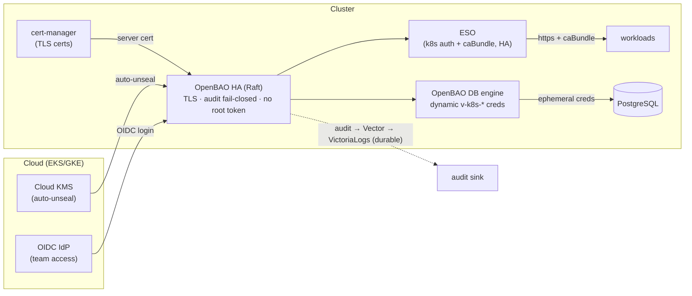

# RFC-0008 Production secrets hardening & local/prod parity

| Status | Scope | Created | Last updated |
|--------|-------|---------|--------------|
| provisional | infra | 2026-06-29 | 2026-06-29 |

## Summary

The platform's secrets stack (OpenBAO HA + External Secrets Operator) runs on a
local Kind cluster with deliberate **dev-grade compromises** that are unsafe for
production *and* cannot be exercised on Kind (no cloud KMS, no real IdP, no public
TLS). This RFC defines the **production hardening target** — auto-unseal, TLS,
dynamic / non-committed credentials, OIDC, fail-closed durable audit, root-token
revocation — and, just as importantly, a **local-vs-prod parity & testing matrix**
that states exactly *what Kind can validate* versus *what needs a cloud/staging
cluster*. It is the gate a copier of this repo follows before any production use.

## Motivation

This repo is built to be **copied into real production**. PR-1 of the secrets
review corrected the docs to show that much of the "production" behaviour is in
fact a target, not the deployed state. A security audit surfaced four Critical and
three High findings (below) that would be a full compromise of the secrets tier if
shipped as-is. Because the secrets layer "can't be tested well on Kind," the team
needs (a) one authoritative hardening plan and (b) an explicit map of which
guarantees are actually validated where — so "it works on Kind" is never mistaken
for "it's production-ready."

### Goals

- A **per-feature parity matrix**: deployed-on-Kind vs production-required, and how
  to switch between them.
- A **testing strategy** that names what Kind validates vs what requires a
  cloud/staging cluster.
- A **prod Kustomize overlay** approach so the hardened variant is version-controlled
  and `make validate`-checked separately from local — never by editing local manifests.
- Close every Critical/High finding from the secrets security audit.

### Non-Goals

- Applying the production manifests now — there is no cloud cluster to validate them
  against (that is the whole point of the parity matrix). This RFC is proposal-only.
- Changing local Kind behaviour — it stays dev-grade for fast iteration.
- Secret-scanning / pre-commit tooling and git-history purge of already-leaked dev
  creds — related, tracked separately (see Related).

## Proposal

Each item is **current (local) → production target**:

1. **Unseal** — Shamir with the unseal key + root token in the `openbao-init-keys`
   K8s Secret, re-applied by a 60s unsealer CronJob → **KMS/Transit auto-unseal**
   (`seal "awskms"` / `seal "gcpckms"` via IRSA / Workload Identity); **delete the
   unsealer CronJob**.
2. **TLS** — `tlsDisable: true` (plaintext HTTP) → cert-manager `Certificate` +
   `tls_disable=0` + `caBundle` in the ESO `ClusterSecretStore`.
3. **Credentials in Git** — dev passwords seeded from the bootstrap ConfigMap
   (`*-K1nd-2026!`) → **generated at bootstrap** (OpenBAO password policies) or
   dynamic; **zero secret values in Git**; rotate the already-committed ones.
4. **DB credential bypass** — `cart`/`order` users created with hardcoded
   `postInitSQL` passwords (ESO-bypassed) → CNPG `managed.roles` with an
   ESO-backed `passwordSecret`, and/or the **OpenBAO database secrets engine**
   (dynamic, per-pod, TTL'd `v-k8s-{role}-{ts}` users).
5. **Audit** — best-effort `file → stdout` (`… 2>/dev/null || echo`,
   `auditStorage: false`) → **fail-closed** enablement (check `bao audit list`,
   exit non-zero if absent) + **durable** `auditStorage`; verify ingestion end-to-end.
6. **Root token** — persisted in the Secret, reused for day-2 ops → **revoked after
   bootstrap**; operator access via **OIDC / AppRole**.
7. **Policy** — a `devops-admin` `path "*" { … sudo }` written on every bootstrap →
   create least-privilege policies on demand, bind admin only to an OIDC group.
8. **ESO HA** — `replicaCount: 1` → `2+` with leader election + a PodDisruptionBudget.

### Alternatives

- **Cloud secret managers only** (AWS/GCP SM, no in-cluster OpenBAO) — rejected: we
  want one ESO integration + a Vault-compatible API that also runs on Kind; cloud
  KMS still enters as the unseal backend.
- **SealedSecrets / SOPS** — rejected: no leasing, dynamic secrets, central policy,
  or audit; can't deliver dynamic DB creds.
- **Keep local compromises, document only** — rejected: leaves a copier one
  `kubectl get secret` away from full compromise with no remediation path.

## Architecture & Diagrams

Production target (contrasted with the local Kind compromises it replaces):

> Local Kind replaces `KMS` with Shamir-key-in-a-Secret + a 60s unsealer CronJob,
> runs OpenBAO over plaintext HTTP, seeds static dev creds, and has no IdP — all the
> things this RFC hardens.

## Design Details

> The full working plan — feature-selection matrix, cluster/namespace/auth/policy
> design, the database-credential redesign with SQL templates, the installation
> phases, and the day-2 runbooks — lives in [implementation.md](./implementation.md).
> Summary of the key points:

- **Prod overlay, not edits.** The hardened variant lives in a separate Kustomize
  overlay / Helm values (e.g. a `prod` overlay) that flips the seal stanza, sets
  `tls_disable=0` + mounts the cert, drops the seeded-secrets step and the unsealer
  CronJob, enables `auditStorage`, and adds the OIDC auth method. Local stays the
  default; `make validate` checks both overlays independently.
- **Enable/disable** — selecting the overlay is the switch; it is fully reversible
  (select local again). No change to the local developer flow.
- **Operator can confirm it's in use** — `bao status` shows `Seal Type: awskms`;
  `bao audit list` shows an enabled device; the ESO `ClusterSecretStore` URL is
  `https://`; `bao token lookup` on the old root token fails (revoked).
- **Drawbacks** — requires a cloud KMS + a real cluster to exercise; more bootstrap
  ceremony (PGP/KMS init). This is inherent to production secrets and is exactly why
  it can't be validated on Kind.

### Local-vs-prod parity & testing matrix

| Feature | Local Kind (today) | Production target | Validated by Kind? |
|---|---|---|---|
| HA / Raft storage | ✅ 3-node, PVC | same | ✅ quorum + restart-survival |
| ESO sync + k8s auth + least-priv policy | ✅ | same | ✅ app gets secret; out-of-scope path denied |
| KV v2 static secrets | ✅ | replaced by dynamic | ✅ mechanics |
| **Auto-unseal** | ❌ Shamir key in Secret + 60s CronJob | KMS/Transit | ❌ needs cloud KMS (optionally emulate w/ a transit-unseal OpenBAO) |
| **TLS** | ❌ disabled | cert-manager TLS + caBundle | ⚠ self-signed mechanics only; not the prod cert path |
| **Dynamic DB creds** | ❌ not enabled; `cart`/`order` hardcoded | DB engine, per-pod TTL | ⚠ engine mechanics testable vs local PG; not cloud IAM |
| **OIDC team access** | ❌ none | OIDC | ❌ needs a real IdP |
| **No creds in Git** | ❌ dev creds committed | generated / dynamic | ✅ generated-at-bootstrap mechanics |
| **Fail-closed durable audit** | ⚠ best-effort stdout | fail-closed + `auditStorage` | ⚠ can see logs; can't prove durability/fail-closed without prod config |
| Root-token revoked | ❌ persisted | revoked post-bootstrap | ✅ revoke step testable |

**Testing tiers:**

- **Kind (local) — functional smoke:** ESO sync, policy scoping, an app receiving
  its secret, HA restart/unseal, generated-creds + DB-engine *mechanics* (optionally
  a transit-unseal OpenBAO to rehearse auto-unseal).
- **Staging / cloud (EKS/GKE) — the production path:** KMS auto-unseal, real TLS,
  dynamic creds against cloud IAM, OIDC login, and fail-closed + durable audit. These
  **cannot** be signed off on Kind.
- **Pre-prod gate:** a checklist mapping each Critical/High finding → the overlay
  change that closes it → the tier that validates it. No prod deploy until green.

## Security considerations

This RFC *is* the security work. It closes the audit findings: **Critical** —
unseal-key + root token in a K8s Secret, the 60s unsealer, root token never revoked,
plaintext dev creds in Git; **High** — TLS disabled, audit not fail-closed, an
always-present `path "*"` god-mode policy. Kyverno/PSS posture is unchanged
(bootstrap pods are already PSS-restricted). Trust boundary: ESO↔OpenBAO moves from
plaintext HTTP to mTLS-validated HTTPS.

## Observability & SLO impact

Add verification that the audit device is enabled and ingested (alert if absent), and
a sealed-node alert. No application SLO change. During rollout, watch ESO
`sync_calls_error_total` and OpenBAO seal status.

## Rollout & rollback

Introduce the prod overlay incrementally, one hardening item at a time, behind the
overlay selector. Rollback = select the local overlay. Blast radius is the entire
secrets tier, so each step is staged on a non-prod cluster first and gated by the
pre-prod checklist.

## Testing / verification

The parity matrix + testing tiers above are the verification plan. Each overlay is
`make validate`-checked; cloud-only features are signed off on a staging cluster, not Kind.

## Implementation History

- 2026-06-29 — `provisional`. Proposal only; no manifests applied.

## Related

- Decisions already shipped: [ADR-004](../../adr/ADR-004-enable-openbao-audit-logging/) (audit), [ADR-005](../../adr/ADR-005-openbao-ha-raft/) (OpenBAO HA).
- [Implementation detail](./implementation.md) — the long-form working plan this RFC formalises (feature selection, architecture, DB-credential redesign + SQL templates, installation phases, day-2 procedures).
- [`docs/secrets/README.md`](../../../secrets/README.md) — current-state-vs-planned banner.
- RFC backlog items this supersedes/absorbs: secret rotation (dynamic creds remove the need), and is adjacent to split-bootstrap + PushSecret.

---
_Last updated: 2026-06-29_
