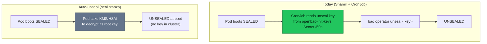
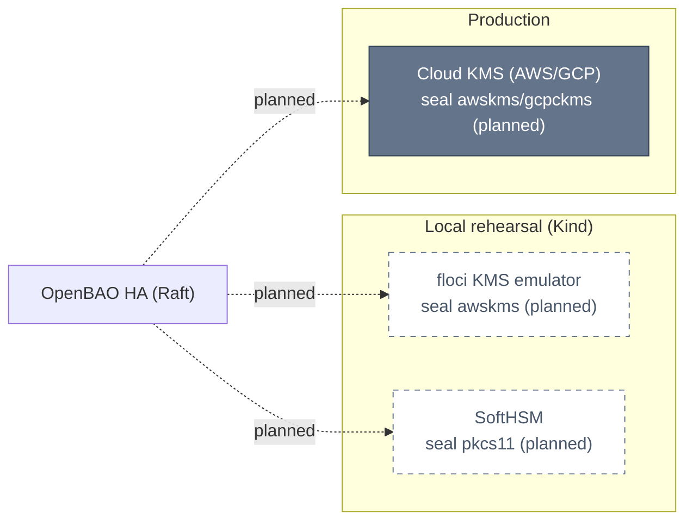

# RFC-0008 — Research: Production secrets hardening & local/prod parity

<!-- Backfilled to align RFC-0008 with the research-first flow (RFC-0019 onward). The
     README.md already exists (provisional); this file is the plain-language deep dive +
     audit trail behind it, spine-focused on the unseal/auto-unseal thread. -->

| | |
|---|---|
| **RFC** | [RFC-0008](./README.md) |
| **Status** | provisional (research backfilled) |
| **Scope** | infra |
| **Created** | 2026-06-29 |
| **Last updated** | 2026-07-19 |

> **Plain-language research.** Written like a careful blog post; jargon gets an
> **"In plain terms"** note. Facts verified against manifests + Context7 + a local PoC.
>
> **Spine:** the **unseal / auto-unseal** thread (the audit's top finding). The other
> seven hardening items are covered as breadth around it. Decisions stay in
> [`README.md`](./README.md).

---

## Table of contents

1. [Problem statement](#problem-statement)
2. [Reading path](#reading-path)
3. [What secrets hardening is](#what-secrets-hardening-is)
4. [Core components](#core-components)
5. [Core mechanism](#core-mechanism)
6. [Glossary](#glossary)
7. [Worked examples](#worked-examples)
8. [vs platform as-built](#vs-platform-as-built)
9. [Integration paths](#integration-paths)
10. [Alternatives](#alternatives)
11. [Open questions](#open-questions)
12. [FAQ](#faq)
13. [References](#references)
14. [Context7 audit log](#context7-audit-log)
15. [Research review gate](#research-review-gate)

---

## Problem statement

### Real-world trigger

| | |
|---|---|
| **Situation** | OpenBAO on Kind is unsealed by a **Shamir key + root token stored in a plaintext K8s Secret** (`openbao-init-keys`), re-applied by a **60s unsealer CronJob**. Anyone with `kubectl get secret -n openbao` holds the master key → decrypt every secret. The team also believed **auto-unseal "can't be exercised on Kind"** (no cloud KMS), so the prod lock is only documented, never rehearsed. |
| **Who feels it** | Security (audit findings), platform/on-call (day-2 unseal toil), and **anyone copying this repo to production**. |
| **Why now** | A secrets audit surfaced **4 Critical + 3 High**; the repo is **public** (dev creds committed, including an RS256 JWT signing key); and work is moving toward a persistent mini-PC cluster where dev-grade choices stop being throwaway. |
| **If we do nothing** | A copier is one `kubectl get secret` away from full compromise, and the hardening path stays a doc target no one has run — "works on Kind" gets mistaken for "production-ready." |

> **In plain terms:** our vault is unlocked by a key taped inside the same room, and
> we assumed we couldn't practice the real lock at home.

### What homelab practice proves

- **Can we actually rehearse real auto-unseal on Kind** — `seal "awskms"` / `seal
  "pkcs11"` — instead of only documenting it? *(PoC below: yes.)*
- Which local stand-in for cloud KMS fits Kind + GitOps (a KMS emulator vs a software HSM)?
- What exactly does Kind validate vs what still needs a cloud/staging cluster (the parity matrix)?

---

## Reading path

1. [What secrets hardening is](#what-secrets-hardening-is) → [Core mechanism](#core-mechanism)
2. [Worked examples](#worked-examples) (the auto-unseal PoC) → [vs platform as-built](#vs-platform-as-built)
3. [Integration paths](#integration-paths) → [Alternatives](#alternatives) → [Research review gate](#research-review-gate)

---

## What secrets hardening is

"Hardening" here means closing the gap between the platform's **deliberate dev-grade
local choices** and **production requirements** across eight axes: unseal, TLS,
credentials-in-Git, DB credential delivery, audit durability, root-token lifecycle,
policy least-privilege, and ESO HA. The spine — **unseal** — decides how OpenBAO's
master key is protected; get it wrong and the other seven don't matter.

**Seal / unseal in one paragraph:** OpenBAO encrypts everything at rest with a **root
key**; that root key is itself sealed. **Sealed** = the key is not in memory, so the
server serves nothing (a pod boots sealed). **Unseal** = supply key material to
rebuild the root key in memory. **Shamir** splits the unseal key into shares (homelab
uses 1). **Auto-unseal** delegates the wrap/unwrap of the root key to an external
KMS/HSM, so the pod **unseals itself at boot** and no Shamir key needs to live in the
cluster.

> **In plain terms:** Shamir = you keep the key and must turn the lock yourself
> (or a robot does, reading the key off a sticky note). Auto-unseal = the safe phones
> a keyholder at boot; the key never sits in the room.

---

## Core components

| Component | Role |
|-----------|------|
| **Root key / unseal key** | The master secret protecting all stored data; what unseal reconstructs |
| **Shamir seal** | Default: key split into shares, provided manually (or by the CronJob today) |
| **Auto-seal (`seal` stanza)** | Wraps the root key with an external KMS/HSM/Transit → self-unseal at boot; init yields **recovery keys** instead of unseal keys |
| **KMS / HSM / Transit** | The external keyholder: cloud KMS (prod), SoftHSM (local HSM), or another OpenBAO's Transit engine |
| **`openbao-init-keys` Secret** | Today: holds the Shamir unseal key + root token in plaintext (the finding) |
| **ESO + ClusterSecretStore** | Delivers OpenBAO values into K8s Secrets for workloads |
| **floci / SoftHSM** | Local stand-ins that let the **awskms / pkcs11** seal be exercised on Kind |

---

## Core mechanism

**Mechanism — how a pod unseals with auto-seal vs the current cronjob:**



> **In plain terms:** the cronjob path keeps the master key inside the cluster and
> pokes the lock every minute; the auto-unseal path keeps the key with an outside
> keyholder and the pod unlocks itself the moment it starts.

With auto-seal, `bao operator init` returns **recovery keys** (for break-glass /
recovery operations) plus a root token — **not** an unseal key — and every restart
re-unseals via the KMS. The Shamir-key-in-a-Secret disappears entirely.

---

## Glossary

| Term | In plain English |
|------|------------------|
| **Sealed / unsealed** | Safe locked (no key in RAM) vs open |
| **Root key** | The one key that encrypts all stored secrets |
| **Recovery key** | Break-glass share issued under auto-seal (not used for normal unseal) |
| **awskms / gcpckms seal** | Auto-unseal wrapping the root key with a cloud KMS |
| **pkcs11 seal** | Auto-unseal wrapping the root key with an HSM (SoftHSM locally) |
| **Transit seal** | Auto-unseal wrapping via another OpenBAO's Transit engine |
| **KMS emulator** | A local service speaking the AWS KMS wire protocol (floci) |

---

## Worked examples

> **PoC actually run** (docker-compose, 2026-07-19) — this is the finding that changes
> RFC-0008's "auto-unseal can't be tested on Kind" assumption.

**floci (free OSS AWS-KMS emulator) + OpenBAO `seal "awskms"`, end-to-end:**

```hcl
seal "awskms" {
  region     = "us-east-1"
  access_key = "test"
  secret_key = "test"
  kms_key_id = "<KeyId from: aws --endpoint-url http://floci:4566 kms create-key>"
  endpoint   = "http://floci:4566"   # point at the emulator instead of real AWS
}
```

| Test | Result |
|------|--------|
| `bao operator init` (auto-seal) | `Seal Type=awskms`, `Initialized=true`, **`Sealed=false`** — init returned **recovery keys**, not an unseal key |
| Restart **openbao** only (≈ pod restart) | **`Sealed=false`** — self-unsealed, **no manual unseal, no CronJob** (`core: unsealed with stored key`) |
| Restart **floci + openbao** (KMS key must persist) | **`Sealed=false`** — floci KMS key survived its restart via `FLOCI_STORAGE_MODE=persistent` + volume `/app/data` |
| **Negative control:** wipe floci volume (`down -v`) → restart | `describe-key` → **NotFound** → OpenBAO would fail seal-validation at boot (**brick**) ⇒ the emulator's KMS state **must** be on durable storage |

**Caveat found while testing:** after deleting the key, floci `decrypt` of the old
ciphertext **still returned the plaintext** → floci's KMS is a **loose emulator**
(decrypt not bound to key existence) and is **zero-auth**. So it's a faithful stand-in
for *rehearsing the auto-unseal control flow*, **not** a real security boundary.

**SoftHSM + `seal "pkcs11"` (concept — not yet run):**

```hcl
seal "pkcs11" {
  lib       = "/usr/lib/softhsm/libsofthsm2.so"
  slot      = "0"
  pin       = "<PIN>"
  key_label = "openbao-root-key"
}
```
A software HSM holds the wrapping key inside a PKCS#11 token; the pod self-unseals
with no key in a K8s Secret. **Notably OSS in OpenBAO** (HSM auto-unseal was
Enterprise-only in HashiCorp Vault).

---

## vs platform as-built

Cross-checked against `kubernetes/infra/controllers/secrets/openbao/helmrelease.yaml`,
`.../configs/secrets/openbao-bootstrap/`, and [`docs/secrets/openbao.md`](../../../secrets/openbao.md).

**The eight hardening axes — current (Kind) → production target:**

| Axis | Today (deployed on Kind) | Production target |
|------|--------------------------|-------------------|
| **Unseal** *(spine)* | Shamir 1-share; unseal key + root token in `openbao-init-keys` Secret; 60s **unsealer CronJob** | **KMS/HSM auto-unseal** (`seal "awskms"`/`gcpckms`/`pkcs11`); delete the CronJob; keys never in-cluster |
| **TLS** | `tlsDisable: true` (plaintext HTTP) | cert-manager cert + `tls_disable=0` + `caBundle` in the `ClusterSecretStore` |
| **Creds in Git** | Dev creds seeded from the bootstrap ConfigMap (`*-K1nd-2026!`), incl. a committed RS256 JWT signing key (public repo) | Generated at bootstrap / dynamic; **zero secret values in Git**; rotate already-committed ones |
| **DB creds** | Static KV + CNPG-managed roles ([RFC-0012](../RFC-0012/) triplet) | Optionally the **OpenBAO database secrets engine** (dynamic, TTL'd `v-k8s-{role}-{ts}` app users); owner roles stay static |
| **Audit** | Best-effort `file → stdout`, `auditStorage: false` | Fail-closed enablement + durable `auditStorage`; verify ingestion |
| **Root token** | Persisted in the Secret, reused day-2 | Revoked after bootstrap; operator access via **OIDC / AppRole** |
| **Policy** | `devops-admin path "*" { … sudo }` every bootstrap | Least-privilege on demand; admin bound to an OIDC group |
| **ESO HA** | `replicaCount: 1` | `2+` with leader election + PDB |

**Parity-matrix update (the new finding):** auto-unseal was listed as *"can't be
validated on Kind."* The PoC shows it is **testable-on-Kind at emulator level** — the
`seal "awskms"` control flow (init → self-unseal → restart → self-unseal) is fully
exercisable with floci (or SoftHSM). What Kind still **cannot** validate: real KMS
crypto, IAM/Workload-Identity binding, and KMS durability guarantees — those remain
cloud/staging-only.

---

## Integration paths

How the auto-unseal keyholder could plug in (local rehearsal → prod):



- **floci + `seal "awskms"`** — same config block as prod (swap `endpoint`); fits the
  existing local-stack style; **requires** a durable volume for the KMS key + a
  NetworkPolicy (floci is zero-auth).
- **SoftHSM + `seal "pkcs11"`** — fully self-contained, no cloud/emulator; key lives in
  a persisted token; teaches the HSM path (OSS in OpenBAO).
- **Transit** — another small OpenBAO's Transit engine; realistic but only relocates the
  chicken-and-egg (the small one still needs unsealing).
- **Cloud KMS** — the real prod backend (IAM/IRSA/Workload Identity); not on Kind.

---

## Alternatives

**For the spine (how to auto-unseal on Kind):**

| Option | Pros | Cons |
|--------|------|------|
| Keep Shamir + unsealer CronJob (today) | Simplest; no new infra | Master key plaintext in a Secret; ≤60s downtime on re-seal; not prod-shaped |
| **floci + awskms** | Config identical to prod; fits local-stack; PoC-proven | Emulator (loose crypto, zero-auth); volume loss → brick |
| **SoftHSM + pkcs11** | No cloud/emulator; key not in a Secret; OSS HSM | New tooling; token must persist; config differs from prod KMS |
| Transit (self-hosted) | Enterprise-realistic pattern | Chicken-and-egg: the unseal-vault still needs unsealing |

**For the wider secrets tier** *(from the RFC)*: cloud secret managers only (rejected —
lose one ESO integration + Kind-runnable Vault API), SealedSecrets/SOPS (rejected — no
leasing/dynamic/audit/central policy).

---

## Open questions

- [ ] Local auto-unseal choice for rehearsal: **floci+awskms** (prod-parity config) vs
      **SoftHSM+pkcs11** (no emulator, key not in a Secret)?
- [ ] Do we add a NetworkPolicy fencing the emulator/HSM endpoint (floci is zero-auth)?
- [ ] Dynamic DB engine now, or keep the CNPG triplet and defer dynamic app users?
- [ ] Scope of dev-credential remediation: rotate the committed RS256 JWT key + git-history
      purge — in this RFC or tracked separately?
- [ ] Prod hardening as a **separate Kustomize overlay** (`make validate`-checked) — confirm shape.

---

## FAQ

**Does auto-unseal remove the need to store any key?**
It removes the Shamir unseal key from the cluster. The trust root moves to the KMS/HSM
(and its durability): lose that key store and OpenBAO can't unseal — a brick.

**Is the floci PoC production hardening?**
No. It **rehearses** the prod control flow locally (same `seal "awskms"` block). floci
is a loose, zero-auth emulator — a learning/parity tool, not a security upgrade.

**Why does `make down` make the brick risk moot on Kind?**
`make down` deletes the whole cluster (all PVCs), so OpenBAO re-bootstraps fresh each
`make up`; state never needs to survive across teardowns. Within a session, the volumes
persist across pod restarts — enough to exercise auto-unseal.

---

## References

- OpenBAO seal configuration — [awskms](https://openbao.org/docs/configuration/seal/awskms/),
  [pkcs11](https://openbao.org/docs/configuration/seal/pkcs11/),
  [transit](https://openbao.org/docs/configuration/seal/transit/)
- [OpenBAO Kubernetes Helm — auto-unseal](https://openbao.org/docs/platform/k8s/helm/run/)
- [floci — local AWS emulator](https://floci.io/) (KMS on `:4566`, storage modes)
- Platform: [`docs/secrets/openbao.md`](../../../secrets/openbao.md) ·
  [`docs/secrets/README.md`](../../../secrets/README.md) · this RFC's [`README.md`](./README.md)
- Related decisions: [ADR-004 (audit)](../../adr/ADR-004-enable-openbao-audit-logging/) ·
  [ADR-005 (HA Raft)](../../adr/ADR-005-openbao-ha-raft/) · [RFC-0012 (CNPG roles)](../RFC-0012/)

---

## Context7 audit log

| Claim / section | Source checked | Result |
|-----------------|----------------|--------|
| `seal` stanza is the auto-unseal alternative to Shamir | Context7 `/openbao/openbao` seal/index | confirmed |
| `awskms` seal has an `endpoint` override + needs `kms:Encrypt`/`Decrypt`/`DescribeKey` | Context7 `/openbao/openbao` awskms.mdx | confirmed |
| `pkcs11` seal with SoftHSM (lib/slot/pin/key_label; OSS in OpenBAO) | Context7 `/openbao/openbao` pkcs11 guide | confirmed |
| `transit` seal (address/token/key_name/mount_path; orphan periodic token) | Context7 `/openbao/openbao` transit.mdx | confirmed |
| floci speaks AWS KMS wire protocol on `:4566`; storage modes; `/app/data` | floci.io docs (web) + **local PoC** | confirmed |
| floci KMS key persists across restart; wiping the volume loses it | **local docker-compose PoC** | confirmed |

---

## Research review gate

- [x] Answers a **real-world problem** (audit findings + a copier one `kubectl get secret` from compromise)
- [x] **Problem statement** names situation, who feels it, cost of doing nothing
- [x] At least **two alternatives** with tradeoffs (four for the spine)
- [x] **Platform as-built** filled from manifests/docs (the 8-axis table)
- [x] Primary direction stated (auto-unseal spine; local rehearsal via emulator/HSM)
- [x] **Context7 audit** complete; footer date updated
- [x] At least **one Mermaid**; deployed vs **planned** labelled
- [x] No Kubernetes manifest changes in this research file
- [ ] Owner sign-off: **ready for RFC** (README already exists — confirm the parity-matrix
      update + local-rehearsal finding should fold back into `README.md`)

---

_Last verified: 2026-07-19 (Context7 + manifest cross-check + local docker-compose PoC)._
