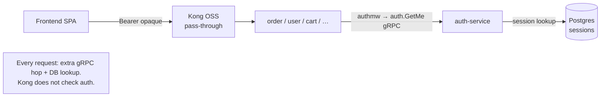
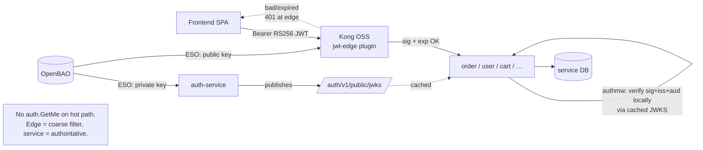
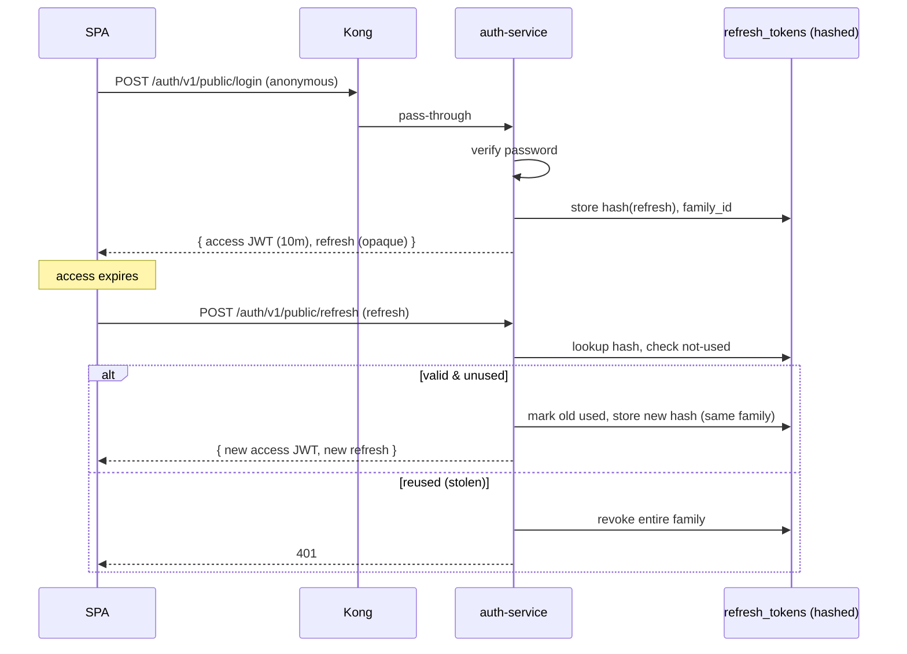
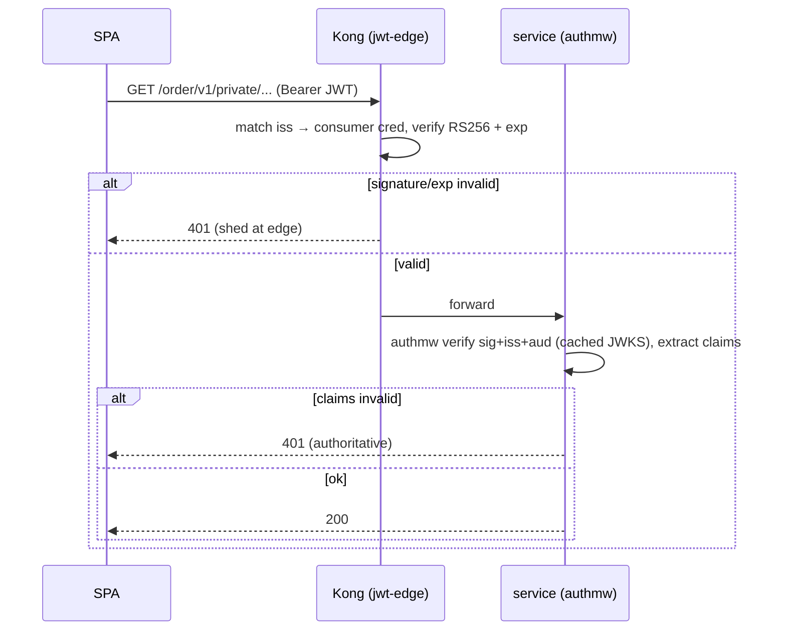
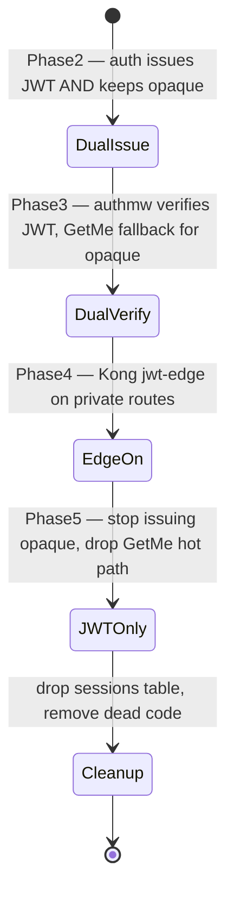

# RFC-0009 Production-grade API gateway: signed JWT + Kong edge auth

| Status | Scope | Created | Last updated |
|--------|-------|---------|--------------|
| partially implemented | platform-wide | 2026-06-30 | 2026-07-01 |

> **Don't forget: every decision is a tradeoff.** This RFC moves the platform from
> opaque DB-backed session tokens to stateless signed JWTs and adds a second
> verification point at the edge. The headline cost — **we trade instant,
> DB-backed revocation for stateless scale** — is made explicit throughout, and
> the mitigations (short access TTL + refresh rotation, optional denylist) are
> designed in, not bolted on.

## Summary

Refactor authentication and the API gateway to the shape a mid-size company runs
in production:

1. **`auth-service` mints signed RS256 JWTs** (short-lived access token) plus an
   **opaque, hashed, rotating refresh token**, and publishes its public key at a
   **JWKS endpoint**. The signing key lives in OpenBAO, delivered by ESO.
2. **`pkg/authmw` verifies the JWT locally** (signature + claims) against a cached
   JWKS — **no `auth.GetMe` round-trip on the hot path**.
3. **Kong does edge auth** with the OSS `jwt` plugin on `…/private/` routes —
   sheds bad/expired tokens before they reach pods. Services still verify
   (defense-in-depth); the edge is the coarse filter, the service is authoritative.
4. **Rate limiting moves to Valkey** (`policy: redis`) so the 2 Kong replicas share
   one counter; **local-stack switches its gateway counter to Valkey too** for
   parity.
5. A companion **OSS-vs-Enterprise** comparison documents what a paid tier would
   add (OIDC, introspection, advanced rate limiting, mTLS-auth, request validation,
   canary) — for the "if the company buys it" decision — while we ship entirely on
   **Kong OSS**.

This RFC is the **umbrella plan**. It supersedes [ADR-003](../../adr/ADR-003-jwt-validation-in-services-not-kong/)
(whose own revisit-trigger — "if auth-service moves to RS256/ES256… re-open this
ADR" — is now met) via [ADR-006](../../adr/ADR-006-rs256-jwt-kong-edge-auth/) (Accepted), and re-sequences
[RFC-0002](../RFC-0002/) (east-west mTLS) to land *after* this work.

## Motivation

The current design is fine for a demo but is **not** how production auth looks, and
the gaps are exactly the ones interviewers and senior reviewers probe:

- **Opaque tokens force a network hop per request.** Every authenticated call
  fans out `service → auth.GetMe (gRPC) → Postgres session lookup`. Auth-service
  and its DB are on the critical path of *every* request to *every* service — a
  latency tax and a single point of failure.
- **No cryptographic identity.** The token is 32 random bytes; nothing in it is
  verifiable offline. There are no standard claims (`iss`, `aud`, `exp`, `sub`),
  no signature, no key rotation story.
- **The edge is auth-blind.** Kong forwards unauthenticated junk straight to pods;
  the only thing stopping abuse is the service itself.
- **Rate limiting is approximate.** `policy: local` across 2 Kong replicas means
  the real ceiling is ~2× the configured number and resets per pod.

The end state is the textbook pattern: **stateless signed access tokens + rotating
refresh tokens + JWKS + edge pre-check + service-authoritative check + shared-state
rate limiting.**

### Goals

- Access tokens are **standard RS256 JWTs** with `iss`/`aud`/`exp`/`nbf`/`sub`/`jti`
  and identity claims; verifiable offline against a published JWKS.
- **Zero `auth.GetMe` calls on the request hot path** once cutover completes.
- Kong **rejects** signature-invalid / expired tokens on `…/private/` routes at the
  edge; `…/public/` routes stay anonymous (login must keep working).
- Rate-limit counters are **shared across Kong replicas** via Valkey; local-stack
  mirrors the production policy.
- A **documented, reversible, zero-downtime cutover** from opaque → JWT.
- The signing **private key never leaves auth-service / OpenBAO**; Kong and services
  hold only the **public** key (this is what neutralizes ADR-003's key-exposure
  objection).

### Non-Goals

- **Authorization (RBAC/ABAC).** There is no `roles` column today. JWTs will carry a
  `roles` claim as a **forward-compatible placeholder**, but real authz is a separate
  RFC (decision O1).
- **OTel/tracing of the auth path** — ~~deferred~~ **done**: edge tracing landed (roadmap #2), Kong emits the root span and injects the W3C `traceparent` so the auth (and every) path is traced end-to-end.
- **Admin-UI authentication** (Grafana/Kong-manager/etc.) — will be done, *after*
  the core auth refactor lands ("triển khai chuẩn trước, làm sau").
- **Kong Enterprise / Konnect** — documented for comparison only; not adopted.
- **Canary releases** — documented as a future pattern only.
- **East-west mTLS ([RFC-0002](../RFC-0002/))** — sequenced *after* this RFC; may be
  adjusted in light of it.
- **MFA / OIDC social login** — out of scope here.

## Proposal

### Token model: before → after

| Aspect | Before (today) | After (this RFC) |
|--------|----------------|------------------|
| Access token | 32-byte random, opaque | **RS256 JWT**, ~1 h TTL |
| Where validated | `auth.GetMe` → Postgres lookup, every request | **locally** (signature + claims) at edge *and* service |
| Refresh | none — single 24h opaque token | **opaque, hashed, rotating** refresh token (7–30 d) |
| Revocation | delete session row (instant) | short TTL + refresh rotation/reuse-detection; optional `jti` denylist |
| Key material | n/a (no signing) | RS256 keypair in **OpenBAO**, public via **JWKS** |
| Storage | `sessions` table (one row per login) | `refresh_tokens` table (hashed, family-tracked); access tokens stateless |

**Access token (RS256 JWT)** — claims: `iss` (auth-service issuer URL), `aud`
(platform audience), `sub` (user id), `exp` (1 h), `iat`, `nbf`, `jti` (uuid),
`username`, `email`, and `roles: []` (placeholder). Header carries `kid` for key
rotation. Returned in the existing `AuthResponse.token` field — the SPA needs no
shape change (just a longer string), it already sends `Authorization: Bearer`.

**Refresh token (opaque)** — a random secret returned alongside the access token,
stored **only as a SHA-256 hash** in a new `refresh_tokens` table, with a `family_id`
for rotation. On `POST /auth/v1/public/refresh`: validate → issue a new access JWT +
a new refresh token in the same family → mark the old one used. **Reuse detection:**
if an already-used refresh token is presented, the whole family is revoked (classic
stolen-refresh-token defense).

**JWKS** — public endpoint `GET /auth/v1/public/jwks` (a.k.a. `.well-known/jwks.json`)
serving the current (and during-rotation, previous) public keys keyed by `kid`.

### The revocation tradeoff (read this twice)

Opaque tokens give **instant revocation** — `Logout`/ban deletes the session row and
the very next request fails. Stateless JWTs **cannot** be un-issued; a leaked access
token is valid until `exp`. We accept this and bound the blast radius three ways:

1. **Short access TTL (1 h, chosen in review)** — the practical revocation window.
   A leaked *access* token is valid up to 1 h; we picked 1 h over the tighter 10 min
   for UX (fewer refresh round-trips). With O2 = no denylist, **1 h is the hard
   revocation floor** for a stolen access token — accept this explicitly.
2. **Refresh rotation + reuse detection** — a stolen refresh token is caught on its
   second use and kills the family.
3. **Optional `jti`/subject denylist in Valkey** (phase 2, behind a flag) — for the
   rare "kill this token *now*" case (account compromise). This re-introduces a
   per-request cache check, so it's opt-in, not default.

> If hard, instant, per-token revocation is a firm product requirement, the honest
> answer is **stay with opaque tokens** (or run a mandatory denylist). The whole
> value of JWT is *not* asking a central store on every call — a denylist on every
> request partially gives that back. This was the single biggest decision in the RFC
> — **resolved (O2): ship without the denylist.**

### Kong edge auth (OSS `jwt` plugin), defense-in-depth

The user's intent is explicit: **Kong does edge auth.** We implement it as the
*coarse, first-line* check, with the service remaining authoritative:

- **Edge (Kong `jwt`)**: verifies RS256 signature + `exp`/`nbf` against a registered
  Consumer credential. Cheap, kills obvious garbage before it reaches pods.
- **Service (`pkg/authmw`)**: verifies signature + `exp` + `iss` + `aud` + extracts
  claims; this is the source of identity and the fail-closed gate. Survives even if
  Kong is misconfigured or bypassed (in-cluster, internal routes).

**Hard OSS constraint:** the OSS `jwt` plugin does **not** fetch JWKS. It matches the
token's `iss` to a `KongConsumer`'s `jwt` credential and verifies with that
credential's **static `rsa_public_key`**. So at the edge:

- One `KongConsumer` (`auth-issuer`) + a `jwt` credential Secret whose `key` == the
  token `iss` and `rsa_public_key` == auth-service's **public** key (delivered by
  ESO from OpenBAO — never committed, never the private key).
- **Key rotation is manual choreography** at the edge: add the new public key as a
  second credential (distinct `kid`/`iss`) during the overlap window, then drop the
  old. Services, by contrast, rotate automatically via the cached JWKS. This
  asymmetry is the operational cost of OSS edge auth (Enterprise `openid-connect`
  would auto-discover JWKS — see comparison).

**Mixed public/private routes must be split.** Several Ingresses (`api-auth`,
`api-user`, `api-review`) carry both `…/public/` and `…/private/` paths on one object.
KIC attaches plugins per-Ingress, not per-path, so each mixed Ingress is **split into
two** (same host, same `strip-path:false`):

- `api-auth-public` → `/auth/v1/public/` — rate-limit + size-limit only (no jwt).
- `api-auth-private` → `/auth/v1/private/` — adds the `jwt-edge` plugin.

Private-only Ingresses (`api-cart`, `api-order`, `api-notification`) just add
`jwt-edge` to their plugin list. Pure-public ones (`api-product`, `api-shipping`)
are untouched. **`/auth/v1/public/login|register|refresh|jwks` must stay anonymous**
— authenticating them locks everyone out.

### Rate limiting → Valkey

Switch the `rate-limiting-api` plugin from `policy: local` to `policy: redis`
pointing at the existing Valkey (`valkey.cache-system.svc:6379`, `auth.enabled:false`
so no password). The 2 Kong replicas then share one counter — so the configured
numbers become *real* limits and we can drop the "halved to compensate for 2 pods"
fudge (or keep them; decide explicitly).

- **Egress NetworkPolicy** Kong → `cache-system:6379` is required (cluster runs
  default-deny).
- **Tradeoff:** Valkey is now on the request hot path. `fault_tolerant: true` means a
  Valkey outage **fails open** (requests allowed, limiting degrades to off) rather
  than 500-ing. Valkey here is single-node, ephemeral — a restart resets counters.
  Acceptable for abuse hygiene; documented, not silently assumed.
- **local-stack:** switch the gateway counter to `policy: redis` against a **Valkey**
  container (replace the current `redis:7-alpine` `cache` service image with
  `valkey/valkey` for true parity — wire-compatible, same config), and add
  `depends_on: cache` to the gateway.

### Alternatives

- **Keep opaque tokens, just move the lookup to the edge.** Kong OSS can't introspect
  an opaque token (no introspection endpoint in OSS), so the edge would still hit
  auth-service. Doesn't remove the hot-path hop. Rejected.
- **Symmetric HS256 JWT.** Simpler, but the shared secret must reach every verifier
  (services *and* Kong) — any of them could *mint* tokens. RS256 keeps minting power
  solely in auth-service. Rejected (this is precisely ADR-003's key-exposure point,
  resolved by going asymmetric).
- **Edge-only auth (no service check).** Faster, but a misconfigured route or any
  in-cluster path bypasses all auth, and the edge can't do per-service authz later.
  Rejected — defense-in-depth is the production norm.
- **Service-only auth (status quo, keep ADR-003).** Valid and simpler, but the user
  explicitly wants edge auth, and the edge pre-filter has real value (sheds garbage,
  centralizes the coarse check). We adopt edge **in addition to**, not instead of.
- **Kong Enterprise `openid-connect`.** Auto JWKS discovery, introspection, full OIDC.
  Not in OSS `bundled`; not adopted (documented for comparison).

## Architecture & Diagrams

### Current state (opaque token, hot-path GetMe)

### Target state (signed JWT, edge + service verify)

### Login + refresh rotation (issuance)

### Edge-auth request validation

## Design Details

> **Phasing re-sequenced (O7).** The rate-limit→Valkey change is **independent** of
> the JWT migration, so it leads as a low-risk quick win. The auth-service refactor
> (the bulk) is the **critical path** that gates everything after it. Order:
> **1** rate-limit→Valkey · **2** auth-service JWT+JWKS · **3** `pkg/authmw` ·
> **4** Kong edge `jwt` · **5** cutover cleanup · **6** resilience follow-up.

### Phase 1 — Rate limiting → Valkey *(independent, quick win)*

Repo: `homelab` + `local-stack`. **No dependency on the JWT work** — ship first.

- `rate-limiting-api`: `policy: redis`, `redis.host: valkey.cache-system.svc`,
  `port:6379`, `timeout:2000`; decide whether to un-halve the limits (cluster-wide
  counter no longer needs the 2× fudge). Update the comment block.
- New egress NetworkPolicy Kong → `cache-system:6379` (cluster is default-deny).
- **Shared-Valkey caveat (interacts with RFC-0004):** the product Cache-Aside uses the
  same single-node Valkey with `allkeys-lru` (64Mi). `maxmemory-policy` is **per-instance**,
  so a logical DB does **not** isolate eviction — under memory pressure LRU can evict
  rate-limit counters *and* cache entries alike. Two honest options: (a) **separate
  Valkey instance** for rate-limiting = clean isolation (preferred long-term); or
  (b) **stay single-instance and accept it** — an evicted counter just resets its
  window early (slightly over-permissive), which is consistent with the existing
  `fault_tolerant: true` fail-open. Use a distinct `database`/key-prefix at least to
  avoid keyspace collisions. Decide in the Phase 1 PR.
- local-stack: gateway `policy: redis` → **Valkey** container; swap `redis:7-alpine`
  → `valkey/valkey` (wire-compatible, true parity); add `depends_on: cache`.
- **Tradeoff:** Valkey now on the rate-limit hot path; `fault_tolerant: true` fails
  **open** on a Valkey outage. Single-node, ephemeral — restart resets counters.
- **Verify:** counters shared across the 2 Kong replicas (hit limit from alternating
  pods).

### Phase 2 — auth-service mints RS256 JWT + JWKS *(critical path — the bulk)*

Everything from Phase 3 on depends on this. Repo: `duynhlab/auth-service`. **O7
assessment:** keep this as a phase of this umbrella RFC (its job is exactly cross-repo
coordination) rather than spinning a separate service RFC — the section is
self-contained enough to lift out later if the auth-service work wants independent
tracking. It is the highest-effort, highest-risk phase; treat it as the gate.

- **Deps:** `github.com/golang-jwt/jwt/v5` (mint/verify), `github.com/google/uuid` (`jti`).
- **Keys:** RS256 keypair generated out-of-band, private key stored at OpenBAO
  `secret/data/<env>/apps/auth/jwt-signing`, mounted via ESO `ExternalSecret`. `kid`
  derived from the key (thumbprint).
- **Schema:** new `refresh_tokens` table (`id`, `user_id`, `token_hash`, `family_id`,
  `used_at`, `expires_at`, `created_at`); golang-migrate migration. The `sessions`
  table stays during cutover, removed at the end.
- **Issuance:** `Login`/`Register` mint access JWT (1 h) + refresh; add
  `POST /auth/v1/public/refresh` and `GET /auth/v1/public/jwks`. `Logout` revokes the
  refresh family. `GetUserByToken`/`GetMe` kept as an authoritative fallback (and for
  the dual-verify window), removed from the hot path.
- **Verify:** token decodes; JWKS reachable and returns the active `kid`; refresh
  rotation + reuse-detection unit-tested.

### Phase 3 — `pkg/authmw` local verification

Repo: `duynhlab/pkg`, then every consuming service.

- **Deps:** `golang-jwt/jwt/v5` + a JWKS cache (`github.com/MicahParks/keyfunc/v3` or
  `lestrrat-go/jwx/v2/jwk` `jwk.Cache`) with background refresh + `kid` matching.
- `Middleware` changes from `Middleware(client Validator)` (calls `GetMe`) to
  `Middleware(verifier *Verifier)` where `Verifier` holds the keyfunc + expected
  `iss`/`aud`. New config: `AUTH_JWKS_URL`, `JWT_ISSUER`, `JWT_AUDIENCE`. Fail-closed
  preserved: bad/missing/expired → 401; JWKS unreachable *and* no cached key → 503.
- Update `authmw_test.go` (today injects a fake `GetMe`).
- **Wiring** — each consuming service `cmd/main.go`: drop the serve-path
  `grpcx.Dial(cfg.AuthGRPCAddr)` + `authv1.NewAuthServiceClient`, construct the
  verifier instead. Confirmed consumers: **order, user, cart, review, notification**.
  **product-service does not use authmw** (all public routes + one unauthenticated
  internal route) — likely no change; confirm before touching.
- **Verify:** services 401 bad tokens with **no** `GetMe` call (defense-in-depth
  holds even before the edge plugin exists).

### Phase 4 — Kong edge `jwt` plugin

Repo: `homelab`. **`iss` is the current shared gateway domain** (O6 decision):
consumer credential `key` == `https://gateway.duynh.me`.

- New `jwt-edge` `KongClusterPlugin` (`plugin: jwt`, `global:false`) in
  `kubernetes/infra/configs/kong/plugins.yaml`.
- New `KongConsumer` `auth-issuer` + a `jwt` credential Secret (label
  `konghq.com/credential: jwt`) whose `rsa_public_key` is delivered by an
  `ExternalSecret` from OpenBAO (public key only).
- **Split** mixed Ingresses in `ingress-api.yaml` (`api-auth`, `api-user`,
  `api-review`) into `-public` / `-private`; add `jwt-edge` to private Ingresses and
  to the already-private `api-cart`/`api-order`/`api-notification`.
- Rewrite the `plugins.yaml` header note (currently "NO auth plugin here… do not add
  without superseding ADR-003") — this RFC + **ADR-006** is that supersession.
- **Verify:** public routes anonymous (login works); private routes 401 at the edge
  for bad tokens, 200 for good ones.

### Phase 5 — cutover cleanup

Repo: `auth-service` + consuming services. Once Phases 2–4 are stable:

- Stop issuing opaque tokens; remove the `GetUserByToken`/`GetMe` hot path and the
  dual-verify fallback in `authmw`.
- Drop the `sessions` table (migration) and any dead opaque-token code.
- **Verify:** no opaque tokens minted; `auth.GetMe` call rate ≈ 0; e2e green.

### Phase 6 — resilience pass *(follow-up PR, O5)* — ✅ done

Repo: `homelab`. Small, separate PR — not part of the auth cutover:

- Sane upstream **timeouts** (connect/read/write) + **passive health-checks**
  (`healthchecks.passive`) so Kong ejects a failing pod between probes. *State is
  per-replica in DB-less — document it.*
- **Verify:** a deliberately-failing pod is ejected; healthy traffic unaffected.

### Enabling / disabling / detection

- **Enabled by:** Phase 2 ships JWTs; the phases are independently togglable. The edge
  plugin can be removed (revert to pass-through) without breaking auth — services
  still verify. The Valkey policy can revert to `local` instantly.
- **Default behavior change:** yes — token format changes; the cutover (below) makes
  it zero-downtime via a dual-issue/dual-verify window.
- **Operator detection:** JWKS endpoint returns keys; Kong `jwt` plugin present on
  private routes; rate-limit headers reflect shared counts; `auth.GetMe` call rate
  drops to ~0 on the hot path.

### Drawbacks

- **Loss of instant revocation** (see the tradeoff section) — the defining cost.
- **More moving parts:** JWKS endpoint, key rotation, refresh table, edge consumer
  credential, two-place verification to keep consistent.
- **Edge key rotation is manual** under OSS (no JWKS at the edge).
- **Valkey on the rate-limit hot path** — a new (soft) dependency.
- **Multi-repo, ordered rollout** across auth-service, pkg, 5 services, homelab,
  local-stack — coordination cost.

## OSS vs Enterprise (for "if the company buys it")

We ship **100% on Kong OSS**. This is what a paid tier would add, so the decision is
informed:

| Capability | Kong OSS (this RFC) | Kong Enterprise / Konnect |
|------------|---------------------|---------------------------|
| JWT verify at edge | `jwt` plugin, **static** `rsa_public_key` per consumer | `openid-connect` / `jwt-signer` — **auto JWKS discovery**, no manual key choreography |
| Token introspection | none (would need a custom plugin) | `oauth2-introspection`, full OIDC |
| Rate limiting | `rate-limiting` (local/redis) | `rate-limiting-advanced` (sliding window, multi-limit, namespaces) |
| Request validation | none | `request-validator` (JSON-schema at edge) |
| mTLS client auth | none | `mtls-auth` |
| Policy / authz | in-service only | `opa` plugin (OPA at edge) |
| Canary / progressive | manual | `canary` plugin |
| Key rotation at edge | manual Secret choreography | automatic via JWKS discovery |

**Takeaway:** OSS covers the core production pattern (signed JWT, edge pre-check,
shared rate limiting). Enterprise mainly buys **operational ergonomics** (auto JWKS,
advanced limits, edge request validation, OPA) — worth it at scale/compliance, not
required for correctness here.

## Plugin → use-case decision map

A committed **decision** per Kong use-case — making explicit what this RFC does,
defers, or skips, so the gateway scope is unambiguous.

**Legend:** 🟢 in this RFC · 🟡 deferred but committed (later workstream) · 🔵 parked
in a future *gateway-improvements* RFC · ⚪ separate RFC / optional · ⛔ skip /
anti-pattern here.

| Use-case | Kong mechanism (OSS) | Decision |
|---|---|---|
| TLS termination | core + cert-manager | ✅ **Have it** |
| Routing / discovery | KIC Ingress→Service | ✅ **Have it** |
| CORS / security-headers / correlation-id | cors, response-transformer, correlation-id | ✅ **Have it** |
| Metrics | prometheus | ✅ **Have it** |
| Request-size cap | request-size-limiting | ✅ **Have it** |
| API versioning (`/v1/`) | path, service-owned | ✅ **Have it** |
| Structured access logs | stdout → Vector → VictoriaLogs | ✅ **Have it** |
| Rate limiting (cluster-wide) | rate-limiting `policy: redis` (Valkey) | 🟢 **This RFC — Phase 1** |
| Edge authentication | jwt | 🟢 **This RFC — Phase 4** (defense-in-depth) |
| Resilience: timeouts + passive health-check | core Upstream/Target (`KongUpstreamPolicy`) | 🟢 **Done — Phase 6** (per-service timeouts/retries + active/passive health-checks) |
| IP allowlist on admin UIs | ip-restriction | 🟢 **Done — internal-surface lockdown** (`ip-restriction-internal` + `rate-limiting-admin` on the 17 admin/obs/MCP ingresses). Real admin *auth* (OIDC/SSO) still deferred |
| Distributed tracing at edge | opentelemetry | 🟢 **Done** (`propagation.inject: [w3c]` forces the upstream `traceparent`; Kong bumped to 3.9 for the propagation block — 100% edge→service linkage) |
| Edge caching (public GET) | proxy-cache | 🔵 **Future gateway-improvements RFC** (per-pod footgun; service Cache-Aside already covers it) |
| Dedicated per-env issuer domain | `iss` convention | 🔵 **Future gateway-improvements RFC** (using shared `gateway.duynh.me` now — O6) |
| Maintenance / kill-switch | request-termination | ⚪ **Optional** easy win — not scheduled |
| Edge authorization (RBAC) | acl (OSS) / opa (Ent) | ⚪ **Separate RFC (O1)** — low priority; needs an authz model first |
| Header-based routing | core Route `headers` | ⚪ **Optional** — not needed today |
| Request schema validation | request-validator | ⛔ **Skip** — Enterprise-only; services own validation + the error envelope |
| mTLS to upstream | mtls-auth / mesh | ⛔ **Defer to [RFC-0002](../RFC-0002/)** (east-west mTLS), after this RFC |
| Weighted / per-request canary | upstream weights / Argo Rollouts | ⛔ **Docs-only** — prefer Argo Rollouts/Flagger, not Kong |
| Body / path rewrite | request/response-transformer | ⛔ **Anti-pattern here** — breaks Variant-A pass-through (`strip-path:false`) |
| WAF | none bundled | ⛔ **External** (CDN / Coraza sidecar) — out of scope |
| gRPC at edge (transcode) | grpc-web / grpc-gateway | ⛔ **N/A** — gRPC is east-west only |

> **Future "gateway-improvements" RFC (not yet written).** Bundles the two 🔵 items —
> edge `proxy-cache` for public GETs **and** a dedicated per-environment issuer domain
> (`auth.<env>.duynh.me`) — plus any later edge polish. Low priority; raised here so
> the decisions are recorded, not lost. Add as a backlog row in `rfc/README.md`.

## Re-evaluating `proxy-cache` for public GET (tradeoff)

Kong `proxy-cache` for public catalog GETs was considered. Re-evaluation:

- **In DB-less with 2 replicas**, `proxy-cache` (memory strategy) is **per-pod** —
  two independent caches, ~50% hit rate, double the memory, inconsistent TTLs. A
  Redis/Valkey cache strategy would share it but is **Enterprise-only**.
- We **already** have application-level Cache-Aside on Valkey inside the services
  (`docs/caching/`), which is shared, observable, and invalidatable.
- **Decision (review): do not add `proxy-cache` in this RFC.** The edge cache
  duplicates a layer we already do better at the service, and the per-pod split is a
  footgun in DB-less. It is **parked in a future "gateway improvements" RFC**
  (bundled with the dedicated per-env issuer domain from O6) — revisit only if a
  *specific* public endpoint shows edge-offload value and we accept per-pod semantics
  (or move to a shared-cache tier).

## Resilience — recommendation (you asked whether to bother)

Kong OSS gives you the cheap, high-value resilience knobs without Enterprise:

- **Adopt now (low cost, high value):**
  - `retries` on upstreams (Kong default 5) — keep; tune per route.
  - **Health checks / passive circuit breaking** (`healthchecks.passive`) so Kong
    ejects a failing pod between probes. *Caveat: state is per-replica in DB-less.*
  - Sane upstream **timeouts** (connect/read/write) so a slow pod doesn't pile up.
- **Defer (lower value here):** active health checks (k8s readiness already covers
  most of it), elaborate request-mirroring.
- **Decision (review):** do a **small, focused resilience pass** (timeouts + passive
  health checks) as **Phase 6**, a separate follow-up PR — not part of the auth
  cutover, but worth doing. It's a few lines of plugin/upstream config and matches
  what companies run.

## Security considerations

- **Private signing key never leaves auth-service/OpenBAO.** Kong and services hold
  only the **public** key — this is the core fix to ADR-003's key-exposure objection.
- **Public routes must stay anonymous** — a misattached `jwt-edge` on `…/public/`
  locks out login. Verified per-route in Phase 4.
- **`internal` routes** remain fenced by NetworkPolicy (no Ingress); the edge plugin
  is irrelevant to them, in-service authmw still applies where used.
- **Refresh tokens stored hashed** (SHA-256), never plaintext; rotation + reuse
  detection limits stolen-token lifetime.
- **Kyverno/PSS:** new manifests (KongConsumer, ExternalSecrets, NetworkPolicy) must
  pass admission — explicit namespace, no `default`, ESO-sourced secrets.

## Observability & SLO impact

- Edge/gateway tracing **shipped** (roadmap #2): the `opentelemetry` plugin injects
  the W3C `traceparent` (`propagation.inject: [w3c]`) so the auth path — like every
  path — is traced end-to-end; only per-span auth enrichment (custom claim/attribute
  spans) remains as optional debt. Minimum to watch during rollout:
  auth-service 401/refresh rates, JWKS fetch errors in services (a spike → services
  about to fail closed), Kong `jwt` plugin 401 rate, rate-limit 429 rate after the
  Valkey switch.
- **SLO risk during cutover:** a JWKS outage makes services fail closed (503) — the
  cached-key window and `fault_tolerant` rate-limit failopen bound the blast radius.

## Rollout & rollback

**Zero-downtime cutover (dual-issue / dual-verify):**

Phase 1 (rate-limit→Valkey) and Phase 6 (resilience) are independent bookends. The
auth cutover itself (Phases 2–5) is the zero-downtime dual-issue / dual-verify path:

- Each phase is independently revertible. Edge plugin removal → pass-through (services
  still verify). Valkey policy → `local`. The dual-verify window means old opaque
  tokens keep working until they expire, so no forced logout.
- **Blast radius** is gated by Flux `dependsOn` ordering and per-phase PRs.

## Testing / verification

- **auth-service:** unit tests for mint/verify, refresh rotation, reuse-detection
  family-revoke; JWKS endpoint returns active `kid`.
- **pkg/authmw:** table tests for valid/expired/bad-sig/wrong-iss/wrong-aud; JWKS
  cache refresh; fail-closed 401 vs 503.
- **local-stack e2e:** login → Bearer JWT → private route 200; bad token → 401 at
  edge; rate-limit 429 shared across… (single Kong locally, exact); refresh flow.
- **cluster:** `make validate`; public anonymous / private 401-at-edge; rate-limit
  shared across 2 replicas; `make flux-status` clean.

## Impact on existing RFCs / ADRs

The "điều chỉnh lớn" the plan promised — a **full sweep** of every proposal, not just
the obviously-related ones, so the set stays coherent.

### ADRs

Only one existing ADR changes; the rest are unrelated. ADRs are **append-only** — for
a supersession, flip the *Status* field only, never rewrite the body.

| ADR | Action | Why |
|-----|--------|-----|
| **ADR-003** (JWT validation in services, not Kong) | **Superseded by ADR-006** | Its own revisit-trigger ("if auth-service moves to RS256/ES256 *and* we need to shed bad tokens at the edge") is now met. Flip Status → `Superseded by ADR-006`. |
| **[ADR-006](../../adr/ADR-006-rs256-jwt-kong-edge-auth/)** | **Accepted** — "Adopt RS256 signed JWTs + Kong edge authentication" | Records the decision this RFC implements. |
| **ADR-001 / ADR-002** (Temporal) | **No change** | Orchestration; unrelated to auth/gateway. |
| **ADR-004** (OpenBAO audit logging) | **No change** (positive interaction) | The new JWT signing-key access is automatically covered by audit logging — a benefit, no edit. |
| **ADR-005** (OpenBAO HA raft) | **No change** | Storage backend; the signing key rides on it. |

### RFCs

| RFC | Affected? | Action |
|-----|-----------|--------|
| **RFC-0002** (east-west mTLS) | **Yes — directly** | RFC-0002 frames mTLS as the identity layer that *"NetworkPolicy and the forwarded JWT cannot provide."* This RFC changes that JWT (opaque→signed) and lets services verify it from gRPC metadata without `auth.GetMe`. **Sequence RFC-0002 after RFC-0009; fix its ADR-003 cross-ref → ADR-006.** |
| **RFC-0004** (cross-service caching) | **Yes — infra overlap** | This RFC puts rate-limit counters on the **same single-node Valkey** the product Cache-Aside uses (`allkeys-lru`, 64Mi) — instance-wide LRU can evict counters. Phase 1 weighs a **separate instance** vs **accepting eviction** (a reset window, consistent with fail-open). Also: RFC-0009's "skip proxy-cache, use service Cache-Aside" defers to RFC-0004's domain. |
| **RFC-0006** (service mesh) | **Transitively** | Superset sibling of RFC-0002; a mesh could supply mTLS *and* edge identity. Its **defer** recommendation is unchanged by this RFC — just note that mesh adoption would revisit both RFC-0002 and the in-cluster half of this RFC's defense-in-depth. |
| **RFC-0008** (secrets hardening) | **Yes — sibling dependency** | The JWT signing key is a new OpenBAO/ESO secret; it **inherits RFC-0008's hardening backlog** (auto-unseal, no committed creds, rotation). RFC-0008's OIDC target also aligns with the future edge-OIDC (Enterprise) path. No re-sequencing; proceeds in parallel. |
| **RFC-0001** (Temporal) | No | Implemented; orchestration only. |
| **RFC-0003** (inventory/stock) | No | Domain logic. |
| **RFC-0005** (shared-db HA/split) | No (minor) | New `refresh_tokens` table lives in auth-service's own DB, not the shared DB. |
| **RFC-0007** (DR drills) | No | Independent. |

### Recommended sequencing & priority

You asked for an explicit priority call across the backlog. Grouping by track:

**Security / trust-boundary track (ordered):**
1. **RFC-0009** (this) — **highest priority**, actively driven; the user-identity foundation.
2. **RFC-0002** (east-west mTLS) — *after* RFC-0009; adds service identity below the user layer.
3. **RFC-0008** (secrets hardening) — **parallel / ongoing**; gates production and the signing key rides on it.
4. **RFC-0006** (service mesh) — **defer** (own recommendation); may supersede RFC-0002 later.

**Independent track (priority on own merit, not blocked by RFC-0009):**
RFC-0004 (caching — medium, shares Valkey with this RFC), RFC-0003, RFC-0005, RFC-0007.

### Index / docs bookkeeping

| Artifact | Action |
|----------|--------|
| **rfc/README.md** index | Add an **RFC-0009** row. |
| **rfc/README.md** backlog "Kong-JWT reconsideration" | **Remove** — this RFC *is* it. |
| **rfc/README.md** backlog | **Add** "Authorization (RBAC/ABAC)" (O1) + "Gateway improvements" (proxy-cache + per-env issuer domain). |
| **docs/platform/kong-gateway.md** | **Update after implementation** — reflect edge auth + Valkey rate-limit (today documents pass-through/ADR-003). |

## Decisions (resolved in review)

The original open questions were resolved on 2026-06-30:

| # | Question | Decision |
|---|----------|----------|
| **O1** | Authorization (RBAC/ABAC) | **Separate RFC, low priority.** JWT carries a `roles: []` placeholder; real authz lands later, **services-side first**. *Assessment:* authz is the logical next step after authn (an authenticated-but-unrestricted user is the current state too, so deferring is not a regression) — recommended as the **immediate successor RFC** once JWT ships, but not blocking. |
| **O2** | Revocation posture | **Ship without the `jti` denylist** (per recommendation). Revocation = short access TTL + refresh rotation/reuse-detection. Add a Valkey denylist behind a flag only if a concrete instant-kill requirement appears. |
| **O3** | Access / refresh TTLs | **Access = 1 h** (chosen for UX over 10 min); refresh **7–30 d** as proposed. Note: with O2, 1 h is the hard floor for revoking a stolen *access* token. |
| **O4** | Edge `proxy-cache` | **Skip in this RFC**; parked in the future *gateway-improvements* RFC. Rely on service-side Cache-Aside. |
| **O5** | Resilience pass | **Yes — Phase 6**, a small separate follow-up PR (timeouts + passive health-checks). |
| **O6** | Issuer / audience | **Use the current shared gateway domain:** `iss = https://gateway.duynh.me`, `aud = duynhlab-platform`. Per-environment separation comes "for free" because each env already has a distinct gateway host. A **dedicated per-env issuer domain** (`auth.<env>.duynh.me`) is the cleaner pattern at company scale — parked in the future *gateway-improvements* RFC, not adopted now. |
| **O7** | Phase 0 ownership | **Keep the auth-service refactor inside this umbrella RFC** (now Phase 2) rather than a separate service RFC — avoids RFC sprawl and the umbrella exists precisely for cross-repo coordination. It is the critical-path, highest-effort phase; the section is self-contained enough to lift out later if independent tracking is wanted. Phases also **re-sequenced** so the independent rate-limit→Valkey change leads as a low-risk quick win. |

### Still genuinely open

- **Refresh TTL exact value** (7 vs 14 vs 30 d) — pin during Phase 2 against desired
  re-auth cadence.
- **Un-halving the rate-limit numbers** once the counter is cluster-wide (Phase 1) —
  keep the conservative values, or restore the "real" limits? Decide in the Phase 1 PR.

## Implementation History

- 2026-06-30 — RFC drafted (provisional).
- 2026-07-01 — **Partially implemented.** [ADR-006](../../adr/ADR-006-rs256-jwt-kong-edge-auth/)
  Accepted, and three roadmap items shipped on the gateway
  (`kubernetes/infra/configs/kong/plugins.yaml` + `kubernetes/apps/domains/*-rs.yaml`):
  - **Internal-surface lockdown** — `ip-restriction-internal` + `rate-limiting-admin`
    on the admin/obs/MCP ingresses (decision-map "IP allowlist on admin UIs").
  - **Edge distributed tracing** — `opentelemetry` plugin with
    `propagation.inject: [w3c]` (Kong bumped to 3.9) for 100% edge→service linkage.
  - **Phase 6 resilience** — `KongUpstreamPolicy` (per-service bounded
    timeouts/retries + active/passive health-checks).
  - Also shipped earlier: **Phase 1** (rate-limit → Valkey) and, in the auth track,
    **Phases 2–3** (auth-service RS256 JWT + JWKS, `pkg/authmw` local verification).
  - **Pending:** Phase 4 (Kong edge `jwt` plugin) and Phase 5 (opaque→JWT cutover cleanup).

## Related

- Supersedes: [ADR-003](../../adr/ADR-003-jwt-validation-in-services-not-kong/) (via [ADR-006](../../adr/ADR-006-rs256-jwt-kong-edge-auth/), Accepted).
- Re-sequences: [RFC-0002](../RFC-0002/) (east-west mTLS).
- Sibling: [RFC-0008](../RFC-0008/) (secrets hardening — shared OpenBAO/ESO pattern).
- Context: [`docs/platform/kong-gateway.md`](../../../platform/kong-gateway.md),
  [`docs/api/api-naming-convention.md`](../../../api/api-naming-convention.md).
</content>
</invoke>
