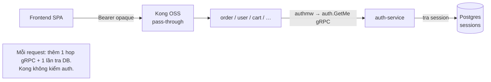
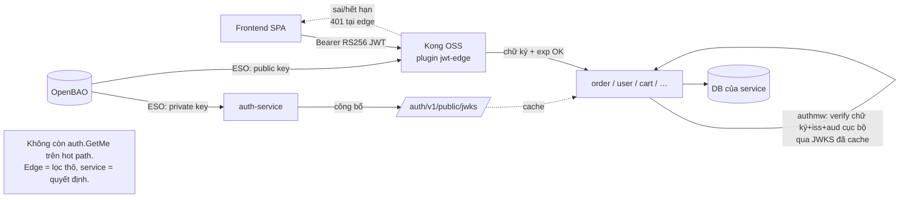
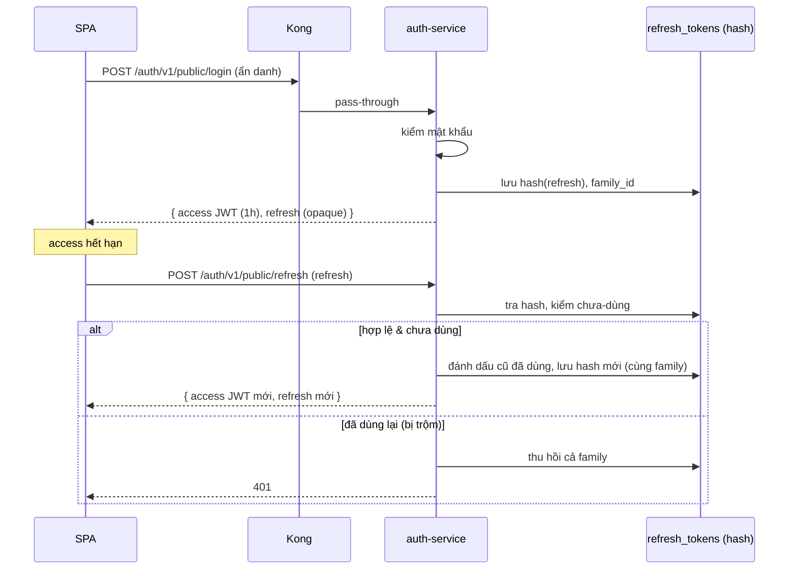
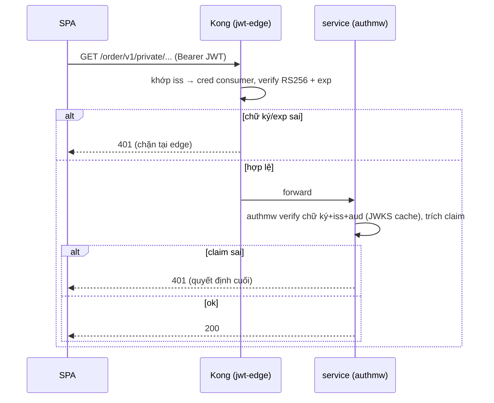
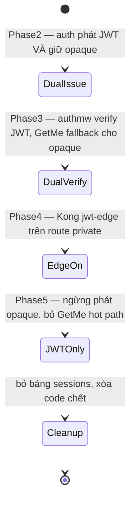

# RFC-0009 — Cổng API chuẩn production: JWT có chữ ký + Kong edge auth (bản tiếng Việt)

> ⚠️ **Bản đọc tạm (disposable).** Đây là bản đồng hành tiếng Việt để dễ đọc/ôn.
> Bản chính thức là [`README.md`](README.md) (tiếng Anh) — file này **không** được
> tài liệu nào trỏ tới và **có thể bị xóa bất cứ lúc nào** mà không gãy link.

| Status | Scope | Created | Last updated |
|--------|-------|---------|--------------|
| provisional | platform-wide | 2026-06-30 | 2026-06-30 |

> **Đừng quên: mọi quyết định đều có tradeoff.** RFC này chuyển nền tảng từ token
> phiên (opaque) lưu DB sang JWT stateless có chữ ký, và thêm một điểm verify thứ hai
> ở edge. Cái giá lớn nhất — **đánh đổi khả năng thu hồi tức thì (DB-backed) lấy
> tính stateless/scale** — được nói rõ xuyên suốt, kèm cách giảm thiểu (TTL ngắn +
> refresh rotation, denylist tùy chọn) thiết kế sẵn từ đầu, không chắp vá.

## Tóm tắt

Refactor xác thực + cổng API về đúng hình hài mà một công ty tầm trung chạy thật:

1. **`auth-service` phát JWT RS256 có chữ ký** (access token ngắn hạn) + **refresh
   token opaque, hash, xoay vòng**, và công bố public key tại **JWKS endpoint**. Khóa
   private nằm ở OpenBAO, giao qua ESO.
2. **`pkg/authmw` verify JWT cục bộ** (chữ ký + claims) dựa trên JWKS đã cache —
   **không còn gọi `auth.GetMe` trên hot path**.
3. **Kong làm edge auth** bằng plugin OSS `jwt` trên route `…/private/` — chặn token
   sai/hết hạn trước khi vào pod. Service **vẫn** verify (defense-in-depth); edge là
   bộ lọc thô, service là nguồn quyết định cuối cùng.
4. **Rate limit chuyển sang Valkey** (`policy: redis`) để 2 replica Kong dùng chung
   một counter; **local-stack cũng đổi gateway counter sang Valkey** cho đồng bộ.
5. Một bản **so sánh OSS vs Enterprise** ghi lại những gì bản trả phí sẽ thêm (OIDC,
   introspection, advanced rate limiting, mtls-auth, request validation, canary) —
   cho tình huống "nếu công ty mua" — trong khi ta ship **hoàn toàn trên Kong OSS**.

RFC này là **bản kế hoạch umbrella**. Nó supersede [ADR-003](../../adr/ADR-003-jwt-validation-in-services-not-kong/)
(điều kiện revisit của chính ADR-003 — "nếu auth-service chuyển sang RS256/ES256… mở
lại ADR" — nay đã thỏa) qua một **ADR-006** mới, và xếp lại
[RFC-0002](../RFC-0002/) (east-west mTLS) để làm *sau* việc này.

## Động lực (Motivation)

Thiết kế hiện tại ổn cho demo nhưng **không phải** hình hài auth production, và đúng
những lỗ hổng mà reviewer/phỏng vấn hay xoáy vào:

- **Token opaque ép một network hop mỗi request.** Mỗi call có xác thực đều fan-out
  `service → auth.GetMe (gRPC) → tra session Postgres`. Auth-service + DB của nó nằm
  trên đường đi tới hạn của *mọi* request tới *mọi* service — vừa tốn latency vừa là
  single point of failure.
- **Không có định danh mã hóa.** Token là 32 byte ngẫu nhiên; không gì verify offline
  được. Không có claim chuẩn (`iss`, `aud`, `exp`, `sub`), không chữ ký, không câu
  chuyện xoay khóa.
- **Edge mù về auth.** Kong forward thẳng rác chưa xác thực vào pod; thứ duy nhất chặn
  abuse là chính service.
- **Rate limit gần đúng.** `policy: local` trên 2 replica → trần thực ~2× số cấu hình
  và reset theo từng pod.

Đích đến là mẫu kinh điển: **access token JWT stateless có chữ ký + refresh token xoay
vòng + JWKS + tiền-kiểm ở edge + kiểm-quyết-định ở service + rate limit dùng chung
state.**

### Mục tiêu (Goals)

- Access token là **JWT RS256 chuẩn** với `iss`/`aud`/`exp`/`nbf`/`sub`/`jti` + claim
  định danh; verify offline được dựa trên JWKS công bố.
- **Không còn gọi `auth.GetMe` trên hot path** sau khi cutover xong.
- Kong **từ chối** token sai chữ ký / hết hạn trên route `…/private/` ngay tại edge;
  route `…/public/` vẫn ẩn danh (login phải còn chạy được).
- Counter rate-limit **dùng chung giữa các replica Kong** qua Valkey; local-stack copy
  đúng policy production.
- **Cutover có tài liệu, đảo ngược được, zero-downtime** từ opaque → JWT.
- **Khóa private ký không bao giờ rời auth-service / OpenBAO**; Kong và service chỉ giữ
  **public key** (đây chính là điểm hóa giải phản biện "lộ khóa" của ADR-003).

### Ngoài phạm vi (Non-Goals)

- **Phân quyền (RBAC/ABAC).** Hiện chưa có cột `roles`. JWT sẽ mang claim `roles` như
  **chỗ dành sẵn (placeholder)**, nhưng authz thật là RFC riêng (quyết định O1).
- **OTel/tracing đường auth** — nợ (sẽ làm sau).
- **Auth cho admin-UI** (Grafana/Kong-manager/…) — sẽ làm, *sau* khi refactor auth lõi
  ("triển khai chuẩn trước, làm sau").
- **Kong Enterprise / Konnect** — chỉ để so sánh; không áp dụng.
- **Canary release** — chỉ ghi tài liệu, chưa làm.
- **East-west mTLS ([RFC-0002](../RFC-0002/))** — xếp *sau* RFC này; có thể điều chỉnh.
- **MFA / OIDC social login** — ngoài phạm vi.

## Đề xuất (Proposal)

### Mô hình token: trước → sau

| Khía cạnh | Trước (hiện tại) | Sau (RFC này) |
|-----------|------------------|----------------|
| Access token | 32 byte ngẫu nhiên, opaque | **JWT RS256**, TTL ~1 giờ |
| Verify ở đâu | `auth.GetMe` → tra Postgres, mỗi request | **cục bộ** (chữ ký + claims) tại edge *và* service |
| Refresh | không có — một token opaque 24h | **opaque, hash, xoay vòng** (7–30 ngày) |
| Thu hồi | xóa row session (tức thì) | TTL ngắn + rotation/reuse-detection; denylist `jti` tùy chọn |
| Khóa | n/a (không ký) | cặp RS256 ở **OpenBAO**, public qua **JWKS** |
| Lưu trữ | bảng `sessions` (1 row/login) | bảng `refresh_tokens` (hash, theo family); access token stateless |

**Access token (JWT RS256)** — claim: `iss` (URL issuer của auth-service), `aud`
(audience nền tảng), `sub` (user id), `exp` (1 giờ), `iat`, `nbf`, `jti` (uuid),
`username`, `email`, và `roles: []` (placeholder). Header mang `kid` để xoay khóa.
Trả về trong trường `AuthResponse.token` cũ — SPA không cần đổi shape (chỉ là chuỗi
dài hơn), nó đã gửi `Authorization: Bearer`.

**Refresh token (opaque)** — một secret ngẫu nhiên trả kèm access token, lưu **chỉ
dạng hash SHA-256** trong bảng `refresh_tokens` mới, có `family_id` để xoay vòng. Khi
gọi `POST /auth/v1/public/refresh`: kiểm tra → phát access JWT mới + refresh token mới
cùng family → đánh dấu cái cũ đã dùng. **Phát hiện tái sử dụng:** nếu một refresh token
đã dùng được trình lại, **thu hồi cả family** (chống đánh cắp refresh token kinh điển).

**JWKS** — endpoint công khai `GET /auth/v1/public/jwks` (tức `.well-known/jwks.json`)
phục vụ public key hiện tại (và trong lúc xoay, cả key trước) theo `kid`.

### Tradeoff thu hồi (đọc kỹ 2 lần)

Token opaque cho **thu hồi tức thì** — `Logout`/ban xóa row session, request kế tiếp
fail ngay. JWT stateless **không thể** "gỡ phát hành"; access token bị lộ vẫn hợp lệ
tới `exp`. Ta chấp nhận và bó hẹp blast-radius bằng 3 cách:

1. **Access TTL ngắn (1 giờ, chốt khi review)** — cửa sổ thu hồi thực tế. Token bị lộ
   hợp lệ tối đa 1 giờ; ta chọn 1 giờ thay vì 10 phút để ưu tiên UX (ít refresh hơn).
   Với O2 = không denylist, **1 giờ là sàn cứng** để thu hồi access token bị đánh cắp.
2. **Refresh rotation + reuse-detection** — refresh bị trộm sẽ bị bắt ở lần dùng thứ
   hai và giết cả family.
3. **Denylist `jti`/subject trên Valkey (tùy chọn, phase 2, sau flag)** — cho trường
   hợp hiếm "giết token này *ngay*" (account bị compromise). Cái này thêm lại một lần
   check cache mỗi request, nên là opt-in, không mặc định.

> Nếu thu hồi tức thì theo từng token là yêu cầu sản phẩm cứng, câu trả lời thành thật
> là **ở lại với token opaque** (hoặc bật denylist bắt buộc). Cả giá trị của JWT là
> *không* phải hỏi store trung tâm mỗi call — denylist mỗi request lấy lại phần đó.
> Đây từng là quyết định lớn nhất của RFC — **đã chốt (O2): ship không denylist.**

### Kong edge auth (plugin OSS `jwt`), defense-in-depth

Ý muốn rõ ràng: **Kong làm edge auth.** Ta hiện thực nó như tầng *thô, tuyến đầu*,
service vẫn là nơi quyết định:

- **Edge (Kong `jwt`)**: verify chữ ký RS256 + `exp`/`nbf` dựa trên credential của một
  Consumer đã đăng ký. Rẻ, giết rác hiển nhiên trước khi vào pod.
- **Service (`pkg/authmw`)**: verify chữ ký + `exp` + `iss` + `aud` + trích claim; đây
  là nguồn định danh và là cổng fail-closed. Vẫn đứng vững kể cả khi Kong cấu hình sai
  hoặc bị bypass (route nội bộ trong cluster).

**Ràng buộc cứng của OSS:** plugin `jwt` OSS **không** fetch JWKS. Nó khớp `iss` của
token với credential `jwt` của một `KongConsumer` rồi verify bằng `rsa_public_key`
**tĩnh** của credential đó. Nên ở edge:

- Một `KongConsumer` (`auth-issuer`) + một Secret credential `jwt` có `key` == `iss` của
  token, `rsa_public_key` == public key của auth-service (giao qua ESO từ OpenBAO — không
  commit, không bao giờ là private key).
- **Xoay khóa ở edge là thao tác thủ công**: thêm public key mới làm credential thứ hai
  (`kid`/`iss` khác) trong cửa sổ overlap, rồi bỏ cái cũ. Trong khi đó service xoay tự
  động qua JWKS đã cache. Sự bất đối xứng này là cái giá vận hành của edge auth trên OSS
  (Enterprise `openid-connect` sẽ auto-discover JWKS — xem bảng so sánh).

**Route public/private gộp chung phải tách.** Vài Ingress (`api-auth`, `api-user`,
`api-review`) đang mang cả `…/public/` lẫn `…/private/` trên một object. KIC gắn plugin
theo từng Ingress, không theo path, nên mỗi Ingress gộp bị **tách làm hai** (cùng host,
cùng `strip-path:false`):

- `api-auth-public` → `/auth/v1/public/` — chỉ rate-limit + size-limit (không jwt).
- `api-auth-private` → `/auth/v1/private/` — thêm plugin `jwt-edge`.

Ingress chỉ-private (`api-cart`, `api-order`, `api-notification`) chỉ cần thêm
`jwt-edge`. Loại thuần-public (`api-product`, `api-shipping`) giữ nguyên.
**`/auth/v1/public/login|register|refresh|jwks` phải ở ẩn danh** — gắn auth vào đó là
khóa luôn mọi người.

### Rate limit → Valkey

Đổi plugin `rate-limiting-api` từ `policy: local` sang `policy: redis` trỏ tới Valkey
sẵn có (`valkey.cache-system.svc:6379`, `auth.enabled:false` nên không cần password).
2 replica Kong khi đó dùng chung một counter — nên số cấu hình thành giới hạn *thật* và
có thể bỏ phần "chia đôi để bù 2 pod" (hoặc giữ; quyết định rõ ràng).

- **NetworkPolicy egress** Kong → `cache-system:6379` là bắt buộc (cluster default-deny).
- **Tradeoff:** Valkey nay nằm trên hot path request. `fault_tolerant: true` nghĩa là
  Valkey chết thì **fail-open** (cho qua, rate-limit tắt) thay vì 500. Valkey ở đây
  đơn-node, ephemeral — restart là reset counter. Chấp nhận được cho mục đích vệ sinh
  abuse; ghi rõ, không ngầm định.
- **local-stack:** đổi gateway counter sang `policy: redis` trỏ container **Valkey**
  (thay image `redis:7-alpine` của service `cache` bằng `valkey/valkey` cho đồng bộ —
  wire-compatible, cùng config), thêm `depends_on: cache` vào gateway.

### Các phương án thay thế (Alternatives)

- **Giữ token opaque, chỉ đẩy lookup ra edge.** Kong OSS không introspect token opaque
  được (OSS không có endpoint introspection), nên edge vẫn phải hỏi auth-service. Không
  bỏ được hop hot-path. Loại.
- **JWT đối xứng HS256.** Đơn giản hơn, nhưng secret chung phải tới mọi verifier (service
  *và* Kong) — bất kỳ cái nào cũng có thể *phát* token. RS256 giữ quyền phát chỉ ở
  auth-service. Loại (đúng điểm "lộ khóa" của ADR-003, được giải bằng dùng bất đối xứng).
- **Chỉ auth ở edge (không kiểm ở service).** Nhanh hơn, nhưng một route sai cấu hình
  hoặc bất kỳ đường trong cluster nào cũng bypass toàn bộ auth, và edge không làm được
  authz theo từng service về sau. Loại — defense-in-depth là chuẩn production.
- **Chỉ auth ở service (giữ nguyên ADR-003).** Hợp lệ và đơn giản hơn, nhưng người dùng
  muốn edge auth, và tiền-lọc ở edge có giá trị thật (chặn rác, tập trung kiểm thô). Ta
  thêm edge **bổ sung cho**, không thay thế.
- **Kong Enterprise `openid-connect`.** Auto JWKS discovery, introspection, OIDC đầy đủ.
  Không có trong OSS `bundled`; không áp dụng (chỉ so sánh).

## Kiến trúc & Sơ đồ

### Hiện tại (token opaque, GetMe trên hot path)

### Đích đến (JWT có chữ ký, verify ở edge + service)

### Login + xoay refresh (phát token)

### Verify request ở edge

## Chi tiết thiết kế (Design Details)

> **Đã xếp lại phase (O7).** Việc rate-limit→Valkey **độc lập** với migration JWT nên
> đi trước như một quick-win rủi ro thấp. Refactor auth-service (phần nặng nhất) là
> **đường tới hạn** chặn mọi thứ sau nó. Thứ tự: **1** rate-limit→Valkey · **2**
> auth-service JWT+JWKS · **3** `pkg/authmw` · **4** Kong edge `jwt` · **5** cutover
> cleanup · **6** resilience follow-up.

### Phase 1 — Rate limit → Valkey *(độc lập, quick win)*

Repo: `homelab` + `local-stack`. **Không phụ thuộc việc JWT** — ship trước.

- `rate-limiting-api`: `policy: redis`, `redis.host: valkey.cache-system.svc`,
  `port:6379`, `timeout:2000`; quyết định có bỏ "chia đôi" không (counter cluster-wide
  không cần bù 2× nữa). Cập nhật khối comment.
- NetworkPolicy egress mới Kong → `cache-system:6379` (cluster default-deny).
- **Lưu ý dùng chung Valkey (đụng RFC-0004):** product Cache-Aside dùng cùng Valkey
  đơn-node với `allkeys-lru` (64Mi). `maxmemory-policy` là **per-instance**, nên logical
  DB **không** cô lập eviction — khi thiếu bộ nhớ, LRU có thể evict counter rate-limit
  *lẫn* entry cache. Hai lựa chọn thành thật: (a) **instance Valkey riêng** cho
  rate-limit = cô lập sạch (ưu tiên dài hạn); hoặc (b) **giữ một instance và chấp nhận**
  — counter bị evict chỉ reset window sớm (hơi rộng tay), nhất quán với `fault_tolerant:
  true` fail-open hiện có. Tối thiểu dùng `database`/key-prefix khác để tránh đụng
  keyspace. Quyết định trong PR Phase 1.
- local-stack: gateway `policy: redis` → container **Valkey**; đổi `redis:7-alpine` →
  `valkey/valkey` (wire-compatible, đồng bộ thật); thêm `depends_on: cache`.
- **Tradeoff:** Valkey nay trên hot path rate-limit; `fault_tolerant: true` fail-**open**
  khi Valkey chết. Đơn-node, ephemeral — restart reset counter.
- **Verify:** counter dùng chung giữa 2 replica (đánh chạm trần từ pod luân phiên).

### Phase 2 — auth-service phát JWT RS256 + JWKS *(đường tới hạn — phần nặng)*

Mọi thứ từ Phase 3 trở đi phụ thuộc cái này. Repo: `duynhlab/auth-service`. **Đánh giá
O7:** giữ nó là một phase của RFC umbrella này (vai trò của umbrella đúng là điều phối
liên-repo) thay vì tách RFC service riêng — section đủ độc lập để tách ra sau nếu muốn
theo dõi riêng. Đây là phase tốn công & rủi ro nhất; coi như cổng chặn.

- **Deps:** `github.com/golang-jwt/jwt/v5` (phát/verify), `github.com/google/uuid` (`jti`).
- **Khóa:** cặp RS256 sinh ngoài luồng, private key lưu OpenBAO
  `secret/data/<env>/apps/auth/jwt-signing`, mount qua ESO `ExternalSecret`. `kid` suy
  từ khóa (thumbprint).
- **Schema:** bảng `refresh_tokens` mới (`id`, `user_id`, `token_hash`, `family_id`,
  `used_at`, `expires_at`, `created_at`); migration golang-migrate. Bảng `sessions` giữ
  trong lúc cutover, bỏ ở cuối.
- **Phát token:** `Login`/`Register` phát access JWT (1h) + refresh; thêm
  `POST /auth/v1/public/refresh` và `GET /auth/v1/public/jwks`. `Logout` thu hồi family.
  `GetUserByToken`/`GetMe` giữ làm fallback quyết định (và cho cửa sổ dual-verify), bỏ
  khỏi hot path.
- **Verify:** token decode được; JWKS truy cập được + trả đúng `kid` active; rotation +
  reuse-detection có unit test.

### Phase 3 — `pkg/authmw` verify cục bộ

Repo: `duynhlab/pkg`, rồi từng service tiêu thụ.

- **Deps:** `golang-jwt/jwt/v5` + một JWKS cache (`github.com/MicahParks/keyfunc/v3`
  hoặc `lestrrat-go/jwx/v2/jwk` `jwk.Cache`) có refresh nền + khớp `kid`.
- `Middleware` đổi từ `Middleware(client Validator)` (gọi `GetMe`) sang
  `Middleware(verifier *Verifier)` trong đó `Verifier` giữ keyfunc + `iss`/`aud` kỳ vọng.
  Config mới: `AUTH_JWKS_URL`, `JWT_ISSUER`, `JWT_AUDIENCE`. Giữ fail-closed: sai/thiếu/
  hết hạn → 401; JWKS không tới được *và* không có key cache → 503.
- Cập nhật `authmw_test.go` (đang inject `GetMe` giả).
- **Wiring** — mỗi service `cmd/main.go`: bỏ `grpcx.Dial(cfg.AuthGRPCAddr)` +
  `authv1.NewAuthServiceClient` ở serve-path, dựng verifier thay vào. Consumer xác nhận:
  **order, user, cart, review, notification**. **product-service không dùng authmw**
  (toàn route public + một route internal không xác thực) — có thể không đổi; xác nhận
  trước khi đụng.
- **Verify:** service trả 401 token sai **mà không** gọi `GetMe` (defense-in-depth đứng
  vững ngay cả trước khi có plugin edge).

### Phase 4 — Plugin edge `jwt` của Kong

Repo: `homelab`. **`iss` là domain gateway chung hiện tại** (quyết định O6): credential
consumer có `key` == `https://gateway.duynh.me`.

- `KongClusterPlugin` `jwt-edge` mới (`plugin: jwt`, `global:false`) trong
  `kubernetes/infra/configs/kong/plugins.yaml`.
- `KongConsumer` `auth-issuer` mới + Secret credential `jwt` (label
  `konghq.com/credential: jwt`) có `rsa_public_key` giao qua `ExternalSecret` từ OpenBAO
  (chỉ public key).
- **Tách** Ingress gộp trong `ingress-api.yaml` (`api-auth`, `api-user`, `api-review`)
  thành `-public` / `-private`; thêm `jwt-edge` vào Ingress private + các
  `api-cart`/`api-order`/`api-notification` vốn đã private.
- Viết lại note đầu `plugins.yaml` (hiện ghi "KHÔNG plugin auth ở đây… đừng thêm nếu chưa
  supersede ADR-003") — RFC này + **ADR-006** chính là sự supersession đó.
- **Verify:** route public ẩn danh (login chạy); route private 401 tại edge với token
  sai, 200 với token đúng.

### Phase 5 — dọn dẹp cutover

Repo: `auth-service` + các service. Khi Phase 2–4 ổn định:

- Ngừng phát token opaque; bỏ hot-path `GetUserByToken`/`GetMe` và fallback dual-verify
  trong `authmw`.
- Bỏ bảng `sessions` (migration) và code opaque chết.
- **Verify:** không còn phát opaque; tần suất gọi `auth.GetMe` ≈ 0; e2e xanh.

### Phase 6 — resilience pass *(PR follow-up, O5)*

Repo: `homelab`. PR nhỏ, riêng — không thuộc cutover auth:

- **Timeout** upstream hợp lý (connect/read/write) + **passive health-check**
  (`healthchecks.passive`) để Kong loại pod hỏng giữa các probe. *State per-replica trong
  DB-less — ghi rõ.*
- **Verify:** một pod cố tình hỏng bị loại; traffic lành mạnh không ảnh hưởng.

### Bật / tắt / phát hiện

- **Bật bởi:** Phase 2 ship JWT; các phase bật/tắt độc lập. Plugin edge gỡ được (về
  pass-through) mà không vỡ auth — service vẫn verify. Policy Valkey về `local` tức thì.
- **Đổi hành vi mặc định:** có — format token đổi; cutover (dưới) làm zero-downtime qua
  cửa sổ dual-issue/dual-verify.
- **Operator phát hiện:** endpoint JWKS trả key; plugin `jwt` có mặt trên route private;
  header rate-limit phản ánh đếm dùng chung; tần suất gọi `auth.GetMe` rơi về ~0 trên
  hot path.

### Nhược điểm (Drawbacks)

- **Mất thu hồi tức thì** (xem mục tradeoff) — cái giá đặc trưng.
- **Nhiều bộ phận hơn:** endpoint JWKS, xoay khóa, bảng refresh, credential consumer ở
  edge, hai nơi verify phải giữ nhất quán.
- **Xoay khóa ở edge thủ công** dưới OSS (không JWKS ở edge).
- **Valkey trên hot path rate-limit** — một phụ thuộc (mềm) mới.
- **Rollout liên-repo, có thứ tự** qua auth-service, pkg, 5 service, homelab, local-stack
  — chi phí điều phối.

## OSS vs Enterprise (cho tình huống "nếu công ty mua")

Ta ship **100% trên Kong OSS**. Đây là những gì bản trả phí sẽ thêm, để quyết định có
cơ sở:

| Năng lực | Kong OSS (RFC này) | Kong Enterprise / Konnect |
|----------|--------------------|---------------------------|
| Verify JWT ở edge | plugin `jwt`, `rsa_public_key` **tĩnh** per consumer | `openid-connect` / `jwt-signer` — **auto JWKS discovery**, không xoay khóa thủ công |
| Introspection token | không (cần plugin custom) | `oauth2-introspection`, OIDC đầy đủ |
| Rate limiting | `rate-limiting` (local/redis) | `rate-limiting-advanced` (sliding window, multi-limit, namespace) |
| Request validation | không | `request-validator` (JSON-schema tại edge) |
| mTLS client auth | không | `mtls-auth` |
| Policy / authz | chỉ in-service | plugin `opa` (OPA tại edge) |
| Canary / progressive | thủ công | plugin `canary` |
| Xoay khóa ở edge | thao tác Secret thủ công | tự động qua JWKS discovery |

**Tóm lại:** OSS phủ mẫu production lõi (JWT có chữ ký, tiền-kiểm ở edge, rate-limit dùng
chung). Enterprise chủ yếu mua **tiện vận hành** (auto JWKS, advanced limit, edge request
validation, OPA) — đáng ở quy mô/compliance, không bắt buộc cho tính đúng ở đây.

## Bản đồ plugin → use-case (kèm quyết định)

Một **quyết định** cho từng use-case của Kong — làm rõ RFC này làm gì, nợ gì, bỏ gì.

**Chú thích:** 🟢 trong RFC này · 🟡 nợ nhưng cam kết (workstream sau) · 🔵 park vào RFC
*gateway-improvements* tương lai · ⚪ RFC riêng / tùy chọn · ⛔ bỏ / anti-pattern ở đây.

| Use-case | Cơ chế Kong (OSS) | Quyết định |
|---|---|---|
| TLS termination | core + cert-manager | ✅ **Đã có** |
| Routing / discovery | KIC Ingress→Service | ✅ **Đã có** |
| CORS / security-headers / correlation-id | cors, response-transformer, correlation-id | ✅ **Đã có** |
| Metrics | prometheus | ✅ **Đã có** |
| Giới hạn kích thước request | request-size-limiting | ✅ **Đã có** |
| API versioning (`/v1/`) | path, service-owned | ✅ **Đã có** |
| Access log có cấu trúc | stdout → Vector → VictoriaLogs | ✅ **Đã có** |
| Rate limit (cluster-wide) | rate-limiting `policy: redis` (Valkey) | 🟢 **RFC này — Phase 1** |
| Edge authentication | jwt | 🟢 **RFC này — Phase 4** (defense-in-depth) |
| Resilience: timeout + passive health-check | core Upstream/Target | 🟡 **RFC này — Phase 6** (PR follow-up) |
| IP allowlist trên admin UI | ip-restriction | 🟡 **Nợ — workstream admin-security** ("chuẩn trước, làm sau") |
| Distributed tracing ở edge | opentelemetry | 🟡 **Nợ — OTel debt** (cam kết sau) |
| Edge caching (public GET) | proxy-cache | 🔵 **RFC gateway-improvements tương lai** (per-pod footgun; Cache-Aside ở service đã phủ) |
| Domain issuer riêng theo môi trường | quy ước `iss` | 🔵 **RFC gateway-improvements tương lai** (đang dùng `gateway.duynh.me` chung — O6) |
| Maintenance / kill-switch | request-termination | ⚪ **Tùy chọn** easy win — chưa lên lịch |
| Edge authorization (RBAC) | acl (OSS) / opa (Ent) | ⚪ **RFC riêng (O1)** — ưu tiên thấp; cần mô hình authz trước |
| Routing theo header | core Route `headers` | ⚪ **Tùy chọn** — chưa cần |
| Validate schema request | request-validator | ⛔ **Bỏ** — Enterprise-only; service đã validate + sở hữu error envelope |
| mTLS tới upstream | mtls-auth / mesh | ⛔ **Đẩy [RFC-0002](../RFC-0002/)** (east-west mTLS), sau RFC này |
| Canary có trọng số / per-request | upstream weights / Argo Rollouts | ⛔ **Chỉ docs** — ưu tiên Argo Rollouts/Flagger, không phải Kong |
| Rewrite body / path | request/response-transformer | ⛔ **Anti-pattern ở đây** — vỡ Variant-A pass-through (`strip-path:false`) |
| WAF | none bundled | ⛔ **Bên ngoài** (CDN / Coraza sidecar) — ngoài phạm vi |
| gRPC ở edge (transcode) | grpc-web / grpc-gateway | ⛔ **N/A** — gRPC chỉ east-west |

> **RFC "gateway-improvements" tương lai (chưa viết).** Gom 2 mục 🔵 — edge `proxy-cache`
> cho public GET **và** domain issuer riêng theo môi trường (`auth.<env>.duynh.me`) —
> cùng các polish edge sau này. Ưu tiên thấp; nêu ở đây để ghi nhận quyết định, không
> để mất. Thêm thành một dòng backlog trong `rfc/README.md`.

## Đánh giá lại `proxy-cache` cho public GET (tradeoff)

Đã cân nhắc Kong `proxy-cache` cho public catalog GET. Đánh giá lại:

- **Trong DB-less với 2 replica**, `proxy-cache` (chiến lược memory) là **per-pod** — hai
  cache độc lập, hit-rate ~50%, gấp đôi bộ nhớ, TTL không nhất quán. Chiến lược cache
  Redis/Valkey dùng chung được nhưng là **Enterprise-only**.
- Ta **đã** có Cache-Aside ở tầng ứng dụng trên Valkey trong service (`docs/caching/`),
  vốn dùng chung, quan sát được, invalidate được.
- **Quyết định (review): không thêm `proxy-cache` trong RFC này.** Cache ở edge nhân đôi
  một tầng ta đã làm tốt hơn ở service, và phân chia per-pod là footgun trong DB-less. Nó
  được **park vào RFC "gateway-improvements" tương lai** (gom với domain issuer riêng theo
  môi trường ở O6) — chỉ xem lại nếu một endpoint public cụ thể cho thấy giá trị offload ở
  edge và ta chấp nhận ngữ nghĩa per-pod (hoặc chuyển sang tầng cache dùng chung).

## Resilience — khuyến nghị (bạn hỏi có nên không)

Kong OSS cho các nút resilience rẻ, giá trị cao mà không cần Enterprise:

- **Áp dụng (chi phí thấp, giá trị cao):** timeout upstream hợp lý + passive health-check
  để Kong loại pod hỏng giữa các probe. *State per-replica trong DB-less.*
- **Hoãn (giá trị thấp ở đây):** active health-check (readiness của k8s đã phủ phần lớn),
  request-mirroring phức tạp.
- **Quyết định (review):** làm **một pass resilience nhỏ, tập trung** (timeout + passive
  health-check) thành **Phase 6**, một PR follow-up riêng — không thuộc cutover auth nhưng
  đáng làm. Chỉ vài dòng config, đúng cái các công ty chạy.

## Cân nhắc bảo mật (Security)

- **Khóa private ký không bao giờ rời auth-service/OpenBAO.** Kong và service chỉ giữ
  **public key** — đây là điểm cốt lõi sửa phản biện "lộ khóa" của ADR-003.
- **Route public phải ở ẩn danh** — gắn nhầm `jwt-edge` lên `…/public/` là khóa login.
  Verify theo từng route ở Phase 4.
- **Route `internal`** vẫn được NetworkPolicy rào (không Ingress); plugin edge không liên
  quan tới chúng, authmw trong service vẫn áp dụng nơi có dùng.
- **Refresh token lưu hash** (SHA-256), không bao giờ plaintext; rotation + reuse-detection
  bó hẹp tuổi thọ token bị trộm.
- **Kyverno/PSS:** manifest mới (KongConsumer, ExternalSecrets, NetworkPolicy) phải qua
  admission — namespace tường minh, không `default`, secret từ ESO.

## Observability & ảnh hưởng SLO

- Tracing đường auth **nợ** (debt). Tối thiểu cần theo dõi khi rollout: tần suất 401/refresh
  của auth-service, lỗi fetch JWKS ở service (tăng → service sắp fail-closed), tần suất 401
  của plugin `jwt` ở Kong, tần suất 429 sau khi đổi Valkey.
- **Rủi ro SLO khi cutover:** JWKS chết làm service fail-closed (503) — cửa sổ key đã cache
  và rate-limit fail-open bó hẹp blast-radius.

## Rollout & rollback

Phase 1 (rate-limit→Valkey) và Phase 6 (resilience) là hai đầu độc lập. Bản thân cutover
auth (Phase 2–5) là đường zero-downtime dual-issue / dual-verify:

- Mỗi phase đảo ngược được độc lập. Gỡ plugin edge → pass-through (service vẫn verify).
  Policy Valkey → `local`. Cửa sổ dual-verify nghĩa là token opaque cũ vẫn chạy tới khi hết
  hạn, nên không ép logout.
- **Blast-radius** được kiểm soát bởi thứ tự `dependsOn` của Flux + PR theo từng phase.

## Kiểm thử / xác minh

- **auth-service:** unit test phát/verify, rotation refresh, reuse-detection thu hồi family;
  endpoint JWKS trả `kid` active.
- **pkg/authmw:** table test valid/expired/sai-chữ-ký/sai-iss/sai-aud; refresh cache JWKS;
  fail-closed 401 vs 503.
- **local-stack e2e:** login → Bearer JWT → route private 200; token sai → 401 ở edge;
  rate-limit 429 dùng chung… (local một Kong, chính xác); luồng refresh.
- **cluster:** `make validate`; public ẩn danh / private 401-tại-edge; rate-limit dùng
  chung 2 replica; `make flux-status` sạch.

## Ảnh hưởng tới RFC / ADR hiện có

Một **đợt quét toàn bộ** mọi proposal, không chỉ cái liên quan rõ ràng, để giữ tập nhất quán.

### ADR

Chỉ một ADR đổi; còn lại không liên quan. ADR là **append-only** — supersede thì chỉ lật
field *Status*, không viết lại body.

| ADR | Hành động | Vì sao |
|-----|-----------|--------|
| **ADR-003** (verify JWT ở service, không phải Kong) | **Bị ADR-006 supersede** | Điều kiện revisit của chính nó ("nếu auth-service chuyển RS256/ES256 *và* cần chặn token xấu ở edge") nay đã thỏa. Lật Status → `Superseded by ADR-006`. |
| **ADR-006** (mới) | **Tạo** — "Adopt RS256 JWT + Kong edge auth (defense-in-depth)" | Ghi lại quyết định RFC này hiện thực. |
| **ADR-001 / ADR-002** (Temporal) | **Không đổi** | Orchestration; không liên quan auth/gateway. |
| **ADR-004** (OpenBAO audit logging) | **Không đổi** (tương tác tốt) | Truy cập khóa ký JWT mới được audit tự động — lợi, không cần sửa. |
| **ADR-005** (OpenBAO HA raft) | **Không đổi** | Backend lưu trữ; khóa ký nằm trên nó. |

### RFC

| RFC | Bị ảnh hưởng? | Hành động |
|-----|---------------|-----------|
| **RFC-0002** (east-west mTLS) | **Có — trực tiếp** | RFC-0002 định nghĩa mTLS là lớp identity mà *"NetworkPolicy và forwarded JWT không cung cấp được."* RFC này đổi chính JWT đó (opaque→có chữ ký) và cho service verify từ metadata gRPC mà không cần `auth.GetMe`. **Xếp RFC-0002 sau RFC-0009; sửa cross-ref ADR-003 → ADR-006.** |
| **RFC-0004** (caching cross-service) | **Có — đụng infra** | RFC này đặt counter rate-limit lên **cùng Valkey đơn-node** mà product Cache-Aside dùng (`allkeys-lru`, 64Mi) — LRU per-instance có thể evict counter. Phase 1 cân nhắc **instance riêng** vs **chấp nhận evict** (reset window, nhất quán với fail-open). Ngoài ra: quyết định "bỏ proxy-cache, dùng Cache-Aside ở service" nhường sân cho RFC-0004. |
| **RFC-0006** (service mesh) | **Gián tiếp** | Anh em superset của RFC-0002; mesh có thể cấp mTLS *và* identity ở edge. Khuyến nghị **defer** của nó không đổi — chỉ lưu rằng nếu áp mesh thì xem lại cả RFC-0002 lẫn nửa in-cluster của defense-in-depth ở RFC này. |
| **RFC-0008** (secrets hardening) | **Có — anh em phụ thuộc** | Khóa ký JWT là secret OpenBAO/ESO mới; **thừa hưởng backlog hardening của RFC-0008** (auto-unseal, không commit cred, rotation). Mục tiêu OIDC của RFC-0008 cũng khớp đường edge-OIDC (Enterprise) tương lai. Không xếp lại; chạy song song. |
| **RFC-0001** (Temporal) | Không | Đã implement; chỉ orchestration. |
| **RFC-0003** (inventory/stock) | Không | Logic nghiệp vụ. |
| **RFC-0005** (shared-db HA/split) | Không (nhỏ) | Bảng `refresh_tokens` mới nằm ở DB riêng của auth-service, không phải shared DB. |
| **RFC-0007** (DR drills) | Không | Độc lập. |

### Thứ tự & ưu tiên đề xuất

**Trục bảo mật (có thứ tự):**
1. **RFC-0009** (cái này) — **ưu tiên cao nhất**, đang chủ động đẩy; nền tảng định danh người dùng.
2. **RFC-0002** (east-west mTLS) — *sau* RFC-0009; thêm định danh service dưới lớp người dùng.
3. **RFC-0008** (secrets hardening) — **song song / liên tục**; là cổng production và khóa ký nằm trên nó.
4. **RFC-0006** (service mesh) — **defer** (khuyến nghị của chính nó); có thể supersede RFC-0002 sau.

**Trục độc lập (ưu tiên theo giá trị riêng, không bị RFC-0009 chặn):**
RFC-0004 (caching — medium, dùng chung Valkey với RFC này), RFC-0003, RFC-0005, RFC-0007.

### Sổ sách index / docs

| Mục | Hành động |
|-----|-----------|
| Index **rfc/README.md** | Thêm dòng **RFC-0009**. |
| Backlog "Kong-JWT reconsideration" | **Bỏ** — RFC này *chính là* nó. |
| Backlog **rfc/README.md** | **Thêm** "Authorization (RBAC/ABAC)" (O1) + "Gateway improvements" (proxy-cache + domain issuer riêng theo môi trường). |
| **docs/platform/kong-gateway.md** | **Cập nhật sau khi implement** — phản ánh edge auth + Valkey rate-limit (hiện ghi pass-through/ADR-003). |

## Quyết định (đã chốt khi review)

Các open question ban đầu đã chốt ngày 2026-06-30:

| # | Câu hỏi | Quyết định |
|---|---------|------------|
| **O1** | Authorization (RBAC/ABAC) | **RFC riêng, ưu tiên thấp.** JWT mang placeholder `roles: []`; authz thật làm sau, **service-side trước**. *Đánh giá:* authz là bước kế tiếp tự nhiên sau authn (người dùng đã-xác-thực-nhưng-không-giới-hạn cũng là trạng thái hiện tại, nên hoãn không phải regression) — đề xuất là **RFC successor ngay** sau khi JWT ship, nhưng không block. |
| **O2** | Chiến lược thu hồi | **Ship không denylist `jti`** (theo khuyến nghị). Thu hồi = access TTL ngắn + refresh rotation/reuse-detection. Thêm denylist Valkey sau flag chỉ khi có yêu cầu instant-kill cụ thể. |
| **O3** | TTL access / refresh | **Access = 1 giờ** (chọn vì UX thay 10 phút); refresh **7–30 ngày** như đề xuất. Lưu ý: với O2, 1 giờ là sàn cứng để thu hồi access token bị trộm. |
| **O4** | Edge `proxy-cache` | **Bỏ trong RFC này**; park vào RFC *gateway-improvements* tương lai. Dựa vào Cache-Aside ở service. |
| **O5** | Resilience pass | **Có — Phase 6**, một PR follow-up nhỏ riêng (timeout + passive health-check). |
| **O6** | Issuer / audience | **Dùng domain gateway chung hiện tại:** `iss = https://gateway.duynh.me`, `aud = duynhlab-platform`. Tách môi trường có "miễn phí" vì mỗi env đã có host gateway khác nhau. **Domain issuer riêng theo môi trường** (`auth.<env>.duynh.me`) là mẫu sạch hơn ở quy mô công ty — park vào RFC *gateway-improvements* tương lai, chưa áp dụng. |
| **O7** | Sở hữu Phase 0 | **Giữ refactor auth-service trong RFC umbrella này** (nay là Phase 2) thay vì RFC service riêng — tránh phân mảnh và umbrella tồn tại đúng để điều phối liên-repo. Đây là phase tới-hạn, tốn công nhất; section đủ độc lập để tách sau nếu muốn theo dõi riêng. Các phase cũng **xếp lại** để việc rate-limit→Valkey độc lập đi trước như quick-win rủi ro thấp. |

### Vẫn còn mở thật sự

- **Giá trị TTL refresh chính xác** (7 vs 14 vs 30 ngày) — chốt ở Phase 2 theo nhịp re-auth mong muốn.
- **Bỏ "chia đôi" số rate-limit** khi counter thành cluster-wide (Phase 1) — giữ số bảo
  thủ, hay khôi phục giới hạn "thật"? Quyết định trong PR Phase 1.

## Lịch sử triển khai

- 2026-06-30 — Soạn RFC (provisional). Chưa implement.

## Liên quan

- Supersede: [ADR-003](../../adr/ADR-003-jwt-validation-in-services-not-kong/) (qua ADR-006, sẽ tạo).
- Xếp lại: [RFC-0002](../RFC-0002/) (east-west mTLS).
- Anh em: [RFC-0008](../RFC-0008/) (secrets hardening — chung mẫu OpenBAO/ESO).
- Bối cảnh: [`docs/platform/kong-gateway.md`](../../../platform/kong-gateway.md),
  [`docs/api/api-naming-convention.md`](../../../api/api-naming-convention.md).
</content>
