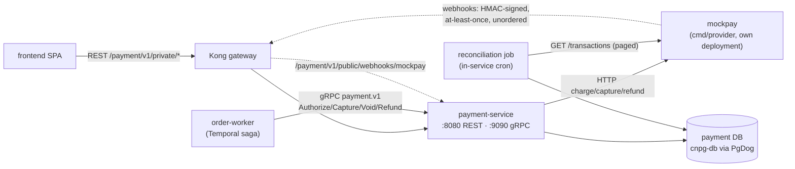
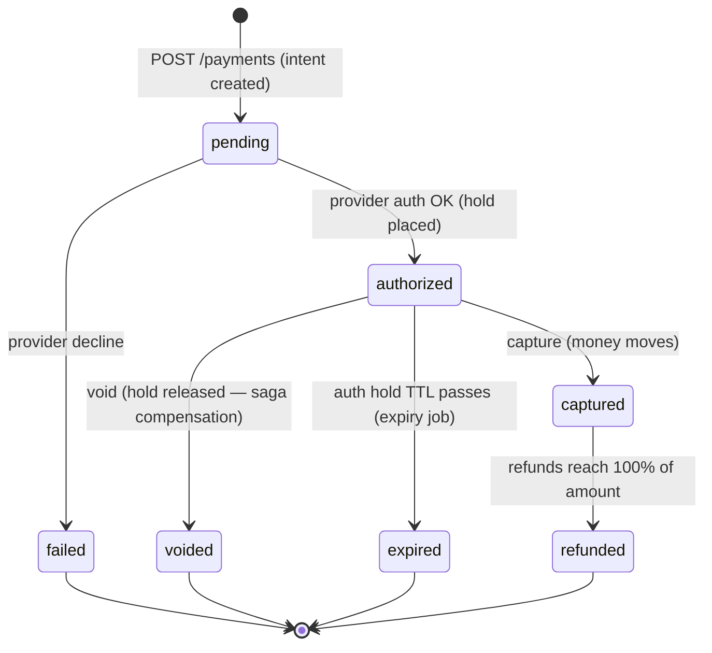
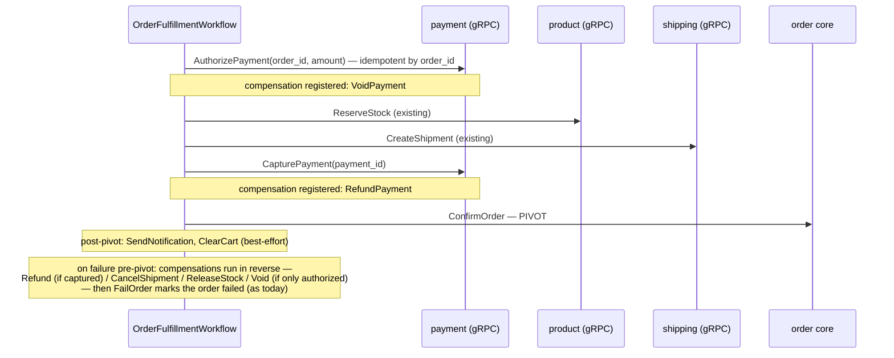

# RFC-0010: Payment service — PaymentIntent, ledger, and the charge/refund saga step

| Status | Scope | Created | Last updated |
|--------|-------|---------|--------------|
| implemented | platform-wide | 2026-07-03 | 2026-07-05 |

> **Progress:** **P1–P4 ✅** have landed — scaffold + API + state machine
> + idempotency (P1); double-entry ledger ([ADR-007](../../adr/ADR-007-double-entry-payment-ledger/)),
> transactional outbox, `mockpay` provider ([ADR-008](../../adr/ADR-008-mockpay-standalone-provider/)),
> and the HMAC webhook receiver + emitter (P2); `payment.v1` gRPC + shared
> `pkg/idempotency` + the order-saga rewire behind `PAYMENT_ENABLED`
> ([ADR-009](../../adr/ADR-009-saga-authorize-early-capture-late/),
> [ADR-010](../../adr/ADR-010-shared-idempotency-library/)) (P3); and
> reconciliation + fault-injection e2e (P4) — **amended by
> [ADR-011](../../adr/ADR-011-detect-only-reconciliation/): the shipped
> reconciliation is detect-only; the auto-heal described in §Reconciliation job
> is deferred to a later slice**; and the full cluster GitOps wiring (P5:
> CNPG role/DB, secrets, workloads incl. mockpay, a tighter-than-siblings
> NetworkPolicy, Kong routes, Kyverno lists, saga enablement — cluster e2e
> verification runs at the next Kind bring-up); and the frontend read path
> (P6: `payment.v1 GetPayment` read RPC → order-details payment enrichment →
> a mock test-token picker at checkout + a payment status box on the order
> detail, real-browser e2e-verified in local-stack). **All phases P1–P6 have
> landed; this RFC is `implemented`.** The `PAYMENT_ENABLED` flag has since been
> removed (P3.exit — payment is now unconditional); the deferred auto-heal
> ([ADR-011](../../adr/ADR-011-detect-only-reconciliation/)) is the only
> remaining follow-up, tracked separately from this RFC.

> **Tradeoff:** a payment service concentrates the hardest distributed-systems
> problems (idempotency, async confirmation, money-grade audit trails) into one
> deliberately over-engineered service. That is the point — this platform is a
> learning vehicle — but every pattern below is also the industry-standard way
> to run real money, so nothing here is throwaway design.

## Summary

Add `payment-service` — the platform's 9th Go microservice — plus a mock
payment provider (`mockpay`). Payment issues Stripe-style **PaymentIntents**
with mandatory **idempotency keys**, a strict **state machine**
(`pending → authorized → captured`, refunds as first-class objects), an
**append-only double-entry ledger**, an **HMAC-signed webhook** pipeline from
the provider, and a **reconciliation job** that detects and heals drift
between the internal ledger and the provider. The order fulfillment saga
(RFC-0001) gains real money semantics: **authorize before reserving stock,
capture only when fulfillment is secured**, with `Void`/`Refund` as
compensations.

## Motivation

The checkout flow `cart → order → shipping` confirms orders without ever
collecting money — the saga is `ReserveStock → CreateShipment →
ConfirmOrder (pivot) → SendNotification → ClearCart`
([temporal-order-fulfillment.md](../../../api/temporal-order-fulfillment.md)).
That is the platform's biggest functional gap, and closing it unlocks the
lessons none of the existing 8 services can teach:

- **True idempotency** — two identical requests (client retry, network
  timeout, Temporal activity retry) must never charge twice. Enforced by
  storage design, not by hope.
- **Money-grade state machine** — transitions are a whitelist, not a
  convention; some states are *derived from data* rather than stored.
- **Async external confirmation** — a provider that answers later, via
  signed webhooks that arrive at-least-once and out of order.
- **Audit trail** — an append-only double-entry ledger where corrections are
  new entries, never edits.
- **Reconciliation** — two systems *will* drift; a job detects, classifies,
  and heals the drift.
- **Compensation with teeth** — the saga's `RefundPayment` finally
  compensates something real.

### Goals

1. `payment-service` (checkout domain) exposing PaymentIntent CRUD + refunds
   over REST (browser) and `Authorize/Capture/Void/Refund` over gRPC (saga).
2. A deterministic idempotency mechanism on every money-moving operation:
   mandatory `Idempotency-Key` header on REST, natural business keys
   (`order_id` / `refund:{order_id}`) on the saga RPCs — with
   Stripe-semantics storage (first response replayed; same key + different
   body rejected; concurrent duplicates serialized).
3. Auth/capture split: `authorized` is a real hold with a TTL; capture is a
   second, separate act; void ≠ refund.
4. Append-only double-entry ledger; every money event posts balanced entries
   in the same DB transaction (with a transactional outbox for events).
5. `mockpay` — a separate provider binary that makes the integration *real*:
   network hop, HMAC-signed webhooks (with deliberate duplicates and
   reordering), a paginated transactions API, deterministic failure triggers.
6. Reconciliation job comparing ledger vs provider, classifying discrepancies
   and auto-healing the deterministic ones.
7. Order saga integration: `AuthorizePayment` pre-pivot, `CapturePayment`
   immediately before `ConfirmOrder`, compensations `VoidPayment` /
   `RefundPayment`.
8. Existing services may be **refactored where needed to adopt payment
   properly** (adaptation mandate, §Impact) — no bolt-ons.

### Non-Goals

- Real payment providers, real card data, PCI-DSS certification (but we keep
  the PCI *discipline*: no card-like data is ever stored or logged).
- 3-D Secure / SCA (`requires_action`), disputes/chargebacks, multi-capture
  of one authorization, multi-currency FX, zero-decimal currencies.
- A wallet/balance product. The ledger is an audit trail, not a bank.
- Replacing the saga engine — Temporal (RFC-0001) stays as-is.

## Architecture & diagrams

### Component topology



`mockpay` is a second binary in the same repo (`cmd/provider`), deployed as
its own small container — the same pattern as `order-worker` being a second
deployment of `order-service`. The network hop is deliberate: webhooks,
latency, and reconciliation are only honest lessons if the provider is a
separate process that can fail independently.

### Payment state machine



- Transitions are enforced in the **logic layer** by a whitelist —
  `map[Status][]Status` of allowed next states (any other transition →
  `409 INVALID_TRANSITION`) — **and** at the database as a compare-and-swap:
  `UPDATE payments SET status=$new WHERE id=$id AND status=$expected`, with
  rows-affected deciding the winner. The map check gives good errors; the
  CAS is what actually stops a concurrent `Capture` + `Void` (or capture vs
  the expiry job) from both proceeding from the same `authorized` read.
  There is no way to reach `captured` from `pending` or `refunded` from
  `pending`, by construction.
- `capture_method` on the authorize request: `manual` (default; the saga's
  mode — hold now, capture later) or `automatic` (auth + capture in one
  request: the service records `pending → authorized → captured` as two
  transitions executed back-to-back within the one operation — the whitelist
  is never bypassed).
- **`partially_refunded` is not a stored state.** It is *derived*:
  `SUM(refunds.amount_minor WHERE status='succeeded') < payments.amount_minor`
  while status stays `captured`; the stored status flips to `refunded` only
  when refunds reach 100%. Lesson: derive state from data instead of storing
  a flag that can drift from the truth.
- `authorized` carries `expires_at` (default 7 days, mirroring real auth
  holds). A periodic job expires stale holds; an expired hold cannot be
  captured (`409`).

## Proposal

### REST API (Variant A, browser-facing)

All routes follow the platform contract
([api-naming-convention.md](../../../api/api-naming-convention.md)): flat
error envelope `{"error": "...", "code": "..."}` via `pkg/httpx`, snake_case
JSON, standard pagination envelope, `user_id` always from the JWT (never the
body), amounts as **integer minor units** (`2000` = $20.00) with ISO-4217
`currency`.

| Method | Route | Audience | Purpose |
|--------|-------|----------|---------|
| `POST` | `/payment/v1/private/payments` | private | Create a PaymentIntent (authorize). **`Idempotency-Key` header required** |
| `GET` | `/payment/v1/private/payments/{id}` | private | Fetch one intent (owner-only) — includes `refunded_minor` + derived `partially_refunded` (also present in list items) |
| `GET` | `/payment/v1/private/payments` | private | Paginated history for the JWT user |
| `POST` | `/payment/v1/internal/payments/{id}/refunds` | internal | Create a (partial) refund. **`Idempotency-Key` required** — refund idempotency is separate from charge idempotency. Internal-only: refunds are issued by the saga compensation or an operator, **not** by end users (a self-service "refund me but keep the goods" button is not a feature; a returns flow is future work) |
| `POST` | `/payment/v1/public/webhooks/mockpay` | public | Provider webhook receiver — anonymous at the edge, authenticated **in-app** by HMAC signature |
| `POST` | `/payment/v1/internal/reconciliation/runs` | internal | Trigger a reconciliation run (cluster-only) |
| `GET` | `/payment/v1/internal/reconciliation/runs/{id}` | internal | Run status + discrepancy report |

**Who creates the intent.** One payment per order (`UNIQUE(order_id)`), two
possible creators, phased explicitly:

- **P1–P2 (pre-saga):** `POST /private/payments` is the only entry point —
  it exists precisely so the idempotency and state-machine lessons are
  exercisable before any saga wiring.
- **P3+ (checkout):** the **saga is the creator** — the SPA supplies an
  opaque `payment_method_token` on `POST /order/v1/private/orders` (new
  optional field), order passes it into the workflow input, and the
  `Authorize` RPC creates the intent idempotently by `order_id`
  (found-and-matching → return existing; found-but-different amount →
  `FAILED_PRECONDITION`).
- A REST `POST` for an order that already has a payment returns
  `409 PAYMENT_EXISTS`. Both creators funnel into the same logic-layer
  authorize path.

New stable error codes (added to `pkg/httpx`):
`IDEMPOTENCY_KEY_REQUIRED` (400 — header missing),
`IDEMPOTENCY_CONFLICT` (409 — same key, different request hash),
`INVALID_TRANSITION` (409), `PAYMENT_EXISTS` (409),
`REFUND_EXCEEDS_CAPTURE` (409), and `PAYMENT_DECLINED` (**422** — a status
this RFC deliberately *introduces* to the platform for semantically-valid
requests the provider declines; today's documented set stops at
400/401/403/404/409/500, and neither 400 nor 409 honestly describes a
decline). The webhook route answers `2xx` fast and processes async.

**Refund lifecycle.** Refunds are first-class objects with their own states:
`pending → succeeded | failed` (provider confirms async via webhook).
Validation at create time: `SUM(refunds.amount_minor WHERE status IN
('pending','succeeded')) + new_amount ≤ payments.amount_minor`, else
`409 REFUND_EXCEEDS_CAPTURE` — in-flight refunds count against the cap, so
concurrent refund requests cannot oversubscribe. A refund against an already
fully-`refunded` payment fails the same check; a `failed` refund releases its
reserved amount.

> The `protected` audience (signed-webhook class) exists in the naming
> convention but has never been deployed. v1 keeps the webhook on `public` +
> in-app HMAC (matching today's Kong reality); migrating it to `protected`
> with a gateway-level check is listed as a follow-up when Kong grows that
> capability.

### gRPC API (`payment.v1`, saga-facing)

New proto in `duynhlab/pkg` `pkg/proto/payment/v1/` (buf lint/breaking in CI,
generated stubs committed). Served always-on at `:9090` via `pkg/grpcx`
(headless `payment-grpc` Service, `dns:///` + `round_robin` —
[grpc-internal-comms.md](../../../api/grpc-internal-comms.md)).

```protobuf
service PaymentService {
  rpc Authorize(AuthorizeRequest) returns (Payment);   // idempotent by order_id
  rpc Capture(CaptureRequest) returns (Payment);       // idempotent (capturing captured = no-op)
  rpc Void(VoidRequest) returns (Payment);             // idempotent (voiding voided = no-op)
  rpc Refund(RefundRequest) returns (RefundResponse);  // idempotent by refund idempotency key
  rpc GetPayment(GetPaymentRequest) returns (Payment); // order enrichment
}
```

Browser traffic never touches gRPC (hard platform rule); the saga never uses
REST. `AuthorizeRequest` carries `order_id`, `user_id`, `amount_minor`,
`currency`, and a `payment_method_token` (opaque test token — see mockpay).

### Idempotency design (the headline lesson)

Stripe semantics, brandur-style Postgres implementation:

```sql
CREATE TABLE idempotency_keys (
  id              BIGINT GENERATED ALWAYS AS IDENTITY PRIMARY KEY,
  user_id         BIGINT      NOT NULL,
  idem_key        TEXT        NOT NULL,
  request_method  TEXT        NOT NULL,
  request_path    TEXT        NOT NULL,
  request_hash    TEXT        NOT NULL,           -- SHA-256 of canonical body
  locked_at       TIMESTAMPTZ,                    -- in-flight marker (stale > 90s = takeover)
  recovery_point  TEXT        NOT NULL DEFAULT 'started',  -- started | provider_called | finished
  response_code   INT,                            -- cached result (NULL until done)
  response_body   JSONB,
  created_at      TIMESTAMPTZ NOT NULL DEFAULT now(),
  UNIQUE (user_id, idem_key)
);
```

- **Claim**: `INSERT … ON CONFLICT DO NOTHING`; rows-affected decides winner.
  The unique index *is* the lock — race-free without advisory locks.
- **Replay**: a completed row (`response_code IS NOT NULL`) with a matching
  `request_hash` returns the cached response verbatim.
- **Mismatch**: same key + different `request_hash` → `409
  IDEMPOTENCY_CONFLICT`. A key identifies one request, not one endpoint.
- **Concurrency**: a *freshly* locked, incomplete row → `409` with
  `Retry-After`; the retry then hits the replay path. A row whose
  `locked_at` is stale (> 90 s — a crashed attempt) is **taken over**: the
  new attempt re-drives the request from its recorded `recovery_point`
  instead of bricking the key until the 24h TTL.
- **TTL**: keys are reaped after 24h (Stripe's window).
- **Atomicity, honestly.** The provider call is a network hop and *cannot*
  live inside a Postgres transaction — pretending otherwise is how systems
  double-charge. The brandur-style answer, adopted here:
  1. claim key (tx 1, `recovery_point = started`);
  2. call mockpay **passing the same idempotency key through** (mockpay
     echoes it, so a re-driven call after a crash replays the provider's
     first answer instead of re-charging); mark `provider_called` (tx 2);
  3. ledger post + outbox event + payment state change + key completion
     (`finished`, cached response) in **one** final transaction.
  A crash between any two checkpoints is recovered by the takeover path
  re-entering at the recorded phase — the provider-side idempotency key is
  what makes step 2 safe to repeat.

The claim/replay mechanics are generic; the RFC proposes extracting them as
**`pkg/idempotency`** so other services (e.g. order creation) can adopt the
same discipline later.

### Double-entry ledger (append-only)

```sql
CREATE TABLE ledger_accounts  (id, name, type);            -- e.g. customer_funds, merchant_revenue, provider_clearing
CREATE TABLE ledger_transactions (id, payment_id, kind, external_ref, created_at);
CREATE TABLE ledger_entries (
  id             BIGINT GENERATED ALWAYS AS IDENTITY PRIMARY KEY,
  transaction_id BIGINT NOT NULL REFERENCES ledger_transactions(id),
  account_id     BIGINT NOT NULL REFERENCES ledger_accounts(id),
  direction      TEXT   NOT NULL CHECK (direction IN ('debit','credit')),
  amount_minor   BIGINT NOT NULL CHECK (amount_minor > 0)
);
```

- Invariant: per transaction, `Σ(debits) = Σ(credits)` — asserted in code at
  post time and guarded by a scheduled `ledger_imbalance` check metric.
- **No UPDATE or DELETE, ever** (enforced by revoking those privileges from
  the app role on the entries table). A correction is a new *reversing*
  transaction; a refund posts mirror-image entries for the refunded amount.
- A capture posts `debit customer_funds / credit merchant_revenue`; a refund
  posts the reverse for the partial amount. Running balances are computable
  from history alone.

### Transactional outbox

`payment_outbox(id, event_type, payload JSONB, created_at, published_at)` —
written in the **same DB transaction** as the state change + ledger post; a
relay goroutine publishes and marks rows. v1's only consumer is internal
(webhook-triggered state changes fan back into order status via the saga),
but the pattern is the platform's first outbox and the RFC's second
headline lesson: *state change and event emission must be atomic*.

### mockpay — the mock provider

Separate binary (`cmd/provider`), own container, deliberately hostile in
test-mode ways:

- **API**: `POST /charges` (auth or auth+capture), `POST /charges/{id}/capture`,
  `POST /charges/{id}/void`, `POST /refunds`, `GET /transactions?page=…`
  (paginated — the reconciliation food source). Accepts and echoes
  idempotency keys.
- **Webhooks** → `POST /payment/v1/public/webhooks/mockpay`:
  - Event catalog: `charge.authorized`, `charge.captured`,
    `charge.auth_expired` (mockpay expires stale holds **independently** of
    payment's own expiry cron — the organic source of the
    `status_mismatch` reconciliation class), `charge.voided`,
    `refund.succeeded`, `refund.failed`.
  - Signature: `Mockpay-Signature: t=<unix>,v1=<hex>` where
    `v1 = HMAC-SHA256(secret, "{t}." + raw_body)` — verify against the **raw**
    body, constant-time compare, reject if `|now - t| > 5m` (replay window).
  - Delivery is **at-least-once with retries** (backoff on non-2xx), and the
    mock *deliberately* re-sends ~10% of events and occasionally swaps the
    order of `charge.captured`/`charge.authorized` — consumers must dedup by
    `event_id` (a `webhook_events` table) and treat events as hints,
    re-fetching current provider state when in doubt.
  - Receiver edge cases: a valid-signature event for an **unknown payment**
    is ACKed `200` and parked (`webhook_events.status = orphaned`) — a
    non-2xx would make mockpay retry forever; orphans surface in
    reconciliation. Unknown event **types** are ACKed and logged. Only
    signature/timestamp failures return non-2xx.
- **Deterministic failure triggers** (Stripe test-card philosophy, magic
  amounts as the mock simplification): `amount_minor % 100 == 02` → generic
  decline, `== 95` → insufficient_funds, `== 19` → processing_error (retry
  succeeds). Plus `MOCKPAY_FAIL_RATE` (default 0) as a chaos toggle to
  exercise the Kong/gRPC retry + circuit-breaking work from RFC-0009's
  resilience phase.
- **Seeded reconciliation breaks**: on startup mockpay plants a missing
  record, a ±1-minor-unit amount mismatch, and a status lag so the very first
  reconciliation run has all four discrepancy classes to find.

### Reconciliation job

In-service cron (v1; no new deployable): pages `GET /transactions`, matches
by `provider_payment_id` (stored on every payment at authorize time — the
shared identifier that makes reconciliation automatable), and classifies:

| Class | Meaning | Action |
|-------|---------|--------|
| `missing_internal` | provider has it, we don't | flag (should be impossible → bug) |
| `missing_provider` | we have it, provider doesn't | auto-heal if < settlement lag window, else flag |
| `amount_mismatch` | amounts differ | auto-heal ≤ 1 minor unit (post correcting ledger entry), else flag |
| `status_mismatch` | states differ | re-fetch + converge via normal transitions, else flag |

Results land in `reconciliation_runs` / `reconciliation_discrepancies`
tables, surfaced via the internal API and metrics.

### Saga integration (order fulfillment v2)



- **Authorize first**: fail cheap. A decline aborts the saga before any
  stock is reserved or shipment created — the most common failure needs zero
  compensations.
- **Capture last, just before the pivot**: money only moves when fulfillment
  is secured. Failure *after* capture but before `ConfirmOrder` compensates
  with `RefundPayment`; failure between authorize and capture compensates
  with the cheap `VoidPayment` (a released hold, no ledger movement).
- Activity idempotency: the business key is `order_id` (one payment per
  order in v1, `UNIQUE(order_id)` on payments) — Temporal activity retries
  hit the same idempotency row and replay. The compensation's refund key is
  equally deterministic: `refund:{order_id}` (full-amount compensation, one
  per order). The Temporal-recommended `RunID+ActivityID` composite is
  documented as the general pattern for activities without a natural
  business key.
- Retry policy identical to RFC-0001 activities; declines are wrapped
  non-retryable (a declined card does not heal by retrying).

### Alternatives considered

- **In-process mock provider** (a Go package instead of `mockpay`): zero new
  deployables, but the webhook becomes a self-call and reconciliation
  compares a table with itself — the two hardest lessons degrade to
  ceremony. Rejected: the network hop is the curriculum.
- **Immediate capture only** (`pending → captured`): simpler state machine,
  but loses auth-hold TTLs, void-vs-refund, and the capture-after-fulfillment
  saga shape — precisely the parts a real checkout needs. Rejected; immediate
  capture remains available as the `capture_method: automatic` request option
  (two whitelisted transitions in one operation, see the state-machine
  section).
- **REST for order→payment**: violates the platform's gRPC east-west
  standard and would make payment the only saga callee on REST. Rejected.
- **Separate reconciliation worker deployment**: cleaner isolation, but a
  cron goroutine in payment-service is sufficient at this scale and avoids a
  third deployable; revisit if runs grow long.

## Design details — phased delivery

Phases land as separate PR waves after this RFC merges; each phase is
e2e-verified in local-stack before push (house rule).

| Phase | Scope | Repos touched |
|-------|-------|---------------|
| **P1 ✅** | Repo scaffold (order-service as model: 3-layer, `migratex`, `authmw`, `obsx`, middleware copy, gha-workflows CI + Sonar), payments/refunds REST API, state machine, idempotency keys | new `payment-service`, `pkg` (httpx error codes) |
| **P2 ✅** | `mockpay` binary, webhook receiver + `webhook_events` dedup, double-entry ledger, outbox | `payment-service` |
| **P3 ✅** | `payment.v1` proto + gRPC server; **extract `pkg/idempotency`** from P1's implementation; order saga rewire (insert Authorize/Capture + compensations in `internal/saga/workflow.go`, minor-units conversion at the boundary), `PAYMENT_GRPC_ADDR` env; shipping `CancelShipment` idempotency regression test; doc sweep (incl. the stale kindnet line in `grpc-internal-comms.md`) | `pkg`, `order-service`, `shipping-service`, homelab (order-worker + 4 domain `*-rs.yaml`, docs) |
| **P4 ✅** | Reconciliation job (detect-only per ADR-011; seeded breaks folded into the drift-injection e2e), fault-injection triggers, full local-stack e2e (compose blocks, kong.yml routes, init.sql) | `payment-service`, homelab `local-stack/` |
| **P5 ✅** | Cluster GitOps: `services/payment.yaml` InputProvider (checkout domain), cnpg-db `postInitSQL` + PgDog pooler + **two** ExternalSecrets (product ns + payment ns), webhook HMAC secret (OpenBAO `secret/local/payment/webhook-hmac` → ESO), NetworkPolicy (Kong→:8080; order→:9090), Kong `api-payment` ingresses, **add `payment` to the 3 Kyverno policies that hardcode namespace lists** | homelab |
| **P6 ✅** | Read path + frontend: `payment.v1 GetPayment` read RPC (`pkg` v0.15.0, `refunded_minor` in v0.15.1); order-details payment enrichment (soft-fail `GetPayment`, carry `payment_method` through the saga with a PCI-safe `tok_` validation before persist); checkout mock test-token picker + payment status box on order detail | `pkg`, `payment-service`, `order-service`, `frontend`, homelab |

### Impact on existing services (adaptation mandate)

Existing services are **expected to be refactored where adopting payment
properly requires it** — integration must not be a bolt-on:

- **order-service** — saga rewire (P3); `orders` gains `payment_id`;
  `GET /order/v1/private/orders/{id}` exposes payment status (soft-fail
  enrichment via `GetPayment`). **Money types: the float problem is real
  today** — the saga input carries `Total float64`
  (`internal/saga/workflow.go:36`) and order/cart totals are dollars-as-
  floats throughout `api.md`. P3 puts the conversion at the order boundary
  (`amount_minor = round(total × 100)`, half-up; `currency` fixed `"USD"` in
  v1 — a mismatch between the order currency and `AuthorizeRequest.currency`
  is `INVALID_ARGUMENT`), and refactors order totals to **int64 minor
  units** end-to-end as part of the same phase.
- **pkg** — `proto/payment/v1` + `pkg/idempotency` extraction (P3); `httpx`
  gains the new stable codes (P1): `IDEMPOTENCY_KEY_REQUIRED`,
  `IDEMPOTENCY_CONFLICT`, `INVALID_TRANSITION`, `PAYMENT_EXISTS`,
  `REFUND_EXCEEDS_CAPTURE`, `PAYMENT_DECLINED` (+ the 422 status).
- **shipping-service** — no API change, but the new saga order (ship before
  capture) makes `CancelShipment` compensation hotter — its idempotency gets
  a dedicated regression test.
- **cart-service** — unchanged (verified: no assumptions about order
  confirmation).
- **notification-service** — payment receipt / refund templates (post-P6,
  optional).
- **frontend** — P6 as scoped.

All existing-service changes go through the normal gauntlet: Sonar ≥80%
new-code coverage, `go test -race`, golangci-lint, agent-skills review.

### Reversibility & operator visibility

- Payment is **off until P3 merges the saga rewire**, and that rewire ships
  behind an order-service config flag (`PAYMENT_ENABLED`, default false →
  saga behaves exactly as today). Flipping it off restores the current
  moneyless checkout at any time.
- Detection: saga step visibility in Temporal UI; payment RED metrics +
  business metrics (below); reconciliation discrepancy counts.

## Security considerations

- **gRPC `:9090` has no mTLS and no inbound auth today** (RFC-0002 is P1,
  provisional). `Authorize/Capture/Refund` are the most sensitive RPCs the
  platform has. Mitigations until RFC-0002 lands: NetworkPolicy fence (only
  `order` namespace may reach payment `:9090`; enforcement by kindnet is
  **verified on the local cluster, K8s 1.34.3** —
  [network-policies.md](../../../security/network-policies.md); note
  `grpc-internal-comms.md` §5 still carries a stale "kindnet does not
  enforce" line to be corrected in P3's doc sweep), and payment validates
  `order_id`/`user_id` consistency on every RPC. RFC-0002 is an explicit
  dependency for calling this production-grade.
- **Webhook is a public, anonymous route** — authenticated in-app: HMAC over
  the raw body, constant-time compare, 5-minute timestamp tolerance, event-id
  dedup. The HMAC secret lives in OpenBAO, delivered by ESO (same pattern as
  the RFC-0009 JWT signing key); rotation is a documented runbook (dual-secret
  acceptance window).
- **PCI discipline note**: even as a mock, no PAN-like data is accepted,
  stored, or logged — payment methods are opaque test tokens
  (`tok_visa_ok`, `tok_visa_decline`, …). CI keeps gitleaks; log fields are
  allow-listed.
- Kyverno/PSS baseline applies unchanged; payment namespace joins the three
  hardcoded policy lists (P5).

## Observability & SLO impact

- **Free from the platform**: RED metrics via the shared middleware +
  `app.kubernetes.io/component: api` ServiceMonitor; SLO (availability/latency) auto-rendered
  by the `mop` chart (`slo.enabled: true` in checkout-rs); tracing via
  `middleware/tracing.go` (ParentBased sampler) + Kong edge spans; JSON logs
  → Vector → VictoriaLogs.
- **New business metrics**: `payment_intents_total{status}`,
  `payment_refunds_total`, `payment_webhook_events_total{result=ok|dup|invalid_sig|stale}`,
  `payment_ledger_imbalance` (gauge, alert if ≠ 0),
  `payment_reconciliation_discrepancies_total{class}`,
  `payment_idempotency_replays_total`.
- **New alerts** (layer-1 additions): ledger imbalance ≠ 0 (critical),
  reconciliation flagged-discrepancies > 0 for 2 consecutive runs (warning),
  webhook invalid-signature spike (warning).
- Saga metrics/traces extend existing RFC-0001 dashboards; the payment steps
  appear automatically in Temporal UI + Tempo.

## Rollout & rollback

1. Merge RFC (provisional → implementable after review).
2. P1–P2 are payment-service-internal — deployable to local-stack with zero
   effect on existing services.
3. P3 is the coupling point: saga rewire behind `PAYMENT_ENABLED=false`
   default; enable in local-stack first, then cluster.
4. P5 cluster rollout is additive GitOps (new namespace/service); Flux
   dependency chain unchanged (apps-local already waits on databases).
5. **Rollback**: flip `PAYMENT_ENABLED=false` (saga reverts to today's
   shape); payment deployment can stay running harmlessly. DB objects are
   additive; no destructive migrations in any phase.
6. **Flag removal (do not skip)**: `PAYMENT_ENABLED` is scaffolding, not
   architecture — the flag is evaluated once at workflow start (workflow
   input, for Temporal determinism), and once payment has baked in the
   cluster (suggested: 2 weeks of green SLO + zero flagged reconciliation
   discrepancies), a dedicated **cleanup PR removes the flag and its two
   guarded branches**, making payment a mandatory saga step. Leaving the
   flag in place permanently doubles the tested behavior surface. This
   cleanup is the explicit exit criterion that closes P3.

## Testing & verification

- **Unit**: transition-map table tests (every allowed/forbidden pair);
  idempotency claim/replay/mismatch/concurrency (race test with `-race`);
  ledger balance invariant; webhook signature (valid/invalid/stale/dup).
- **Integration** (testcontainers, `//go:build integration`): idempotent
  authorize under parallel duplicates; refund accumulation → derived
  `partially_refunded` → stored `refunded`; outbox atomicity (crash between
  state change and publish → relay recovers).
- **e2e local-stack (pre-push, house rule)**: full checkout via Kong with
  each magic amount (success / decline / insufficient / flaky-then-ok);
  webhook duplicate + out-of-order delivery observed in logs + dedup metric;
  reconciliation run finds the 4 seeded breaks and heals the deterministic
  ones; **two saga compensation drills** — (a) void path: kill shipping so
  `CreateShipment` fails → assert `VoidPayment` + `ReleaseStock` +
  `FailOrder` (no money moved); (b) refund path: let capture succeed then
  force `ConfirmOrder` to fail → assert `RefundPayment` + `CancelShipment` +
  `ReleaseStock` + `FailOrder`; browser pass via agent-browser per
  `local-stack/README.md` audit guide.
- Coverage: Sonar ≥80% new-code on every PR (repository layer via
  integration-coverage merge, as per platform convention).

## Implementation history

- 2026-07-03 — RFC created (provisional). Research base: internal API/RFC
  conventions, platform delivery-surface survey, Stripe/Temporal/ledger
  standards review (context7 + primary sources).

## Related

- [RFC-0001](../RFC-0001/README.md) — Temporal order fulfillment (the saga
  this extends)
- [RFC-0002](../RFC-0002/README.md) — mTLS (security dependency for the
  payment gRPC surface)
- [RFC-0003](../RFC-0003/README.md) — inventory/stock semantics (adjacent:
  reservation ledger patterns)
- [RFC-0009](../RFC-0009/README.md) — API gateway & JWT edge auth (the auth
  model payment inherits; ESO secret pattern reused for the webhook HMAC)
- [api-naming-convention.md](../../../api/api-naming-convention.md) ·
  [grpc-internal-comms.md](../../../api/grpc-internal-comms.md) ·
  [temporal-order-fulfillment.md](../../../api/temporal-order-fulfillment.md)
- ADRs to spawn (agreed policy: **each ADR is written when its phase lands**,
  created as `Accepted` — the decision is made by then; ADRs stay short and
  link back here for the full design):
  - [ADR-007](../../adr/ADR-007-double-entry-payment-ledger/) — double-entry
    ledger for money audit (**P2**, landed)
  - [ADR-008](../../adr/ADR-008-mockpay-standalone-provider/) — mockpay as a
    standalone provider process (**P2.3**, landed)
  - ADR — payment as pre-pivot saga step, authorize-early / capture-late
    (**P3**)
  - ADR — idempotency keys as shared `pkg/idempotency` (**P3**; absorbs the
    `422 PAYMENT_DECLINED` status introduction and the one-payment-per-order
    `UNIQUE(order_id)` contract)
