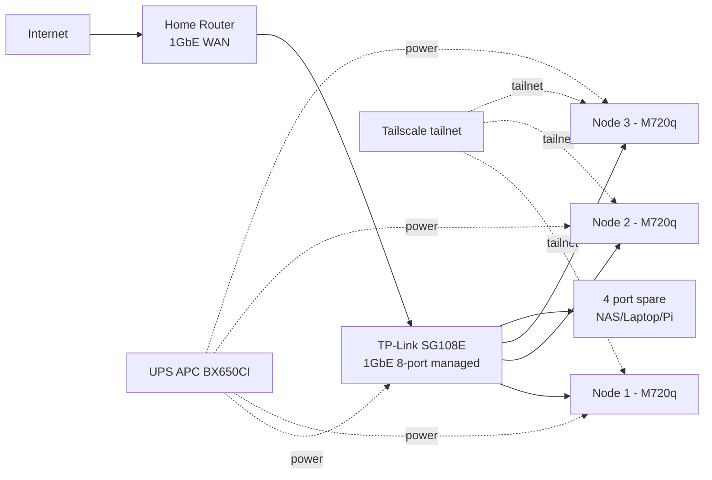
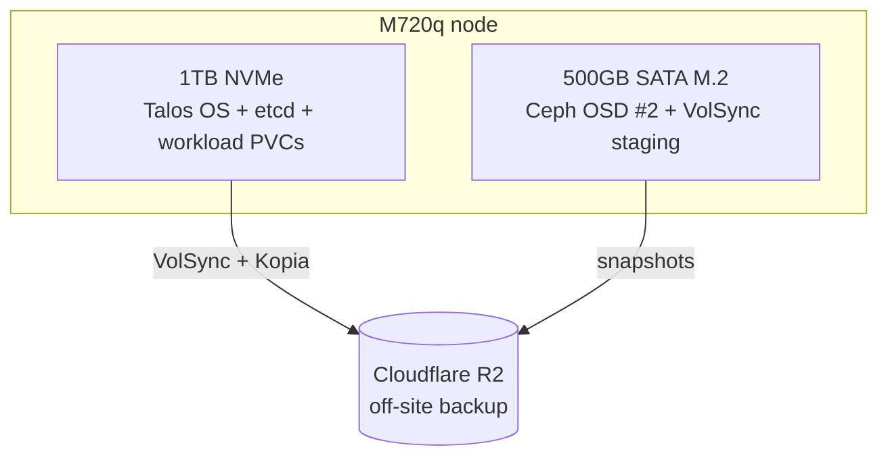

# RFC-0011: Homelab migration — Kind to bare-metal Talos (1 → 3 node HA)

| Status | Scope | Created | Last updated |
|--------|-------|---------|--------------|
| provisional | infra | 2026-07-04 | 2026-07-04 |

> **Origin:** converted from a May 2026 planning discussion (formerly
> `docs/platform/homelab-migration-plan.md`), triggered by OpenBAO PVC pain on
> Kind — every cluster rebuild lost the Cloudflare API token and cascaded into
> cert-manager failures.

> **Tradeoff:** this RFC trades the zero-cost, disposable Kind cluster for
> ~21.2tr VND (~$840) of hardware plus the operational burden of real machines
> (power, disks, upgrades) — in exchange for durable state, 24/7 operation, and
> a genuine bare-metal Kubernetes learning platform with a clean 1 → 3 node HA
> path.

## Summary

Graduate the homelab from Kind (ephemeral, single-host Docker) to bare-metal
Talos Linux on Lenovo ThinkCentre M720q mini PCs, scaling from 1 node
(Phase 1) to a 3-node HA cluster (Phase 2). The GitOps model (Flux Operator +
ResourceSets + OCI), Kong gateway, secrets stack (OpenBAO + External Secrets +
cert-manager), observability stack, and the 8 microservices all carry over
unchanged; what changes is the substrate: Talos OS, Cilium CNI, Rook-Ceph
storage, VolSync + Kopia backups to Cloudflare R2, and Tailscale for remote
access.

## Motivation

Pain points of Kind (single-host Docker):

- **Ephemeral PVCs** — every `make down && make up` wipes all data: OpenBAO
  loses the Cloudflare token → cert-manager fails → cascading cluster-wide
  errors.
- **Bootstrap secret pain** — the Cloudflare API token must be manually
  re-seeded on every rebuild.
- **Not real** — no exposure to bare-metal networking, storage, or OS-level
  concerns.
- **Single-host Docker** — HA cannot be tested; no meaningful chaos
  engineering.
- **Not production-grade** — the current stack is a "production-grade design
  on dev-grade infrastructure".

### Goals

- Run 24/7 without fear of data loss.
- Learn bare-metal Kubernetes end to end (Talos, Cilium, Rook-Ceph,
  Tailscale).
- Automatic off-site backups to Cloudflare R2.
- A clear path from 1 node to 3-node HA without a redesign.

### Non-Goals

- Changing the gateway — Kong (DB-less) stays; Envoy Gateway is explicitly
  rejected (see Alternatives).
- Changing the GitOps model — Flux Operator + ResourceSets + OCI stays as is.
- Public internet hosting — cloudflared tunnel remains optional/undecided
  (see Open decisions).
- Replacing OpenBAO + External Secrets with another secrets manager.

## Proposal

### Hardware plan

Buying philosophy:

- Buy 2nd-hand Lenovo Tiny: 50–70% cheaper than new, more than enough
  performance for a homelab.
- Keep all 3 nodes the same model → swappable spare parts, easier
  troubleshooting.
- Buy right the first time rather than "saving" with cheaper parts.
- Buy the switch in Phase 1 so the final topology exists from day one.

**Phase 1 — buy now (~7.0tr VND / ~$280):**

| Item | Price (VND) |
|------|-------------|
| 1× Lenovo ThinkCentre M720q Tiny (barebone, 2nd-hand) — i5-8500T (6c/6t, 35W TDP) or i5-9500T; 2× M.2 NVMe slots + 1× 2.5" SATA bay | ~3.0tr |
| 2× 16GB DDR4 SODIMM 3200MHz (Crucial/Kingston) | ~1.2tr |
| 1× 1TB NVMe Lexar NM710 (PCIe 3.0) | ~1.3tr |
| 1× 500GB SATA M.2 KingSpec/Lexar (future Ceph 2nd OSD) | ~0.7tr |
| **Node #1 subtotal** | **6.2tr** |
| 1× Switch TP-Link TL-SG108E (1GbE 8-port managed) | 0.6tr |
| 3× CAT6 1m cables (bought upfront for all 3 nodes) | 0.2tr |
| **Total Phase 1** | **7.0tr (~$280)** |

Why buy the switch + 3 cables immediately:

- The final topology is ready — plug node #1 into the switch, switch into the
  router.
- The TL-SG108E has VLAN tagging, QoS, and port mirroring — enough to learn
  networking properly.
- 8 ports = 3 nodes + uplink + 4 spare (NAS/Pi/laptop later).

Why buy the second 500GB M.2 immediately:

- The M720q has 2 M.2 slots — use both from the start.
- Separating OS + workload (1TB NVMe) from Ceph data (500GB SATA M.2) avoids
  I/O contention.
- When scaling to 3 nodes, every node already has 2 disks for Ceph.

**Phase 2 — scale to 3 nodes (after 6–12 months, ~14.2tr VND / ~$560):**

| Item | Price (VND) |
|------|-------------|
| 2× Lenovo M720q Tiny barebone | 6.0tr |
| 4× 16GB DDR4 SODIMM (2 nodes × 32GB) | 2.4tr |
| 2× 1TB NVMe | 2.6tr |
| 2× 500GB SATA M.2 | 1.4tr |
| 1× UPS APC BX650CI (650VA) | 1.8tr |
| **Total Phase 2** | **14.2tr** |

Why the UPS waits until Phase 2:

- A single Phase 1 node rebooting on power loss is fine (Talos is immutable;
  restore from the R2 backup).
- 3 nodes + Ceph 3-replica + etcd quorum: a sudden power cut can corrupt
  etcd/Ceph.
- 650VA ≈ 10–15 minutes of uptime for 3 mini PCs + switch — enough for a
  graceful shutdown.

**Total investment:**

| Phase | When | Cost | Cumulative |
|-------|------|------|------------|
| Phase 1 | Now | 7.0tr | 7.0tr |
| Phase 2 | +6–12 months | 14.2tr | **21.2tr** (~$840) |

→ Under $1000 for an HA homelab usable for 3–5 years.

**Common purchasing pitfalls:**

| Mistake | Consequence |
|---------|-------------|
| Buying an i3 instead of the i5-8500T | Not enough cores for Ceph + workload |
| Buying 8GB RAM planning to upgrade later | Wasteful — buy 32GB upfront |
| Buying a 512GB SSD to "save money" | Full in 6 months → painful migration |
| Skipping the second SATA M.2 | Ceph shares the OS disk → terrible I/O wait |
| Buying an unmanaged switch (no "E" suffix) | No VLAN, no QoS → nothing to learn |
| Forgetting the original 90W adapter | CPU throttling, instability |

### Stack decisions

Two opinionated repos were used as references for the stack design:
**jfroy/flatops** (Talos + Cilium + Rook-Ceph + Envoy Gateway + cloudflared +
tuppr) and **haraldkoch/kochhaus-home** (Cilium + Envoy + cert-manager +
External Secrets + 1Password + SOPS + Rook/Longhorn + VolSync + Harbor +
actions-runner-controller). Both are production-grade homelab patterns but
expensive in cognitive load — this proposal cherry-picks rather than adopting
either wholesale.

**Adopt 100%:**

| Pattern | Rationale |
|---------|-----------|
| **Talos Linux** | Immutable, API-driven, no SSH, auto-recovery. Fits a headless mini PC running 24/7 |
| **Cilium CNI** | eBPF, replaces kube-proxy → less overhead, strong network observability (Hubble) |
| **Tailscale Operator** | Game-changer. Access the cluster from laptop/phone without exposing anything or self-hosting a VPN |
| **VolSync + Kopia → R2** | **Mandatory** on 1 node — losing the disk means losing everything. The R2 free tier (10GB) covers metadata + DB dumps |
| **cert-manager + LE DNS-01** | Already in place. Keep |
| **External Secrets** | Already in place. Keep |

**Adopt with caution:**

| Pattern | Concern on 1 node |
|---------|-------------------|
| **Rook-Ceph** | On 1 node with 2 OSDs there is no real HA, but it provides snapshot/clone for VolSync. ~2GB RAM overhead. **Worth it** because Phase 2 scales to 3 nodes |
| **Envoy Gateway** | Kong runs fine today. Switching means relearning config for no gain. **Keep Kong** |
| **cloudflared tunnel** | Useful only if internet exposure is needed. If Tailscale suffices → skip |
| **tuppr** | Auto-upgrades Talos + K8s. Useful at 3 nodes, overkill for 1. **Add in Phase 2** |
| **actions-runner-controller** | Self-hosted GH runner, ~1GB RAM idle. **Skip in Phase 1**; add only if CI becomes a bottleneck |
| **Harbor (image mirror)** | Saves bandwidth on heavy image pulls. Not needed in Phase 1; add in Phase 2 if the network is slow |

### Final stack: Current vs Phase 1 vs Phase 2

| Layer | **Current (Kind)** | **Phase 1 (1× M720q Talos)** | **Phase 2 (3× M720q Talos HA)** |
|---|---|---|---|
| **OS** | Docker container (Kind) | Talos Linux | Talos Linux |
| **CNI** | kindnet | Cilium (Hubble off, kube-proxy replacement on) | Cilium (Hubble on) |
| **Ingress** | Kong (DB-less) ✅ | Kong (DB-less) ✅ | Kong (DB-less) ✅ |
| **Storage** | hostPath ephemeral | Rook-Ceph 2 OSD (1 node, no HA) | Rook-Ceph 6 OSD (3 nodes, 3-replica) |
| **Backup** | ❌ None | VolSync + Kopia → Cloudflare R2 | VolSync + Kopia → Cloudflare R2 |
| **Secrets manager** | OpenBAO HA Raft (1 pod in practice) | OpenBAO single replica + VolSync PVC backup | OpenBAO HA Raft, 3 real nodes |
| **Secrets sync** | External Secrets ✅ | External Secrets ✅ | External Secrets ✅ |
| **Bootstrap secret** | Manual `bao kv put` (painful) | SOPS + age (CF token, age key in `~/.homelab/`) | SOPS + age |
| **Cert** | cert-manager + LE DNS-01 ✅ | cert-manager + LE DNS-01 ✅ | cert-manager + LE DNS-01 ✅ |
| **Trust distribution** | trust-manager + homelab-ca | **Drop** (no internal mTLS use case yet) | Re-add when mTLS is needed |
| **GitOps** | Flux Operator + ResourceSets + OCI ✅ | Flux Operator + ResourceSets + OCI ✅ | Flux Operator + ResourceSets + OCI ✅ |
| **Remote access** | localhost only | Tailscale Operator | Tailscale Operator |
| **Public expose** | localhost | cloudflared tunnel (optional) | cloudflared tunnel |
| **Cluster upgrade** | recreate Kind | Manual `talosctl upgrade` | tuppr (auto + healthcheck) |
| **CI runner** | GitHub-hosted | GitHub-hosted | actions-runner-controller (if CI bottleneck) |
| **Image mirror** | ❌ | ❌ | Harbor (if network is slow) |
| **Postgres** | 3 clusters + DR | 3 clusters, 1 instance each | 3 clusters HA, 3 instances each |
| **Observability** | Full stack (VM + Tempo + VL + Vector + Pyroscope + Grafana) ✅ | Full stack ✅ (retention 7d) | Full stack ✅ (retention 30d) |
| **Apps** | 8 microservices + frontend ✅ | Same ✅ | Same ✅ |

Net change:

- ✅ **Add**: Talos, Cilium, Rook-Ceph, VolSync + Kopia, Tailscale Operator,
  SOPS (bootstrap only)
- ❌ **Remove (Phase 1)**: trust-manager + homelab-ca (deferred until an mTLS
  use case exists)
- 🔄 **Restructure**: OpenBAO HA → single replica + backup (Phase 1), back to
  HA Raft (Phase 2)
- ✅ **Keep**: Kong, ESO, cert-manager + LE, Flux + ResourceSets + OCI,
  observability stack, 8 microservices

### Roadmap

| Month | Hardware | Software milestone |
|-------|----------|--------------------|
| **0** | Buy node 1 + switch (7tr) | Talos single node + migrate the Kind stack |
| **1–2** | — | VolSync + Kopia → Cloudflare R2 backup setup |
| **2–3** | — | Tailscale Operator, cloudflared tunnel (if needed) |
| **3–6** | — | Trim observability, validate stack stability, run smooth |
| **6–12** | Buy nodes 2+3 + UPS (14tr) | Talos HA cluster, Ceph 3-replica, OpenBAO Raft 3 |
| **12+** | (Optional) 2.5GbE / 10GbE upgrade | Chaos engineering, tuppr |

### Alternatives

| Alternative | Why rejected |
|-------------|--------------|
| **1Password Connect** (kochhaus-home pattern) | Adds an external dependency and a $20/user/month license. OpenBAO is already in place — keep it |
| **SOPS replacing External Secrets** | SOPS fits static secrets in Git. OpenBAO + ESO already handles dynamic secrets + rotation — better. SOPS is used only for **bootstrap-only secrets** (CF token, age key), which is the correct pattern |
| **Longhorn** (instead of Rook-Ceph) | Simpler, but block storage only — no S3. Rook-Ceph provides block + S3 (object), a better fit |
| **Envoy Gateway** (flatops pattern) | Kong already works well; switching costs relearning time for no functional gain |
| **Ubuntu Server + k3s** (instead of Talos) | Easier to debug but far less immutable; still an open decision (see Open decisions) |
| **Stay on Kind** | Zero cost, but none of the goals (durability, 24/7, bare-metal learning, HA) are achievable |

## Architecture & diagrams

Final network topology (Phase 2):

Per-node disk layout (Phase 1, carried into Phase 2 on every node):

## Design details

### RAM budget on the M720q (32GB, Phase 1)

| Component | RAM | Note |
|---|---|---|
| Talos OS + kernel | 0.5GB | Immutable, lean |
| K8s control plane (etcd + apiserver + controller-manager + scheduler) | 1.5GB | Single node |
| Cilium agent + operator | 0.5GB | Hubble disabled in Phase 1 |
| Rook-Ceph (mon + mgr + 2 OSD) | 2.5GB | 2 OSDs on 2 disks |
| Flux Operator + Source/Helm/Kustomize controllers | 0.4GB | |
| cert-manager + ESO + Kyverno | 0.6GB | |
| OpenBAO (single replica) | 0.3GB | PVC backed up via VolSync |
| VolSync + Kopia | 0.2GB | Idle outside backup windows |
| Tailscale Operator + cloudflared | 0.3GB | |
| Kong | 0.4GB | DB-less, 1 replica |
| VictoriaMetrics single + VMAgent + VMAlert + VMAlertmanager | 1.5GB | Retention trimmed to 7d |
| Tempo + OTel Collector | 0.8GB | Trace retention 24h |
| VictoriaLogs + Vector | 0.8GB | Log retention 7d |
| Pyroscope | 0.5GB | Optional, can drop in Phase 1 |
| Grafana | 0.3GB | |
| Sloth Operator | 0.1GB | |
| 3 PostgreSQL clusters (Zalando + CNPG + DR) | 3.0GB | 1 instance per cluster in Phase 1 |
| PgBouncer + PgDog poolers | 0.4GB | |
| Valkey cache | 0.3GB | |
| 8 microservices | 1.6GB | ~200MB per Go service |
| Frontend (nginx + React build) | 0.1GB | |
| MCP servers (3) | 0.5GB | Droppable if no AI assistant in use |
| kube-system overhead (CoreDNS, metrics-server, …) | 0.5GB | |
| Buffer / OS cache | 4.0GB | Page cache for I/O performance |
| **Total** | **~21GB** | of 32GB → **~66% utilization, 11GB headroom** |

→ Comfortable. The full stack fits without aggressive trimming.

Optional trims (if a leaner profile is wanted):

| Trim | RAM saved | Tradeoff |
|------|-----------|----------|
| Drop Pyroscope | 0.5GB | No profiling — only needed for perf debugging |
| Drop the DR replica (cnpg-db-replica) | 0.5GB | Less load; VolSync backups still cover it |
| Drop MCP servers | 0.5GB | Enable only when using an AI assistant |
| Trim VM retention 7d → 3d | 0.5GB | Less metric history |
| Drop Kyverno (keep policies in `audit` mode) | 0.4GB | No enforcement |

→ Can trim down to **~17GB** if needed.

### Disk budget on the M720q (1TB NVMe + 500GB SATA, Phase 1)

NVMe 1TB (OS + workload + hot data):

| Volume | Size |
|--------|------|
| Talos system + container images | ~50GB |
| etcd data | ~5GB |
| Postgres data + WAL (3 clusters) | ~40GB after 6 months |
| VictoriaMetrics data (7d retention) | ~15GB |
| VictoriaLogs (7d retention) | ~10GB |
| Tempo (24h retention) | ~5GB |
| OpenBAO Raft data | ~1GB |
| Grafana + misc PVCs | ~5GB |
| **NVMe 1TB used** | **~131GB (~13% — plenty of room)** |

SATA M.2 500GB (Ceph 2nd OSD + backup staging):

| Volume | Size |
|--------|------|
| Ceph OSD #2 (HA-ready block storage) | 500GB raw |
| VolSync staging (snapshots before pushing to R2) | ~50GB |
| **SATA M.2 used** | **~100–200GB (~20–40%)** |

→ 1TB + 500GB is more than enough for Phase 1 — no disk pressure for at
least 2 years.

Phase 2 Ceph capacity: 3 nodes × (1TB NVMe + 500GB SATA) = **4.5TB raw**;
Ceph 3-replica → **~1.5TB usable**. Enough for PostgreSQL HA + long-retention
observability (30d) + media + local backups.

### Reversibility & operator visibility

- **Enable/disable:** the migration is a substrate swap, phased by the
  roadmap; each phase gates on the previous one running stably.
- **Rollback:** the Kind stack remains fully functional via `make up` — the
  GitOps manifests are shared, so falling back costs only the state restored
  from R2.
- **Operator visibility:** the existing observability stack carries over;
  Ceph/Talos health surfaces through the same Grafana/VMAlert pipeline.
- **Drawbacks:** hardware cost (~21.2tr total), single-node Phase 1 has no
  real HA (Rook-Ceph 2 OSD on one host), Talos has a steeper debugging curve
  than a general-purpose OS, and physical concerns (power, heat, disk wear)
  become the operator's problem.

## Open decisions

To settle before Phase 1 starts:

1. **OS**: Talos Linux (immutable, opinionated) or Ubuntu Server + k3s
   (easier debugging, less immutable)?
2. **OpenBAO Phase 1**: single replica (no HA, PVC backed up via VolSync) or
   3 replicas on 1 node (fake HA, 3× RAM)?
3. **Bootstrap secret**: SOPS + age (encrypted in Git, decrypted at
   bootstrap) or keep the script-based `~/.homelab/secrets.env` pattern?
4. **Public expose**: Tailscale only (private) or add a cloudflared tunnel
   (host a blog/app publicly)?
5. **MCP servers**: keep in Phase 1 (AI assistant in active use) or drop to
   save RAM?

Pre-purchase checklist:

- [ ] Confirm the Phase 1 budget (7tr) or cut to 5.5tr (drop the 2nd SATA
      M.2 + only 16GB RAM)
- [ ] UPS or stable power? If outages are common → buy the UPS in Phase 1
- [ ] Tailscale account ready? (Free tier: 100 devices — plenty)
- [ ] Cloudflare R2 set up? (Free tier: 10GB storage + 1M Class A ops/month)
- [ ] Any real need to expose services publicly? (Decides cloudflared vs
      Tailscale-only)
- [ ] Where to buy the M720q (HN: Mai Hắc Đế / Lê Thanh Nghị, or a Shopee
      shop with ≥1000 reviews)
- [ ] Ask the seller: original 90W adapter, both M.2 slots enabled, WiFi M.2
      card present?

## Security considerations

- **Bootstrap secrets** move from manual `bao kv put` to SOPS + age: the CF
  token is committed encrypted; the age key lives only in `~/.homelab/`.
- **OpenBAO in Phase 1** runs a single replica — availability risk, not a
  confidentiality one; the Raft PVC is backed up (encrypted at rest in R2 via
  Kopia).
- **Remote access** is Tailscale-only by default (no exposed control plane or
  NodePorts); cloudflared, if adopted, exposes only chosen HTTP routes.
- **Talos** removes SSH and runs an immutable, API-driven OS — a smaller host
  attack surface than a general-purpose distro.
- Kyverno/PSS posture is unchanged (Kyverno may run in `audit` mode if
  trimmed — an explicit enforcement tradeoff).

## Observability & SLO impact

- The full stack (VictoriaMetrics, Grafana, Tempo, VictoriaLogs, Vector,
  Pyroscope, Sloth) carries over; retention is trimmed to 7d in Phase 1 and
  raised to 30d in Phase 2.
- New signals to watch: Ceph health (mon/OSD), Talos node health, VolSync
  backup job success, Tailscale connectivity.
- SLOs are unaffected by design; Phase 1 is a single node, so
  availability SLOs measure the stack, not real HA.

## Rollout & rollback

- **Phased rollout** per the roadmap: single node first, backups before
  anything else (month 1–2), remote access next, then 6+ months of stability
  before buying nodes 2–3.
- **Blast radius:** a homelab — no external users; worst case is losing local
  state, mitigated by R2 backups from month 1–2.
- **Rollback:** the Kind flow (`make up`) stays intact throughout; manifests
  are substrate-agnostic via Flux + Kustomize overlays.

## Testing / verification

- **Backup restore drill:** after VolSync + Kopia is live, delete a PVC and
  restore it from R2 — the backup is only real once a restore has succeeded.
- **Power-loss test (Phase 1):** hard-reboot the node; Talos should recover
  and Flux should reconcile to steady state unattended.
- **Stability soak (months 3–6):** run the full stack continuously; alerts
  quiet, no OOM, disk growth within budget — the gate for buying nodes 2–3.
- **Phase 2 HA validation:** kill one node; Ceph 3-replica and etcd quorum
  must keep the platform serving.

## Implementation History

- 2026-07-04 — RFC created from the May 2026 planning discussion (formerly
  `docs/platform/homelab-migration-plan.md`).

## Related

- [`docs/secrets/README.md`](../../../secrets/README.md) — current OpenBAO
  architecture
- [`docs/secrets/cert-manager.md`](../../../secrets/cert-manager.md) —
  current cert-manager + LE DNS-01 setup
- Reference repos: [jfroy/flatops](https://github.com/jfroy/flatops),
  [haraldkoch/kochhaus-home](https://github.com/haraldkoch/kochhaus-home)
