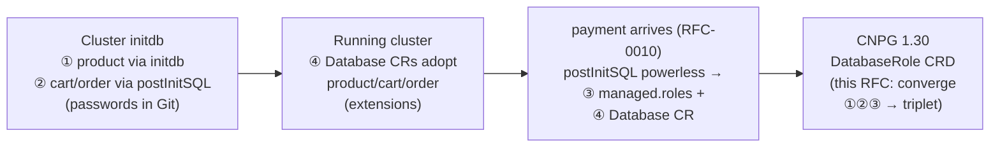
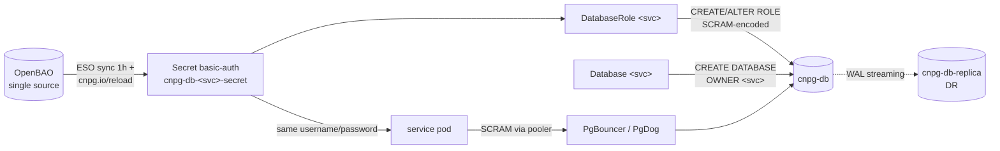
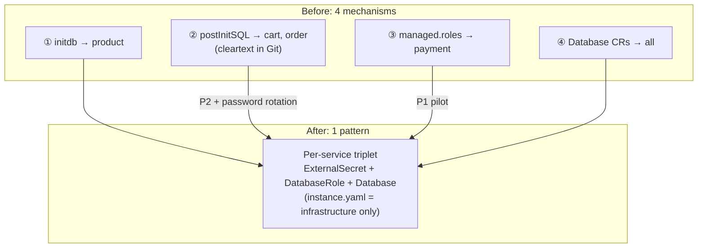

# RFC-0012: Converge CNPG role & database management on declarative CRDs

| Status | Scope | Created | Last updated |
|--------|-------|---------|--------------|
| implementable | infra | 2026-07-05 | 2026-07-08 |

> **Origin:** a CloudNativePG v1.30.0 release review (June 2026) surfaced the new
> `DatabaseRole` CRD — and, while mapping it against this platform, an archaeology
> of the `cnpg-db` cluster showed **four generations of role/database management
> coexisting in one manifest**, including cleartext passwords committed to Git.
> This RFC records the debt precisely and proposes the convergence path.

> **Tradeoff:** we trade one migration with real sharp edges (role *adoption*
> semantics, a `.0` operator release, password rotation choreography) for a single
> declarative pattern covering the whole lifecycle — no cleartext credentials in
> Git, reproducible disaster recovery, and a one-file recipe for every future
> service. The alternative — leaving four mechanisms in place — costs nothing
> today and compounds quietly forever.

## Summary

Upgrade the CloudNativePG operator from 1.29.1 to 1.30.x and converge all role
and database management on the `cnpg-db` cluster onto a single per-service
**triplet**: an `ExternalSecret` (credentials from OpenBAO), a **`DatabaseRole`**
(new CRD in 1.30), and a `Database`. The four mechanisms accumulated over the
cluster's history — `bootstrap.initdb`, `postInitSQL` with cleartext passwords,
inline `managed.roles`, and `Database` CRs — reduce to one, delivered in five
phases with per-phase rollback. A final phase closes the cross-service
connection-isolation gap (any role can `CONNECT` to any database today) with
declarative `pg_hba` rules.

## Motivation

### What CNPG 1.30 brings

CloudNativePG v1.30.0 (2026-06-29) is the enabling release for this RFC.
Relevant changes, in decreasing order of importance to this platform:

**`DatabaseRole` CRD — standalone declarative role management.** Roles were
previously manageable only inline in the Cluster spec (`.spec.managed.roles`).
`DatabaseRole` makes each role its own namespaced resource with independent
lifecycle, status, and RBAC:

```yaml
apiVersion: postgresql.cnpg.io/v1
kind: DatabaseRole
spec:
  cluster: { name: cnpg-db }
  name: payment
  login: true
  passwordSecret: { name: cnpg-db-payment-secret }
  databaseRoleReclaimPolicy: retain   # retain (default) | delete
```

Key semantics that shape the migration plan:

- **Adoption:** creating a `DatabaseRole` for a role that already exists
  *adopts* it — the operator issues `ALTER ROLE` so that **every** attribute
  matches the manifest, *including attributes the manifest omits* (they reset
  to defaults). All three of our app roles already exist, so every manifest in
  this migration must be written out in full.
- **Precedence:** if the same role name appears in `Cluster.spec.managed.roles`,
  the Cluster spec wins and the `DatabaseRole` reports `applied: false`. This
  makes rollback cheap (re-add the inline entry) but means migration must
  remove the inline entry for the CRD to take effect.
- **Reconcile model:** a `DatabaseRole` is applied when its spec or password
  Secret changes; unlike inline `managed.roles`, it does **not** periodically
  reconcile against the catalog, so manual drift in PostgreSQL is not
  auto-corrected. Git remains the source of truth; drift correction happens on
  the next spec/Secret change.
- **Reclaim policy:** `retain` (default) leaves the role in PostgreSQL when the
  CR is deleted; `delete` issues `DROP ROLE` (and wedges in `Terminating` if
  the role still owns objects — the operator never drops owned objects).
- **`ensure: absent` does not exist** on `DatabaseRole` — declaratively
  removing a pre-existing role still requires an inline `managed.roles` entry
  or manual SQL.
- **Client certificates (opt-in):** `clientCertificate.enabled: true` makes the
  operator issue and auto-renew a TLS client cert (90-day lifetime, renewed 7
  days before expiry) into `<cr-name>-client-cert`, enabling password-free
  `cert` authentication. Deliberately out of scope here (see Open decisions).

**Security fixes that touch role management directly** — worth shipping even
before any `DatabaseRole` is created:

| Fix | Relevance |
|-----|-----------|
| CVE-2026-55765 | Operator now SCRAM-SHA-256-encodes passwords *before* issuing `CREATE`/`ALTER ROLE` — previously cleartext passwords could reach PostgreSQL logs. We run `managed.roles` with a password Secret today (`payment`), so this applies to us now |
| CVE-2026-55769 | Pins `search_path = pg_catalog, public, pg_temp` on pooled connections, closing a privilege-escalation path via overloaded operators. We front `cnpg-db` with PgBouncer/PgDog poolers |
| GHSA-7qwx-x8ff-3px9 | Instance manager requires ECDSA P-256 client certs on sensitive endpoints |

Also in 1.30, for context: a primary-election `Lease` (`.spec.primaryLease`),
`Pooler` image management via `ImageCatalog`, the `cluster` reference made
immutable on `Database`/`Pooler`/`Publication`/`Subscription`/`ScheduledBackup`
(CEL), and the in-tree Barman deprecation postponed to 1.31 (we already run the
`barman-cloud` plugin, so no impact). Supported: Kubernetes 1.34–1.36,
PostgreSQL 14–18 (default 18.4).

### The four generations in `cnpg-db` today

The cluster (`kubernetes/infra/configs/databases/clusters/cnpg-db/`) manages
four service databases through four mechanisms — each the best tool available
*at the moment that service arrived*:

| # | Mechanism | Manages | Introduced because | Debt |
|---|-----------|---------|--------------------|------|
| ① | `bootstrap.initdb` (`database: product`, `owner: product`, password from `cnpg-db-secret`) | `product` | Cluster birth (merge of product-db + transaction-shared-db) | None — but supports exactly one database/owner, so it could never serve the next service |
| ② | `postInitSQL` — raw `CREATE USER … WITH PASSWORD '…'` | `cart`, `order` | Second and third databases at initdb time | **Cleartext passwords in Git** (`instance.yaml`); must be kept manually in sync with the OpenBAO seed; dead config on a running cluster (runs only on empty-PVC initdb); never runs on `recovery` bootstrap |
| ③ | `managed.roles` + ESO basic-auth Secret | `payment` | `payment` arrived (RFC-0010) *after* initdb — postInitSQL could no longer help | Clean mechanically, but the role definition lives inside the shared Cluster spec: wrong ownership boundary, and every new service means editing platform infrastructure |
| ④ | `Database` CRs (`extensions.yaml`) | all four databases | Declarative extension management; also *created* the `payment` database | None — this half of the target pattern already exists |

The archaeology as a timeline:



### The cost of not acting

- **Secret drift:** `cart`/`order` passwords exist in three places (Git
  cleartext, OpenBAO seed, the live catalog) with nothing enforcing agreement.
  Rotating one without the others silently breaks app login.
- **Non-reproducible recovery:** a from-scratch rebuild exercises ①+② (initdb
  path); a backup restore exercises neither (recovery bootstrap skips
  `postInitSQL`); only ③ works identically in both. Role state after a DR event
  depends on *which* path was taken.
- **Cognitive load:** answering "where does role X come from?" requires reading
  three stanzas across two files; a newcomer adding a service copies whichever
  generation they find first.
- **Standing security finding:** cleartext credentials in Git is exactly the
  class of debt RFC-0008 (secrets hardening) exists to eliminate.
- **Cross-service blast radius:** PostgreSQL grants `CONNECT` on every database
  to `PUBLIC` by default — role `cart` can connect to database `order` today.
  None of the four generations addresses this; Phase 4 does.

### Goals

- One documented pattern — the per-service triplet — for every service database
  on `cnpg-db`; adding a service touches one directory, never `instance.yaml`.
- Zero database credentials in Git; OpenBAO is the single source, ESO the only
  delivery path.
- A from-scratch rebuild and a backup restore both converge to the same set of
  roles and databases.
- Each service role can connect **only** to its own database.
- Operator on 1.30.x, picking up the three security fixes.

### Non-Goals

- The Zalando cluster (`supporting-shared-db`) — its future is RFC-0005's
  question; migrating it to CNPG-style management is out of scope here.
- The local-stack Compose Postgres (`init.sql`) — different substrate, stays
  as is.
- Adopting `clientCertificate` password-free auth for services — a real
  candidate, deliberately deferred (Open decisions).
- Full in-database privilege management (per-table GRANTs, `ALTER DEFAULT
  PRIVILEGES`) — each service owns its database and its schema via migrations;
  Phase 4 only closes the *connection* gap.

## Proposal

### Target state: the per-service triplet

Each service database is defined by three co-located resources (one file per
service under `clusters/cnpg-db/services/` — see Open decisions for the
alternative placement):

```yaml
# 1. ExternalSecret → kubernetes.io/basic-auth Secret from OpenBAO
#    (existing pattern — cnpg-db-payment-secret.yaml is the reference:
#    template.type: kubernetes.io/basic-auth, label cnpg.io/reload: "true")
---
# 2. DatabaseRole — the service's identity. Written out IN FULL because
#    creating it for an existing role adopts + resets omitted attributes.
apiVersion: postgresql.cnpg.io/v1
kind: DatabaseRole
metadata:
  name: cnpg-db-role-payment
  namespace: product            # must share the Cluster's namespace
spec:
  cluster: { name: cnpg-db }
  name: payment
  comment: "payment-service application role (RFC-0012)"
  login: true
  superuser: false
  createdb: false
  createrole: false
  inherit: true
  replication: false
  bypassrls: false
  connectionLimit: -1
  inRoles: []
  passwordSecret: { name: cnpg-db-payment-secret }
  databaseRoleReclaimPolicy: retain
---
# 3. Database — owned by that role (exists today in extensions.yaml)
apiVersion: postgresql.cnpg.io/v1
kind: Database
metadata:
  name: payment-database
  namespace: product
spec:
  cluster: { name: cnpg-db }
  name: payment
  owner: payment
  extensions:
    - name: pgaudit
    - name: pg_stat_statements
  databaseReclaimPolicy: retain
```

The application keeps connecting through the pooler with the same
username/password — nothing changes on the service side. `instance.yaml`
shrinks to pure infrastructure plus a minimal `bootstrap.initdb` (the initdb
`database`/`owner` fields are structural placeholders; the `product` triplet
adopts them declaratively like every other service).

Ordering note: CNPG documents no `DatabaseRole` → `Database` sequencing
guarantee; a `Database` whose `owner` does not yet exist fails and retries
(eventually consistent). Keeping both in one file, role first, makes the happy
path deterministic in practice.

### Phased delivery

Five phases, one PR each, each leaving the system fully working. Following the
platform's ADR-when-phase-lands policy (RFC-0010), concrete decisions are
recorded as ADRs when their phase merges.

| Phase | Content | Acceptance criteria |
|-------|---------|---------------------|
| **P0** | Bump operator 1.29.1 → 1.30.x in the HelmRelease (`cloudnative-pg-operator.yaml`). Standalone value: three security fixes | `DatabaseRole` CRD served; both CNPG clusters (`cnpg-db`, `cnpg-db-replica`) reconcile clean; `cnpg_*` alerts quiet for 24h |
| **P1** | Pilot on `payment` (already has ESO Secret + `Database` CR): add a fully-specified `DatabaseRole`, then remove the `managed.roles` entry in the same PR | `status.applied: true`; `\du payment` attributes unchanged before/after; payment e2e (auth/capture/refund) passes via pooler |
| **P2** | Migrate `cart` + `order`: new ESO basic-auth Secrets (reference: payment's), fully-specified `DatabaseRole`s, **rotate both passwords in OpenBAO** so the Git-cleartext values die with the migration | Both roles adopted (`applied: true`); apps reconnect with rotated credentials; old passwords rejected (`psql` negative test) |
| **P3** | Remove the `postInitSQL` block (dead config once P2 lands) and the migration-era comments; write the "add a service database" recipe into `docs/databases/`; update `docs/README.md` | `grep` finds no `WITH PASSWORD` anywhere; `make validate` passes; **kind-rebuild drill**: from-scratch bring-up converges to all four roles/databases with OpenBAO-sourced credentials only |
| **P4** | Connection isolation: declarative `pg_hba` rules in `Cluster.spec.postgresql.pg_hba` — one `hostssl <db> <user> all scram-sha-256` allow per service pair, then `host all all all reject` to cut PUBLIC cross-connects | `psql` matrix: each role connects to its own DB, is rejected on every other; poolers, metrics, replication, and DR streaming unaffected; alerts quiet |

**P4 mechanism rationale.** PostgreSQL's default `CONNECT` grant to `PUBLIC`
can be closed two ways:

- **`pg_hba` (chosen):** CNPG inserts user-supplied rules *between* its fixed
  rules (local peer access, `streaming_replica` certs) and the default
  catch-all — so operator, replication, and instance-manager access are
  untouched by a trailing `reject`. First-match-wins, lives in the Cluster spec
  (declarative, versioned, reverted by deleting lines), and needs no superuser
  Job. Exact rule set (incl. the `product` owner and pooler `auth_user`
  behavior) is validated on kind during P4 — see Testing.
- **`REVOKE CONNECT … FROM PUBLIC` (alternative):** semantically the "proper"
  SQL fix, but CNPG manages no grants, so it needs an out-of-band superuser Job
  (new privileged moving part, ordering with `Database` creation, no drift
  correction) or per-service migrations (cross-repo change in 8 services).
  Rejected as the primary mechanism; can still be layered later for
  defense-in-depth.

### Alternatives

| Alternative | Why rejected |
|-------------|--------------|
| **Do nothing** — four generations keep working | Debt compounds: cleartext passwords remain in Git, DR remains path-dependent, every new service deepens the fork. The status quo is the most expensive option long-term |
| **Converge on inline `managed.roles`** (no 1.30 needed) | Fixes ② (passwords) but entrenches the wrong ownership boundary: every service edit goes through the shared Cluster spec, and role definitions can never live with their service. Also forgoes the 1.30 security fixes as a forcing function |
| **Cluster-per-service** (full physical isolation) | The "purest" microservice answer, but ~1GB+ RAM per extra cluster against the RFC-0011 budget (3 PG clusters ≈ 3GB already); operational surface ×4. Shared cluster + triplet + P4 isolation is the right point on the curve for this platform |
| **Per-service SQL migrations own roles/databases** | Roles and databases are cluster-global objects; creating them from inside a service's own migration is a bootstrap paradox (the migration needs the role to connect). Content belongs to services; global objects belong to the platform |
| **SOPS-encrypted passwords in Git** | Solves cleartext but adds a second secrets channel next to OpenBAO+ESO; RFC-0011 already scopes SOPS to bootstrap-only secrets |

## Architecture & Diagrams

Target credential and reconcile flow (per service):



Mechanism convergence — before and after:



## Design Details

- **Enable/disable:** each phase is an ordinary Flux-reconciled PR; there is no
  feature flag. The pattern is "enabled" per service the moment its
  `DatabaseRole` reports `applied: true` and the inline entry is gone.
- **Adoption choreography (the sharpest edge):** for each existing role the
  migration PR must (1) snapshot current attributes (`\du+`, catalog query),
  (2) write the `DatabaseRole` fully specified to match, (3) remove the
  `managed.roles` entry (payment) in the same change — while it remains, the
  Cluster spec wins and the CRD sits at `applied: false`, which is also the
  designed rollback lever.
- **Reclaim policies:** `retain` everywhere. A deleted CR must never take a
  production role or database with it; explicit removal stays a deliberate,
  manual act (`DROP ROLE` / inline `ensure: absent`).
- **Reconcile-model change, accepted:** inline roles self-heal manual catalog
  drift on a timer; `DatabaseRole` re-applies only on spec/Secret change. Since
  nobody should be hand-editing roles (and P4's `pg_hba` narrows what a drifted
  role could reach), Git-as-source-of-truth is sufficient. Password changes
  still propagate promptly via `cnpg.io/reload`.
- **DR/replica behavior:** roles and databases are cluster-global objects that
  replicate through WAL — `cnpg-db-replica` receives them all with no CRs of
  its own; a `DatabaseRole` pointed at a replica cluster reports `unknown` (not
  an error). On promotion, the triplet CRs are repointed as part of the
  existing DR runbook.
- **`validUntil` semantics:** omitted on service roles — CNPG then manages
  expiry to `infinity`, which is the intent for app identities (human roles
  would set it; out of scope).
- **Drawbacks:** one more CRD in the mental model during the transition; loss
  of `ensure: absent` (acceptable — see reclaim note); adoption risk
  concentrated in P1/P2 (mitigated by full-attribute manifests + pilot-first);
  1.30.0 is a `.0` release (mitigation: take the latest 1.30.x patch, soak on
  kind first).

## Security considerations

- **Removes cleartext credentials from Git** (`instance.yaml` postInitSQL) and
  rotates the exposed values in P2 — Git history still contains the old
  passwords, which is precisely why rotation is bundled with, not deferred
  after, the migration. Direct contribution to RFC-0008's goals.
- **P0 ships three upstream security fixes** (SCRAM-encoded role DDL, pinned
  `search_path` on pooled connections, ECDSA-gated instance-manager endpoints)
  independent of any pattern change.
- **P4 shrinks the lateral-movement surface:** today a leaked `cart` credential
  can open connections to `order`/`payment`/`product`; after P4, `pg_hba`
  rejects every cross-pair at the front door. NetworkPolicy remains the
  cluster-level fence; this adds the database-level one.
- **Kyverno/PSS:** no impact — no new workloads; CRs only.
- Secrets continue to flow exclusively OpenBAO → ESO → basic-auth Secret; no
  new secret channels are introduced.

## Observability & SLO impact

- No SLO changes. During each phase watch: existing `cnpg_*` alert set
  (cluster offline, HA, connections), `kubectl get databaseroles -A` for
  `applied: false` stragglers, ESO sync status, and pooler connection errors.
- 1.30's new `PrimaryStatusCheckFailed` warning event adds failover-deferral
  visibility for free after P0.
- P4 needs one extra signal during rollout: authentication failures in
  PostgreSQL logs (via VictoriaLogs) to catch an over-eager `reject` rule
  before apps notice.
- Follow-up (tracked, not blocking): extend the postgres alert set with a rule
  on `DatabaseRole`/`Database` stuck unapplied.

## Rollout & rollback

- **P0:** pin back to 1.29.1 in the HelmRelease. CRDs left behind are inert.
- **P1/P2:** re-add the role to `managed.roles` — Cluster-spec precedence makes
  the inline definition authoritative again immediately; the `DatabaseRole`
  drops to `applied: false` and can be deleted at leisure (`retain` keeps the
  catalog untouched). Password rotation (P2) rolls back by restoring the
  previous OpenBAO version (KV v2 history) — old Git values are *not* a
  rollback path.
- **P3:** docs/cleanup only; revert the PR. `postInitSQL` removal has zero
  effect on the running cluster either way (dead config); it only changes what
  a from-scratch initdb would do — which by P3 the triplets already cover.
- **P4:** delete the added `pg_hba` lines; CNPG regenerates the config and
  reloads — connections fall back to the default permissive behavior.
- **Blast radius** throughout is `cnpg-db` and its four consumer services;
  worst case is one service losing DB connectivity, surfaced immediately by
  readiness probes and the existing alert set.

## Testing / verification

- **Every phase:** `make validate` before push; post-merge Flux reconcile
  clean; `flux get all -A` steady.
- **P1/P2 (adoption):** attribute snapshot before/after (`\du+` diff must be
  empty); positive login test per service through the pooler; P2 adds the
  negative test — old password must fail.
- **P3 (reproducibility drill):** `make down && make up` on kind; assert all
  four roles + databases exist with OpenBAO-sourced credentials and all e2e
  smoke flows pass. This drill is the phase's definition of done.
- **P4 (isolation matrix):** scripted `psql` attempt for every (role ×
  database) pair — 4 allows, 12 rejects; plus regression checks that
  replication to `cnpg-db-replica`, pooler traffic, and metrics collection
  still work.
- **Restore path:** after P3, a barman restore into a scratch cluster must
  yield the same role set as the from-scratch path (closing the ①/② divergence
  this RFC exists to kill).

## Open decisions

1. **Triplet placement:** centralized `clusters/cnpg-db/services/<name>.yaml`
   (platform owns global objects — leading option) vs. next to the service's
   app manifests under `kubernetes/apps/` (stronger ownership story, but
   global DB objects would live outside the databases tree).
2. **`clientCertificate` for services:** replace passwords with operator-issued
   client certs (password-free auth, auto-renewal)? Deferred — it reshapes the
   OpenBAO→ESO credential flow and belongs with RFC-0008's parity work.
3. **Layer `REVOKE CONNECT … FROM PUBLIC` under the `pg_hba` rules** for
   defense-in-depth in P4, or keep single-mechanism simplicity?
4. **Operator version gate:** take 1.30.0 immediately at P0 or wait for the
   first 1.30.x patch release? (Soak-on-kind mitigates either way.)

## Implementation History

- 2026-07-05 — RFC created (provisional) from the CNPG 1.30 release review and
  the `cnpg-db` four-generation archaeology.
- 2026-07-08 — Open decisions resolved (triplet placement: centralized under
  `clusters/cnpg-db/services/`; take 1.30.0 immediately at P0; P4 is
  `pg_hba`-only, no `REVOKE` layer; `clientCertificate` stays deferred).
  Status → implementable. **P0 landed:** operator 1.29.1 → 1.30.0 (chart
  pinned to 0.29.0), `DatabaseRole` CRD served.
- 2026-07-08 — **P1 landed:** payment migrated to the per-service triplet
  (`services/payment.yaml`), inline `managed.roles` removed from
  `instance.yaml`; pattern recorded as
  [ADR-013](../../adr/ADR-013-per-service-db-triplet/); deep-dive doc
  `docs/databases/012-declarative-role-management.md` added. Live-cluster
  adoption verification (pg_authid snapshot diff, `applied: true`, payment
  e2e) pending the next kind bring-up.
- 2026-07-08 — **P2 landed:** cart + order migrated to triplets
  (basic-auth ESO secrets replace the Opaque copies); **scope widened over
  the RFC text** — the PgDog HelmRelease carried inline cleartext passwords
  for all four users, so the pooler moved to Flux `valuesFrom` targetPath
  injection ([ADR-014](../../adr/ADR-014-pooler-credentials-valuesfrom/))
  and **all four** passwords rotated in the OpenBAO seed (not just
  cart/order). Rotation runbook:
  `docs/databases/runbooks/rotate-cnpg-service-password.md`. Live rotation
  choreography executes at the next kind bring-up.
- 2026-07-08 — **P3 landed:** `postInitSQL` removed (no `WITH PASSWORD`
  anywhere under `kubernetes/`); product triplet adopts the initdb
  placeholders; dead config deleted (`extensions.yaml`,
  `pgdog-cnpg-credentials` ESO + seed); add-a-service recipe published
  (`docs/databases/runbooks/add-service-database.md`); docs/002 CNPG
  sections rewritten. The kind-rebuild + restore drills (P3's definition
  of done) run at the next bring-up.

## Related

- [RFC-0008](../RFC-0008/) — production secrets hardening (cleartext removal
  and rotation land there conceptually; this RFC executes the DB slice)
- [RFC-0005](../RFC-0005/) — supporting-shared-db (Zalando) future; explicitly
  out of scope here
- [RFC-0010](../RFC-0010/) — payment-service; source of the `managed.roles` +
  ESO pattern this RFC generalizes, and of the ADR-when-phase-lands policy
- [RFC-0011](../RFC-0011/) — bare-metal migration; Tailscale + `DatabaseRole`
  human-access roles are a natural future combination
- [`docs/databases/002-database-integration.md`](../../../databases/002-database-integration.md)
  — current database integration guide (P3 updates it)
- [`docs/secrets/README.md`](../../../secrets/README.md) — OpenBAO + ESO flow
- CloudNativePG v1.30.0 release notes and the 1.30 declarative role/database
  management documentation (official docs)
