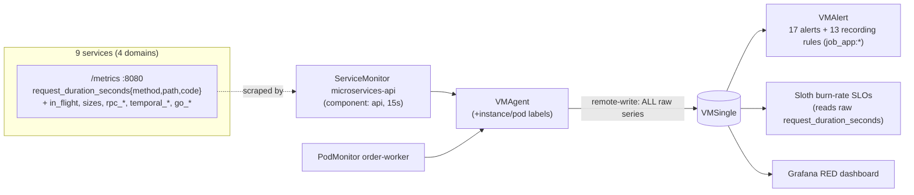
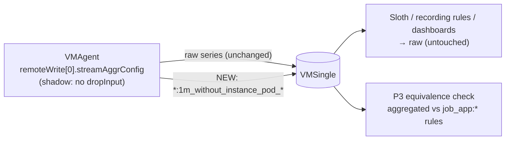
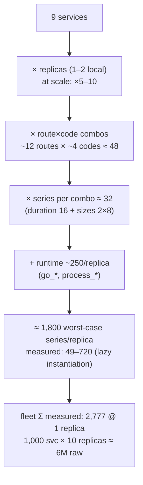
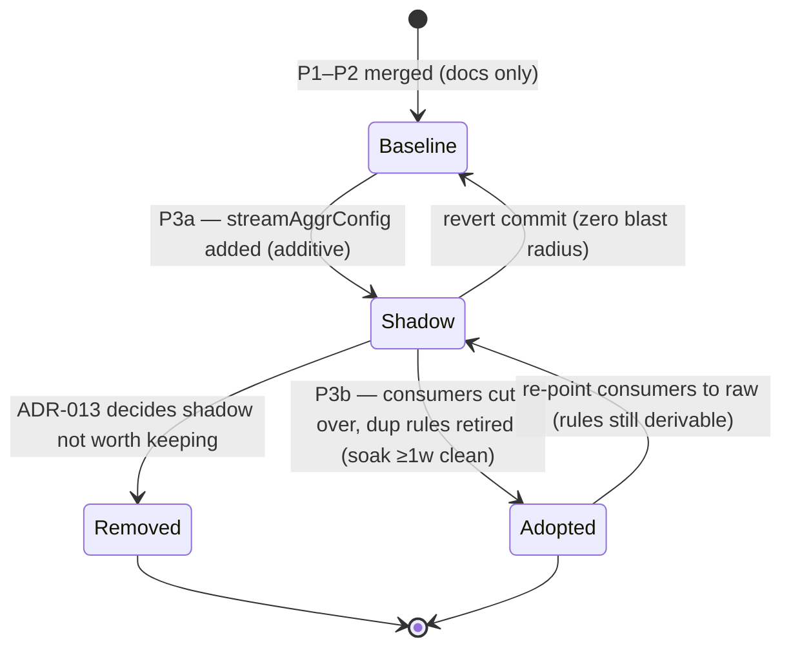

# RFC-0013 Application-metrics cardinality audit & streaming-aggregation scale playbook

| Status | Scope | Created | Last updated |
|--------|-------|---------|--------------|
| superseded (metric naming) | platform-wide | 2026-07-07 | 2026-07-09 |

> **⚠️ Superseded by [RFC-0014](../RFC-0014/) (P3 cutover, 2026-07-09).** The metric
> names, labels, and streaming-aggregation match patterns below reflect the
> **pre-cutover** client_golang world (`request_duration_seconds{method,path,code}`,
> `job="microservices"`, `requests_in_flight`). The platform now emits semconv
> names over OTLP (`http_server_request_duration_seconds`, labels
> `http_request_method`/`http_route`/`http_response_status_code`, no `job`). This
> RFC is preserved **as the historical audit record** — its findings and rubric
> stand; do not read its queries as current. For the live streaming-aggregation
> pattern on the new names see
> [streaming-aggregation.md](../../../observability/metrics/streaming-aggregation.md).

> **Progress**: P1 (audit + standard hardening) and P2 (scale playbook) land with
> this RFC. P3a/P3b (homelab shadow pilot → adopt) and P4 (remediation) are
> follow-up PRs. See the phase table in Design Details.

> **Don't forget: every decision is a tradeoff.** The homelab does **not** have a
> cardinality problem today (~3k app series; VMSingle idles). This RFC exists to
> (a) verify our instrumentation earns that state, and (b) build — to the
> production-match bar — the playbook for the scale where the problem is real.

## Summary

Two connected deliverables. **Part A — audit:** measure and grade the custom
app-layer metrics of all 9 Go services against the platform's written standard
([metrics-apps.md](../../../observability/metrics/metrics-apps.md)) and
Prometheus label-hygiene rules; every defect found is described here with a
scheduled fix. **Part B — scale playbook:** the cardinality math that predicts
where the current pipeline breaks (100 → 1,000 services), and the streaming-
aggregation architecture on the VictoriaMetrics stack that production platforms
use past that point — captured as an evergreen doc
([streaming-aggregation.md](../../../observability/metrics/streaming-aggregation.md))
plus a bounded, additive **shadow pilot** on the homelab's own VMAgent, rolled
out the way a real production would (shadow → verify → cutover).

## Motivation

A time-series database prices **label combinations**, not metrics. App-side
hygiene decides what one replica emits; at fleet scale the dominant multipliers
(`instance`/`pod` × replicas × deploy churn) are outside application code and
can only be controlled in the pipeline. This platform mirrors production
practice for learning: the audit proves (or fixes) the hygiene layer we own,
and the playbook + pilot exercise the pipeline layer we haven't needed yet —
on our real GitOps stack, not a throwaway demo.

### Goals

- A written rubric; every custom app metric gets a **verdict** against it.
- Every defect found is **described in this RFC with a fix phase** (D-table).
- A **measured** cardinality baseline (no estimates where measurement exists).
- The break-point math at 9 / 100 / 1,000 services, derivable from our numbers.
- An at-scale design on the VM stack (two-tier vmagent streaming aggregation).
- A homelab pilot that **cannot break** Sloth SLOs, recording rules, or
  dashboards (additive-only invariant), promoted production-style.

### Non-Goals

- Deploying the two-tier router/aggregator fleet in the homelab (paper design;
  the single-vmagent pilot exercises the same semantics safely).
- Replicating any specific company's stack 1:1 (StatsD/OTLP ingestion paths,
  vendor backends).
- VMSingle → VMCluster migration; retention/downsampling policy.
- New business/DB/cache instrumentation (tracked separately).
- Extracting the copy-pasted middleware into `pkg` — named here as root-cause
  remediation (D3) but a cross-9-repo effort tracked outside this RFC.

## Proposal

**Part A.** Grade each custom metric family on a 10-dimension rubric
(§ Design Details A): label boundedness, type correctness, naming, bucket
consistency, drift, scrape hygiene, exemplars, aggregation-first usage,
coverage completeness, measured cardinality. Findings carry severities
(Critical / Required / Consider / Nit) and each maps to a fix phase.

**Part B.** Adopt [streaming-aggregation.md](../../../observability/metrics/streaming-aggregation.md)
as the platform's at-scale playbook, and validate its mechanics in the homelab
with a shadow pilot: the existing VMAgent CR gains a `streamAggrConfig` that
*adds* fleet-level aggregated series (`*:1m_without_instance_pod_*`) next to
the raw ones. After an equivalence soak against the `job_app:*` recording
rules, consumers may be cut over (P3b) — or the shadow is removed and the
learning recorded either way (ADR-013).

### User Stories

- As the platform operator, I can state the exact series cost of adding one
  endpoint, one replica, or one service — and point at the measured table.
- As an SRE facing a 1,000-service fleet, I can walk the decision flowchart and
  justify recording rules vs relabel drops vs streaming aggregation vs the
  two-tier pattern, and know the histogram/sharding invariants by name.
- As a reviewer, I can reject a PR that adds an unbounded label by citing the
  forbidden-label list in the standard.

### Alternatives

- **Recording rules only** (status quo). Computed *after* ingestion: storage
  pays for raw cardinality first, and rules add series on top. Right at our
  scale — that is why the pilot only *shadows* them — but a cost amplifier at
  fleet scale. Rejected as the scale answer, kept as the query-shaping layer.
- **Relabel-drop `instance` at scrape time.** Aggregation-by-deletion: replica
  samples collide last-write-wins into corrupt series. Only valid for series
  discarded entirely. Rejected.
- **Scale storage horizontally instead** (VMCluster/Thanos/Mimir). Scales the
  bill for series nobody queries; needed eventually for HA/retention, but
  orthogonal to signal cost. Rejected as the answer to cardinality.
- **Client-side (StatsD-style) pre-aggregation.** Moves state into app
  processes, loses pull-model health signals and exemplars, adds a protocol.
  Rejected.
- **Do nothing until it hurts.** Cheapest today; forfeits the learning goal and
  leaves the audit defects unfixed. Rejected.

## Architecture & Diagrams

Current pipeline (all raw series reach storage; aggregation happens only at
query/rule-eval time):



Pilot (P3a) — shadow aggregation is **additive**; every existing consumer keeps
reading raw series:



Where the series count comes from — the multiplication chain, with this
platform's measured numbers:



## Design Details

### A. Audit

#### Rubric (10 dimensions)

1. **Label boundedness** — every label value set has a structural bound
   (`method` ≤ HTTP verbs; `path` = registered route templates via
   `c.FullPath()` + `"unknown"` fallback; `code` ≤ observed statuses).
   Forbidden as labels: `user_id`, `request_id`/`trace_id`, `session_id`,
   `email`, raw URL/path, order/cart/payment IDs, pod UID, image SHA.
2. **Metric type correctness** — counter/gauge/histogram matches semantics.
3. **Naming** — base units + `_seconds`/`_bytes` suffixes; `_total` only on
   counters; the name states the thing measured, not its rate.
4. **Histogram bucket consistency** — one canonical fleet bucket set,
   bracketing the 500ms SLO threshold.
5. **Duplication/drift** — the 9 middleware copies must be byte-identical
   (CRLF-normalized) to the reference; drift is a finding even if "fine".
6. **Scrape hygiene** — one `job`, correct relabels, justified interval;
   runtime `go_*`/`process_*` assessed (kept: they feed leak/GC alerts).
7. **Exemplars** — on histograms only, carrying `traceID`.
8. **Aggregation-first** — every label is consumed by ≥1 rule/dashboard/alert;
   a label nobody groups by is cardinality without a customer.
9. **Coverage completeness** — all 9 services present in scrape selector,
   recording rules, alerts, SLOs.
10. **Measured cardinality** — live series counted, not estimated.

#### Baseline (measured 2026-07-06, local-stack, 1 replica/service, real traffic)

| Service | Series/replica | Dominant extras |
|---|---|---|
| cart | 720 | most route×code combos materialized |
| product | 530 | 51 `rpc_client_*` |
| notification | 410 | |
| auth | 392 | |
| order | 382 | 76 `temporal_*` |
| user | 135 | |
| shipping | 83 | gRPC-only traffic so far |
| review | 66 | 〃 |
| payment | 49 | 〃 |
| **Σ apps** | **2,777** | lower bound — histogram label sets materialize lazily |

Worst-case bound ≈ **1,800/replica** (48 combos × 32 series + ~250 runtime).
The documented "~2,400 fleet" figure in `metrics-apps.md` predates payment and
is already exceeded at 1 replica — corrected in P1.

#### Verdicts

| Metric family | Labels | Type | Naming | Bounded | Fleet-consistent | Verdict |
|---|---|---|---|---|---|---|
| `request_duration_seconds` | method, path, code | ✅ histogram | ✅ | ✅ | ✅ | **pass** |
| `requests_in_flight` | method, path | ✅ gauge | ✅ | ✅ | ✅ | **pass** |
| `request_size_bytes` / `response_size_bytes` | method, path, code | ✅ histogram | ✅ | ✅ | ✅ | **pass-with-notes** — only `_sum` is consumed (bandwidth rules); the 12 `_bucket` series/combo have no consumer today (rubric #8). Candidate to slim when the middleware is centralized (D3). |
| `rpc_server_*` / `rpc_client_*` (otelgrpc) | rpc_service, rpc_method, status code | ✅ | OTel conv. | ✅ | ✅ | **pass-with-notes** — no rule/alert consumes them yet (known gap, out of scope here) |
| `temporal_*` (SDK) | SDK-defined | ✅ | SDK conv. | ✅ | ✅ | **pass** |
| `go_*` / `process_*` | target only | ✅ | ✅ | ✅ | ✅ | **pass** — consumed by runtime alerts |

Headline: **the platform passes the article-grade hygiene test** — route
templates everywhere, no request-scoped IDs, bounded label sets. The remaining
defects are coverage/doc-accuracy issues, not cardinality bombs.

#### Defects (each with its fix phase)

| # | Severity | Defect | Fix |
|---|---|---|---|
| **D1** | Required | `MicroserviceHighRestartRate` hardcodes 8 namespaces — **payment missing** (`kubernetes/infra/configs/observability/metrics/prometheusrules/microservices/alerts.yaml:44`). Payment pod crash-loops would never fire this alert. Fix: add payment; prefer deriving from a label over a hardcoded list. | P4 (homelab) |
| **D2** | Required | Stale "8 services" headers in the rule manifests (`alerts.yaml`/`recording-rules.yaml`) after payment landed (RFC-0010 P5); the prose docs were swept separately. Contested leftover: SLO docs say "payment ships no SLO yet", but `checkout-rs.yaml` applies `slo.enabled: true` unconditionally to every service it renders — payment included — which would make it 9 × 3 = 27 SLOs. Fix: correct the manifest headers to 9 and verify the rendered `PrometheusServiceLevel` set at the next cluster bring-up, then align the SLO counts (24 vs 27) to reality. | P4 (docs) |
| **D3** | Consider | `middleware/prometheus.go` is copy-pasted across 9 repos with no drift guard. Fix direction: extract to a shared package in `duynhlab/pkg` (e.g. `pkg/metricsx`) and harden the reference while at it (bound the `method` label to known verbs, `defer` the in-flight `Dec()`, skip negative `ContentLength` observations) — **tracked as a follow-up `TODO.md` item, not a phase here** (cross-9-repo effort). *Update 2026-07-08: superseded by [RFC-0014](../RFC-0014/) D-11 — `pkg/obsx` v2 `SetupObservability` absorbs this with wider scope.* | Follow-up |
| **D4** | Required | Standard doc inaccuracies: fleet series figure (~2,400) stale vs measured 2,777 @ 1 replica; canonical bucket set and forbidden-label list exist only implicitly in a code snippet; exemplar status contradicted between `TODO.md` ("not wired in Grafana") and `metrics-apps.md` ("configured"). Fix: amend `metrics-apps.md` (this PR) — measured table, canonical bucket constant, forbidden-label list, no-drift rule; reconcile the exemplar claim to "emitted by services; Grafana exemplar display pending" pointing at `TODO.md`. | **P1 ✅ (this PR)** |
| **D5** | Consider | local-stack spanmetrics series carry unbounded-over-time resource labels (`process_pid`, `process_command_args`, `host_name`, `os_description`, …) via `resource_to_telemetry_conversion` — every container restart re-mints all 1,846+ series (order alone). Local-stack-only (cluster path uses Tempo), but it is a live example of the churn class this RFC is about. Fix: allowlist spanmetrics dimensions / drop resource conversion in the local-stack collector. | P4 (local-stack) |

### B. Cardinality math (headline)

Full derivation in the [playbook](../../../observability/metrics/streaming-aggregation.md#the-cardinality-math);
the operative table, using a conservative 600 realized series/replica:

| Fleet | Raw active series | Samples/s | With `instance` aggregated away |
|---|---|---|---|
| 9 services × 1–2 (today) | ~3k | ~200 | pointless — multiplier is 1–2 |
| 100 × 5 | ~300k | ~20k | ~60k |
| 1,000 × 10 | **~6M (+churn)** | ~400k | ~600k |

The per-instance dimension is paid on 100% of series and queried on ~1%; at
1,000 services it is a ×10 storage/index multiplier. That asymmetry — not raw
service count — is the streaming-aggregation trigger.

### C. At-scale design

Adopted as the evergreen playbook doc: two-tier vmagent (stateless consistent-
hash routers via `shardByURL`/`ignoreLabels` → stateful aggregator StatefulSet
running `streamAggr` stripping `instance`/`pod`) in front of clustered storage,
with the histogram/sharding invariants and failure modes documented there.
The RFC does not duplicate it; see
[streaming-aggregation.md](../../../observability/metrics/streaming-aggregation.md).

### D. Homelab pilot

Single vmagent = single aggregator, so every sharding invariant holds
trivially; what the pilot exercises is the **semantics** (rule shape, output
naming, counter/gauge/histogram handling, self-metrics, GitOps rollout) and
the **process** (shadow → verify → cutover), which is precisely what transfers
to the at-scale design.

**P3a (shadow)** — one field on the existing CR
(`kubernetes/infra/configs/observability/metrics/victoriametrics/vmagent.yaml`):

```yaml
spec:
  remoteWrite:
    - url: "http://vmsingle-victoria-metrics.monitoring.svc:8428/api/v1/write"
      streamAggrConfig:          # SHADOW: additive; no dropInput, no keep_metric_names
        rules:
          - match: '{__name__=~"request_duration_seconds(_bucket|_count|_sum)", job="microservices"}'
            interval: 1m
            without: [instance, pod]
            outputs: [total]
          - match: '{__name__="requests_in_flight", job="microservices"}'
            interval: 1m
            without: [instance, pod]
            outputs: [avg, max]
```

Safety invariants (violating any is a P3 blocker): no `dropInput`; no
`keep_metric_names`; `_bucket`/`_count`/`_sum` in one rule (same `without`);
match scoped to `job="microservices"` only. Gate before applying: verify the
deployed CRD accepts the field —
`kubectl explain vmagent.spec.remoteWrite.streamAggrConfig --recursive`.

**P3b (adopt, gated on soak)** — production-style cutover, same shape as the
`PAYMENT_ENABLED` rollout: after ≥1 week of clean equivalence, switch the
fleet-level `job_app:*` recording-rule consumers (dashboard panels) to the
aggregated series and retire the duplicated rules — or decide the shadow isn't
worth keeping at this scale and remove it. Either outcome is recorded as
**ADR-013**.

**Enable/disable**: one Flux-reconciled field; revert commit = rollback; raw
series untouched in shadow. **Operator visibility**: `vm_streamaggr_*`
self-metrics on the vmagent scrape. **Drawbacks**: aggregation state is
RAM-resident (restart loses a window); aggregated outputs carry no exemplars;
one more config surface on the CR.

### Phases

| Phase | Scope | Repos touched |
|-------|-------|---------------|
| **P1 — Audit & standard hardening ✅ (this PR)** | Rubric, measured baseline, verdicts, D-table (all above); amend `metrics-apps.md`: canonical bucket set, forbidden-label list, no-drift rule, measured numbers, exemplar-claim reconciliation (D4). *Exit: every custom metric has a verdict; amendments merged.* | homelab (docs) |
| **P2 — Scale playbook ✅ (this PR)** | `docs/observability/metrics/streaming-aggregation.md` + index wiring. *Exit: doc merged, diagrams render, marked not-deployed.* | homelab (docs) |
| **P3a — Shadow pilot** | `streamAggrConfig` on the VMAgent CR as specified; verification protocol below. *Exit: aggregated series present without `instance`/`pod`; raw counts unchanged; `vm_streamaggr_*` healthy; 1-week equivalence soak vs `job_app:*` within tolerance.* | homelab (kubernetes) |
| **P3b — Adopt or remove (gated)** | Cut fleet-level consumers over to aggregated series and retire duplicated recording rules, **or** remove the shadow; spawn **ADR-013** with the decision + numbers. *Exit: ADR-013 merged; VMAlert zero rule-eval errors; Sloth SLO series advancing.* | homelab |
| **P4 — Remediation** | D1 payment regex, D2 manifest-header sweep + SLO-count verification, D5 spanmetrics dimensions. *Exit: payment matched by restart alert; stale "8 services" grep empty in manifests; SLO count claim verified against rendered CRs.* | homelab |

## Security considerations

None beyond the audit's own control: the forbidden-label list is also a data-
hygiene rule (label values surface in dashboards, alerts, and URLs — no PII,
no tokens, no user identifiers in metric labels). The pilot adds no ports,
components, or privileges; Kyverno/PSS posture unchanged.

## Observability & SLO impact

This RFC is *about* observability; its own blast radius is deliberately zero:

- **Sloth SLOs, the 17 threshold alerts, all 13 recording rules, and the RED
  dashboard read raw `request_duration_seconds*` — the shadow pilot never
  renames, drops, or alters raw series** (additive-only invariant).
- Default streamAggr output naming guarantees new, collision-free metric names.
- New self-metrics to watch during P3: `vm_streamaggr_matched_samples_total`,
  `vm_streamaggr_flushed_samples_total`, `vm_streamaggr_ignored_samples_total`,
  `vm_streamaggr_samples_lag_seconds`.
- Net new cardinality from the shadow: ≈ the `job_app_path:*` footprint
  (hundreds of series) — negligible at homelab scale, and itself part of the
  measurement.

## Rollout & rollback



Blast radius: P1/P2 none (docs). P3a additive; rollback = revert. P3b touches
dashboard queries + recording rules; raw series still exist, so rollback is
re-pointing queries, not data recovery. P4 is a bug-fix batch with its own
tests.

## Testing / verification

**P1 (done for this RFC):** middleware copies diffed CRLF-normalized against
the order-service reference; series measured live via `/api/v1/query`
`count({__name__!=""}) by (job)` and per-service `/metrics` line counts; route
counts grepped per repo (11–17).

**P3a protocol:**

1. Gate: `kubectl explain vmagent.spec.remoteWrite.streamAggrConfig` on the
   deployed CRD.
2. Before: record `count({__name__!=""})` total and per-`app` series.
3. Apply; confirm new series:
   `count({__name__=~"request_duration_seconds.*:1m_without_instance_pod_total"})`
   \> 0 and **zero** of them carry `instance`/`pod`.
4. Raw unchanged: repeat (2); counts equal (± normal churn).
5. Health: `vm_streamaggr_matched_samples_total` rising;
   `ignored_samples_total{reason="too_old"}` ≈ 0; lag p99 ≪ 60s.
6. Equivalence (1h window, then 1-week soak):
   `sum by (app) (rate(request_duration_seconds_count:1m_without_instance_pod_total[5m]))`
   vs `sum by (app) (job_app:request_duration_seconds:rate5m)` — document the
   flush-alignment skew observed; alert-grade tolerance ±5%.
7. Consumers: VMAlert reports zero rule-eval errors; Sloth SLO recording
   series advancing; RED dashboard spot-check.

**P4:** `promtool`-style rule lint via `make validate`; grep sweep for
`"8 services"`/`8 Go microservices` in monitoring manifests returns only
historical (CHANGELOG/RFC) hits; `kubectl get prometheusservicelevels -A`
settles the 24-vs-27 SLO count (D2).

## Implementation History

- 2026-07-06 — baseline measured (local-stack, 1 replica each): per-service
  series 49–720, Σ 2,777.
- 2026-07-07 — RFC created; P1 audit + `metrics-apps.md` amendments + P2
  playbook land in the same PR.

> **Interaction with [RFC-0014](../RFC-0014/) (2026-07-08):** the P3a/P3b
> shadow pilot proceeds unchanged while RFC-0014 dual-emits (the old metric
> family stays alive through its P3); the pilot's match pattern is rewritten
> to `http_server_request_duration_seconds.*` at RFC-0014 P5. D3 is superseded
> by RFC-0014 D-11; this RFC's P4 manifest-header sweep folds into RFC-0014 P5.

## Related

- [streaming-aggregation.md](../../../observability/metrics/streaming-aggregation.md) — P2 deliverable (playbook)
- [metrics-apps.md](../../../observability/metrics/metrics-apps.md) — the standard; P1 amendments
- [metrics hub](../../../observability/metrics/README.md) · [alerting](../../../observability/alerting/README.md) (2-layer model — streaming aggregation complements, does not replace it)
- RFC-0010 (rollout-pattern precedent: flagged shadow → verify → cutover → cleanup)
- ADR-013 — to be spawned by P3b with the adopt/remove decision
- Follow-up tracker (D3): extract shared metrics middleware into `duynhlab/pkg` + harden the reference (method-label allowlist, deferred in-flight `Dec()`, negative-`ContentLength` guard)

---
_Last updated: 2026-07-09_
